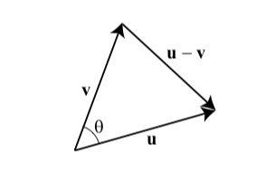

# (PART) SVM & Neural Networks {-}

The reason that these two most advance learning algorithms are put together in this section is that both methods, Support Vector Machines (SVM) and Neurol Networks (NN), have similarities in terms of their predictive power and explanatory capability (incapability, rather).  The first similarity is the fact that both algorithms are parametric but for different reasons. In this sense, the two models are similar insofar as they are both parametric, but dissimilar with regards to the type and number of parameters that they require.

Both machine learning algorithms embed non-linearity. This is done, in the case of SVMs, through the usage of a kernel method. Neural networks, instead, embed non-linearity by using non-linear activation functions. Both classes of algorithms can, therefore, approximate non-linear decision functions, though with different approaches.

Both SVMs and NNs can tackle the same problem of classification against the same dataset. This means that there’s no reason that derives from the characteristics of the problem for preferring one over the other.

What’s more important, though, is that they both perform with comparable accuracy against the same dataset, if given comparable training. If given as much training and computational power as possible, however, NNs tend to outperform SVMs.

As we’ll see in the next section, though, the time required to train the two algorithms is vastly different for the same dataset.

# Support Vector Machines

Up to this point we have seen "probabilistic" binary classifiers, such as kNN, CART, Ensemble models, and classification regressions (logistic , LPM), where probabilistic predictions are made on observations and then converted to binary predictions based a tuned discriminating threshold.   Support-vector machines do not use probabilistic predictions to classify the outcomes, which is inspired from one of the oldest algorithms in machine learning introduced by Rosenblatt in 1958, *the perceptron algorithm*, for learning a linear classifier. Support Vector Machine (SVM) is a modern approach to linear separation.   Here is the history and little introduction to SVM by Wikipedia:

> In machine learning, support-vector machines are supervised learning models with associated learning algorithms that analyze data for classification and regression analysis. Developed at AT&T Bell Laboratories by Vladimir Vapnik with colleagues (Boser et al., 1992, Guyon et al., 1993, Cortes and Vapnik, 1995, Vapnik et al., 1997) SVMs are one of the most robust prediction methods, being based on statistical learning frameworks or VC theory proposed by Vapnik (1982, 1995) and Chervonenkis (1974). Given a set of training examples, each marked as belonging to one of two categories, an SVM training algorithm builds a model that assigns new examples to one category or the other, making it a non-probabilistic binary linear classifier (although methods such as Platt scaling exist to use SVM in a probabilistic classification setting). SVM maps training examples to points in space so as to maximise the width of the gap between the two categories. New examples are then mapped into that same space and predicted to belong to a category based on which side of the gap they fall.
>
  
We will develop our discussion in this chapter on two cases: a linear class boundary (Optimal Separating Classifier) and a non-linear class boundary (Support-Vector Machines).  First section has no practical importance as (when) we usually face non-linear class boundary problems in real life.  However, it will help us build SVM step by step.

We will use a simplifying assumption here to start with: the classes are perfectly linearly separable at the data points by using a single straight line. Thus we have two predictors: $x_1$ and $x_2$.  Let's look at an example:

```{r sv1}
y <- c(1,1,0,0,1,0,1,1,0,0)
x1 <- c(0.09,0.11, 0.17, 0.23, 0.33,0.5, 0.54,0.65,0.83,0.78) 
x2 <- c(0.5,0.82, 0.24, 0.09,0.56, 0.40, 0.93, 0.82, 0.3, 0.72)

data <- data.frame("y" = y, "x1" = x1, "x2" = x2)
plot(data$x1, data$x2, col = (data$y+1), lwd = 4,
     xlab = "x1", ylab = "x2")
```

Can we come up with a boundary (line) that separates blacks from reds? 

```{r sv2}
plot(data$x1, data$x2, col = (data$y+1), lwd = 4,
     xlab = "x1", ylab = "x2")
abline(a = 0.29, b = 0.6, col = "orange",lwd = 2)
```

We call this line a hyperplane (well, in a 2-dimensional case it's a line) that separates blacks from reds.  Let's mathematically define it:
  
$$
\beta_{0}+X_{1} \beta_{1}+X_{2} \beta_{2} = 0
$$
  
Hence, the "line":

$$
X_{2}=-\hat{\beta}_{0} / \hat{\beta}_{2}-\hat{\beta}_{1} / \hat{\beta}_{2} X_{1} .
$$
And the classiciation rule after getting the "line" is simple

$$
\beta_{0}+X_{1} \beta_{1}+X_{2} \beta_{2}>0 \text { (red) } \text { or }<0 \text { (black) }
$$

As soon as we come up with the line, the classification is simple.  But, we have two questions to answer: (1) How are we going to derive the line from the data? (2) How can we decide which line among many alternatives, which give the same classification score on the training data, is the best in terms of generalization (a better prediction accuracy on different observations).  There are many possible hyperplanes with the same classification score:

```{r sv3}
plot(data$x1, data$x2, col = (data$y+1), lwd = 4,
     xlab = "x1", ylab = "x2")
abline(a = 0.29, b = 0.6, col = "blue", lwd = 2)
abline(a = 0.20, b = 0.8, col = "orange", lwd = 2)
abline(a = 0.10, b = 1.05, col = "green", lwd = 2)
abline(a = 0.38, b = 0.47, col = "brown", lwd = 2)
```

The orange line in our example is

$$
-0.87-1.8X_{1}+3X_{2} = 0, \\
X_{2}=0.29 - 0.60 X_{1}
$$
  
## Optimal Separating Classifier

We start with a decision boundary separating the dataset and satisfying:

$$
\mathbf{w} \cdot \mathbf{x}+b=0,
$$
  
where $\mathbf{w}$ is the vector of weights (coefficients) and $b$ is the intercept.  We use $\mathbf{w} \cdot \mathbf{x}$ with a dot product, instead of $\mathbf{w}^{T} \mathbf{x}$. We can select two others hyperplanes $\mathcal{H}_{1}$ and $\mathcal{H}_{0}$ which also separate the data and have the following equations :
  
$$
\mathbf{w} \cdot \mathbf{x}+b=\delta \\
\mathbf{w} \cdot \mathbf{x}+b=-\delta
$$
  
We define the the decision boundary, which is equidistant from $\mathcal{H}_{1}$ and $\mathcal{H}_{0}$.  For now, we can arbitrarily set $\delta=1$ to simplify the problem.
  
$$
\mathbf{w} \cdot \mathbf{x}+b=1 \\
\mathbf{w} \cdot \mathbf{x}+b=-1
$$

Here is our illustration:  

```{r sv4, echo=FALSE}
plot(data$x1, data$x2, col = (data$y+1), lwd = 4,
     xlab = "x1", ylab = "x2")
abline(a = 0.30, b = 0.8, col = "red", lty = 5, lwd = 2)
text(0.4, 0.65, "H1", col = "red")
abline(a = 0.20, b = 0.8, col = "gray", lwd = 2)
text(0.3, 0.45, "Boundary", col = "gray")
abline(a = 0.10, b = 0.8, col = "black", lty = 5, lwd = 2)
text(0.4, 0.45, "H0", col = "black")
arrows(x0 = 0.483,
       y0 = 0.587,
       x1 = 0.47,
       y1 = 0.66, lwd = 2,
       col = "blue",
       length = 0.1, code =1)
text(0.55, 0.64, "Margin - 'm'", col = "blue")
```
  
Plot shows the following lines: $\mathcal{H}_{1}$: $\mathbf{w} \cdot \mathbf{x}+b=1$; $\mathcal{H}_{0}$: $\mathbf{w} \cdot \mathbf{x}+b=-1$; Decision Boundary: $\mathbf{w} \cdot \mathbf{x}+b=0.$ 
  
The data points lying on $\mathcal{H}_{1}$ (2 reds) or $\mathcal{H}_{0}$ (2 blacks) are called **support vectors** and only these points influence the decision boundary!  The **margin** ($m$), which is a perpendicular line (arrow), is defined as the perpendicular distance from the points on the dash lines ($\mathcal{H}_{1}$ and $\mathcal{H}_{0}$) to the boundary (gray line).  Since all these margins would be equidistant, both definitions of $m$ would measure the same magnitude.       

Our job is to find the maximum margin.  The model is invariant with respect to the training set changes, except the changes of support vectors. If we make a small error in estimating the boundary, the classification will likely stay correct.

Moreover, the distance of an observation from the hyperplane can be seen as a measure of our confidence that the observation was correctly classified.

### The Margin

In order to understand how we can find the margin, we will use a bit vector algebra.  Let's start defining the vector normal

Let $\mathbf{u}=\left\langle u_{1}, u_{2}, u_{3}\right\rangle$ and $\mathbf{v}=\left\langle v_{1}, v_{2}, v_{3}\right\rangle$ be two vectors with a common initial point.  Then $\mathbf{u}, \mathbf{v}$ and $\mathbf{u}-\mathbf{v}$ form a triangle, as shown.

```{r sv5, echo=FALSE, out.width = '115%', out.height='115%'}

```  

By the Law of Cosines,
  
$$
\|\mathbf{u}-\mathbf{v}\|^{2}=\|\mathbf{u}\|^{2}+\|\mathbf{v}\|^{2}-2\|\mathbf{u}\|\|\mathbf{v}\| \cos \theta
$$
where $\theta$ is the angle between $\mathbf{u}$ and $\mathbf{v}$. Note that $\|\mathbf{u}\|$ is representing the vector norm. Using the formula for the magnitude of a vector, we obtain

$$
\left(u_{1}-v_{1}\right)^{2}+\left(u_{2}-v_{2}\right)^{2}+\left(u_{3}-v_{3}\right)^{2}=\left(u_{1}^{2}+u_{2}^{2}+u_{3}^{2}\right)+\left(v_{1}^{2}+v_{2}^{2}+v_{3}^{2}\right)-2\|\mathbf{u}\|\|\mathbf{v}\| \cos \theta \\
u_{1} v_{1}+u_{2} v_{2}+u_{3} v_{3}=\|\mathbf{u}\|\|\mathbf{v}\| \cos \theta \\
\mathbf{u} \cdot \mathbf{v}=\|\mathbf{u}\|\|\mathbf{v}\| \cos \theta\text {. }
$$

Suppose that two nonzero vectors $\mathbf{u}$ and $\mathbf{v}$ have an angle between them, $\theta=\pi / 2$. That is, $\mathbf{u}$ and $\mathbf{v}$ are perpendicular, or orthogonal. Then, we have

$$
\mathbf{u} \cdot \mathbf{v}=|\mathbf{u}||\mathbf{v}| \cos \frac{\pi}{2}=0
$$

In other words, if $\mathbf{u} \cdot \mathbf{v}=0$, then we must have $\cos \theta=0$, where $\theta$ is the angle between them, which implies that $\theta=\pi / 2$ (remember $\operatorname{Cos} 90^{\circ}=0$). In summary, $\mathbf{u} \cdot \mathbf{v}=0$ if and only if $\mathbf{u}$ and $\mathbf{v}$ are orthogonal.

Using this fact, we can see that the vector $\mathbf{w}$ is perpendicular (a.k.a "normal") to $\mathcal{H}_{1}$, $\mathbf{w} \cdot \mathbf{x}+b=0.$  Consider the points $x_{a}$ and $x_{b}$, which lie on $\mathcal{H}_{1}$. This gives us two equations:

$$
\begin{aligned}
&\mathbf{w} \cdot \mathbf{x}_a+b=1 \\
&\mathbf{w} \cdot \mathbf{x}_b+b=1
\end{aligned}
$$
  
Subtracting these two equations results in $\mathbf{w} .\left(\mathbf{x}_{a}-\mathbf{x}_{b}\right)=0$. Note that the vector $\mathbf{x}_{a}-\mathbf{x}_{b}$ lies on $\mathcal{H}_{1}$. Since the dot product $\mathbf{w} .\left(\mathbf{x}_{a}-\mathbf{x}_{b}\right)$ is zero, $\mathbf{w}$ must be orthogonal to $\mathbf{x}_{a}-\mathbf{x}_{b},$ thus, to $\mathcal{H}_{1}$ as well.  This can be repeated for the decision boundary or $\mathcal{H}_{0}$ too.

```{r sv6, echo=FALSE}
plot(data$x1, data$x2, col = (data$y+1), lwd = 4,
     xlab = "x1", ylab = "x2")
abline(a = 0.30, b = 0.8, col = "red", lty = 5, lwd = 2)
text(0.4, 0.65, "H1", col = "red")
abline(a = 0.20, b = 0.8, col = "gray", lwd = 2)
text(0.3, 0.45, "Boundary", col = "gray")
abline(a = 0.10, b = 0.8, col = "black", lty = 5, lwd = 2)
text(0.4, 0.45, "H0", col = "black")
arrows(x0 = 0.481,
       y0 = 0.587,
       x1 = 0.47,
       y1 = 0.66, lwd = 2, col = "blue", length = 0.1)
text(0.55, 0.64, "Margin - 'm'", col = "blue")
arrows(x0 = 0.565,
       y0 = 0.76,
       x1 = 0.54,
       y1 = 0.90, lwd = 2, col = "darkgreen", length = 0.15)
text(0.53, 0.80, "w", col = "darkgreen")
```
  
Let's define a unit vector of $\mathbf{w}$

$$
\mathbf{u}=\frac{\mathbf{w}}{\|\mathbf{w}\|},
$$

where $\|\mathbf{w}\| = \sqrt{w_{1}^{2}+w_{2}^{2}} \dots=\sqrt{w_{1} w_{1}+w_{2} w_{2} \dots} = \mathbf{w}.\mathbf{w}$, which is called the magnitude (or length) of the vector. Since it is a unit vector ($\|\mathbf{u}\|=1$) and it has the same direction as $\mathbf{w}$ it is also perpendicular to the hyperplane.  If we multiply $\mathbf{u}$ by $m$, which is the distance from either hyperplanes to the boundary, we get the vector $\mathbf{k}=m \mathbf{u}$. We observed that $\|\mathbf{k}\|=m$ and $\mathbf{k}$ is perpendicular to $\mathcal{H}_{1}$ (since it has the same direction as $\mathbf{u}$).  Hence, $\mathbf{k}$ is the vector with the same magnitude and direction of $m$ we were looking for.  The rest will be relatively a simple algebra:

$$
\mathbf{k}=m \mathbf{u}=m \frac{\mathbf{w}}{\|\mathbf{w}\|}
$$

We start from a point, $\mathbf{x}_{0}$ on $\mathcal{H}_{0}$ and add $k$ to find the point $\mathbf{x^\prime}=\mathbf{x}_{0}+\mathbf{k}$ on the decision boundary, which means that $\mathbf{w} \cdot \mathbf{x^\prime}+b=0$.

$$
\begin{gathered}
\mathbf{w} \cdot\left(\mathbf{x}_{0}+\mathbf{k}\right)+b=0, \\
\mathbf{w} \cdot\left(\mathbf{x}_{0}+m \frac{\mathbf{w}}{\|\mathbf{w}\|}\right)+b=0, \\
\mathbf{w} \cdot \mathbf{x}_{0}+m \frac{\mathbf{w} \cdot \mathbf{w}}{\|\mathbf{w}\|}+b=0, \\
\mathbf{w} \cdot \mathbf{x}_{0}+m \frac{\|\mathbf{w}\|^{2}}{\|\mathbf{w}\|}+b=0, \\
\mathbf{w} \cdot \mathbf{x}_{0}+m\|\mathbf{w}\|+b=0, \\
\mathbf{w} \cdot \mathbf{x}_{0}+b= -m\|\mathbf{w}\|, \\
-1=-m\|\mathbf{w}\|, \\
m\|\mathbf{w}\|=1,\\
m=\frac{1}{\|\mathbf{w}\|}.
\end{gathered}
$$
One can easily see that the bigger the norm is, the smaller the margin become.  Thus, maximizing the margin is the same thing as minimizing the norm of $\mathbf{w}$.  Among all possible hyperplanes meeting the constraints, if we choose the hyperplane with the smallest $\|\mathbf{w}\|$,  it would be the one which will have the biggest margin^[Note that this result could have been different had we chosen $\delta$ different than 1.]. Finally, the above derivation can be written to find the distance between the decision boundary and any point ($\mathbf{x}$).  Supposed that $\mathbf{x^\prime}$ on the decision boundary:
  
$$
\begin{gathered}
\mathbf{x^\prime}=\mathbf{x}-\mathbf{k}, \\
\mathbf{w} \cdot \mathbf{x^\prime}+b=0, \\
\mathbf{w} \cdot\left(\mathbf{x}-m \frac{\mathbf{w}}{\|\mathbf{w}\|}\right)+b=0, \\
\mathbf{w} \cdot \mathbf{x}-m \frac{\mathbf{w} \cdot \mathbf{w}}{\|\mathbf{w}\|}+b=0, \\
\mathbf{w} \cdot \mathbf{x}-m \frac{\|\mathbf{w}\|^{2}}{\|\mathbf{w}\|}+b=0, \\
\mathbf{w} \cdot\mathbf{x}-m\|\mathbf{w}\|+b=0, \\
m=\frac{\mathbf{w} \cdot \mathbf{x^\prime}+b}{\|\mathbf{w}\|}, \\
m=\frac{\mathbf{w}}{\|\mathbf{w}\|} \cdot \mathbf{x}+\frac{b}{\|\mathbf{w}\|},
\end{gathered}
$$
  
which shows the distance between boundary and $\mathcal{H}_{1}$ is 1 as the result ($\mathbf{w} \cdot \mathbf{x}+b=1$) reveals^[The distance calculation can be generalized for any points such as $x_{1,0}$ and $x_{2,0}$: $d=\frac{\left|a x_{1,0}+b x_{2,0}+c\right|}{\sqrt{a^{2}+b^{2}}}.$  See the multiple proofs at Wikipedia: <https://en.wikipedia.org/wiki/Distance_from_a_point_to_a_line>]. Given the following hyperplanes,  
  
$$
\mathbf{w} \cdot \mathbf{x}+b=1, \\
\mathbf{w} \cdot \mathbf{x}+b=-1,
$$

we can write our decision rules as

$$
\mathbf{w} \cdot \mathbf{x}_i+b \geq 1 ~~\Longrightarrow ~~~ y_i = 1,\\
\mathbf{w} \cdot \mathbf{x}_i+b \leq-1 ~~\Longrightarrow ~~~ y_i = -1. 
$$

And, when we combine them, we can get a unique constraint:

$$
y_{i}\left(\mathbf{w} \cdot \mathbf{x}_{i}+b\right) \geq 1 ~~~~~\text { for all} ~~~ i
$$
  
Usually, it is confusing to have a fixed threshold, 1, in the constraint.  To see the origin of this, we define our optimization problem as

$$
\operatorname{argmax}\left(\mathbf{w}^{*}, b^{*}\right)~~ m ~~~~~\text {such that } ~~~~~ y_{i}(\mathbf{w} \cdot \mathbf{x}_{i}+b) \geq m.
$$
  
Since the hyperplane can be scaled any way we want:

$$
\mathbf{w} \cdot \mathbf{x}_{i}+b = 0 ~~~ \Rightarrow~~~ s\left(\mathbf{w} \cdot \mathbf{x}_{i}+b\right) = 0\\\text{where}~~~ s \neq 0.
$$
  
Hence, we can write
  
$$
\frac{1}{\|\mathbf{w}\|}(\mathbf{w} \cdot \mathbf{x}_{i}+b) =0.
$$
  
Therefore,

$$
\begin{gathered}
\frac{1}{\|\mathbf{w}\|}\mathbf{y}_{i}(\mathbf{w} \cdot \mathbf{x}_{i}+b) \geq m,\\
y_{i}(\mathbf{w} \cdot \mathbf{x}_{i}+b) \geq m\|\mathbf{w}\|\\
y_{i}\left(\mathbf{w} \cdot \mathbf{x}_{i}+b\right) \geq 1
\end{gathered}
$$

Finally, we can write our optimization problem as
  
$$
\operatorname{argmin}\left(\mathbf{w}^{*}, b^{*}\right) ~~ \|\mathbf{w}\| ~~~~\text {such that } ~~~~ \mathbf{y}_{i}(\mathbf{w} \cdot \mathbf{x}_{i}+b) \geq 1,
$$

which can be re-written as you will see it in the literature:

$$
\begin{array}{ll}
\underset{\mathbf{w}, b}{\operatorname{minimize}} & \frac{1}{2}\|\mathbf{w}\|^{2} \\
\text { subject to } & y_{i}\left(\mathbf{w} \cdot \mathbf{x}_{i}+b\right) \geq 1, \quad i=1, \ldots, n
\end{array}
$$

where squaring the norm has the advantage of removing the square root and $1/2$ helps solving the quadratic problem. All gives the same solution:

$$
\hat{f}(x) = \hat{\mathbf{w}} \cdot \mathbf{x}_{i}+\hat{b},
$$
  
which can be used for classifying new observation by $\text{sign}\hat{f}(x)$. A Lagrangian function can be used to solve this optimization problem.  We will not show the details of the solution process, but we will continue on with the non-separable case^[see Elements of Statistical Learning, Page 133 (Hastie et al., 2009).].  

Let's use `svm()` command from the `e1071` package for an example:

```{r sv7, warning=FALSE, message=FALSE}
library(e1071)

# Sample data - Perfectly separated
set.seed(1)
x <- matrix(rnorm(20 * 2), ncol = 2)
y <- c(rep(-1, 10), rep(1, 10))
x[y == 1, ] <- x[y == 1, ] + 2
dat <- data.frame(x = x, y = as.factor(y))

# Support Vector Machine model
mfit <- svm(y ~ .,
            data = dat,
            kernel = "linear",
            scale = FALSE)
summary(mfit)
plot(mfit,
     dat,
     grid = 200,
     col = c("lightgray", "lightpink"))
```

Points indicated by an “x” are the support vectors.  They directly affect the classification line. The points shown with an “o” don’t affect the calculation of the line. This principle distinguishes support vector method from other classification methods that use the entire data to fit the classification boundary. 

### The Non-Separable Case

What if we have cases like,

```{r sv8, echo=FALSE}
y <- c(1,1,0,0,1,0,1,1,0,1)
x1 <- c(0.09,0.11, 0.17, 0.23, 0.33,0.5, 0.54,0.65,0.83,0.78) 
x2 <- c(0.5,0.82, 0.24, 0.09,0.56, 0.40, 0.93, 0.82, 0.3, 0.52)

data1<- data.frame("y" = y, "x1" = x1, "x2" = x2)

y <- c(1,1,0,0,1,0,1,1,1,0)
x1 <- c(0.09,0.11, 0.17, 0.23, 0.33,0.5, 0.54,0.65,0.83,0.78) 
x2 <- c(0.5,0.82, 0.24, 0.09,0.56, 0.40, 0.93, 0.82, 0.3, 0.72)

data2 <- data.frame("y" = y, "x1" = x1, "x2" = x2)

par(mfrow=c(1,2)) 
plot(data1$x1, data1$x2, col = (data1$y+1), lwd = 2,
     xlab = "x1", ylab = "x2", main = "Separable with tight margin",
     cex.main = 0.8)
abline(a = 0.29, b = 0.45, col = "blue", lwd = 2)
abline(a = 0.41, b = 0.08, col = "orange", lwd = 2)
plot(data2$x1, data2$x2, col = (data2$y+1), lwd = 2,
     xlab = "x1", ylab = "x2", main = "Non-Separable without error ",
     cex.main = 0.8)
abline(a = 0.21, b = 0.77, col = "blue", lwd = 2)
```

In the first plot, although the orange boundary would perfectly separates the classes, it would be less "generalizable" (i.e., more specific to the train data means more prediction errors) than the blue boundary.  In the second plot, there doesn't exist a linear boundary without an error.  **If we can tolerate a mistake**, however, the blue line can be used as a separating boundary.  In both cases the blue lines could be the solution with some kind of "tolerance" level.  It turns out that, if we are able to introduce this "error tolerance" to our optimization problem described in the perfectly separable case, we can make the "Optimal Separating Classifier" as a trainable model by tuning the "error tolerance", which can be our hyperparameter.   This is exactly what we will do:

$$
\operatorname{argmin}\left(\mathbf{w}^{*}, b^{*}\right) \|\mathbf{w}\| ~~~~~~~\text {such that } ~~~~~~~ y_{i}(\mathbf{w} \cdot \mathbf{x}_{i}+b) \geq 1
$$

$$
\operatorname{argmin}\left(\mathbf{w}^{*}, b^{*}\right) \|\mathbf{w}\| \quad \text { such that }\left\{\begin{array}{l}
y_{i}(\mathbf{w} \cdot \mathbf{x}_{i}+b) \geq 1-\epsilon_{i} ~~~~\forall i \\
\epsilon_{i} \geq 0,~~~~ \sum \epsilon_{i} \leq C
\end{array}\right.
$$
where $\epsilon$ is the "tolarence" for an error and $C$ is a nonnegative hyperparameter.  The first constraint can be written as $y_{i}(\mathbf{w} \cdot \mathbf{x}_{i}+b) + \epsilon_{i} \geq 1$.  Remember that, by the nature of this constraint, the points well inside their class boundary will not play a roll in shaping the tolerance level.  This could be written another way:
  
$$
\min _{\mathbf{w} \in \mathbb{R}^{d}, b \in \mathbb{R}, \epsilon \in \mathbb{R}^{n}}\left\{\frac{1}{2}\|\mathbf{w}\|^{2}+C \sum_{i=1}^{n} \epsilon_{i}\right\}\\
\text {subject to} \\
y_{i} \cdot\left(\mathbf{w}^{T} \mathbf{x}_{i}+b\right) \geq 1-\epsilon_{i} ~~ \text{and} ~~ \epsilon_{i} \geq 0, ~~\forall i=1, \cdots, n.
$$
  
And as a maximization problem,
  
$$
\operatorname{argmax}\left(\mathbf{w}^{*}, b^{*}\right) ~m \quad \text { such that }\left\{\begin{array}{l}
y_{i}(\mathbf{w} \cdot \mathbf{x}_{i}+b) \geq m(1-\epsilon_{i}) ~~~~\forall i \\
\epsilon_{i} \geq 0,~~~~ \sum \epsilon_{i} \leq C
\end{array}\right.
$$
  
This approach is also called *soft margin classification* or *support vector classifier* in practice.  Although this setting will relax the requirement of a perfect separation, it still requires a linear separation. 

```{r sv9}
set.seed(1)
x <- matrix(rnorm(20 * 2), ncol = 2)
y <- c(rep(-1, 10), rep(1, 10))
x[y == 1, ] <- x[y == 1, ] + 1
dt <- data.frame(x = x, y = as.factor(y))

# C = 10
mfit10 <- svm(
  y ~ .,
  data = dt,
  kernel = "linear",
  scale = FALSE,
  cost = 10
)

plot(
  mfit10,
  dat,
  grid = 200,
  col = c("lightgray", "lightpink"),
  main = "C = 10"
)

# Tuning C
tuned <- tune(svm,
              y ~ .,
              data = dat,
              kernel = "linear",
              ranges = list(cost = c(0.001, 0.01, 0.1, 1, 5, 10, 100)))
(best <- tuned$best.model)

# Using tuned model on the whole data
yhat <- predict(best, dat)
(misclass <- table(predict = yhat, truth = dt$y))
```

We will now look at how we can introduce non-linearity to the class boundaries.     
  
## Nonlinear Boundary with Kernels

Many data sets are not linearly separable.  Although, adding polynomial features and interactions can be used, a low polynomial degree cannot deal with very complex data sets.  The support vector machine (SVM) is an extension of the "support vector classifier" that results from enlarging the feature space in a specific way, using kernels.  SVM works well for complex but small- or medium-sized data sets.

To demonstrate a nonlinear classification boundary, we will construct a new data set:

```{r sv10}
set.seed (1)
x <- matrix(rnorm(200*2), ncol = 2)
x[1:100, ] <- x[1:100, ] + 2
x[101:150, ] <- x[101:150, ] - 2
y <- c(rep(1,150), rep(2,50))

dt <- data.frame(x=x,y=as.factor(y))

plot(x[ ,1], x[ ,2], pch=16, col = y*2)
```

Notice that the data is not linearly separable and isn’t all clustered together in a single group either. We can of course make our decision boundary nonlinear by adding the polynomials and interaction terms.  Adding more terms, however, may expand the feature space to the point that leads to inefficient computations. 

We haven't shown the explicit solution to the optimization problem we stated for a separable case

$$
\begin{array}{ll}
\underset{\mathbf{w}, b}{\operatorname{minimize}} & \frac{1}{2}\|\mathbf{w}\|^{2} \\
\text { subject to } & y_{i}\left(\mathbf{w} \cdot \mathbf{x}_{i}+b\right) \geq 1, \quad i=1, \ldots, n
\end{array}
$$

Which can be set in Lagrangian:

$$
\min L=0.5\|\mathbf{w}\|^{2}-\sum \alpha_i \left[y_i \left(\mathbf{w} \cdot \mathbf{x}_i + b\right)-1\right],\\
\min L=0.5\|\mathbf{w}\|^{2}-\sum \alpha_i y_i \left(\mathbf{w} \cdot \mathbf{x}_i\right) + b\sum \alpha_i y_i+\sum \alpha_i, 
$$
with respect to $\mathbf{w},b$.  These are also called as "primal forms".
  
Hence the first order conditions are

$$
\begin{aligned}
&\frac{\partial L}{\partial \mathbf{w}}=\mathbf{w}-\sum_{i=1}^{n} \alpha_{i} y_{i} \mathbf{x}_{i}=0 \\
&\frac{\partial L}{\partial b}=\sum_{i=1}^{n} \alpha_{i} y_{i}=0 
\end{aligned}
$$

We solve the optimization problem by now solving for the dual of this original problem (substituting for $\mathbf{w} = \sum_{i=1}^{n} \alpha_{i} y_{i} \mathbf{x}_{i}$ and $\sum_{i=1}^{n} \alpha_{i} y_{i}=0$ back into the original equation). Hence the "dual problem:

$$
\max L\left(\alpha_{i}\right)=\sum_{i=1}^{n}\alpha_{i}-\frac{1}{2} \sum_{i=1}^{n} \sum_{j=1}^{n}\alpha_{i} \alpha_{j} y_{i} y_{j}\left(\mathbf{x}_{i} \cdot \mathbf{x}_{j}\right)
$$

The solution to this involves computing the just the inner products of $x_{i}, x_{j}$, which is the key point in SVM problems.  

$$
\alpha_{i}\left[y_{i}\left(\mathbf{w} \cdot \mathbf{x}_i + b\right)-1\right]=0 ~~~~~\forall i
$$
  
From these we can see that, if $\left(\mathbf{w} \cdot \mathbf{x}_i + b\right)>1$ (since $x_{i}$ is not on the boundary of the slab), $\alpha_{i}$ will be $0.$  Therefore, the most of the $\alpha_{i}$ 's will be zero as we have a few support vectors (on the gutters or margin). This reduces the dimensionality of the solution!

Notice that inner products provide some measure of "similarity". The inner product between 2 vectors of unit length returns the cosine of the angle between them, which reveals how "far apart" they are.  We have seen that if they are perpendicular (completely unlike) their inner product is 0; or, if they are parallel their inner product is 1 (completely similar).

Now consider the function for only non zero $\alpha$ 's.
  
$$
\max L\left(\alpha_{i}\right)=\sum_{i=1}^{n}\alpha_{i}-\frac{1}{2} \sum_{i=1}^{n}\sum_{j=1}^{n} \alpha_{i} \alpha_{j} y_{i} y_{j}\left(\mathbf{x}_{i} \cdot \mathbf{x}_{j}\right)
$$
  
If two features $\mathbf{x}_{i}, \mathbf{x}_{j}$ are completely dissimilar (their dot product will be 0), they don't contribute to $L$.  Or, if they are completely alike, their dot product will be 1. In this case, suppose that both $\mathbf{x}_{i}$ and $\mathbf{x}_{j}$ predict the same output value $y_{i}$ (either $+1$ or $-1$ ). Then $y_{i} y_{j}$ is always 1, and the value of $\alpha_{i} \alpha_{j} y_{i} y_{j} \mathbf{x}_{i} \mathbf{x}_{j}$ will be positive. But this would decrease the value of $L$ (since it would subtract from the first term sum). So, the algorithm downgrades similar feature vectors that make the same prediction. On the other hand, when $x_{i}$, and $x_{j}$ make opposite predictions (i.e., predicting different classes, one is $+1$, the other $-1$) about the output value $y_{i}$, but are otherwise very closely similar (i.e., their dot product is $1$), then the product $a_{i} a_{j} y_{i} y_{j} x_{i} x$ will be negative.  Since we are subtracting it, it adds to the sum maximizing $L$. This is precisely the examples that algorithm is looking for: the critical ones that tell the two classes apart.
  
What if the decision function is not linear as we have in the figure above? What transform would separate these?  The idea in SVM is to obtain a nonlinear separation by mapping the data to a higher dimensional space.
  
Remember the function we want to optimize: $L=\sum \alpha_{i}-1 / 2 \sum \alpha_{i} \alpha_{j} y_{i} y_{j}\left(\mathbf{x}_{i} \cdot \mathbf{x}_{j}\right)$ where $\left(\mathbf{x}_{i} \cdot \mathbf{x}_{j}\right)$ is the dot product of the two feature vectors. We can transform them, for example, by $\phi$ that is a quadratic polynomial.  As we discussed earlier, however, we don't know the function explicitly.  And worse, as we increase the degree of polynomial, the optimization becomes computational impossible.

If there is a "kernel function" $K$ such that $K\left(\mathbf{x}_{i} \cdot \mathbf{x}_{j}\right)=\phi\left(\mathbf{x}_{i}\right) \cdot \phi\left(\mathbf{x}_{j}\right)$, then we do not need to know or compute $\phi$ at all.  That is, the kernel function defines inner products in the transformed space. Or, it defines similarity in the transformed space.

The function we want to optimize becomes:

$$
\max L\left(\alpha_{i}\right)=\sum_{i=1}^{n}\alpha_{i}-\frac{1}{2} \sum_{i=1}^{n}\sum_{j=1}^{n} \alpha_{i} \alpha_{j} y_{i} y_{j} K\left(\mathbf{x}_{i} \cdot \mathbf{x}_{j}\right)
$$

The polynomial kernel $K\left(\mathbf{x}_{i} \cdot \mathbf{x}_{j}\right)=\left(\mathbf{x}_i \cdot \mathbf{x}_{j}+1\right)^{p}$, where $p$ is a hyperparmater

Examples for Non Linear SVMs
$$
\begin{gathered}
K(\mathbf{x}, \mathbf{y})=(\mathbf{x} \cdot \mathbf{y}+1)^{p} \\
K(\mathbf{x}, \mathbf{y})=\exp \left\{-\|\mathbf{x}-\mathbf{y}\|^{2} / 2 \sigma^{2}\right\} \\
K(\mathbf{x}, \mathbf{y})=\tanh (\kappa \mathbf{x} \cdot \mathbf{y}-\delta)
\end{gathered}
$$
  
The first one is polynomial (includes $\mathrm{x} \cdot \mathrm{x}$ as special case); the second one is radial basis function (Gaussian), the last one is sigmoid function.  

Here is the SVM application to our data:

```{r sv11, warning=FALSE, message=FALSE}
library (e1071)
svmfit <- svm(y~., data=dt, kernel = "polynomial", cost = 1, degree = 2)
plot(svmfit, dt, grid=200, col= c("pink", "lightblue"))
```

Or select the cost parameter by 10-fold CV among several values with radial kernel:

```{r sv12}
tune.out <- tune(svm, y~., data=dt, kernel="radial",
                 ranges = list(cost = c(0.1, 1, 10, 100),
                               gamma = c(0.5, 1, 2, 3, 4)))
plot(tune.out$best.model,dt, grid=200, col= c("pink", "lightblue"))
```

With more than two features, we can't plot decision boundary. We can, however, produce a ROC curve to analyze the results.  As we know, SVM doesn't give probabilities to belong to classes. We compute scores of the form $\hat{f}(X)=\varphi\left(X_{i}\right) \hat{\beta}$ for each observation. Then use the scores as predicted values.  Here is the application:
  
```{r sv13, warning=FALSE, message=FALSE}
library(ROCR)

# Let's fit a SVM  with radial kernel and plot a ROC curve:
set.seed(1)
train <- sample(200, 100)
train <- sort(train, decreasing=TRUE) 
model <- svm(y~., data = dt[train,], kernel = "radial",
             cost = 1, gamma=0.5)
fit <- attributes(predict(model, dt[-train, ],
                          decision.values=TRUE))$decision.values

# AUC
pred_rocr <- prediction(fit, dt[-train,"y"])
auc_ROCR <- performance(pred_rocr, measure = "auc")
auc_ROCR@y.values[[1]]

# ROCR
perf <- performance(pred_rocr,"tpr","fpr", main = "SVM")
plot(perf, colorize=TRUE)
abline(a = 0, b = 1)

# Let's also fit a Logistic model:
logit <- glm(y ~., data = dt[train, ],
             family = binomial(link = 'logit'))
fit2 <- predict(logit, dt[-train, ], type = "response")
pred_rocr <- prediction(fit2, dt[-train,"y"])
perf <- performance(pred_rocr,"tpr","fpr", main = "SVM")

pred_rocr <- prediction(fit2, dt[-train,"y"])
auc_ROCR <- performance(pred_rocr, measure = "auc")
auc_ROCR@y.values[[1]]

par(new = TRUE)
plot(perf, colorize=TRUE)
abline(a = 0, b = 1)
```
  
## Application with SVM

Let's finsh this chapter with an example:

```{r sv14, message=FALSE, warning=FALSE}
train <- read.csv("adult_train.csv", header = FALSE)

varNames <- c("Age", 
              "WorkClass",
              "fnlwgt",
              "Education",
              "EducationNum",
              "MaritalStatus",
              "Occupation",
              "Relationship",
              "Race",
              "Sex",
              "CapitalGain",
              "CapitalLoss",
              "HoursPerWeek",
              "NativeCountry",
              "IncomeLevel")

names(train) <- varNames
data <- train

tbl <- table(data$IncomeLevel)
tbl

# we remove some outliers - See Ch.11
ind <- which(data$NativeCountry==" Holand-Netherlands")
data <- data[-ind, ]

#Converting chr to factor
df <- data
df[sapply(df, is.character)] <- lapply(df[sapply(df, is.character)],
                                       as.factor)
```

When we use the whole data it takes very long time and memory.  A much better way to deal with this issue is to not use all of the data.  This is because, most data points will be redundant from the SVM's perspective.  Remember,  SVM only benefits from having more data near the decision boundaries. Therefore, we can randomly select, say, 10% of the training data (it should be done multiple times to see its consistency), and understand what its performance looks like:

```{r sv15, message=FALSE, warning=FALSE, cache = TRUE}
# Initial Split 90-10% split
set.seed(123)
ind <- sample(nrow(df), nrow(df) * 0.90, replace = FALSE)
train <- df[ind,]
test <- df[-ind,]

# Using 10% of the train
set.seed(321)
ind <- sample(nrow(train), nrow(train) * 0.10, replace = FALSE)
dft <- train[ind,]

# You should check different kernels with a finer grid
tuning <- tune(
  svm,
  IncomeLevel ~ .,
  data = dft,
  kernel = "radial",
  ranges = list(
    cost = c(0.1, 1, 10, 100),
    gamma = c(0.05, 0.5, 1, 2, 3, 4)
  )
)
tuning$best.model
```

Now, let's have our the tuned model

```{r sv16, message=FALSE, warning=FALSE}
tuned <- svm(IncomeLevel~., data= dft, kernel="radial",
                 cost =1)

caret::confusionMatrix(reference = test$IncomeLevel,
                       predict(tuned, 
                               newdata = test, 
                               type = "class"))
```
  
Another (simpler) way to get AUC and ROC:

```{r sv17, message=FALSE, warning=FALSE}
# Getting phats
tuned2 <- svm(IncomeLevel~., data= dft, kernel="radial",
                 cost =1, probability = TRUE)
svm.prob <- predict(tuned2, type="prob", newdata=test, probability = TRUE)
phat <- attr(svm.prob, "probabilities")[,2]

# AUC
pred.rocr <- prediction(phat, test$IncomeLevel)
auc_ROCR <- performance(pred.rocr, measure = "auc")
auc_ROCR@y.values[[1]]

# ROC
perf <- performance(pred.rocr, "tpr","fpr")
plot(perf, colorize = TRUE)
abline(a = 0, b = 1)
```

Unfortunately, there is no direct way to get information on predictors with SVM, in contrast to, for example, random forest or GBM.  The package `rminer` provides some sort of information in variable importance, but the details are beyond the scope of this chapter.  It's application is given below.
  
```{r sv18}
# library(rminer)
# M <- fit(IncomeLevel~., data=dft, model="svm", kpar=list(sigma=0), C=1)
# (svm.imp <- Importance(M, data=train))
```
  
  