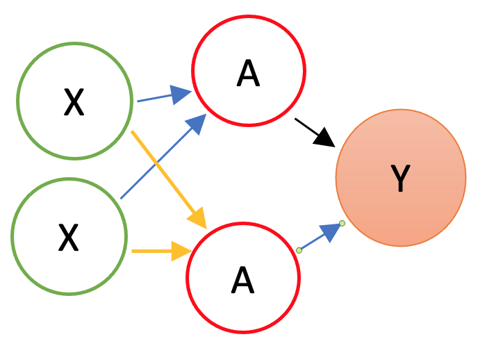

# Artificial Neural Networks

Artificial neural networks (ANNs) are a type of machine learning model that are inspired by the structure and function of the human brain. They consist of interconnected units called artificial neurons or nodes, which are organized into layers. The concept of artificial neural networks dates back to the 1940s, when Warren McCulloch and Walter Pitts ([1944](https://link.springer.com/article/10.1007/BF02478259)) proposed a model of the neuron as a simple threshold logic unit. In the 1950s and 1960s, researchers began developing more complex models of the neuron and exploring the use of neural networks for tasks such as pattern recognition and machine translation. However, these early efforts were largely unsuccessful due to the limited computational power of the time.

It wasn't until the 1980s and 1990s that significant progress was made in the development of artificial neural networks, thanks to advances in computer technology and the availability of larger and more diverse datasets. In [1986](https://www.iro.umontreal.ca/~vincentp/ift3395/lectures/backprop_old.pdf), Geoffrey Hinton and his team developed the backpropagation algorithm, which revolutionized the field by allowing neural networks to be trained more efficiently and accurately.  Since then, artificial neural networks have been applied to a wide range of tasks, including image and speech recognition, natural language processing, and even playing games like chess and Go. They have also been used in a variety of fields, including finance, healthcare, and transportation.  Today, artificial neural networks are an important tool in the field of machine learning, and continue to be an active area of research and development.

There have been many influential works published in the field of artificial neural networks (ANNs) over the years. Here are a few examples of some of the most important and influential papers in the history of ANNs:
  
- [Perceptrons](https://psycnet.apa.org/record/1959-09865-001) by Frank Rosenblatt (1957): This paper introduced the concept of the perceptron, which is a type of ANN that can be trained to recognize patterns in data. The perceptron became a foundational concept in the field of machine learning and was a key catalyst for the development of more advanced ANNs. 
- [Backpropagation](https://www.iro.umontreal.ca/~vincentp/ift3395/lectures/backprop_old.pdf) by Rumelhart, Hinton, and Williams (1986): This paper introduced the backpropagation algorithm, which is a method for training ANNs that allows them to learn and adapt over time. The backpropagation algorithm is still widely used today and has been a key factor in the success of ANNs in many applications. 
- [LeNet-5](http://yann.lecun.com/exdb/publis/pdf/lecun-01a.pdf) by Yann LeCun et al. (1998): This paper described the development of LeNet-5, an ANN designed for recognizing handwritten digits. LeNet-5 was one of the first successful applications of ANNs in the field of image recognition and set the stage for many subsequent advances in this area. 
- [Deep Learning](https://pubmed.ncbi.nlm.nih.gov/26017442/) by Yann LeCun, Yoshua Bengio, and Geoffrey Hinton (2015): This paper provided a comprehensive review of the field of deep learning, which is a type of ANN that uses many layers of interconnected neurons to process data. It has had a major impact on the development of deep learning and has helped to drive many of the recent advances in the field. 
- [Deep Learning](https://www.deeplearningbook.org) by Ian Goodfellow et al. (2016): This book provided a comprehensive overview of the state of the art in deep learning, which is a type of ANN with multiple layers of interconnected nodes. The book helped to popularize deep learning and contributed to its widespread adoption in a variety of fields.  
  
These are just a few examples of the many influential papers that have been published in the field of ANNs. There have been many other important contributions to the field as well, and the field continues to evolve and grow as new technologies and techniques are developed.
  
Both Support Vector Machines and Neural Networks employ some kind of data transformation that moves them into a higher dimensional space. What the kernel function does for the SVM, the hidden layers do for neural networks. Are Neural Networks is better than Support Vector Machines?  The post by [Igor F.](https://stats.stackexchange.com/questions/510052/are-neural-networks-better-than-svms) gives a nice starting example.
  
## Neural Network - the idea
Let's start with a predictive model with a single input (covariate).  The simplest model could be a linear model: 

$$
y \approx \alpha+\beta x
$$

Since this model could be a quite restrictive, we can have a more flexible one by a polynomial regression:

$$
y \approx \alpha+\beta_1 x+\beta_2 x^2+\beta_3 x^3+\ldots = \alpha+\sum_{m=1}^M \beta_m x^m
$$

We can see the first simple ANN as nonlinear functions of linear combinations:

$$
y \approx \alpha+\beta_1 f\left(\alpha_1+\delta_1 x\right)+\beta_2 f\left(\alpha_2+\delta_2 x\right)+\beta_3 f\left(\alpha_3+\delta_3 x\right)+\ldots\\
= \alpha+\sum_{m=1}^M \beta_m f\left(\alpha_m+\delta_m x\right)
$$

where $f(.)$ is an **activation** function – a fixed nonlinear function. Common examples of activation functions are

- The **logistic** (or sigmoid) function: $f(x)=\frac{1}{1+e^{-x}}$; 
- The **hyperbolic tangent** function: $f(x)=\tanh (x)=\frac{e^x-e^{-x}}{e^x+e^{-x}}$; 
- The Rectified Linear Unit (**ReLU**): $f(x)=\max (0, x)$;  

The full list of activation functions can be found at [Wikipedia](https://en.wikipedia.org/wiki/Activation_function).

Let us consider a realistic (simulated) sample:

```{r nn1, warning=FALSE, message=FALSE}
n <- 200
set.seed(1)
x <- sort(runif(n))
y <- sin(12*(x + 0.2))/(x + 0.2) + rnorm(n)/2
df <- data.frame(y, x)
plot(x, y, main="Simulated data",  col= "grey")
```

We can fit a polynomial regression with $M = 3$:  

```{r nn2, warning=FALSE, message=FALSE}
ols <- lm(y ~ x + I(x^2) + I(x^3))
plot(x, y, main="Polynomial: M = 3",  col= "grey")
lines(x, predict(ols), col="blue", lwd = 3)
```
  
Now, we can think of the line as weighted sum of fixed components: $\alpha_1+\beta_1 x+\beta_2 x^2+\beta_3 x^3$.  

```{r nn3}
# Parts
first <- ols$coefficients[2]*x
second <- ols$coefficients[3]*x^2
third <- ols$coefficients[4]*x^3
yhat <- ols$coefficients[1] + first + second + third 

# Plots
par(mfrow=c(1,4), oma = c(0,0,2,0))
plot(x, first, ylab = "y", col = "pink", main = "x")
plot(x, second, ylab = "y", col = "orange", main = expression(x^2))
plot(x, third, ylab = "y", col = "green", main = expression(x^3))
plot(x, y, ylab="y", col = "grey", 
     main = expression(alpha + bx + bx^2 + bx^3))
lines(x, yhat, col = "red", lwd = 3)
mtext("Fixed Components",
      outer=TRUE, cex = 1.5, col="olivedrab")
```

The polynomial regression is based on fixed components, or bases: $x, x^2, x^3, \ldots, x^M.$  The artificial neural net replaces these fixed components with adjustable ones or bases: $f\left(\alpha_1+\delta_1 x\right)$, $f\left(\alpha_2+\delta_2 x\right)$, $\ldots, f\left(\alpha_M+\delta_M x\right).$  
  
Each component is more flexible than a fixed component.  They are adjustable with tunable internal parameters. They can express several shapes, not just one (fixed) shape. Hence, adjustable components enable to capture complex models with fewer components (smaller M).  

Let's replace those fixed components $x, x^2, x^3$ in our polynomial regression with $f\left(\alpha_1+\delta_1 x\right)$, $f\left(\alpha_2+\delta_2 x\right)$, $f\left(\alpha_3+\delta_3 x\right).$  

```{r nn4, warning=FALSE, message=FALSE, cache=TRUE}
library(neuralnet)
set.seed(2)
nn <- neuralnet(y ~ x, data = df, hidden = 3, threshold = 0.05) 
yhat <- compute(nn, data.frame(x))$net.result
plot(x, y, main="Neural Networks: M=3")
lines(x, yhat, col="red", lwd = 3)
```

Why did neural networks perform better than polynomial regression in the previous example? Again, adjustable components enable to capture complex models. Let's delve little deeper.  Here is the weight structure of 

$$
y \approx \alpha+\sum_{m=1}^3 \beta_m f\left(\alpha_m+\delta_m x\right)\\
= \alpha+\beta_1 f\left(\alpha_1+\delta_1 x\right)+\beta_2 f\left(\alpha_2+\delta_2 x\right)+\beta_3 f\left(\alpha_3+\delta_3 x\right)
$$

```{r nn5}
nn$weights
plot(nn, rep = "best")
```
  
We used sigmoid (logistic) activation functions

$$
\text{Node 1:} ~~~f(x)=\frac{1}{1+e^{-x}}=\frac{1}{1+e^{-(1.26253-18.95937x)}}\\
\text{Node 2:} ~~~f(x)=\frac{1}{1+e^{-x}}=\frac{1}{1+e^{-(6.599773-12.24665x)}}\\
\text{Node 3:} ~~~f(x)=\frac{1}{1+e^{-x}}=\frac{1}{1+e^{-(2.504890-5.700564x)}}
$$

We can calculate the value of each activation function by using our data, $x$:
  
```{r nn6, warning=FALSE, message=FALSE}
X <- cbind(1, x)

# to 1st Node
n1 <- nn$weights[[1]][[1]][,1]
f1 <- nn$act.fct(X%*%n1)

# to 2nd Node
n2 <- nn$weights[[1]][[1]][,2]
f2 <- nn$act.fct(X%*%n2)

# to 3rd Node
n3 <- nn$weights[[1]][[1]][,3]
f3 <- nn$act.fct(X%*%n3)

par(mfrow=c(1,3), oma = c(0,0,2,0))
plot(x, f1, col = "pink", main = expression(f(a1 + b1x)))
plot(x, f2, col = "orange", main = expression(f(a2 + b2x)))
plot(x, f3, col = "green", main = expression(f(a3 + b3x)))
mtext("Flexible Components",
      outer=TRUE, cex = 1.5, col="olivedrab")
```

Now we will go from these nodes to the "sink":

$$
\frac{1}{1+e^{-(1.26253-18.95937x)}} \times 13.032092\\
\frac{1}{1+e^{-(6.599773-12.24665x)}}\times 19.923742\\
\frac{1}{1+e^{-(2.504890-5.700564x)}}\times -32.173264
$$

Fianlly we will add these with a "bias", the intercept:

$$
2.407654 + \\
\frac{1}{1+e^{-(1.26253-18.95937x)}} \times 13.032092+\\
\frac{1}{1+e^{-(6.599773-12.24665x)}}\times 19.923742+\\
\frac{1}{1+e^{-(2.504890-5.700564x)}}\times -32.173264 
$$

Here are the results:  

```{r nn7, warning=FALSE, message=FALSE}
# From Nodes to sink (Y) ##
f12 <- f1*nn$weights[[1]][[2]][2]
f22 <- f2*nn$weights[[1]][[2]][3]
f23 <- f3*nn$weights[[1]][[2]][4]

## Results
yhat <- nn$weights[[1]][[2]][1] + f12 + f22 + f23
plot(x, y, main="ANN: M = 3")
lines(x, yhat, col="red", lwd = 3)
```

## Backpropagation

In 1986, [Rumelhart et al.](https://www.iro.umontreal.ca/~vincentp/ift3395/lectures/backprop_old.pdf) found a way to train neural networks, with the backpropagation algorithm. Today, we would call it a Gradient Descent using reverse-mode autodiff.  Backpropagation is an algorithm used to train neural networks by adjusting the weights and biases of the network to minimize the cost function.  Suppose we have a simple neural network as follows:

```{r nn8, echo=FALSE, out.width = '65%', out.height='60%'}
knitr::include_graphics("png/ANN1.png")
```  

The first layer is the source layer (with $X$). The second layer is called as hidden layer with three "neurons" each of which has an activation function ($A$).  The last layer is the "sink" or output layer. First, let's define a loss function, MSPE:  

$$
\text{MSPE}=\frac{1}{n} \sum_{i=1}^n\left(y_i-p\left(\mathbf{x}_i\right)\right)^2
$$
  
And we want to solve: 
  
$$
\omega^{\star}=\operatorname{argmin}\left\{\frac{1}{n} \sum_{i=1}^n\left(y_i-p\left(\mathbf{x}_i\right)\right)^2\right\}
$$
  
To compute the gradient of the error with respect to a weight $w$ or a bias $b$, we use the chain rule:  

$$
\frac{\partial \text{MSPE}}{\partial w} =\frac{\partial \text{MSPE}}{\partial \hat{y}}\frac{\partial \hat{y}}{\partial z}\frac{\partial z}{\partial w}
$$
Remember, $\hat{y} = f(x)=\frac{1}{1+e^{-z}}=\frac{1}{1+e^{-(\alpha+wx)}}$, where $w$ is the weight or bias in the network. By repeating this process for each weight and bias in the network, we can calculate the error gradient and use it to adjust the weights and biases in order to minimize the error of the neural network.  This can be done by using gradient descent (See Appendix 1), which is an iterative method for optimizing a differentiable objective function, typically by minimizing it.  However, with a multilayer ANN, we use stochastic gradient descent (SGD), which is a faster method iteratively minimizing the loss function by taking small steps in the opposite direction of the gradient of the function at the current position. The gradient is calculated using a randomly selected subset of the data, rather than the entire data set, which is why it is called "stochastic."  One of the main advantages of SGD is that it can be implemented very efficiently and can handle large data sets very well.  

In a regular network, the number of parameters is very large and it gets larger even in deep neural networks. Therefore, finding the most efficient (fast) backpropagation method is an active research area in the artificial intelligence engineering.  One of the recent developments in this area is Tensors and Tensorflow that we will talk in Section VII.       

## Neural Network - More inputs

With a set of covariates $X=\left(1, x_1, x_2, \ldots, x_k\right)$, we have  

$$
y \approx \alpha+\sum_{m=1}^M \beta_m f\left(\alpha_m+\textbf{X} \delta_m\right)=\\
= \alpha+\beta_1 f\left(\alpha_1+\delta_{11} x_{1i}+\delta_{12} x_{2i} \dots +\delta_{1k} x_{ki}\right)+\dots\\
+\beta_M f\left(\alpha_{M1}+\delta_{M1} x_{1i}+\delta_{M2} x_{2i} \dots +\delta_{Mk} x_{ki}\right)
$$

By adding nonlinear functions of linear combinations with $M>1$, we have seen that we can capture nonlinearity.  With multiple features, we can now capture interaction effects and, hence, obtain a more flexible model.  This can be seen in blue and orange arrows in the following picture:  

```{r nn9, echo=FALSE, out.width = '65%', out.height='60%'}

```  

Let's have an application using a Mincer equation and the data (SPS 1985 - cross-section data originating from the May 1985 Current Population Survey by the US Census Bureau) from `AER` package.  

Before we start, there are few important pre-processing steps to complete.  First, ANN are inefficient when the data are not scaled.  The reason is backpropagation.  Since ANN use gradient descent, the different scales in features will cause different step sizes. Scaling the data before feeding it to the model enables the steps in gradient descent updated at the same rate for all the features. Second, indicator predictors should be included in the input matrix by dummy-coding. Note that, the standardization should avoid those indicator variables.  Finally, the formula for the model needs to be constructed to initialize the algorithm.  Let's see all of these pre-processing steps below:  

```{r nn10, message=FALSE, warning=FALSE, cache=TRUE}
library(AER)
data("CPS1985")

df <- CPS1985

# Scaling and Dummy coding
df[,sapply(df, is.numeric)] <- scale((df[, sapply(df, is.numeric)]))
ddf <- model.matrix(~.-1, data= df, contrasts.arg =
                       lapply(df[,sapply(df, is.factor)],
                              contrasts, contrasts = FALSE))

ddf <- as.data.frame(ddf)

# formula to pass on ANN and lm()  
w.ind <- which(colnames(ddf)=="wage")
frmnn <- as.formula(paste("wage~", paste(colnames(ddf[-w.ind]), collapse='+')))
frmln <- as.formula(paste("wage~", "I(experience^2)", "+",
                          paste(colnames(ddf[-w.ind]), collapse = "+")))

# Bootstrapping loops instead of CV
mse.test <- matrix(0, 10, 5)
for(i in 1:10){ 
  
  set.seed(i+1)
  trainid <- unique(sample(nrow(ddf), nrow(ddf), replace = TRUE))
  train <- ddf[trainid,]
  test <- ddf[-trainid,]
  
  # Models 
  fit.lm <- lm(frmln, data = train)
  fit.nn <- neuralnet(frmnn, data = train, hidden = 1, threshold = 0.05,
                      linear.output = FALSE)
  fit.nn2 <- neuralnet(frmnn, data = train, hidden = 2, threshold = 0.05)
  fit.nn3 <- neuralnet(frmnn, data = train, hidden = 3, threshold = 0.05)
  fit.nn4 <- neuralnet(frmnn, data = train, hidden = 3, threshold = 0.05,
                       act.fct = "tanh", linear.output = FALSE)
 
  # Prediction errors
  mse.test[i,1] <- mean((test$wage - predict(fit.lm, test))^2)
  mse.test[i,2] <- mean((test$wage - predict(fit.nn, test))^2)
  mse.test[i,3] <- mean((test$wage - predict(fit.nn2, test))^2)
  mse.test[i,4] <- mean((test$wage - predict(fit.nn3, test))^2)
  mse.test[i,5] <- mean((test$wage - predict(fit.nn4, test))^2)
  
}

colMeans(mse.test)
```

This experiment alone shows that a **linear** Mincer equation (with `I(expreince^2)`) is a much better predictor than ANN.  As the complexity of ANN rises with more neurons, the likelihood that ANN overfits goes up, which is the case in our experiment.  In general, linear regression may be a good choice for simple, low-dimensional datasets with a strong linear relationship between the variables, while ANNs may be better suited for more complex, high-dimensional datasets with nonlinear relationships between variables.  

Overfitting can be a concern when using ANNs for prediction tasks. Overfitting occurs when a model is overly complex and has too many parameters relative to the size of the training data, leading it to fit the noise in the training data rather than the underlying pattern. As a result, the model may perform well on the training data but poorly on new, unseen data.  One way to mitigate overfitting in ANNs is to use techniques such as regularization, which imposes constraints on the model to prevent it from becoming too complex. Another approach is to use techniques such as early stopping, which involves interrupting the training process when the model starts to overfit the training data.  

## Deep Learning

Simply, a Deep Neural Network (DNN), or Deep Learning, is an artificial neural network that has two or more hidden layers. Even greater flexibility is achieved via composition of activation functions:  

$$
y \approx \alpha+\sum_{m=1}^M \beta_m f\left(\alpha_m^{(1)}+\underbrace{\sum_{p=1}^P f\left(\alpha_p^{(2)}+\textbf{X} \delta_p^{(2)}\right)}_{\text {it replaces } \textbf{X}} \delta_m^{(1)}\right)
$$
   
Before having an application, note that there are many packages that offer ANN implementations in R and even more with Python. For example, CRAN hosts more than 80 packages related to neural network modeling. Above, we just saw one example with `neuralnet`.  The work by [Mahdi et al, 2021](https://www.inmodelia.com/exemples/2021-0103-RJournal-SM-AV-CD-PK-JN.pdf) surveys and ranks these packages for their accuracy, reliability, and ease-of-use.  
  
```{r nn11, message=FALSE, warning=FALSE, cache=TRUE}
mse.test <- c()
for(i in 1:10){ 
  
  set.seed(i+1)
  trainid <- unique(sample(nrow(ddf), nrow(ddf), replace = TRUE))
  train <- ddf[trainid,]
  test <- ddf[-trainid,]
  
  # Models
  fit.nn22 <- neuralnet(frmnn, data = train, hidden = c(3,3), threshold = 0.05)
 
  mse.test[i] <- mean((test$wage - predict(fit.nn22, test))^2)
 }

mean(mse.test)
```

Increasing overfitting!  Here is the plot for our DNN:  

```{r nn12}
plot(fit.nn22, rep = "best")
```

A better plot could be obtained by using the `NeuralNetTools` package:  

```{r nn13}
library(NeuralNetTools)
plotnet(fit.nn22)
```
  
Training DNN is an important concept and we leave it to the end. As we see, deep neural networks can model complex non-linear relationships.
With very complex problems, such as detecting hundreds of types of objects in high-resolution images, we need to train deeper NN, perhaps with 10 layers or more each with hundreds of neurons.  Therefore, training a fully-connected DNN is a very slow process facing a severe risk of overfitting with millions of parameters.  Moreover, gradients problems make lower layers very hard to train.  Solutions: Convolutional Neural Networks (CNN or ConvNets) and Recurrent Neural Networks (RNN).  

Before moving on with these new DNN solutions, we should ask if we can obtain any information about the relationship between the prediction and predictors.   The interpretability of an artificial neural network (ANN), which is known to be a "blackbox" method, can be an issue regardless of the complexity of the network. However, it is generally easier to understand the decisions made by a simple ANN than by a more complex one.  

A simple ANN might have only a few layers and a relatively small number of neurons, making it easier to understand how the input data is processed and how the final output is produced. However, even a simple ANN can still be a black box in the sense that the specific calculations and decisions made by the individual neurons within the network are not fully visible or understood.  On the other hand, a more complex ANN with many layers and a large number of neurons can be more difficult to interpret, as the internal workings of the network are more complex and harder to understand. In these cases, it can be more challenging to understand how the ANN is making its decisions or to identify any biases or errors in its output. Overall, the interpretability of an ANN depends on the complexity of the network and the specific task it is being used for. Simple ANNs may be more interpretable, but even they can be considered black boxes to some extent.  

Here are a few resources that provide information about the interpretability of artificial neural networks (ANNs):  
  
- [Interpretable Machine Learning](https://christophm.github.io/interpretable-ml-book/) by Christoph Molnar is a online book that provides an overview of interpretability in machine learning, including techniques for interpreting ANNs. 
- [Interpretability of Deep Neural Networks](https://ieeexplore.ieee.org/document/8397411) by Chakraborty is a survey paper that discusses the interpretability of deep neural networks and presents an overview of the various techniques and approaches that have been developed to improve their interpretability.  

Before concluding this section we apply DNN to a classification problem using the same data that we have in Section 14.4.4:  

```{r nn14, message=FALSE, warning=FALSE}
library(ISLR)
df <- Carseats
str(df)

#Change SALES to a factor variable
df$Sales <- as.factor(ifelse(Carseats$Sales <= 8, 0, 1))
dff <- df[, -1]

# Scaling and Dummy coding
dff[,sapply(dff, is.numeric)] <- scale((dff[, sapply(dff, is.numeric)]))
ddf <- model.matrix(~.-1, data= dff, contrasts.arg =
                       lapply(dff[, sapply(dff, is.factor)],
                              contrasts, contrasts = FALSE))

ddf <- data.frame(Sales = df$Sales, ddf)

# Formula
w.ind <- which(colnames(ddf)=="Sales")
frm <- as.formula(paste("Sales~", paste(colnames(ddf[-w.ind]), collapse='+')))
```

```{r nn15, warning=FALSE, message=FALSE, cache=TRUE}
library(ROCR)

n <- 10
AUC1 <- c()
AUC2 <- c()

for (i in 1:n) {
  set.seed(i)
  ind <- unique(sample(nrow(ddf), nrow(ddf), replace = TRUE))
  train <- ddf[ind, ]
  test <- ddf[-ind, ]
  
  # Models
  fit.ln <- glm(frm, data = train, family = binomial(link = "logit"))
  fit.dnn <- neuralnet(frm, data = train, hidden = 2, threshold = 0.05,
                       linear.output = FALSE, err.fct = "ce")
  
  #Predictions
  phat.ln <- predict(fit.ln, test, type = "response")
  phat.dnn <- predict(fit.dnn, test, type = "repsonse")[,2]

  #AUC for predicting Y = 1
  pred_rocr1 <- ROCR::prediction(phat.ln, test$Sales)
  auc_ROCR1 <- ROCR::performance(pred_rocr1, measure = "auc")
  AUC1[i] <- auc_ROCR1@y.values[[1]]

  pred_rocr2 <- ROCR::prediction(phat.dnn, test$Sales)
  auc_ROCR2 <- ROCR::performance(pred_rocr2, measure = "auc")
  AUC2[i] <- auc_ROCR2@y.values[[1]]
  
}

(c(mean(AUC1), mean(AUC2)))

```

Again the results are not very convincing to use DNN in this example.  Let's have a more complex task with [Red Wine](https://www.kaggle.com/datasets/piyushgoyal443/red-wine-dataset?resource=download) dataset from Kaggle ([Cortez et.al, 2009](https://www.sciencedirect.com/science/article/abs/pii/S0167923609001377)).  Our job us to use 11 attributes to classify each wine 
  
```{r nn16}
dfr <- read.csv("wineQualityReds.csv", header = TRUE)
dfr <- dfr[,-1] # removing the index
table(dfr$quality)

# Let's remove the outlier qualities:
indo <- which(dfr$quality=="3"|dfr$quality=="8")
dfr <- dfr[-indo, ]
dfr$quality <- as.factor(dfr$quality)
table(dfr$quality)
```

Let's scale it and get the formula

```{r nn17}
# Scaling and Dummy coding
dfr[,sapply(dfr, is.numeric)] <- scale((dfr[, sapply(dfr, is.numeric)]))
ddf <- model.matrix(~quality -1, data = dfr)
w.ind <- which(colnames(dfr)=="quality")
dfr <- dfr[,-w.ind] # removing 'quality`
df <- cbind(ddf, dfr)
frm <- as.formula(paste(paste(colnames(ddf), collapse='+'), "~", 
                        paste(colnames(dfr), collapse='+')))
frm
```

And, our simple DNN application

```{r nn18, message=FALSE, warning=FALSE, cache=TRUE}
ind <- sample(nrow(df), nrow(df)*.7)
train <- df[ind,]
test <- df[-ind,]

fit.nn <- neuralnet(frm, data = train, hidden = c(3,2), threshold = 0.05,
                       linear.output = FALSE, err.fct = "ce")

plot(fit.nn, rep = "best")
```

And our prediction:

```{r nn19, warning=FALSE, message=FALSE}
library(utiml)

phat <- predict(fit.nn, test)
head(phat)

label.hat <- t(apply(phat, 1, function(x) as.numeric(x == max(x))))
head(label.hat)

# Confusion Table
pred <- apply(phat, 1, which.max)
fck <- colnames(test)[1:4]
predicted <- fck[pred]

act<- apply(test[,1:4], 1, which.max)
actual <- fck[act]

table(predicted, actual)
```

This is just an example and the results are not reflecting a trained model.  Advance DNN applications with a proper training requires a longer time and more capable machines.  We can do a grid search on different number of hidden layers and neurons.  However, a large datasets and more complex DNNs need better applications, like, `Keras` that uses GPU on Linux systems allowing a much better efficiency in training. So far, we have used the `neuralnet` package.  There are several packages in R that are capable of implementing and training artificial neural networks (ANNs), and the most suitable one for your needs will depend on your specific requirements and preferences. Some popular packages for implementing ANNs in R include:
  
- `nnet`: This package is specifically designed for training and using feedforward neural networks, which are a type of ANN that consists of layers of interconnected "neurons" that process and transmit information. It provides functions for building and training feedforward networks, and for making predictions with them. 
- `caret`: As we've seen before, this is a general-purpose package for building and evaluating machine learning models, including ANNs. It provides functions for building and training ANNs, and for tuning their hyperparameters using techniques like cross-validation. It also offers a wide range of functions for preprocessing and analyzing data, and for evaluating the performance of trained models. 
- `deepnet`: This package is designed for building and training deep learning models, which are a type of ANN with many layers that are capable of learning complex patterns in data. It provides functions for building and training deep learning models using a variety of techniques, including backpropagation, autoencoders, and convolutional neural networks (CNNs). 

Ultimately, the best package for ANNs in R will depend on your specific needs and requirements. If you are looking for a powerful and flexible package for building and training ANNs, `neuralnet` or `deepnet` may be good options. If you just need a simple and easy-to-use package for training feedforward networks and making predictions, `nnet` may be a good choice. If you want a general-purpose package that can handle a wide range of machine learning tasks, including ANNs, `caret` may be a good option.

Deep neural networks (DNNs) are neural networks with many layers, which can be difficult to train because of the large number of parameters that need to be optimized. This can make the training process computationally intensive and prone to overfitting.  Convolutional neural networks (CNNs), on the other hand, are specifically designed to process data that has a grid-like structure, such as an image. One key aspect of CNNs is that they use convolutional layers, which apply a set of filters to the input data and produce a set of transformed feature maps. These filters are able to detect specific features in the input data, such as edges, corners, or textures, and are able to share these features across the input data. This means that the number of parameters in a CNN is typically much smaller than in a DNN, which makes the model easier to train and less prone to overfitting.

Overall, CNNs are well-suited for tasks such as image classification, object detection and, speech recognition. We will not cover the details of CNN here.  There are several packages available in R for working with CNNs. `Keras` running on `TensowFlow` is one of the most efficient engines in building artificial neural networks.

Finally, in a deep neural network, "dropout" and "regularization" are techniques used to prevent overfitting.  Dropout is a regularization technique that randomly drops out, or removes, a certain percentage of neurons from the network during training. This has the effect of reducing the complexity of the model, as it can't rely on any one neuron or group of neurons to make predictions. Regularization is a general term that refers to any method used to prevent overfitting in a machine learning model. There are many types of regularization techniques, which add a penalty term to the parameters of the the activation functions.

We will be back to ANN later in Section VII - Time Series.  

