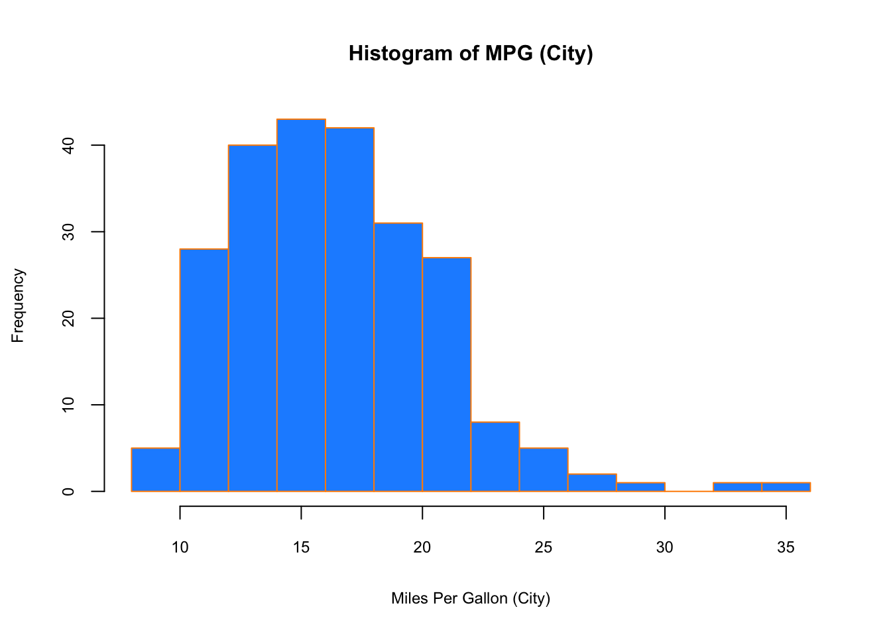
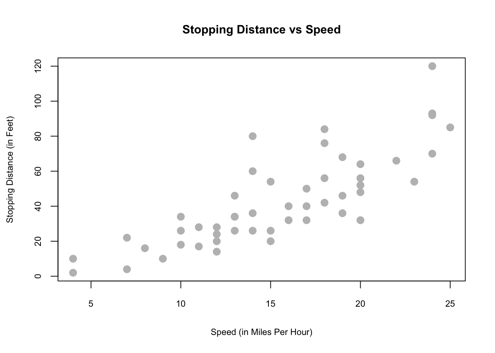
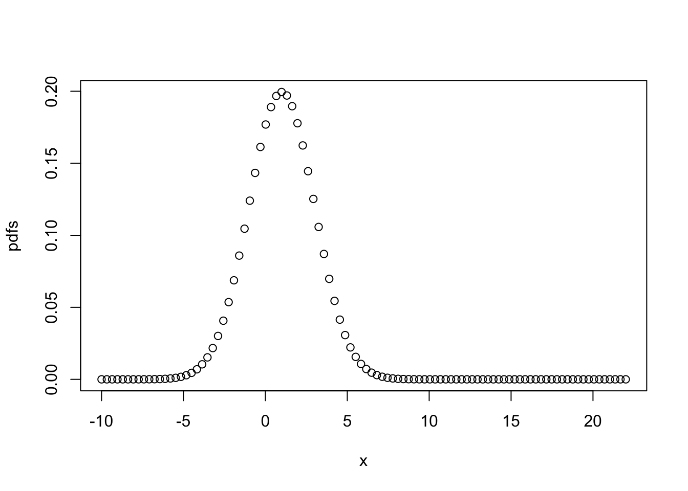
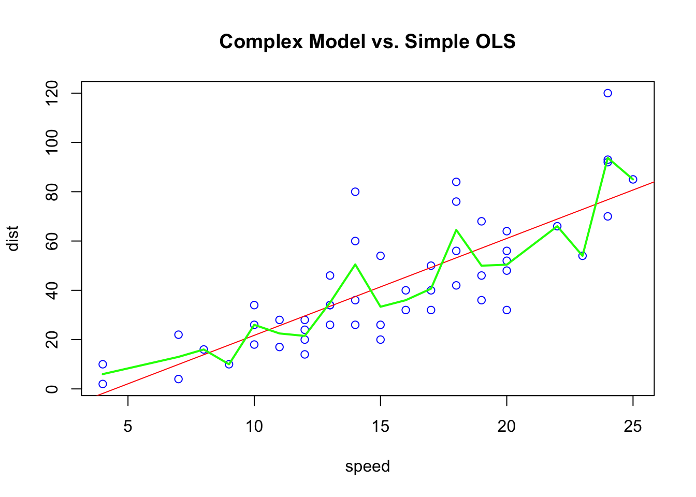
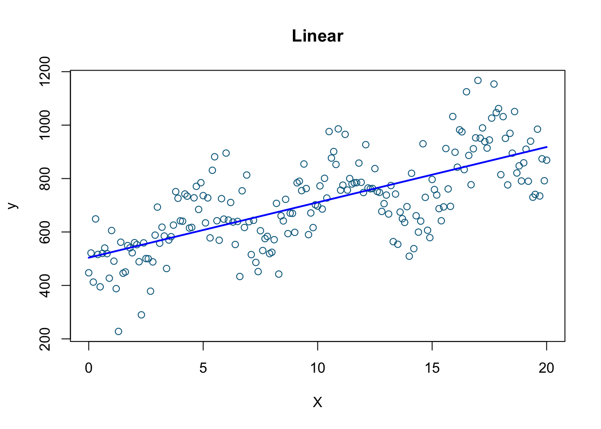
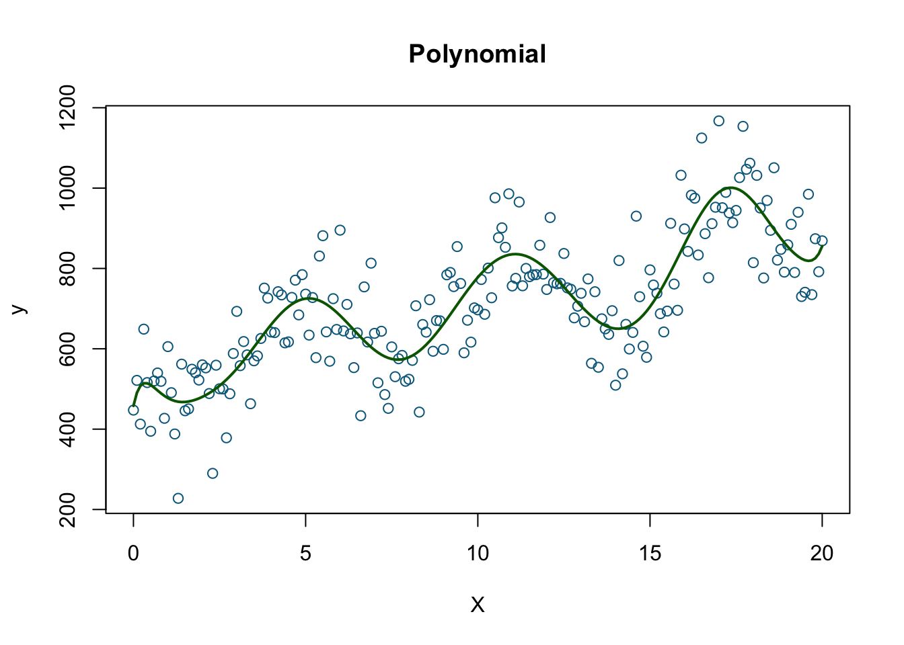
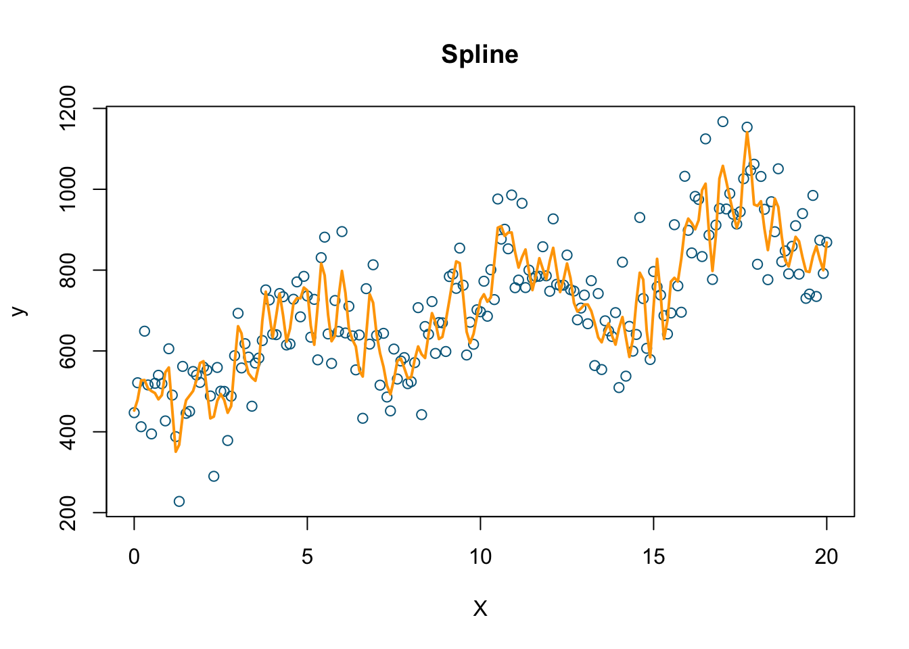

# Preliminaries

We will start with reviewing some basic concepts in statistics.  For now, don't stress about understanding the code chunks.  As you study and practice R more (See R Labs at the end of the book), the codes will become clearer.

## Data and dataset types

R has a number of basic data types. 
  
- **Numeric** : Also known as Double. The default type when dealing with numbers. 1,1.0,42.5    
- **Integer**: 1L,2L,42L   
- **Complex**:  4 + 2i   
- **Logical**: Two possible values: TRUE and FALSE. `NA` is also considered logical.   
- **Character**: "a","Statistics","1plus2."   

Data can also be classified as **numeric** (what's your age?) and **categorical** (Do you have a car?)  

R also has a number of basic data ("container") structures. A data structure is either **homogeneous** (all elements are of the same data type) or **heterogeneous** (elements can be of more than one data type):  You can think each data structure as **data container** where your data are stored.  Here are the main "container" or data structures:  
  
- **Vector**: One dimension (column or row) and homogeneous. That is, every element of a vector has to be the same type. Each vector can be thought of as a variable. 
- **Matrix**: Two dimensions (columns and rows) and homogeneous. That is, every element of a matrix has to be the same type. 
- **Data Frame**: Two dimensions (columns and rows) and heterogeneous. That is, every column of a data frame doesn't have to be the same type.  This is the main difference between a matrix and a data frame. Data frames are the most common data structures in any data analysis. 
- **List**: One dimension and heterogeneous. A list can have multiple data structures. 
- **Array**: 3+ dimensions and homogeneous. 

In this book, we most frequently work with data frames.

When using data, there are three things we like to do:   
  
- Look at the raw data.   
- Understand the data. (What are the variables and their types?)   
- Visualize the data.   
  
To look at the data, we have two useful commands: `head()` (`tail()`) and `str()`. As seen in the following examples, `head()` and `tail()` allow us to see the first few data points in a dataset. `str()` allows us to see the structure of the data, including what data types are used. Using `str()` we can identify the `mtcars` dataset, which includes only numeric variables and is structured in a data frame.

**Cross-Sectional**
In cross-sectional data, we have one dimension: subjects. Since the order of observations are not important, we can shuffle the data.  


```r
library(datasets)

head(mtcars)
```

```
##                    mpg cyl disp  hp drat    wt  qsec vs am gear carb
## Mazda RX4         21.0   6  160 110 3.90 2.620 16.46  0  1    4    4
## Mazda RX4 Wag     21.0   6  160 110 3.90 2.875 17.02  0  1    4    4
## Datsun 710        22.8   4  108  93 3.85 2.320 18.61  1  1    4    1
## Hornet 4 Drive    21.4   6  258 110 3.08 3.215 19.44  1  0    3    1
## Hornet Sportabout 18.7   8  360 175 3.15 3.440 17.02  0  0    3    2
## Valiant           18.1   6  225 105 2.76 3.460 20.22  1  0    3    1
```

```r
str(mtcars)
```

```
## 'data.frame':	32 obs. of  11 variables:
##  $ mpg : num  21 21 22.8 21.4 18.7 18.1 14.3 24.4 22.8 19.2 ...
##  $ cyl : num  6 6 4 6 8 6 8 4 4 6 ...
##  $ disp: num  160 160 108 258 360 ...
##  $ hp  : num  110 110 93 110 175 105 245 62 95 123 ...
##  $ drat: num  3.9 3.9 3.85 3.08 3.15 2.76 3.21 3.69 3.92 3.92 ...
##  $ wt  : num  2.62 2.88 2.32 3.21 3.44 ...
##  $ qsec: num  16.5 17 18.6 19.4 17 ...
##  $ vs  : num  0 0 1 1 0 1 0 1 1 1 ...
##  $ am  : num  1 1 1 0 0 0 0 0 0 0 ...
##  $ gear: num  4 4 4 3 3 3 3 4 4 4 ...
##  $ carb: num  4 4 1 1 2 1 4 2 2 4 ...
```

```r
summary(mtcars)
```

```
##       mpg             cyl             disp             hp       
##  Min.   :10.40   Min.   :4.000   Min.   : 71.1   Min.   : 52.0  
##  1st Qu.:15.43   1st Qu.:4.000   1st Qu.:120.8   1st Qu.: 96.5  
##  Median :19.20   Median :6.000   Median :196.3   Median :123.0  
##  Mean   :20.09   Mean   :6.188   Mean   :230.7   Mean   :146.7  
##  3rd Qu.:22.80   3rd Qu.:8.000   3rd Qu.:326.0   3rd Qu.:180.0  
##  Max.   :33.90   Max.   :8.000   Max.   :472.0   Max.   :335.0  
##       drat             wt             qsec             vs        
##  Min.   :2.760   Min.   :1.513   Min.   :14.50   Min.   :0.0000  
##  1st Qu.:3.080   1st Qu.:2.581   1st Qu.:16.89   1st Qu.:0.0000  
##  Median :3.695   Median :3.325   Median :17.71   Median :0.0000  
##  Mean   :3.597   Mean   :3.217   Mean   :17.85   Mean   :0.4375  
##  3rd Qu.:3.920   3rd Qu.:3.610   3rd Qu.:18.90   3rd Qu.:1.0000  
##  Max.   :4.930   Max.   :5.424   Max.   :22.90   Max.   :1.0000  
##        am              gear            carb      
##  Min.   :0.0000   Min.   :3.000   Min.   :1.000  
##  1st Qu.:0.0000   1st Qu.:3.000   1st Qu.:2.000  
##  Median :0.0000   Median :4.000   Median :2.000  
##  Mean   :0.4062   Mean   :3.688   Mean   :2.812  
##  3rd Qu.:1.0000   3rd Qu.:4.000   3rd Qu.:4.000  
##  Max.   :1.0000   Max.   :5.000   Max.   :8.000
```

```r
plot(mtcars[,c(1, 3, 4)])
```


**Time-series**  
Time-series data have also one dimension with subject followed through the time.  We cannot shuffle the data, as it follows a sequential order.  


```r
head(airquality)
```

```
##   Ozone Solar.R Wind Temp Month Day
## 1    41     190  7.4   67     5   1
## 2    36     118  8.0   72     5   2
## 3    12     149 12.6   74     5   3
## 4    18     313 11.5   62     5   4
## 5    NA      NA 14.3   56     5   5
## 6    28      NA 14.9   66     5   6
```

```r
str(airquality)
```

```
## 'data.frame':	153 obs. of  6 variables:
##  $ Ozone  : int  41 36 12 18 NA 28 23 19 8 NA ...
##  $ Solar.R: int  190 118 149 313 NA NA 299 99 19 194 ...
##  $ Wind   : num  7.4 8 12.6 11.5 14.3 14.9 8.6 13.8 20.1 8.6 ...
##  $ Temp   : int  67 72 74 62 56 66 65 59 61 69 ...
##  $ Month  : int  5 5 5 5 5 5 5 5 5 5 ...
##  $ Day    : int  1 2 3 4 5 6 7 8 9 10 ...
```

```r
summary(airquality)
```

```
##      Ozone           Solar.R           Wind             Temp      
##  Min.   :  1.00   Min.   :  7.0   Min.   : 1.700   Min.   :56.00  
##  1st Qu.: 18.00   1st Qu.:115.8   1st Qu.: 7.400   1st Qu.:72.00  
##  Median : 31.50   Median :205.0   Median : 9.700   Median :79.00  
##  Mean   : 42.13   Mean   :185.9   Mean   : 9.958   Mean   :77.88  
##  3rd Qu.: 63.25   3rd Qu.:258.8   3rd Qu.:11.500   3rd Qu.:85.00  
##  Max.   :168.00   Max.   :334.0   Max.   :20.700   Max.   :97.00  
##  NA's   :37       NA's   :7                                       
##      Month            Day      
##  Min.   :5.000   Min.   : 1.0  
##  1st Qu.:6.000   1st Qu.: 8.0  
##  Median :7.000   Median :16.0  
##  Mean   :6.993   Mean   :15.8  
##  3rd Qu.:8.000   3rd Qu.:23.0  
##  Max.   :9.000   Max.   :31.0  
## 
```
  


```r
airquality$date <- airquality$Month*10+airquality$Day
plot(airquality$date, airquality$Ozone)
```


This was just a simple time-series data presentation.  In Part VII, we will see more advance ways to handle time-series data.   Moreover, dates and times can be handled by various packages/functions in R, like `lubridate` (see <https://lubridate.tidyverse.org>).  

Here are some examples:  


```r
library(lubridate)
# get current system date
Sys.Date() 
```

```
## [1] "2023-03-24"
```

```r
# get current system time
Sys.time()
```

```
## [1] "2023-03-24 19:54:10 ADT"
```

```r
#lubridate
now()
```

```
## [1] "2023-03-24 19:54:10 ADT"
```

```r
dates <- c("2022-07-11", "2012-04-19", "2017-03-08")

# extract years from dates
year(dates)
```

```
## [1] 2022 2012 2017
```

```r
# extract months from dates
month(dates)
```

```
## [1] 7 4 3
```

```r
# extract days from dates
mday(dates)
```

```
## [1] 11 19  8
```


  
**Panel**  
Panel data (also known as longitudinal data) is the richest data type as it includes information fro  multiple entities observed across time. These entities could be people, households, countries, firms, etc. Note in the example below, we use the `plm` [package](https://cran.r-project.org/web/packages/plm/vignettes/A_plmPackage.html) which has several data sets.  The first one, `EmplUK`, is summarized below:  
  

```r
library(foreign)
library(plm)
data("EmplUK", package="plm")

head(EmplUK, 15)
```

```
##    firm year sector    emp    wage capital   output
## 1     1 1977      7  5.041 13.1516  0.5894  95.7072
## 2     1 1978      7  5.600 12.3018  0.6318  97.3569
## 3     1 1979      7  5.015 12.8395  0.6771  99.6083
## 4     1 1980      7  4.715 13.8039  0.6171 100.5501
## 5     1 1981      7  4.093 14.2897  0.5076  99.5581
## 6     1 1982      7  3.166 14.8681  0.4229  98.6151
## 7     1 1983      7  2.936 13.7784  0.3920 100.0301
## 8     2 1977      7 71.319 14.7909 16.9363  95.7072
## 9     2 1978      7 70.643 14.1036 17.2422  97.3569
## 10    2 1979      7 70.918 14.9534 17.5413  99.6083
## 11    2 1980      7 72.031 15.4910 17.6574 100.5501
## 12    2 1981      7 73.689 16.1969 16.7133  99.5581
## 13    2 1982      7 72.419 16.1314 16.2469  98.6151
## 14    2 1983      7 68.518 16.3051 17.3696 100.0301
## 15    3 1977      7 19.156 22.6920  7.0975  95.7072
```

```r
length(unique(EmplUK$firm))
```

```
## [1] 140
```

```r
table(EmplUK$year)
```

```
## 
## 1976 1977 1978 1979 1980 1981 1982 1983 1984 
##   80  138  140  140  140  140  140   78   35
```
  
As you can see, we have 140 unique subjects (firms) each of which is observed between 1977 and 1983.  However, there are some firms with missing years.  This type of panel data is called as "unbalanced panel".  

## Plots

Often, a proper visualization can illuminate features of the data that can inform further analysis.  We will look at four methods of visualizing data that we will use throughout the book: 
  
- **Histograms**   
- **Barplots**    
- **Boxplots**    
- **Scatterplots**    

We can use the data `mpg` provided by the `ggplot2` package. To begin, we can get a sense of the data by looking at the first few data points and some summary statistics.


```r
library(ggplot2)
head(mpg, 5)
```

```
## # A tibble: 5 × 11
##   manufacturer model displ  year   cyl trans      drv     cty   hwy fl    class 
##   <chr>        <chr> <dbl> <int> <int> <chr>      <chr> <int> <int> <chr> <chr> 
## 1 audi         a4      1.8  1999     4 auto(l5)   f        18    29 p     compa…
## 2 audi         a4      1.8  1999     4 manual(m5) f        21    29 p     compa…
## 3 audi         a4      2    2008     4 manual(m6) f        20    31 p     compa…
## 4 audi         a4      2    2008     4 auto(av)   f        21    30 p     compa…
## 5 audi         a4      2.8  1999     6 auto(l5)   f        16    26 p     compa…
```

```r
tail(mpg, 5)
```

```
## # A tibble: 5 × 11
##   manufacturer model  displ  year   cyl trans      drv     cty   hwy fl    class
##   <chr>        <chr>  <dbl> <int> <int> <chr>      <chr> <int> <int> <chr> <chr>
## 1 volkswagen   passat   2    2008     4 auto(s6)   f        19    28 p     mids…
## 2 volkswagen   passat   2    2008     4 manual(m6) f        21    29 p     mids…
## 3 volkswagen   passat   2.8  1999     6 auto(l5)   f        16    26 p     mids…
## 4 volkswagen   passat   2.8  1999     6 manual(m5) f        18    26 p     mids…
## 5 volkswagen   passat   3.6  2008     6 auto(s6)   f        17    26 p     mids…
```
  
When visualizing a single numerical variable, a histogram would be very handy:    


```r
hist(mpg$cty, xlab = "Miles Per Gallon (City)",
     main = "Histogram of MPG (City)", breaks = 12,
     col = "dodgerblue",cex.main=1, cex.lab=.75, cex.axis=0.75,
     border = "darkorange")
```


  
Similar to a histogram, a barplot provides a visual summary of a categorical variable, or a numeric variable with a finite number of values, like a ranking from 1 to 10.  


```r
barplot(table(mpg$drv), 
        xlab = "Drivetrain (f = FWD, r = RWD, 4 = 4WD)", ylab = "Frequency",
        main = "Drivetrains",
        col = "dodgerblue",cex.main=1, cex.lab=.75, cex.axis=0.75,
        border = "darkorange")
```


  
To visualize the relationship between a numerical and categorical variable, we will use a boxplot. In the `mpg` dataset, the `drv` few categories: front-wheel drive, 4-wheel drive, or rear-wheel drive.  


```r
boxplot(hwy ~ drv, data = mpg,
        xlab = "Drivetrain (f = FWD, r = RWD, 4 = 4WD)",
        ylab = "Miles Per Gallon (Highway)",
        main = "MPG (Highway) vs Drivetrain",
        pch = 20, cex =2,cex.main=1, cex.lab=.75, cex.axis=0.75,
        col = "darkorange", border = "dodgerblue")
```


  
Finally, to visualize the relationship between two numeric variables we will use a scatterplot.  


```r
plot(hwy ~ displ, data = mpg,
     xlab = "Engine Displacement (in Liters)",
     ylab = "Miles Per Gallon (Highway)",
     main = "MPG (Highway) vs Engine Displacement",
     pch = 20, cex = 2, cex.main=1, cex.lab=.75, cex.axis=0.75,
     col = "dodgerblue")
```


  
  
While visualization is not enough to draw definitive conclusions, it can help us identify insights about data.  R is well-know for its graphical capabilities. The package `ggplot` is the main tool for more advance graphical representations that we will see later.  

  
## Probability Distributions with R

We often want to make probabilistic statements based on a distribution.  Typically, we will want to know one of four things:  
  
- The probability density function (pdf) at a particular value.   
- The cumulative probability distribution (cdf) at a particular value.    
- The quantile value corresponding to a particular probability.   
- A random draw of values from a particular distribution.   

The general naming structure of the relevant R functions is:   
  
- `dname` calculates density (pdf) at input $x$.   
- `pname` calculates distribution (cdf) at input $x$.   
- `qname` calculates the quantile at an input probability.    
- `rname` generates a random draw from a particular distribution,   
  
where `name` represents the name of the given distribution, like `rnorm` for a random draw from a normal distribution

For example, consider a random variable $X$:  

$$
X \sim N\left(\mu=2, \sigma^{2}=25\right)
$$
  
To calculate the value of the pdf at $x = 4$, we use `dnorm()`:


```r
dnorm(x = 4, mean = 2, sd = 5)
```

```
## [1] 0.07365403
```
  
Note that R uses the standard deviation.    
  
To calculate the value of the cdf at $x = 4$, that is, $P(X \leq{4})$, the probability that $X$ is less than or equal to 4, we use `pnorm()`:  


```r
pnorm(q = 4, mean = 2, sd = 5)
```

```
## [1] 0.6554217
```
  
Or, to calculate the quantile for probability 0.975, we use `qnorm()`:  


```r
qnorm(p = 0.975, mean = 2, sd = 5)
```

```
## [1] 11.79982
```
  
Lastly, to generate a random sample of size n = 10, we use `rnorm()`   


```r
rnorm(n = 10, mean = 2, sd = 5)
```

```
##  [1] -1.521228  5.373604  4.026866 -3.276899  3.306032  4.753966 -0.761452
##  [8] -3.716800 -8.679394  5.661180
```

These functions exist for many other distributions such as: `binom` (Binomial), `t` (Student's t), `pois` (Poisson), `f` (F), `chisq` (Chi-Squared) and so on.  
  
## Regressions

Regressions allow us to make estimations of the relationships between variables. Let’s consider a simple example of how the speed of a car affects its stopping distance. To examine this relationship, we will use the `cars` data set from the `datasets` package. The data give the speed of cars and the distances taken to stop. Note that the data were recorded in the 1920s.


```r
str(cars)
```

```
## 'data.frame':	50 obs. of  2 variables:
##  $ speed: num  4 4 7 7 8 9 10 10 10 11 ...
##  $ dist : num  2 10 4 22 16 10 18 26 34 17 ...
```

```r
summary(cars)
```

```
##      speed           dist       
##  Min.   : 4.0   Min.   :  2.00  
##  1st Qu.:12.0   1st Qu.: 26.00  
##  Median :15.0   Median : 36.00  
##  Mean   :15.4   Mean   : 42.98  
##  3rd Qu.:19.0   3rd Qu.: 56.00  
##  Max.   :25.0   Max.   :120.00
```

We can plot the speed and stopping distance in a scatterplot to get a sense of their relationship before proceeding with a formal regression.


```r
plot(dist ~ speed, data = cars,
     xlab = "Speed (in Miles Per Hour)",
     ylab = "Stopping Distance (in Feet)",
     main = "Stopping Distance vs Speed",
     pch = 20, cex = 2,cex.main=1,
     cex.lab=.75, cex.axis=0.75, col = "grey")
```



This visualization suggests there could be a relationship.

In this example, we are interested in using the predictor variable `speed` to predict and explain the response variable `dist`.  We could express the relationship between $X$ and $Y$ using the following "Data Generating Process" (DGP):  

\begin{equation}
Y=f(X)+\epsilon
  (\#eq:2-1)
\end{equation} 
  
Here $Y$ from 2.1 is the outcome determined by two parts: $f(X)$, which is the deterministic part (a.k.a Data Generating Model - DGM) and $\epsilon$ the random part that makes the outcome different for the same $X$ for each observation.  What's $f(X)$?  We will see later that this question is very important.  For now, however, we assume that $f(X)$ is linear as  

\begin{equation}
f(X)=\beta_{0}+\beta_{1} x_{i}.
  (\#eq:2-2)
\end{equation} 

  
And,

$$
\begin{array}{l}{\qquad Y_{i}=\beta_{0}+\beta_{1} x_{i}+\epsilon_{i}} \ {\text { where }} \ {\qquad \epsilon_{i} \sim N\left(0, \sigma^{2}\right)}\end{array}
$$
We could think that $Y$ has different distribution for each value of $X$. Hence, $f(X)$ becomes the conditional mean of $Y$ given $X$.  

$$
f(X) = \mathrm{E}\left[Y | X=x_{i}\right]=\beta_{0}+\beta_{1} x_{i},
$$

which means that $\mathrm{E}\left[\epsilon | X=x_{i}\right]=0$.  This model, which is also called as the population regression function (PRF), has three parameters to be estimated: $\beta_{0}$, $\beta_{1}$,  and $\sigma^{2}$, which are fixed but unknown constants. The coefficient $\beta_{1}$ defines the relationship between $X$ and $Y$. Inferential statistics deals with estimating these population parameters using a sample drawn from the population. The statistical inference requires an estimator of a population parameter to be BLUE (Best Linear Unbiased Estimator) which is usually challenging to satisfy. A BLU estimator also requires several assumptions on PRF. These include that:  
  
- The errors are **independent** (no serial correlation).    
- The errors are **identically** distributed (constant variance of $Y$ for different values of $X$)  .  

How do we actually find a line that represents the best relationship between $X$ and $Y$ best? One way to find a line is to find a set of parameters that minimize the sum of squared "errors". This is called as the Ordinary Least Squares (OLS) method:  

\begin{equation}
\underset{\beta_{0}, \beta_{1}}{\operatorname{argmin}} \sum_{i=1}^{n}\left(y_{i}-\left(\beta_{0}+\beta_{1} x_{i}\right)\right)^{2}
  (\#eq:2-3)
\end{equation} 

Using R, we can apply this method very simply with a bit of code.


```r
model <- lm(dist ~ speed, data = cars)
b <- coef(model)
plot(cars, col = "blue", pch = 20)
abline(b, col = "red", lty = 5)
```


  
Although we can see the red line which seems to minimize the sum of squared errors, we can understand this problem better mathematically.

### Ordinary Least Squares (OLS)

The solution to this problem starts with defining the loss (cost) function, finding the first order conditions (F.O.C.) and solving them through **normal equations**.  


\begin{equation}
f\left(\beta_{0}, \beta_{1}\right)=\sum_{i=1}^{n}\left(y_{i}-\left(\beta_{0}+\beta_{1}
x_{i}\right)\right)^{2}=\sum_{i=1}^{n}\left(y_{i}-\beta_{0}-\beta_{1} x_{i}\right)^{2}
  (\#eq:2-4)
\end{equation} 


  
  
$$
\begin{aligned} \frac{\partial f}{\partial \beta_{0}} &=-2 \sum_{i=1}^{n}\left(y_{i}-\beta_{0}-\beta_{1} x_{i}\right) \\ \frac{\partial f}{\partial \beta_{1}} &=-2 \sum_{i=1}^{n}\left(x_{i}\right)\left(y_{i}-\beta_{0}-\beta_{1} x_{i}\right) \end{aligned}
$$
  
Here, we have two equations and two unknowns:  

$$
\begin{array}{c}{\sum_{i=1}^{n}\left(y_{i}-\beta_{0}-\beta_{1} x_{i}\right)=0} \end{array}
$$
  
$$
\begin{array}{c}{\sum_{i=1}^{n}\left(x_{i}\right)\left(y_{i}-\beta_{0}-\beta_{1} x_{i}\right)=0}\end{array}
$$
  
Which can be expressed:

\begin{equation}
\begin{array}{c}{n \beta_{0}+\beta_{1} \sum_{i=1}^{n} x_{i}=\sum_{i=1}^{n} y_{i}} \end{array}
  (\#eq:2-5)
\end{equation} 

\begin{equation}
\begin{array}{c}{\beta_{0} \sum_{i=1}^{n} x_{i}+\beta_{1} \sum_{i=1}^{n} x_{i}^{2}=\sum_{i=1}^{n} x_{i} y_{i}}\end{array}
  (\#eq:2-6)
\end{equation} 

These functions (2.5 and 2.6) are also called **normal equations**.  Solving them gives us:    

\begin{equation}
\beta_{1}=\frac{\text{cov}(Y,X)}{\text{var}(X)}
  (\#eq:2-7)
\end{equation} 

\begin{equation}
\beta_{0}=\overline{y}-\beta_{1} \overline{x}
  (\#eq:2-8)
\end{equation} 


As this is a simple  review, we will not cover the OLS method in more depth here. Let's use these variance/covariance values to get the parameters.  


```r
x <- cars$speed
y <- cars$dist
Sxy <- sum((x - mean(x)) * (y - mean(y)))
Sxx = sum((x - mean(x)) ^ 2) #Here to show, "=" would work as well
Syy <- sum((y - mean(y)) ^ 2)

beta_1 <- Sxy / Sxx
beta_0 <- mean(y) - beta_1 * mean(x)
c(beta_0, beta_1)
```

```
## [1] -17.579095   3.932409
```

Instead of coding each of the steps ourselves, we can also use the `lm()` function to achieve the same thing.


```r
model <- lm(dist ~ speed, data = cars)
model
```

```
## 
## Call:
## lm(formula = dist ~ speed, data = cars)
## 
## Coefficients:
## (Intercept)        speed  
##     -17.579        3.932
```

  
The slope parameter ($\beta_1$) tells us that the stopping distance is predicted to increase by $3.93$ feet on average for an increase in speed of one mile per hour.  The intercept parameter tells us that we have "modelling" issues: when the car's speed is zero, it moves backwards. This indicates a modeling problem.  One way to handle it to remove the intercept from the model that starts from the origin.


```r
x <- cars$speed
y <- cars$dist

beta_1 <- sum(x*y) / sum(x^2)
beta_1
```

```
## [1] 2.909132
```

```r
model <- lm(dist ~ speed - 1, data = cars)
model
```

```
## 
## Call:
## lm(formula = dist ~ speed - 1, data = cars)
## 
## Coefficients:
## speed  
## 2.909
```
  
As we can see changing the model affects the prediction.  Unfortunately the single-variable case is usually not a realistic model to capture the determination of the output. Let's use a better dataset, `mtcars` from the same library, `datasets`:  


```r
head(mtcars)
```

```
##                    mpg cyl disp  hp drat    wt  qsec vs am gear carb
## Mazda RX4         21.0   6  160 110 3.90 2.620 16.46  0  1    4    4
## Mazda RX4 Wag     21.0   6  160 110 3.90 2.875 17.02  0  1    4    4
## Datsun 710        22.8   4  108  93 3.85 2.320 18.61  1  1    4    1
## Hornet 4 Drive    21.4   6  258 110 3.08 3.215 19.44  1  0    3    1
## Hornet Sportabout 18.7   8  360 175 3.15 3.440 17.02  0  0    3    2
## Valiant           18.1   6  225 105 2.76 3.460 20.22  1  0    3    1
```

```r
str(mtcars)
```

```
## 'data.frame':	32 obs. of  11 variables:
##  $ mpg : num  21 21 22.8 21.4 18.7 18.1 14.3 24.4 22.8 19.2 ...
##  $ cyl : num  6 6 4 6 8 6 8 4 4 6 ...
##  $ disp: num  160 160 108 258 360 ...
##  $ hp  : num  110 110 93 110 175 105 245 62 95 123 ...
##  $ drat: num  3.9 3.9 3.85 3.08 3.15 2.76 3.21 3.69 3.92 3.92 ...
##  $ wt  : num  2.62 2.88 2.32 3.21 3.44 ...
##  $ qsec: num  16.5 17 18.6 19.4 17 ...
##  $ vs  : num  0 0 1 1 0 1 0 1 1 1 ...
##  $ am  : num  1 1 1 0 0 0 0 0 0 0 ...
##  $ gear: num  4 4 4 3 3 3 3 4 4 4 ...
##  $ carb: num  4 4 1 1 2 1 4 2 2 4 ...
```

We may want to model the fuel efficiency (`mpg`) of a car as a function of its weight (`wt`) and horse power (`hp`). We can do this using our method of normal equations.

$$
Y_{i}=\beta_{0}+\beta_{1} x_{i 1}+\beta_{2} x_{i 2}+\epsilon_{i}, \quad i=1,2, \ldots, n
$$
  
$$
f\left(\beta_{0}, \beta_{1}, \beta_{2}\right)=\sum_{i=1}^{n}\left(y_{i}-\left(\beta_{0}+\beta_{1} x_{i 1}+\beta_{2} x_{i 2}\right)\right)^{2}
$$

$$
\begin{aligned} \frac{\partial f}{\partial \beta_{0}} &=0 \\ \frac{\partial f}{\partial \beta_{1}} &=0 \\ \frac{\partial f}{\partial \beta_{2}} &=0 \end{aligned}
$$
  
$$
\begin{array}{c}{n \beta_{0}+\beta_{1} \sum_{i=1}^{n} x_{i 1}+\beta_{2} \sum_{i=1}^{n} x_{i 2}=\sum_{i=1}^{n} y_{i}} \end{array}
$$
$$
\begin{array}{c}{\beta_{0} \sum_{i=1}^{n} x_{i 1}+\beta_{1} \sum_{i=1}^{n} x_{i 1}^{2}+\beta_{2} \sum_{i=1}^{n} x_{i 1} x_{i 2}=\sum_{i=1}^{n} x_{i 1} y_{i}} \end{array}
$$
  
$$
\begin{array}{c}{\beta_{0} \sum_{i=1}^{n} x_{i 2}+\beta_{1} \sum_{i=1}^{n} x_{i 1} x_{i 2}+\beta_{2} \sum_{i=1}^{n} x_{i 2}^{2}=\sum_{i=1}^{n} x_{i 2} y_{i}}\end{array}
$$
  
We now have three equations and three variables. While we could solve them by scalar algebra, it becomes increasingly cumbersome.  Although we can apply linear algebra to see the analytical solutions, we just let R solve it for us:


```r
mpg_model = lm(mpg ~ wt + hp, data = mtcars)
coef(mpg_model)
```

```
## (Intercept)          wt          hp 
## 37.22727012 -3.87783074 -0.03177295
```

Up to this point we used OLS that finds the parameters minimizing the residual sum of squares (RSS - or the sum of squared errors).  Instead of OLS, there are other methods that we can use.  One of them is called Maximum likelihood Estimator or MLE.

### Maximum Likelihood Estimators

Understanding the MLE method starts with probability density functions (pdf), which characterize the distribution of a continuous random variable.  Recall that pdf of a random variable $X \sim N\left(\mu, \sigma^{2}\right)$ is given by:

$$
f_{x}\left(x ; \mu, \sigma^{2}\right)=\frac{1}{\sqrt{2 \pi \sigma^{2}}} \exp \left[-\frac{1}{2}\left(\frac{x_i-\mu}{\sigma}\right)^{2}\right]
$$
In R, you can use `dnorm(x, mean, sd)` to calculate the pdf of normal distribution.  

- The argument $x$ represent the location(s) at which to compute the pdf. 
- The arguments $\mu$ and $\sigma$ represent the mean and standard deviation of the normal distribution, respectively. 

For example, `dnorm (0, mean=1, sd=2)` computes the pdf at location 0 of $N(1,4)$, normal distribution with mean 1 and variance 4. Let’s see examples of computing the pdf at 2 locations for.


```r
dnorm(0, mean = 1, sd = 2)
```

```
## [1] 0.1760327
```

```r
dnorm(1, mean = 1, sd = 2)
```

```
## [1] 0.1994711
```

In addition to computing the pdf at one location for a single normal distribution, `dnorm` also accepts vectors with more than one elements in all three arguments. For example, suppose that we have the following data, $x$.  We can now compute pdf values for each $x$.


```r
x <- seq(from = -10, to = +22, length.out = 100)
pdfs <- dnorm(x, mean = 1, sd = 2)
plot(x, pdfs)
```



There are two implicit assumptions made here: (1) $x$ is normally distributed, i.e. $X \sim N\left(\mu = 1, \sigma^{2}=4\right)$. As you can see from the code it's a wrong assumption, but ignore it for now; (2) the distribution is defined by mean = 1 and sd = 2. 
  
The main goal in defining the likelihood function is to find the distribution parameters (mean and sd in a normal distribution) that fit the observed data best.

Let's have an example.  Pretend that we do not see and know the following data creation:


```r
x <- rnorm(1000, 2, 7)
```

Of course we can plot the data and calculate the parameters of its distribution (the mean and standard deviation of $x$).  However, how can we do it with likelihood function?  Let's plot three different pdf's.  Which one is the best distribution, representing the true distribution of the data?  How can we find the parameters of the last plot?  This is the idea behind Maximum likelihood method.    


```r
pdfs1 <- dnorm(x, mean = 1, sd=2)
pdfs2 <- dnorm(x, mean = 5, sd=7)
pdfs3 <- dnorm(x, mean = 2, sd=7)
par(mfrow=c(1,3))
plot(x,pdfs1)
plot(x,pdfs2)
plot(x,pdfs3)
```


  
It seems reasonable that a good estimate of the unknown parameter $\mu$ would be the value that maximizes the the likelihood (not the probability) of getting the data we observed. The probability density (or mass) function of each $x_{i}$ is $f\left(x_{i} ; \mu, \sigma^2\right)$. Then, the joint probability density function of $x_{1}, x_{2}, \cdots, x_{n}$, which we'll call $L(\mu, \sigma^2)$ is:

$$
L(\mu, \sigma^2)=P\left(X_{1}=x_{1}, X_{2}=x_{2}, \ldots, X_{n}=x_{n}\right)=\\
f\left(x_{1} ; \mu,\sigma^2\right) \cdot f\left(x_{2} ; \mu,\sigma^2\right) \cdots f\left(x_{n} ; \mu, \sigma^2\right)=\\
\prod_{i=1}^{n} f\left(x_{i} ; \mu, \sigma^2\right)
$$
The first equality is just the definition of the joint probability density function.  The second equality comes from that fact that we have a random sample, $x_i$, that are independent and identically distributed.  Hence, the likelihood function is:

$$
L(\mu, \sigma)=\sigma^{-n}(2 \pi)^{-n / 2} \exp \left[-\frac{1}{2 \sigma^{2}} \sum_{i=1}^{n}\left(x_{i}-\mu\right)^{2}\right]
$$

and therefore the log of the likelihood function:

$$
\log L\left(\mu, \sigma\right)=-n \log \sigma^{2}-\frac{n}{2} \log (2 \pi)-\frac{\sum\left(x_{i}-\mu\right)^{2}}{2 \sigma^{2}}
$$
Now, upon taking the partial derivative of the log likelihood with respect to $\mu$ and setting to 0, we see that:

$$
\frac{\partial \log L\left(\mu, \sigma\right)}{\partial \mu}=\frac{-\not 2 \sum\left(x_{i}-\mu\right)(-\not1)}{\not2 \sigma^{2}} \stackrel{\mathrm{SET}}{=} 0
$$
and we get

$$
\sum x_{i}-n \mu=0
$$
$$
\hat{\mu}=\frac{\sum x_{i}}{n}=\bar{x}
$$

We can solve for $\sigma^2$ by the same way.

As for the regression, since,  

$$
Y_{i} | X_{i} \sim N\left(\beta_{0}+\beta_{1} x_{i}, \sigma^{2}\right)
$$
  
$$
f_{y_{i}}\left(y_{i} ; x_{i}, \beta_{0}, \beta_{1}, \sigma^{2}\right)=\frac{1}{\sqrt{2 \pi \sigma^{2}}} \exp \left[-\frac{1}{2}\left(\frac{y_{i}-\left(\beta_{0}+\beta_{1} x_{i}\right)}{\sigma}\right)^{2}\right]
$$
  
Given $n$ data points $(x_i,y_i)$ we can write the likelihood as a function of the three parameters $\beta_0$, $\beta_1$, and $\sigma^2$.  

\begin{equation}
L\left(\beta_{0}, \beta_{1}, \sigma^{2}\right)=\prod_{i=1}^{n} \frac{1}{\sqrt{2 \pi \sigma^{2}}} \exp \left[-\frac{1}{2}\left(\frac{y_{i}-\beta_{0}-\beta_{1} x_{i}}{\sigma}\right)^{2}\right]
  (\#eq:2-9)
\end{equation} 

    
Our goal is to find values of $\beta_0$, $\beta_1$, and $\sigma^2$ which maximize function 2.9. It is a straightforward multivariate calculus problem. First, let's re-write 2.9 as follows:  

\begin{equation}
L\left(\beta_{0}, \beta_{1}, \sigma^{2}\right)=\left(\frac{1}{\sqrt{2 \pi \sigma^{2}}}\right)^{n} \exp \left[-\frac{1}{2 \sigma^{2}} \sum_{i=1}^{n}\left(y_{i}-\beta_{0}-\beta_{1} x_{i}\right)^{2}\right]
  (\#eq:2-10)
\end{equation} 
  
We can make 2.10 linear by taking the log of this function, which is called as **the log-likelihood function**.  

\begin{equation}
\log L\left(\beta_{0}, \beta_{1}, \sigma^{2}\right)=-\frac{n}{2} \log (2 \pi)-\frac{n}{2} \log \left(\sigma^{2}\right)-\frac{1}{2 \sigma^{2}} \sum_{i=1}^{n}\left(y_{i}-\beta_{0}-\beta_{1} x_{i}\right)^{2}
  (\#eq:2-11)
\end{equation} 
  
The rest would be simple calculus:

$$
\frac{\partial \log L(\beta_{0}, \beta_{1}, \sigma^{2})}{\partial \beta_{0}}=\frac{1}{\sigma^{2}} \sum_{i=1}^{n}\left(y_{i}-\beta_{0}-\beta_{1} x_{i}\right),
$$
  
$$
\frac{\partial \log L\left(\beta_{0}, \beta_{1}, \sigma^{2}\right)}{\partial \beta_{1}}=\frac{1}{\sigma^{2}} \sum_{i=1}^{n}\left(x_{i}\right)\left(y_{i}-\beta_{0}-\beta_{1} x_{i}\right),
$$

and,  

$$
\frac{\partial \log L\left(\beta_{0}, \beta_{1}, \sigma^{2}\right)}{\partial \sigma^{2}}=-\frac{n}{2 \sigma^{2}}+\frac{1}{2\left(\sigma^{2}\right)^{2}} \sum_{i=1}^{n}\left(y_{i}-\beta_{0}-\beta_{1} x_{i}\right)^{2}
$$

These first order conditions yield the following three equations with three unknown parameters:  

$$
\begin{aligned} \sum_{i=1}^{n}\left(y_{i}-\beta_{0}-\beta_{1} x_{i}\right) &=0 \\ \sum_{i=1}^{n}\left(x_{i}\right)\left(y_{i}-\beta_{0}-\beta_{1} x_{i}\right) &=0 \\-\frac{n}{2 \sigma^{2}}+\frac{1}{2\left(\sigma^{2}\right)^{2}} \sum_{i=1}^{n}\left(y_{i}-\beta_{0}-\beta_{1} x_{i}\right)^{2} &=0 \end{aligned}
$$
  
We call these estimates the maximum likelihood estimates.  They are exactly the same as OLS parameters, except for the variance.

So, we now have two different estimates of $\sigma^{2}$. 

$$
\begin{aligned} s_{e}^{2} &=\frac{1}{n-2} \sum_{i=1}^{n}\left(y_{i}-\hat{y}_{i}\right)^{2}=\frac{1}{n-2} \sum_{i=1}^{n} e_{i}^{2} \quad \text { Least Squares } \end{aligned}
$$
  
$$
\begin{aligned}  \hat{\sigma}^{2} &=\frac{1}{n} \sum_{i=1}^{n}\left(y_{i}-\hat{y}_{i}\right)^{2}=\frac{1}{n} \sum_{i=1}^{n} e_{i}^{2} \quad \text {MLE}\end{aligned}
$$
  
That's why MLS is only an efficient estimator for large samples.

### Estimating MLE with R
  
How can we make estimations with MLE?  It is good to look at a simple example. Suppose the observations $X_1,X_2,...,X_n$ are from $N(\mu,\sigma^{2})$ distribution (two parameters: mean and variance). The likelihood function is:

\begin{equation}
L(x)=\prod_{i=1}^{i=n} \frac{1}{\sqrt{2 \pi \sigma^{2}}} e^{-\frac{(x-\mu)^{2}}{2 \sigma^{2}}}
  (\#eq:2-12)
\end{equation} 

  
The objective is to find out the mean and the variance of the sample.  Of course this a silly example: instead of using MLE to calculate them, we can use our middle-school algebra and find them right away.  But the point here is to show how MLE works. And more importantly, we now have a different way to estimate the mean and the variance.
  
The question here is, **given the data, what parameters (mean and variance) would give us the maximum joint density**. Hence, **the likelihood function is a function of the parameter only, with the data held as a fixed constant**, which gives us an idea of how well the data summarizes these parameters.  Because we are interested in observing all the data points jointly, it can be calculated as a product of marginal densities of each observation assuming that observations are independent and identically distributed.

Here is an example:  


```r
#Let's create a sample of normal variables
set.seed(2019)
x <- rnorm(100)
# And the likelihood of these x's is
prod(dnorm(x))
```

```
## [1] 2.23626e-58
```
  
What's happening here?  One issue with the MLE method is that, as probability densities are often smaller than 1, the value of $L(x)$ would be very small.  Or very high, if the variance is very high.  This could be a worse problem for large samples and create a problem for computers in terms of storage and precision.  The solution would be the log-likelihood:  

\begin{equation}
\log (\mathcal{L}(\mu, \sigma))=-\frac{n}{2} \log \left(2 \pi \sigma^{2}\right)-\frac{1}{2 \sigma^{2}} \sum_{i=1}^{n}\left(x_{i}-\mu\right)^{2}
  (\#eq:2-13)
\end{equation} 

   
In a more realistic case we can only observe a sample of some data points and **assume** how it is distributed.  With this assumption, we can have a log-likelihood function.  Hence, if it's a wrong assumption, our estimations will be wrong as well.  The fact that we have to make assumptions about pdf's will be very important issue when we cover nonparamateric estimations.
  
Let's assume that we have 100 $x$'s with $x\sim N\left(\mu, \sigma^{2}\right)$. We can now compute the derivatives of this log-likelihood and calculate the parameters.  However, instead of this manual analytic optimization procedure, we can use R packages or algorithmic/numerical optimization methods.  In fact, except for trivial models, the analytic methods cannot be applied to solve for the parameters. R has two packages `optim()` and `nlm()` that use **algorithmic optimization** methods, which we will see in the Appendix.  For these optimization methods, it really does not matter how complex or simple the function is, as they will treat it as a black box.

Here we can re-write function 2.13 :  

\begin{equation}
-\sum\left(\frac{\left(x_{i}-\mu\right)^{2}}{2 \sigma^{2}}+1 / 2 \log 2 \pi+1 / 2 \log \sigma^{2}\right),
  (\#eq:2-14)
\end{equation} 
  
Instead of finding the parameters that minimize this **negative** function, we can find the maximum of the negative of this function. We can omit the term $-1/2\log2\pi$ and define the function to R as follows:


```r
#Here is our function f(x)
fn <- function(prmt){
  sum(0.5*(x - prmt[1])^2/prmt[2] + 0.5*log(prmt[2]))
}

#We have two packages nlm() and optim() to solve it
#We arbitrarily pick starting points for the parameters
sol1 <- nlm(fn, prmt <- c(1,2), hessian=TRUE)
sol2 <- optim(prmt <- c(0,1), fn, hessian=TRUE)
sol1
```

```
## $minimum
## [1] 39.56555
## 
## $estimate
## [1] -0.07333445  0.81164723
## 
## $gradient
## [1] 5.478284e-06 4.384049e-06
## 
## $hessian
##               [,1]         [,2]
## [1,] 123.206236680 -0.007519674
## [2,]  -0.007519674 75.861573379
## 
## $code
## [1] 1
## 
## $iterations
## [1] 10
```

```r
sol2
```

```
## $par
## [1] -0.07328781  0.81161672
## 
## $value
## [1] 39.56555
## 
## $counts
## function gradient 
##       51       NA 
## 
## $convergence
## [1] 0
## 
## $message
## NULL
## 
## $hessian
##               [,1]         [,2]
## [1,] 123.210867601 -0.007012263
## [2,]  -0.007012263 75.911070194
```

Let's check if these estimates are correct:  


```r
#mean
mean(x)
```

```
## [1] -0.073334
```

```r
#sd
sum((x-mean(x))^2 )/length(x)
```

```
## [1] 0.8116477
```

This is nice.  But we need to know little bit more about how `optim()` and `nlp()` works.  More specifically, what's an algorithmic optimization?  We leave it to **Algorithmic Optimization** in Appendix.


## BLUE

There two universes in inferential statistics: the population and a sample.  Statistical inference makes propositions about unknown population parameters using the sample data randomly drawn from the same population. For example, if we want to estimate the population mean of $X$, $\mu_X$, we use $\bar{x} =n^{-1}\Sigma x_i$ as an estimator on the sample.  The choice of $n^{-1}\Sigma x_i$ as an estimator of  $\mu_X$ seems commonsense, but why?  What's the criteria for a "good" estimator?  The answer to this question is the key subject in econometrics and causal analysis.  The chosen estimator must be the best (B) linear (L) unbiased (U) estimator (E) of the population parameter for a proper statistical inference.

The Gauss–Markov theorem states that $\hat{\beta}_{0}$  and $\hat{\beta}_{1}$ in the sample regression function $(Y_{i}=\hat{\beta}_{0}+\hat{\beta}_{1} x_{i}+\hat{\epsilon}_{i})$ are BLU estimators of $\beta_{0}$ and $\beta_{1}$ provided that  certain assumptions on the population regression function $(Y_{i}=\beta_{0}+\beta_{1} x_{i}+\epsilon_{i})$ are satisfied. The property of unbiasedness requires that the expected value of the estimator is equal to the true value of the parameter being estimated. In the case of a regression,   

$$
\begin{array}{l}{\mathrm{E}\left[\hat{\beta}_{0}\right]=\beta_{0}} \\ {\mathrm{E}\left[\hat{\beta}_{1}\right]=\beta_{1}}\end{array}
$$
  
Recall the sampling distribution you've learned in statistics.  The idea is simple. You have a population, but it is not accessible usually because it is too large. Thus, we use a random sample to estimate the parameters of interest for the population.  This generalization from the sample to the population requires the concept of sampling distribution.  

Suppose we want to estimate the average age of the local population.  You calculate the average age as 23 from a sample of 200 people randomly selected from the population.  But, if you keep sampling 1000 times (1000 samples, 200 people in each), each sample will give you a different estimate.  Which one should be used for the generalization (population)?  None of them.  We know that the average of all average ages calculated from 1000 samples will be the most correct average of the population, although only if the estimator is unbiased.  For a simple average, the proof is easy.  Let's create our own sampling distribution for $\bar{x}$.  We will draw 1000 samples from $X \sim N\left(5, 1\right)$. Each sample will have 200 $x$'s.  Thus, we will calculate 1000 $\bar{x}$'s. The objective is to see if  

$$
\mathrm{E}\left(\bar{x}\right)=\mu_x
$$
  
There are multiple ways to do this simulation.


```r
# Population (1 million x's)
pop_x <- rnorm(1000000, mean = 5, sd = 1)

# Random Sampling
n <- 200 # number of x's in each sample
mcn <- 1000 # number of samples in the simulation

samp <- matrix(0, nrow = n, ncol = mcn) # a Container: matrix by 200 x 1000
for(i in 1: mcn){
  samp[,i] <- sample(pop_x, n, replace = TRUE)
}

xbar <- colMeans(samp) # We calculate the column means
mxbar <- mean(xbar) # the mean of xbars
round(mxbar, 2)
```

```
## [1] 5
```

```r
hist(xbar, breaks=20)
```


  
This is our sampling distribution of $\bar{x}$ and $\bar{x}$ is an unbiased estimator of $\mu_x$.  But is that enough?  We may have another estimator, like $\tilde{x} = (x_1 + x_{200})/2$, which could be an unbiased estimator as well.


```r
xtilde <- apply(samp, 2, function(x) (head(x,1)+ tail(x,1))/2) 
mtilde <- mean(xtilde) # the mean of xbars
round(mtilde, 2)
```

```
## [1] 5.03
```

```r
hist(xtilde, breaks=20)
```


  
Now, if we are happy with our unbiased estimators, how do we choose one estimator among all other unbiased estimators?  How do we define the best estimator? The answer is simple: we choose the one with the minimum sampling variance. 


```r
var(xbar)
```

```
## [1] 0.004704642
```

```r
var(xtilde)
```

```
## [1] 0.4781128
```

Why do we need the minimum variance?  Remember more variance means higher differences in $\hat{\beta}_{0} \text { and } \hat{\beta}_{1}$ from sample to sample. That means a very large confidence interval for the $\mu_x$.  Since we have only one sample in practice, the high sampling variance results in greater likelihood that we will get results further away from the **mean** of $\bar{x}$, which is captured by the confidence interval.   

First, note that it is very easy to create an estimator for $\beta_{1}$ that has very low variance, but is not unbiased. For example, define $\hat{\theta}_{B A D}=5$. Since $\hat{\theta}_{B A D}$ is constant,  

$$
\begin{array}{r}{\mathbf{Var}\left[\hat{\theta}_{B A D}\right]=0} \end{array}
$$
  
However since, $\mathbf{E}\left[\hat{\theta}_{B A D}\right]=5$, we can say that $\hat{\theta}_{B A D}$ is not a good estimator even though it has the smallest possible variance.  Hence two conditions, unbiasedness and minimum variance, have an order:  we look for an estimator with the minimum variance among unbiased estimators.    

**Omitted Variable Bias (OVB)**

A regression analysis requires a correctly specified regression model.  When the estimated model is misspecified by "omitting" some necessary variables, the resulting sample regression function (SRF) will be a biased estimator of the true data generating model (DGM).  While the solution seems simple - "correctly  specify your SRF by including all necessary variables as in the true DGM", we often have to assume what the true DGM is.  In other words, we do our best to control all the confounding variables, variables that are correlated with the outcome ($y_i$) and the explanatory variables.  When we miss (omit) one of those "control" variables, perhaps due to our ignorance on the true DGM, the effect of $x_i$ on $y_i$ will be misleading and biased.  One gross example is the significant and positive relationship between ice-cream sales and the crime rates.  When we include the confounding factor, the hot weather, which is strongly and positively related to both ice-cream sales and the crime rates, the effect disappears. 

What we are looking for is the isolated effect of $x_i$ on $y_i$, after controlling for all the other possible reasons of the variation in $y_i$.  Let's illustrate it with Venn diagrams.


```r
library(broom)        
library(faux)      
```

```
## 
## ************
## Welcome to faux. For support and examples visit:
## https://debruine.github.io/faux/
## - Get and set global package options with: faux_options()
## ************
```

```r
library(eulerr) #For Euler and Venn diagrams
library(tidyverse)
```

```
## ── Attaching packages ─────────────────────────────────────── tidyverse 1.3.2
## ──
```

```
## ✔ tibble  3.1.8      ✔ dplyr   1.0.10
## ✔ tidyr   1.2.1      ✔ stringr 1.5.0 
## ✔ readr   2.1.3      ✔ forcats 0.5.2 
## ✔ purrr   1.0.0      
## ── Conflicts ────────────────────────────────────────── tidyverse_conflicts() ──
## ✖ purrr::%||%()            masks faux::%||%()
## ✖ lubridate::as.difftime() masks base::as.difftime()
## ✖ dplyr::between()         masks plm::between()
## ✖ lubridate::date()        masks base::date()
## ✖ dplyr::filter()          masks stats::filter()
## ✖ lubridate::intersect()   masks base::intersect()
## ✖ dplyr::lag()             masks plm::lag(), stats::lag()
## ✖ dplyr::lead()            masks plm::lead()
## ✖ lubridate::setdiff()     masks base::setdiff()
## ✖ lubridate::union()       masks base::union()
```

```r
# Correlated variables and PRF
set.seed(1234)
df <- rnorm_multi(n = 100,
                  mu = c(10, 9, 9),
                  sd = c(2, 1.7, 1.3),
                  r = c(0.5, 0.4, 0.8),
                  varnames = c("Y", "X1", "X2"),
                  empirical = FALSE)
```

Here is our simulated data and the SRF:  


```r
head(df, 6)
```

```
##           Y        X1        X2
## 1 12.510529 10.266830 10.180426
## 2  9.058085  8.682856  9.391148
## 3  8.223374  7.284975  7.968759
## 4 13.509343 12.554053 12.030183
## 5  8.419466  8.878325  9.273916
## 6  9.337398  7.832841  8.773532
```

```r
cor(df)
```

```
##            Y        X1        X2
## Y  1.0000000 0.4739343 0.3878172
## X1 0.4739343 1.0000000 0.8107924
## X2 0.3878172 0.8107924 1.0000000
```

```r
lm(Y ~., data = df) # true model
```

```
## 
## Call:
## lm(formula = Y ~ ., data = df)
## 
## Coefficients:
## (Intercept)           X1           X2  
##     5.15034      0.54801      0.01717
```
Here is the Venn diagram reflecting the effect of $X_1$, $\mathbf{B}$, when we omit $X_2$ in the SRF.  The sizes also reflect the decomposition of the variances.  Thus, $\mathbf{B}/(\mathbf{A+D})$ is \% of $y$ is explained by $X_1$: 


Now, after controlling for the effect of $X_2$, $\mathbf{B}$, the isolated effect of $X_1$ is reduced to $\mathbf{D}$:  


Hence, when we omit $X_2$, the effect of $X_1$ is the area of $\mathbf{D+G}$, while the true effect is $\mathbf{D}$.  Of course, if $X_1$ and $X_2$ are independent, omitting $X_2$ would not be a problem. It is the same thing to say that, if we have independent regressors, running separate regressions each regressor would give us the same results as the one when we combine them. However, when omitted variables are correlated with the regressors ($X$), the conditional expectation on the error term will be non-zero,  $\text{E}(\epsilon|x)\neq0$.   An excellent demonstration of regressions with Venn diagrams can be found in the Andrew Heiss' [post](https://www.andrewheiss.com/blog/2021/08/21/r2-euler/).   

Here is a more realistic example from Stock and Watson (2015, p. 196): suppose we want to understand the relationship between test score and class size.  If we run a regression without considering possible confounding factors, we may face the same problem we described above. This is because the percentage of English learners in the school district might be correlated with both test score and class size. Hence, the "true" model should look like equation 2.15:  

\begin{equation}
Test Score =\beta_{0}+\beta_{1}S T R+\beta_{2}PctEL+\epsilon_{i},
  (\#eq:2-15)
\end{equation} 

where *STR* and *PctEL* are correlated, that is $\rho_{str,~ pctel} \neq 0$. We can omit *PctEL* in 2.15 and estimate it as  

\begin{equation}
Test Score =\hat{\beta}_{0}+\hat{\beta}_{1}STR+v_{i}.
  (\#eq:2-16)
\end{equation} 
  
Intuitively, the errors are the residuals in regressions as they collect all "other" factors that are not explicitly modeled in the regrassion but affect the outcome randomly.  They are supposed to be independent from all the regressors in the model.  As the omitted variable, *PctEL*, joins to the residual ($v_i$), $\hat{\beta}_{1}$ will not reflect the true effect of changes in STR on the test score.  We can formally see the result of this omission as follows:      
$$
\hat{\beta}_{1}=\frac{\mathrm{Cov}\left(STR_{i},TestScore_{i}\right)}{\mathrm{Var}\left(STR_{i}\right)}=\frac{\sum_{i}\left(x_{i}-\bar{x}\right)\left(y_{i}-\bar{y}\right)}{\sum_{i}\left(x_{i}-\bar{x}\right)^{2}}=\frac{\sum_{i}\left(x_{i}-\bar{x}\right) y_{i}}{\sum_{i}\left(x_{i}-\bar{x}\right) x_{i}}
$$
  
We can substitute $y_i$ into the last term and simplify:  

$$
\begin{aligned} \hat{\beta}_{1} &=\frac{\sum_{i}\left(x_{i}-\bar{x}\right)\left(\beta_{0}+\beta_{1} x_{i}+\beta_{2} z_{i}+\epsilon_{i}\right)}{\sum_{i}\left(x_{i}-\bar{x}\right) x_{i}} =\beta_{1}+\beta_{2} \frac{\sum_{i}\left(x_{i}-\bar{x}\right) z_{i}}{\sum_{i}\left(x_{i}-\bar{x}\right) x_{i}}+\frac{\sum_{i}\left(x_{i}-\bar{x}\right) \epsilon_{i}}{\sum_{i}\left(x_{i}-\bar{x}\right) x_{i}}, \end{aligned}
$$
  
where $z$ is $PctEL$ (omitted variable), $x$ is $STR$, $y$ is $TestScore$. The second term is a result of our omission of variable *PctEL* ($z$).  If we take the expectation of the last line:  

$$
\begin{aligned} \mathrm{E}\left[\hat{\beta}_{1}\right] &=\mathrm{E}\left[\beta_{1}+\beta_{2} \frac{\sum_{i}\left(x_{i}-\bar{x}\right) z_{i}}{\sum_{i}\left(x_{i}-\bar{x}\right) x_{i}}+\frac{\sum_{i}\left(x_{i}-\bar{x}\right) \epsilon_{i}}{\sum_{i}\left(x_{i}-\bar{x}\right) x_{i}}\right] \\ &=\beta_{1}+\beta_{2} \mathrm{E}\left[\frac{\sum_{i}\left(x_{i}-\bar{x}\right) z_{i}}{\sum_{i}\left(x_{i}-\bar{x}\right) x_{i}}\right]+\mathrm{E}\left[\frac{\sum_{i}\left(x_{i}-\bar{x}\right) \epsilon_{i}}{\sum_{i}\left(x_{i}-\bar{x}\right) x_{i}}\right] \\ &=\beta_{1}+\beta_{2} [\mathrm{Cov}(x_i,z_i)/\mathrm{Var}(x_i)] \end{aligned}
$$
  
What this means is that on average, our regression estimate is going to miss the true population parameter by the second term.  Here is the OVB in action:  


```r
# load the AER package
library(AER)

# load the data set
data(CASchools)
str(CASchools)
```

```
## 'data.frame':	420 obs. of  14 variables:
##  $ district   : chr  "75119" "61499" "61549" "61457" ...
##  $ school     : chr  "Sunol Glen Unified" "Manzanita Elementary" "Thermalito Union Elementary" "Golden Feather Union Elementary" ...
##  $ county     : Factor w/ 45 levels "Alameda","Butte",..: 1 2 2 2 2 6 29 11 6 25 ...
##  $ grades     : Factor w/ 2 levels "KK-06","KK-08": 2 2 2 2 2 2 2 2 2 1 ...
##  $ students   : num  195 240 1550 243 1335 ...
##  $ teachers   : num  10.9 11.1 82.9 14 71.5 ...
##  $ calworks   : num  0.51 15.42 55.03 36.48 33.11 ...
##  $ lunch      : num  2.04 47.92 76.32 77.05 78.43 ...
##  $ computer   : num  67 101 169 85 171 25 28 66 35 0 ...
##  $ expenditure: num  6385 5099 5502 7102 5236 ...
##  $ income     : num  22.69 9.82 8.98 8.98 9.08 ...
##  $ english    : num  0 4.58 30 0 13.86 ...
##  $ read       : num  692 660 636 652 642 ...
##  $ math       : num  690 662 651 644 640 ...
```

```r
# define variables
CASchools$STR <- CASchools$students/CASchools$teachers       
CASchools$score <- (CASchools$read + CASchools$math)/2
```
  
Let's estimate both regression models and compare. 


```r
# Estimate both regressions
model1 <- lm(score ~ STR, data = CASchools) # Underfitted model
model2 <- lm(score ~ STR + english, data = CASchools) # True model

model1
```

```
## 
## Call:
## lm(formula = score ~ STR, data = CASchools)
## 
## Coefficients:
## (Intercept)          STR  
##      698.93        -2.28
```

```r
model2
```

```
## 
## Call:
## lm(formula = score ~ STR + english, data = CASchools)
## 
## Coefficients:
## (Intercept)          STR      english  
##    686.0322      -1.1013      -0.6498
```
  
Is the magnitude of the bias, $-1.1787 = -2.28 - (-1.1013)$, consistent with the formula, $\beta_{2} [\mathrm{Cov}(x_i,z_i)/\mathrm{Var}(x_i)]$?  


```r
cov(CASchools$STR, CASchools$english)/var(CASchools$STR)*model2$coefficients[3]
```

```
##   english 
## -1.178512
```


## Modeling the data

When modeling data, there are a number of choices that need to be made. 

What **family** of models will be considered? In linear regression, we specified models with parameters ($\beta{j}$) and fit the model by finding the best values of these parameters. This is a *parametric* approach. A *non-parametric* approach skips the step of specifying a model with parameters and are often described as more of an algorithm. Non-parametric models are often used in machine learning, which we will see in Part II.  Here is an example


```r
x <- CASchools$STR
y <- CASchools$score
xt <- seq(min(x), max(x), length.out = length(x))
plot(x, y, col = "grey", main = "Parametric (red) vs Nonparametric (blue)")
lines(x, predict(lm(y ~ x)), col = "red", lwd = 2)
lines(xt, predict(loess(y ~ x, degree = 2, span =0.2), xt), col = "blue", lwd = 2)
```


If we define a parametric model, what **form** of the model will be used for $f(.)$ shown below?    

$$
y =f\left(x_{1}, x_{2}, x_{3}, \ldots, x_{p}\right)+\epsilon 
$$

Would it be linear or polynomial?


```r
pfit <- lm(y ~ x + I(x^2)+I(x^3)+I(x^4)+I(x^5))
dt <- data.frame(yhat = pfit$fitted.values, x = x)
dt <- dt[order(dt$x), ]

plot(x, y, col = "grey", main = "Linear (red) vs Polynomial (blue)")
lines(x, predict(lm(y ~ x)), col = "red", lwd = 2)
lines(dt$x, dt$yhat, col = "blue", lwd = 2)
```


If we are going to add non-linear terms, which variables would be selected with what degree of polynomial terms?  Moreover, if there are interaction between the predictors, the effect of a regressor on the response will change depending on the values of the other predictors.  Hence, we need to assume what the "true" population model (DGM) would be when searching for a model.

How will the model be **fit**?  Although we have seen two of the most common techniques, OLS and MLE, there are more techniques in the literature.
  
Addressing these three questions are the fundamental steps in defining the relationships between variables and could be different in causal and predictive analyses.  

## Causal vs. Predictive Models

What is the purpose of fitting a model to data? Usually it is to accomplish one of two goals. We can use a model to **explain** the causal relationship between the response and the explanatory variables. And, we can also use a model to **predict** the outocme variable. 

### Causal Models
  
If the goal of a model is to explain the causal relationship between the response and one or more of the explanatory variables, we are looking for a model that is **small and interpretable**, but still fits the data well.   

Suppose we would like to identify the factors that explain fuel efficiency (mpg - miles per gallon) based on a car’s attributes, `weight`, `year`, `hp`, etc. If we are trying to understand how fuel efficiency is determined by a car's attributes, we may want to have a **less complex and interpretable** model.  Note that parametric models, particularly linear models of any size, are the most interpretable models to begin with. If our objective is to predict if a car would be classified as efficient or not given its attributes, we may give up interpretablity and use more complicated methods that may have better prediction accuracy. We will see later many examples of this trade-off.   

To find small and interpretable models, we use **inferential** techniques with additional assumptions about the error terms in a model:  

$$
\epsilon \sim N\left(0, \sigma^{2}\right)
$$
  
This assumption states that the the error is normally distributed with some common variance.  Also, this assumption states that the expected value of the error term is zero.  In order words, the model has to be correctly specified without any omitted variable.  

One very important issue to understand a causal relationship is to distinguish two terms often used to describe a relationship between two variables: **causation** and **correlation**, both of which **explain** the relationship between $Y$ and $X$.
  
Correlation is often also referred to as association. One good example is the empirical relationship between ice cream sales and the crime rate in a given region.  [It has been shown that](https://en.wikipedia.org/wiki/The_Book_of_Why) [@Pearl_Mackenzie_2018] the correlation between these two measures are strong and positive. Just because these two variables are correlated does not necessarily mean that one causes the other (as people eat more ice cream, they commit more crimes?).  Perhaps there is a third variable that explains both!  And, it is known that very hot weather is that third missing factor that causes both ice cream sales and crime rates to go up.  You can see many more absurd examples on the [Spurious Correlations website](http://tylervigen.com/spurious-correlations). 

Causation is distinct from correlation, because it reflects a relationship in which one variable directly effects another. Rather than just an association between variables that may be caused by a third hidden variable, causation implies a direct link between the two. Continuing the example from earlier, the very hot weather has a causal connection with both ice cream sales and crime, even though those two outcomes only share a correlation with each other.
  
### Predictive Models
  
If the goal of a model is to predict the response, then the only consideration is how well the model fits the data. Hence we do not need to have distributional assumptions as stated above.  More specifically, correlation and causation are not an issue here. If a predictor is correlated with the response, it would be useful for prediction. For example, ice-cream sales are perfectly fine if they predict the crime rates.

However, as we see later, a word of caution is needed when using a model to predict an outcome. Mud on the ground would predict that we had a rain.  Or if a person has been hospitalized for the last 3 months, we can predict that the person was sick.  These types of predictions are useless and called usually **model or data leaking** in machine learning.
  
**What happens if we use a model built for causal analysis to predict the outcome?**  We will answer this question later. Keep this question in mind, because it will be a fundamental question to understand how statistical learning would be different than a model that seeks a causation between $Y$ and $X$.  

Since we are not performing inference, life is relatively easier with predictive models.  Therefore, the extra assumptions about the model specifications and the distributional aspects of the estimators are not needed. We only care about prediction error or the prediction accuracy. Although we may have a secondary objective in predictive models, which is to identify the most important predictors, they would be useless for causal inference in most cases.  The best predictive model minimizes the prediction error, which is the following root-mean-squared-prediction-error for numerical outcomes:  

$$
\text { RMSPE }=\sqrt{\frac{1}{n} \sum_{i=1}^{n}\left(y_{i}-\hat{y}_{i}\right)^{2}},
$$
  
where $y_i$ are the actual values of the response for the "given data" and $\hat{y}$ are the predicted values using the fitted model and the predictors from the data. Note that RMSPE has the same unit as the response variable.  Later, we will see more performance metrics in predictive models.

An important issue in calculating RMSPE is which $y$'s are supposed to be predicted. If we use the same" $y$'s that we also use to calculate $\hat{y}$'s, RMSPE will tend to be lower for a larger and more complex models. However, a model becomes too specific for a sample as it gets more complex, which is called **overfitting**.  In other words, when a model overfits, it will be less "generalizable" for another sample. Consequently, these overly specific models would have very poor predictions for "out-of-sample" data. This topic will be covered in the next section.  But before that, lets have an example that shows an overfitting model:
  


```r
# Simple OLS
model_ols <- lm(dist ~ speed, data = cars)
b <- coef(model_ols)

# A complex model
model_cmpx <- smooth.spline(cars$speed, cars$dist, df=19)

plot(cars, col = "blue", pch = 1, main = "Complex Model vs. Simple OLS")
abline(b, col = "red")
lines(model_cmpx,col='green', lwd=2)
```



The figure above shows two models to predict the stopping distance a car by its speed. The "complex" model uses a non-parametric method (green line), which has the minimum RMSPE relative to the red dashed line representing a simple linear model. We have only one sample and the "complex" model is the winner with the smallest RMSPE. 

But if we use these two models on "unseen" (out-of-sample) data, would the winner change?  Would it be possible to have the following results (consider only the order of the numbers)?  

| Type of Model | In-Sample RMSPE|Out-Sample RMSPE  |
|:-------------:|:--------------:|:----------------:|
|Simple model   |      1.71      |     1.45         |
|Complex model  |      1.41      |     2.07         |

We will answer it in coming chapters in details but, for now, let use our first simulation exercise.

## Simulation

Simulations are tools to see whether statistical arguments are true or not.  In simulations, we know the data generating process (DGP) because we define them by a selected model and a set of parameters. On of the biggest strengths of R is its ability to carry out simulations with a simple design.  We will see more examples on simulations in Chapter 37.  

We are going to generate a sample of observations on $Y$ from a data generation model (DGM):


```r
set.seed(1)
X <- seq(from = 0, to = 20, by = 0.1)
dgm <- 500 + 20*X - 90*sin(X)                   #This is our DGM

y = dgm + rnorm(length(X), mean = 10, sd = 100) #This is our DGP
data = data.frame(y, X)

plot(X, y, col='deepskyblue4',
     xlab='X', main='Observed data & DGM')
lines(X, dgm, col='firebrick1', lwd=2)
```


  
This is the plot of our simulated data. The simulated data points are the blue dots while the red line is the DGM or the systematic part. Now we have the data ($X$ and $Y$) and we also know the underlying data generating procedure (DGP) that produces these observations.  Let's pretend that we do not know DGP.  Our job is to estimate DGM from the data we have.  We will use three alternative models to estimate the true DGM.


```r
# Linear model
model1 <- lm(y ~ X)
plot(X, y, col='deepskyblue4', xlab='X', main='Linear')
lines(X, model1$fitted.values, col = "blue", lwd=2)
```



```r
# Polynomial model (there is an easier way!)
model2 <- lm(y ~ X + I(X^2) + I(X^3) + I(X^4) +  I(X^5) + I(X^6) + I(X^7) + I(X^8)
             + I(X^9) + I(X^10) + I(X^11) + I(X^12) + I(X^13) + I(X^14)
             + I(X^15) + I(X^16) + I(X^17) + I(X^18), data=data)
plot(X, y, col= 'deepskyblue4', xlab='X', main='Polynomial')
lines(X, fitted(model2), col='darkgreen', lwd=2)
```



```r
#Nonparametric
model3 <- smooth.spline(X, y, df=200)
plot(X, y, col='deepskyblue4', xlab='X', main='Spline')
lines(model3, col='orange', lwd=2)
```


  
As obvious from the plots, the nonparametric spline model (we'll see later what it is) should have the minimum RMSPE.  


```r
# Let create a function for RMSPE
rmse = function(actual, predicted) {
  sqrt(mean((actual - predicted) ^ 2))
}

# Predicted values by the 3 models using the "seen" data
predicted1 <- fitted(model1)
predicted2 <- fitted(model2)
predicted3 <- predict(model3, X)

# Note that the actual y is the same for all models
rmse1_s <- rmse(predicted1, y)
rmse2_s <- rmse(predicted2, y)
rmse3_s <- rmse(predicted3$y, y)
seen <- c("RMSPE for model1 (linear)" = rmse1_s, "RMSPE for model2 (polynomial)" = rmse2_s,
          "RMSPE for model3 (nonparametric)" = rmse3_s )
seen
```

```
##        RMSPE for model1 (linear)    RMSPE for model2 (polynomial) 
##                        119.46405                         88.87396 
## RMSPE for model3 (nonparametric) 
##                         67.72450
```
  
Now we will test them on another sample from the same DGP that we haven't seen before:  


```r
# Since DGM is the same the only difference is the random error
# in this sample
set.seed(2)
y2 = dgm + rnorm(length(X), mean = 10, sd = 100) 
plot(X, y2, col='deepskyblue4',
     xlab='X',
     main = 'The "Unseen" 2nd Sample')
```


```r
# Since DGM is the same X's are the same
rmse1_us <- rmse(predicted1, y2)
rmse2_us<- rmse(predicted2, y2)
rmse3_us <- rmse(predicted3$y, y2)
unseen <- c("RMSPE for model1 (linear)" = rmse1_us,
            "RMSPE for model2 (polynomial)" = rmse2_us,
            "RMSPE for model3 (nonparametric)" = rmse3_us)
```
  
Let's put them together:  


```r
table <- matrix(NA, 2, 3)
row.names(table) <- c("Seen-data", "Unseen-data")
colnames(table) <- c("Linear", "Polynomial", "Spline")
table[1,1] <- seen[1]
table[1,2] <- seen[2]
table[1,3] <- seen[3]
table[2,1] <- unseen[1]
table[2,2] <- unseen[2]
table[2,3] <- unseen[3]
table
```

```
##               Linear Polynomial   Spline
## Seen-data   119.4640   88.87396  67.7245
## Unseen-data 123.4378  109.99681 122.3018
```
  
The last model estimated by Spline has the minimum RMSPE using the seen data. It fits very well when we use the **seen** data but it is not so good at predicting the outcomes in the **unseen** data.  A better fitting model using only the **seen** data could be worse in prediction.  This is called **overfitting**, which is what we will see in the next chapter.
