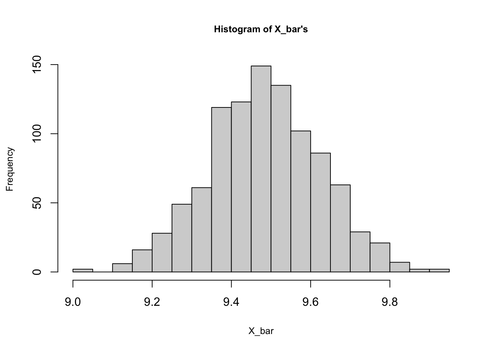

# (PART) Formal Look at Prediction {-}
# Learning Systems {-}

A process of learning in a learning system can be summarized in several steps:

1. The learner has a sample of observations.  This is an arbitrary (random) set of objects or instances each of which has a set of features ($\mathbf{X}$ - features vector) and labels/outcomes ($y$).  We call this sequence of pairs as a training set: $S=\left(\left(\mathbf{X}_{1}, y_{1}\right) \ldots\left(\mathbf{X}_{m}, y_{m}\right)\right)$.  
2. We ask the learner to produce a **prediction rule** (a predictor or a classifier), so that we can use it to predict the outcome of **new** observations (instances).  
3. We assume that the training dataset $S$ is generated by a data-generating model (DGM) or a labeling function, $f(x)$.  The learner does not know about $f(x)$.  In fact, we ask the learner to discover it.  
4. The learner will come up with a **prediction rule**, $\hat{f}(x)$, by using $S$, which will be different than $f(x)$.  Hence, we can measure the learning system's performance by a loss function:  $L_{(S, f)}(\hat{f})$, which is a sort of rule (or a function) that defines the difference between $\hat{f}(x)$ and $f(x)$. This is also called as the **generalization error** or the **risk**.  
5. The goal of the algorithm is to find $\hat{f}(x)$ that minimizes the difference from the unknown $f(x)$. The key point here is that, since the learner does not know $f(x)$, it cannot quantify the gap.  However, it calculates the prediction error also called as the **empirical error** or the **empirical risk**, which is a function that defines the difference between $\hat{f}(x)$ and $y_i$.  
6. Hence, the learning process can be defined as coming up with a predictor $\hat{f}(x)$ that minimizes the empirical error.  This process is called **Empirical Risk Minimization** (ERM).  

The question now becomes what sort of conditions would lead to bad or good ERM?  

If we use the training data (in-sample data points) to minimize the empirical risk, the process can lead to $L_{(S, f)}(\hat{f}) = 0$.  This problem is called **overfitting** and the only way to rectify it is to restrict the sample that the learning model can access.  The common way to do this is to "train" the model over a subsection of the data (training or in-sample data points) and apply ERM by using the test data (out-sample data points).  Since this process restrict the learning model by limiting the number of observations in it, this procedure is also called **inductive bias** in the process of learning.  

There are always two "universes" in a statistical analysis: the population and the sample.  The population is usually unknown or inaccessible to us. We consider the sample as a random subset of the population.  Whatever the statistical analysis we apply almost always uses that sample dataset, which could be very large or very small.  Although the sample we have is randomly drawn from the population, it may not always be representative of the population.  There is always some risk that the sampled data happen to be very unrepresentative of the population.  Intuitively, the sample is a window through which we have partial information about the population.  We use the sample to **estimate** an unknown parameter of the population, which is the main task of **inferential statistics**.  In predictive systems, we also use the sample, but we develop a **prediction rule** to predict unknown population outcomes.  

Can we use an **estimator** as a **predictor**?  Could a "good" estimator also be a "good" predictor.  We had some simulations in the previous chapter showing that the best estimator could be the worst predictor.  Why? In this section we will try to delve deeper into these questions to find answers.  

The starting point will be to define these two different but similar processes.  


# Bias-Variance Tradeoff

The intuition behind the subject formally covered in the following chapters is simple: if a "thing" is more specific to a certain "environment", it would be less generalizable for other environments.  The "thing" is our predictive model, the "environment" is the data, our sample.  If we build a model that fits (predicts) our sample very well, it would be too specific for that data but less generalizable for other samples.  What's the "sweet spot" between being "specific" and "generalizable" when we build a predictive model?      

## Estimator and MSE
  
The task is to **estimate an unknown population parameter**, say $\theta$, which could be a simple mean of $X$, $\mu_x$, or a more complex slope coefficient, $\beta$, of an unknown DGM.  We use a random sample from the population and $\hat{\theta}$ as an estimator of $\theta$.  

We need to choose the best estimator to estimate $\theta$ among many possible estimators.  For example, if we want to estimate $\mu_x$, we could use,    

$$
\bar{X}=\frac{1}{n} \sum_{i=1}^{n} x_{i}
$$
or alternatively,

$$
\hat{X}=0.5 x_{1}+0.5x_{n}
$$
  
Therefore, we need to define what makes an estimator the "best" among others.  The sampling distribution, which is the probability distribution of all possible **estimates** obtained from repeated sampling, would help us develop some principles. The first and the most important criteria should be that the expected mean of all estimates obtained from repeated samples should be equal to $\mu_x$.  Any estimator satisfying this condition is called as an **unbiased** estimator.  

However, if $x$'s are independently and identically distributed (i.i.d), it can be shown that those two estimators, $\bar{X}$ and $\hat{X}$, are both unbiased.  That is, $\mathbf{E}(\bar{X})= \mathbf{E}(\hat{X})=\mu_x$.  Although, it would be easy to obtain an algebraic proof, a simulation exercise can help us visualize it.  In fact, we can add a third estimator, $\tilde{X}=x_3$, which is also unbiased.  


```r
# Population
populationX <- c(0, 3, 12)

#Container to have repeated samples
samples <- matrix(0, 2000, 3)
colnames(samples) <- c("FirstX", "SecondX", "ThirdX")

# Random samples from population
set.seed(123)
for (i in 1:nrow(samples)) {
  samples[i, ] <- sample(populationX, 3, replace = TRUE)
}
head(samples)
```

```
##      FirstX SecondX ThirdX
## [1,]     12      12     12
## [2,]      3      12      3
## [3,]      3       3     12
## [4,]      0       3      3
## [5,]      0       3     12
## [6,]      0      12     12
```
  
In this simulation the population has only 3 values (0, 3, 12) but our sample can draw the same number multiple times. Each row is displaying the first few samples of 2000 random samples drawn from the population.  Each column shows the order of observations, or random draws, $x_1, x_2, x_3$.  This example may seem strange because of its population size, but for the sake of simplicity, it works fine in our experiment.  We know the population $\mu_x$ is 5, which is the mean of our three values (0, 3, 12) in the population.  Knowing this, we can test the following points:  

1. Is $X$ i.i.d?  An identical distribution requires $\mathbf{E}(x_1)=\mathbf{E}(x_2)=\mathbf{E}(x_3)$ and $\mathbf{Var}(x_1)=\mathbf{Var}(x_2)=\mathbf{Var}(x_3)$.  And an independent distribution requires $\mathbf{Corr}(x_i,x_j)=0$ where $i\neq{j}$.  
2. Are the three estimators unbiased.  That is, whether $\mathbf{E}(\bar{X})= \mathbf{E}(\hat{X})= \mathbf{E}(\tilde{X}) = \mu_x$.  

Let's see:  
  

```r
library(corrplot)

# Check if E(x_1)=E(x_2)=E(x_3)
round(colMeans(samples),2)
```

```
##  FirstX SecondX  ThirdX 
##    5.07    5.00    5.13
```

```r
# Check if Var(x_1)=Var(x_2)=Var(x_3)
apply(samples, 2, var)
```

```
##   FirstX  SecondX   ThirdX 
## 26.42172 25.39669 26.31403
```

```r
# Check correlation
cor(samples)
```

```
##               FirstX      SecondX       ThirdX
## FirstX   1.000000000 -0.025157827 -0.005805772
## SecondX -0.025157827  1.000000000 -0.002157489
## ThirdX  -0.005805772 -0.002157489  1.000000000
```

```r
# Note that if we use only unique set of samples
uniqsam <- unique(samples)
colMeans(uniqsam)
```

```
##  FirstX SecondX  ThirdX 
##       5       5       5
```

```r
apply(uniqsam, 2, var)
```

```
##  FirstX SecondX  ThirdX 
##      27      27      27
```

```r
cor(uniqsam)
```

```
##         FirstX SecondX ThirdX
## FirstX       1       0      0
## SecondX      0       1      0
## ThirdX       0       0      1
```

It seems that the i.i.d condition is satisfied.  Now, we need to answer the second question, whether the estimators are unbiased or not. For this, we need to apply each estimator to each sample:  


```r
# Xbar
X_bar <- c() 
for(i in 1:nrow(samples)){
  X_bar[i] <- sum(samples[i, ]) / ncol(samples)
}

mean(X_bar)
```

```
## [1] 5.064
```

```r
# Xhat
X_hat <- c()
for(i in 1:nrow(samples)){
  X_hat[i] <- 0.5*samples[i, 1] + 0.5*samples[i, 3]
}

mean(X_hat)
```

```
## [1] 5.097
```

```r
# Xtilde
X_tilde <- c()
for(i in 1:nrow(samples)){
  X_tilde[i] <- samples[i,3]
}

mean(X_tilde)
```

```
## [1] 5.127
```

Yes, they are unbiased because $\mathbf{E}(\bar{X})\approx \mathbf{E}(\hat{X}) \approx \mathbf{E}(\tilde{X}) \approx \mu_x \approx 5$.  

But this is not enough. Which estimator is better?  The answer is the one with the smallest variance.  We call it an "efficient" estimator. The reason is that the interval estimation of $\mu_x$ will be narrower when the sampling distribution has a smaller variance.  Let's see which one has the smallest variance:   


```r
var(X_bar)
```

```
## [1] 8.490149
```

```r
var(X_hat)
```

```
## [1] 13.10739
```

```r
var(X_tilde)
```

```
## [1] 26.31403
```
  
The $\bar{X}$ has the smallest variance among the unbiased estimators, $\bar{X}=\frac{1}{n} \sum_{i=1}^{n} x_{i}$, $\hat{X}=0.5 x_{1}+0.5x_{n}$, and $\tilde{X}=x_3$.

In practice we have only one sample.  We know that if the sample size is big enough (more than 50, for example), the sampling distribution would be normal according to [the Central Limit Theorem (CLT)](https://en.wikipedia.org/wiki/Central_limit_theorem). In other words, if the number of observations in each sample large enough, $\bar{X} \sim N(\mu_x, \sigma^{2}/n)$ or when population variance is not known $\bar{X} \sim \mathcal{T}\left(\mu, S^{2}\right)$ where $S$ is the standard deviation of the sample and $\mathcal{T}$ is the Student's $t$-distribution.  

Why is this important?  Because it works like a magic: with only one sample, we can **generalize** the results for the population.  We will not cover the details of interval estimation here, but by knowing $\bar{X}$ and the sample variance $S$, we can have the following interval for the $\mu_{x}$:  

$$
\left(\bar{x}-t^{*} \frac{s}{\sqrt{n}}, \bar{x}+t^{*} \frac{s}{\sqrt{n}}\right)
$$
  
where $t^*$, the critical values in $t$-distribution, are usually around 1.96 for samples more than 100 observations and for the 95% confidence level.  This interval would be completely wrong or misleading if $\mathbf{E}(\bar{X}) \neq \mu_x$ and would be useless if it is very wide, which is caused by a large variance.  That's the reason why we don't like large variances.  

Let's summarize the important steps in estimations:  

1. The main task is to estimate the population parameter from a sample.
2. The requirement for a (linear) estimator is **unbiasedness**.
3. An **unbiased** estimator is called as the **B**est **L**inear **U**nbiased **E**stimator (BLUE) of a population parameter if it has the **minimum variance** among all other **unbiased** estimators.

These steps are also observed when we use Mean Squared Error (MSE) to evaluate each estimator's performance. The MSE of an estimator $\hat{\theta}$ with respect to an unknown population parameter $\theta$  is defined as  

$$
\mathbf{MSE}(\hat{\theta})=\mathbf{E}_{\hat{\theta}}\left[(\hat{\theta}-\theta)^{2}\right]=\mathbf{E}_{\hat{\theta}}\left[(\hat{\theta}-\mathbf{E}(\hat{\theta}))^{2}\right]
$$
  
Since we choose only unbiased estimators, $\mathbf{E}(\hat{\theta})=\theta$, this expression becomes $\mathbf{Var}(\hat{\theta})$.  Hence, evaluating the performance of all alternative **unbiased** estimators by MSE is actually comparing their variances and picking up the smallest one. More specifically,

\begin{equation}
\mathbf{MSE}\left(\hat{\theta}\right)=\mathbf{E}\left[\left(\hat{\theta}-\theta\right)^{2}\right]=\mathbf{E}\left\{\left(\hat{\theta}-\mathbf{E}\left(\hat{\theta}\right)+\mathbf{E}\left(\hat{\theta}\right)-\theta\right)^{2}\right\}
  (\#eq:3-1)
\end{equation} 

$$
=\mathbf{E}\left\{\left(\left[\hat{\theta}-\mathbf{E}\left(\hat{\theta}\right)\right]+\left[\mathbf{E}\left(\hat{\theta}\right)-\theta\right]\right)^{2}\right\}
$$


\begin{equation}
\begin{aligned}
\mathbf{MSE}(\hat{\theta})=& \mathbf{E}\left\{\left[\hat{\theta}-\mathbf{E}\left(\hat{\theta}\right)\right]^{2}\right\}+\mathbf{E}\left\{\left[\mathbf{E}\left(\hat{\theta}\right)-\theta\right]^{2}\right\} \\
&+2 \mathbf{E}\left\{\left[\hat{\theta}-\mathbf{E}\left(\hat{\theta}\right)\right]\left[\mathbf{E}\left(\hat{\theta}\right)-\theta\right]\right\}
\end{aligned}
  (\#eq:3-2)
\end{equation} 
  
The first term in 3.2 is the variance.  The second term is outside of expectation, as $[\mathbf{E}(\hat{\theta})-\theta]$ is not random, which represents the bias.  The last term is zero.  This is because $[\mathbf{E}(\hat{\theta})-\theta]$ is not random, therefore it is again outside of expectations:  

$$
2\left[\mathbf{E}\left(\hat{\theta}\right)-\theta\right] \mathbf{E}\left\{\left[\hat{\theta}-\mathbf{E}\left(\hat{\theta}\right)\right]\right\},
$$
and the last term is zero since $\mathbf{E}(\hat{\theta})-\mathbf{E}(\hat{\theta}) = 0$.  Hence,  

$$
\mathbf{MSE}\left(\hat{\theta}\right)=\mathbf{Var}\left(\hat{\theta}\right)+\left[\mathbf{bias}\left(\hat{\theta}\right)\right]^{2}
$$

Because we choose only unbiased estimators, $\mathbf{E}(\hat{\theta})=\theta$, this expression becomes $\mathbf{Var}(\hat{\theta})$.  In our case, the estimator can be $\hat{\theta}=\bar{X}$ and what we try to estimate is $\theta = \mu_x$.   

## Prediction - MSPE


Let's follow the same example. Our task is now different.  We want to **predict** the unobserved value of $X$ rather than to estimate $\mu_x$.  Therefore, we need a **predictor**, not an **estimator**.  What makes a good predictor?  Is unbiasedness one of them?  If we use a biased estimator such as  

$$
X^*=\frac{1}{n-4} \sum_{i=1}^{n} x_{i}
$$

to predict $x_0$, would being a biased estimator make it automatically a bad predictor?  To answer these questions, we need to look at MSE again.  Since our task is prediction, we (usually) change its name to **mean square prediction error** (MSPE).  

\begin{equation}
\mathbf{MSPE}=\mathbf{E}\left[(x_0-\hat{f})^{2}\right]=\mathbf{E}\left[(f+\varepsilon_0-\hat{f})^{2}\right]
  (\#eq:3-3)
\end{equation} 

  
Similar to the best estimator, a predictor with the smallest MSPE will be our choice among other alternative predictors. Let's summarize some important facts about our MSPE here:  

1. $x_0$ is the number we want to predict and $\hat{f}$ is the predictor, which could be $\mathbf{E}(\bar{X})$, $\mathbf{E}(\hat{X})$, or $\mathbf{E}(\tilde{X})$ or any other predictor.
2. $x_0 = \mu_x + \varepsilon_0$, where $f = \mu_x$.  Hence, $\mathbf{E}[x_0]=f$ so that $\mathbf{E}[\varepsilon_0]=0$.
3. $\mathbf{E}[f]=f$.  In other words, the expected value of a constant is a constant: $\mathbf{E}[\mu_x]=\mu_x$.
4. $\mathbf{Var}[x_0]=\mathbf{E}\left[(x_0-\mathbf{E}[x_0])^{2}\right]=\mathbf{E}\left[(x_0-f)^{2}\right]=\mathbf{E}\left[(f+\varepsilon_0-f)^{2}\right]=\mathbf{E}\left[\varepsilon_0^{2}\right]=\mathbf{Var}[\varepsilon_0]=\sigma^{2}.$  

Note that we can use MSPE here because our example is not a classification problem.  When we have a binary outcome to predict, the loss function would have a different structure.  We will see the performance evaluation in classification problems later.  

Before running a simulation, let's look at MSPE closer. We will drop the subscript $0$ to keep the notation simple.  With a trick, adding and subtracting $\mathbf{E}(\hat{f})$, MSPE becomes 

$$
\mathbf{MSPE}=\mathbf{E}\left[(x-\hat{f})^{2}\right]=\mathbf{E}\left[(f+\varepsilon-\hat{f})^{2}\right]=\mathbf{E}\left[(f+\varepsilon-\hat{f}+\mathbf{E}[\hat{f}]-\mathbf{E}[\hat{f}])^{2}\right]
$$
$$
=\mathbf{E}\left[(f-\mathbf{E}[\hat{f}])^{2}\right]+\mathbf{E}\left[\varepsilon^{2}\right]+\mathbf{E}\left[(\mathbf{E}[\hat{f}]-\hat{f})^{2}\right]+2 \mathbf{E}[(f-\mathbf{E}[\hat{f}]) \varepsilon]+2 \mathbf{E}[\varepsilon(\mathbf{E}[\hat{f}]-\hat{f})]+\\2 \mathbf{E}[(\mathbf{E}[\hat{f}]-\hat{f})(f-\mathbf{E}[\hat{f}])],
$$
  
which can be simplified with the following few steps:  

1. The first term, $\mathbf{E}\left[(f-\mathbf{E}[\hat{f}])^{2}\right]$, is $(f-\mathbf{E}[\hat{f}])^{2}$, because $(f-\mathbf{E}[\hat{f}])^{2}$ is a constant.
2. Similarly, the same term, $(f-\mathbf{E}[\hat{f}])^{2}$ is in the $4^{th}$ term.  Hence, $2 \mathbf{E}[(f-\mathbf{E}[\hat{f}]) \varepsilon]$ can be written as $2(f-\mathbf{E}[\hat{f}]) \mathbf{E}[\varepsilon]$.    
3. Finally, the $5^{th}$ term, $2 \mathbf{E}[\varepsilon(\mathbf{E}[\hat{f}]-\hat{f})]$, can be written as $2 \mathbf{E}[\varepsilon] \mathbf{E}[\mathbf{E}[\hat{f}]-\hat{f}]$.  (Note that $\varepsilon$ and $\hat{f}$ are independent)

As a result we have:  
$$
\mathbf{MSPE}=(f-\mathbf{E}[\hat{f}])^{2}+\mathbf{E}\left[\varepsilon^{2}\right]+\mathbf{E}\left[(\mathbf{E}[\hat{f}]-\hat{f})^{2}\right]+2(f-\mathbf{E}[\hat{f}]) \mathbf{E}[\varepsilon]+2 \mathbf{E}[\varepsilon] \mathbf{E}[\mathbf{E}[\hat{f}]-\hat{f}]+\\2 \mathbf{E}[\mathbf{E}[\hat{f}]-\hat{f}](f-\mathbf{E}[\hat{f}])
$$

The $4^{th}$ and the $5^{th}$ terms are zero because $\mathbf{E}[\varepsilon]=0$.  The last term is also zero because $\mathbf{E}[\mathbf{E}[\hat{f}]-\hat{f}]$ is $\mathbf{E}[\hat{f}]-\mathbf{E}[\hat{f}]$.  Hence, we have:  

$$
\mathbf{MSPE}=(f-\mathbf{E}[\hat{f}])^{2}+\mathbf{E}\left[\varepsilon^{2}\right]+\mathbf{E}\left[(\mathbf{E}[\hat{f}]-\hat{f})^{2}\right]
$$

Let's look at the second term first.  It's called as "**irreducible error**" because it comes with the data.  Thus, we can write:

\begin{equation}
\mathbf{MSPE}=(\mu_x-\mathbf{E}[\hat{f}])^{2}+\mathbf{E}\left[(\mathbf{E}[\hat{f}]-\hat{f})^{2}\right]+\mathbf{Var}\left[x\right]
  (\#eq:3-4)
\end{equation} 


The first term of 3.4 is the bias squared.  It would be zero for an unbiased estimator, that is, if $\mathbf{E}[\hat{f}]=\mu_x.$  The second term is the variance of the estimator.  For example, if the predictor is $\bar{X}$ it would be $\mathbf{E}\left[(\bar{X} -\mathbf{E}[\bar{X}])^{2}\right]$.  Hence, the variance comes from the sampling distribution.

$$
\mathbf{MSPE}=\mathbf{Bias}[\hat{f}]^{2}+\mathbf{Var}[\hat{f}]+\sigma^{2}
$$

These two terms together, the bias-squared and the variance of $\hat{f}$, is called **reducible error**.  Hence, the MSPE can be written as 

$$
\mathbf{MSPE}=\mathbf{Reducible~Error}+\mathbf{Irreducible~Error}
$$

Now, our job is to pick a **predictor** that will have the minimum MSPE among alternatives.  Obviously, we can pick $\bar{X}$ because it has a zero-bias.  But now, unlike an **estimator**, we can accept some bias as long as the MSPE is lower.  More specifically, we can allow a predictor to have a bias if it reduces the variance more than the bias itself. In predictions, we can have a reduction in MSPE by allowing a **trade-off between variance and bias**. How can we achieve it?  For example, our predictor would be a constant, say 4, which, although it's a biased estimator, has **a zero variance**.  However, the MSPE would probably increase because the bias would be much larger than the reduction in the variance.

#### Trade-off {-}

Although conceptually the variance-bias trade-off seems intuitive, at least mathematically, we need to ask another practical question: how can we calculate MSPE?  How can we see the segments of MSPE in a simulations?  

We will use the same example. We have a population with three numbers: 0, 3, and 12.  We sample from this "population" multiple times. Now the task is to use each sample and come up with a predictor (a prediction rule) to predict a number or multiple numbers drawn from the same population.


```r
# The same example here again
populationX <- c(0, 3, 12)

# A container to have 2000 samples
Ms <- 2000 
samples <- matrix(0, Ms, 3)
colnames(samples) <- c("FirstX", "SecondX", "ThirdX")

# All samples (with replacement always)
set.seed(123)
for (i in 1:nrow(samples)) {
  samples[i, ] <- sample(populationX, 3, replace = TRUE)
}
head(samples)
```

```
##      FirstX SecondX ThirdX
## [1,]     12      12     12
## [2,]      3      12      3
## [3,]      3       3     12
## [4,]      0       3      3
## [5,]      0       3     12
## [6,]      0      12     12
```
  
Now suppose that we come up with two predictors: $\hat{f}_1 = 9$ and $\hat{f}_2 = \bar{X}$:  


```r
# Container to record all predictions
predictions <- matrix(0, Ms, 2)

# fhat_1 = 9
for (i in 1:Ms) {
  predictions[i,1] <- 9
}

# fhat_2 - mean
for (i in 1:Ms) {
  predictions[i,2] <- sum(samples[i,])/length(samples[i,])
}

head(predictions)
```

```
##      [,1] [,2]
## [1,]    9   12
## [2,]    9    6
## [3,]    9    6
## [4,]    9    2
## [5,]    9    5
## [6,]    9    8
```
  
Now let's have our MSPE decomposition:


```r
# MSPE
MSPE <- matrix(0, Ms, 2)
for (i in 1:Ms) {
  MSPE[i,1] <- mean((populationX-predictions[i,1])^2)
  MSPE[i,2] <- mean((populationX-predictions[i,2])^2)
}
head(MSPE)
```

```
##      [,1] [,2]
## [1,]   42   75
## [2,]   42   27
## [3,]   42   27
## [4,]   42   35
## [5,]   42   26
## [6,]   42   35
```

```r
# Bias
bias1 <- mean(populationX)-mean(predictions[,1])
bias2 <- mean(populationX)-mean(predictions[,2])

# Variance (predictor)
var1 <- var(predictions[,1])
var2 <- var(predictions[,2])

# Variance (epsilon)
var_eps <- mean((populationX-mean(populationX))^2)
```

Let's put them in a table:


```r
VBtradeoff <- matrix(0, 2, 4)
rownames(VBtradeoff) <- c("fhat_1", "fhat_2")
colnames(VBtradeoff) <- c("Bias", "Var(fhat)", "Var(eps)", "MSPE")
VBtradeoff[1,1] <- bias1^2
VBtradeoff[2,1] <- bias2^2
VBtradeoff[1,2] <- var1
VBtradeoff[2,2] <- var2
VBtradeoff[1,3] <- var_eps
VBtradeoff[2,3] <- var_eps
VBtradeoff[1,4] <- mean(MSPE[,1])
VBtradeoff[2,4] <- mean(MSPE[,2])
round(VBtradeoff, 3)
```

```
##          Bias Var(fhat) Var(eps)  MSPE
## fhat_1 16.000      0.00       26 42.00
## fhat_2  0.004      8.49       26 34.49
```
  
This table shows the decomposition of MSPE. The first column is the contribution to the MSPE from the bias; the second column is the contribution from the variance of the predictor. These together make up the reducible error. The third column is the variance that comes from the data, the irreducible error. The last column is, of course, the total MSPE, and we can see that $\hat{f}_2$ is the better predictor because of its lower MSPE.  This decomposition would be checked with 


```r
colMeans(MSPE)
```

```
## [1] 42.00 34.49
```


## Biased estimator as a predictor


We saw earlier that $\bar{X}$ is a better estimator. But if we have some bias in our predictor, can we reduce MSPE?  Let's define a biased estimator of $\mu_x$:

$$
\hat{X}_{biased} = \hat{\mu}_x=\alpha \bar{X}
$$
  
The sample mean $\bar{X}$ is an unbiased estimator of $\mu_x$. The magnitude of the bias is $\alpha$ and as it goes to 1, the bias becomes zero.  As before, we are given one sample with three observations from the same distribution (population). We want to guess the value of a new data point from the same distribution.  We will make the prediction with the best predictor which has the minimum MSPE.   By using the same decomposition we can show that:  

$$
\hat{\mu}_x=\alpha \bar{X}
$$
  
$$
\mathbf{E}[\hat{\mu}_x]=\alpha \mu_x
$$
  
$$
\mathbf{MSPE}=[(1-\alpha) \mu_x]^{2}+\frac{1}{n} \alpha^{2} \sigma_{\varepsilon}^{2}+\sigma_{\varepsilon}^{2}
$$
  
Our first observation is that when $\alpha$ is one, the bias will be zero.  Since it seems that MSPE is a convex function of $\alpha$, we can search for $\alpha$ that minimizes MSPE.  The first-order-condition would give us the solution:

$$
\frac{\partial \mathbf{MSPE}}{\partial \alpha} =0 \rightarrow ~~ \alpha = \frac{\mu^2_x}{\mu^2_x+\sigma^2_\varepsilon/n}<1
$$
  
Let's see if this level of bias would improve MSPE that we found earlier:


```r
pred <- c()

# The magnitude of bias
alpha <- (mean(populationX))^2/((mean(populationX)^2 + var_eps/3))
alpha
```

```
## [1] 0.7425743
```

```r
# Biased predictor
for (i in 1:Ms) {
  pred[i] <- alpha*predictions[i, 2]
}

# Check if E(alpha*Xbar) = alpha*mu_x
mean(pred)
```

```
## [1] 3.760396
```

```r
alpha*mean(populationX)
```

```
## [1] 3.712871
```

```r
# MSPE
MSPE_biased <- c()
for (i in 1:Ms) {
  MSPE_biased[i] <- mean((populationX-pred[i])^2)
}
mean(MSPE_biased)
```

```
## [1] 32.21589
```
  
Let's add this predictor into our table:  


```r
VBtradeoff <- matrix(0, 3, 4)
rownames(VBtradeoff) <- c("fhat_1", "fhat_2", "fhat_3")
colnames(VBtradeoff) <- c("Bias", "Var(fhat)", "Var(eps)", "MSPE")
VBtradeoff[1,1] <- bias1^2
VBtradeoff[2,1] <- bias2^2
VBtradeoff[3,1] <- (mean(populationX)-mean(pred))^2
VBtradeoff[1,2] <- var1
VBtradeoff[2,2] <- var2
VBtradeoff[3,2] <- var(pred)
VBtradeoff[1,3] <- var_eps
VBtradeoff[2,3] <- var_eps
VBtradeoff[3,3] <- var_eps
VBtradeoff[1,4] <- mean(MSPE[,1])
VBtradeoff[2,4] <- mean(MSPE[,2])
VBtradeoff[3,4] <- mean(MSPE_biased)
round(VBtradeoff, 3)
```

```
##          Bias Var(fhat) Var(eps)   MSPE
## fhat_1 16.000     0.000       26 42.000
## fhat_2  0.004     8.490       26 34.490
## fhat_3  1.537     4.682       26 32.216
```

When we allow some bias in our predictor the variance drops from 8.490 to 4.682. Since the decrease in variance is bigger than the increase in bias, the MSPE goes down.  This example shows the difference between estimation and prediction for a simplest predictor, the mean of $X.$  We will see a more complex example when we have a regression later.   

Before moving on to the next section, let's ask a question: what if we use in-sample data points to calculate MSPE. In our simple case, suppose you have the $3^{rd}$ sample, {3, 3, 12}. Would you still choose $\bar{X}$ as your predictor?   Suppose you calculate MSPE by in-sample data points using the $3^{rd}$ sample. Would $\hat{f}(x) = \bar{X}$ be still your choice of predictor?  If we use it, the MSPE would be 18, which is not bad and may be much lower than that of some arbitrary number, say 9, as a predictor.

In search of a better predictor, however, $\hat{f}(x) = {x_i}$, will give us a lower MSPE, which will be zero. In other words, it interpolates the data. This is called the **overfitting** problem because the predictor could have the worst MSPE if it's tested on out-sample data points.    
  
## Dropping a variable in a regression
  
We can assume that the outcome $y_i$ is determined by the following function:

$$
y_{i}=\beta_0+\beta_1 x_{i}+\varepsilon_{i}, ~~~~ i=1, \ldots, n
$$
where $\varepsilon_{i} \sim N\left(0, \sigma^{2}\right)$, $\mathrm{Cov}\left(\varepsilon_{i}, \varepsilon_{j}\right)=0$ for $i\neq j.$  Although unrealistic, for now we assume that $x_i$ is **fixed** (non-stochastic) for simplicity in notations. That means in each sample we have same $x_i$.  We can write this function as

$$
y_{i}=f(x_i)+\varepsilon_{i}, ~~~~ i=1, \ldots, n
$$

As usual, $f(x_i)$ is the deterministic part (DGM) and $\varepsilon_i$ is the random part in the function that together determine the value of $y_i$.  Again, we are living in two universes: the population and a sample.  Since none of the elements in population is known to us, we can only **assume** what $f(x)$ would be.  Based on a sample and the assumption about DGM, we choose an estimator of $f(x)$,

$$
\hat{f}(x) = \hat{\beta}_0+\hat{\beta}_1 x_{i},
$$
  
which is BLUE of $f(x)$, when it is estimated with OLS given the assumptions about $\varepsilon_i$ stated above.  Since the task of this estimation is to satisfy the **unbiasedness** condition, i.e. $\mathrm{E}[\hat{f}(x)]=f(x)$, it can be achieved only if $\mathrm{E}[\hat{\beta_0}]=\beta_0$ and $\mathrm{E}[\hat{\beta_1}]=\beta_1$.  At the end of this process, we can understand the effect of $x$ on $y$, signified by the unbiased slope coefficient $\hat{\beta_1}$.  This is not as an easy job as it sounds in this simple example.  Finding an unbiased estimator of $\beta$ is the main challenge in the field of econometrics.   

In **prediction**, on the other hand, our main task is **not** to find unbiased estimator of $f(x)$.  We just want to **predict** $y_0$ given $x_0$.  The subscript $0$ tells us that we want to predict $y$ for a specific value of $x$.  Hence we can write it as,  

$$
y_{0}=\beta_0+\beta_1 x_{0}+\varepsilon_{0}, 
$$
   
In other words, when $x_0=5$, for example, $y_0$ will be determined by $f(x_0)$ and the random error, $\varepsilon_0$, which has the same variance, $\sigma^2$, as $\varepsilon_i$.  Hence, when $x_0=5$, although $f(x_0)$ is fixed, $y_0$ will vary because of its random part, $\varepsilon_0$.  This in an irreducible uncertainty in predicting $y_0$ given $f(x_0)$.  We do not know about the population.  Therefore, we do not know what $f(x_0)$ is.  We can have a sample from the population and build a model $\hat{f}(x)$ so that $\hat{f}(x_0)$ would be as close to $f(x_0)$ as possible.  But this introduces another layer of uncertainty in predicting $y_0$. Since each sample is random and different, $\hat{f}(x_0)$ will be a function of the sample: $\hat{f}(x_0, S_m)$. Of course, we will have one sample in practice.  However, if this variation is high, it would be highly likely that our predictions, $\hat{f}(x_0, S_m)$, would be far off from $f(x_0)$.  

We can use an **unbiased** estimator for prediction, but as we have seen before, we may be able to improve MSPE if we allow some **bias** in $\hat{f}(x)$.  To see this potential trade-off, we look at the decomposition of MSPE with a simplified notation:

$$
\mathbf{MSPE}=\mathrm{E}\left[(y_0-\hat{f})^{2}\right]=\mathrm{E}\left[(f+\varepsilon-\hat{f})^{2}\right]
$$
$$
\mathbf{MSPE}=\mathrm{E}\left[(f+\varepsilon-\hat{f}+\mathrm{E}[\hat{f}]-\mathrm{E}[\hat{f}])^{2}\right]
$$

We have seen this before. Since we calculate MSPE for $x_i = x_0$, we call it the conditional MSPE, which can be expressed as $\mathbf{MSPE}=\mathbf{E}\left[(y_0-\hat{f})^{2}|x=x_0\right]$.  We will see unconditional MSPE, which is the average of all possible data points later in last two sections.  The simplification will follow the same steps, and we will have:  

$$
\mathbf{MSPE}=(f-\mathrm{E}[\hat{f}])^{2}+\mathrm{E}\left[(\mathrm{E}[\hat{f}]-\hat{f})^{2}\right]+\mathrm{E}\left[\varepsilon^{2}\right]
$$

Let's look at the first term first:  

$$
\left(f-\mathrm{E}[\hat{f}]\right)^{2}=\left(\beta_0+\beta_1 x_{0}-\mathrm{E}[\hat{\beta}_0]-x_{0}\mathrm{E}[\hat{\beta}_1]\right)^2=\left((\beta_0-\mathrm{E}[\hat{\beta}_0])+x_{0}(\beta_1-\mathrm{E}[\hat{\beta}_1])\right)^2.
$$
  
Hence, it shows the bias (squared) in parameters.
  
   
The second term is the variance of $\hat{f}(x)$:  

$$
\mathrm{E}\left[(\mathrm{E}[\hat{f}]-\hat{f})^{2}\right]=\mathrm{Var}[\hat{f}(x)]=\mathrm{Var}[\hat{\beta}_0+\hat{\beta}_1 x_{0}]=\mathrm{Var}[\hat{\beta}_0]+x_{0}^2\mathrm{Var}[\hat{\beta}_1]+2x_{0}\mathrm{Cov}[\hat{\beta}_0,\hat{\beta}_1]
$$
  
As expected, the model's variance is the sum of the variances of estimators and their covariance.  Again, the variance can be thought of variation of $\hat{f}(x)$ from sample to sample.  

With the irreducible prediction error $\mathrm{E}[\varepsilon^{2}]=\sigma^2$,  

$$
\mathbf{MSPE}=(\mathbf{bias})^{2}+\mathbf{Var}(\hat{f})+\sigma^2.
$$
  
Suppose that our OLS estimators are **unbiased** and that $\mathrm{Cov}[\hat{\beta}_0,\hat{\beta}_1]=0$.  In that case,  

$$
\mathbf{MSPE}_{OLS}  =\mathrm{Var}(\hat{\beta}_{0})+x_{0}^2\mathrm{Var}(\hat{\beta}_{1})+\sigma^2
$$

Before going further, let's summarize the meaning of this measure.  The mean squared prediction error of unbiased $\hat{f}(x_0)$, or how much $\hat{f}(x_0)$ deviates from $y_0$ is defined by two factors: First, $y_0$ itself varies around $f(x_0)$ by $\sigma^2$. This is irreducible. Second, $\hat{f}(x_0)$ varies from sample to sample.  The model's variance is the sum of variations in estimated coefficients from sample to sample, which can be reducible.  
  
Suppose that $\hat{\beta}_{1}$ has a large variance.  Hence, we can ask what would happen if we dropped the variable:  

$$
\mathbf{MSPE}_{Biased~OLS}  = \mathbf{Bias}^2+\mathbf{Var}(\hat{\beta}_{0})+\sigma^2
$$

When we take the difference:  

$$
\mathbf{MSPE}_{OLS} -\mathbf{MSPE}_{Biased~OLS} =x_{0}^2\mathbf{Var}(\hat{\beta}_{1}) - \mathbf{Bias}^2 
$$
  
This expression shows that dropping a variable would decrease the expected prediction error if:  

$$
x_{0}^2\mathbf{Var}(\hat{\beta}_{1}) > \mathbf{Bias}^2 ~~\Rightarrow~~  \mathbf{MSPE}_{Biased~OLS} < \mathbf{MSPE}_{OLS} 
$$
  
**This option, omitting a variable, is unthinkable if our task is to obtain an unbiased estimator** of ${f}(x)$, but improves the prediction accuracy if the condition above is satisfied.  Let's expand this example into a two-variable case:  

$$
y_{i}=\beta_0+\beta_1 x_{1i}+\beta_2 x_{2i}+\varepsilon_{i}, ~~~~ i=1, \ldots, n.
$$
  
Thus, the bias term becomes  

$$
\left(f-\mathrm{E}[\hat{f}]\right)^{2}=\left((\beta_0-\mathrm{E}[\hat{\beta}_0])+x_{10}(\beta_1-\mathrm{E}[\hat{\beta}_1])+x_{20}(\beta_2-\mathrm{E}[\hat{\beta}_2])\right)^2.
$$
  
And let's assume that $\mathrm{Cov}[\hat{\beta}_0,\hat{\beta}_1]=\mathrm{Cov}[\hat{\beta}_0,\hat{\beta}_2]=0$, but $\mathrm{Cov}[\hat{\beta}_1,\hat{\beta}_2] \neq 0$. Hence, the variance of $\hat{f}(x)$:  

$$
\mathrm{Var}[\hat{f}(x)]=\mathrm{Var}[\hat{\beta}_0+\hat{\beta}_1 x_{10}+\hat{\beta}_2 x_{20}]=\mathrm{Var}[\hat{\beta}_0]+x_{10}^2\mathrm{Var}[\hat{\beta}_1]+x_{20}^2\mathrm{Var}[\hat{\beta}_2]+\\2x_{10}x_{20}\mathrm{Cov}[\hat{\beta}_1,\hat{\beta}_2].
$$
  
This two-variable example shows that as the number of variables rises, the covariance between variables inflates the model's variance further. This fact captured by Variance Inflation Factor ([VIF](https://en.wikipedia.org/wiki/Variance_inflation_factor)) in econometrics is a key point in high-dimensional models for two reasons:  First, dropping a variable highly correlated with other variables would reduce the model's variance substantially.  Second, a highly correlated variable also has limited new information among other variables.  Hence dropping a highly correlated variable (with a high variance) would have a less significant effect on the prediction accuracy while reducing the model's variance substantially.   

Suppose that we want to predict $y_0$ for $\left[x_{10},~ x_{20}\right]$ and $\mathrm{Var}[\hat{\beta}_2] \approx 10~\text{x}~\mathrm{Var}[\hat{\beta}_1]$.  Hence, we consider dropping $x_2$.  To evaluate the effect of this decision on MSPE, we take the difference between two MSPE's:  

$$
\mathbf{MSPE}_{OLS} -\mathbf{MSPE}_{Biased~OLS} =x_{20}^2\mathrm{Var}(\hat{\beta}_{2}) + 2x_{10}x_{20}\mathrm{Cov}[\hat{\beta}_1,\hat{\beta}_2] - \mathbf{Bias}^2 
$$
  
Thus, dropping $x_2$ would decrease the prediction error if  

$$
x_{20}^2\mathrm{Var}(\hat{\beta}_{2}) + 2x_{10}x_{20}\mathrm{Cov}[\hat{\beta}_1,\hat{\beta}_2]> \mathbf{Bias}^2 ~~\Rightarrow~~  \mathbf{MSPE}_{Biased~OLS} < \mathbf{MSPE}_{OLS} 
$$
  
We know from Elementary Econometrics that $\mathrm{Var}(\hat{\beta}_j)$ increases by $\sigma^2$, decreases by the $\mathrm{Var}(x_j)$, and rises by the correlation between $x_j$ and other $x$'s.  Let's look at   $\mathrm{Var}(\hat{\beta}_j)$ closer:  

$$
\mathrm{Var}\left(\hat{\beta}_{j}\right)=\frac{{\sigma}^{2}}{\mathrm{Var}\left(x_{j}\right)} \cdot \frac{1}{1-R_{j}^{2}},
$$
  
where $R_j^2$ is $R^2$ in the regression on $x_j$ on the remaining $(k-2)$ regressors ($x$'s).  The second term is called the variance-inflating factor (VIF).  As usual, a higher variability in a particular $x$ leads to proportionately less variance in the corresponding coefficient estimate. Note that, however, as $R_j^2$ get closer to one, that is, as the correlation between $x_j$ with other regressors approaches to unity, $\mathrm{Var}(\hat{\beta}_j)$ goes to infinity.   

The variance of $\varepsilon_i$, $\sigma^2$, indicates how much $y_i$'s deviate from the $f(x)$.  Since $\sigma^2$ is typically unknown, we estimate it from **the sample** as  

$$
\widehat{\sigma}^{2}=\frac{1}{(n-k+1)} \sum_{i=1}^{n}\left(y_{i}-\hat{f}(x)\right)^{2}
$$
  
Remember that we have multiple samples, hence if our estimator is **unbiased**, we can prove that $\mathbf{E}(\hat{\sigma}^2)=\sigma^2$.  The proof is not important now.  However, $\mathrm{Var}(\hat{\beta}_j)$ becomes  

$$
\mathbf{Var}\left(\hat{\beta}_{j}\right)=\frac{\sum_{i=1}^{n}\left(y_{i}-\hat{f}(x)\right)^{2}}{(n-k+1)\mathrm{Var}\left(x_{j}\right)} \cdot \frac{1}{1-R_{j}^{2}},
$$

It is clear now that a greater sample size, $n$, results in a proportionately less variance in the coefficient estimates.  On the other hand, as the number of regressors, $k$, goes up, the variance goes up.  In large $n$ and small $k$, the trade-off by dropping a variable would be insignificant.  However, as $k/n$ rises, the trade-off becomes more important.  

Let's have a simulation example to conclude this section.  Here are the steps for our simulation:  

1. There is a random variable, $y$, that we want to predict.
2. $y_{i}=f(x_i)+\varepsilon_{i}$.
3. DGM is $f(x_i)=\beta_0+\beta_1 x_{1i}+\beta_2 x_{2i}$
4. $\varepsilon_{i} \sim N(0, \sigma^2)$.
5. The steps above define the **population**.  We will withdraw $M$ number of **samples** from this population.
6. Using each sample ($S_m$, where $m=1, \ldots, M$), we will estimate two models: **unbiased** $\hat{f}(x)_{OLS}$ and **biased** $\hat{f}(x)_{Biased~OLS}$
7. Using these models we will predict $y'_i$ from a different sample ($T$) drawn from the same population.  We can call it the "unseen" dataset or the "test" dataset, which contains out-of-sample data points, $(y'_i, x_{1i}, x_{2i})$., where $i=1, \ldots, n$.  
  
Before we start, we need to be clear how we define MSPE in our simulation. Since  we will predict every $y'_i$ with corresponding predictors $(x_{1i}, x_{2i})$ in test set $T$ by each $\hat{f}(x_{1i}, x_{2i}, S_m))$ estimated by each sample, we calculate the following **unconditional** MSPE:   

$$
\mathbf{MSPE}=\mathbf{E}_{S}\mathbf{E}_{S_{m}}\left[(y'_i-\hat{f}(x_{1i}, x_{2i}, S_m))^{2}\right]=\\\mathbf{E}_S\left[\frac{1}{n} \sum_{i=1}^{n}\left(y_{i}^{\prime}-\hat{f}(x_{1i}, x_{2i}, S_m)\right)^{2}\right],\\m=1, \ldots, M
$$
  
We first calculate MSPE for all data points in the test set using $\hat{f}(x_{1T}, x_{2T}, S_m)$, and then take the average of $M$ samples.  

We will show the sensitivity of trade-off by the size of irreducible error.  The simulation below plots $diff= \mathbf{MSPE}_{OLS}-\mathbf{MSPE}_{Biased~OLS}$ against $\sigma$.  


```r
# Function for X - fixed at repeated samples
# Argument l is used for correlation and with 0.01
# Correlation between x_1 and x_2 is 0.7494
xfunc <- function(n, l){
  set.seed(123)
  x_1 <- rnorm(n, 0, 25) 
  x_2 <- l*x_1+rnorm(n, 0, 0.2)
  X <- data.frame("x_1" = x_1, "x_2" = x_2)
  return(X)
}

# Note that we can model dependencies with copulas in R
# More specifically by using mvrnorn() function.  However, here
# We want one variable with a higher variance. which is easier to do manaully
# More: https://datascienceplus.com/modelling-dependence-with-copulas/ 

# Function for test set - with different X's but same distribution.
unseen <- function(n, sigma, l){
  set.seed(1)
  x_11 <- rnorm(n, 0, 25) 
  x_22 <- l*x_11+rnorm(n, 0, 0.2)
  f <- 0 + 2*x_11 + 2*x_22   
  y_u <- f + rnorm(n, 0, sigma) 
  un <- data.frame("y" = y_u, "x_1" = x_11, "x_2" = x_22)
  return(un)
}

# Function for simulation (M - number of samples)
sim <- function(M, n, sigma, l){
  
  X <- xfunc(n, l) # Repeated X's in each sample
  un <- unseen(n, sigma, l) # Out-of sample (y, x_1, x_2)

  # containers
  MSPE_ols <- rep(0, M)
  MSPE_b <- rep(0, M)
  coeff <- matrix(0, M, 3)
  coeff_b <- matrix(0, M, 2)
  yhat <- matrix(0, M, n)
  yhat_b <- matrix(0, M, n)
  
  # loop for samples
  for (i in 1:M) {
    f <- 0 + 2*X$x_1 + 2*X$x_2   # DGM
    y <- f + rnorm(n, 0, sigma)
    samp <- data.frame("y" = y, X)
    ols <- lm(y~., samp) # Unbaised OLS
    ols_b <- lm(y~x_1, samp) #Biased OLS
    coeff[i,] <- ols$coefficients
    coeff_b[i,] <- ols_b$coefficients
    yhat[i,] <- predict(ols, un)
    yhat_b[i,] <- predict(ols_b, un)
    MSPE_ols[i] <- mean((un$y-yhat[i])^2)
    MSPE_b[i] <- mean((un$y-yhat_b[i])^2)
  }
  d = mean(MSPE_ols)-mean(MSPE_b)
  output <- list(d, MSPE_b, MSPE_ols, coeff, coeff_b, yhat, yhat_b)
  return(output)
}

# Sensitivity of (MSPE_biased)-(MSPE_ols)
# different sigma for the irreducible error
sigma <- seq(1, 20, 1)
MSPE_dif <- rep(0, length(sigma))
for (i in 1: length(sigma)) {
  MSPE_dif[i] <- sim(1000, 100, sigma[i], 0.01)[[1]]
}

plot(sigma, MSPE_dif, col="red", main = "Difference in MSPE vs. sigma",
     cex = 0.9, cex.main= 0.8, cex.lab = 0.7, cex.axis = 0.8)
```


  
The simulation shows that the **biased** $\hat{f}(x)$ has a better predcition accuracy as the "noise" in the data gets higher.  The reason can be understood if we look at $\mathrm{Var}(\hat{\beta}_{2}) + 2\mathrm{Cov}[\hat{\beta}_1,\hat{\beta}_2]$ closer:  

$$
\mathbf{Var}\left(\hat{\beta}_{2}\right)=\frac{\sigma^{2}}{\mathrm{Var}\left(x_{2}\right)} \cdot \frac{1}{1-r_{1,2}^{2}},
$$
  
where $r_{1,2}^{2}$ is the coefficient of correlation between $x_1$ and $x_2$.  And,  

$$
\mathbf{Cov}\left(\hat{\beta}_{1},\hat{\beta}_{2}\right)=\frac{-r_{1,2}^{2}\sigma^{2}}{\sqrt{\mathrm{Var}\left(x_{1}\right)\mathrm{Var}\left(x_{2}\right)}} \cdot \frac{1}{1-r_{1,2}^{2}},
$$
  
Hence,  

$$
\begin{aligned}
\mathbf{MSPE}_{O L S}-& \mathbf{MSPE}_{Biased~OLS}=\mathrm{Var}\left(\hat{\beta}_{2}\right)+2 \mathrm{Cov}\left[\hat{\beta}_{1}, \hat{\beta}_{2}\right]-\mathbf{Bias}^{2}=\\
& \frac{\sigma^{2}}{1-r_{1,2}^{2}}\left(\frac{1}{\mathrm{V a r}\left(x_{2}\right)}+\frac{-2 r_{1,2}^{2}}{\sqrt{\mathrm{V a r}\left(x_{1}\right) \mathrm{V a r}\left(x_{2}\right)}}\right)-\mathbf{Bias}^{2}
\end{aligned}
$$
  
Given the bias due to the omitted variable $x_2$, this expression shows the difference as a function of $\sigma^2$ and $r_{1,2}^{2}$ and explains why the biased-OLS estimator have increasingly better predictions.  

As a final experiment, let's have the same simulation that shows the relationship between correlation and trade-off. To create different correlations between $x_1$ and $x_2$, we use the `xfunc()` we created earlier.  The argument $l$ is used to change the the correlation and can be seen below. In our case, when $l=0.01$ $r_{1,2}^{2}=0.7494$.  
  

```r
# Function for X for correlation
X <- xfunc(100, 0.001)
cor(X)
```

```
##            x_1        x_2
## x_1 1.00000000 0.06838898
## x_2 0.06838898 1.00000000
```

```r
X <- xfunc(100, 0.0011)
cor(X)
```

```
##            x_1        x_2
## x_1 1.00000000 0.08010547
## x_2 0.08010547 1.00000000
```

```r
# We use this in our simulation
X <- xfunc(100, 0.01)
cor(X)
```

```
##           x_1       x_2
## x_1 1.0000000 0.7494025
## x_2 0.7494025 1.0000000
```

Now the simulation with different levels of correlation:  
  

```r
# Sensitivity of (MSPE_biased)-(MSPE_ols)
# different levels of correlation when sigma^2=7
l <- seq(0.001, 0.011, 0.0001)
MSPE_dif <- rep(0, length(l))
for (i in 1: length(l)) {
  MSPE_dif[i] <- sim(1000, 100, 7, l[i])[[1]]
}

plot(l, MSPE_dif, col="red", main= "Difference in MSPE vs Correlation b/w X's",
     cex=0.9, cex.main= 0.8, cex.lab = 0.7, cex.axis = 0.8)
```


  
As the correlation between $x$'s goes up, $\mathbf{MSPE}_{OLS}-\mathbf{MSPE}_{Biased~OLS}$ rises.  Later we will have a high-dimensional dataset (large $k$) to show the importance of correlation. 


## Uncertainty in estimations and predictions


When we look back how we built our estimation and prediction simulations, we can see one thing:  we had withdrawn 2000 samples and applied our estimators and predictors to each sample.  More specifically, we had 2000 estimates from the estimator $\bar{X}$ and 2000 predictions by $\hat{f}$. Hence, we have a sampling uncertainty that is captured by the variance of the distribution of estimates, which is also known as the sampling distribution.  

Sampling distributions are probability distributions that provide the set of possible values for the estimates and will inform us of how appropriately our current estimator is able to explain the population data.  And if the estimator is BLUE of $\mu_x$, the sampling distribution of $\bar{X}$ can be defined as $\bar{X}\sim \mathcal{T}\left(\mu, S^{2}\right)$ where $S$ is the standard deviation of the sample and $\mathcal{T}$ is the Student's $t$-distribution.  This concept is the key point in inferential statistics as it helps us build the interval estimation of the true parameter, $\mu_x$.  The variation of $\bar{X}$ from sample to sample is important as it makes the interval wider or narrower.

Similar to estimation, we make predictions in each sample by the best $\hat{f}$.  Since each sample is a random pick from the population, the prediction would be different from sample to sample. Unlike estimations, however, we allow bias in predictors in exchange with a reduction in variance, which captures the variation of predictions across samples.  Although it was easy to calculate the variance of our predictions across samples with simulations, in practice, we have only one sample to calculate our prediction.  While we may consider developing a theoretical concept similar to sampling distribution to have an **interval prediction**,  since we allow a variance-bias trade-off in predictions, it would not be as simple as before to develop a confidence interval around our predictions.  Although capturing the uncertainty is not simple task and an active research area, we will see in the following chapters how we can create bootstrapping confidence intervals for our predictive models.

It is tempting to come to an idea that, when we are able to use an unbiased **estimator** as a **predictor**, perhaps due to an insignificant difference between their MSPEs, we may have a more reliable interval prediction, which quantifies the uncertainty in predictions. However, although machine learning predictions are subject to a lack of reliable interval predictions, finding an **unbiased** estimator specifically in regression-based models is not a simple task either. There are many reasons that the condition of unbiasedness, $\mathrm{E}(\hat{\theta})=\theta$, may be easily violated. Reverse causality, simultaneity, endogeneity, unobserved heterogeneity, selection bias, model misspecification, measurement errors in covariates are some of the well-known and very common reasons for biased estimations in the empirical world and the major challenges in the field of econometrics today. 

This section will summarize the forecast error, **F**, and the prediction interval when we use an **unbiased estimator** as a predictor.  Here is the definition of forecast error, which is the difference between $x_0$ and the predicted $\hat{x}_0$ in our case:


$$
F=x_0-\hat{x}_0=\mu_x+\varepsilon_0-\bar{X}
$$
  
If we construct a standard normal variable from $F$:  

$$
z= \frac{F-\mathrm{E}[F]}{\sqrt{\mathrm{Var}(F)}}=\frac{F}{\sqrt{\mathrm{Var}(F)}}=\frac{x_0-\hat{x}_0}{\sqrt{\mathrm{Var}(F)}}\sim N(0,1)
$$
  
where $\mathrm{E}[F]=0$ because $\mathrm{E}[\bar{X}]=\mu_x$ and $\mathrm{E}[\varepsilon]=0$.  

We know that approximately 95% observations of any standard normal variable can be between $\pm{1.96}\mathbf{sd}$ Since the standard deviation is 1:  

$$
\mathbf{Pr} = (-1.96 \leqslant z \leqslant 1.96) = 0.95.
$$
Or,  

$$
\mathbf{Pr} = \left(-1.96 \leqslant \frac{x_0-\hat{x}_0}{\mathbf{sd}(F)} \leqslant 1.96\right) = 0.95.
$$
  
With a simple algebra this becomes,  

$$
\mathbf{Pr} \left(\hat{x}_0-1.96\mathbf{sd}(F) \leqslant x_0 \leqslant \hat{x}_0+1.96\mathbf{sd}(F)\right) = 0.95.
$$
  
This is called a 95% **confidence interval** or **prediction interval** for $x_0$.  We need to calculate $\mathbf{sd}(F)$. We have derived it before, but let's repeat it here again:  

$$
\mathbf{Var}(F) = \mathrm{Var}\left(\mu_x+\varepsilon_0-\bar{X}\right)=\mathrm{Var}\left(\mu_x\right)+\mathrm{Var}\left(\varepsilon_0\right)+\mathrm{Var}\left(\bar{X}\right)\\ = \mathrm{Var}\left(\varepsilon_0\right)+\mathrm{Var}\left(\bar{X}\right)\\=\sigma^2+\mathrm{Var}\left(\bar{X}\right)
$$
  
What's $\mathbf{Var}(\bar{X})$? With the assumption of i.i.d.  

$$
\mathbf{Var}(\bar{X}) = \mathrm{Var}\left(\frac{1}{n}\sum_{i=1}^{n} x_{i}\right) =\frac{1}{n^2} \sum_{i=1}^{n}\mathrm{Var}(x_{i})=\frac{1}{n^2} \sum_{i=1}^{n}\sigma^2=\frac{1}{n^2} n\sigma^2=\frac{\sigma^2}{n}.
$$
  
We do not know $\sigma^2$ but we can approximate it by $\hat{\sigma}^2$, which is the variance of the sample.  

$$
\mathbf{Var}(\bar{X}) = \frac{\hat{\sigma}^2}{n}~~\Rightarrow~~ \mathbf{se}(\bar{X}) = \frac{\hat{\sigma}}{\sqrt{n}}
$$
  
Note that the terms, standard deviation and standard error, often lead to confusion about their interchangeability. We use the term standard error for the sampling distribution (standard error of the mean - SEM): the standard error measures how far the sample mean is likely to be from the population mean. Whereas the standard deviation of the sample (population) is the degree to which individuals within the sample (population) differ from the sample (population) mean.  

Now we can get $\mathbf{sd}(F)$:  

$$
\mathbf{sd}(F) =\hat{\sigma}+\frac{\hat{\sigma}}{\sqrt{n}}=\hat{\sigma}\left(1+\frac{1}{\sqrt{n}}\right)
$$
  
Therefore, $\mathbf{se}(\bar{X})$ changes from sample to sample, as $\hat{\sigma}$ will be different in each sample.  As we discussed earlier, when we use $\hat{\sigma}$ we should use $t$-distribution, instead of standard normal distribution.  Although they have the same critical vaules for 95% intervals, which is closed to 1.96 when the sample size larger than 100, we usually use critical $t$-values for the interval estimations.  

Note that when $\mathrm{E}[\bar{X}]\neq\mu_x$ the whole process of building a prediction interval collapses at the beginning.  Moreover, confidence or prediction intervals require that data must follow a normal distribution.  If the sample size is large enough (more than 35, roughly) the central limit theorem makes sure that the sampling distribution would be normal regardless of how the population is distributed.  In our example, since our sample sizes 3, the CLT does not hold.  Let's have a more realistic case in which we have a large population and multiple samples with $n=100$.


```r
# Better example
set.seed(123)
popx <- floor(rnorm(10000, 10, 2))
summary(popx)
```

```
##    Min. 1st Qu.  Median    Mean 3rd Qu.    Max. 
##   2.000   8.000   9.000   9.489  11.000  17.000
```

```r
samples <- matrix(0, 1000, 200)
set.seed(1)
for (i in 1:nrow(samples)) {
  samples[i,] <- sample(popx, ncol(samples), replace = TRUE)
}
head(samples[, 1:10])
```

```
##      [,1] [,2] [,3] [,4] [,5] [,6] [,7] [,8] [,9] [,10]
## [1,]   10   10    9   10    8    9   11    8   13    10
## [2,]   11   13    5   11    6    9    9    9   10     9
## [3,]   12   12   11    9    7    7    5   10    9     6
## [4,]    9    8   12    8   10   11    8    8   10    10
## [5,]   15    9   10   10   10   10   10   11    9     7
## [6,]    8    9   11    9   10   10   10   13   11    15
```

```r
hist(rowMeans(samples), breaks = 20, cex.main=0.8,
     cex.lab = 0.8, main = "Histogram of X_bar's",
     xlab = "X_bar")
```



```r
summary(rowMeans(samples))
```

```
##    Min. 1st Qu.  Median    Mean 3rd Qu.    Max. 
##   9.005   9.390   9.485   9.486   9.581   9.940
```

```r
mean(popx)
```

```
## [1] 9.4895
```

As you can see, the sampling distribution of $\bar{X}$ is almost normal ranging from 9 to 9.94 with mean 9.486.  We can see also that it's an unbiased estimator of $\mu_x$.  

When we use $\bar{X}$ from a sample to predict $x$, we can quantify the uncertainty in this prediction by building a 95% confidence interval.  Let's use sample 201 to show the interval.


```r
# Our sample
sample_0 <- samples[201,]
mean(sample_0)
```

```
## [1] 9.35
```

```r
# sd(F)
sdF <- sqrt(var(sample_0))*(1+1/sqrt(length(sample_0))) 

upper <- mean(sample_0) + 1.96*sdF
lower <- mean(sample_0) - 1.96*sdF
c(lower, upper)
```

```
## [1]  5.387422 13.312578
```
  
The range of this 95% prediction interval quantifies the prediction accuracy when we use 9.35 as a predictor, which implies that the value of a randomly picked $x$ from the same population could be predicted to be between those numbers.  When we change the sample, the interval changes due to differences in the mean and the variance of the sample.


## Prediction interval for unbiased OLS predictor 

We will end this chapter by setting up a confidence interval for predictions made by an unbiased $\hat{f}(x)$.  We follow the same steps as in section 4.  Note that the definition of the forecast error,  

$$
F=y_0-\hat{f}(x_0)=f(x_0)+\varepsilon_0-\hat{f}(x_0),
$$

is the base in MSPE. We will have here a simple textbook example to identify some important elements in prediction interval. Our model is, 

$$
y_{i}=\beta_0+\beta_1 x_{1i}+\varepsilon_{i}, ~~~~ i=1, \ldots, n
$$
  
where $\varepsilon_{i} \sim N\left(0, \sigma^{2}\right)$, $\mathrm{Cov}\left(\varepsilon_{i}, \varepsilon_{j}\right)=0$ for $i\neq j$.  We can write this function as  

$$
y_{i}=f(x_i)+\varepsilon_{i}, ~~~~ i=1, \ldots, n
$$

Based on a sample and the assumption about DGM, we choose an estimator of $f(x)$,  

$$
\hat{f}(x) = \hat{\beta}_0+\hat{\beta}_1 x_{1i},
$$
  
which is BLUE of $f(x)$, when it is estimated with OLS given the assumptions about $\varepsilon_i$ stated above.  Then, the forecast error is  

$$
F=y_0-\hat{f}(x_0)=\beta_0+\beta_1 x_{0}+\varepsilon_{0}-\hat{\beta}_0+\hat{\beta}_1 x_{0},
$$

Since our $\hat{f}(x)$ is an unbiased estimator of $f(x)$, $\mathrm{E}(F)=0$.  And, given that $\varepsilon_{0}$ is independent of $\hat{\beta}_0$ and $\hat{\beta}_1$ and $\beta_0$ as well as $\beta_1 x_{0}$ are non-stochastic (i.e. they have zero variance), then  

$$
\mathbf{Var}(F)=\mathrm{Var}\left(\varepsilon_{0}\right)+\mathrm{Var}\left(\hat{\beta_0}+\hat{\beta_1} x_{0}\right),
$$

which is  

$$
\mathbf{Var}(F)=\sigma^{2}+\mathrm{Var}(\hat{\beta}_0)+x_{0}^{2} \mathrm{Var}(\hat{\beta}_1)+2 x_{0} \mathrm{Cov}(\hat{\beta}_0, \hat{\beta}_1).
$$
More specifically,  

$$
\mathbf{Var}(F)=\sigma^{2}+\sigma^{2}\left(\frac{1}{n}+\frac{\bar{x}^{2}}{\sum\left(x_{i}-\bar{x}\right)^{2}}\right)+x_{0}^{2}\left( \frac{\sigma^{2}}{\sum\left(x_{i}-\bar{x}\right)^{2}}\right)-2 x_{0}\left( \sigma^{2} \frac{\bar{x}}{\sum\left(x_{i}-\bar{x}\right)^{2}}\right).
$$
   
After simplifying it, we get the textbook expression of the forecast variance:  

$$
\mathbf{Var}(F)=\sigma^{2}\left(1+\frac{1}{n}+\frac{\left(x_{0}-\bar{x}\right)^{2}}{\sum\left(x_{i}-\bar{x}\right)^{2}}\right)
$$

We have seen it before: as the noise in the data ($\sigma^2$) goes up, the variance increases.  More importantly, as $x_0$ moves away from $\bar{x}$,  $\mathrm{Var}(F)$ rises further.  Intuitively, rare incidence in data should have more uncertainty in predicting the outcome.  The rarity of $x_0$ will be quantified by $x_0-\bar{x}$ and the uncertainty in prediction is captured by $\mathrm{Var}(F)$.   

Finally, using the fact that $\varepsilon$ is normally distributed, with $\mathrm{E}(F)=0$, we just found that $F \sim  N(0, \mathrm{Var}(F))$. Hence, the 95% prediction interval for $n>100$ will approximately be:  

$$
\mathbf{Pr} \left(\hat{f}_0-1.96\mathbf{sd}(F) \leqslant y_0 \leqslant \hat{f}_0+1.96\mathbf{sd}(F)\right) = 0.95.
$$

When we replace $\sigma^2$ with $\hat{\sigma}^2$, $F$ will have a Student's $t$ distribution and the critical values (1.96) will be different specially if $n<100$.  Since this interval is for $x_0$, we can have a range of $x$ and have a nice plot showing the conficence interval around the point predictions for each $x$.

Let's have a simulation with a simple one-variable regression to see the uncertainty in prediction.  We need one sample and one out-sample dataset for prediction.


```r
# Getting one-sample.
set.seed(123)
x_1 <- rnorm(100, 0, 1) 
f <- 1 - 2 * x_1 # DGM
y <- f + rnorm(100, 0, 1)
inn <- data.frame(y, x_1)

# Getting out-of-sample data points.
set.seed(321)
x_1 <- rnorm(100, 0, 10) # sd =10 to see the prediction of outlier X's
f <- 1 - 2 * x_1 # DGM
y <- f + rnorm(100, 0, 1) 
out <- data.frame(y, x_1)

# OLS
ols <- lm(y~., inn)
yhat <- predict(ols, out)

# Let's have a Variance(f) function
# since variance is not fixed and changes by x_0

v <- function(xzero){
  n <- nrow(inn)
  sigma2_hat <- sum((inn$y - yhat)^2) / (n - 2) #we replace it with sample variance
  num= (xzero - mean(inn$x_1))^2
  denom = sum((inn$x_1 - mean(inn$x_1))^2)
  var <- sigma2_hat * (1 + 1/n + num/denom)
  x0 <- xzero
  outcome <- c(var, x0)
  return(outcome)
}

varF <- matrix(0, nrow(out), 2)
for (i in 1:nrow(out)) {
  varF[i, ] <- v(out$x_1[i])
}

data <- data.frame("sd" = c(sqrt(varF[,1])), "x0" = varF[,2], "yhat" = yhat,
                   "upper" = c(yhat + 1.96*sqrt(varF[,1])),
                    "lower" = c(yhat - 1.96*sqrt(varF[,1])))

require(plotrix)
plotCI(data$x0, data$yhat , ui=data$upper,
       li=data$lower, pch=21, pt.bg=par("bg"), scol = "blue", col="red",
       main = "Prediction interval for each y_0", ylab="yhat(-)(+)1.96sd",
       xlab="x_0", cex.main = 0.8, cex.lab = 0.8, cex.axis = 0.7)
```


As the $x_0$ moves away from the mean, which is zero in our simulation, the prediction uncertainty captured by the range of confidence intervals becomes larger.   
