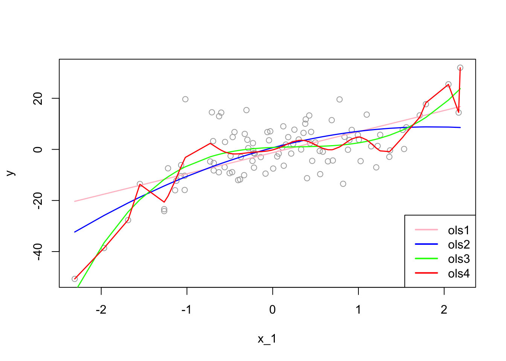

# Overfitting

While overfitting seems as a prediction problem, it is also a serious problem in estimations, where the unbiasedness is the main objective.  Before going further, we need to see the connection between MSPE and MSE in a regression setting:  


\begin{equation}
\mathbf{MSPE}=\mathrm{E}\left[(y_0-\hat{f})^{2}\right]=(f-\mathrm{E}[\hat{f}])^{2}+\mathrm{E}\left[(\mathrm{E}[\hat{f}]-\hat{f})^{2}\right]+\mathrm{E}\left[\varepsilon^{2}\right]
  (\#eq:4-1)
\end{equation} 


Equation 4.1 is simply an expected prediction error of predicting $y_0$ using $\hat{f}(x_0)$.  The estimate $\hat{f}$ is random depending on the sample we use to estimate it.  Hence, it varies from sample to sample.  We call the sum of the first two terms as "reducible error", as we have seen before.   

The MSE of the estimator $\hat{f}$ is, on the other hand, shows the expected squared error loss of estimating $f(x)$ by using $\hat{f}$ at a fixed point $x$.  

$$
\mathbf{MSE}(\hat{f})=\mathrm{E}\left[(\hat{f}-f)^{2}\right]=\mathrm{E}\left\{\left(\hat{f}-\mathrm{E}(\hat{f})+\mathrm{E}(\hat{f})-f\right)^{2}\right\}
$$
$$
=\mathrm{E}\left\{\left(\left[\hat{f}-\mathrm{E}\left(\hat{f}\right)\right]+\left[\mathrm{E}\left(\hat{f}\right)-f\right]\right)^{2}\right\}
$$

\begin{equation}
  =\mathrm{E}\left\{\left[\hat{f}-\mathrm{E}(\hat{f})\right]^{2}\right   \}+\mathrm{E}\left\{\left[\mathrm{E}(\hat{f})-f\right]^{2}\right\}+2 \mathrm{E}\left\{\left[\hat{f}-\mathrm{E}(\hat{f})\right]\left[\mathrm{E}(\hat{f})-f\right]\right\}
  (\#eq:4-2) 
\end{equation} 

The first term is the variance.  The second term is outside of expectation, as $[\mathbf{E}(\hat{f})-f]$ is not random, which represents the bias.  The last term is zero.  Hence,  

\begin{equation}
\mathbf{MSE}(\hat{f})=\mathrm{E}\left\{\left[\hat{f}-\mathrm{E}(\hat{f})\right]^{2}\right\}+\mathrm{E}\left\{\left[\mathrm{E}(\hat{f})-f\right]^{2}\right\}=\mathrm{Var}(\hat{f})+\left[\mathbf{bias}(\hat{f})\right]^{2}
(\#eq:4-3)
\end{equation} 
  
We can now see how MSPE is related to MSE.  Since the estimator $\hat{f}$ is used in predicting $y_0$, MSPE should include MSE:  

$$
\mathbf{MSPE}=(f-\mathrm{E}[\hat{f}])^{2}+\mathrm{E}\left[(\mathrm{E}[\hat{f}]-\hat{f})^{2}\right]+\mathrm{E}\left[\varepsilon^{2}\right]=\mathrm{MSE}(\hat{f})+\mathrm{E}\left[\varepsilon^{2}\right]
$$

The important difference between estimation and prediction processes is the data points that we use to calculate the mean squared error loss functions.  In estimations, our objective is to find the estimator that minimizes the MSE, $\mathrm{E}\left[(\hat{f}-f)^{2}\right]$.  However, since $f$ is not known to us, we use $y_i$ as a proxy for $f$ and calculate MSPE using in-sample data points.  Therefore, using an estimator for predictions means that we use in-sample data points to calculate MSPE in predictions, which may result in overfitting and a poor out-of-sample prediction accuracy.  

Let's start with an example:  


```r
# Getting one-sample.
set.seed(123)
x_1 <- rnorm(100, 0, 1) 
f <- 1 + 2*x_1 - 2*(x_1^2) + 3*(x_1^3) # DGM
y <- f + rnorm(100, 0, 8)
inn <- data.frame(y, x_1)

# OLS
ols1 <- lm(y~ poly(x_1, degree = 1), inn)
ols2 <- lm(y~ poly(x_1, degree = 2), inn)
ols3 <- lm(y~ poly(x_1, degree = 3), inn)
ols4 <- lm(y~ poly(x_1, degree = 20), inn)
ror <- order(x_1)
plot(x_1, y, col="darkgrey")
lines(x_1[ror], predict(ols1)[ror], col="pink", lwd = 1.5)
lines(x_1[ror], predict(ols2)[ror], col="blue", lwd = 1.5)
lines(x_1[ror], predict(ols3)[ror], col="green", lwd = 1.5)
lines(x_1[ror], predict(ols4)[ror], col="red" , lwd = 1.5)
legend("bottomright", c("ols1", "ols2", "ols3", "ols4"),
       col = c("pink", "blue", "green", "red"), lwd = 2)
```


  
The "true" estimator, $f(x)$, which is the "green" line, is:  

$$
f(x_i)=\beta_0+\beta_1 x_{1i}+\beta_2 x_{1i}^2+\beta_2 x_{1i}^3 = 1+2x_{1i}-2x_{1i}^2+3 x_{1i}^3.
$$

Now we can calculate in-sample **empirical** MSPE:  
$$~$$

```r
# MSE
MSPE1 <- mean((predict(ols1)-y)^2) # which is also mean(ols1$residuals^2)
MSPE2 <- mean((predict(ols2)-y)^2)
MSPE3 <- mean((predict(ols3)-y)^2)
MSPE4 <- mean((predict(ols4)-y)^2)
all <- c(MSPE1, MSPE2, MSPE3, MSPE4)
MSPE <- matrix(all, 4, 1)
row.names(MSPE) <- c("ols1", "ols2", "ols3", "ols4")
colnames(MSPE) <- "In-sample MSPE's"
MSPE
```

```
##      In-sample MSPE's
## ols1         86.57600
## ols2         79.56354
## ols3         58.40780
## ols4         48.88589
```
  
As we see, the **overfitted** $\hat{f}(x)$, the $4^{th}$ model, has a lower **empirical in-sample** MSPE.  If we use nonparametric models, we can even find a better fitting model with a lower empirical in-sample MSPE.  We call these MSPE's **empirical** because they are not calculated based on repeated samples, which would give an **expected value** of squared errors over all samples.  In practice, however, we have only one sample. Therefore, even if our objective is to find an **unbiased** estimator of ${f}(x)$, not a prediction of $y$, since we choose our estimator, $\hat{f}(x)$, by the **empirical** in-sample MSPE, we may end up with an **overfitted** $\hat{f}(x)$, such as the $4^{th}$ estimator.  

Would an overfitted model create a biased estimator?  We will see the answer in a simulation later.  However, in estimations, our objective is not only to find an unbiased estimator but also to find the one that has the minimum variance.  We know that our $3^{rd}$ model is unbiased estimator of $f(x)$ as is the overfitted $4^{th}$ estimator.  Which one should we choose?  We have answered this question at the beginning of this chapter: the one with the minimum variance. Since overfitting would create a greater variance, our choice must be the $3^{rd}$ model.  

That is why we do not use the **empirical** in-sample MSPE as a "cost" or "risk" function in finding the best estimator.  This process is called a "data mining" exercise based on one sample without any theoretical justification on what the "true" model would be.  This is a general problem in **empirical risk minimization** specially in finding unbiased estimators of population parameters.

To see all these issues in actions, let's have a simulation for the decomposition of in-sample unconditional MSPE's.  


```r
# Function for X - fixed at repeated samples
xfunc <- function(n){
  set.seed(123)
  x_1 <- rnorm(n, 0, 1) 
  return(x_1)
}
  
# Function for simulation (M - number of samples)
simmse <- function(M, n, sigma, poldeg){
  
  x_1 <- xfunc(n) # Repeated X's in each sample

  # Containers
  MSPE <- rep(0, M)
  yhat <- matrix(0, M, n)
  olscoef <- matrix(0, M, poldeg+1)
  ymat <- matrix(0, M, n)
  
  # Loop for samples
  for (i in 1:M) {
    f <- 1 + 2*x_1 - 2*I(x_1^2) # DGM
    y <- f + rnorm(n, 0, sigma)
    samp <- data.frame("y" = y, x_1)
    # Estimator
    ols <- lm(y ~ poly(x_1, degree = poldeg, raw=TRUE), samp)
    olscoef[i, ] <- ols$coefficients
    # Yhat's
    yhat[i,] <- predict(ols, samp)
    # MSPE - That is, residual sum of squares
    MSPE[i] <- mean((ols$residuals)^2)
    ymat[i,] <- y
  }
  output <- list(MSPE, yhat, sigma, olscoef, f, ymat)
  return(output)
}

# running different fhat with different polynomial degrees
output1 <- simmse(2000, 100, 7, 1)
output2 <- simmse(2000, 100, 7, 2) #True model (i.e fhat = f)
output3 <- simmse(2000, 100, 7, 5) 
output4 <- simmse(2000, 100, 7, 20)

# Table
tab <- matrix(0, 4, 5)
row.names(tab) <- c("ols1", "ols2", "ols3", "ols4")
colnames(tab) <- c("bias^2", "var(yhat)", "MSE", "var(eps)", "In-sample MSPE")

f <- output1[[5]]

# Var(yhat) -  We use our own function instead of "var()"
tab[1,2] <- mean(apply(output1[[2]], 2, function(x) mean((x-mean(x))^2)))
tab[2,2] <- mean(apply(output2[[2]], 2, function(x) mean((x-mean(x))^2)))
tab[3,2] <- mean(apply(output3[[2]], 2, function(x) mean((x-mean(x))^2)))
tab[4,2] <- mean(apply(output4[[2]], 2, function(x) mean((x-mean(x))^2)))

# Bias^2 = (mean(yhat))-f)^2
tab[1,1] <- mean((apply(output1[[2]], 2, mean) - f)^2)
tab[2,1] <- mean((apply(output2[[2]], 2, mean) - f)^2)
tab[3,1] <- mean((apply(output3[[2]], 2, mean) - f)^2)
tab[4,1] <- mean((apply(output4[[2]], 2, mean) - f)^2)

# MSE
fmat <- matrix(f, nrow(output1[[6]]), length(f), byrow = TRUE)
tab[1,3] <- mean(colMeans((fmat - output1[[2]])^2))
tab[2,3] <- mean(colMeans((fmat - output2[[2]])^2))
tab[3,3] <- mean(colMeans((fmat - output3[[2]])^2))
tab[4,3] <- mean(colMeans((fmat - output4[[2]])^2))

# # MSPE - This can be used as well, which is RSS
# tab[1,5] <- mean(output1[[1]])
# tab[2,5] <- mean(output2[[1]])
# tab[3,5] <- mean(output3[[1]])
# tab[4,5] <- mean(output4[[1]])

# MSPE
tab[1,5] <- mean(colMeans((output1[[6]] - output1[[2]])^2))
tab[2,5] <- mean(colMeans((output2[[6]] - output2[[2]])^2))
tab[3,5] <- mean(colMeans((output3[[6]] - output3[[2]])^2))
tab[4,5] <- mean(colMeans((output4[[6]] - output4[[2]])^2))

# Irreducable error - var(eps) = var(y)
tab[1,4] <- mean(apply(output1[[6]], 2,  function(x) mean((x-mean(x))^2)))
tab[2,4] <- mean(apply(output2[[6]], 2,  function(x) mean((x-mean(x))^2)))
tab[3,4] <- mean(apply(output3[[6]], 2,  function(x) mean((x-mean(x))^2)))
tab[4,4] <- mean(apply(output4[[6]], 2,  function(x) mean((x-mean(x))^2)))

round(tab, 4)
```

```
##      bias^2 var(yhat)     MSE var(eps) In-sample MSPE
## ols1 4.9959    0.9467  5.9427  49.1493        53.2219
## ols2 0.0006    1.4224  1.4230  49.1493        47.7574
## ols3 0.0010    2.9011  2.9021  49.1493        46.2783
## ols4 0.0098   10.2528 10.2626  49.1493        38.9179
```


The table verifies that $\mathbf{MSE}(\hat{f})=\mathbf{Var}(\hat{f})+\left[\mathbf{bias}(\hat{f})\right]^{2}.$  However, it seems that the MSPE (in-sample) of each model is "wrong", which is not the sum of MSE and $\mathbf{Var}(\varepsilon)$.  We will come back to this point, but before going further, to make the simulation calculations more understandable, I put here simple illustrations for each calculation.  
  
Think of a simulation as a big matrix: each row contains one sample and each column contains one observation of $x_i$.  For example, if we have 500 samples and each sample we have 100 observations, the "matrix" will be 500 by 100.  Below, each section illustrates how the simulations are designed and each term is calculated
  
**Bias - $(E(\hat{f}(x))-f(x))^2$**  
    
$$
\begin{array}{ccccc} 
& x_1 & x_2 & \ldots & x_{100} \\
s_1 & \hat{f}\left(x_1\right) & \hat{f}\left(x_2\right) & \ldots & \hat{f}\left(x_{100}\right) \\
s_2 & \hat{f}\left(x_1\right) & \hat{f}\left(x_2\right) & \ldots & \vdots \\
\vdots & \vdots & \vdots & \ldots & \vdots \\
s_{500} & \hat{f}\left(x_1\right) & \hat{f}\left(x_2\right) & \ldots & \hat{f}\left(x_{100}\right)
\end{array}
$$
$$
\left[\frac{\Sigma \hat{f}\left(x_1\right)}{500}-f(x)\right]^2+\cdots+\left[\frac{\Sigma \hat{f}\left(x_{100}\right)}{500}-f(x)\right]^2=\sum\left[\frac{\sum \hat{f}\left(x_i\right)}{500}-f(x)\right]^2
$$

**Variance - $\operatorname{var}[\hat{f}(x)]$**
  
  
$$
\begin{array}{ccccc} 
& x_1 & x_2 & \cdots & x_{100} \\
s_1 & \hat{f}\left(x_1\right) & \hat{f}\left(x_2\right) & \ldots & \hat{f}\left(x_{100}\right) \\
s_2 & \hat{f}\left(x_1\right) & \hat{f}\left(x_2\right) & \ldots & \hat{f}\left(x_{100}\right) \\
\vdots & \vdots & \vdots & \ldots & \vdots \\
s_{500} & \hat{f}\left(x_1\right) & \hat{f}\left(x_2\right) & \ldots & \hat{f}\left(x_{100}\right)
\end{array}
$$

$$
\operatorname{var}\left[\hat{f}\left(x_1\right)\right] +\cdots+ \operatorname{var}\left[\hat{f}\left(x_{100}\right)\right]=\frac{\sum\left(\operatorname{var}\left[\hat{f}\left(x_i\right)\right]\right)}{100}
$$

**MSE - $E\left[f\left(x_i\right)-\hat{f}\left(x_i\right)\right]^2$**  
  
$$
\begin{array}{ccccc} 
& x_1 & x_2 & \ldots & x_{100} \\
s_1 & {\left[f\left(x_1\right)-\hat{f}\left(x_1\right)\right]^2} & {\left[f\left(x_2\right)-\hat{f}\left(x_2\right)\right]^2} & \ldots & {\left[f\left(x_{100}\right)-\hat{f}\left(x_{100}\right)\right]^2} \\
s_2 & {\left[f\left(x_1\right)-\hat{f}\left(x_1\right)\right]^2} & {\left[f\left(x_2\right)-\hat{f}\left(x_2\right)\right]^2} & \ldots & {\left[f\left(x_{100}\right)-\hat{f}\left(x_{100}\right)\right]^2} \\
\vdots & \vdots & \vdots & \ldots & \vdots \\
s_{500} & {\left[f\left(x_1\right)-\hat{f}\left(x_1\right)\right]^2} & {\left[f\left(x_2\right)-\hat{f}\left(x_2\right)\right]^2} & \cdots & {\left[f\left(x_{100}\right)-\hat{f}\left(x_{100}\right)\right]^2}
\end{array}
$$


$$
\frac{\Sigma\left[f\left(x_1\right)-\hat{f}\left(x_1\right)\right]^2}{500}+\cdots+\frac{\Sigma\left[f\left(x_{100}\right)-\hat{f}\left(x_{100}\right)\right]^2}{500}=\sum\left(\frac{\sum\left(f\left(x_1\right)-\hat{f}\left(x_1\right)\right)^2}{500}\right)
$$
**MSPE**  
  
$$
\begin{array}{ccccc} 
& x_1 & x_2 & \cdots & x_{100} \\
s_1 & \left(y_1-\hat{f}\left(x_1\right)\right)^2 & \left(y_2-\hat{f}\left(x_2\right)\right)^2 & \cdots & \left(y_{100}-\hat{f}\left(x_{100}\right)\right)^2 \\
s_2 & \left(y_1-\hat{f}\left(x_1\right)\right)^2 & \left(y_2-\hat{f}\left(x_2\right)\right)^2 & \cdots & \left(y_{100}-\hat{f}\left(x_{100}\right)\right)^2 \\
\vdots & \vdots & \vdots & \cdots & \vdots \\
s_{500} & \left(y_1-\hat{f}\left(x_1\right)\right)^2 & \left(y_2-\hat{f}\left(x_2\right)\right)^2 & \cdots & \left(y_{100}-\hat{f}\left(x_{100}\right)\right)^2 \end{array}
$$

$$
\frac{\sum\left(y_1-\hat{f}\left(x_1\right)\right)^2}{500}+\cdots+\frac{\sum\left(y_{100}-\hat{f}\left(x_{100}\right)\right)^2}{500}=\sum\left(\frac{\sum\left(y_i-\hat{f}\left(x_1\right)\right)^2}{500}\right)
$$
Now, back to our question:  Why is the in-sample MSPE different than the sum of MSE and $\sigma^2$?  Let's look at MSPE again but this time with different angle.  We define MSPE over some data points, as we did in our simulation above, and re-write it as follows:

$$
\mathbf{MSPE}_{out}=\mathrm{E}\left[\frac{1}{n} \sum_{i=1}^{n}\left(y'_{i}-\hat{f}(x_i)\right)^{2}\right],~~~~~~\text{where}~~y'_i=f(x_i)+\varepsilon'_i
$$
  
This type of MSPE is also called as **unconditional** MSPE.  Inside of the brackets is the "prediction error" for a range of out-of-sample data points.  The only difference here is that we distinguish $y'_i$ as out-of-sample data points.  Likewise, we define MSPE for in-sample data points $y_i$ as  

$$
\mathbf{MSPE}_{in}=\mathrm{E}\left[\frac{1}{n} \sum_{i=1}^{n}\left(y_{i}-\hat{f}(x_i)\right)^{2}\right],~~~~~~\text{where}~~y_i=f(x_i)+\varepsilon_i.
$$
  
Note that $\varepsilon'_i$ and $\varepsilon_i$ are independent but identically distributed. Moreover $y'_i$ and $y_i$ has the same distribution.  Let's look at $\mathrm{E}\left[(y'_i-\hat{f}(x_i))^{2}\right]$ closer.  By using the definition of variance,  

$$
\begin{aligned}
\mathrm{E}\left[(y'_i-\hat{f}(x_i))^{2}\right]
&=\mathrm{Var}\left[y'_{i}-\hat{f}(x_i)\right]+\left(\mathrm{E}\left[y'_{i}-\hat{f}(x_i)\right]\right)^{2}\\
&=\mathrm{Var}\left[y'_{i}\right]+\mathrm{Var}\left[\hat{f}(x_i)\right]-2 \mathrm{Cov}\left[y'_{i}, \hat{f}(x_i)\right]+\left(\mathrm{E}\left[y'_{i}\right]-\mathrm{E}\left[\hat{f}(x_i)\right]\right)^{2}
\end{aligned}
$$

Similarly,  

$$
\begin{aligned}
\mathrm{E}\left[(y_i-\hat{f}(x_i))^{2}\right]
&=\mathrm{Var}\left[y_{i}-\hat{f}(x_i)\right]+\left(\mathrm{E}\left[y_{i}-\hat{f}(x_i)\right]\right)^{2}\\
&=\mathrm{Var}\left[y_{i}\right]+\mathrm{Var}\left[\hat{f}(x_i)\right]-2 \mathrm{Cov}\left[y_{i}, \hat{f}(x_i)\right]+\left(\mathrm{E}\left[y_{i}\right]-\mathrm{E}\left[\hat{f}(x_i)\right]\right)^{2}
\end{aligned}
$$

Remember our earlier derivation of variance-bias decomposition:  When we predict out-of-sample data points, we know that $y_0$ and $\hat{f}(x_0)$ are independent.  We had stated it differently: $\varepsilon_0$ is independent from $\hat{f}(x_0)$.  In other words, how we estimate our estimator is an independent process from $y'_i$.  Hence, $\mathrm{Cov}\left[y'_{i}, \hat{f}(x_i)\right]=0$.  The critical point here is that $\mathrm{Cov}\left[y_{i} \hat{f}(x_i)\right]$ is **not zero**.  This is because the estimator $\hat{f}(x_i)$ is chosen in a way that its difference from $y_i$ should be minimum.  Hence, our estimator is not an independent than in-sample $y_i$ data points, on the contrary, we use them to estimate $\hat{f}(x_i)$.  In fact, we can even choose $\hat{f}(x_i) = y_i$ where the MSPE would be zero.  In that case correlation between $\hat{f}(x_i)$ and $y_i$ would be 1.

Using the fact that $\mathrm{E}(y'_i) = \mathrm{E}(y_i)$ and $\mathrm{Var}(y'_i) = \mathrm{Var}(y_i)$, we can now re-write $\mathrm{E}\left[(y'_i-\hat{f}(x_i))^{2}\right]$ as follows:    

$$
\mathrm{E}\left[(y'_i-\hat{f}(x_i))^{2}\right]=\mathrm{Var}\left[y_{i}\right]+\mathrm{Var}\left[\hat{f}(x_i)\right]+\left(\mathrm{E}\left[y_{i}\right]-\mathrm{E}\left[\hat{f}(x_i)\right]\right)^{2}\\ =\mathrm{E}\left[(y_i-\hat{f}(x_i))^{2}\right]+2 \mathrm{Cov}\left[y_{i}, \hat{f}(x_i)\right].
$$
  
Averaging over data points,  

$$
\mathrm{E}\left[\frac{1}{n} \sum_{i=1}^{n}\left(y_{i}^{\prime}-\hat{f}(x_i)\right)^{2}\right]=\mathrm{E}\left[\frac{1}{n} \sum_{i=1}^{n}\left(y_{i}-\hat{f}(x_i)\right)^{2}\right]+\frac{2}{n} \sum_{i=1}^{n} \mathrm{Cov}\left[y_{i}, \hat{f}(x_i)\right].
$$

For a linear model, it can be shown that    

$$
\frac{2}{n} \sum_{i=1}^{n} \mathbf{Cov}\left[y_{i}, \hat{f}(x_i)\right]=\frac{2}{n} \sigma^{2}(p+1).
$$
Hence,   

$$
\mathbf{MSPE}_{out} =\mathbf{MSPE}_{in}+\frac{2}{n} \sigma^{2}(p+1).
$$
  
The last term quantifies the **overfitting**, the the amount by which the in-sample MSPE systematically underestimates its true MSPE, i.e. out-of-sample MSPE.  Note also that the overfitting  

1. **grows** with the "noise" ($\sigma^2$) in the data, 
2. **shrinks** with the sample size ($n$),
3. **grows** with the number of variables ($p$).  

Hence, as we had stated earlier, the overfitting problem gets worse as $p/n$ gets bigger.  Minimizing the in-sample MSPE completely ignores the overfitting by picking models which are too large and with a very poor out-of-sample prediction accuracy.  

Now we can calculate the size of overfitting in our simulation.


```r
# New Table
tabb <- matrix(0, 4, 3)
row.names(tabb) <- c("ols1", "ols2", "ols3", "ols4")
colnames(tabb) <- c("Cov(yi, yhat)","True MSPE", "TrueMSPE-Cov")

#COV
tabb[1,1] <- 2*mean(diag(cov(output1[[2]], output1[[6]])))
tabb[2,1] <- 2*mean(diag(cov(output2[[2]], output2[[6]])))
tabb[3,1] <- 2*mean(diag(cov(output3[[2]], output3[[6]])))
tabb[4,1] <- 2*mean(diag(cov(output4[[2]], output4[[6]])))

#True MSPE
tabb[1,2] <- tab[1,3] + tab[1,4]
tabb[2,2] <- tab[2,3] + tab[2,4]
tabb[3,2] <- tab[3,3] + tab[3,4]
tabb[4,2] <- tab[4,3] + tab[4,4]

#True MSPE - Cov (to compare with the measures in the earlier table)
tabb[1,3] <- tabb[1,2] - tabb[1,1]
tabb[2,3] <- tabb[2,2] - tabb[2,1]
tabb[3,3] <- tabb[3,2] - tabb[3,1]
tabb[4,3] <- tabb[4,2] - tabb[4,1]

t <- cbind(tab, tabb)
round(t, 4)
```

```
##      bias^2 var(yhat)     MSE var(eps) In-sample MSPE Cov(yi, yhat) True MSPE
## ols1 4.9959    0.9467  5.9427  49.1493        53.2219        1.8944   55.0920
## ols2 0.0006    1.4224  1.4230  49.1493        47.7574        2.8463   50.5723
## ols3 0.0010    2.9011  2.9021  49.1493        46.2783        5.8052   52.0514
## ols4 0.0098   10.2528 10.2626  49.1493        38.9179       20.5158   59.4119
##      TrueMSPE-Cov
## ols1      53.1976
## ols2      47.7260
## ols3      46.2462
## ols4      38.8961
```
  
Let's have a pause and look at this table:


1. We know that the "true" model is `ols2` in this simulation. However, we cannot know the true model and we have only one sample in practice. 
2. If we use the in-sample MSPE to choose a model, we pick `ols4` as it has the minimum MSPE. 
3. Not only `ols4` is the worst **predictor** among all models, it is also the worst **estimator** among the **unbiased** estimators `ols1`, `ols2`, and `ols3`, as it has the highest MSE. 
4. If our task is to find the best predictor, we cannot use in-sample MSPE, as it give us `ols4`, as the best predictor.  

As a side note: when we compare the models in terms their out-sample prediction accuracy, we usually use the root MSPE (RMSPE), which gives us the prediction error in original units.  

When we calculate empirical in-sample MSPE with one sample, we can asses its out-of-sample prediction performance by the Mallows $C_P$ statistics, which just substitutes the feasible estimator of $\sigma^2$ into the overfitting penalty.  That is, for a linear model with $p + 1$ coefficients fit by OLS,  

$$
C_{p}=\frac{1}{n} \sum_{i=1}^{n}\left(y_{i}-\hat{f}(x_i)\right)^{2}+\frac{2 \widehat{\sigma}^{2}}{n}(p+1),
$$
  
which becomes a good proxy for the our-of-sample error. That is, a small value of $C_p$ means that the model is relatively precise. For comparing models, we really care about differences in empirical out-sample MSPE's:  

$$
\Delta C_{p}=\mathbf{MSPE}_{1}-\mathbf{MSPE}_{2}+\frac{2}{n} \widehat{\sigma}^{2}\left(p_{1}-p_{2}\right),
$$
  
where we use $\hat{\sigma}^2$ from the largest model.  

How are we going to find the best predictor? In addition to $C_p$, we can also use **Akaike Information Criterion (AIC)**, which also has the form of “in-sample performance plus penalty”. AIC can be applied whenever we have a likelihood function, whereas $C_p$ can be used when we use squared errors.  We will see later AIC and BIC (Bayesian Information Criteria) in this book.  With these measures, we can indirectly estimate the test (out-of-sample) error by making an adjustment to the training (in-sample) error to account for the bias due to overfitting.  Therefore, these methods are **ex-post** tools to **penalize** the overfitting.  

On the other hand, we can directly estimate the test error (out-sample) and choose the model that minimizes it.  We can do it by directly validating the model using a cross-validation approach.  Therefore, cross-validation methods provide **ex-ante** penalization for overfitting and are the main tools in selecting predictive models in machine learning applications as they have almost no assumptions.  
