# Nonparametric Estimations - Basics

The models we see in the previous chapters are parametric, which means that they have to assume a certain structure on the regression function $m$ controlled by parameters before the estimations. Therefore, the results from parametric models are the best if the specification of $m$ is correct.  Avoiding this assumption is the strongest point of nonparametric methods, which do not require any hard-to-satisfy pre-determined regression functions.  


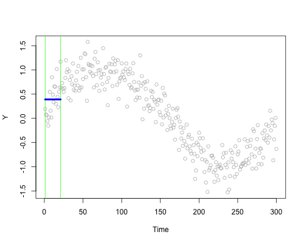

These live plots demonstrate the importance of nonparametric methods for visualizing and understanding data. The purpose of these graph is to showcase the role of smoothing techniques in identifying the underlying pattern in noisy data. The graphs is generated using a set of 300 data points that are created by adding noise to a sine function.

Plots display a step-by-step process of applying a simple nonparametric smoothing method called moving average, with a window size of 4 and 20. In this method, for each point in the dataset, an average is calculated using the data points within the defined window. The red line in the plot represents the smoothed curve, which is generated by connecting these averaged points.  During the animation, the window moves through the dataset, and two vertical green lines represent the boundaries of the window. The blue horizontal line indicates the average of the data points within the window. As the plot progresses, the red line gradually takes the shape of the smoothed curve, highlighting the underlying sine function.

Nonparametric smoothing methods, like the moving average used in this example, are crucial in situations where the data is noisy or when the underlying function is unknown. By applying such methods, it is possible to obtain a clearer understanding of trends and patterns in the data, which can then be used for further analysis and decision-making processes. These techniques are versatile and can be applied to a wide range of datasets and fields, such as finance, economics, and engineering, among others.

Here is the code that can be used for different window sizes:  


```r
n = 300
set.seed(1)
x <- sort(runif(n) * 2 * pi)
y <- sin(x) + rnorm(n) / 4
dfm <- data.frame(time = 1:n, y = y)

new_line <- data.frame(matrix(nrow = 0, ncol = 2))
colnames(new_line) <- c("time", "y")

# window = 20
# for (i in 1:(n - window)) {
#   flush.console()
#   new <- data.frame(time = dfm$time[i:(i + window)],
#                     y = dfm$y[i:(i + window)])
#   new_line[i, ] <- c((i+(window/2-1)), mean(new$y)) 
#   plot(dfm$time, dfm$y)
#   abline(v=i, col = "green")
#   abline(v=(i+window), col = "green")
#   lines(new$time, rep(mean(new$y), (window+1)),
#         lwd = 4,
#         col = "blue")
#   lines(new_line$time, new_line$y,
#         type = "l",
#         col = "red",
#         lwd = 3)
#   Sys.sleep(.09)
# }
```

Before talking about a nonparametric estimator for the regression function $m$, we should first look at a simple nonparametric density estimation of $X$. We aim to estimate $f(x)$ from a sample and without assuming any specific form for $f$. 
  
## Density Estimations

We will only look at one-variable Kernel density estimations.  Let's assume that a sample of $n$ observations, $y_1,...,y_n$, is drawn from a parametric distribution $f(y,\theta)$. If the data are i.i.d., the joint density function is:  

\begin{equation}
f(y;\theta)=\prod_{i=1}^{n} f\left(y_{i} ; \theta\right)
  (\#eq:6-1)
\end{equation} 


To estimate, we find the parameters that maximize this density function ("likelihood"), or its logarithmic transformation:  

\begin{equation}
\ell(y ; \theta)=\log f(y ; \theta)=\sum_{i=1}^{n} \log f\left(y_{i} ; \theta\right)
  (\#eq:6-2)
\end{equation} 
   
We apply the maximum likelihood estimation (MLE) method to recover $\theta$.  This is called **parametric estimation**  and if our pre-determined density model is not right, that is, if $f$ is misspecified, we will have a biased estimator for $\theta$.  To avoid this problem, we can use **nonparametric estimation**, which does not require an assumption about the distribution of the data.
  
The starting point for a density estimation is a histogram.  We define the intervals by choosing a number of bins and a starting value for the first interval.  Here, we use 0 as a starting value and 10 bins:  


```r
#Random integers from 1 to 100
set.seed(123)
data <- sample(1:100, 100, replace = TRUE)
stem(data)
```

```
## 
##   The decimal point is 1 digit(s) to the right of the |
## 
##   0 | 46777999
##   1 | 23344456
##   2 | 12335555677
##   3 | 00111224456889
##   4 | 01122337
##   5 | 0012337
##   6 | 003477999
##   7 | 1222466899
##   8 | 112366799
##   9 | 0011123334566799
```

```r
foo <- hist(data, nclass = 10,
            col = "lightblue",
            cex.main = 0.80, cex.axis = 0.75)
```

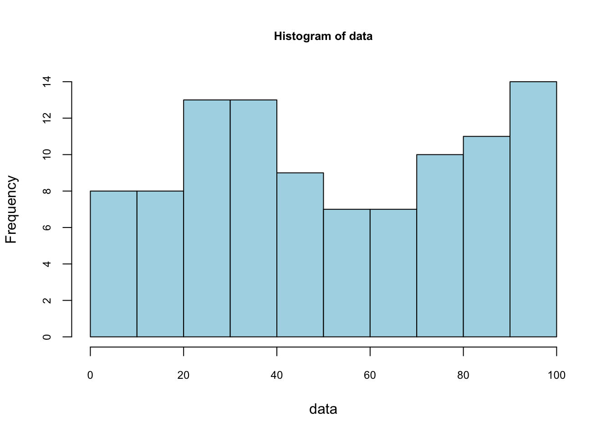

```r
foo$counts
```

```
##  [1]  8  8 13 13  9  7  7 10 11 14
```

```r
foo$density
```

```
##  [1] 0.008 0.008 0.013 0.013 0.009 0.007 0.007 0.010 0.011 0.014
```

```r
sum(foo$density)
```

```
## [1] 0.1
```


Not that the sum of these densities is not one.  The vertical scale of a 'frequency histogram' shows the number of observations in each bin. From above, we know that the tallest bar has 14 observations, so this bar accounts for relative frequency 14/100=0.14 of the observations. As the relative frequency indicate probability their total would be 1.  We are looking for a density function which gives the "height" of each observation.  Since the width of this bar is 10, the density of each observation in the bin is 0.014. 
  
We can have a formula to calculate the density for each data point:  

\begin{equation}
\hat{f}(y)=\frac{1}{n} \times \frac{\text{ number of observations in the interval of } y}{\text { width of the interval }}
  (\#eq:6-3)
\end{equation} 

Here is the pdf on the same data with binwidth = 4 for our example:


```r
# to put pdf and X's on the same graph, we scale the data
foo <- hist(data/(10*mean(data)),
            nclass = 25,
            cex.main = 0.80,
            cex.axis = 0.75,
            xlim = c(0, 0.2),
            main = NULL)
lines(foo$mids, foo$density, col="blue", lwd = 2) #Naive
```

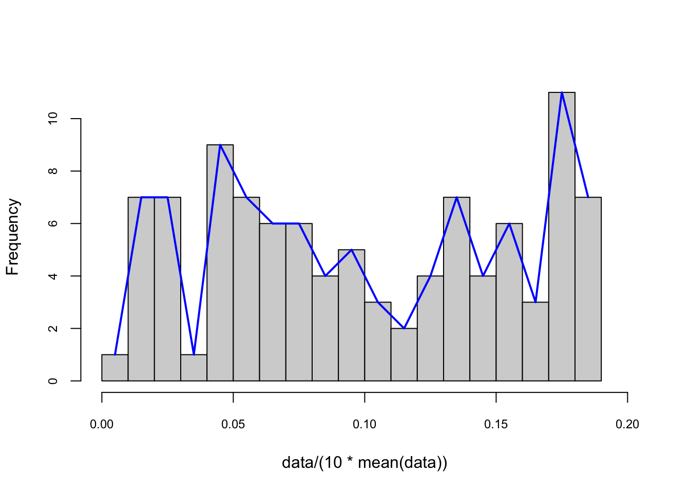
   
The number of bins defines the degree of smoothness of the histogram.  We can have the following general expression for a nonparametric density estimation:

\begin{equation}
f(x) \cong \frac{k}{n h} \text { where }\left\{\begin{array}{ll}{h} & {\text { binwidth }} \\ {n} & {\text { total } \text { number of observation points }} \\ {k} & {\text { number of observations inside } h}\end{array}\right.
  (\#eq:6-4)
\end{equation} 

Note that, in practical density estimation problems, two basic approaches can be adopted: (1) we can fix $h$ (width of the interval) and determine $k$ in each bin from the data, which is the subject of this chapter and called **kernel density estimation (KDE)**; or (2) we can fix $k$ in each bin and determine $h$ from the data. This gives rise to the **k-nearest-neighbors (kNN)** approach, which we cover in the next chapters.

The global density cab be obtained with a *moving window* (intervals with intersections), which is also called as **Naive estimator** (a.k.a. Parzen windows).  The naive estimator is not sensitive to the position of bins, but it is not smooth either: 

\begin{equation}
\hat{f}(y)=\frac{1}{n h} \sum_{i=1}^{n} I\left(y-\frac{h}{2}<y_{i}<y+\frac{h}{2}\right),
  (\#eq:6-5)
\end{equation} 
  
where $I(.)$ is an indicator function, which results in value of 1 if the expression inside of the function is satisfied (0 otherwise). Thus, it counts the number of observations in a given window.  The binwidth ($h$) defines the bin range by adding and subtracting $h/2$ from $y$.  We can rearrange 6.5 differently:  

$$
\hat{f}(y)=\frac{1}{2n h} \sum_{i=1}^{n} I\left(y-h<y_{i}<y+h\right).
$$

If we rewrite the inequality by subtracting $y$ and divide it by $h$:  

$$
\hat{f}(y)=\frac{1}{2n h} \sum_{i=1}^{n} I\left(-1<\frac{y-y_{i}}{h}<1\right),
$$
which can be written more compactly:  
  
\begin{equation}
\hat{f}(y)=\frac{1}{2nh} \sum_{i=1}^{n} w\left(\frac{y-y_{i}}{h}\right) \quad \text { where } \quad w(x)=\left\{\begin{array}{ll}{1} & {\text { if }|x|<1} \\ {0} & {\text { otherwise }}\end{array}\right.
  (\#eq:6-6)
\end{equation} 
  
    
Consider a sample $\left\{X_{i}\right\}_{i=1}^{10}$, which is 4, 5, 5, 6, 12, 14, 15, 15, 16, 17.  And the bin width is $h=4$.  What's the density of 3, $\hat{f}(3)$?  Note that we do not have 3 in the data.  

$$
\begin{aligned} \hat{f}(3) &=\frac{1}{2\times10 \times4}\left\{w\left(\frac{3-4}{4}\right)+w\left(\frac{3-5}{4}\right)+\ldots+w\left(\frac{3-17}{4}\right)\right\} \\ &=\frac{1}{80}\left\{1+1+1+1+0+\ldots+0\right\} \\ &=\frac{1}{20} \end{aligned}
$$

This "naive" estimator yields density estimates that have discontinuities and weights equal at all points $x_i$ regardless of their distance to the estimation point $x$.  In other words, in any given bin, $x$'s have a uniform distribution.  That's why, $w(x)$ is commonly replaced with a smooth kernel function $K(x)$. Kernel replaces it with usually, but not always, with a radially symmetric and unimodal pdf, such as the Gaussian.  You can choose **"gaussian", "epanechnikov", "rectangular", "triangular", "biweight", "cosine", "optcosine"** distributions in the R's `density()` function.
  
With the Kernel density estimator replacing $w$ in 6.6 by a kernel function $K$:  

\begin{equation}
\hat{f}(y)=\frac{1}{2n h} \sum_{i=1}^{n} K\left(\frac{y-y_{i}}{h}\right),
  (\#eq:6-7)
\end{equation} 
  
Here are the samples of kernels, $K(x)$:  

$$
\text { Rectangular (Uniform): } ~~ K(x)=\left\{\begin{array}{ll}{\frac{1}{2}} & {|x|<1} \\ {0} & {\text { otherwise }}\end{array}\right.
$$
$$
\text { Epanechnikov: } ~~ K(x)=\left\{\begin{array}{cc}{\frac{3}{4}\left(1-\frac{1}{5} x^{2}\right) / \sqrt{5}} & {|x|<\sqrt{5}} \\ {0} & {\text { otherwise }}\end{array}\right.
$$
$$
\text { Gaussian: } ~~ K(x)=\frac{1}{\sqrt{2 \pi}} e^{(-1 / 2) x^{2}}
$$
  
Although the kernel density estimator depends on the choices of the kernel function $K$, it is very sensitive to $h$, not to $K$.  

In R, the standard kernel density estimation is obtained by `density()`, which uses **Silverman rule-of-thumb** to select the optimal bandwidth, $h$, and the **Gaussian kernel**.  Here is an example with our artificial data:  


```r
X <- readRDS("fes73.rds")
X <- X/mean(X)
hist(X[X < 3.5], nclass = 130, probability = TRUE, col = "white",
     cex.axis = 0.75, cex.main = 0.8, main = NULL)
lines(density(X, adjust = 1/4), col = "red") # bandwith/4
lines(density(X, adjust = 1), col = "blue") 
lines(density(X, adjust = 4), col = "green") # bandwith x 4
lines(density(X, kernel = "rectangular", adjust = 1/4),
      col = "black") # bandwith x 4
```

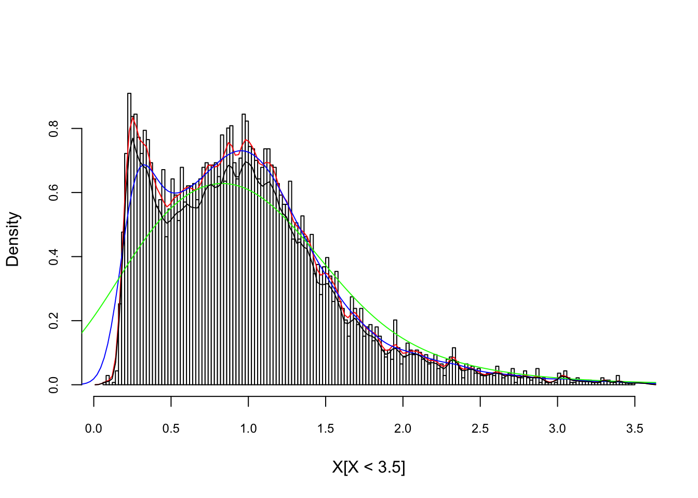

```r
#Here is the details of the last one
density(X, adjust = 4)
```

```
## 
## Call:
## 	density.default(x = X, adjust = 4)
## 
## Data: X (6968 obs.);	Bandwidth 'bw' = 0.3423
## 
##        x                y            
##  Min.   :-0.954   Min.   :0.0000000  
##  1st Qu.: 2.352   1st Qu.:0.0000576  
##  Median : 5.657   Median :0.0005510  
##  Mean   : 5.657   Mean   :0.0755509  
##  3rd Qu.: 8.963   3rd Qu.:0.0269050  
##  Max.   :12.269   Max.   :0.6282958
```
  
Bigger the bandwidth $h$ smoother the pdf.  Which one is better?  There are several bandwidth selection methods to identify the best fitting $h$, which are beyond the scope of this chapter.

Why do we estimate pdf with KDE?  Note that, when you explore our density object by `str()`, you'll see that `y` will get you the pdf values of density for each value of $X$ you have in our data. Of course pdf is a function: the values of pdf are $Y$ and the input values are $X$.  Hence, given a new data point on $X$, we may want to find the outcome of $Y$ (the value of pdf for that data point) based on the function, the kernel density estimator that we have from the `density()` function result. When can do it with `approxfun()`:


```r
poo <- density(X, adjust = 1/4)

dens <- approxfun(poo)

plot(poo, col = "blue")
x_new <- c(0.5,1.5,2.2)
points(x_new, dens(x_new), col=2, lwd = 3)
```

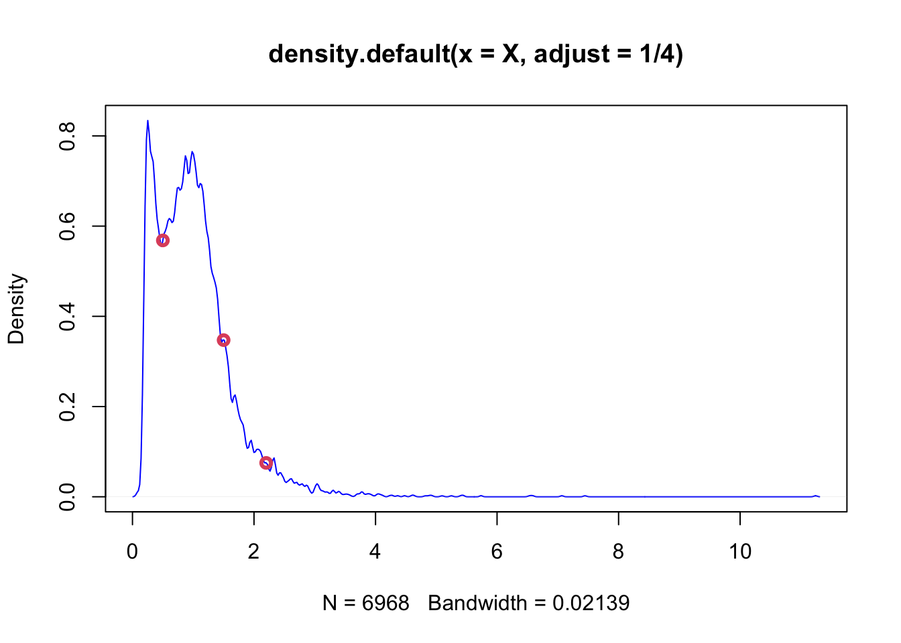

```r
dens(1.832)
```

```
## [1] 0.1511783
```

This is a predicted value of pdf when $x=1.832$ estimated by KDE without specifying the model apriori, which is like a magic!  Based on the sample we have, we just predicted $Y$ without explicitly modeling it.
  
Keep in mind that our objective here is not to estimate probabilities.  We can do it if we want.  But then, of course we have to remember that values of a density curve are not the same as probabilities. Taking the integral of the desired section in the estimated pdf would give us the corresponding probability.


```r
integrate(dens, lower = 1, upper = 1.832)
```

```
## 0.3574063 with absolute error < 5.8e-06
```


## Kernel regressions  

Theoretically, nonparametric density estimation can be easily extended to several dimensions (multivariate distributions).  For instance, suppose we are interested in predicting $Y$ by using several predictors. We have almost no idea what functional form the predictive model could take. If we have a sufficiently large sample, we may obtain a reasonably accurate estimate of the joint probability density (by kernel density estimation or similar) of $Y$ and the $X$'s.  

In practice, however, we rarely have enough sample to execute robust density estimations. As the dimension increases, KDE rapidly needs many more samples.  Even in low dimensions, a KDE-based model has mostly no ability to generalize.  In other words, if our test set has parts outside our training distribution, we cannot use our KDE-based model for forecasting.

In regression functions, the outcome is the conditional mean of $Y$ given $X$'s.  Since nonparametric regressions are agnostic about the functional form between the outcome and the covariates, they are immune to **misspecification error**.  

The traditional regression model fits the model:  

\begin{equation}
y=m(\mathbf{x}, \boldsymbol{\beta})+\varepsilon
  (\#eq:6-8)
\end{equation} 
  
where $\beta$ is a vector of parameters to be estimated, and **x** is a vector of predictors. The errors, $\varepsilon$ are assumed to be i.i.d, $\varepsilon \sim NID(0, \sigma^2)$. The function $m(\mathbf{x},\beta)$, which links the conditional averages of $y$ to the predictors, is specified in advance.  The generic nonparametric regression model is written similarly, but the function $m$ remains unspecified:  

$$
\begin{aligned} y &=m(\mathbf{x})+\varepsilon \\ &=m\left(x_{1}, x_{2}, \ldots, x_{p}\right)+\varepsilon, \end{aligned}
$$
where $\varepsilon \sim NID(0, \sigma^2)$ again.  

An important special case of the general model is nonparametric simple regression, where there is only one predictor:  

$$
y=m(x)+\varepsilon
$$
  
With its definition, we can rewrite $m$ as  

\begin{equation}
\begin{split}
\begin{aligned} m(x) &=\mathbb{E}[Y | X=x] \\ &=\int y f_{Y | X=x}(y) \mathrm{d} y \\ &=\frac{\int y f(x, y) \mathrm{d} y}{f_{X}(x)} \end{aligned}
  \end{split}
  (\#eq:6-10)
\end{equation} 
    
This shows that the regression function can be computed from the joint density $f(x,y)$ and the marginal $f(x)$. Therefore, given a sample $\left\{\left(X_{i}, Y_{i}\right)\right\}_{i=1}^{n}$, a nonparametric estimate of $m$ may follow by replacing the these densities with their kernel density estimators, as we have see earlier in this section.

A limitation of the bin smoothing approach in kernel density estimations is that we need small windows for the "approximately constant" assumptions to hold. As a result, we end up with a small number of data points to average and obtain imprecise estimates of $f(x)$. Locally estimated scatter-plot smoothing (LOESS, `loess`) permits us to consider larger window sizes, which is a nonparametric approach that fits multiple regressions in local neighborhood. 
  
It is called local regression because, instead of assuming the function is approximately constant in a window, it fits a local regression at the "neighborhood" of $x_0$.  The distance from $x_0$ is controlled by the `span` setting, which determines the width of the moving (sliding) window when smoothing the data. The parameter `span`represents the proportion of the data (size of the sliding window) that is considered to be neighboring $x_0$.  For example, if N is the number of data points and `span` = 0.5, then for a given $x_0$, `loess` will use the $0.5\times N$ closest points to $x_0$ for the fit. Usually `span` should be between 0 and 1.  When its larger than 1, the regression will be over-smoothed. Moreover, the weighting in the regression is proportional to $1-(\text{distance}/\text{maximum distance})^3)^3$, which is called the Tukey tri-weight.  Different than the Gaussian kernel, the Tukey tri-weight covers more points closer to the center point.

We will not see the theoretical derivations of kernel regressions but an illustration of local polynomial of order 0, 1 and 2, below. (Examples from Ahamada and Flachaire) [-@Ibrahim_2011]. The Nadaraya–Watson estimator is a local polynomial of order 0, which estimates a local mean of $Y_1...Y_n$ around $X=x_0$.


```r
#Simulating our data
n = 300
set.seed(1)
x <- sort(runif(n)*2*pi)
y <- sin(x) + rnorm(n)/4
plot(x, y)
```


```r
#Estimation
loe0 <- loess(y~x, degree = 0, span = 0.5) #Nadaraya-Watson
loe1 <- loess(y~x, degree = 1, span = 0.5) #Local linear
loe2 <- loess(y~x, degree = 2, span = 0.5) #Locally quadratic

#To have a plot, we first calculate the fitted values on a grid,
t <- seq(min(x), max(x), length.out = 100)
fit0 <- predict(loe0, t)
fit1 <- predict(loe1, t)
fit2 <- predict(loe2, t)
plot(x, y, col = "gray", cex.main = 0.80, cex.axis = 0.75)
lines(t, fit0, col = "green", lwd = 3)
lines(t, fit1, col = "red")
lines(t, fit2, col = "blue")
```

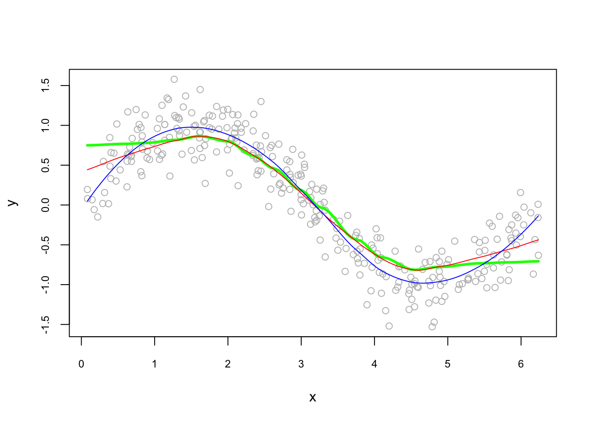
  
And, its sensitivity to the bandwidth:
  

```r
fit0 <- predict(loess(y~x, degree=2, span = 0.05)) #minimum, 5%*300 = 14 obs. 
fit1 <- predict(loess(y~x, degree=2, span = 0.75)) #default
fit2 <- predict(loess(y~x, degree=2, span = 2)) 

plot(x, y, col = "gray", cex.main = 0.80, cex.axis = 0.75)
lines(x, fit0, lwd = 2, col = "green")
lines(x, fit1, lwd = 2, col = "red")
lines(x, fit2, lwd = 2, col = "blue")
```

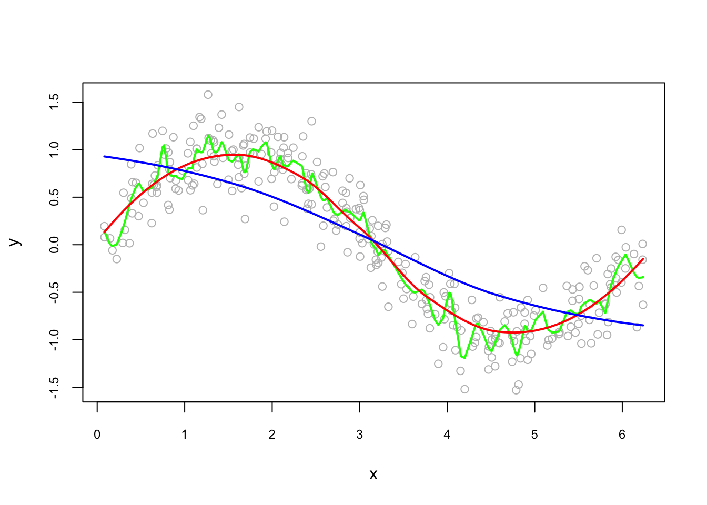
  
The bandwidth we choose will be determined by the prediction accuracy.  This subject is related to **cross-validation**, which we will see later as a whole chapter.

## Regression Splines

In a model, non-linearity can be captured by estimating a linear regression through several intervals, which is called as **piecewise linear model**.   

\begin{equation}
\begin{split}
\begin{array}{ll}{y=\alpha_{1}+\beta_{1} x+\varepsilon_{1}} & {\text { if } \quad x \in\left[z_{0} ; z_{1}\right]} \\ {y=\alpha_{2}+\beta_{2} x+\varepsilon_{2}} & {\text { if } \quad x \in\left[z_{1} ; z_{2}\right]} \\ {\cdots} \\ {y=\alpha_{k}+\beta_{k} x+\varepsilon_{k}} & {\text { if } \quad x \in\left[z_{k-1} ; z_{k}\right]}\end{array}
  \end{split}
  (\#eq:6-11)
\end{equation} 
  
This function will not have a smooth transitions at the knots, $z.$, which brings us to a regression **spline, which is a piecewise regression model** with a smooth transition at the knots.  First, let's see how a piecewise regression works with an example.  To show evidence of nonlinearity between short and long-term interest rates, [@PFANN1996149] estimates the following piecewise linear model:  

\begin{equation}
y=\beta_{0}+\beta_{1} x+\beta_{2}(x-\kappa)_{+}+\varepsilon
  (\#eq:6-12)
\end{equation} 
  
Here in 6.12 the $\kappa$ denotes *knot* where the relationship between $Y$ and $x$ changes. (Subscript $+$ means that the term will be zero when it is not positive).  
  

```r
data <- read.table("irates.dat", header = TRUE)
y <- data$GS10
x <- data$TB3MS
xk <- (x - 10.8)*(x > 10.8)
summary(lm(y ~ x + xk))
```

```
## 
## Call:
## lm(formula = y ~ x + xk)
## 
## Residuals:
##     Min      1Q  Median      3Q     Max 
## -2.3978 -0.9051 -0.1962  0.9584  3.2530 
## 
## Coefficients:
##             Estimate Std. Error t value Pr(>|t|)    
## (Intercept)  1.77900    0.10181   17.47  < 2e-16 ***
## x            0.92489    0.01915   48.29  < 2e-16 ***
## xk          -0.42910    0.08958   -4.79 2.06e-06 ***
## ---
## Signif. codes:  0 '***' 0.001 '**' 0.01 '*' 0.05 '.' 0.1 ' ' 1
## 
## Residual standard error: 1.107 on 657 degrees of freedom
## Multiple R-squared:   0.83,	Adjusted R-squared:  0.8295 
## F-statistic:  1604 on 2 and 657 DF,  p-value: < 2.2e-16
```

```r
reorder <- order(x) # to avoid messy lines
plot(
  x[reorder],
  fitted(lm(y ~ x + xk))[reorder],
  type = "l",
  col = "red",
  cex.main = 0.80,
  cex.axis = 0.75,
  xlab = "TB3MS",
  ylab = "GS10"
)
points(x, y, col = "grey")
abline(v = 10.8, lty = 2, col = "darkgreen")
```

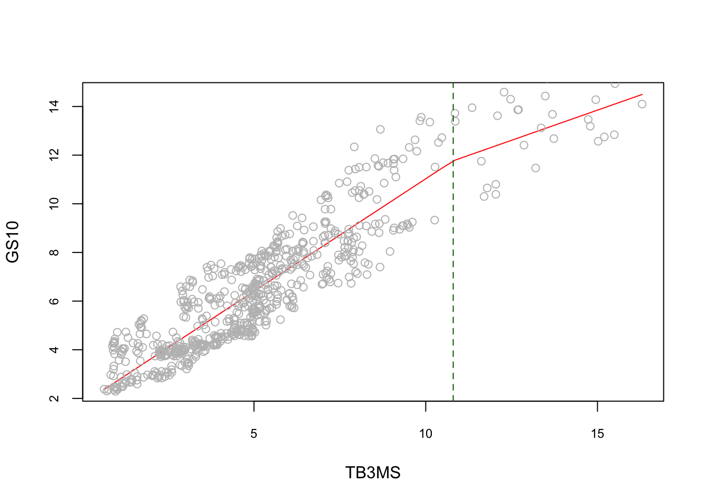
  
When the model is extended to $q$ knots, it becomes a piecewise regression:  

\begin{equation}
y=\beta_{0}+\beta_{1} x+\sum_{j=1}^{q} \beta_{1 j}\left(x-\kappa_{j}\right)_{+}+\varepsilon
  (\#eq:6-13)
\end{equation} 
  

```r
#5 knots
k <- c(2.8, 4.8, 6.8, 8.8, 10.8)
Xk <- x - matrix(k, length(x), length(k), byrow = TRUE)

Xk <- Xk*(Xk > 0)

reorder <- order(x) # to avoid messy lines
plot(
  x,
  y,
  col = "gray",
  ylim = c(2.5, 14.5),
  cex.main = 0.80,
  cex.axis = 0.75,
  xlab = "TB3MS",
  ylab = "GS10"
)
lines(x[reorder], fitted(lm(y ~ x + Xk))[reorder], lwd = 2, col = "red")
abline(v = k, lty = 2, col = "darkgreen")
```

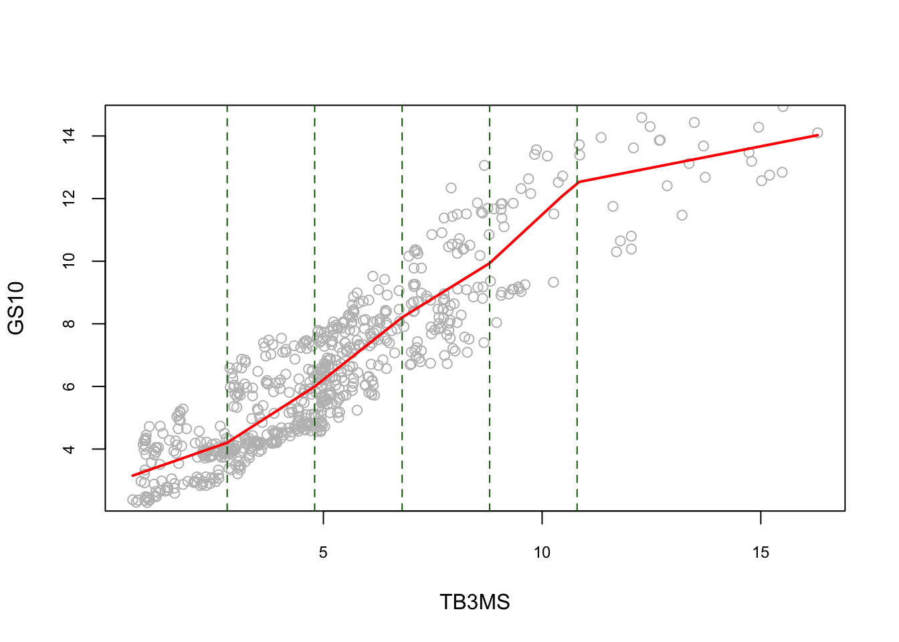

The piecewise linear model is not smooth at the knots.  To get a smooth estimator, we replace the basis of linear functions by a basis of spline functions, which is defined as  
  
$$
b_{0}(x, \kappa), \ldots, b_{r}(x, \kappa)
$$
Hence, regression spline is defined as:  

\begin{equation}
y=\sum_{j=0}^{r} \beta_{j} b_{j}(x, \kappa)+\varepsilon
  (\#eq:6-14)
\end{equation} 
  
Once the knots are fixed, it becomes essentially a parametric regression.  For example, the following spline regression model,  

$$
y=\beta_{0}+\beta_{1} x+\cdots+\beta_{p} x^{p}+\sum_{j=1}^{q} \beta_{p j}\left(x-\kappa_{j}\right)_{+}^{p}+\varepsilon,
$$

can be estimated as a cubic spline:  

$$
\hat{m}(x)=2+x-2 x^{2}+x^{3}+(x-0.4)_{+}^{3}-(x-0.8)_{+}^{3}
$$

which can be rewritten as

$$
\hat{m}(x)=\left\{\begin{aligned} 2+x-2 x^{2}+x^{3} & \text { if } & x<0.4 \\ 2+x-2 x^{2}+x^{3}+(x-0.4)^{3} & \text { if } & 0.4 \leq x<0.8 \\ 2+x-2 x^{2}+x^{3}+(x-0.4)^{3}-(x-0.8)^{3} & \text { if } & x \geq 0.8 \end{aligned}\right.
$$

In short **a spline is a piecewise polynomial function**.
  
Now, the question is how we are supposed to choose the basis and the knots? Spline estimation is sensitive to the choice of the number of knots and their position.  A knot can have an economic interpretation such as a specific date or structural change in the data, thus some information is required.  There are two common approaches for choosing the position of the knots: **quantiles** - intervals with the same number of observations; **equidistant** - intervals with the same width.  As for the number of knots, if it's too small, the potential bias can be large in the estimator, so a larger number is preferred.    

Let's use the same data and apply regression spline.  Here is the example for equidistant knots:  


```r
library(splines)

#equidistant knots
nknots <- 5
k = seq(min(x), max(x), length.out = nknots + 2)[2:(nknots + 1)]
model1 <- lm(y ~ bs(x, degree = 3, knots = k)) #check ?bs

summary(model1)
```

```
## 
## Call:
## lm(formula = y ~ bs(x, degree = 3, knots = k))
## 
## Residuals:
##     Min      1Q  Median      3Q     Max 
## -2.5190 -0.8537 -0.1889  0.8841  3.2169 
## 
## Coefficients:
##                               Estimate Std. Error t value Pr(>|t|)    
## (Intercept)                     3.1855     0.3160  10.082  < 2e-16 ***
## bs(x, degree = 3, knots = k)1   0.4081     0.5722   0.713  0.47596    
## bs(x, degree = 3, knots = k)2   0.9630     0.3163   3.045  0.00242 ** 
## bs(x, degree = 3, knots = k)3   4.2239     0.4311   9.798  < 2e-16 ***
## bs(x, degree = 3, knots = k)4   6.2233     0.3869  16.084  < 2e-16 ***
## bs(x, degree = 3, knots = k)5   9.9021     0.6620  14.957  < 2e-16 ***
## bs(x, degree = 3, knots = k)6   9.8107     0.8370  11.722  < 2e-16 ***
## bs(x, degree = 3, knots = k)7  10.8604     0.9400  11.553  < 2e-16 ***
## bs(x, degree = 3, knots = k)8  10.6991     1.0866   9.847  < 2e-16 ***
## ---
## Signif. codes:  0 '***' 0.001 '**' 0.01 '*' 0.05 '.' 0.1 ' ' 1
## 
## Residual standard error: 1.086 on 651 degrees of freedom
## Multiple R-squared:  0.8378,	Adjusted R-squared:  0.8358 
## F-statistic: 420.3 on 8 and 651 DF,  p-value: < 2.2e-16
```

```r
u <- seq(min(x), max(x), length.out = 100)
pred <- predict(model1, newdata = list(x = u), se = TRUE)

reorder <- order(u) # to avoid messy lines
plot(
  x,
  y,
  col = "gray",
  ylim = c(2.5, 14.5),
  cex.main = 0.80,
  cex.axis = 0.75
)
lines(u, pred$fit, lwd = 2, col = "red")
lines(u[reorder], pred$fit[reorder] + 1.96 * pred$se, lty = "dashed")
lines(u[reorder], pred$fit[reorder] - 1.96 * pred$se, lty = "dashed")
abline(v = k, lty = 2, col = "darkgreen")
```

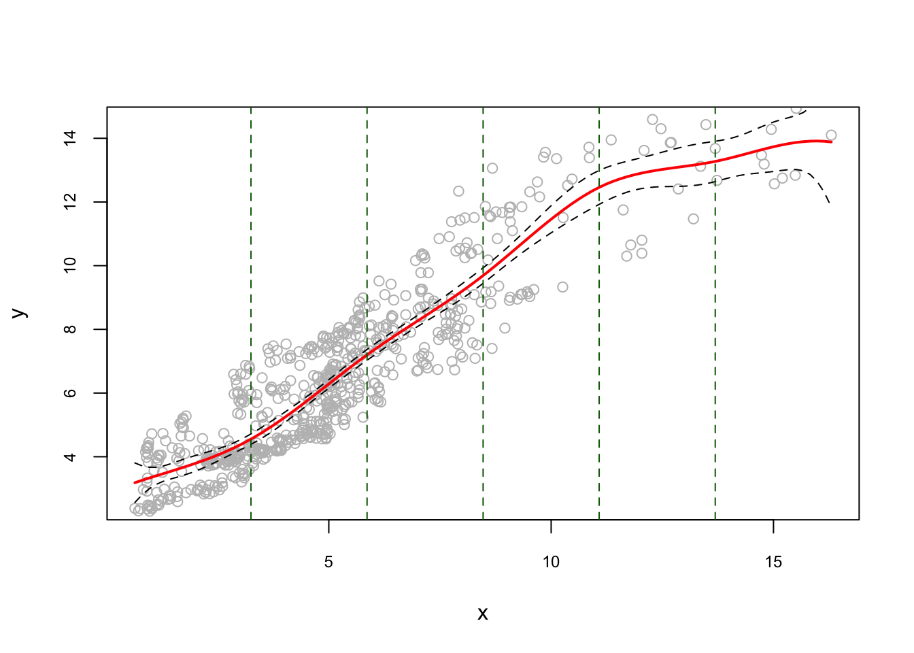

And, an example for quantile knots:  


```r
model2 <- lm(y ~ bs(x, degree = 3, df = 8))

u <- seq(min(x), max(x), length.out = 100)
pred <- predict(model2, newdata = list(x = u), se = TRUE)

reorder <- order(u) # to avoid messy lines
plot(
  x,
  y,
  col = "gray",
  ylim = c(2.5, 14.5),
  cex.main = 0.80,
  cex.axis = 0.75
)
lines(u, pred$fit, lwd = 2, col = "red")
lines(u[reorder], pred$fit[reorder] + 1.96 * pred$se, lty = "dashed")
lines(u[reorder], pred$fit[reorder] - 1.96 * pred$se, lty = "dashed")
k <- attr(bs(x, degree = 3, df = 8), "knots")
#These functions provide access to a single attribute of an object.
abline(v = k, lty = 2, col = "darkgreen")
```

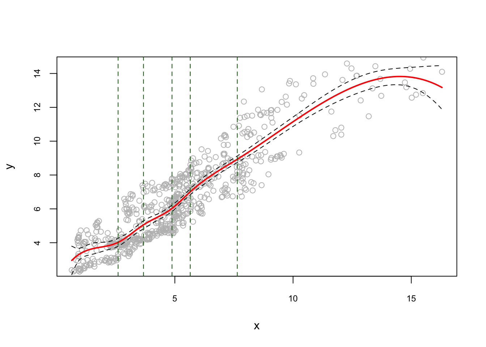
  
Note that, in regression spline, `df` (degree of freedom) is the number of components of the basis. Thus, with cubic spline, `df`=6 defines 3 knots (quartiles q:25; q:50; q:75).  Since, `df`= 8, we have 5 knots, so is the quantile of 20\%.   
  
Is bad or good for prediction to have a very large number of knots? See <https://freakonometrics.hypotheses.org/47681> [@Charpentier_SplineReg], for the argument about the number of knots. Here is Arthur Charpentier's conclusion:

>So, it looks like having a lot of non-significant components in a spline regression is not a major issue. And reducing the degrees of freedom is clearly a bad option.  
>

Let's see how sensitive the results to the number of knots ^[see <https://www.rdocumentation.org/packages/freeknotsplines/versions/1.0.1/topics/fit.search.numknots> for knot location selection]:


```r
pred1 <- predict(lm(y ~ bs(x, degree = 3, df = 6)))   #quartiles
pred2 <- predict(lm(y ~ bs(x, degree = 3, df = 12)))  #deciles
pred3 <- predict(lm(y ~ bs(x, degree = 3, df = 102))) #percentile

reorder <- order(x) 
plot(x, y, col = "gray", ylim = c(2.5, 14.5),
     cex.main = 0.80, cex.axis = 0.75)
lines(x[reorder], pred1[reorder], lwd = 2, col = "red")
lines(x[reorder], pred2[reorder], lwd = 2, col = "blue")
lines(x[reorder], pred3[reorder], lwd = 2, col = "green")
```

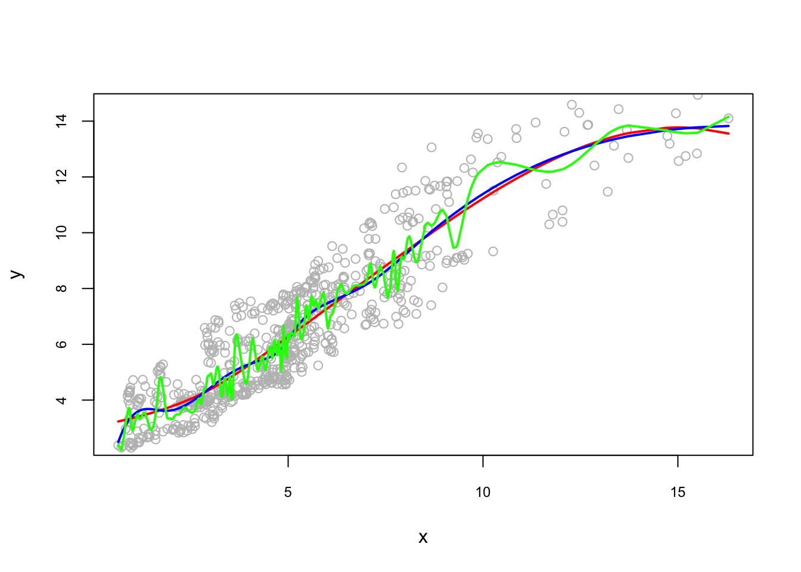

There is a method called as **smoothing spline**, a spline basis method that avoids the knot selection problem.  It uses a maximal set of knots, at the unique values of the each $X$ values and control for the fit by **regularization**. Similar to OLS, it selects $\beta_j$ to minimize the residual sum of squares but with a penalization on the curvature in the function:  

\begin{equation}
\sum_{i=1}^{n}\left[y_{i}-m\left(x_{i}\right)\right]^{2}+\lambda \int\left[m^{\prime \prime}(x)\right]^{2} d x
  (\#eq:6-15)
\end{equation} 
  
The first term minimizes the closeness to the data with a constraint (the second term) on the curvature in the function.  If $\lambda=0$, $m(x_i)$ could be any function that fits the data very closely (interpolates the data).  If $\lambda > 0$ and goes infinity, it makes the penalization so high that the algorithm fits a simple least squares line without any curvature.  The penalty term, or bandwidth $\lambda$, restricts fluctuations of $\hat{m}$ and the optimum $\lambda$ minimizes the distance between $m$, which is unknown, and $\hat{m}$.  The method used to find the optimal $\lambda$ is called as *generalized cross-validation*.  Here is a simulation:  


```r
set.seed(1)
n <- 200
x <- runif(n)
dgm <- sin(12*(x + 0.2))/(x + 0.2) # our dgm
y <- dgm + rnorm(n)
plot(x, y, col = "gray", cex.main = 0.80, cex.axis = 0.75)

lines(x[order(x)], dgm[order(x)], lwd = 2, col = "black") # DGM
lines(smooth.spline(x,y, df = 20), lwd = 2, col = "red")
lines(smooth.spline(x,y, df = 40), lwd = 2, col = "blue")
```

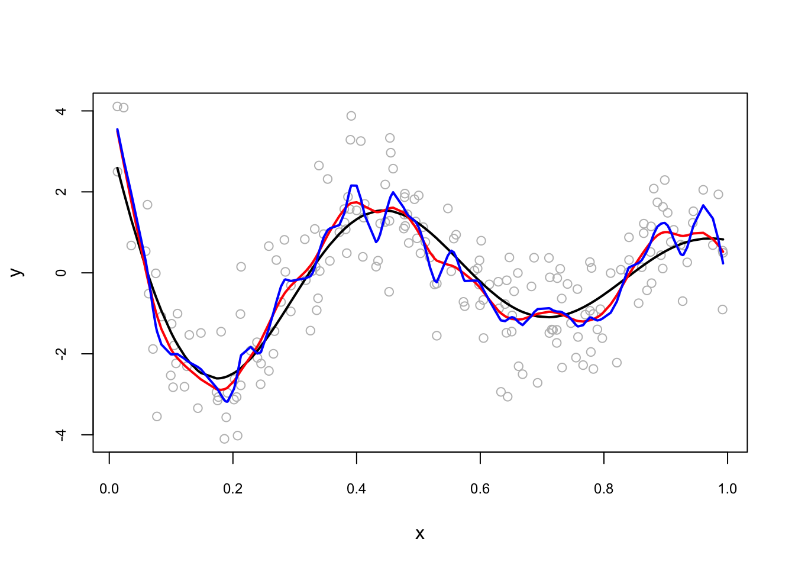

And when we use automated selection of knots: 
  

```r
plot(x, y, col = "gray", cex.main = 0.80, cex.axis = 0.75)
lines(x[order(x)], dgm[order(x)], lwd = 2, col = "black") # DGM
#lines(smooth.spline(x,y, cv = FALSE), lwd = 2, col = "blue") # With GCV
lines(smooth.spline(x,y), lwd = 2, col = "red") # With LOOCV
```

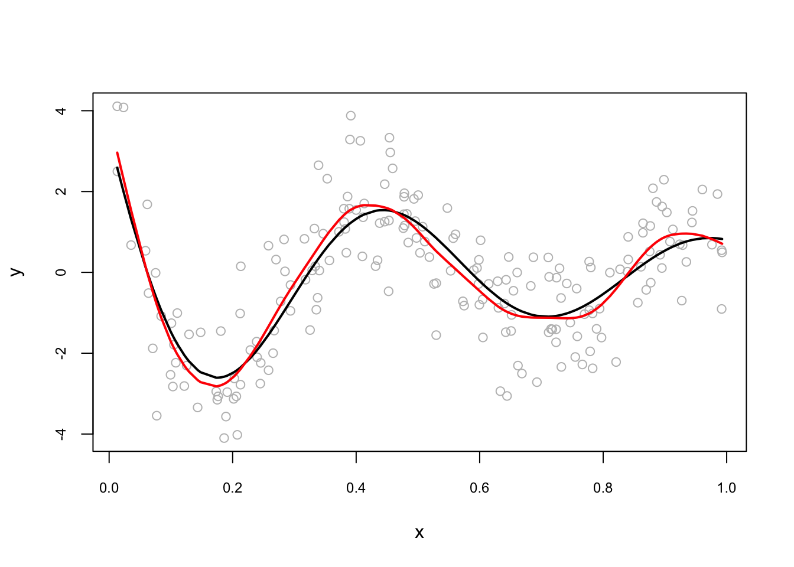
  
Note that there are other packages for smoothing splines like `npreg` that uses `ss()`^[see: <http://users.stat.umn.edu/~helwig/notes/smooth-spline-notes.html>.].  
  
In theory, nonparametric regression estimations can be easily extended to several regressors but in practice, good precision may require a huge number of observations without any graphical tools to make interpretation.  Because it is difficult to fit the nonparametric regression model when there are many predictors, more restrictive models have been developed. One such model is the additive regression model,  

\begin{equation}
y=\beta_{0}+m_{1}\left(x_{1}\right)+m_{2}\left(x_{2}\right)+\cdots+m_{p}\left(x_{p}\right)+\varepsilon
  (\#eq:6-9)
\end{equation} 


Variations on the additive regression model include semiparametric models, in which some of the predictors enter linearly or interactively. There are two common methods that have been used in multivariable settings: GAM (generalized additive regression splines) and MARS (multivariate adaptive regression splines).   

## MARS - Multivariate Adaptive Regression Splines

Linear models can incorporate nonlinear patterns in the data by manually adding squared terms and interaction effects, if we know the specific nature of the nonlinearity in advance. Although we can extend linear models to capture nonlinear relationships by including polynomial terms, it is generally unusual to use degree greater than 3 or 4.  Even if we use higher degrees, with multiple interactions and polynomials, the dimension of the model goes out of control.  Although useful, the typical implementation of polynomial regression requires the user to explicitly identify and incorporate which variables should have what specific degree polynomials and interactions.  With data sets that can easily contain 50, 100, or more variables today, this would require an enormous time to determine the explicit structure of nonlinear nature of the model.

Multivariate adaptive regression splines (MARS) can be a solution to capture the nonlinearity aspect of polynomial regression by assessing cutpoints (knots) like in a piecewise regression model. For example,in a simple one-variable model, the  procedure will first look for the single point across the range of $X$ values where two different linear relationships between $Y$ and $X$ achieve the smallest error. The results is known as a hinge function $\text{max}(0,x−a)$ where $a$ is the cutpoint value. Once the first knot has been found, the search continues for a second knot, which results in three linear models.  This procedure can continue until many knots are found, producing a highly nonlinear pattern.  Once the full set of knots have been created, we can sequentially remove knots that do not contribute significantly to predictive accuracy. This process is known as *pruning* and can be done by cross-validation.

Here is a simple application with the Longley dataset (in the `datasets` package) that describes seven economic variables observed from 1947 to 1962 used to predict the number of people employed yearly. 


```r
library(earth)

# load data
data(longley)
summary(longley)
```

```
##   GNP.deflator         GNP          Unemployed     Armed.Forces  
##  Min.   : 83.00   Min.   :234.3   Min.   :187.0   Min.   :145.6  
##  1st Qu.: 94.53   1st Qu.:317.9   1st Qu.:234.8   1st Qu.:229.8  
##  Median :100.60   Median :381.4   Median :314.4   Median :271.8  
##  Mean   :101.68   Mean   :387.7   Mean   :319.3   Mean   :260.7  
##  3rd Qu.:111.25   3rd Qu.:454.1   3rd Qu.:384.2   3rd Qu.:306.1  
##  Max.   :116.90   Max.   :554.9   Max.   :480.6   Max.   :359.4  
##    Population         Year         Employed    
##  Min.   :107.6   Min.   :1947   Min.   :60.17  
##  1st Qu.:111.8   1st Qu.:1951   1st Qu.:62.71  
##  Median :116.8   Median :1954   Median :65.50  
##  Mean   :117.4   Mean   :1954   Mean   :65.32  
##  3rd Qu.:122.3   3rd Qu.:1958   3rd Qu.:68.29  
##  Max.   :130.1   Max.   :1962   Max.   :70.55
```

```r
# fit model
fit1 <- earth(Employed ~ ., longley)
summary(fit1)
```

```
## Call: earth(formula=Employed~., data=longley)
## 
##                       coefficients
## (Intercept)            -1682.60259
## Year                       0.89475
## h(293.6-Unemployed)        0.01226
## h(Unemployed-293.6)       -0.01596
## h(Armed.Forces-263.7)     -0.01470
## 
## Selected 5 of 8 terms, and 3 of 6 predictors
## Termination condition: GRSq -Inf at 8 terms
## Importance: Year, Unemployed, Armed.Forces, GNP.deflator-unused, ...
## Number of terms at each degree of interaction: 1 4 (additive model)
## GCV 0.2389853    RSS 0.7318924    GRSq 0.9818348    RSq 0.996044
```

```r
# summarize the importance of input variables
evimp(fit1)
```

```
##              nsubsets   gcv    rss
## Year                4 100.0  100.0
## Unemployed          3  24.1   23.0
## Armed.Forces        2  10.4   10.8
```

```r
#plot
plot(fit1, which = 1, cex.main = 0.80, cex.axis = 0.75)
```

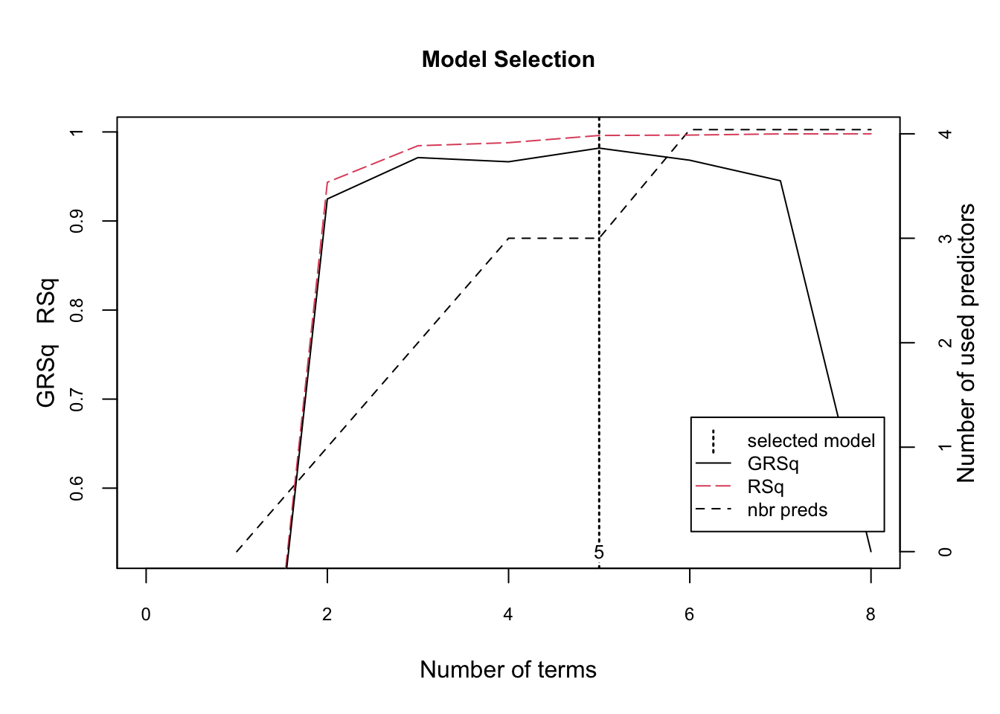

```r
# make predictions
predictions1 <- predict(fit1, longley)

# summarize accuracy for fit1
mse <- mean((longley$Employed - predictions1)^2)
#Remember this an in-sample fit. 
mse
```

```
## [1] 0.04574327
```

The figure illustrates the model selection with GCV (generalized cross-validation) $R^2$ based on the number of terms retained in the model.  These retained terms are constructed from original predictors (right-hand y-axis). The vertical dashed line at 5 indicates the optimal number of non-intercept terms retained where marginal increases in GCV R2 are less than 0.001.

Let's use another data, the Ames Housing data,  which is available by `AmesHousing` package.


```r
library(AmesHousing)

# Fit a basic MARS model
amesdata <- make_ames()
ames1 <- earth(Sale_Price ~ .,  data = amesdata)
ames2 <- earth(Sale_Price ~ .,  data = amesdata, degree = 2)

# In addition to pruning the number of knots,
# we can also assess potential interactions between different hinge functions.
# In the 2nd model, "degree = 2" argument allows level-2 interactions. 

summary(ames1)
```

```
## Call: earth(formula=Sale_Price~., data=amesdata)
## 
##                                coefficients
## (Intercept)                      279490.795
## NeighborhoodNorthridge_Heights    16810.853
## NeighborhoodCrawford              24189.424
## NeighborhoodNorthridge            27618.337
## NeighborhoodStone_Brook           31410.387
## NeighborhoodGreen_Hills          109592.758
## Condition_2PosN                  -96442.914
## Overall_QualGood                  12990.668
## Overall_QualVery_Good             34907.970
## Overall_QualExcellent             84380.868
## Overall_QualVery_Excellent       125196.226
## Overall_CondFair                 -23679.636
## Overall_CondGood                  11521.886
## Overall_CondVery_Good             14138.461
## Bsmt_ExposureGd                   11893.023
## FunctionalTyp                     17341.390
## h(15431-Lot_Area)                    -1.749
## h(Lot_Area-15431)                     0.301
## h(2003-Year_Built)                 -426.978
## h(Year_Built-2003)                 4212.701
## h(1972-Year_Remod_Add)              253.232
## h(Year_Remod_Add-1972)              486.266
## h(1869-Bsmt_Unf_SF)                  19.399
## h(Bsmt_Unf_SF-1869)                -121.684
## h(Total_Bsmt_SF-1822)               125.954
## h(2452-Total_Bsmt_SF)               -31.670
## h(Total_Bsmt_SF-2452)              -221.022
## h(Second_Flr_SF-1540)               320.816
## h(Gr_Liv_Area-3005)                 237.824
## h(3228-Gr_Liv_Area)                 -50.647
## h(Gr_Liv_Area-3228)                -316.547
## h(Kitchen_AbvGr-1)               -22620.827
## h(1-Fireplaces)                   -5701.130
## h(Fireplaces-1)                    8654.214
## h(2-Garage_Cars)                  -5290.463
## h(Garage_Cars-2)                  11400.346
## h(210-Screen_Porch)                 -55.241
## 
## Selected 37 of 40 terms, and 26 of 308 predictors
## Termination condition: RSq changed by less than 0.001 at 40 terms
## Importance: Gr_Liv_Area, Year_Built, Total_Bsmt_SF, Overall_QualExcellent, ...
## Number of terms at each degree of interaction: 1 36 (additive model)
## GCV 506531262    RSS 1.411104e+12    GRSq 0.9206569    RSq 0.9245098
```

```r
summary(ames2)
```

```
## Call: earth(formula=Sale_Price~., data=amesdata, degree=2)
## 
##                                                   coefficients
## (Intercept)                                         304004.163
## NeighborhoodGreen_Hills                             107542.815
## Overall_QualGood                                     28295.297
## Overall_QualVery_Good                                50500.728
## Overall_QualExcellent                                80054.922
## Overall_QualVery_Excellent                          115273.427
## Bsmt_ExposureGd                                      11761.126
## h(5400-Lot_Area)                                        -4.428
## h(Lot_Area-5400)                                         3.752
## h(2003-Year_Built)                                    -497.006
## h(Year_Built-2003)                                    7976.946
## h(Year_Remod_Add-1974)                                 957.791
## h(2452-Total_Bsmt_SF)                                  -54.823
## h(Total_Bsmt_SF-2452)                                   49.902
## h(3228-Gr_Liv_Area)                                    -44.151
## h(Gr_Liv_Area-3228)                                    197.513
## h(2-Fireplaces)                                      -6761.928
## h(Lot_Area-5400) * Overall_CondFair                     -2.710
## NeighborhoodCrawford * h(2003-Year_Built)              399.860
## Overall_QualAverage * h(2452-Total_Bsmt_SF)              6.310
## Overall_QualAbove_Average * h(2452-Total_Bsmt_SF)       11.542
## Overall_QualVery_Good * h(Bsmt_Full_Bath-1)          49827.988
## Overall_QualVery_Good * h(1-Bsmt_Full_Bath)         -12863.190
## Overall_CondGood * h(3228-Gr_Liv_Area)                   4.782
## Mas_Vnr_TypeStone * h(Gr_Liv_Area-3228)               -512.416
## h(Lot_Area-19645) * h(2452-Total_Bsmt_SF)               -0.001
## h(Lot_Area-5400) * h(Half_Bath-1)                       -3.867
## h(Lot_Area-5400) * h(1-Half_Bath)                       -0.397
## h(Lot_Area-5400) * h(Open_Porch_SF-195)                 -0.011
## h(Lot_Area-5400) * h(195-Open_Porch_SF)                 -0.005
## h(Lot_Area-5400) * h(192-Screen_Porch)                  -0.008
## h(2003-Year_Built) * h(Total_Bsmt_SF-1117)              -0.729
## h(2003-Year_Built) * h(1117-Total_Bsmt_SF)               0.368
## h(Year_Built-2003) * h(2439-Gr_Liv_Area)                -5.516
## h(Year_Remod_Add-1974) * h(Mas_Vnr_Area-14)              1.167
## h(Year_Remod_Add-1974) * h(14-Mas_Vnr_Area)             17.544
## h(Year_Remod_Add-1974) * h(Gr_Liv_Area-1627)             1.067
## h(Year_Remod_Add-1974) * h(932-Garage_Area)             -1.132
## h(Year_Remod_Add-1974) * h(Longitude- -93.6278)     -19755.291
## h(Year_Remod_Add-1974) * h(-93.6278-Longitude)       -7450.926
## h(1191-Bsmt_Unf_SF) * h(3228-Gr_Liv_Area)                0.009
## h(Bsmt_Unf_SF-1191) * h(3228-Gr_Liv_Area)               -0.028
## 
## Selected 42 of 49 terms, and 26 of 308 predictors
## Termination condition: RSq changed by less than 0.001 at 49 terms
## Importance: Gr_Liv_Area, Year_Built, Total_Bsmt_SF, Overall_QualExcellent, ...
## Number of terms at each degree of interaction: 1 16 25
## GCV 415202608    RSS 1.132115e+12    GRSq 0.9349626    RSq 0.9394349
```

```r
# predictions
predictions1 <- predict(ames1, amesdata)
predictions2 <- predict(ames2, amesdata)

# summarize accuracy for ames1 and ames2
mse <- mean(sqrt((amesdata$Sale_Price - predictions1)^2))
mse
```

```
## [1] 15345.66
```

```r
mse <- mean(sqrt((amesdata$Sale_Price - predictions2)^2))
mse
```

```
## [1] 13910.27
```

Now the second model includes interaction terms between multiple hinge functions.  For example, $h(Year\_Built-2003) \times h(Gr\_Liv\_Area-2274)$ is an interaction effect for those houses built prior to 2003 and have less than 2,274 square feet of living space above ground.

There are two tuning parameters with a MARS model: the `degree` of interactions and `nprune` - the number of retained terms. These parameters are called *hyperparameters* and we need to perform a grid search to find the best combination that maximizes the prediction accuracy. We will have chapter on this subject with examples later. For now, we will have a simple grid search with the `caret` package, which provides the most comprehensive machine learning library in R. 


```r
library(caret)
library(ggplot2)
library(vip)

# Grid to search
grid <- expand.grid(
  degree = 1:3,
  nprune = seq(2, 100, length.out = 10) %>% floor())
head(grid)
```

```
##   degree nprune
## 1      1      2
## 2      2      2
## 3      3      2
## 4      1     12
## 5      2     12
## 6      3     12
```

```r
# Training
set.seed(123)
mars <- train(
  x = subset(amesdata, select = -Sale_Price),
  y = amesdata$Sale_Price,
  method = "earth",
  metric = "RMSE",
  trControl = trainControl(method = "cv", number = 10),
  tuneGrid = grid
)

mars$bestTune
```

```
##   nprune degree
## 5     45      1
```

```r
ggplot(mars)
```

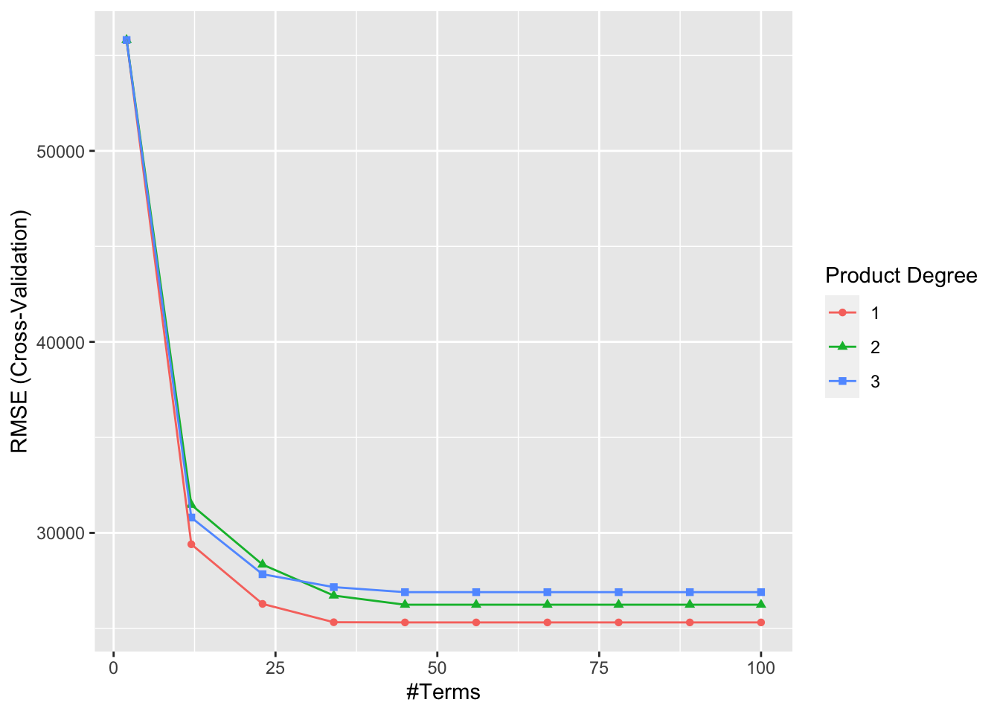

```r
vip(mars,
    num_features = 40,
    bar = FALSE,
    value = "gcv") + ggtitle("GCV")
```

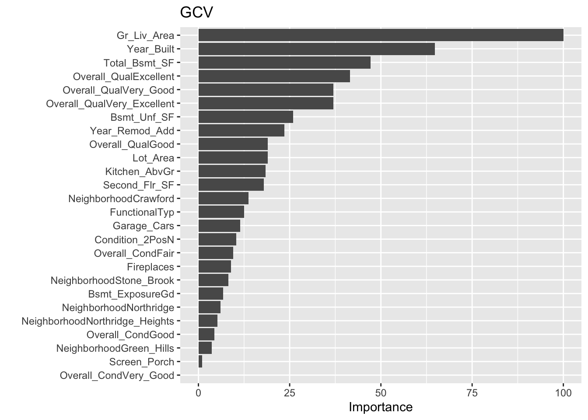

How does this compare to some other linear models for the Ames housing data? That's the main question that we will ask in related chapters covering other machine learning models.  

## GAM - Generalized Additive Model

Generalized Additive Model (GAM) is another method for discovering non-linear relationships in a multivariate setting.  The performance difference between MARS and GAM is well explained by Leathwich, Elith, and Hastie [-@Leath_2006].  Here is an excerpt from their paper (Page 189):

> Two other commonly used techniques capable of fitting non-linear relationships (...) are neural nets and classification and regression trees.  A third alternative, multivariate adaptive regression splines (MARS), has shown promise in recent comparative studies. This technique combines the strengths of regression trees and spline fitting by replacing the step functions normally associated with regression trees with piecewise linear basis functions. This allows the modelling of complex relationships between a response variable and its predictors. In practical terms, MARS has exceptional analytical speed, and its simple rule-based basis functions facilitate the prediction of species distributions using independent data.  
>

And from their abstract:  

> Results indicate little difference between the performance of GAM and MARS models, even when MARS models included interaction terms between predictor variables. Results from MARS models are much more easily incorporated into other analyses than those from GAM models. The strong performance of a MARS multiresponse model, particularly for species of low prevalence, suggests that it may have distinct advantages for the analysis of large datasets. 
>

GAM uses an iterative estimation process to the following generalized additive model by assuming $m$ can be decompose as a sum of several functions of dimension one or two (or more):    
\begin{equation}
y=m_{1}\left(x_{1}\right)+m_{2}\left(x_{2}\right)+\cdots+m_{k}\left(x_{k}\right)+\varepsilon
  (\#eq:6-16)
\end{equation}

The estimation to this 2-variable additive model $y=m_{1}\left(x_{1}\right)+m_{2}\left(x_{2}\right)+\varepsilon$ can be done by the following iterative procedure:  
  
(1) Select initial estimates $m_1^{(0)}$ and $m_2^{(0)}$ 
(2) Obtain $\hat{m}_1^{(i)}$ by regressing $y-\hat{m}_2^{(i-1)}$ on $x_1$ 
(3) Obtain $\hat{m}_2^{(i)}$ by regressing $y-\hat{m}_1^{(i-1)}$ on $x_2$ 
(4) Repeat steps 2 an 3 until no significant changes 
  
Initial estimates can be equal to 0 or obtained by OLS.  An important advantage of GAM is that an extension to more than two functions, which kernel or spline methods could be used for $m(x)$, does not lead to the curse of dimensionality problem. Let's consider the following estimation using a housing data set described below:  

$$
\log (\text { price })=X \beta+m_{1}(\text { green })+m_{2}(\text { coord } 1)+m_{3}(\text { coord } 2)+\varepsilon,
$$
  
where `price` is the housing price - 1135 observations, for 1995 in Brest; $X$ dummies are `Studio`, `T1`, `T2`, `T3`, `T4`, `T5`, `house`, `parking` defining the type of building and whether the parking lot exits or not; `green` is the distance to the closest green park; and `coord1`, `coord2` are geographical coordinates (location).


```r
data <- read.table("hedonic.dat", header = TRUE)
attach(data) # note that this is not advisable but I use it in this example
library(mgcv)

# Note that a nonlinear transformation of a dummy variable is still a dummy.
# let's add them in X vector
X <- cbind(T1, T2, T3, T4, T5, HOUSE, PARKING)
gam1 <- gam(LPRIX ~ X + s(GREEN) + s(COORD1) + s(COORD2))

# s() defines smooths in GAM formulae
summary(gam1)
```

```
## 
## Family: gaussian 
## Link function: identity 
## 
## Formula:
## LPRIX ~ X + s(GREEN) + s(COORD1) + s(COORD2)
## 
## Parametric coefficients:
##             Estimate Std. Error t value Pr(>|t|)    
## (Intercept)  4.79133    0.04698 101.997  < 2e-16 ***
## XT1          0.06974    0.05737   1.216    0.224    
## XT2          0.38394    0.05173   7.421 2.41e-13 ***
## XT3          0.75105    0.05025  14.946  < 2e-16 ***
## XT4          0.97310    0.05138  18.939  < 2e-16 ***
## XT5          1.13707    0.05666  20.070  < 2e-16 ***
## XHOUSE       0.23965    0.03273   7.321 4.91e-13 ***
## XPARKING     0.22890    0.02400   9.538  < 2e-16 ***
## ---
## Signif. codes:  0 '***' 0.001 '**' 0.01 '*' 0.05 '.' 0.1 ' ' 1
## 
## Approximate significance of smooth terms:
##             edf Ref.df     F p-value    
## s(GREEN)  5.539  6.745 2.552  0.0111 *  
## s(COORD1) 8.289  8.848 7.523  <2e-16 ***
## s(COORD2) 8.323  8.869 7.182  <2e-16 ***
## ---
## Signif. codes:  0 '***' 0.001 '**' 0.01 '*' 0.05 '.' 0.1 ' ' 1
## 
## R-sq.(adj) =  0.672   Deviance explained = 68.1%
## GCV = 0.10301  Scale est. = 0.10011   n = 1070
```

```r
# plot nonparametric components 
par(mfrow = c(1, 3))
plot(gam1, shade = TRUE, shade.col = "pink", ylim = c(-0.5, 0.7))
```

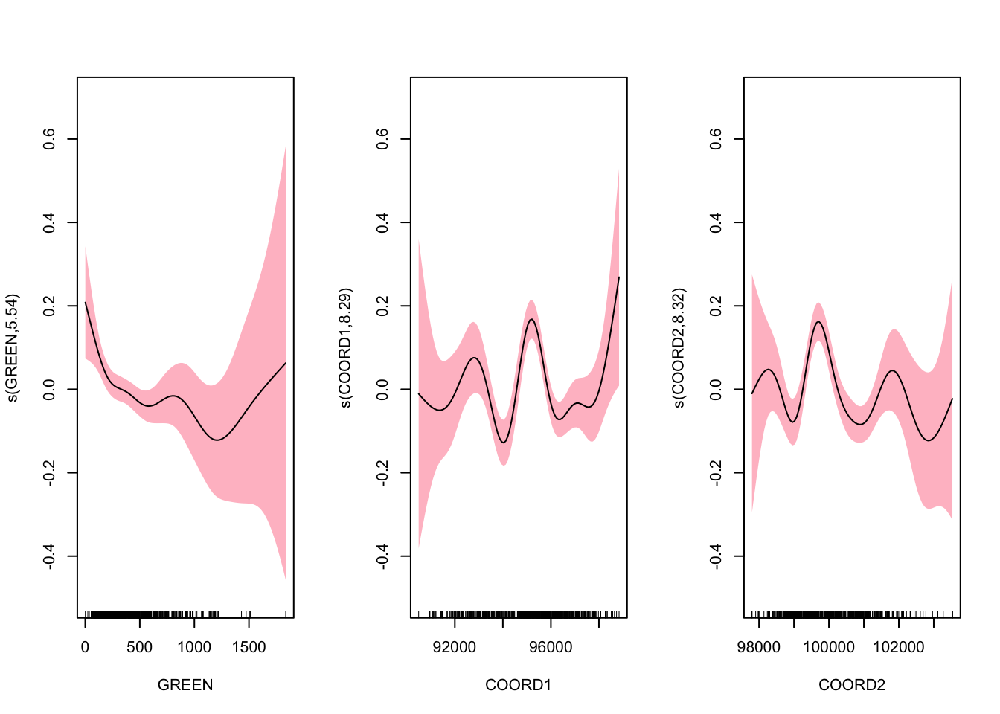
  
These figures do not suggest how a simple parametric modeling would be misleading. From the results, we can make standard interpretations: with similar other characteristics: (1) on average, a studio costs 120.421 francs ($e^{4.791}$); (2) a T2 is expected to cost 38.4\% more than a studio; (3) a house is expected to cost 23.9\% more than an apartment.  We also have results on the nonparametric components.  The $p$-values correspond to test $H_0$ : linear vs. $H_1$ : nonlinear relationship.   

If geographical location is assumed highly nonlinear, we should consider a more flexible model:

$$
\log (\text { price })=X \beta+m_{1}(\text { green })+m_{2}(\text { coord } 1, \text { coord } 2)+\varepsilon,
$$
where the spatial dependence is specified fully nonparametrically.  


```r
gam2 <- gam(LPRIX ~ X + s(GREEN) + s(COORD1, COORD2))
summary(gam2)
```

```
## 
## Family: gaussian 
## Link function: identity 
## 
## Formula:
## LPRIX ~ X + s(GREEN) + s(COORD1, COORD2)
## 
## Parametric coefficients:
##             Estimate Std. Error t value Pr(>|t|)    
## (Intercept)  4.77597    0.04641 102.916  < 2e-16 ***
## XT1          0.08030    0.05628   1.427    0.154    
## XT2          0.38691    0.05102   7.583 7.50e-14 ***
## XT3          0.76278    0.04959  15.383  < 2e-16 ***
## XT4          0.99325    0.05079  19.555  < 2e-16 ***
## XT5          1.13897    0.05594  20.361  < 2e-16 ***
## XHOUSE       0.23827    0.03247   7.339 4.36e-13 ***
## XPARKING     0.24428    0.02426  10.069  < 2e-16 ***
## ---
## Signif. codes:  0 '***' 0.001 '**' 0.01 '*' 0.05 '.' 0.1 ' ' 1
## 
## Approximate significance of smooth terms:
##                     edf Ref.df     F p-value    
## s(GREEN)          6.487  7.626 2.074  0.0445 *  
## s(COORD1,COORD2) 24.063 27.395 6.714  <2e-16 ***
## ---
## Signif. codes:  0 '***' 0.001 '**' 0.01 '*' 0.05 '.' 0.1 ' ' 1
## 
## R-sq.(adj) =  0.685   Deviance explained = 69.6%
## GCV = 0.099791  Scale est. = 0.096196  n = 1070
```

```r
vis.gam(gam2, view =c("COORD1", "COORD2"), phi = 20,
        main =  bquote(m[2](coord1) + m[3](coord2)))
```

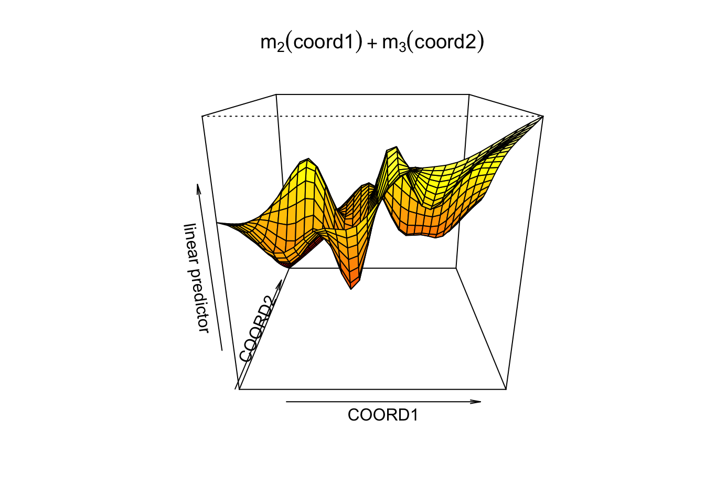
  
If we define them linearly,
  

```r
gam3 <- gam(LPRIX ~ X + s(GREEN) + COORD1 + COORD2)
summary(gam3)
```

```
## 
## Family: gaussian 
## Link function: identity 
## 
## Formula:
## LPRIX ~ X + s(GREEN) + COORD1 + COORD2
## 
## Parametric coefficients:
##               Estimate Std. Error t value Pr(>|t|)    
## (Intercept)  6.707e+00  1.101e+00   6.093 1.55e-09 ***
## XT1          5.972e-02  6.003e-02   0.995 0.320062    
## XT2          3.742e-01  5.426e-02   6.896 9.22e-12 ***
## XT3          7.450e-01  5.222e-02  14.267  < 2e-16 ***
## XT4          9.475e-01  5.293e-02  17.901  < 2e-16 ***
## XT5          1.127e+00  5.845e-02  19.285  < 2e-16 ***
## XHOUSE       2.683e-01  3.254e-02   8.245 4.86e-16 ***
## XPARKING     2.397e-01  2.442e-02   9.817  < 2e-16 ***
## COORD1       2.046e-05  7.256e-06   2.819 0.004903 ** 
## COORD2      -3.854e-05  1.150e-05  -3.351 0.000834 ***
## ---
## Signif. codes:  0 '***' 0.001 '**' 0.01 '*' 0.05 '.' 0.1 ' ' 1
## 
## Approximate significance of smooth terms:
##            edf Ref.df     F p-value   
## s(GREEN) 6.895  8.028 2.809 0.00469 **
## ---
## Signif. codes:  0 '***' 0.001 '**' 0.01 '*' 0.05 '.' 0.1 ' ' 1
## 
## R-sq.(adj) =  0.637   Deviance explained = 64.2%
## GCV = 0.11277  Scale est. = 0.11099   n = 1070
```

```r
vis.gam(gam3, view =c("COORD1", "COORD2"), phi = 20,
        main = bquote(beta[1] * 'coord1' + beta[2] * 'coord2'))
```

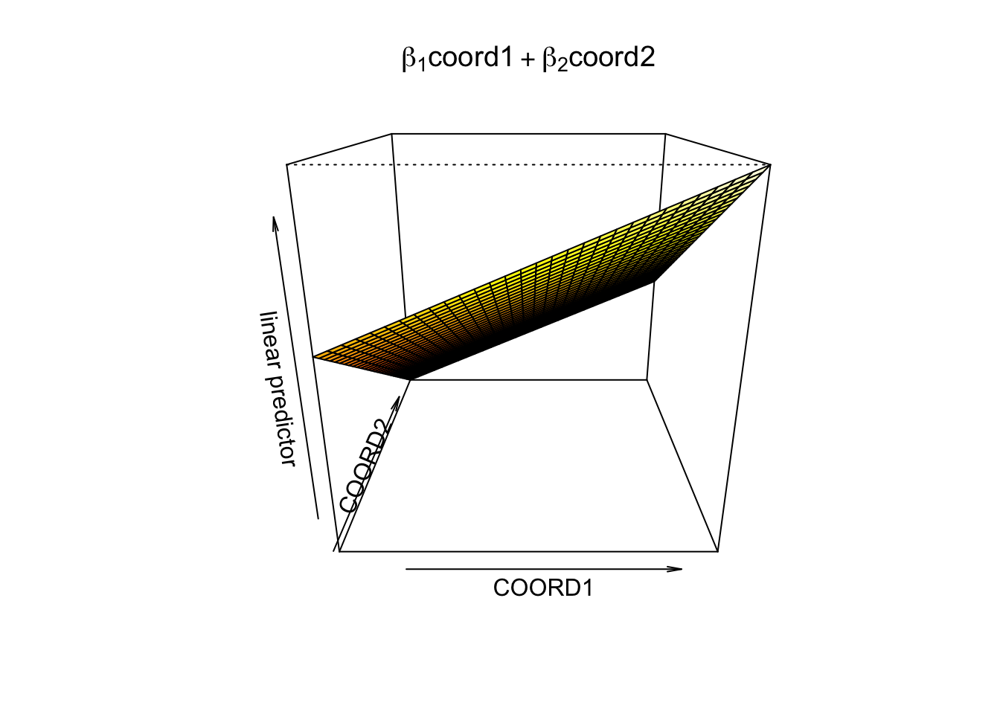

GAMs provide a useful compromise between linear and fully nonparametric models.  Here is the linear specification with GAM:  


```r
gam4 <- gam(LPRIX ~ X + GREEN + COORD1 + COORD2)
summary(gam4)
```

```
## 
## Family: gaussian 
## Link function: identity 
## 
## Formula:
## LPRIX ~ X + GREEN + COORD1 + COORD2
## 
## Parametric coefficients:
##               Estimate Std. Error t value Pr(>|t|)    
## (Intercept)  7.211e+00  1.096e+00   6.577 7.54e-11 ***
## XT1          6.455e-02  6.042e-02   1.068 0.285597    
## XT2          3.859e-01  5.444e-02   7.089 2.47e-12 ***
## XT3          7.548e-01  5.235e-02  14.418  < 2e-16 ***
## XT4          9.576e-01  5.309e-02  18.037  < 2e-16 ***
## XT5          1.141e+00  5.860e-02  19.462  < 2e-16 ***
## XHOUSE       2.741e-01  3.274e-02   8.371  < 2e-16 ***
## XPARKING     2.417e-01  2.454e-02   9.850  < 2e-16 ***
## GREEN       -4.758e-05  4.470e-05  -1.064 0.287435    
## COORD1       1.909e-05  7.111e-06   2.685 0.007365 ** 
## COORD2      -4.219e-05  1.148e-05  -3.674 0.000251 ***
## ---
## Signif. codes:  0 '***' 0.001 '**' 0.01 '*' 0.05 '.' 0.1 ' ' 1
## 
## 
## R-sq.(adj) =   0.63   Deviance explained = 63.3%
## GCV = 0.11418  Scale est. = 0.113     n = 1070
```

```r
detach(data)
```
  
GAM becomes an important tool to understand whether model should be estimated as a linear function or a complex nonlinear function.  We can even see and test if a specific variable should have a nonlinear part.  For example, if we want to know coordinates should be included additively, linear, or nonparametrically, we can use GAM and then compare performances of those different models and make a decision.   
  
GAMs are based on a hypothesis of additive separability. They are helpful for reducing the dimension of the model without facing the curse of dimensionality problem.  But, unlike MARS, **they miss possible important interactions** (we can add them manually, though).  
