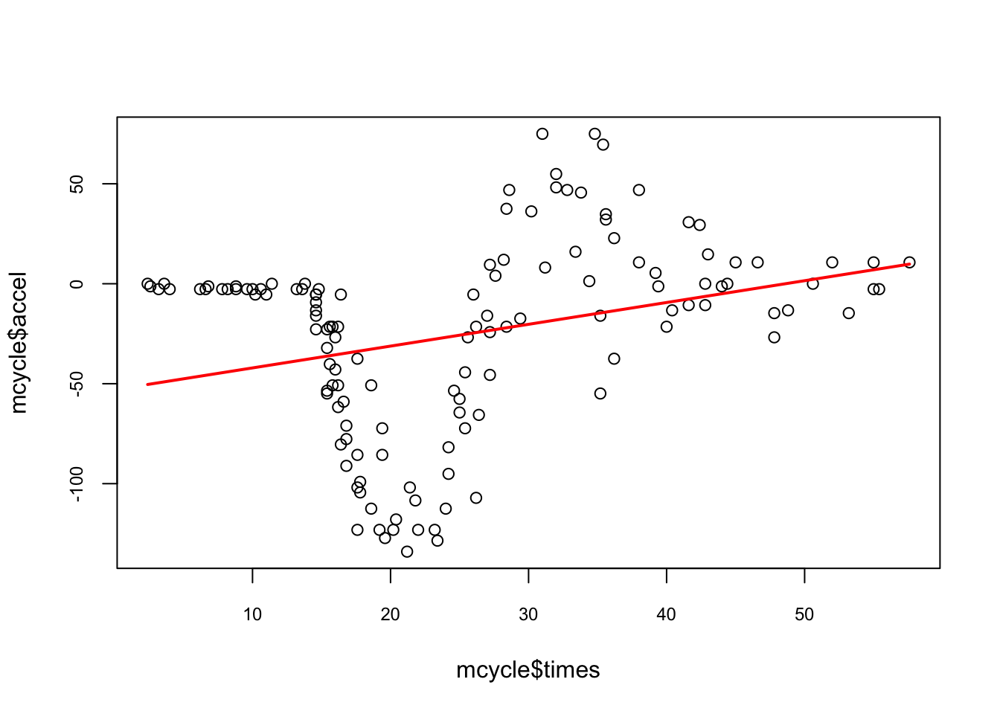
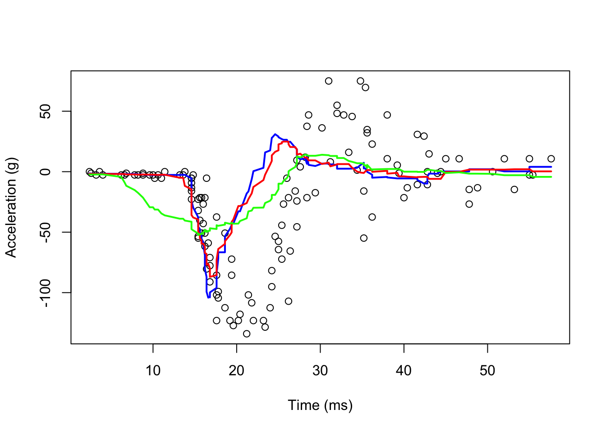
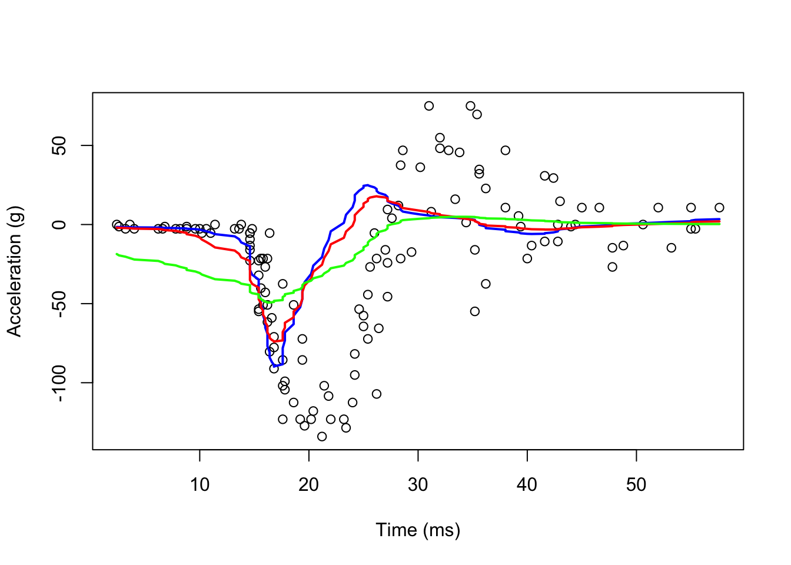
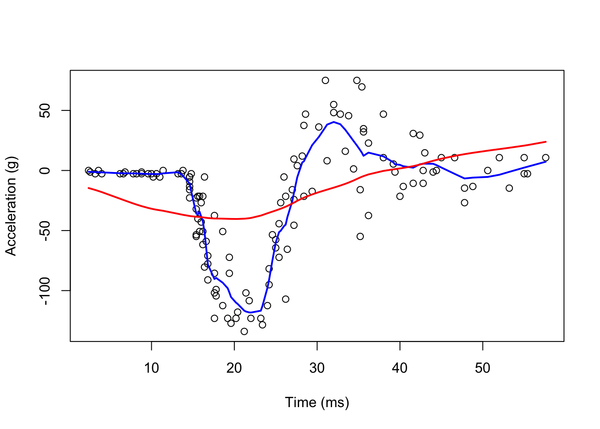
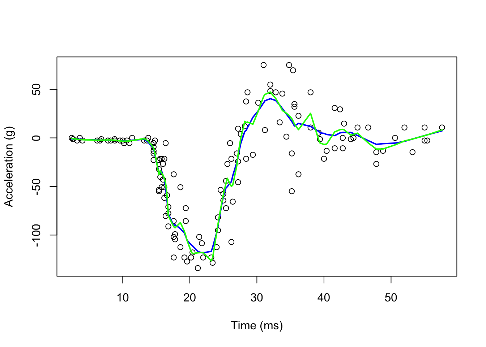
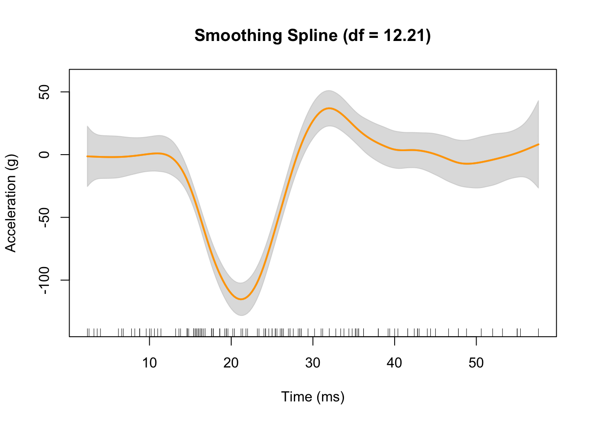
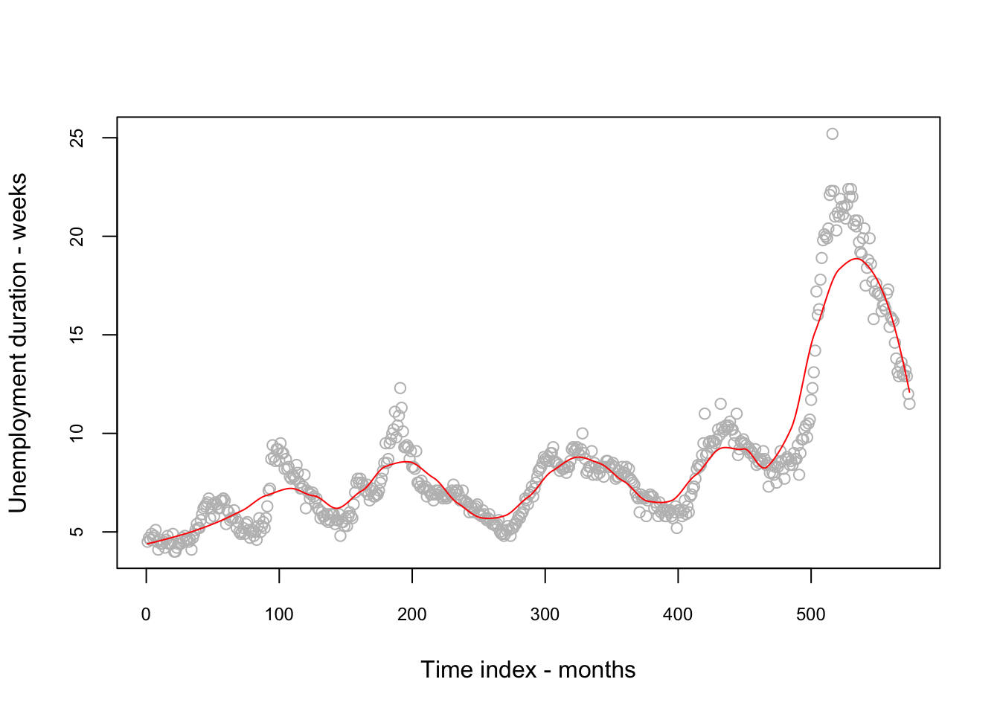

# Smoothing
  
The main reason for using smoothing methods is noise reduction, which makes patterns and trends in the data more noticeable and easier to analyze for the improved accuracy of predictions made from the data. You can think of smoothing as a process that reduces the effect of noise in the data.

We can define $Y_i$ with a following model:

$$
Y_{i}=f\left(x_{i}\right)+\varepsilon_{i}
$$
  
We do not want to (and cannot) predict $Y_i$ as we do not know the random part, $\epsilon_i$, the "noise".  If we predict $f(x)$ well, it would give us a good approximation about $Y_i$.  Nonparametric estimations can be helpful for recovering $f(x)$. In general, the purposes of smoothing is two-fold: building a forecasting model by smoothing and learning the shape of the trend embedded in the data ($Y$).    

The `mcycle` dataset from the `MASS` package contains $n=133$ pairs of time points (in ms - milliseconds) and observed head accelerations (in g - acceleration of gravity) that were recorded in a simulated motorcycle accident. We will have several smoothing methods to explore the relationship between time and acceleration. First, let's visualize the relationship between time $(X)$ and acceleration $(Y)$ and see if we can assume that $f(x_i)$ is a linear function of time:  


```r
library(tidyverse)
library(MASS)
data(mcycle)
head(mcycle)
```

```
##   times accel
## 1   2.4   0.0
## 2   2.6  -1.3
## 3   3.2  -2.7
## 4   3.6   0.0
## 5   4.0  -2.7
## 6   6.2  -2.7
```

```r
plot(mcycle$times, mcycle$accel,
      cex.axis = 0.75, cex.main = 0.8)

# linear regression
lines(mcycle$times,  predict(lm(accel ~ times, mcycle)), lwd = 2, col = "red")
```


  
The line does not appear to describe the trend very well. 

## Using bins

As we have seen before, the main idea is to group data points into bins (equal size) in which the value of $f(x)$ can be assumed to be constant. This assumption could be realistic because if we consider $f(x)$ is almost constant in small windows of time. After deciding the window size (say, 10ms), we find out how many observations ($Y_i$) we have in those 10-ms windows.  We can calculate the number of observations in a 10-ms window centered around $x_i$ satisfying the following condition:

$$
\left(x-\frac{10}{2}<x_{i}<x+\frac{10}{2}\right)
$$
When we apply condition such as this for each observation of $x_i$, we create a moving 10-ms window. Note that the window is established by adding half of 10ms to $x_i$ to get the forward half and subtracting it from $x_i$ to get the backward half.  When we identify all the observations in each window, we estimate $f(x)$ as the average of the $Y_i$ values in that window.   If we define $A_0$ as the set of indexes in each window and $N_0$ as the number of observation in each window, with our data, computing $f(x)$ can be expressed as 

\begin{equation}
\hat{f}\left(x_{0}\right)=\frac{1}{N_{0}} \sum_{i \in A_{0}} Y_{i}
  (\#eq:7-1)
\end{equation} 
  
Here is its application to our data:  


```r
#With ksmooth() Pay attention to "box"
fit1 <- with(mcycle, ksmooth(times, accel, kernel = "box", bandwidth = 7))
fit2 <- with(mcycle, ksmooth(times, accel, kernel = "box", bandwidth = 10))
fit3 <- with(mcycle, ksmooth(times, accel, kernel = "box", bandwidth = 21))

plot(mcycle$times, mcycle$accel, 
     xlab = "Time (ms)", ylab = "Acceleration (g)")
lines(mcycle$times,  fit1$y, lwd = 2, col = "blue")
lines(mcycle$times,  fit2$y, lwd = 2, col = "red")
lines(mcycle$times,  fit3$y, lwd = 2, col = "green")
```


  
As you can see, even if we use a shorter bandwidth, the lines are quite wiggly.

## Kernel smoothing

We can take care of this by taking weighted averages that give the center points more weight than far away points.  


```r
#With ksmooth() Pay attention to "box"
fit1 <- with(mcycle, ksmooth(times, accel, kernel = "normal", bandwidth = 7))
fit2 <- with(mcycle, ksmooth(times, accel, kernel = "normal", bandwidth = 10))
fit3 <- with(mcycle, ksmooth(times, accel, kernel = "normal", bandwidth = 21))

plot(mcycle$times, mcycle$accel, 
     xlab = "Time (ms)", ylab = "Acceleration (g)")
lines(mcycle$times,  fit1$y, lwd = 2, col = "blue")
lines(mcycle$times,  fit2$y, lwd = 2, col = "red")
lines(mcycle$times,  fit3$y, lwd = 2, col = "green")
```


  
Now, they look smoother.  There are several functions in R that implement bin smoothing. One example is `ksmooth`, shown above. As we have seen before, however, we typically prefer methods such as `loess` that improves on these methods fitting a constant. 

## Locally weighted regression `loess()`

A limitation of the bin smoother approach by `ksmooth()` is that we need small windows for the approximately constant assumptions to hold.  Now `loess()` permits us to consider larger window sizes.  


```r
#With loess()
fit1 <- loess(accel ~ times, degree = 1, span = 0.1, mcycle)
fit2 <-loess(accel ~ times, degree = 1, span = 0.9, mcycle)

summary(fit1)
```

```
## Call:
## loess(formula = accel ~ times, data = mcycle, span = 0.1, degree = 1)
## 
## Number of Observations: 133 
## Equivalent Number of Parameters: 18.57 
## Residual Standard Error: 22.93 
## Trace of smoother matrix: 22.01  (exact)
## 
## Control settings:
##   span     :  0.1 
##   degree   :  1 
##   family   :  gaussian
##   surface  :  interpolate	  cell = 0.2
##   normalize:  TRUE
##  parametric:  FALSE
## drop.square:  FALSE
```
  

```r
plot(mcycle$times, mcycle$accel, 
     xlab = "Time (ms)", ylab = "Acceleration (g)")
lines(mcycle$times,  fit1$fitted, lwd = 2, col = "blue")
lines(mcycle$times,  fit2$fitted, lwd = 2, col = "red")
```


  
It seems the "red" line is underfitting the data.  We can make our windows even larger by fitting parabolas instead of lines.  


```r
fit1 <- loess(accel ~ times, degree = 1, span = 0.1, data = mcycle)
fit2 <-loess(accel ~ times, degree = 2, span = 0.1, data = mcycle)

plot(mcycle$times, mcycle$accel, 
     xlab = "Time (ms)", ylab = "Acceleration (g)")
lines(mcycle$times,  fit1$fitted, lwd = 2, col = "blue")
lines(mcycle$times,  fit2$fitted, lwd = 2, col = "green")
```




## Smooth Spline Regression
We can also use `npreg` package with `ss()` function for automated smooth splines


```r
library(npreg)

fit3 <- with(mcycle, npreg::ss(times, accel))
fit3
```

```
## 
## Call:
## npreg::ss(x = times, y = accel)
## 
## Smoothing Parameter  spar = 0.1585867   lambda = 8.337283e-07
## Equivalent Degrees of Freedom (Df) 12.20781
## Penalized Criterion (RSS) 62034.66
## Generalized Cross-Validation (GCV) 565.4684
```
  

```r
plot(fit3,
     xlab = "Time (ms)",
     ylab = "Acceleration (g)",
     col = "orange")
rug(mcycle$times)  # add rug to plot for the precise location of each point
```


  
The gray shaded area denotes a 95% Bayesian “confidence interval” for the unknown function.

## Multivariate Loess

When there are more than two predictors, it is always advisable to use additive models either GAM or MARS.  Nevertheless, let's try `loess()` with several variables.  This dataset is from [St.Louis Federal Reserve](http://research.stlouisfed.org/fred2) [@FRED_1].  It has 6 variables (observed monthly): `psavert`, personal savings rate; `pce`, personal consumption expenditures (in billions of dollars); `unemploy`, number of unemployed (in thousands), `uempmed` median duration of unemployment (weeks), and `pop` total population (in thousands).  Although we have a time variable, `date`, we create an index for time.


```r
data(economics, package = "ggplot2")
str(economics)
```

```
## spc_tbl_ [574 × 6] (S3: spec_tbl_df/tbl_df/tbl/data.frame)
##  $ date    : Date[1:574], format: "1967-07-01" "1967-08-01" ...
##  $ pce     : num [1:574] 507 510 516 512 517 ...
##  $ pop     : num [1:574] 198712 198911 199113 199311 199498 ...
##  $ psavert : num [1:574] 12.6 12.6 11.9 12.9 12.8 11.8 11.7 12.3 11.7 12.3 ...
##  $ uempmed : num [1:574] 4.5 4.7 4.6 4.9 4.7 4.8 5.1 4.5 4.1 4.6 ...
##  $ unemploy: num [1:574] 2944 2945 2958 3143 3066 ...
```

```r
economics$index <- 1:nrow(economics)
fit1 <-
  loess(uempmed ~ index, data = economics, span = 0.25) # 25% smoothing span
RRSS_1 <- sqrt(mean((fit1$residuals) ^ 2))
RRSS_1
```

```
## [1] 1.192171
```

```r
plot(economics$index,
     economics$uempmed,
     cex.axis = 0.75,
     cex.main = 0.8,
     xlab = "Time index - months",
     ylab = "Unemployment duration - weeks",
     col = "grey")
lines(economics$index,  fit1$fitted, lwd = 1, col = "red")
```



```r
#Now more predictors
fit2 <- loess(uempmed ~ pce + psavert + pop + index,
              data = economics, span = 2)

RRSS_2 <- sqrt(mean((fit2$residuals) ^ 2))
RRSS_2
```

```
## [1] 58.61336
```


