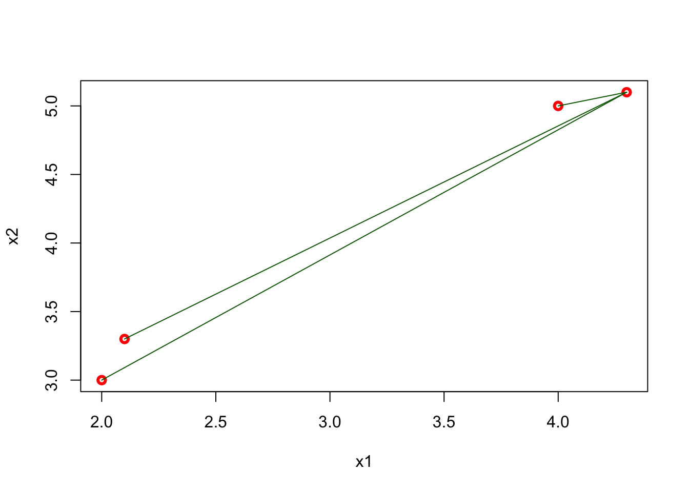
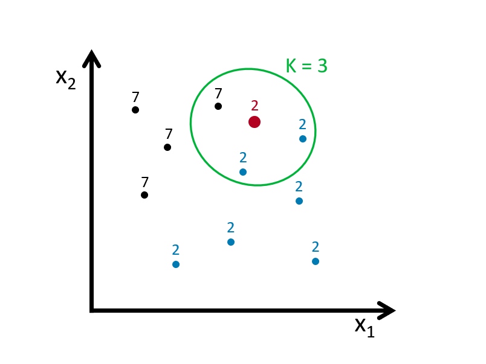
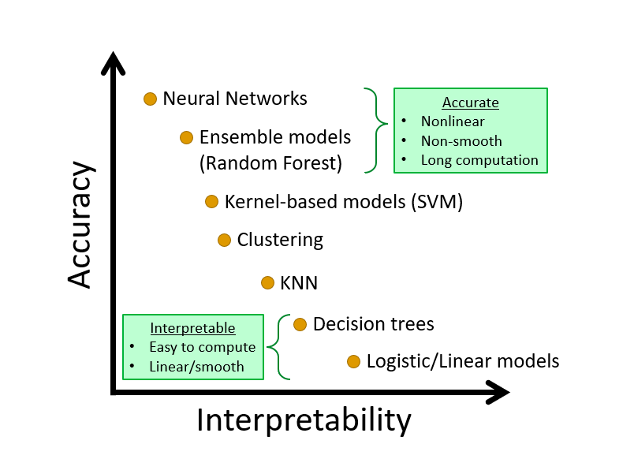

# Nonparametric Classifier - kNN

We complete this section, Nonparametric Estimations, with a nonparametric classifier and compare its performance with parametric classifiers, LPM and Logistic.

## `mnist` Dataset

Reading hand-written letters and numbers is not a big deal nowadays.  For example, In Canada Post, computers read postal codes and robots sorts them for each postal code groups.  This application is mainly achieved by machine learning algorithms.  In order to understand how, let's use a real dataset, Mnist. Here is the description of the dataset by Wikipedia: 

> The MNIST database (Modified National Institute of Standards and Technology database) is a large database of handwritten digits that is commonly used for training various image processing systems. The MNIST database contains 60,000 training images and 10,000 testing images. Half of the training set and half of the test set were taken from NIST's training dataset, while the other half of the training set and the other half of the test set were taken from NIST's testing dataset. There have been a number of scientific papers on attempts to achieve the lowest error rate; one paper, using a hierarchical system of convolutional neural networks, manages to get an error rate on the MNIST database of 0.23\%.
>


These images are converted into $28 \times 28 = 784$ pixels and, for each pixel, there is a measure that scales the darkness in that pixel between 0 (white) and 255 (black).  Hence, for each digitized image, we have an indicator variable $Y$ between 0 and 9, and we have 784 variables that identifies each pixel in the digitized image. Let's download the data.  ([More details about the data](http://yann.lecun.com/exdb/mnist/)).     


```r
#loading the data
library(tidyverse)
library(dslabs)
#Download the data to your directory.  It's big!
#mnist <- read_mnist() 
#save(mnist, file = "mnist.Rdata")
load("mnist.Rdata")
str(mnist)
```

```
## List of 2
##  $ train:List of 2
##   ..$ images: int [1:60000, 1:784] 0 0 0 0 0 0 0 0 0 0 ...
##   ..$ labels: int [1:60000] 5 0 4 1 9 2 1 3 1 4 ...
##  $ test :List of 2
##   ..$ images: int [1:10000, 1:784] 0 0 0 0 0 0 0 0 0 0 ...
##   ..$ labels: int [1:10000] 7 2 1 0 4 1 4 9 5 9 ...
```

The data is given as a list and already divided into train and test sets.  We have 60,000 images in the train set and 10,000 images in the test set. For the train set, we have two nested sets: `images`, which contains all 784 features for 60,000 images.  Hence, it's a $60000 \times 784$ matrix. And, `labels` contains the labes (from 0 to 9) for each image. 
  
The digitizing can be understood from this image better:
  


Each image has $28 \times 28$ = 784 pixels.  For each image, the pixels are features with a label that shows the true number between 0 and 9.  This methods is called as "flattening", which is a technique that is used to convert multi-dimensional image into a one-dimension array (vector).
  
For now, we will use a smaller version of this data set given in the `dslabs` package, which is a random sample of 1,000 images (only for 2 and 7 digits), 800 in the training set and 200 in the test set, with only two features: the proportion of dark pixels that are in the upper left quadrant, `x_1`, and the lower right quadrant, `x_2`. 


```r
data("mnist_27")
str(mnist_27)
```

```
## List of 5
##  $ train      :'data.frame':	800 obs. of  3 variables:
##   ..$ y  : Factor w/ 2 levels "2","7": 1 2 1 1 2 1 2 2 2 1 ...
##   ..$ x_1: num [1:800] 0.0395 0.1607 0.0213 0.1358 0.3902 ...
##   ..$ x_2: num [1:800] 0.1842 0.0893 0.2766 0.2222 0.3659 ...
##  $ test       :'data.frame':	200 obs. of  3 variables:
##   ..$ y  : Factor w/ 2 levels "2","7": 1 2 2 2 2 1 1 1 1 2 ...
##   ..$ x_1: num [1:200] 0.148 0.283 0.29 0.195 0.218 ...
##   ..$ x_2: num [1:200] 0.261 0.348 0.435 0.115 0.397 ...
##  $ index_train: int [1:800] 40334 33996 3200 38360 36239 38816 8085 9098 15470 5096 ...
##  $ index_test : int [1:200] 46218 35939 23443 30466 2677 54248 5909 13402 11031 47308 ...
##  $ true_p     :'data.frame':	22500 obs. of  3 variables:
##   ..$ x_1: num [1:22500] 0 0.00352 0.00703 0.01055 0.01406 ...
##   ..$ x_2: num [1:22500] 0 0 0 0 0 0 0 0 0 0 ...
##   ..$ p  : num [1:22500] 0.703 0.711 0.719 0.727 0.734 ...
##   ..- attr(*, "out.attrs")=List of 2
##   .. ..$ dim     : Named int [1:2] 150 150
##   .. .. ..- attr(*, "names")= chr [1:2] "x_1" "x_2"
##   .. ..$ dimnames:List of 2
##   .. .. ..$ x_1: chr [1:150] "x_1=0.0000000" "x_1=0.0035155" "x_1=0.0070310" "x_1=0.0105465" ...
##   .. .. ..$ x_2: chr [1:150] "x_2=0.000000000" "x_2=0.004101417" "x_2=0.008202834" "x_2=0.012304251" ...
```
  
## Linear classifiers (again) 

A linear classifier (like LPM and Logistic) is one where a "hyperplane" is formed by taking a linear combination of the features.  Hyperplane represents a decision boundary chosen by our classifier to separate the data points in different class labels.  let's start with LPM:  
  
\begin{equation}
\operatorname{Pr}\left(Y=1 | X_{1}=x_{1}, X_{2}=x_{2}\right)=\beta_{0}+\beta_{1} x_{1}+\beta_{2} x_{2}
  (\#eq:8-1)
\end{equation} 
  

```r
# LPM requires numerical 1 and 0
y10 = ifelse(mnist_27$train$y == 7, 1, 0)
train <- data.frame(mnist_27$train, y10)
plot(train$x_1, train$x_2, col = train$y10 + 1, cex = 0.5)
```


Here, the black dots are 2 and red dots are 7.  Note that if we use 0.5 as a decision rule such that it separates pairs ($x_1$, $x_2$) for which $\operatorname{Pr}\left(Y=1 | X_{1}=x_{1}, X_{2}=x_{2}\right) < 0.5$ then we can have a hyperplane as  

$$
\hat{\beta}_{0}+\hat{\beta}_{1} x_{1}+\hat{\beta}_{2} x_{2}=0.5 \Longrightarrow x_{2}=\left(0.5-\hat{\beta}_{0}\right) / \hat{\beta}_{2}-\hat{\beta}_{1} / \hat{\beta}_{2} x_{1}.
$$
  
If we incorporate this into our plot for the train data:  


```r
model <- lm(y10 ~ x_1 + x_2, train)

tr <- 0.5
a <- tr - model$coefficients[1]
a <- a / model$coefficients[3]
b <- -model$coefficients[2] / model$coefficients[3]
plot(train$x_1, train$x_2, col = train$y10 + 1, cex = 0.72)
abline(a, b, col = "blue", lwd = 2.8)
```


Play with the (discriminating) threshold and see how the hyperplane moves.  When we change it to different numbers between 0 and 1, the number of correct and wrong predictions, a separation of red and black dots located in different sides, changes as well.  Moreover **the decision boundary is linear**.  That's why LPM is called a linear classifier.  

Would including interactions and polynomials (nonlinear parts) would place the line such a way that separation of these dots (2s and 7s) would be better?  

Let's see if adding a polynomial to our LPM improves this.


```r
model2 <- lm(y10 ~ x_1 + I(x_1 ^ 2) + x_2, train)
summary(model2)
```

```
## 
## Call:
## lm(formula = y10 ~ x_1 + I(x_1^2) + x_2, data = train)
## 
## Residuals:
##      Min       1Q   Median       3Q      Max 
## -1.14744 -0.28816  0.03999  0.28431  1.06759 
## 
## Coefficients:
##             Estimate Std. Error t value Pr(>|t|)    
## (Intercept)  0.09328    0.06571   1.419   0.1562    
## x_1          4.81884    0.55310   8.712  < 2e-16 ***
## I(x_1^2)    -2.75520    1.40760  -1.957   0.0507 .  
## x_2         -1.18864    0.17252  -6.890 1.14e-11 ***
## ---
## Signif. codes:  0 '***' 0.001 '**' 0.01 '*' 0.05 '.' 0.1 ' ' 1
## 
## Residual standard error: 0.3891 on 796 degrees of freedom
## Multiple R-squared:  0.3956,	Adjusted R-squared:  0.3933 
## F-statistic: 173.7 on 3 and 796 DF,  p-value: < 2.2e-16
```

```r
tr <- 0.5
s <- model2$coefficients
a = tr / s[3]
b = s[1] / s[3]
d = s[2] / s[3]
e = s[4] / s[3]
x22 = a - b - d * train$x_1 - e * (train$x_1 ^ 2)
plot(train$x_1, train$x_2, col = train$y10 + 1, cex = 0.72)
lines(train$x_1[order(x22)], x22[order(x22)], lwd = 2.8)
```


The coefficient of the polynomial is barely significant and very negligible in magnitude.  And in fact the classification seems worse than the previous one.
  
Would a logistic regression give us a better line?  We don't need to estimate it, but we can obtain the decision boundary for the logistic regression.  Remember,
  
$$
P(Y=1 | x)=\frac{\exp \left(w_{0}+\sum_{i} w_{i} x_{i}\right)}{1+\exp \left(w_{0}+\sum_{i} w_{i} x_{i}\right)}
$$
  
And,  

$$
P(Y=0 | x)=1-P(Y=1 | x)= \frac{1}{1+\exp \left(w_{0}+\sum_{i} w_{i} x_{i}\right)}
$$
  
if we take the ratio of success over failure, $P/1-P$,  

$$
\frac{P}{1-P}=\exp \left(w_{0}+\sum_{i} w_{i} x_{i}\right)
$$
  
If this ratio is higher than 1, we think that the probability for $Y=1$ is higher than the probability for $Y=0$.  And this only happens when $P>0.5$.  Hence, the condition to classify the observation as $Y=1$ is:

$$
\frac{P}{1-P}=\exp \left(w_{0}+\sum_{i} w_{i} x_{i}\right) > 1
$$
  
If we take the log of both sides,  

$$
w_{0}+\sum_{i} w_{i} X_{i}>0
$$

From here, the hyperplane function in our case becomes,  

$$
\hat{\beta}_{0}+\hat{\beta}_{1} x_{1}+\hat{\beta}_{2} x_{2}=0 \Longrightarrow x_{2}=-\hat{\beta}_{0} / \hat{\beta}_{2}-\hat{\beta}_{1} / \hat{\beta}_{2} x_{1}.
$$
  
We see that the decision boundary is again linear. Therefore, LPM and logistic regressions are called as **linear classifiers**, which are good **only if the problem on hand is linearly separable**.

Would it be possible to have a nonlinear boundary condition so that we can get a better classification for our predicted probabilities?  

## k-Nearest Neighbors

k-nearest neighbors (kNN) is a nonparametric method used for classification (or regression), which estimate $p(x_1, x_2)$ by using a method similar to *bin smoothing*. In *kNN classification*, the output is a class membership. An object is assigned to the class most common among its k-nearest neighbors. In *kNN regressions*, the output is the average of the values of k-nearest neighbors, which we've seen in bin smoothing applications.  
  

  
Suppose we have to classify (identify) the red dot as 7 or 2.  Since it's a nonparametric approach, we have to define bins.  If the number of observations in bins set to 1 ($k = 1$), then we need to find one observation that is nearest to the red dot.  How?  Since we know to coordinates ($x_1, x_2$) of that red dot, we can find its nearest neighbors by some distance functions among all points (observations) in the data.  A popular choice is the Euclidean distance given by  

$$
d\left(x, x^{\prime}\right)=\sqrt{\left(x_{1}-x_{1}^{\prime}\right)^{2}+\ldots+\left(x_{n}-x_{n}^{\prime}\right)^{2}}.
$$

Other measures are also available and can be more suitable in different settings including the Manhattan, Chebyshev and Hamming distance.  The last one is used if the features are binary.  In our case the features are continuous so we can use the Euclidean distance.  We now have to calculate this measure for every point (observation) in our data.  In our graph we have 10 points, and we have to have 10 distance measures from the red dot.  Usually, in practice, we calculate all distance measures between each point, which becomes a symmetric matrix with $n$x$n$ dimensions.  

For example, for two dimensional space, we can calculate the distances as follows


```r
x1 <- c(2, 2.1, 4, 4.3)
x2 <- c(3, 3.3, 5, 5.1)

EDistance <- function(x, y){
  dx <- matrix(0, length(x), length(x))
  dy <- matrix(0, length(x), length(x))
  
  for (i in 1:length(x)) {
    dx[i,] <- (x[i] - x)^2
    dy[i,] <- (y[i] - y)^2
    dd <- sqrt(dx^2 + dy^2)
  }
  return(dd)
}
  
EDistance(x1, x2)
```

```
##            [,1]       [,2]       [,3]       [,4]
## [1,] 0.00000000 0.09055385 5.65685425 6.88710389
## [2,] 0.09055385 0.00000000 4.62430535 5.82436263
## [3,] 5.65685425 4.62430535 0.00000000 0.09055385
## [4,] 6.88710389 5.82436263 0.09055385 0.00000000
```

```r
plot(x1, x2, col = "red", lwd = 3)
#segments(x1[1], x2[1], x1[2:4], x2[2:4], col = "blue" )
#segments(x1[2], x2[2], x1[c(1, 3:4)], x2[c(1, 3:4)], col = "green" )
#segments(x1[3], x2[3], x1[c(1:2, 4)], x2[c(1:2, 4)], col = "orange" )
segments(x1[4], x2[4], x1[1:3], x2[1:3], col = "darkgreen" )
```


  
The matrix shows all distances for four points and, as we expect, it is symmetric.  The green lines show the distance from the last point ($x = 4.3,~ y = 5.1$) to all other points.  Using this matrix, we can easily find the k-nearest neighbors for any point.
  
When $k=1$, the observation that has the shortest distance is going to be the one to predict what the red dot could be. This is shown in the figure below:


  
If we define the bin as $k=3$, we look for the 3 nearest points to the red dot and then take an average of the 1s (7s) and 0s (2s) associated with these points.  Here is an example:  


  
Using $k$ neighbors to estimate the probability of $Y=1$ (the dot is 7), that is  

\begin{equation}
\hat{P}_{k}(Y=1 | X=x)=\frac{1}{k} \sum_{i \in \mathcal{N}_{k}(x, D)} I\left(y_{i}=1\right)
  (\#eq:8-2)
\end{equation} 
  
With this predicted probability, we classify the red dot to the class with the most observations in the $k$ nearest neighbors (we assign a class at random to one of the classes tied for highest).  Here is the rule in our case:  

$$
\hat{C}_{k}(x)=\left\{\begin{array}{ll}{1} & {\hat{p}_{k 0}(x)>0.5} \\ {0} & {\hat{p}_{k 1}(x)<0.5}\end{array}\right.
$$
  
Suppose our red dot has $x=(x_1,x_2)=(4,3)$  

$$
\begin{aligned} \hat{P}\left(Y=\text { Seven } | X_{1}=4, X_{2}=3\right)=\frac{2}{3} \\ \hat{P}\left(Y=\text { Two} | X_{1}=4, X_{2}=3\right)=\frac{1}{3} \end{aligned}
$$
  
Hence,  

$$
\hat{C}_{k=4}\left(x_{1}=4, x_{2}=3\right)=\text { Seven }
$$
  
As it's clear from this application, $k$ is our hyperparameter and we need to tune it as to have the best predictive kNN algorithm.  The following section will show its application.  But before that, we need to understand how decision boundaries can be found in kNN


```r
set.seed(1)
x1 <- runif(50)
x2 <- runif(50)

library(deldir)
tesselation <- deldir(x1, x2)
tiles <- tile.list(tesselation)

plot(tiles, pch = 19, close = TRUE,
     fillcol =  hcl.colors(4, "Sunset"),
     xlim = c(-0.2:1.1))
```


These are called Voronoi cells associated with 1-NN, which is the set of polygons whose edges are the perpendicular bisectors of the lines joining the neighboring points.  Thus, the decision boundary is the result of fusing adjacent Voronoi cells that are associated with same class.  In the example above, it's the boundary of unions of each colors.  Finding the boundaries that trace each adjacent Vorono regions can be done with additional several steps. 

To see all in an application, we will use `knn3()` from the *Caret* package.  We will not train a model but only see how the separation between classes will be nonlinear and different for different $k$.  


```r
library(tidyverse)
library(caret)
library(dslabs)

#With k = 50
model1 <- knn3(y ~ ., data = mnist_27$train, k = 2)

x_1 <- mnist_27$true_p$x_1
x_2 <- mnist_27$true_p$x_2
df <- data.frame(x_1, x_2) #This is whole data 22500 obs.

p_hat <- predict(model1, df, type = "prob") # Predicting probabilities in each bin
p_7 <- p_hat[,2] #Selecting the p_hat for 7

df <- data.frame(x_1, x_2, p_7)

my_colors <- c("black", "red")

p1 <- ggplot() +
  geom_point(data = mnist_27$train, aes(x = x_1, y = x_2, colour = factor(y)),
             shape = 21, size = 1, stroke = 1) +
  stat_contour(data = df, aes(x = x_1, y = x_2, z = p_7), breaks=c(0.5), color="blue") +
  scale_color_manual(values = my_colors)
plot(p1)
```


```r
#With k = 400
model2 <- knn3(y ~ ., data = mnist_27$train, k = 400)

p_hat <- predict(model2, df, type = "prob") # Prediciting probabilities in each bin
p_7 <- p_hat[,2] #Selecting the p_hat for 7

df <- data.frame(x_1, x_2, p_7)

p1 <- ggplot() +
  geom_point(data = mnist_27$train, aes(x = x_1, y = x_2, colour = factor(y)),
             shape = 21, size = 1, stroke = 1) +
  stat_contour(data = df, aes(x = x_1, y = x_2, z = p_7), breaks=c(0.5), color="blue") +
  scale_color_manual(values = my_colors)
plot(p1)
```


One with $k=2$ shows signs for overfitting, the other one with $k=400$ indicates oversmoothing or underfitting.  We need to tune $k$ such a way that it will be best in terms of prediction accuracy.  

## kNN with caret

There are many different learning algorithms developed by different authors and often with different parametric structures.  The `caret`, **Classification And Regression Training** package tries to consolidate these differences and provide consistency. It currently includes 237 (and growing) different methods which are summarized in the caret [package manual](https://topepo.github.io/caret/available-models.html) [@Kuhn_2019]. Here, we will use `mnset_27` to illustrate how we can use `caret` for kNN. For now, we will use the caret's `train()` function to find the optimal `k` in kNN, which is basically an automated version of cross-validation that we will see in the next chapter.  

### `mnist_27`

Since, our dataset, `mnist_27`, is already split into train and test sets, we do not need to do it again. Here is the starting point:


```r
library(caret)

#Training/Model building
model_knn <- train(y ~ ., method = "knn", data = mnist_27$train)
model_knn
```

```
## k-Nearest Neighbors 
## 
## 800 samples
##   2 predictor
##   2 classes: '2', '7' 
## 
## No pre-processing
## Resampling: Bootstrapped (25 reps) 
## Summary of sample sizes: 800, 800, 800, 800, 800, 800, ... 
## Resampling results across tuning parameters:
## 
##   k  Accuracy   Kappa    
##   5  0.8075980  0.6135168
##   7  0.8157975  0.6300494
##   9  0.8205824  0.6396302
## 
## Accuracy was used to select the optimal model using the largest value.
## The final value used for the model was k = 9.
```

By default, the cross validation is performed by taking 25 bootstrap samples comprised of 25% of the observations.  Moreover, the default is to try $k=5,7,9$. We can to expand it:


```r
#Training/Model building with our own grid
set.seed(2008)
model_knn1 <- train(
  y ~ .,
  method = "knn",
  data = mnist_27$train,
  tuneGrid = data.frame(k = seq(9, 71, 2))
)
ggplot(model_knn1, highlight = TRUE)
```


```r
model_knn1$bestTune
```

```
##     k
## 10 27
```

```r
model_knn1$finalModel
```

```
## 27-nearest neighbor model
## Training set outcome distribution:
## 
##   2   7 
## 379 421
```

We can change its tuning to cross-validation:


```r
#Training/Model building with 10-k cross validation
cv <- trainControl(method = "cv", number = 10, p = 0.9)
model_knn2 <- train(y ~ ., method = "knn", data = mnist_27$train,
                   tuneGrid = data.frame(k=seq(9,71,2)),
                   trControl = cv)
ggplot(model_knn2, highlight = TRUE)
```


```r
model_knn2$bestTune
```

```
##     k
## 11 29
```
  
It seems like $k=27$ ($k=29$ with CV) gives us the best performing prediction model. We can see their prediction performance on the test set:


```r
caret::confusionMatrix(predict(model_knn1, mnist_27$test, type = "raw"),
                mnist_27$test$y)
```

```
## Confusion Matrix and Statistics
## 
##           Reference
## Prediction  2  7
##          2 92 19
##          7 14 75
##                                           
##                Accuracy : 0.835           
##                  95% CI : (0.7762, 0.8836)
##     No Information Rate : 0.53            
##     P-Value [Acc > NIR] : <2e-16          
##                                           
##                   Kappa : 0.6678          
##                                           
##  Mcnemar's Test P-Value : 0.4862          
##                                           
##             Sensitivity : 0.8679          
##             Specificity : 0.7979          
##          Pos Pred Value : 0.8288          
##          Neg Pred Value : 0.8427          
##              Prevalence : 0.5300          
##          Detection Rate : 0.4600          
##    Detection Prevalence : 0.5550          
##       Balanced Accuracy : 0.8329          
##                                           
##        'Positive' Class : 2               
## 
```

```r
caret::confusionMatrix(predict(model_knn2, mnist_27$test, type = "raw"),
                mnist_27$test$y)
```

```
## Confusion Matrix and Statistics
## 
##           Reference
## Prediction  2  7
##          2 91 18
##          7 15 76
##                                           
##                Accuracy : 0.835           
##                  95% CI : (0.7762, 0.8836)
##     No Information Rate : 0.53            
##     P-Value [Acc > NIR] : <2e-16          
##                                           
##                   Kappa : 0.6682          
##                                           
##  Mcnemar's Test P-Value : 0.7277          
##                                           
##             Sensitivity : 0.8585          
##             Specificity : 0.8085          
##          Pos Pred Value : 0.8349          
##          Neg Pred Value : 0.8352          
##              Prevalence : 0.5300          
##          Detection Rate : 0.4550          
##    Detection Prevalence : 0.5450          
##       Balanced Accuracy : 0.8335          
##                                           
##        'Positive' Class : 2               
## 
```

What are these measures?  What is a "Confusion Matrix"?  We will see them in the next section.  But for now, let's use another example.  

### Adult dataset
This dataset provides information on income earning and attributes that may effect it. Information on the dataset is given at its [website](https://archive.ics.uci.edu/ml/datasets/Adult) [@Kohavi_1996]: 

>Extraction from 1994 US. Census database. A set of reasonably clean records was extracted using the following conditions: ((`AAGE`>16) && (`AGI`>100) && (`AFNLWGT`>1)&& (`HRSWK`>0)).
>

The prediction task is to determine whether a person makes over 50K a year. 


```r
# Download adult income data
# SET YOUR WORKING DIRECTORY FIRST

# url.train <- "http://archive.ics.uci.edu/ml/machine-learning-databases/adult/adult.data"
# url.test <- "http://archive.ics.uci.edu/ml/machine-learning-databases/adult/adult.test"
# url.names <- "http://archive.ics.uci.edu/ml/machine-learning-databases/adult/adult.names"
# download.file(url.train, destfile = "adult_train.csv")
# download.file(url.test, destfile = "adult_test.csv")
# download.file(url.names, destfile = "adult_names.txt")

# Read the training set into memory
train <- read.csv("adult_train.csv", header = FALSE)
str(train)
```

```
## 'data.frame':	32561 obs. of  15 variables:
##  $ V1 : int  39 50 38 53 28 37 49 52 31 42 ...
##  $ V2 : chr  " State-gov" " Self-emp-not-inc" " Private" " Private" ...
##  $ V3 : int  77516 83311 215646 234721 338409 284582 160187 209642 45781 159449 ...
##  $ V4 : chr  " Bachelors" " Bachelors" " HS-grad" " 11th" ...
##  $ V5 : int  13 13 9 7 13 14 5 9 14 13 ...
##  $ V6 : chr  " Never-married" " Married-civ-spouse" " Divorced" " Married-civ-spouse" ...
##  $ V7 : chr  " Adm-clerical" " Exec-managerial" " Handlers-cleaners" " Handlers-cleaners" ...
##  $ V8 : chr  " Not-in-family" " Husband" " Not-in-family" " Husband" ...
##  $ V9 : chr  " White" " White" " White" " Black" ...
##  $ V10: chr  " Male" " Male" " Male" " Male" ...
##  $ V11: int  2174 0 0 0 0 0 0 0 14084 5178 ...
##  $ V12: int  0 0 0 0 0 0 0 0 0 0 ...
##  $ V13: int  40 13 40 40 40 40 16 45 50 40 ...
##  $ V14: chr  " United-States" " United-States" " United-States" " United-States" ...
##  $ V15: chr  " <=50K" " <=50K" " <=50K" " <=50K" ...
```

```r
# Read the test set into memory
test <- read.csv("adult_test.csv", header = FALSE)
```

The data doesn't have the variable names.  That's bad because we don't know which one is which.  Check the **adult_names.txt** file.  The list of variables is given in that file.  Thanks to [Matthew Baumer](https://rpubs.com/mbaumer/knn) [@Baumer_2015], we can write them manually:


```r
varNames <- c("Age", 
              "WorkClass",
              "fnlwgt",
              "Education",
              "EducationNum",
              "MaritalStatus",
              "Occupation",
              "Relationship",
              "Race",
              "Sex",
              "CapitalGain",
              "CapitalLoss",
              "HoursPerWeek",
              "NativeCountry",
              "IncomeLevel")
names(train) <- varNames
names(test) <- varNames
str(train)
```

```
## 'data.frame':	32561 obs. of  15 variables:
##  $ Age          : int  39 50 38 53 28 37 49 52 31 42 ...
##  $ WorkClass    : chr  " State-gov" " Self-emp-not-inc" " Private" " Private" ...
##  $ fnlwgt       : int  77516 83311 215646 234721 338409 284582 160187 209642 45781 159449 ...
##  $ Education    : chr  " Bachelors" " Bachelors" " HS-grad" " 11th" ...
##  $ EducationNum : int  13 13 9 7 13 14 5 9 14 13 ...
##  $ MaritalStatus: chr  " Never-married" " Married-civ-spouse" " Divorced" " Married-civ-spouse" ...
##  $ Occupation   : chr  " Adm-clerical" " Exec-managerial" " Handlers-cleaners" " Handlers-cleaners" ...
##  $ Relationship : chr  " Not-in-family" " Husband" " Not-in-family" " Husband" ...
##  $ Race         : chr  " White" " White" " White" " Black" ...
##  $ Sex          : chr  " Male" " Male" " Male" " Male" ...
##  $ CapitalGain  : int  2174 0 0 0 0 0 0 0 14084 5178 ...
##  $ CapitalLoss  : int  0 0 0 0 0 0 0 0 0 0 ...
##  $ HoursPerWeek : int  40 13 40 40 40 40 16 45 50 40 ...
##  $ NativeCountry: chr  " United-States" " United-States" " United-States" " United-States" ...
##  $ IncomeLevel  : chr  " <=50K" " <=50K" " <=50K" " <=50K" ...
```

Since the dataset is large we are not going to use the test set but split the train set into our own test and train sets. Note that, however, if we had used the original test set, we would have had to make some adjustments/cleaning before using it.  For example, if you look at `Age` variable, it seems as a factor variable.  It is an integer in the training set.  We have to change it first. Moreover, our $Y$ has two levels in the train set, it has 3 levels in the test set.  We have to go over each variable and make sure that the test and train sets have the same features and class types.  This task is left to you if you want to use the original train and test sets.  A final tip: remove the first row in the original test set!  
  

```r
#Caret needs some preparations!
table(train$IncomeLevel)
```

```
## 
##  <=50K   >50K 
##  24720   7841
```

```r
# This is b/c we will use the same data for LPM
train$Y <- ifelse(train$IncomeLevel == " <=50K", 0, 1)
train <- train[,-15]

# kNN needs Y to be a factor variable
train$Y <- as.factor(train$Y)
levels(train$Y)[levels(train$Y) == "0"] <- "Less"
levels(train$Y)[levels(train$Y) == "1"] <- "More"
levels(train$Y)
```

```
## [1] "Less" "More"
```

```r
#kNN
set.seed(3033)
train_df <-
  caret::createDataPartition(y = train$Y, p = 0.7, list = FALSE)
training <- train[train_df, ]
testing <- train[-train_df, ]

#Training/Model building with 10-k cross validation
cv <- caret::trainControl(method = "cv", number = 10, p = 0.9)
model_knn3 <- caret::train(
  Y ~ .,
  method = "knn",
  data = training,
  tuneGrid = data.frame(k = seq(9, 41 , 2)),
  trControl = cv
)
ggplot(model_knn3, highlight = TRUE)
```


Now we are going to use the test set to see the model's performance. 


```r
caret::confusionMatrix(predict(model_knn3, testing, type = "raw"),
                testing$Y)
```

```
## Confusion Matrix and Statistics
## 
##           Reference
## Prediction Less More
##       Less 7311 1871
##       More  105  481
##                                           
##                Accuracy : 0.7977          
##                  95% CI : (0.7896, 0.8056)
##     No Information Rate : 0.7592          
##     P-Value [Acc > NIR] : < 2.2e-16       
##                                           
##                   Kappa : 0.256           
##                                           
##  Mcnemar's Test P-Value : < 2.2e-16       
##                                           
##             Sensitivity : 0.9858          
##             Specificity : 0.2045          
##          Pos Pred Value : 0.7962          
##          Neg Pred Value : 0.8208          
##              Prevalence : 0.7592          
##          Detection Rate : 0.7485          
##    Detection Prevalence : 0.9400          
##       Balanced Accuracy : 0.5952          
##                                           
##        'Positive' Class : Less            
## 
```

Next, as you can guess, we will delve into these performance measures.  

Learning algorithm may not be evaluated only by its predictive capacity. We may want to interpret the results by identifying the important predictors and their importance.  **There is always a trade-off between interpretability and predictive accuracy**.  Here is a an illustration.  We will talk about this later in the book.


