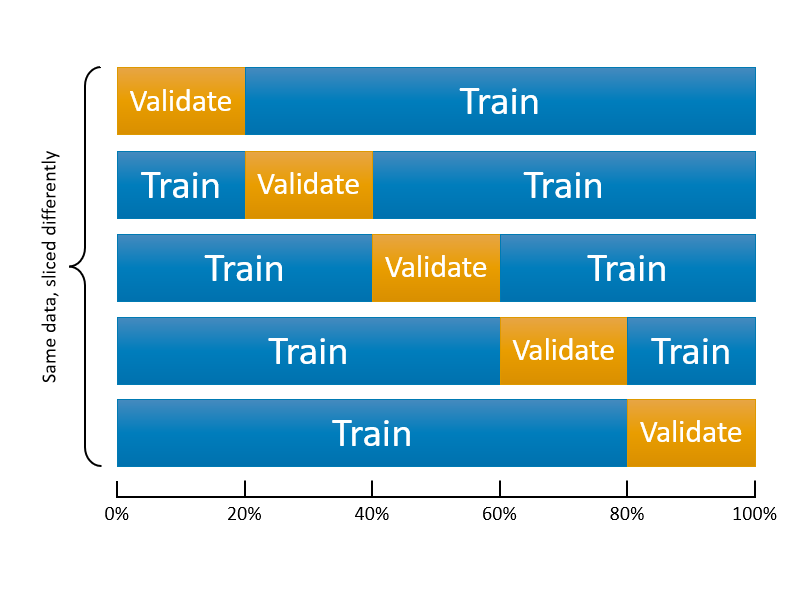
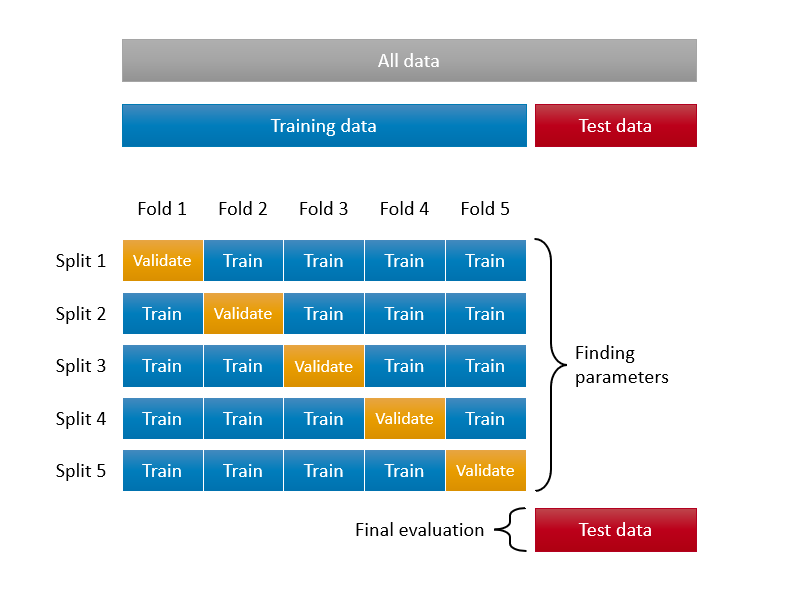
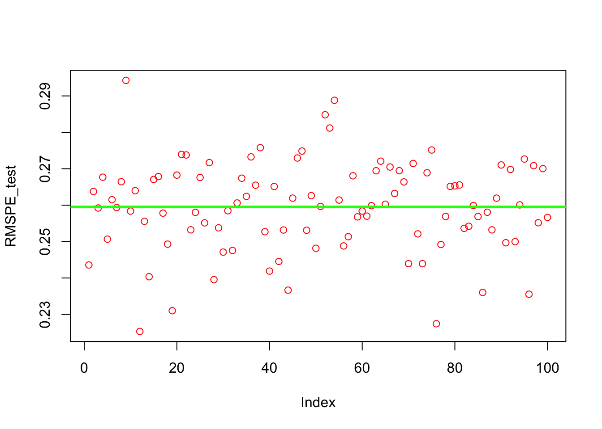
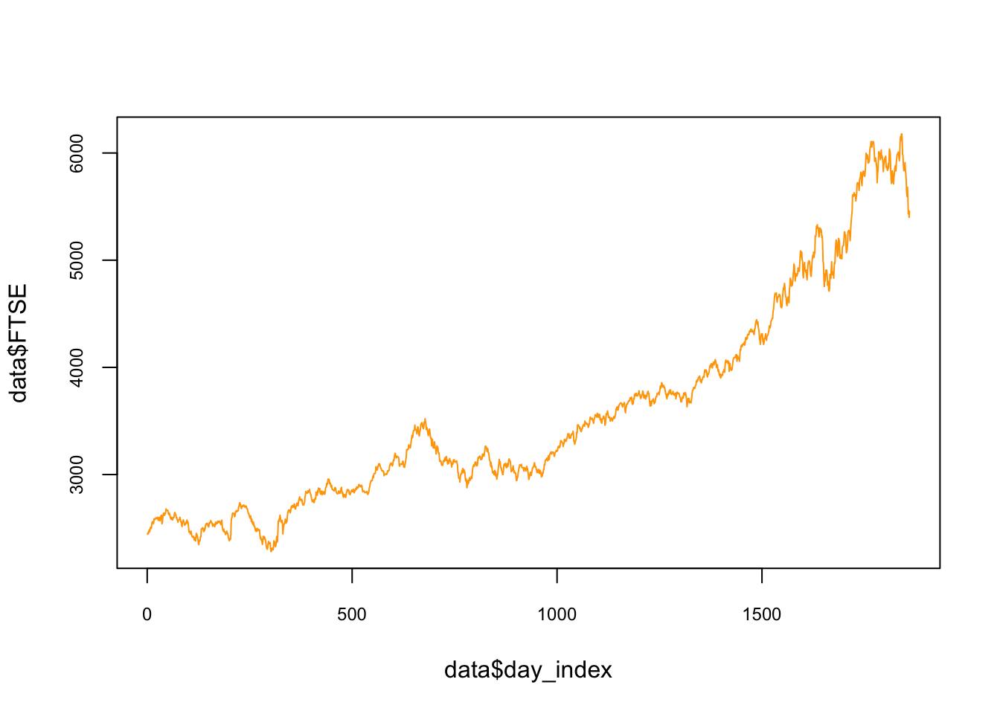

# (PART) Self-Learning {-}

# Hyperparameter Tuning 

In general, there are multiple **tuning** parameters or so-called **hyperparameters** associated with each prediction method. The value of the hyperparameter has to be set before the learning process begins as those tuning parameters are external to the model and their value cannot be estimated from data.
  
Therefore, we usually need to perform a grid search to identify the optimal combination of these parameters that minimizes the prediction error. For example, $k$ in kNN, the number of hidden layers in Neural Networks, even the degree of of polynomials in a linear regression have to be tuned before the learning process starts.  In contrast, a parameter (in parametric models) is an internal characteristic of the model and its value can be estimated from data for any given hyperparameter.  For example, $\lambda$, the penalty parameter that shrinks the number of variables in Lasso, which we will see in Section 6, is a hyperparameter and has to be set before the estimation.  When it's set, the coefficients of Lasso are estimated from the process. 

We start with **k-fold cross validation** process and perform a cross-validated grid search to identify the optimal mix of tuning parameters. We will learn the rules with simple applications about how to set up a grid search that evaluates many different combinations of hyperparameters.  This chapter covers the key concept in modern machine learning applications and many learning algorithms.

## Training, validation, and test datasets

Before learning how to split the data into subsections randomly, we need to know what these sets are for and how we define them properly.  This section is inspired by the article, [*What is the Difference Between Test and Validation Datasets?*](https://machinelearningmastery.com/difference-test-validation-datasets/), by Jason Brownlee [-@Brownlee_2017]. The article clarifies how validation and test datasets are different, which can be confusing in practice. 

Each machine learning model needs a training, which is a process of tuning their hyperparameters and selecting their features (variables) for the best predictive performance. Therefore, this process requires two different datasets: **training** and **validation** datasets. The intuition behind this split is very simple: the prediction is an out-of-sample problem.  If we use the same sample that we use to fit the model for assessing the prediction accuracy of our model, we face the infamous overfitting problem.  Since we usually don't have another unseen dataset available to us, we split the data and leave one part out of our original dataset.  We literally pretend that one that is left out is "unseen" by us.  Now the question is how we do this split.  Would it be 50-50?.  The general approach is k-fold cross validation with a grid search.  Here are the main steps:  
  
1. Suppose Model1 requires to pick a value for $\lambda$, perhaps it is a degree of polynomials in the model.  
2. We establish a grid, a set of sequential numbers, that is a set of possible values of $\lambda$.  
3. We split the data into $k$ random sections, let's say 10 proportionally equal sections. 
4. We leave one section out and use 9 sections.  The combination of these 9 sections is our **training set**. The one that is left out is our **validation set**.  
5. We fit the model using each value in the set of possible values of $\lambda$.  For example, if we have 100 values of $\lambda$, we fit the model to the training set 100 times, once for each possible value of $\lambda$. 
6. We evaluate each of 100 models by using their predictive accuracy on the validation set, the one that is left out. We pick a $\lambda$ that gives the highest prediction accuracy.  
7. We do this process 10 times (if it is 10-fold cross validation) with each time using a different section of the data as the validation set.  So, note that each time our training and validation sets are going to be different.  At the end, in total we will have 10 best $\lambda$s.    
8. We pick the average or modal value of $\lambda$ as our optimal hyperparameter that tunes our predictive model for its best performance.  
    
Note that the term *validation* is sometimes is mixed-up with *test* for the dataset we left out from our sample.  This point often confuses practitioners.  So what is the **test set**?  
  
We have now Model1 tuned with the optimal $\lambda$.  This is a model among several alternative models (there are more than 300 predictive models and growing in practice).  Besides, the steps above we followed provides a limited answer whether if Model1 has a good or "acceptable" prediction accuracy or not.  In other words, **tuning Model1 doesn't mean that it does a good or a bad job in prediction**.  How do we know and measure the **tuned model's** performance in prediction?
  
Usually, if the outcome that we try to predict is quantitative variable, we use root mean squared prediction error (RMSPE).  There are several other metrics that we will see later.  If it's an indicator outcome, we have to apply some other methods, one of which is called as Receiver Operating Curve (ROC).  We will see and learn all of them all in detail shortly.  But, for now, let's pretend that we know a metric that measures the prediction accuracy of Model1 as well as other alternative models.  

The only sensible way to do it would be to test the "tuned" model on a new dataset.  In other words, we need to use the trained model on a real and new dataset and calculate the prediction accuracy of Model1 by RMSPE or ROC.  Therefore, **we have to go back to the start and create a split before starting the training process: training and test datasets. We use the training data for the feature selection and tuning the parameter.**  After we "trained" the model by validation, we can use the **test set** to see the performance of the tuned model. 

Finally, you follow the same steps for other alternative learning algorithms and then pick the winner.  Having trained each model using the training set, and chosen the best model using the validation set, the test set tells you how good your final choice of model is. 

Here is a visualization of the split:


  
Before seeing every step with an application in this chapter, let's have a more intuitive and simpler explanation about "training" a model.  First, what's learning?  We can summarize it this way: **observe the facts, do some generalizations, use these generalizations to predict previously unseen facts, evaluate your predictions, and adjust your generalizations (knowledge) for better predictions**.  It's an infinite loop.

Here is the basic paradigm:

 - Observe the facts (**training data**),
 - Make generalizations (**build prediction models**), 
 - Adjust your prediction to make them better (**train your model with validation data**), 
 - Test your predictions on unseen data to see how they hold up (**test data**)

As the distinction between validation and test datasets is now clear, we can conclude that, even if we have the best possible predictive model given the training dataset, our generalization of the seen data for prediction of unseen facts would be fruitless in practice. In fact, we may learn nothing at the end of this process and remain unknowledgeable about the unseen facts.  
    
Why would this happen?  The main reason would be the lack of enough information in training set. If we do not have enough data to make and test models that are applicable to real life, our predictions may not be valid.  The second reason would be modeling inefficiencies in a sense that it requires a very large computing power and storage capacity.  This subject is also getting more interesting everyday.  The Google's quantum computers are one of them. 
 
## Splitting the data randomly

We already know how to sample a set of observation by using `sample()`.  We can use this function again to sort the data into k-fold sections.  Here is an example with just 2 sections:  


```r
#We can create a simple dataset with X and Y using a DGM
set.seed(2)
n <- 10000
x <- rnorm(n, 3, 6)
y <- 2 + 13*x + rnorm(n, 0, 1)
data <- data.frame(y, x)

#We need to shuffle it
random <- sample(n, n, replace = FALSE)
data <- data[random, ]

#The order of data is now completely random,
#we can divide it as many slices as we wish
k <- 2 #2-fold (slices-sections)
nslice <- floor(n/k) #number of observations in each fold/slice

#Since we have only 2 slices of data
#we can call one slice as a "validation set" the other one as a "training set"
train <- data[1:nslice, ]
str(train)
```

```
## 'data.frame':	5000 obs. of  2 variables:
##  $ y: num  -92.7 52.35 -114 133.6 7.39 ...
##  $ x: num  -7.344 3.868 -9.006 9.978 0.468 ...
```

```r
val <- data[(nslice+1):n,]
str(val)
```

```
## 'data.frame':	5000 obs. of  2 variables:
##  $ y: num  -49.1 -53.7 -25 -46.2 135.2 ...
##  $ x: num  -3.9 -4.22 -1.99 -3.67 10.37 ...
```

How can we use this method to *tune* a model?  Let's use Kernel regressions applied by `loess()` that we have seen before. Our validation and train sets are ready.  We are going to use the train set to train our models with different values of `span` in each one.  Then, we will validate each model by looking at the RMSPE of the model results against our validation set.  The winner will be the one with the lowest RMSPE.  That's the plan.  Let's use the set of `span` = 0.02, 0.1, and 1.


```r
#Estimation with degree = 2 (locally quadratic) by training set
loe0 <- loess(y ~ x,
              degree = 2,
              span = 0.02,
              data = train)
loe1 <- loess(y ~ x,
              degree = 2,
              span = 0.1,
              data = train)
loe2 <- loess(y ~ x,
              degree = 2,
              span = 1,
              data = train)

#Predicting by using validation set
fit0 <- predict(loe0, val$x)
fit1 <- predict(loe1, val$x)
fit2 <- predict(loe2, val$x)
```

We must also create our performance metric, RMSPE;  


```r
rmspe0 <- sqrt(mean((val$y-fit0)^2))
rmspe1 <- sqrt(mean((val$y-fit1)^2))
rmspe2 <- sqrt(mean((val$y-fit2)^2))

c(paste("With span = 0.02", "rmspe is ", rmspe0),
paste("With span = 0.1", "rmspe is ", rmspe1),
paste("With span = 1", "rmspe is ", rmspe2))
```

```
## [1] "With span = 0.02 rmspe is  1.01967570649964"
## [2] "With span = 0.1 rmspe is  1.00901093799357" 
## [3] "With span = 1 rmspe is  1.0056119864882"
```

We have several problems with this algorithm.  First, we only use three arbitrary values for `span`.  If we use 0.11, for example, we don't know if its RMSPE could be better or not.  Second, we only see the differences across RMSPE's by manually comparing them.  If we had tested for a large set of span values, this would have been difficult.  Third, we have used only one set of validation and training sets. If we do it multiple times, we may have different results and different rankings of the models.  How are we going to address these issues? 

Let's address this last issue, about using more than one set of training and validation sets, first:  

## k-fold cross validation

We can start with the following figure about k-fold cross-validation.  It shows 5-fold cross validation. It splits the data into k-folds, then trains the data on k-1 folds and validation on the one fold that was left out. Although, this type cross validation is the most common one, there are also several different cross validation methods, such as leave-one-out (LOOCV), leave-one-group-out, and time-series cross validation methods, which we will see later.  
  
    


This figure illustrates 5-k CV.  We need to create a loop that does the slicing 10 times.  If we repeat the same `loess()` example with 10-k cross validation, we will have 10 RMSPE's for each `span` value.  To evaluate which one is the lowest, we take the average of those 10 RSMPE's for each model.


```r
#Let's simulate our data
n = 10000
set.seed(1)
x <- sort(runif(n)*2*pi)
y <- sin(x) + rnorm(n)/4

data <- data.frame(y, x)

#Shuffle the order of observations by their index
mysample <- sample(n, n, replace = FALSE)

k <- 10 #10-k CV
nvalidate <- round(n / k)

RMSPE <- c() # we need an empty container to store RMSPE's

#loop
for (i in 1:k) {
  if (i < k) {
    ind_val <- mysample[((i - 1) * nvalidate + 1):(i * nvalidate)]
  } else{
    ind_val <- mysample[((i - 1) * nvalidate + 1):n]
  }
  
  cat("K-fold loop: ", i, "\r") # Counter, no need it in practice
  
  data_val <- data[ind_val, ]
  data_train <- data[-ind_val, ]
  
  model <- loess(
    y ~ x,
    control = loess.control(surface = "direct"),
    degree = 2,
    span = 0.1,
    data = data_train
  )
  
  fit <- predict(model, data_val$x)
  RMSPE[i] <- sqrt(mean((data_val$y - fit) ^ 2))
}
```

```
## K-fold loop:  1 
K-fold loop:  2 
K-fold loop:  3 
K-fold loop:  4 
K-fold loop:  5 
K-fold loop:  6 
K-fold loop:  7 
K-fold loop:  8 
K-fold loop:  9 
K-fold loop:  10 
```

```r
RMSPE
```

```
##  [1] 0.2427814 0.2469909 0.2387873 0.2472059 0.2489808 0.2510570 0.2553914
##  [8] 0.2517241 0.2521053 0.2429688
```

```r
mean(RMSPE)
```

```
## [1] 0.2477993
```

Note that `loess.control()` is used for the adjustment for $x$ that are outside of $x$ values used in training set.  How can we use this k-fold cross validation in selecting the best `span` for a range of possible values?

## Cross-validated grid search

The traditional way of performing hyperparameter optimization has been a **grid search**, or a **parameter sweep**, which is simply an *exhaustive search* through a manually specified subset of the hyperparameter space of a learning algorithm. This is how *grid search* is defined by Wikipedia.

Although we did not do a grid search, we have already completed the major process in the last example.  What we need to add is a hyperparameter grid and a search loop.  In each hyperparameter, we need to know the maximum and the minimum values of this subset.  For example, `span` in `loess()` sets the size of the neighborhood, which ranges between 0 to 1. This controls the degree of smoothing. So, the greater the value of span, smoother the fitted curve is.  

Additionally the `degree` argument in `loess()` is defined as *the degree of the polynomials to be used, normally 1 or 2. (Degree 0 is also allowed, but see the ‘Note’. in `?loess`)*. For each learning algorithm, the number of tuning parameters and their ranges will be different.  Before running any grid search, therefore, we need to understand their function and range.  
  

```r
#Using the same data with reduced size
n = 1000
set.seed(1)
x <- sort(runif(n) * 2 * pi)
y <- sin(x) + rnorm(n) / 4
data <- data.frame(y, x)

#Setting CV
ind <- sample(n, n, replace = FALSE)
k <- 10 #10-fold CV
nval <- round(n / k)

# Grid
grid <- expand.grid(seq(from = 0.01, to = 1, by = 0.02), c(1, 2))
head(grid)
```

```
##   Var1 Var2
## 1 0.01    1
## 2 0.03    1
## 3 0.05    1
## 4 0.07    1
## 5 0.09    1
## 6 0.11    1
```

```r
#loops
OPT <- c()

for (i in 1:k) {
  if (i < k) {
    ind_val <- ind[((i - 1) * nval + 1):(i * nval)]
  } else{
    ind_val <- ind[((i - 1) * nval + 1):n]
  }
  
  data_val <- data[ind_val, ]
  data_train <- data[-ind_val, ]
  
  #we need a vector to store RMSPE of each row in the grid
  RMSPE <- c()
  
  #we need to have another loop running each row in grid:
  for (s in 1:nrow(grid)) {
    model <- loess(
      y ~ x,
      control = loess.control(surface = "direct"),
      degree = grid[s, 2],
      span = grid[s, 1],
      data = data_train
    )
    
    fit <- predict(model, data_val$x)
    RMSPE[s] <- sqrt(mean((data_val$y - fit) ^ 2))
  }
  OPT[i] <- which(RMSPE == min(RMSPE), arr.ind = TRUE)
}
opgrid <- grid[OPT, ]
colnames(opgrid) <- c("span", "degree")
rownames(opgrid) <- c(1:10)
opgrid
```

```
##    span degree
## 1  0.09      2
## 2  0.63      2
## 3  0.23      2
## 4  0.03      2
## 5  0.33      2
## 6  0.59      2
## 7  0.75      2
## 8  0.57      2
## 9  0.25      1
## 10 0.21      1
```

These results are good but how are we going to pick one set, the coordinates of the optimal `span` and `degree`?  It seems that most folds agree that we should use `degree` = 2, but which `span` value is the optimal?  If the hyperparameter is a discrete value, we can use majority rule with the modal value, which is just the highest number of occurrences in the set. 
  
This would be appropriate for `degree` but not for `span`. We may use the mean of all 10 optimal `span` values, each of which is calculated from each fold.  This would be also a problem because the range of selected span is from 0.09 to 0.75 and we have only 10 span values.  One solution would be to run the same algorithm multiple times so that we can have a better base for averaging the selected `spans`.  

Before running the same algorithm multiple times, however, remember, we used the whole sample to tune our hyperparameters.  At the outset, we said that this type of application should be avoided.  Therefore, we need to create a test set and put a side for reporting accuracy of tuned models.  Here is an illustration about this process:



Let's do it:  


```r
# Using the same data
n = 1000
set.seed(1)
x <- sort(runif(n) * 2 * pi)
y <- sin(x) + rnorm(n) / 4
data <- data.frame(y, x)

# Grid
grid <- expand.grid(seq(from = 0.01, to = 1, by = 0.02), c(1, 2))

# Train - Test Split
set.seed(321)
sh_ind <- sample(nrow(data), 0.20 * nrow(data), replace = FALSE)
testset <- data[sh_ind,] #20% of data set a side
trainset <- data[-sh_ind, ]

# k-CV, which is the same as before
set.seed(3)
ind <- sample(nrow(trainset), nrow(trainset), replace = FALSE)
k = 10
nval <- round(nrow(trainset)  / k)

# CV loop
OPT <- c()

for (i in 1:k) {
  if (i < k) {
    ind_val <- ind[((i - 1) * nval + 1):(i * nval)]
  } else{
    ind_val <- ind[((i - 1) * nval + 1):length(ind)]
  }
  
  data_val <- trainset[ind_val, ]
  data_train <- trainset[-ind_val, ]
  
  RMSPE <- c()
  
  for (s in 1:nrow(grid)) {
    model <- loess(
      y ~ x,
      control = loess.control(surface = "direct"),
      degree = grid[s, 2],
      span = grid[s, 1],
      data = data_train
    )
    
    fit <- predict(model, data_val$x)
    RMSPE[s] <- sqrt(mean((data_val$y - fit) ^ 2))
  }
  OPT[i] <- which.min(RMSPE)
}

# Hyperparameters
opgrid <- grid[OPT, ]
colnames(opgrid) <- c("span", "degree")
rownames(opgrid) <- c(1:10)
opt_degree <- raster::modal(opgrid[, 2])
opt_degree
```

```
## [1] 2
```

```r
opt_span <- mean(opgrid[, 1])
opt_span
```

```
## [1] 0.358
```

```r
# **** Using the test set for final evaluation ******
model <- loess(
  y ~ x,
  control = loess.control(surface = "direct"),
  degree = opt_degree,
  span = opt_span,
  data = trainset
)

fit <- predict(model, testset$x)
RMSPE_test <- sqrt(mean((testset$y - fit) ^ 2))
RMSPE_test
```

```
## [1] 0.2598607
```

What we have built is an algorithm that **learns** by trial-and-error.  However, we need one more step to finalize this process: instead of doing only one 90%-10% train split, we need to do it multiple times and use the average `RMSPE_test` and the uncertainty (its variation) associated with it as our final performance metrics.  Here again:


```r
#Using the same data
n = 1000
set.seed(1)
x <- sort(runif(n) * 2 * pi)
y <- sin(x) + rnorm(n) / 4
data <- data.frame(y, x)

# Grid
grid <- expand.grid(seq(from = 0.01, to = 1, by = 0.02), c(1, 2))

t = 100 # number of times we loop
RMSPE_test <- c() # container for 100 RMSPE's

for (l in 1:t) {
  
  # Training-test split
  set.seed(10 + l)
  sh_ind <- sample(nrow(data), 0.20 * nrow(data), replace = FALSE)
  testset <- data[sh_ind, ] #20% of data set a side
  trainset <- data[-sh_ind,]
  
  # k-CV, which is the same as before
  set.seed(100+l)
  ind <- sample(nrow(trainset), nrow(trainset), replace = FALSE)
  k = 10
  nval <- round(nrow(trainset)  / k)
  
  # CV loop
  OPT <- c()
  
  for (i in 1:k) {
    if (i < k) {
      ind_val <- ind[((i - 1) * nval + 1):(i * nval)]
    } else{
      ind_val <- ind[((i - 1) * nval + 1):length(ind)]
    }
    
    data_val <- trainset[ind_val,]
    data_train <- trainset[-ind_val,]
    
    RMSPE <- c()
    
    for (s in 1:nrow(grid)) {
      model <- loess(
        y ~ x,
        control = loess.control(surface = "direct"),
        degree = grid[s, 2],
        span = grid[s, 1],
        data = data_train
      )
      
      fit <- predict(model, data_val$x)
      RMSPE[s] <- sqrt(mean((data_val$y - fit) ^ 2))
    }
    OPT[i] <- which.min(RMSPE)
  }
  
  # Hyperparameters
  opgrid <- grid[OPT, ]
  colnames(opgrid) <- c("span", "degree")
  rownames(opgrid) <- c(1:10)
  opt_degree <- raster::modal(opgrid[, 2])
  opt_span <- mean(opgrid[, 1])
  
  # **** Using the test set for final evaluation ******
  model <- loess(
    y ~ x,
    control = loess.control(surface = "direct"),
    degree = opt_degree,
    span = opt_span,
    data = trainset
  )
  fit <- predict(model, testset$x)
  RMSPE_test[l] <- sqrt(mean((testset$y - fit) ^ 2))
}  
```

We can now see the average RMSPE and its variance:


```r
plot(RMSPE_test, col = "red")
abline(a = mean(RMSPE_test),
       b = 0,
       col = "green",
       lwd = 3)
```



```r
mean(RMSPE_test)
```

```
## [1] 0.2595155
```

```r
var(RMSPE_test)
```

```
## [1] 0.0001542721
```

## Bootstrapped grid search

Similar to cross-validation, the bootstrapping is another and a powerful resampling method that randomly samples from the original data with replacement to create multiple new datasets (also known as "bootstrap samples"). Due to the drawing with replacement, a bootstrap sample may contain multiple instances of the same original cases, and may completely omit other original cases.  Although the primary use of bootstrapping is to obtain standard errors of an estimate, we can put these omitted original cases in a sample and form a hold-out set, which is also called as out-of-bag observations (OOB).  On average, the split between training and OOB samples is around 65\%-35\%.  Here is a simple application to show the split:


```r
x_train <- unique(sample(1000, 1000, replace = TRUE))
length(x_train)/1000 # % of observation in training set
```

```
## [1] 0.619
```

```r
1 - length(x_train)/1000 # % of observations in OOB
```

```
## [1] 0.381
```

We will have many grid-search applications with bootstrapping in the following chapters.  Let's have our first application with same example.


```r
#Using the same data
n = 1000
set.seed(1)
x <- sort(runif(n) * 2 * pi)
y <- sin(x) + rnorm(n) / 4
data <- data.frame(y, x)

# Grid
grid <- expand.grid(seq(from = 0.01, to = 1, by = 0.02), c(1, 2))

t = 100 # number of times we loop
RMSPE_test <- c() # container for 100 RMSPE's

for (l in 1:t) {
  
  # Training-test split
  set.seed(10 + l)
  sh_ind <- sample(nrow(data), 0.20 * nrow(data), replace = FALSE)
  testset <- data[sh_ind, ] #20% of data set a side
  trainset <- data[-sh_ind,]
  
  # OOB loops
  OPT <- c()
  
  for (i in 1:10) {
    ind <- unique(sample(nrow(trainset), nrow(trainset), replace = TRUE))
    data_val <- trainset[-ind, ] # OOB
    data_train <- trainset[ind, ]
    
    RMSPE <- c()
    
    for (s in 1:nrow(grid)) {
      model <- loess(
        y ~ x,
        control = loess.control(surface = "direct"),
        degree = grid[s, 2],
        span = grid[s, 1],
        data = data_train
      )
      
      fit <- predict(model, data_val$x)
      RMSPE[s] <- sqrt(mean((data_val$y - fit) ^ 2))
    }
    OPT[i] <- which.min(RMSPE)
  }
  
  # Hyperparameters
  opgrid <- grid[OPT, ]
  colnames(opgrid) <- c("span", "degree")
  rownames(opgrid) <- c(1:10)
  opt_degree <- raster::modal(opgrid[, 2])
  opt_span <- mean(opgrid[, 1])
  
  #Test - RMSPE
  model <- loess(
    y ~ x,
    control = loess.control(surface = "direct"),
    degree = opt_degree,
    span = opt_span,
    data = trainset
  )
  fit <- predict(model, testset$x)
  RMSPE_test[l] <- sqrt(mean((testset$y - fit) ^ 2))
}  
```

We can now see the average RMSPE and its variance:


```r
plot(RMSPE_test, col = "red")
abline(a = mean(RMSPE_test),
       b = 0,
       col = "green",
       lwd = 3)
```


```r
mean(RMSPE_test)
```

```
## [1] 0.259672
```

```r
var(RMSPE_test)
```

```
## [1] 0.0001514393
```

Finally, we can change the order of loops:


```r
#Using the same data
n = 1000
set.seed(1)
x <- sort(runif(n) * 2 * pi)
y <- sin(x) + rnorm(n) / 4
data <- data.frame(y, x)

# Grid
grid <- expand.grid(seq(from = 0.01, to = 1, by = 0.02), c(1, 2))

t = 100 # number of times we loop
RMSPE_test <- c() # container for 100 RMSPE's

for (l in 1:t) {
  # Training-test split
  set.seed(10 + l)
  sh_ind <- sample(nrow(data), 0.20 * nrow(data), replace = FALSE)
  testset <- data[sh_ind,] #20% of data set a side
  trainset <- data[-sh_ind, ]
  
  OPT <- c()
  
  # Grid loop
  for (s in 1:nrow(grid)) {
    RMSPE <- c()
    
    # OOB loops
    for (i in 1:10) {
      set.seed(i + 100)
      ind <-
        unique(sample(nrow(trainset), nrow(trainset), replace = TRUE))
      data_val <- trainset[-ind,] # OOB
      data_train <- trainset[ind,]
      
      model <- loess(
        y ~ x,
        control = loess.control(surface = "direct"),
        degree = grid[s, 2],
        span = grid[s, 1],
        data = data_train
      )
      
      fit <- predict(model, data_val$x)
      RMSPE[i] <- sqrt(mean((data_val$y - fit) ^ 2))
    }
    OPT[s] <- mean(RMSPE)
  }
  
  # Test RMSPE
  opgrid <- grid[which.min(OPT),]
  model <- loess(
    y ~ x,
    control = loess.control(surface = "direct"),
    degree = opgrid[, 2],
    span = opgrid[, 1],
    data = trainset
  )
  fit <- predict(model, testset$x)
  RMSPE_test[l] <- sqrt(mean((testset$y - fit) ^ 2))
}  
```

We can now see the average RMSPE and its variance:


```r
plot(RMSPE_test, col = "red")
abline(a = mean(RMSPE_test),
       b = 0,
       col = "green",
       lwd = 3)
```


```r
mean(RMSPE_test)
```

```
## [1] 0.2593541
```

```r
var(RMSPE_test)
```

```
## [1] 0.0001504046
```
  
The results are similar but the code is cleaner. What happens when the data is time-series?

## When the data is time-series

While we have a dedicated section (Section VII) on forecasting with times series data, we will complete this chapter by looking at the fundamental differences between time-series and cross-sectional in terms of grid search.     

We will use the `EuStockMarkets` data set pre-loaded in R. The data contains the daily closing prices of major European stock indices: Germany DAX (Ibis), Switzerland SMI, France CAC, and UK FTSE. The data are sampled in business time, i.e., weekends and holidays are omitted. We will focus on the FTSE. Below, the data and its plot:  


```r
#Data
data <- as.data.frame(EuStockMarkets)
day_index <- seq(1, nrow(data), by = 1)
data <- cbind(data, day_index)
head(data)
```

```
##       DAX    SMI    CAC   FTSE day_index
## 1 1628.75 1678.1 1772.8 2443.6         1
## 2 1613.63 1688.5 1750.5 2460.2         2
## 3 1606.51 1678.6 1718.0 2448.2         3
## 4 1621.04 1684.1 1708.1 2470.4         4
## 5 1618.16 1686.6 1723.1 2484.7         5
## 6 1610.61 1671.6 1714.3 2466.8         6
```

```r
plot(
  data$day_index,
  data$FTSE,
  col = "orange",
  cex.main = 0.80,
  cex.axis = 0.75,
  type = "l"
)
```



We can use smoothing methods to detect trends in the presence of noisy data especially in cases where the shape of the trend is unknown.  A decomposition would show the components of the data: trend, seasonal fluctuations, and the noise, which  is **unpredictable** and remainder of after the trend (and seasonality) is removed  Here is an illustration for the FTSE with additive decomposition:  


```r
tsd <- EuStockMarkets
dctsd <- decompose(tsd[, 4])
plot(dctsd, col = "red")
```


  
Separating the trend from the noise will enable us to predict the future values better.  Having learnt how to model a learning algorithm, we can also train `loess()` to extract the trend in FTSE.  Several smoothing lines are illustrated below to visualize the differences:   


```r
plot(
  data$day_index,
  data$FTSE,
  type = "l",
  col = "red",
  cex.main = 0.80,
  cex.axis = 0.75,
  lwd = 2
)
lines(data$day_index,  
      predict(lm(FTSE ~ day_index, data)), lwd = 1, col = "green")
lines(data$day_index,
      predict(loess(
        data$FTSE ~ data$day_index, degree = 1, span = 0.01
      )),
      lwd = 2,
      col = "grey")
lines(data$day_index,
      predict(loess(
        data$FTSE ~ data$day_index, degree = 1, span = 0.1
      )),
      lwd = 2,
      col = "blue")
lines(data$day_index,
      predict(loess(
        data$FTSE ~ data$day_index, degree = 1, span = 0.9
      )),
      lwd = 2,
      col = "yellow")
```


  
It seems that a linear trend is not appropriate as it underfits to predict. Although a smoothing method like `loess()` would be a good choice, but which `loess()` would be a good fit?  One way of validating time series data is to keep the time order in the data when we use k-fold cross validation so that in each fold the training data takes place before the test data.
  
This type of cross validation is called as **h-step-ahead rolling cross-validation**. (There is also a method called as **sliding-window-cross-validation**). Below we can see an illustration of this kind of cross validation:


We are going to split the data without a random shuffle: 


```r
span <- seq(from = 0.05, to = 1, by = 0.05) 

# *****h-step-rolling-CV********
h <- 10
opt <- c()

#CV loop
nvalid <- round(nrow(data) / h)

#This gives the 10 cutoff points in rows
cut <- c(1)
for (j in 1:h) {
  cut <- c(cut, nvalid * j)
}

for (i in 1:h) {
  if (i < h) {
    train <- data[(cut[1]:cut[i + 1]),]
  } else{
    train <- data[cut[1]:cut[i],]
  }
  if (i + 2 < h)
    valid <- data[(cut[i + 1]:cut[i + 2]),]
  
  RMSPE <- c(rep(0), length(span)) #Matrix to store RMSPE
  
  for (s in 1:length(span)) {
    model <-
      loess(
        FTSE ~ day_index,
        control = loess.control(surface = "direct"),
        degree = 2,
        span = span[s],
        data = train
      )
    fit <- predict(model, valid$day_index)
    RMSPE[s] <- sqrt(mean((valid$FTSE - fit) ^ 2))
  }
  opt[i] <- which(RMSPE == min(RMSPE), arr.ind = TRUE)
}

#Hyperparameters
opt_span <- mean(span[opt])
opt_span
```

```
## [1] 0.43
```

```r
plot(
  data$day_index,
  data$FTSE,
  type = "l",
  col = "gray",
  cex.main = 0.80,
  cex.axis = 0.75
)
lines(data$day_index,
      predict(loess(
        data$FTSE ~ data$day_index,
        degree = 2, span = opt_span
      )),
      lwd = 2,
      col = "red")
```


Note that we did not start this algorithm with the initial split for testing.  For the full train-validate-test routine the initial split has to be added into this cross-validation script.
  
Moreover, we started the validation after the first 10\% split.  We can also decide on this starting point.  For example, we can change the code and decide to train the model after 30\% training set.  That flexibility is specially important if we apply **Day Forward-Chaining Nested Cross-Validation**, which is the same method but *rolling windows* are the days. The following figure helps demonstrate this method: 


Although it is designed for a day-chained cross validation, we can replace *days* with weeks, months or 21-day windows.  In fact, our algorithm that uses 10\% splits can be considered a **10\% Split Forward-Chaining Nested Cross-Validation**.  We will see multiple applications with special methods unique to time series data in Section VII.  

## Speed
  
Before concluding this section, notice that as the sample size rises, the learning algorithms take longer to complete, specially for cross sectional data.  That's why there are some other cross-validation methods that use only a subsample randomly selected from the original sample to speed up the validation and the test procedures. You can think how slow the conventional cross validation would be if the dataset has 1-2 million observations, for example.

There are some methods to accelerate the training process.  One method is to increase the delta (the increments) in our grid and identify the range of hyperparameters where the RMSPE becomes the lowest.  Then we reshape our grid with finer increments targeting that specific range.
  
Another method is called a random grid search.  In this method, instead of the exhaustive enumeration of all combinations of hyperparameters, we select them randomly.  This can be found in [Random Search for Hyper-Parameter Optimization](https://jmlr.csail.mit.edu/papers/volume13/bergstra12a/bergstra12a.pdf) by James Bergstra and
Yoshua Bengio [-@Berg_2012].  
  
To accelerate the grid search, we can also use parallel processing so that each loop will be assigned to a separate core in capable computers.  We will see several application using these options later in the book.  Both methods are covered in Chapter 14.
  
Finally, we did not use functions in our algorithms.  We should create functions for each major process in algorithms and compile them in one clean "source" script.


