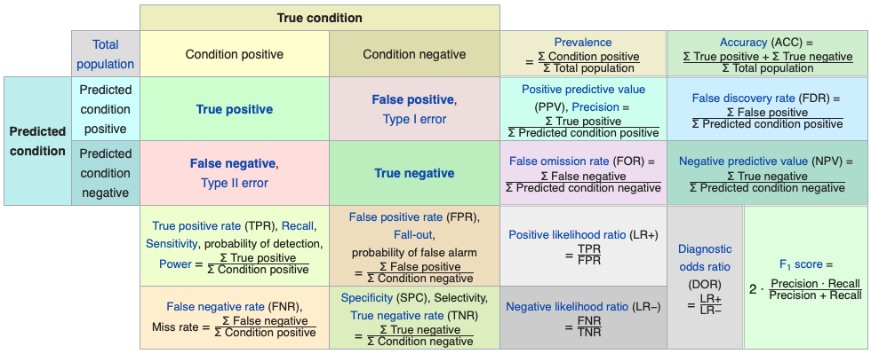
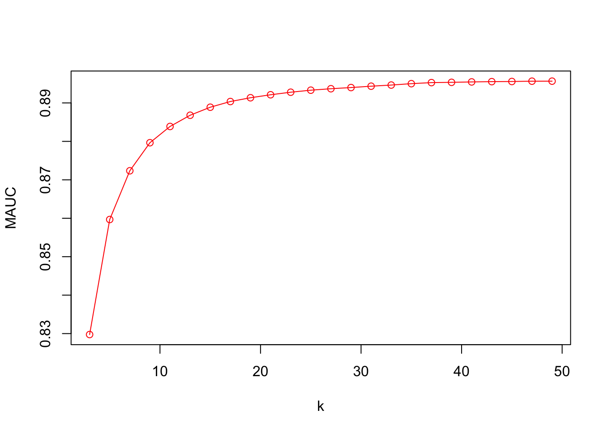

# Tuning in Classification

What metrics are we going to use when we *train* our classification models?  In kNN, for example, our hyperparameter is $k$, the number of observations in each bin.  In our applications with `mnist_27` and `Adult` datasets, $k$ was determined by a metric called as **accuracy**.  What is it? If the choice of $k$ depends on what metrics we use in tuning, can we improve our prediction performance by using a different metric?  Moreover, the accuracy is calculated from the confusion table.  Yet, the confusion table will be different for a range of discriminating thresholds used for labeling predicted probabilities.  These are important questions in classification problems. We will begin answering them in this chapter.

## Confusion matrix

In general, whether it is for training or not, measuring the performance of a classification model is an important issue and has to be well understood before fitting or training a model.  

To evaluate a model's fit, we can look at its predictive accuracy. In classification problems, this requires predicting $Y$, as either 0 or 1, from the predicted value of $p(x)$, such as    

$$
\hat{Y}=\left\{\begin{array}{ll}{1,} & {\hat{p}\left(x_{1}, \ldots, x_{k}\right)>\frac{1}{2}} \\ {0,} & {\hat{p}\left(x_{1}, \ldots, x_{k}\right)<\frac{1}{2}}\end{array}\right.
$$
  
From this transformation of $\hat{p}(x)$ to $\hat{Y}$, the overall predictive accuracy can be summarized with a matrix,  

$$
\begin{array}{ccc}{\text { Predicted vs. Reality}} & {Y=1} & {Y=0} \\ {\hat{Y}=1} & {\text { TP }_{}} & {\text { FP }_{}} \\ {\hat{Y}=0} & {\text { FN }_{}} & {\text { TN }_{}}\end{array}
$$
  
where, TP, FP, FN, TN are True positives, False Positives, False Negatives, and True Negatives, respectively.  This table is also know as **Confusion Table** or confusion matrix. The name, *confusion*, is very intuitive because it is easy to see how the system is **confusing** two classes.
  
There are many metrics that can be calculated from this table.  Let's use an example given in  [Wikipedia](https://en.wikipedia.org/wiki/Confusion_matrix)

$$
\begin{array}{ccc}{\text { Predicted vs. Reality}} & {{Y}=Cat} & {{Y}=Dog} \\ {\hat{Y}=Cat} & {\text { 5 }_{}} & {\text { 2 }_{}} \\ {\hat{Y}=Dog} & {\text { 3 }_{}} & {\text { 3 }_{}}\end{array}
$$
  
According to this confusion matrix, there are 8 actual cats and 5 actual dogs (column totals). The learning algorithm, however, predicts only 5 cats and 3 dogs correctly. The model predicts 3 cats as dogs and 2 dogs as cats. All correct predictions are located in the diagonal of the table, so it is easy to visually inspect the table for prediction errors, as they will be represented by values outside the diagonal.  

In predictive analytics, this table (matrix) allows more detailed analysis than mere proportion of correct classifications (accuracy). **Accuracy** ($(TP+TN)/n$) is not a reliable metric for the real performance of a classifier, when the dataset is unbalanced in terms of numbers of observations in each class.  
  
It can be seen how misleading the use of $(TP+TN)/n$ could be, if there were 95 cats and only 5 dogs in our example.  If we choose *accuracy* as the performance measure in our training,  our learning algorithm might classify all the observations as cats, because the overall accuracy would be 95%.  In that case, however, all the dog would be misclassified as cats.

## Performance measures

Which metrics should we be using in training our classification models?  These questions are more important when the classes are not in balance.  Moreover, in some situation, false predictions would be more important then true predictions.  In a situation that you try to predict, for example, cancer, minimizing false negatives (the model misses cancer patients) would be more important than minimizing false positives (the model wrongly predicts cancer).  When we have an algorithm to predict spam emails, however, false positives would be the target to minimize rather than false negatives.  

Here is the full picture of various metrics using the same confusion table from [Wikipedia](https://en.wikipedia.org/wiki/Evaluation_of_binary_classifiers): 



Let's summarize some of the metrics and their use with examples for detecting cancer:  
  
- **Accuracy**: the number of correct predictions (with and without cancer) relative to the number of observations (patients). This can be used when the classes are balanced with not less than a 60-40% split. $(TP+TN)/n$.  
- **Balanced Accuracy**: when the class balance is worse than 60-40% split, $(TP/P + TN/N)/2$.  
- **Precision**: the percentage positive predictions that are correct.  That is, the proportion of patients that we predict as having cancer, actually have cancer, $TP/(TP+FP)$.  
- **Sensitivity**: the percentage of positives that are predicted correctly.  That is, the proportion of patients that actually have cancer was correctly predicted by the algorithm as having cancer, $TP/(TP+FN)$.  This measure is also called as *True Positive Rate* or as *Recall*. 
- **Specificity**:  the percentage of negatives that are predicted correctly.  Proportion of patients that do not have cancer, are predicted by the model as non-cancerous,  This measure is also called as *True Positive Rate* = $TN/(TN+FP)$.  

Here is the summary:  

$$
\begin{array}{ccc}{\text { Predicted vs. Reality}} & {{Y}=Cat} & {{Y}=Dog} \\ {\hat{Y}=Cat} & {\text {TPR or Sensitivity }_{}} & {\text { FNR or Fall-out }_{}} \\ {\hat{Y}=Dog} & {\text { FNR or Miss Rate }_{}} & {\text { TNR or Specificity }_{}}\end{array}
$$

**Kappa** is also calculated in most cases. It is an interesting measure because it compares the actual performance of prediction with what it would be if a random prediction was carried out. For example, suppose that your model predicts $Y$ with 95% accuracy. How good your prediction power would be if a random choice would also predict 70% of $Y$s correctly? Let's use an example:   

$$
\begin{array}{ccc}{\text { Predicted vs. Reality}} & {{Y}=Cat} & {{Y}=Dog} \\ {\hat{Y}=Cat} & {\text { 22 }_{}} & {\text { 9 }_{}} \\ {\hat{Y}=Dog} & {\text { 7 }_{}} & {\text { 13 }_{}}\end{array}
$$
  
In this case the accuracy is $(22+13)/51 = 0.69$  But how much of it is due the model's performance itself?  In other words, the distribution of cats and dogs can also give a predictive clue such that a certain level of prediction accuracy can be achieved by chance without any learning algorithm.  For the TP cell in the table, this can be calculated as the difference between observed accuracy (OA) and expected accuracy (EA), 

$$
\mathrm{(OA-EA)_{TP}}=\mathrm{Pr}(\hat{Y}=Cat)[\mathrm{Pr}(Y=Cat |\hat{Y}= Cat)-\mathrm{P}(Y=Cat)],
$$
  
Remember from your statistics class, if the two variables are independent, the conditional probability of $X$ given $Y$ has to be equal to the marginal probability of $X$.  Therefore, inside the brackets, the difference between the conditional probability, which reflects the probability of predicting cats due to the model, and the marginal probability of observing actual cats reflects the *true* level of predictive power of the model by removing the randomness in prediction.   

$$
\mathrm{(OA-EA)_{TN}}=\mathrm{Pr}(\hat{Y}=Dog)[\mathrm{Pr}(Y=Dog |\hat{Y}= Dog)-\mathrm{P}(Y=Dog)],
$$
  
If we use the joint and marginal probability definitions, these can be written as:  

$$
OA-EA=\frac{m_{i j}}{n}-\frac{m_{i} m_{j}}{n^{2}}
$$
  
Here is the calculation of **Kappa** for our example:  

Total, $n = 51$,  
$OA-EA$ for $TP$ = $22/51-31 \times (29/51^2) = 0.0857$  
$OA-EA$ for $TN$ = $13/51-20 \times (21/51^2) = 0.0934$  
  
And we normalize it by $1-EA = 1- 31 \times (29/51^2) + 20 \times (21/51^2) = 0.51$, which is the value if the prediction was 100% successful.

Hence, **Kappa**:  $(0.0857+0.0934) / (1 - 0.51) = 0.3655$  
  
Finally, **Jouden's J statistics** also as known as **Youden's index** or **Informedness**, is a single statistics that captures the performance of prediction. It's simply $J=TPR+TNR-1$ and ranges between 0 and 1 indicating useless and perfect prediction performance, respectively.  This metric is also related to **Receiver Operating Curve (ROC)** analysis, which is the subject of next section.

## ROC - Reciever Operating Curve

Our outcome variable is categorical ($Y = 1$ or $0$). Most classification algorithms calculate the predicted probability of success ($Y = 1$). If the probability is larger than a fixed cut-off threshold (discriminating threshold), then we assume that the model predicts success (Y = 1); otherwise, we assume that it predicts failure. As a result of such a procedure, the comparison of the observed and predicted values summarized in a confusion table depends on the threshold. The predictive accuracy of a model as a function of threshold can be summarized by Area Under Curve (AUC) of Receiver Operating Characteristics (ROC). The ROC curve, which is is a graphical plot that illustrates the diagnostic ability of a binary classifier, indicates a trade-off between True Positive Rate (TPR) and False Positive Rate (FPR). Hence, the success of a model comes with its predictions that increases TPR without raising FPR.  The ROC curve was first used during World War II for the analysis of radar signals before it was employed in signal detection theory.

Here is a visualization:
  

  
Let's start with an example, where we have 100 individuals, 50 with $y_i=1$ and 50 with $y_i=0$, which is well-balanced.  If we use a discriminating threshold (0\%) that puts everybody into Category 1 or a threshold (100\%) that puts everybody into Category 2, that is,

$$
\hat{Y}=\left\{\begin{array}{ll}{1,} & {\hat{p}\left(x_{1}, \ldots, x_{k}\right)>0 \%} \\ {0,} & {\hat{p}\left(x_{1}, \ldots, x_{k}\right)\leq0 \%}\end{array}\right.
$$
  
and,  

$$
\hat{Y}=\left\{\begin{array}{ll}{1,} & {\hat{p}\left(x_{1}, \ldots, x_{k}\right)>100 \%} \\ {0,} & {\hat{p}\left(x_{1}, \ldots, x_{k}\right)\leq100 \%}\end{array}\right.
$$

this would have led to the following confusing tables, respectively: 

$$
\begin{array}{ccc}{\text { Predicted vs. Reality}} & {{Y}=1} & {{Y}=0} \\ {\hat{Y}=1} & {\text { 50 }_{}} & {\text { 50 }_{}} \\ {\hat{Y}=0} & {\text { 0 }_{}} & {\text { 0 }_{}}\end{array}
$$
$$
\begin{array}{ccc}{\text { Predicted vs. Reality}} & {{Y}=1} & {{Y}=0} \\ {\hat{Y}=1} & {\text { 0 }_{}} & {\text { 0 }_{}} \\ {\hat{Y}=0} & {\text { 50 }_{}} & {\text { 50 }_{}}\end{array}
$$
  
In the first case, $TPR = 1$ and $FPR = 1$; and in the second case, $TPR = 0$ and $FPR = 0$.  So when we calculate all possible confusion tables with different values of thresholds ranging from 0\% to 100\%, we will have the same number of ($TPR, FPR$) points each corresponding to one threshold.  **The ROC curve is the curve that connects these points**.

Let's use an example with the *Boston Housing Market* dataset to illustrate ROC:  


```r
library(MASS)
data(Boston)

# Create our binary outcome
data <- Boston[, -14] #Dropping "medv"
data$dummy <- c(ifelse(Boston$medv > 25, 1, 0))

# Use logistic regression for classification
model <- glm(dummy ~ ., data = data, family = "binomial")
summary(model)
```

```
## 
## Call:
## glm(formula = dummy ~ ., family = "binomial", data = data)
## 
## Deviance Residuals: 
##     Min       1Q   Median       3Q      Max  
## -3.3498  -0.2806  -0.0932  -0.0006   3.3781  
## 
## Coefficients:
##              Estimate Std. Error z value Pr(>|z|)    
## (Intercept)  5.312511   4.876070   1.090 0.275930    
## crim        -0.011101   0.045322  -0.245 0.806503    
## zn           0.010917   0.010834   1.008 0.313626    
## indus       -0.110452   0.058740  -1.880 0.060060 .  
## chas         0.966337   0.808960   1.195 0.232266    
## nox         -6.844521   4.483514  -1.527 0.126861    
## rm           1.886872   0.452692   4.168 3.07e-05 ***
## age          0.003491   0.011133   0.314 0.753853    
## dis         -0.589016   0.164013  -3.591 0.000329 ***
## rad          0.318042   0.082623   3.849 0.000118 ***
## tax         -0.010826   0.004036  -2.682 0.007314 ** 
## ptratio     -0.353017   0.122259  -2.887 0.003884 ** 
## black       -0.002264   0.003826  -0.592 0.554105    
## lstat       -0.367355   0.073020  -5.031 4.88e-07 ***
## ---
## Signif. codes:  0 '***' 0.001 '**' 0.01 '*' 0.05 '.' 0.1 ' ' 1
## 
## (Dispersion parameter for binomial family taken to be 1)
## 
##     Null deviance: 563.52  on 505  degrees of freedom
## Residual deviance: 209.11  on 492  degrees of freedom
## AIC: 237.11
## 
## Number of Fisher Scoring iterations: 7
```
 
And our prediction (in-sample):


```r
# Classified Y's by TRUE and FALSE
yHat <- model$fitted.values > 0.5
conf_table <- table(yHat, data$dummy)

#let's change the order of cells
ctt <- as.matrix(conf_table)
ct <- matrix(0, 2, 2)
ct[1,1] <- ctt[2,2]
ct[2,2] <- ctt[1,1]
ct[1,2] <- ctt[2,1]
ct[2,1] <- ctt[1,2]

rownames(ct) <- c("Yhat = 1", "Yhat = 0")
colnames(ct) <- c("Y = 1", "Y = 0")
ct
```

```
##          Y = 1 Y = 0
## Yhat = 1   100    16
## Yhat = 0    24   366
```

It would be much easier if we create our own function to rotate a matrix/table:  


```r
rot <- function(x){
  t <- apply(x, 2, rev)
  tt <- apply(t, 1, rev)
  return(t(tt))
}
ct <- rot(conf_table)
rownames(ct) <- c("Yhat = 1", "Yhat = 0")
colnames(ct) <- c("Y = 1", "Y = 0")
ct
```

```
##           
## yHat       Y = 1 Y = 0
##   Yhat = 1   100    16
##   Yhat = 0    24   366
```

Now we calculate our TPR, FPR, and J-Index:  


```r
#TPR
TPR <- ct[1,1]/(ct[1,1]+ct[2,1])
TPR
```

```
## [1] 0.8064516
```

```r
#FPR
FPR <- ct[1,2]/(ct[1,2]+ct[2,2])
FPR
```

```
## [1] 0.04188482
```

```r
#J-Index
TPR-FPR
```

```
## [1] 0.7645668
```

These rates are calculated for the threshold of 0.5.  We can have all pairs of  $TPR$ and $FPR$ for all possible discrimination thresholds.  What's the possible set?  We will use our $\hat{P}$ values for this.


```r
#We create an ordered grid from our fitted values
summary(model$fitted.values)
```

```
##     Min.  1st Qu.   Median     Mean  3rd Qu.     Max. 
## 0.000000 0.004205 0.035602 0.245059 0.371758 0.999549
```

```r
phat <- model$fitted.values[order(model$fitted.values)]
length(phat)
```

```
## [1] 506
```

```r
#We need to have containers for the pairs of TPR and FPR
TPR <- c()
FPR <- c()

#Now the loop
for (i in 1:length(phat)) {
  yHat <- model$fitted.values > phat[i]
  conf_table <- table(yHat, data$dummy)
  ct <- as.matrix(conf_table) 
  if(sum(dim(ct))>3){ #here we ignore the thresholds 0 and 1
    TPR[i] <- ct[2,2]/(ct[2,2]+ct[1,2])
    FPR[i] <- ct[2,1]/(ct[1,1]+ct[2,1])
  }
}
plot(FPR, TPR, col= "blue", type = "l", main = "ROC", lwd = 3)
abline(a = 0, b = 1, col="red")
```


  
Several things we observe on this curve.  First, there is a trade-off between TPF and FPR.  Approximately, after 70\% of TPR, an increase in TPF can be achieved by increasing FPR, which means that if we care more about the possible lowest FPR, we can fix the discriminating rate at that point.  

Second, we can identify the best discriminating threshold that makes the distance between TPR and FPR largest.  In other words, we can identify the threshold where the marginal gain on TPR would be equal to the marginal cost of FPR.  This can be achieved by the **Jouden's J statistics**, $J=TPR+TNR-1$, which identifies the best discriminating threshold.  Note that $TNR= 1-FPR$. Hence $J = TPR-FPR$.    


```r
# Youden's J Statistics
J <- TPR - FPR
# The best discriminating threshold
phat[which.max(J)]
```

```
##       231 
## 0.1786863
```

```r
#TPR and FPR at this threshold
TPR[which.max(J)]
```

```
## [1] 0.9354839
```

```r
FPR[which.max(J)]
```

```
## [1] 0.1361257
```

```r
J[which.max(J)]
```

```
## [1] 0.7993582
```
  
This simple example shows that the best (in-sample) fit can be achieved by   

$$
\hat{Y}=\left\{\begin{array}{ll}{1,} & {\hat{p}\left(x_{1}, \ldots, x_{k}\right)>17.86863 \%} \\ {0,} & {\hat{p}\left(x_{1}, \ldots, x_{k}\right)\leq17.86863 \%}\end{array}\right.
$$
## AUC - Area Under the Curve
Finally, we measure the predictive accuracy by the area under the ROC curve. An area of 1 represents a perfect performance; an area of 0.5 represents a worthless prediction. This is because an area of 0.5 suggests its performance is no better than random chance. 


For example, an accepted rough guide for classifying the accuracy of a diagnostic test in medical procedures is 

0.90-1.00 = Excellent (A)  
0.80-0.90 = Good (B)  
0.70-0.80 = Fair (C)  
0.60-0.70 = Poor (D)  
0.50-0.60 = Fail (F)   

Since the formula and its derivation is beyond the scope of this chapter, we will use the package `ROCR` to calculate it.  


```r
library(ROCR)

data$dummy <- c(ifelse(Boston$medv > 25, 1, 0))
model <- glm(dummy ~ ., data = data, family = "binomial")
phat <- model$fitted.values

phat_df <- data.frame(phat, "Y" = data$dummy)
pred_rocr <- prediction(phat_df[,1], phat_df[,2])
perf <- performance(pred_rocr,"tpr","fpr")

plot(perf, colorize=TRUE)
abline(a = 0, b = 1)
```


```r
auc_ROCR <- performance(pred_rocr, measure = "auc")
AUC <- auc_ROCR@y.values[[1]]
AUC
```

```
## [1] 0.9600363
```

This ROC curve is the same as the one that we developed earlier.
  
When we train a model, in each run (different train and test sets) we will obtain a different AUC.  Differences in AUC across train and validation sets creates an uncertainty about AUC.  Consequently, the asymptotic properties of AUC for comparing alternative models has become a subject of discussions in the literature. 

Another important point is that, while AUC represents the entire area under the curve, our interest would be on a specific location of TPR or FPR.  Hence it's possible that, for any given two competing algorithms, while one prediction algorithm has a higher overall AUC, the other one could have a better AUC in that specific location.  This issue can be seen in the following figure taken from [Bad practices in evaluation methodology relevant to class-imbalanced problems](https://arxiv.org/pdf/1812.01388.pdf) by Jan Brabec and Lukas Machlica [-@Brab_2018].


>For example, in the domain of network traffic intrusion-detection, the imbalance ratio is often higher than 1:1000, and the cost of a false alarm for an applied system is very high. This is due to increased analysis and remediation costs of infected devices. In such systems, the region of interest on the ROC curve is for false positive rate at most 0.0001. If AUC was computed in the usual way over the complete ROC curve then 99.99% of the area would be irrelevant and would represent only noise in the final outcome. We demonstrate this phenomenon in Figure 1.
>
>If AUC has to be used, we suggest to discuss the region of interest, and eventually compute the area only at this region. This is even more important if ROC curves are not presented, but only AUCs of the compared algorithms are reported.
>

Most of the challenges in classification problems are related to class imbalances in the data.  We look at this issue in Cahpter 39.  

# Classification Example

We can conclude this section with a classification example. We will use `Adult` dataset.  The information on the dataset is given at the [Machine Learning Repository at UCI](https://archive.ics.uci.edu/ml/datasets/Adult) [@Kohavi_1996]:

The prediction task is to determine whether a person makes over \$50K a year.  This question would be similar to the question of *whether the person makes less than 50K*.  However, we need to be careful in defining which class will be **positive** or **negative**.  Suppose we have $Y$, 0 and 1, and we define 1 as a *positive* class:  

$$
\begin{array}{ccc}{\text { Predicted vs. Reality}} & {{Y}=1+} & {{Y}=0-} \\ {\hat{Y}=1+} & {\text { TP }_{}} & {\text { FP }_{}} \\ {\hat{Y}=0-} & {\text { FN }_{}} & {\text { TN }_{}}\end{array}
$$
Now suppose we define 1 as a negative class:  
  
$$
\begin{array}{ccc}{\text { Predicted vs. Reality}} & {{Y}=0+} & {{Y}=1-} \\ {\hat{Y}=0+} & {\text { TP }_{}} & {\text { FP }_{}} \\ {\hat{Y}=1-} & {\text { FN }_{}} & {\text { TN }_{}}\end{array}
$$
Of course this is just a notational difference and nothing changes in calculations.  But some performance measures, especially, sensitivity (TPR) and fall-out (FPR) will be different.  

We are going to use the original train set again to avoid some data cleaning jobs that we mentioned in Chapter 5.


```r
# Download adult income data

# url.train <- "http://archive.ics.uci.edu/ml/machine-learning-databases/adult/adult.data"
# url.names <- "http://archive.ics.uci.edu/ml/machine-learning-databases/adult/adult.names"
# download.file(url.train, destfile = "adult_train.csv")
# download.file(url.names, destfile = "adult_names.txt")

# Read the training set into memory
df <- read.csv("adult_train.csv", header = FALSE)

varNames <- c("Age", 
              "WorkClass",
              "fnlwgt",
              "Education",
              "EducationNum",
              "MaritalStatus",
              "Occupation",
              "Relationship",
              "Race",
              "Sex",
              "CapitalGain",
              "CapitalLoss",
              "HoursPerWeek",
              "NativeCountry",
              "IncomeLevel")

names(df) <- varNames
data <- df
```
  
In each machine learning application, the data preparation stage (i.e. cleaning the data, organizing the columns and rows, checking out the columns' names, checking the types of each feature, identifying and handling the missing observations, etc) is a very important step and should be dealt with a good care.  

First, let's see if the data balanced or not:
  

```r
tbl <- table(data$IncomeLevel)
tbl
```

```
## 
##  <=50K   >50K 
##  24720   7841
```

```r
tbl[2] / tbl[1]
```

```
##      >50K 
## 0.3171926
```

There are multiple variables that are `chr` in the data.


```r
str(data)
```

```
## 'data.frame':	32561 obs. of  15 variables:
##  $ Age          : int  39 50 38 53 28 37 49 52 31 42 ...
##  $ WorkClass    : chr  " State-gov" " Self-emp-not-inc" " Private" " Private" ...
##  $ fnlwgt       : int  77516 83311 215646 234721 338409 284582 160187 209642 45781 159449 ...
##  $ Education    : chr  " Bachelors" " Bachelors" " HS-grad" " 11th" ...
##  $ EducationNum : int  13 13 9 7 13 14 5 9 14 13 ...
##  $ MaritalStatus: chr  " Never-married" " Married-civ-spouse" " Divorced" " Married-civ-spouse" ...
##  $ Occupation   : chr  " Adm-clerical" " Exec-managerial" " Handlers-cleaners" " Handlers-cleaners" ...
##  $ Relationship : chr  " Not-in-family" " Husband" " Not-in-family" " Husband" ...
##  $ Race         : chr  " White" " White" " White" " Black" ...
##  $ Sex          : chr  " Male" " Male" " Male" " Male" ...
##  $ CapitalGain  : int  2174 0 0 0 0 0 0 0 14084 5178 ...
##  $ CapitalLoss  : int  0 0 0 0 0 0 0 0 0 0 ...
##  $ HoursPerWeek : int  40 13 40 40 40 40 16 45 50 40 ...
##  $ NativeCountry: chr  " United-States" " United-States" " United-States" " United-States" ...
##  $ IncomeLevel  : chr  " <=50K" " <=50K" " <=50K" " <=50K" ...
```

```r
table(data$WorkClass)
```

```
## 
##                 ?       Federal-gov         Local-gov      Never-worked 
##              1836               960              2093                 7 
##           Private      Self-emp-inc  Self-emp-not-inc         State-gov 
##             22696              1116              2541              1298 
##       Without-pay 
##                14
```

```r
table(data$NativeCountry)
```

```
## 
##                           ?                    Cambodia 
##                         583                          19 
##                      Canada                       China 
##                         121                          75 
##                    Columbia                        Cuba 
##                          59                          95 
##          Dominican-Republic                     Ecuador 
##                          70                          28 
##                 El-Salvador                     England 
##                         106                          90 
##                      France                     Germany 
##                          29                         137 
##                      Greece                   Guatemala 
##                          29                          64 
##                       Haiti          Holand-Netherlands 
##                          44                           1 
##                    Honduras                        Hong 
##                          13                          20 
##                     Hungary                       India 
##                          13                         100 
##                        Iran                     Ireland 
##                          43                          24 
##                       Italy                     Jamaica 
##                          73                          81 
##                       Japan                        Laos 
##                          62                          18 
##                      Mexico                   Nicaragua 
##                         643                          34 
##  Outlying-US(Guam-USVI-etc)                        Peru 
##                          14                          31 
##                 Philippines                      Poland 
##                         198                          60 
##                    Portugal                 Puerto-Rico 
##                          37                         114 
##                    Scotland                       South 
##                          12                          80 
##                      Taiwan                    Thailand 
##                          51                          18 
##             Trinadad&Tobago               United-States 
##                          19                       29170 
##                     Vietnam                  Yugoslavia 
##                          67                          16
```

We can see that there is only one observation in `Holand-Netherlands`.  This is a problem because it will be either in the training set or the test set.  Therefore, when you estimate without taking care of it, it will give this error: 

`Error in model.frame.default(Terms, newdata, na.action = na.action, xlev = object$xlevels) : factor NativeCountry has new levels Holand-Netherlands`
  
We will see later how to take care of these issues in a loop with several error handling options.  But now, let's drop this observation:


```r
ind <- which(data$NativeCountry ==" Holand-Netherlands")
data <- data[-ind, ]
```

Although some packages like `lm()` and `glm()` can use character variables, we should take care of them properly before any type of data analysis.  Here is an example:  


```r
df <- data
#converting by a loop
for (i in 1:ncol(df)) {
  if (is.character(df[, i]))
    df[, i] <- as.factor(df[, i])
}

df <- data
#Converting with `apply()` family
df[sapply(df, is.character)] <- lapply(df[sapply(df, is.character)],
                                       as.factor)
```
  
The job is to use LPM, Logistic, and kNN models to see which one could be a better predictive model for the data.  In LPM and Logistic, we do not (yet) have any parameter to tune for a better prediction.  Although we could use a degree of polynomials for selected features, we will set aside that option for now. We will later see regularization methods for parametric models, which will make LPM and logistic models "trainable".  In kNN, $k$ is the hyperparameter to train the model. 

There are several key points to keep in mind in this classification practice:
  
- What performance metric(s) are we going to use for comparing the alternative models?
- How are we going to transform the predicted probabilities to classes (0's and 1's) so that we can have the confusion matrix?

Let's start with LPM first.  

## LPM 


```r
anyNA(data)
```

```
## [1] FALSE
```

```r
# Our LPM requires
data$Y <- ifelse(data$IncomeLevel==" <=50K", 0, 1)
data <- data[, -15]
```

Now, we are ready. We will use ROC and AUC for comparing the models.


```r
library(ROCR)

AUC <- c()
t = 100 # number of times we loop

for (i in 1:t) {
  set.seed(i)
  shuffle <- sample(nrow(data), nrow(data), replace = FALSE)
  k <- 5
  testind <- shuffle[1:(nrow(data) / k)]
  trainind <- shuffle[-testind]
  trdf <- data[trainind, ] #80% of the data
  tsdf <- data[testind, ] #20% of data set a side
  
  #LPM
  model1 <- glm(Y ~ ., data = trdf, family = "gaussian")
  phat <- predict(model1, tsdf)
  phat[phat < 0] <- 0
  phat[phat > 1] <- 1
  
  # ROC & AUC (from ROCR)
  phat_df <- data.frame(phat, "Y" = tsdf$Y)
  pred_rocr <- prediction(phat_df[, 1], phat_df[, 2])
  
  auc_ROCR <- performance(pred_rocr, measure = "auc")
  AUC[i] <- auc_ROCR@y.values[[1]]
}

plot(AUC, col = "grey")
abline(a = mean(AUC), b = 0, col = "red")
```


```r
mean(AUC)
```

```
## [1] 0.8936181
```

```r
sqrt(var(AUC))
```

```
## [1] 0.003810335
```

Let's see the ROC curve from the last run.


```r
# ROC from the last run by `ROCR`
perf <- performance(pred_rocr, "tpr", "fpr")
plot(perf, colorize = TRUE)
abline(a = 0, b = 1)
```


```r
# And our "own" ROC (we will use ROCR in this book, though)
phator <- phat[order(phat)]
phator[phator < 0] <- 0
phator[phator > 1] <- 1
phator <- unique(phator)

TPR <- c()
FPR <- c()

for (i in 1:length(phator)) {
  yHat <- phat > phator[i]
  conf_table <- table(yHat, tsdf$Y)
  ct <- as.matrix(conf_table)
  if (sum(dim(ct)) > 3) {
    #here we ignore the min and max thresholds
    TPR[i] <- ct[2, 2] / (ct[2, 2] + ct[1, 2])
    FPR[i] <- ct[2, 1] / (ct[1, 1] + ct[2, 1])
  }
}

# Flat and vertical sections are omitted
plot(FPR,
     TPR,
     col = "blue",
     type = "l",
     main = "ROC")
abline(a = 0, b = 1, col = "red")
```


  
What's the confusion table at the "best" discriminating threshold?  The answer is the one where the difference between TPR and FPR is maximized: **Youden's J Statistics**.  Note that this answers would be different if we have different weights in TPR and FPR.  We may also have different targets, maximum FPR, for example.   
   

```r
# Youden's J Statistics
J <- TPR - FPR

# The best discriminating threshold
opt_th <- phator[which.max(J)]
opt_th
```

```
## [1] 0.318723
```

```r
#TPR and FPR at this threshold
TPR[which.max(J)]
```

```
## [1] 0.8494898
```

```r
FPR[which.max(J)]
```

```
## [1] 0.2024676
```

```r
J[which.max(J)]
```

```
## [1] 0.6470222
```

And the confusion table (from the last run):  
  

```r
yHat <- phat > opt_th
conf_table <- table(yHat, tsdf$Y)

# Function to rotate the table (we did before)
rot <- function(x){
  t <- apply(x, 2, rev)
  tt <- apply(t, 1, rev)
  return(t(tt))
}

# Better looking table
ct <- rot(conf_table)
rownames(ct) <- c("Yhat = 1", "Yhat = 0")
colnames(ct) <- c("Y = 1", "Y = 0")
ct
```

```
##           
## yHat       Y = 1 Y = 0
##   Yhat = 1  1332  1001
##   Yhat = 0   236  3943
```

Note that the optimal threshold is almost the ratio of cases in the data around 31\%.  We will come back to this issue later.

## Logistic Regression


```r
library(ROCR)

AUC <- c()
t = 100

for (i in 1:t) {
  set.seed(i)
  shuffle <- sample(nrow(data), nrow(data), replace = FALSE)
  k <- 5
  testind <- shuffle[1:(nrow(data) / k)]
  trainind <- shuffle[-testind]
  trdf <- data[trainind,] #80% of the data
  tsdf <- data[testind,] #20% of data set a side
  
  #Logistic
  model2 <- glm(Y ~ ., data = trdf, family = "binomial")
  #Note "response".  It predicts phat. Another option is "class"
  #which predicts yhat by using 0.5
  phat <- predict(model2, tsdf, type = "response")
  phat[phat < 0] <- 0
  phat[phat > 1] <- 1
  
  # ROC & AUC (from ROCR)
  phat_df <- data.frame(phat, "Y" = tsdf$Y)
  pred_rocr <- prediction(phat_df[, 1], phat_df[, 2])
  
  auc_ROCR <- performance(pred_rocr, measure = "auc")
  AUC[i] <- auc_ROCR@y.values[[1]]
}

plot(AUC, col = "grey")
abline(a = mean(AUC), b = 0, col = "red")
```


```r
mean(AUC)
```

```
## [1] 0.908179
```

```r
sqrt(var(AUC))
```

```
## [1] 0.003593404
```
  
Both LPM and Logistic methods are linear classifiers.  We can add polynomials and interactions manually to capture possible nonlinearities in the data but that would be an impossible job as the number of features would grow exponentially.  This brings us to a nonparametric classifier, kNN.  

## kNN

We will train kNN with the choice of $k$ and use AUC as our performance criteria in choosing $k$.

### kNN 10-fold CV

There are several packages in R for kNN applications: `knn()` from the `class` package and `knn3()` in the `caret` package.  We will use `knn3()` in the caret package. Since kNN use distances, we should scale the numerical variables first to make their magnitudes on the same scale.


```r
rm(list = ls())

data <- read.csv("adult_train.csv", header = FALSE)

varNames <- c("Age", 
              "WorkClass",
              "fnlwgt",
              "Education",
              "EducationNum",
              "MaritalStatus",
              "Occupation",
              "Relationship",
              "Race",
              "Sex",
              "CapitalGain",
              "CapitalLoss",
              "HoursPerWeek",
              "NativeCountry",
              "IncomeLevel")

names(data) <- varNames
df <- data

# Dropping single observation
ind <- which(df$NativeCountry==" Holand-Netherlands")
df <- df[-ind, ]

#Scaling the numerical variables
for(i in 1:ncol(df))
   if(is.integer(df[,i])) df[,i] <- scale(df[,i])

#Converting the character variables to factor
df[sapply(df, is.character)] <- lapply(df[sapply(df, is.character)],
                                       as.factor)
str(df)
```

```
## 'data.frame':	32560 obs. of  15 variables:
##  $ Age          : num [1:32560, 1] 0.0307 0.8371 -0.0427 1.057 -0.7758 ...
##   ..- attr(*, "scaled:center")= num 38.6
##   ..- attr(*, "scaled:scale")= num 13.6
##  $ WorkClass    : Factor w/ 9 levels " ?"," Federal-gov",..: 8 7 5 5 5 5 5 7 5 5 ...
##  $ fnlwgt       : num [1:32560, 1] -1.064 -1.009 0.245 0.426 1.408 ...
##   ..- attr(*, "scaled:center")= num 189783
##   ..- attr(*, "scaled:scale")= num 105548
##  $ Education    : Factor w/ 16 levels " 10th"," 11th",..: 10 10 12 2 10 13 7 12 13 10 ...
##  $ EducationNum : num [1:32560, 1] 1.13 1.13 -0.42 -1.2 1.13 ...
##   ..- attr(*, "scaled:center")= num 10.1
##   ..- attr(*, "scaled:scale")= num 2.57
##  $ MaritalStatus: Factor w/ 7 levels " Divorced"," Married-AF-spouse",..: 5 3 1 3 3 3 4 3 5 3 ...
##  $ Occupation   : Factor w/ 15 levels " ?"," Adm-clerical",..: 2 5 7 7 11 5 9 5 11 5 ...
##  $ Relationship : Factor w/ 6 levels " Husband"," Not-in-family",..: 2 1 2 1 6 6 2 1 2 1 ...
##  $ Race         : Factor w/ 5 levels " Amer-Indian-Eskimo",..: 5 5 5 3 3 5 3 5 5 5 ...
##  $ Sex          : Factor w/ 2 levels " Female"," Male": 2 2 2 2 1 1 1 2 1 2 ...
##  $ CapitalGain  : num [1:32560, 1] 0.148 -0.146 -0.146 -0.146 -0.146 ...
##   ..- attr(*, "scaled:center")= num 1078
##   ..- attr(*, "scaled:scale")= num 7385
##  $ CapitalLoss  : num [1:32560, 1] -0.217 -0.217 -0.217 -0.217 -0.217 ...
##   ..- attr(*, "scaled:center")= num 87.2
##   ..- attr(*, "scaled:scale")= num 403
##  $ HoursPerWeek : num [1:32560, 1] -0.0354 -2.2221 -0.0354 -0.0354 -0.0354 ...
##   ..- attr(*, "scaled:center")= num 40.4
##   ..- attr(*, "scaled:scale")= num 12.3
##  $ NativeCountry: Factor w/ 41 levels " ?"," Cambodia",..: 39 39 39 39 6 39 23 39 39 39 ...
##  $ IncomeLevel  : Factor w/ 2 levels " <=50K"," >50K": 1 1 1 1 1 1 1 2 2 2 ...
```

Now we are ready.  Here is our kNN training:  


```r
library(caret)
library(ROCR)

set.seed(123) #for the same results, no need otherwise
sh <- sample(nrow(df), nrow(df), replace = FALSE)
h <- 10

ind_test <- sh[1:(nrow(df) / h)]
ind_train <- sh[-ind_test]

# Put 10% a side as a test set
trdf <- df[ind_train, ]
tsdf <- df[ind_test, ]

# h - fold CV
nval <- floor(nrow(trdf) / h)
k <- seq(from = 3, to = 50, by = 2)

AUC <- c()
MAUC2 <- c()
k_opt <- c()

for (i in 1:h) {
  if (i < h) {
    ind_val <- c(((i - 1) * nval + 1):(i * nval))
  } else{
    ind_val <- c(((i - 1) * nval + 1):length(ind))
  }
  ind_train <- c(1:nrow(trdf))[-ind_val]
  
  df_train <- trdf[ind_train, ]
  df_val <- trdf[ind_val, ]
  
  for (s in 1:length(k)) {
    model <- knn3(IncomeLevel ~ ., data = df_train, k = k[s])
    phat <- predict(model, df_val, type = "prob")
    
    #AUC
    pred_rocr <- prediction(phat[, 2], df_val$IncomeLevel)
    auc_ROCR <- performance(pred_rocr, measure = "auc")
    AUC[s] <- auc_ROCR@y.values[[1]]
  }
  MAUC2[i] <- AUC[which.max(AUC)]
  k_opt[i] <- k[which.max(AUC)]
}
```

Note that kNN would best fit on data sets with true numeric variables.  Now we can find the tuned kNN (i.e.the best "k") and apply the trained kNN for prediction using the test data we split at the beginning


```r
cbind(k_opt, MAUC2)
```

```
##       k_opt     MAUC2
##  [1,]    49 0.9020390
##  [2,]    37 0.9015282
##  [3,]    27 0.8911303
##  [4,]    45 0.8967005
##  [5,]    47 0.9035859
##  [6,]    21 0.9004941
##  [7,]    33 0.8937860
##  [8,]    37 0.8985006
##  [9,]    43 0.8918030
## [10,]    39 0.8862083
```

```r
mean(k_opt)
```

```
## [1] 37.8
```

```r
mean(MAUC2)
```

```
## [1] 0.8965776
```

We can compare kNN with LPM (and Logistic) by AUC (not the one given above!) but "k" is not stable.  Although, we can go with the mean of "k" or the mode of "k", we can address this problem by changing the order of loops and using bootstrapping in our training instead of 10-fold CV, which would also increase the number or loops hence the running time.

Before jumping into this possible solution, we need to think about what we have done so far.  We trained our kNN. That is, we got the value of our hyperparameter.  We should use our tuned kNN to test it on the test data that we put aside at the beginning.  The proper way to that, however, is to have several loops, instead of one like what we did here, and calculate the test AUC for comparison, which is similar to what we did in LPM and Logistic before.  We will not do it here as the running time would be very long, which, by the way, shows the importance of having fast "machines" as well as efficient algorithms. 

A more stable, but much longer, suggestion for tuning our kNN application is using a bootstrapping method.  It runs multiple loops and takes the average of AUC with the same "k".  The example below is restricted to 20 runs for each "k". Note that bootstrapping (See Chapter 37.5)  is a process of resampling with replacement (all values in the sample have an equal probability of being selected, including multiple times, so a value could have duplicates).


```r
 #### Test/Train split - as before!########
 # however, this is done only once here.
 # Should be done in a loop multiple times

 set.seed(123)
 sh <- sample(nrow(df), nrow(df), replace = FALSE)
 h <- 10

 ind_test <- sh[1:(nrow(df)/h)]
 ind_train <- sh[-ind_test]

 # Put 10% a side as a test set
 trdf <- df[ind_train, ]
 tsdf <- df[ind_test, ]

 ########## Bootstrapping ############
 # Note that we use `by=2` to reduce the running time
 # With a faster machine, that could be set to 1.

 k <- seq(from = 3, to = 50, by = 2)
 m <- 20 # number of bootstrap loops (could be higher to, like 50)

 MAUC <- c()
 k_opt <- c()

 for(i in 1:length(k)){
   AUC <- c()
   for(l in 1:m){
     #Here is the heart of bootstrapped tuning
     set.seed(l) 
     bind <- sample(nrow(trdf), nrow(trdf), replace = TRUE)
     uind <- unique(bind)
     df_train <- df[uind, ]
     df_val <- df[-uind, ]

     model <- knn3(IncomeLevel ~., data = df_train, k = k[i])
     phat <- predict(model, df_val, type = "prob")

     #AUC
     pred_rocr <- prediction(phat[,2], df_val$IncomeLevel)
     auc_ROCR <- performance(pred_rocr, measure = "auc")
     AUC[l] <- auc_ROCR@y.values[[1]]
   }
   MAUC[i] <- mean(AUC)
 }
```

OK ... now finding the optimal "k"


```r
plot(k, MAUC, col = "red", type = "o")
```



```r
MAUC[which.max(MAUC)]
```

```
## [1] 0.895667
```

```r
k[which.max(MAUC)]
```

```
## [1] 49
```

This algorithm can be more efficient with parallel processing using multicore loop applications, which we will see In Chapter 14 (14.4.2).  The other way to reduce the running time is to make the increments in the grid (for "k") larger, like 10, and then find the region where AUC is highest.  Then, we can have a finer grid for that specific region to identify the best "k".      
  
Before concluding this chapter, note that `knn3()` handles factor variables itself.  This is an internal process, a good one.  Remember, `knn()` could not do that and requires all features to be numeric.  How could we do that? One way to handle it is to convert all factor variables to dummy (binary numerical) codes as shown below.  This is also called as "one-hot encoding" in practice.  This type of knowledge, what type of data handling is required by a package and how we can achieve it, is very important in data analytics.


```r
dftmp <- df[,-15]

ind <- which(sapply(dftmp, is.factor)==TRUE)
fctdf <- dftmp[,ind]
numdf <- dftmp[, -ind]

#dummy coding
fctdum <- model.matrix(~. - 1, data = fctdf)

#Binding
df_dum <- cbind(Y = df$IncomeLevel, numdf, fctdum)
```

Now, it can also be used with `knn()` from the `class` package.  Note that kNN gets unstable as the number of variables increases.  We can see it by calculating test AUC multiple times by adding an outer loop to our algorithm.

### kNN with `caret`


```r
# kNN needs a proper levels with caret!
levels(df$IncomeLevel)[levels(df$IncomeLevel)==" <=50K"] <- "Less"
levels(df$IncomeLevel)[levels(df$IncomeLevel)==" >50K"] <- "More"
levels(df$IncomeLevel)
```

```
## [1] "Less" "More"
```

```r
#### Test/Train split ########
set.seed(123)
sh <- sample(nrow(df), nrow(df), replace = FALSE)
h <- 10

ind_test <- sh[1:(nrow(df)/h)]
ind_train <- sh[-ind_test]

trdf <- df[ind_train, ]
tsdf <- df[ind_test, ]

########## CARET SET-UP ##################
# Here we use class probabilities, which is required for ROC training
#`twoClassSummary` will compute the sensitivity, specificity, AUC, ROC
cv <- trainControl(method = "cv", number = 10, p = 0.9, classProbs = TRUE,
                   summaryFunction = twoClassSummary)

#The main training process
set.seed(5) # for the same results, no need otherwise
model_knn3 <- train(IncomeLevel ~ ., method = "knn", data = trdf,
                   tuneGrid = data.frame(k=seq(3, 50, 2)),
                   trControl = cv,
                   metric = "ROC") #Here is the key difference.
                                   #we are asking caret to use ROC
                                   #as our main performance criteria

#Optimal k
ggplot(model_knn3, highlight = TRUE)
```


```r
model_knn3
```

```
## k-Nearest Neighbors 
## 
## 29304 samples
##    14 predictor
##     2 classes: 'Less', 'More' 
## 
## No pre-processing
## Resampling: Cross-Validated (10 fold) 
## Summary of sample sizes: 26374, 26373, 26374, 26374, 26373, 26374, ... 
## Resampling results across tuning parameters:
## 
##   k   ROC        Sens       Spec     
##    3  0.8262230  0.8941795  0.5961648
##    5  0.8586528  0.9031179  0.6005682
##    7  0.8724161  0.9090915  0.6086648
##    9  0.8800527  0.9111126  0.6088068
##   11  0.8848148  0.9129091  0.6079545
##   13  0.8884125  0.9150201  0.6035511
##   15  0.8904958  0.9174006  0.6041193
##   17  0.8915694  0.9167720  0.6063920
##   19  0.8923858  0.9171763  0.6036932
##   21  0.8936219  0.9179848  0.6035511
##   23  0.8940702  0.9159186  0.6042614
##   25  0.8947602  0.9174457  0.6039773
##   27  0.8952041  0.9176254  0.6026989
##   29  0.8955018  0.9179398  0.6019886
##   31  0.8956911  0.9180746  0.6017045
##   33  0.8959661  0.9187034  0.6029830
##   35  0.8960988  0.9179398  0.5998580
##   37  0.8963903  0.9182991  0.5994318
##   39  0.8968082  0.9191523  0.5977273
##   41  0.8967777  0.9192421  0.5977273
##   43  0.8968486  0.9204999  0.5977273
##   45  0.8970198  0.9202755  0.5944602
##   47  0.8972242  0.9205450  0.5944602
##   49  0.8971898  0.9208593  0.5923295
## 
## ROC was used to select the optimal model using the largest value.
## The final value used for the model was k = 47.
```

```r
model_knn3$results
```

```
##     k       ROC      Sens      Spec       ROCSD      SensSD      SpecSD
## 1   3 0.8262230 0.8941795 0.5961648 0.004815409 0.008727063 0.012670476
## 2   5 0.8586528 0.9031179 0.6005682 0.005448823 0.007349595 0.011200694
## 3   7 0.8724161 0.9090915 0.6086648 0.005166892 0.006160801 0.015110770
## 4   9 0.8800527 0.9111126 0.6088068 0.004782100 0.006779982 0.015820347
## 5  11 0.8848148 0.9129091 0.6079545 0.005121326 0.006691569 0.009772617
## 6  13 0.8884125 0.9150201 0.6035511 0.004814653 0.007291597 0.006261826
## 7  15 0.8904958 0.9174006 0.6041193 0.004443550 0.006821105 0.011003812
## 8  17 0.8915694 0.9167720 0.6063920 0.004336396 0.006641748 0.009964578
## 9  19 0.8923858 0.9171763 0.6036932 0.004357410 0.007690924 0.009156761
## 10 21 0.8936219 0.9179848 0.6035511 0.004689076 0.007526214 0.009644457
## 11 23 0.8940702 0.9159186 0.6042614 0.004753603 0.007840512 0.008710062
## 12 25 0.8947602 0.9174457 0.6039773 0.004637773 0.007644920 0.009151863
## 13 27 0.8952041 0.9176254 0.6026989 0.004438855 0.007110203 0.009279578
## 14 29 0.8955018 0.9179398 0.6019886 0.004414619 0.006857247 0.007080142
## 15 31 0.8956911 0.9180746 0.6017045 0.004228545 0.007160469 0.006567629
## 16 33 0.8959661 0.9187034 0.6029830 0.004194696 0.007855452 0.007342833
## 17 35 0.8960988 0.9179398 0.5998580 0.004149906 0.007520967 0.008654547
## 18 37 0.8963903 0.9182991 0.5994318 0.004319967 0.007271261 0.007426320
## 19 39 0.8968082 0.9191523 0.5977273 0.004422126 0.007898694 0.007080142
## 20 41 0.8967777 0.9192421 0.5977273 0.004740533 0.007711601 0.007745494
## 21 43 0.8968486 0.9204999 0.5977273 0.004691945 0.007227390 0.007420280
## 22 45 0.8970198 0.9202755 0.5944602 0.004919464 0.007125413 0.008207829
## 23 47 0.8972242 0.9205450 0.5944602 0.004863486 0.007306936 0.008180470
## 24 49 0.8971898 0.9208593 0.5923295 0.004929357 0.007144172 0.007335196
```

Confusion matrix:  


```r
# Performance metrics
confusionMatrix(predict(model_knn3, tsdf, type = "raw"),
                tsdf$IncomeLevel)
```

```
## Confusion Matrix and Statistics
## 
##           Reference
## Prediction Less More
##       Less 2303  300
##       More  179  474
##                                           
##                Accuracy : 0.8529          
##                  95% CI : (0.8403, 0.8649)
##     No Information Rate : 0.7623          
##     P-Value [Acc > NIR] : < 2.2e-16       
##                                           
##                   Kappa : 0.571           
##                                           
##  Mcnemar's Test P-Value : 4.183e-08       
##                                           
##             Sensitivity : 0.9279          
##             Specificity : 0.6124          
##          Pos Pred Value : 0.8847          
##          Neg Pred Value : 0.7259          
##              Prevalence : 0.7623          
##          Detection Rate : 0.7073          
##    Detection Prevalence : 0.7994          
##       Balanced Accuracy : 0.7701          
##                                           
##        'Positive' Class : Less            
## 
```

```r
# If we don't specify "More" as our positive results, the first level
# "Less" will be used as the "positive" result.

confusionMatrix(predict(model_knn3, tsdf, type = "raw"),
                tsdf$IncomeLevel, positive = "More")
```

```
## Confusion Matrix and Statistics
## 
##           Reference
## Prediction Less More
##       Less 2303  300
##       More  179  474
##                                           
##                Accuracy : 0.8529          
##                  95% CI : (0.8403, 0.8649)
##     No Information Rate : 0.7623          
##     P-Value [Acc > NIR] : < 2.2e-16       
##                                           
##                   Kappa : 0.571           
##                                           
##  Mcnemar's Test P-Value : 4.183e-08       
##                                           
##             Sensitivity : 0.6124          
##             Specificity : 0.9279          
##          Pos Pred Value : 0.7259          
##          Neg Pred Value : 0.8847          
##              Prevalence : 0.2377          
##          Detection Rate : 0.1456          
##    Detection Prevalence : 0.2006          
##       Balanced Accuracy : 0.7701          
##                                           
##        'Positive' Class : More            
## 
```
  
We now know two things: (1) how good the prediction is with kNN; (2) how good it is relative to other "base" or "benchmark" models.  These two questions must be answered every time to evaluate the prediction performance of a machine learning algorithm.  Although we didn't calculate the test AUC in our own kNN algorithm, we can accept that kNN performance is good with AUC that is close to 90\%.  However, it is not significantly better than LPM and Logistic

