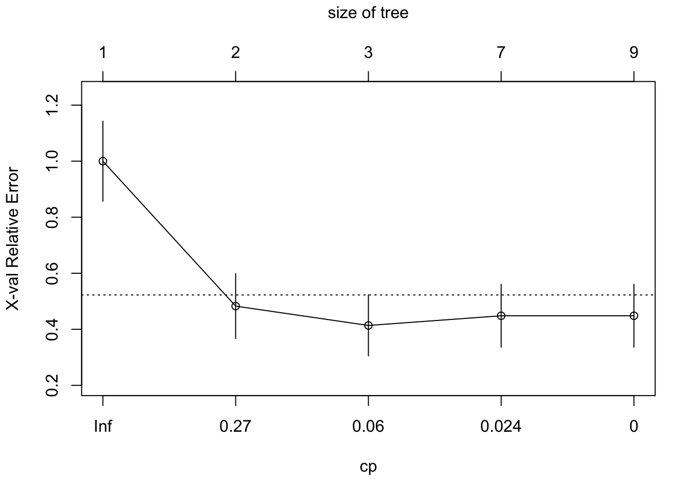
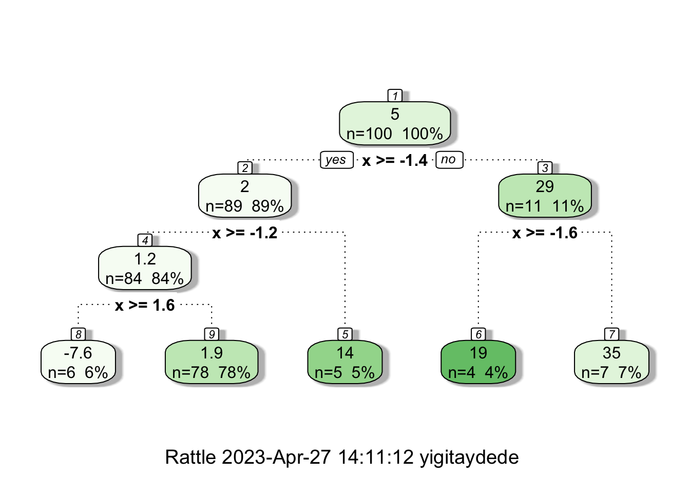
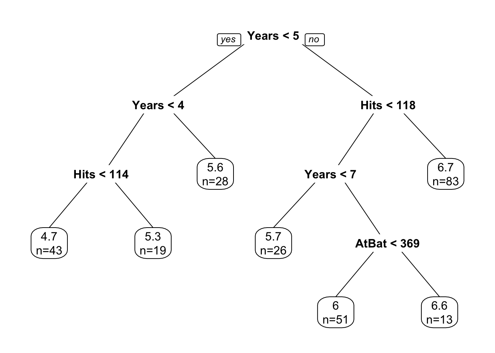

# (PART) Tree-based Models {-}

# CART

Tree-based learning algorithms are considered to be one of the best and most used supervised learning methods. Unlike linear models, they handle non-linear relationships quite well. They are adaptable at solving classification or regression problems, which gives its name: **C**lassification **A**nd **R**egression **T**rees.
  
Decision tree learning algorithms are based on a decision tree, which is a flowchart where each internal **node** represents a decision point (goes left or right), each **branch** represents those decisions, and each **leaf** at the end of a branch represents the outcome of the decision.  Here is a simple decision tree about a gamble:  


How can we use a decision tree in a learning algorithm?  Let's start with a classification problem:  

## CART - Classification Tree

Let's start with a very simple example: suppose we have the following data:  


```r
y <- c(1,1,1,0,0,0,1,1,0,1)
x1 <- c(0.09, 0.11, 0.17, 0.23, 0.33, 0.5, 0.54, 0.62, 0.83, 0.88) 
x2 <- c(0.5, 0.82, 0.2, 0.09, 0.58, 0.5, 0.93, 0.8, 0.3, 0.83)

data <- data.frame(y = y, x1 = x1, x2 = x2)
plot(data$x1, data$x2, col = (data$y+1), lwd = 4,
     ylab = "x2", xlab = "x1")
```


  
What's the best rule on $x_2$ to classify black ($0$) and red balls ($1$)? **Find a cutoff point on $x_2$ such that the maximum number of observations is correctly classified**  

To minimize the misclassification, we find that the cutoff point should be between $(0.6; 0.79)$.  Hence the rule is $x_2 < k$, where $k \in(0.6,0.79)$  


```r
plot(data$x1, data$x2, col = (data$y+1), lwd = 4)
abline(h = 0.62, col = "blue", lty = 5, lwd = 2)
```


From this simple rule, we have two misclassified balls.  We can add a new rule in the area below the horizontal blue line:    


```r
plot(data$x1, data$x2, col = (data$y+1), lwd = 4)
abline(h = 0.62, v = 0.2, col = c("blue", "darkgreen"),
       lty = 5, lwd = 2)
```


  


Using these two rules, we correctly classified all balls ($Y$).  We did the classification manually by looking at the graph.  How can we do it by an algorithm?
  
First, we need to create an index that is going to measure the **impurity** in each node.  Instead of counting misclassified $y$'s, the **impurity** index will give us a continuous metric.  The first index is the **Gini Index**, which can be defined at some node $\mathcal{N}$:

$$
G(\mathcal{N}) = \sum_{k=1}^{K} p_{k}\left(1-p_{k}\right) = 1-\sum_{k=1}^{K} p_{k}^{2}
$$
where, with $p_k$ is the fraction of items labeled with class $k$ in the node. If we have a binary outcome $(k=2)$, when $p_k = 1$, $G(\mathcal{N})=0$ and when $p_k = 0.5,$ $G(\mathcal{N})=0.5$.  The former implies the minimal impurity (diversity), the latter shows the maximal impurity. A small $G$ means that a node contains predominantly observations from a single class.  As in the previous example, when we have a binary outcome with two classes, $y_i \in (0,1)$, this index can be written as:

$$
G(\mathcal{N})=\sum_{k=1}^{2} p_{k}\left(1-p_{k}\right)=2p\left(1-p\right)
$$
  
If we split the node into two leaves, $\mathcal{N}_L$ (left) and $\mathcal{N}_R$ (right), the $G$ will be:

$$
G\left(\mathcal{N}_{L}, \mathcal{N}_{R}\right)=p_{L} G\left(\mathcal{N}_{L}\right)+p_{R} G\left(\mathcal{N}_{R}\right)
$$
  
Where $p_L$, $p_R$ are the proportion of observations in $\mathcal{N}_L$ and $\mathcal{N}_R$.
  
  
Remember, we are trying to find the rule that gives us the best cutoff point. Now we can write the rule:  

$$
\Delta=G(\mathcal{N})-G\left(\mathcal{N}_{L}, \mathcal{N}_{R}\right)>\epsilon
$$
  
When the impurity is reduced substantially, the difference will be some positive number ($\epsilon$).  Hence, we find the cutoff point on a single variable that minimizes the impurity.  

Let's use a dataset^[[freakonometrics](https://freakonometrics.hypotheses.org/52776) [@Charpentier_scratch]], which reports about heart attacks and fatality (our binary variable).


```r
library(readr)
#Data
#myocarde = read.table("http://freakonometrics.free.fr/myocarde.csv",head=TRUE, sep=";")
myocarde <- read_delim("myocarde.csv", delim = ";" ,
                       escape_double = FALSE, trim_ws = TRUE,
                       show_col_types = FALSE)
myocarde <- data.frame(myocarde)
str(myocarde)
```

```
## 'data.frame':	71 obs. of  8 variables:
##  $ FRCAR: num  90 90 120 82 80 80 94 80 78 100 ...
##  $ INCAR: num  1.71 1.68 1.4 1.79 1.58 1.13 2.04 1.19 2.16 2.28 ...
##  $ INSYS: num  19 18.7 11.7 21.8 19.7 14.1 21.7 14.9 27.7 22.8 ...
##  $ PRDIA: num  16 24 23 14 21 18 23 16 15 16 ...
##  $ PAPUL: num  19.5 31 29 17.5 28 23.5 27 21 20.5 23 ...
##  $ PVENT: num  16 14 8 10 18.5 9 10 16.5 11.5 4 ...
##  $ REPUL: num  912 1476 1657 782 1418 ...
##  $ PRONO: chr  "SURVIE" "DECES" "DECES" "SURVIE" ...
```

The variable definitions are as follows: `FRCAR` (heart rate), `INCAR` (heart index), `INSYS` (stroke index), `PRDIA` (diastolic pressure), `PAPUL` (pulmonary arterial pressure), `PVENT` (ventricular pressure), `REPUL` (lung resistance), `PRONO`, which is our outcome variable (death "DECES", survival "SURVIE").  We are ready to calculate $G$-index:  


```r
# Recode PRONO
y <- ifelse(myocarde$PRONO=="SURVIE", 1, 0)

# Find G(N) without L and R
G <- 2*mean(y)*(1-mean(y))
G
```

```
## [1] 0.4832375
```

This is the level of "impurity" in our data.  Now, we need to pick one variable and find a cutoff point in the variable.  Then, we will calculate the same $G$ for both left and right of that point.  The goal is the find the best cutoff point that reduces the "impurity".  Let's pick `FRCAR` arbitrarily for now.  Later we will see how to find the variable that the first split (left and right) should start from so that the reduction in "impurity" will be maximized.


```r
# Let's pick FRCAR to start
x_1 <- myocarde$FRCAR

# Put x and y in table
tab = table(y,x_1)
tab
```

```
##    x_1
## y   60 61 65 67 70 75 78 79 80 81 82 84 85 86 87 90 92 94 95 96 99 100 102 103
##   0  1  0  1  0  1  1  0  1  4  0  0  0  1  0  2  2  2  1  3  0  0   1   1   1
##   1  0  2  1  1  0  3  1  0  7  1  3  1  0  4  0  4  2  1  1  1  1   3   0   0
##    x_1
## y   105 108 110 116 118 120 122 125
##   0   1   0   2   1   1   1   0   0
##   1   0   1   1   0   1   0   1   1
```
  
Let's see how we can calculate 

$$
G\left(\mathcal{N}_{L}, \mathcal{N}_{R}\right)=p_{L} G\left(\mathcal{N}_{L}\right)+p_{R} G\left(\mathcal{N}_{R}\right),
$$
when $x = 60$, for example.


```r
# Let's pick an arbitrary x value, x = 60 to see if (GL + GR > GN)
GL <- 2*mean(y[x_1 <= 60])*(1-mean(y[x_1 <= 60]))
GR <- 2*mean(y[x_1 > 60])*(1-mean(y[x_1 > 60]))
pL <- length(x_1[x_1 <= 60])/length(x_1) #Proportion of obs. on Left 
pR <- length(x_1[x_1 > 60])/length(x_1) #Proportion of obs. on Right
```

How much did we improve $G$?
  

```r
# How much did we improve G?
delta  = G - pL*GL - pR*GR
delta
```

```
## [1] 0.009998016
```

We need go trough each number on $x_1$ and identify the point that maximizes delta.  A function can do that:
  

```r
GI <- function(x){
  GL <- 2*mean(y[x_1 <= x])*(1-mean(y[x_1 <= x])) 
  GR <- 2*mean(y[x_1 > x])*(1-mean(y[x_1 > x]))
  pL <- length(x_1[x_1 <= x])/length(x_1)
  pR <- length(x_1[x_1 > x])/length(x_1)
  del = G - pL*GL - pR*GR
  return(del)
}

# Let's test it
GI(60)
```

```
## [1] 0.009998016
```

It works!  Now, we can use this function in a loop that goes over each unique $x$ and calculate their delta.     
    

```r
xm <- sort(unique(x_1))
delta <- c() 

# Since we don't split at the last number
for (i in 1:length(xm)-1) {
  delta[i] <- GI(xm[i])
}

delta
```

```
##  [1] 9.998016e-03 4.978782e-04 1.082036e-05 1.041714e-03 8.855953e-05
##  [6] 7.363859e-04 2.295303e-03 2.546756e-04 1.142757e-03 2.551599e-03
## [11] 9.862318e-03 1.329134e-02 8.257492e-03 2.402430e-02 1.160767e-02
## [16] 1.634414e-02 1.352527e-02 1.229951e-02 3.109723e-03 5.692941e-03
## [21] 9.212475e-03 1.919591e-02 1.244092e-02 6.882353e-03 2.747959e-03
## [26] 6.282533e-03 1.547312e-03 1.082036e-05 4.978782e-04 9.671419e-03
## [31] 4.766628e-03
```

Let's see the cutoff point that gives us the highest delta.


```r
max(delta)
```

```
## [1] 0.0240243
```

```r
xm[which.max(delta)]
```

```
## [1] 86
```
  
Although this is a simple and an imperfect algorithm, it can show us how we can build a learning system based on a decision tree.  On one variable, `FRCAR` and with only one split we improved the Gini index by 2.5\%.  Obviously this is not good enough.  Can we do more splitting?
  
Since we now have two nodes (Left and Right at $x_1 = 86$), we can think of each of them as one node and apply the same formula to both left and right nodes.  As you can guess, this may give us a zero-$G$, as we end up with splitting at every $x_{1i}$.  How can we prevent this overfitting?  We will see this mechanism later, which is called **pruning**.  

Let's continue our example.  Wouldn't it be a good idea if we check all seven variables and start with the one that has a significant improvements in delta when we split?  We can do it easily with a loop:  


```r
# Adjust our function a little: add "tr", the cutoff
GI <- function(x, tr){
  G <- 2*mean(y)*(1-mean(y))
  GL <- 2*mean(y[x <= tr])*(1-mean(y[x <= tr])) 
  GR <- 2*mean(y[x > tr])*(1-mean(y[x > tr]))
  pL <- length(x[x <= tr])/length(x)
  pR <- length(x[x > tr])/length(x)
  del = G - pL*GL - pR*GR
  return(del)
}

# The loop that applies GI on every x
d <- myocarde[, 1:7]
split <- c()
maxdelta <- c()

for (j in 1:ncol(d)) {
  xm <- sort(unique(d[,j]))
  delta <- c()
  for (i in 1:length(xm)-1) {
    delta[i] <- GI(d[,j], xm[i])
  }
maxdelta[j] <- max(delta)
split[j] <- xm[which.max(delta)]
}

data.frame(variables = colnames(d), delta = maxdelta)
```

```
##   variables      delta
## 1     FRCAR 0.02402430
## 2     INCAR 0.26219024
## 3     INSYS 0.28328013
## 4     PRDIA 0.13184706
## 5     PAPUL 0.09890283
## 6     PVENT 0.04612125
## 7     REPUL 0.26790701
```
  
This is good.  We can identify that `INSYS` should be our first variable to split, as it has the highest delta.
  

```r
round(split[which.max(maxdelta)],0) # round it b/c the cutoff is x=18.7
```

```
## [1] 19
```
  
We now know where to split on `INSYS`, which is 19.  Next, we can split on `INSYS`, Left and Right and move on to the next variable to split, which would be the second best: `REBUL`.

For a better interpretabilty, we can rank the importance of each variable by **their gain in Gini**.   Without using `rpart()`, we can approximately order them by looking at our delta:   


```r
# Variable importance
dm <- matrix(maxdelta, 7, 1)
rownames(dm) <- c(names(myocarde[1:7]))
dm <- dm[order(dm[,1]),]
barplot(dm, horiz = TRUE, col = "darkgreen", xlim = c(0, 0.3),
        cex.names = 0.5, cex.axis = 0.8, main = "Variable Importance at the 1st Split")
```


## `rpart()` - Recursive Partitioning

The R package `rpart` implements **R**ecursive **PART**itioning. It is easy to use.
  
As in our case, when the response variable is categorical,  the resulting tree is called **classification tree**.  The default criterion, which is maximized in each split is the **Gini coefficient**.  The method-argument can be switched according to the type of the response variable. It is `class` for categorical, `anova` for numerical, `poisson` for count data and `exp` for survival data. If the outcome variable is a factor variable, as in our case, we do not have to specify the method.
  
The tree is built by the following process in `rpart`: first the single variable is found that **best splits** the data into two groups. After the data is separated, this process is applied separately to each sub-group.  This goes on recursively until the subgroups either reach a **minimum size** or until no improvement can be made.  

Details can be found in this [vignette](https://cran.r-project.org/web/packages/rpart/vignettes/longintro.pdf) [@Atkinson_2022].

Here, we apply `rpart` to our data without any modification to its default arguments:  
  

```r
library(rpart)
tree = rpart(PRONO ~., data = myocarde, method = "class")

# Plot it
library(rpart.plot) # You can use plot() but prp() is much better
prp(tree, type = 2, extra = 1, split.col = "red",
    split.border.col = "blue", box.col = "pink")
```


  
This shows that the left node (`DECES`) cannot be significantly improved by a further split on `REPUL`.  But the right node (`SURVIE`) can be improved.  

Note that we haven't trained our model explicitly. There are two ways to **control** the growth of a tree:
  
1. We can limit the growth of our tree by using its control parameters and by checking if the split is worth it, which is, as a default, what `rpart()` is doing with 10-fold cross-validation;
2. We can grow the tree without any limitation and then `prune` it.  
  
Since we use the default control parameters with 10-fold CV, our first tree was grown by the first strategy.  Before going further, let's spend some time on the main arguments of `rpart()`:  

`rpart(formula, data, weights, subset, na.action = na.rpart, method, model = FALSE, x = FALSE, y = TRUE, parms, control, cost, ...)`      
  
We briefly describe some of its arguments based on [An Introduction to Recursive Partitioning Using the RPART Routines](https://www.mayo.edu/research/documents/rpartminipdf/doc-10027257) by Atkinson et.al. [-@Atkinson_2000]:
  
- `formula`: the model formula, as in `lm()`. If the outcome $y$ has more than two levels, then categorical predictors must be fit by exhaustive enumeration, which can take a very long time.  
- `data, weights, subset`: as in other models.  
- `parms`: There are three parameters: prior (the vector of prior probabilities), loss (the loss matrix - for different weights for misclassification, split (could be "Gini" or "information Entropy").  
- `na.action`: default is `na.part`, which removes only those rows for which either the response or ALL of the predictors are missing.  Hence `rpart()` retains partially missing observations. This is the single most useful feature of rpart models.  
- `control`: a list of control parameters, usually the result of the `rpart.control` function:  

`rpart.control(minsplit = 20, minbucket = round(minsplit/3), cp = 0.01, maxcompete = 4, maxsurrogate = 5, usesurrogate = 2, xval = 10, surrogatestyle = 0, maxdepth = 30, ...)`   
  
- `minsplit`: The minimum number of observations in a node for which the routine will even try to compute a split. The default is 20. This parameter can save computation time since smaller nodes are almost always pruned away by cross-validation. 
- `minbucket`: The minimum number of observations in a terminal node: This defaults to `minsplit`/3.
- `maxcompete`: This parameter controls the number that will be printed. The default is 5.
- `xval`: The number of cross-validations to be done.  Default is 10.
- `maxsurrogate`: The maximum number of surrogate variables to retain at each node. Surrogates give different information than competitor splits. The competitor list asks **which other splits would have as many correct classifications** surrogates ask **which other splits would classify the same subjects in the same way** which is a harsher criteria.
- `usesurrogate`: If the value is 0, then a subject (observation) who is missing the primary split variable does not progress further down the tree.
- `cp`: The threshold complexity parameter. Default is 0.01. 


**What are the surrogates?** They have two primary functions: first, to split the data when the primary splitter is missing. Remember, `rpart()` does not drop the subject if it has a missing observation on a variable.  When the observation missing on the primary split on that variable, `rpart()` find a surrogate for the variable so that it can carry out the split.  As in our case, the primary splitter ($x$ variable) may never have been missing in the training data. However, when it comes time to make predictions on future data, we have no idea whether that particular splitter will always be available for each observations. When it is missing, then the surrogates will be able to take over and take on the work that the primary splitter accomplished during the initial building of the tree.  

We can see the the growth of the tree by looking at its CV table:  


```r
printcp(tree)
```

```
## 
## Classification tree:
## rpart(formula = PRONO ~ ., data = myocarde, method = "class")
## 
## Variables actually used in tree construction:
## [1] INSYS REPUL
## 
## Root node error: 29/71 = 0.40845
## 
## n= 71 
## 
##         CP nsplit rel error  xerror    xstd
## 1 0.724138      0   1.00000 1.00000 0.14282
## 2 0.034483      1   0.27586 0.51724 0.11861
## 3 0.010000      2   0.24138 0.55172 0.12140
```

The `rel error` of each iteration of the tree is the fraction of mislabeled elements in the iteration relative to the fraction of mislabeled elements in the root. Hence it's 100\% (1.000000 in the table) in the root node. The **relative** improvement, or gain, due to a split is given by `CP` (cost complexity pruning), which is 0.724138 in the first split on `INSYS`.  Therefore, the first split on `INSYS` reduces (improves) this error by 72.4138\% to 27.5862\% (1.000000 `rel error` - 0.724138 `CP`).  This relative gain (`CP`) can be calculated as follows:

$$
\frac{\Delta}{G(\mathcal{N})}=\frac{G(\mathcal{N})-G\left(\mathcal{N}_{L}, \mathcal{N}_{R}\right)}{G(\mathcal{N})}.
$$

If this gain exceeds 1\% - the default value -  `rpart()` splits in two on a variable.  As you can see from the table above, since there is no significant relative gain at the $3^{rd}$ split exceeding the default parameter 0.01, `rpart()` decides to stop growing the tree after the $2^{nd}$ split.  

Note that, we also calculated both the nominator and the denominator in our own algorithm: $\Delta = 0.2832801$ and $G(\mathcal{N}) = 0.4832375$.  Hence the relative gain was $\frac{\Delta}{G(\mathcal{N})}=0.586213$ in our case.  We can replicate the same results if we change our outcome from factor to numeric: 


```r
myocarde_v2 <- myocarde
myocarde_v2$PRONO = (myocarde_v2$PRONO=="SURVIE")*1
cart = rpart(PRONO~.,data=myocarde_v2)
printcp(cart)
```

```
## 
## Regression tree:
## rpart(formula = PRONO ~ ., data = myocarde_v2)
## 
## Variables actually used in tree construction:
## [1] INSYS REPUL
## 
## Root node error: 17.155/71 = 0.24162
## 
## n= 71 
## 
##         CP nsplit rel error  xerror     xstd
## 1 0.586213      0   1.00000 1.01039 0.045234
## 2 0.101694      1   0.41379 0.72601 0.154725
## 3 0.028263      2   0.31209 0.73703 0.158931
## 4 0.010000      3   0.28383 0.74653 0.155961
```

It is not so easy to follow the `rpart` calculations for classification. Although the explanations in the [vignette](https://cran.r-project.org/web/packages/rpart/vignettes/longintro.pdf) [@Atkinson_2022] suggests that Gini is used for classification, it seems that cost complexity pruning (`cp`) is reported based on accuracy (misclassification error) [rather than Gini](https://stats.stackexchange.com/q/223211) [@Alan_2016].
  
As you see, when the outcome is not a factor variable, `rpart` applies a **regression tree** method, which minimizes the sum of squares, $\sum_{i=1}^{n}\left(y_i-f(x_i)\right)^2$. However, when $y_i$ is a binary number with two values 0 and 1, the sum of squares becomes $np(1-p)$, which gives the same relative gain as Gini.  This is clear as both relative gains (our calculation and the calculation by `rapart() `above) are the same.  

What's the variable importance of `rpart()`?    


```r
# Variable Importance
vi <- tree$variable.importance
vi <- vi[order(vi)]
barplot(vi/100, horiz = TRUE, col = "lightgreen",
        cex.names = 0.5, cex.axis = 0.8, main = "Variable Importance - rpart()")
```


It seems that the order of variables are similar, but magnitudes are slightly different due to the differences in calculating methods.  In `rpart()`, the value is calculated:

>(...) as the sum of the decrease in impurity both when the variable appear as a primary split and when it appears as a surrogate.
>
  
## Pruning 

We can now apply the second method to our case by removing the default limits in growing our tree.  We can do it by changing the parameters of the `rpart` fit.  Let's see what happens if we override these parameters:   


```r
# let's change the minsplit and minbucket
tree2 = rpart(PRONO ~., data = myocarde,
              control = rpart.control(minsplit = 2, minbucket = 1,
              cp = 0), method = "class")

# Plot it with a different package now
library(rattle)
# You can use plot() but prp() is much better
fancyRpartPlot(tree2, caption = NULL)
```


This is our **fully grown tree** with a "perfect" fit, because it identifies every outcome (`DECES` and `SURVIE`) correctly at the terminal nodes (\%'s give proportion of observations).  Obviously, this is  not a good idea as it overfits.    

Let's summarize what we have seen so far: we can either go with the first strategy and **limit** the growth of the tree or we can have a fully developed tree then we can `prune` it.  

The general idea in pruning is to reduce the tree's complexity by keeping only the most important splits.  When we grow a tree, `rpart()` performs 10-fold cross-validation on the data.  We can see the cross-validation result by `printcp()`.  


```r
printcp(tree2)
```

```
## 
## Classification tree:
## rpart(formula = PRONO ~ ., data = myocarde, method = "class", 
##     control = rpart.control(minsplit = 2, minbucket = 1, cp = 0))
## 
## Variables actually used in tree construction:
## [1] FRCAR INCAR INSYS PVENT REPUL
## 
## Root node error: 29/71 = 0.40845
## 
## n= 71 
## 
##         CP nsplit rel error  xerror    xstd
## 1 0.724138      0  1.000000 1.00000 0.14282
## 2 0.103448      1  0.275862 0.55172 0.12140
## 3 0.034483      2  0.172414 0.55172 0.12140
## 4 0.017241      6  0.034483 0.51724 0.11861
## 5 0.000000      8  0.000000 0.55172 0.12140
```

```r
plotcp(tree2)
```



```r
min_cp = tree2$cptable[which.min(tree2$cptable[,"xerror"]),"CP"]
min_cp
```

```
## [1] 0.01724138
```

Remember `rpart` has a built-in process for cross-validation. The `xerror` is the cross-validation error, the classification error that is calculated on the test data with a cross-validation process. In general, more levels (each row represents a different height of the tree) in the tree mean that it has a lower classification error on the training. However, you run the risk of overfitting. Often, the cross-validation error will actually grow as the tree gets more levels.

There are two common ways to prune a tree by `rpart`:  
  
1. Use the first level (i.e. least `nsplit`) with minimum `xerror`. The first level only kicks in when there are multiple levels having the same, minimum `xerror`. This is the most common used method. 
2. Use the first level where `xerror` < min(`xerror`) + `xstd`, the level whose `xerror` is at or below horizontal line. This method takes into account the variability of `xerror` resulting from cross-validation.  

Therefore, it seems that we should prune our tree at the $4^{th}$ split.  We use `cp` to prune the tree in `rpart` as follows:  


```r
ptree2 <- prune(tree2, cp = min_cp)
printcp(ptree2)
```

```
## 
## Classification tree:
## rpart(formula = PRONO ~ ., data = myocarde, method = "class", 
##     control = rpart.control(minsplit = 2, minbucket = 1, cp = 0))
## 
## Variables actually used in tree construction:
## [1] INCAR INSYS PVENT
## 
## Root node error: 29/71 = 0.40845
## 
## n= 71 
## 
##         CP nsplit rel error  xerror    xstd
## 1 0.724138      0  1.000000 1.00000 0.14282
## 2 0.103448      1  0.275862 0.55172 0.12140
## 3 0.034483      2  0.172414 0.55172 0.12140
## 4 0.017241      6  0.034483 0.51724 0.11861
```

```r
fancyRpartPlot(ptree2)
```


  
Now we have applied two approaches, limiting tree growth and pruning a fully grown tree. We also have two different trees: "**tree**" and "**ptree2**".  How can we test their performances?  We know that we cannot test it with the training data.  When applying this in practice, we should have a test dataset to check their performance.

## Classification with Titanic

Let's end this sections with a more realistic example: we will predict survival on the Titanic.  


```r
# load the data
library(PASWR)
data(titanic3)
str(titanic3)
```

```
## 'data.frame':	1309 obs. of  14 variables:
##  $ pclass   : Factor w/ 3 levels "1st","2nd","3rd": 1 1 1 1 1 1 1 1 1 1 ...
##  $ survived : int  1 1 0 0 0 1 1 0 1 0 ...
##  $ name     : Factor w/ 1307 levels "Abbing, Mr. Anthony",..: 22 24 25 26 27 31 46 47 51 55 ...
##  $ sex      : Factor w/ 2 levels "female","male": 1 2 1 2 1 2 1 2 1 2 ...
##  $ age      : num  29 0.917 2 30 25 ...
##  $ sibsp    : int  0 1 1 1 1 0 1 0 2 0 ...
##  $ parch    : int  0 2 2 2 2 0 0 0 0 0 ...
##  $ ticket   : Factor w/ 929 levels "110152","110413",..: 188 50 50 50 50 125 93 16 77 826 ...
##  $ fare     : num  211 152 152 152 152 ...
##  $ cabin    : Factor w/ 187 levels "","A10","A11",..: 45 81 81 81 81 151 147 17 63 1 ...
##  $ embarked : Factor w/ 4 levels "","Cherbourg",..: 4 4 4 4 4 4 4 4 4 2 ...
##  $ boat     : Factor w/ 28 levels "","1","10","11",..: 13 4 1 1 1 14 3 1 28 1 ...
##  $ body     : int  NA NA NA 135 NA NA NA NA NA 22 ...
##  $ home.dest: Factor w/ 369 levels "","?Havana, Cuba",..: 309 231 231 231 231 237 163 25 23 229 ...
```

We will use the following variables:  

`survived` - 1 if true, 0 otherwise;  
`sex` - the gender of the passenger;  
`age` - age of the passenger in years;  
`pclass` - the passengers class of passage;  
`sibsp` - the number of siblings/spouses aboard;  
`parch` - the number of parents/children aboard.  

What predictors are associated with those who perished compared to those who survived?  


```r
titan <- rpart(survived~sex+age+pclass+sibsp+parch, data=titanic3, method="class")

prp(titan, extra=1, faclen=5, box.col=c("indianred1","aquamarine")[tree$frame$yval])
```


```r
barplot(titan$variable.importance, horiz=TRUE,
        col="yellow3", cex.axis = 0.7, cex.names = 0.7)
```


If we want to see the cross-validation error and the `cp` table:


```r
printcp(titan)
```

```
## 
## Classification tree:
## rpart(formula = survived ~ sex + age + pclass + sibsp + parch, 
##     data = titanic3, method = "class")
## 
## Variables actually used in tree construction:
## [1] age    parch  pclass sex    sibsp 
## 
## Root node error: 500/1309 = 0.38197
## 
## n= 1309 
## 
##         CP nsplit rel error xerror     xstd
## 1 0.424000      0     1.000  1.000 0.035158
## 2 0.021000      1     0.576  0.576 0.029976
## 3 0.015000      3     0.534  0.562 0.029710
## 4 0.011333      5     0.504  0.544 0.029359
## 5 0.010000      9     0.458  0.544 0.029359
```

```r
plotcp(titan)
```


Of course, we would like to see the tree's prediction accuracy by using a test dataset and the confusion table metrics.  


```r
library(ROCR)

#test/train split
set.seed(1)
ind <- sample(nrow(titanic3), nrow(titanic3)*0.7)
train <- titanic3[ind, ]
test <- titanic3[-ind, ]

#Tree on train
titan2 <- rpart(survived~sex+age+pclass+sibsp+parch, data=train, method="class")
phat <- predict(titan2, test, type = "prob")

#AUC
pred_rocr <- prediction(phat[,2], test$survived)
auc_ROCR <- performance(pred_rocr, measure = "auc")
auc_ROCR@y.values[[1]]
```

```
## [1] 0.814118
```

Here, we report only AUC in this simple example.  Moreover, we can reweigh variables so that the loss or the cost of a wrong split would be more or less important (see cost argument in `rpart`).  Finally, as in every classification, we can put a different weight on the correct classifications than the wrong classifications (or vise verse).  This can easily be done in `rpart` by the loss matrix.

Before commenting on the strengths and weaknesses of CART, let's see a regression tree.  

## Regression Tree

The same partitioning procedure can be applied when the outcome variable is not qualitative.  A splitting criterion, which is used to decide which variable gives the best split, was either the Gini or log-likelihood function for a classification problem. Now we can can use the anova method as a splitting criteria:

$$
S S_{T}-\left(S S_{L}+S S_{R}\right),
$$
where

$$
SS_{T}=\sum\left(y_{i}-\bar{y}\right)^{2},
$$
   
which is the sum of squares for the node and $SS_R$ and $SS_L$ are the sums of squares for the right and left splits, respectively.  Similar to our delta method, if $SS_{T}-\left(SS_{L}+SS_{R}\right)$ is positive and significant, we make the split on the node (the variable).  After the split, the fitted value of the node is the mean of $y$ of that node.  The `anova` method is used for regression trees, which is the default method if $y$ a simple numeric vector.  However, when $y_i \in (0,1)$,  
  
$$
SS_{T}=\sum\left(y_{i}-\bar{y}\right)^{2}=\sum y_{i}^2 -n\bar{y}^2=\sum y_{i} -n\bar{y}^2=n\bar y -n\bar{y}^2=np(1-p)
$$
  
Hence, we can show that the **relative gain** would be the same in regression trees using $SS_T$ or Gini when $y_i \in (0,1)$.  

It is not hard to write a simple loop similar to our earlier algorithm, but it would be redundant.  We will use `rpart()` in an example:  


```r
# simulated data
set.seed(1)
x <- runif(100, -2, 2)
y <- 1 + 1*x + 4*I(x^2) - 4*I(x^3) + rnorm(100, 0, 6)
d <- data.frame("y" = y, "x" = x)
plot(x, y, col = "gray")
```


```r
# Tree
fit1 <- rpart(y ~ x, minsplit=83, d) # we want to have 1 split
fancyRpartPlot(fit1)
```


When we have split at $x=-0.65$, `rpart` calculates two constant $\hat{f}(x_i)$'s both for the "left" and "right" splits:  


```r
mean(y[x <= -0.65])
```

```
## [1] 15.33681
```

```r
mean(y[x > -0.65])
```

```
## [1] 0.9205211
```

Here we see them on the plot:  


```r
z <- seq(min(x), max(x), length.out=1000)
plot(x, y, col = "gray")
lines(z, predict(fit1, data.frame(x=z)), col="blue", lwd=3)
abline(v = -0.65, col="red")
```


If we reduce the `minsplit`,  


```r
# Tree
fit2 <- rpart(y ~ x, minsplit=6, d)
fancyRpartPlot(fit2)
```



```r
# On the plot
plot(x, y, col = "gray")
lines(z, predict(fit2, data.frame(x=z)), col="green", lwd=3)
```


  
We will use an example of predicting Baseball players’ salaries, which is one of the most common example [online](https://rdrr.io/cran/ISLR/man/Hitters.html) [@ISLR_2021].  This data set is deduced from the Baseball fielding data set: fielding performance includes the numbers of `Errors`, `Putouts` and `Assists` made by each player.


```r
# Hitters data
library(ISLR)
data("Hitters")
str(Hitters)
```

```
## 'data.frame':	322 obs. of  20 variables:
##  $ AtBat    : int  293 315 479 496 321 594 185 298 323 401 ...
##  $ Hits     : int  66 81 130 141 87 169 37 73 81 92 ...
##  $ HmRun    : int  1 7 18 20 10 4 1 0 6 17 ...
##  $ Runs     : int  30 24 66 65 39 74 23 24 26 49 ...
##  $ RBI      : int  29 38 72 78 42 51 8 24 32 66 ...
##  $ Walks    : int  14 39 76 37 30 35 21 7 8 65 ...
##  $ Years    : int  1 14 3 11 2 11 2 3 2 13 ...
##  $ CAtBat   : int  293 3449 1624 5628 396 4408 214 509 341 5206 ...
##  $ CHits    : int  66 835 457 1575 101 1133 42 108 86 1332 ...
##  $ CHmRun   : int  1 69 63 225 12 19 1 0 6 253 ...
##  $ CRuns    : int  30 321 224 828 48 501 30 41 32 784 ...
##  $ CRBI     : int  29 414 266 838 46 336 9 37 34 890 ...
##  $ CWalks   : int  14 375 263 354 33 194 24 12 8 866 ...
##  $ League   : Factor w/ 2 levels "A","N": 1 2 1 2 2 1 2 1 2 1 ...
##  $ Division : Factor w/ 2 levels "E","W": 1 2 2 1 1 2 1 2 2 1 ...
##  $ PutOuts  : int  446 632 880 200 805 282 76 121 143 0 ...
##  $ Assists  : int  33 43 82 11 40 421 127 283 290 0 ...
##  $ Errors   : int  20 10 14 3 4 25 7 9 19 0 ...
##  $ Salary   : num  NA 475 480 500 91.5 750 70 100 75 1100 ...
##  $ NewLeague: Factor w/ 2 levels "A","N": 1 2 1 2 2 1 1 1 2 1 ...
```

What predictors are associated with baseball player's Salary (1987 annual salary on opening day in thousands of dollars)?
  
Let's consider 3 covariates for the sake of simplicity: `Years` (Number of years in the major leagues); `Hits` (Number of hits in 1986); `Atbat` (Number of times at bat in 1986).


```r
# Remove NA's
df=Hitters[complete.cases(Hitters$Salary),]
dfshort <- df[, c(19, 7, 2, 1)]

#Build the tree
tree <- rpart(log(Salary) ~ Years + Hits + AtBat, data=dfshort, cp=0)
#cp=0 so fully grown

prp(tree, extra=1, faclen=5)
```


It works on the same principle as we described before: find terminal nodes that minimize the sum of squares.  This process may give us a good prediction on the training set but not on the test set, as it overfits the data.  Hence, we use a pruned tree found by `rpart` by cross-validation:


```r
ptree <- rpart(log(Salary) ~ Years + Hits + AtBat, data=dfshort)
prp(ptree, extra=1, faclen=5)
```



We can see its prediction power similar to what we did in the Titanic data example.  Since this is a regression, we can ask which one is better, a tree or a linear model?  If the relationship between $y$ and $X$ is linear, a linear model should perform better.  We can test this:
  

```r
#test/train split
set.seed(123)
ind <- sample(nrow(dfshort), nrow(dfshort)*0.7)
train <- dfshort[ind, ]
test <- dfshort[-ind, ]

#Tree and lm() on train
ptree <- rpart(log(Salary) ~ Years + Hits + AtBat, data=dfshort)
predtree <- predict(ptree, test)
lin <- lm(log(Salary) ~ ., data=dfshort)
predlin <- predict(lin, test)

#RMSPE
rmspe_tree <- sqrt(mean((log(test$Salary) - predtree)^2))
rmspe_tree
```

```
## [1] 0.4601892
```

```r
rmspe_lin <- sqrt(mean((log(test$Salary) - predlin)^2))
rmspe_lin
```

```
## [1] 0.6026888
```

In this simple example, our the tree would do a better job.

**Trees tend to work well for problems where there are important nonlinearities and interactions. The results are really intuitive and interpretable. However, trees are known to be quite sensitive to the original sample.  Therefore, the models trained in one sample may have poor predictive accuracy on another sample.** These problems motivate Random Forest and Boosting methods, as we will describe in following chapters.

