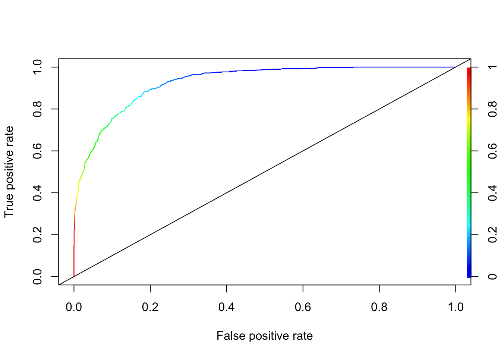

# Ensemble Applications

To conclude this section we will cover classification and regression applications using bagging, random forest, boosting and SVM. First we will start with a classification problem.  In comparing different ensemble methods, we must look not only at their accuracy, but evaluate their stability as well.


## Classification
We will again predict survival on the Titanic, using CART, bagging and random forest.  We will use the following variables:  

`survived` - 1 if true, 0 otherwise;  
`sex` - the gender of the passenger;  
`age` - age of the passenger in years;  
`pclass` - the passengers class of passage;  
`sibsp` - the number of siblings/spouses aboard;  
`parch` - the number of parents/children aboard.  


```r
library(PASWR)
library(ROCR)
library(rpart)
library(randomForest)

# Data
data(titanic3)
nam <- c("survived", "sex", "age", "pclass", "sibsp", "parch")
df <- titanic3[, nam]
dfc <- df[complete.cases(df), ]
dfc$survived <- as.factor(dfc$survived)

AUC1 <- c()
AUC2 <- c()
AUC3 <- c()
n = 100
B = 100

for (i in 1:n) {
  set.seed(i+i*100)
  ind <- sample(nrow(dfc), nrow(dfc), replace = TRUE)
  train <- dfc[ind, ]
  test <- dfc[-ind, ]
  
  p = ncol(train)-1

  #3 Methods
  model1 <- rpart(survived~sex+age+pclass+sibsp+parch,
                data=train, method="class") #Single tree, pruned
  model2 <- randomForest(survived~sex+age+pclass+sibsp+parch,
                         ntree = B, mtry = p, data = train) #Bagged
  model3 <- randomForest(survived~sex+age+pclass+sibsp+parch,
                         ntree = B, data = train) # RF    
  
  phat1 <- predict(model1, test, type = "prob")
  phat2 <- predict(model2, test, type = "prob")
  phat3 <- predict(model3, test, type = "prob")
  
  #AUC1
  pred_rocr1 <- prediction(phat1[,2], test$survived)
  auc_ROCR1 <- performance(pred_rocr1, measure = "auc")
  AUC1[i] <- auc_ROCR1@y.values[[1]]
  
  #AUC2
  pred_rocr2 <- prediction(phat2[,2], test$survived)
  auc_ROCR2 <- performance(pred_rocr2, measure = "auc")
  AUC2[i] <- auc_ROCR2@y.values[[1]]
  
  #AUC3
  pred_rocr3 <- prediction(phat3[,2], test$survived)
  auc_ROCR3 <- performance(pred_rocr3, measure = "auc")
  AUC3[i] <- auc_ROCR3@y.values[[1]]
}

model <- c("Single-Tree", "Bagging", "RF")
AUCs <- c(mean(AUC1), mean(AUC2), mean(AUC3))
sd <- c(sqrt(var(AUC1)), sqrt(var(AUC2)), sqrt(var(AUC3)))
data.frame(model, AUCs, sd) 
```

```
##         model      AUCs         sd
## 1 Single-Tree 0.8129740 0.02585391
## 2     Bagging 0.8128962 0.01709652
## 3          RF 0.8409750 0.01659263
```

There is a consensus that we can determine a bagged model’s test error without using cross-validation.  The reason for this is usually stated that each bootstrapped sample contains about two-thirds of the original dataset’s observations. Out-of-Bag (OOB) observations are the remaining 1/3 of the observations that were not used to fit the bagged tree.

We did the bagging by using `randomForest` in the previous application.  Let's see if we can obtain a similar result with our manual bagging using `rpart()` pruned and unpruned:


```r
n <- 100
B <- 500
AUCp <- c()
AUCup <- c()

for (i in 1:n) {
  
  set.seed(i+i*100)
  ind <- sample(nrow(dfc), nrow(dfc), replace = TRUE)
  train <- dfc[ind, ]
  test <- dfc[-ind, ]
  
  phatp <- matrix(0, B, nrow(test))
  phatup <- matrix(0, B, nrow(test))

  for (j in 1:B) {
    set.seed(j+j*2)
    ind <- sample(nrow(train), nrow(train), replace = TRUE)
    tr <- train[ind, ]

    modelp <- rpart(survived ~ sex + age + pclass + sibsp + parch,
                  data = tr, method = "class") # Pruned
    modelup <- rpart(survived ~ sex + age + pclass + sibsp + parch,
                  data = tr,
                  control = rpart.control(minsplit = 2, minbucket = 1
                                          , cp = 0),
                  method = "class") # unpruned
    phatp[j, ] <- predict(modelp, test, type = "prob")[, 2]
    phatup[j, ] <- predict(modelup, test, type = "prob")[, 2]
  }
  # Averaging for B Trees
  phatpr <- apply(phatp, 2, mean)
  phatupr <- apply(phatup, 2, mean)
  
  # AUC pruned
  pred_rocr <- prediction(phatpr, test$survived)
  auc_ROCR <- performance(pred_rocr, measure = "auc")
  AUCp[i] <- auc_ROCR@y.values[[1]]
  
  # AUC unpruned
  pred_rocr <- prediction(phatupr, test$survived)
  auc_ROCR <- performance(pred_rocr, measure = "auc")
  AUCup[i] <- auc_ROCR@y.values[[1]]
}

mean(AUCp)
```

```
## [1] 0.8523158
```

```r
sqrt(var(AUCp))
```

```
## [1] 0.01626892
```

```r
mean(AUCup)
```

```
## [1] 0.8180802
```

```r
sqrt(var(AUCup))
```

```
## [1] 0.01693003
```
  
We can see a significant reduction in uncertainty and improvement in accuracy relative to a single tree.  Moreover, our manual bagging with the cross-validated (pruned) single tree using `rpart()` doing a better job than the bagging using `randomForest()`.  When we use "unpruned" single-tree using `rpart()` for bagging, the result becomes very similar to one that we obtain with random forest. Further, the number of bootstrapped trees (B) would be a hyperparameter to tune in bagging.  You can try the same script multiple times with different B vales such as 50, 100, 150.  In our experiment (not shown here), it seems that results are not sensitive to B as long as B is large enough like 50 and more.

This would also be the case in regression trees, where we would be averaging `yhat`'s and calculating RMSPE and its standard deviations instead of AUC.

## Regression

Consider the same data set we used earlier chapters to predict baseball player's salary:  


```r
library(ISLR)

remove(list = ls())

data(Hitters)
df <- Hitters[complete.cases(Hitters$Salary), ]
```

Let's use only a single tree with bagging:


```r
library(rpart)

# Data
df$logsal <- log(df$Salary)
df <- df[, -19]

n = 100
B = 500
RMSPEp <- c()
RMSPEup <- c()

for (i in 1:n) {
  set.seed(i+i*8)
  ind <- sample(nrow(df), nrow(df), replace = TRUE)
  train <- df[ind, ]
  test <- df[-ind, ]

  yhatp <- matrix(0, B, nrow(test))
  yhatup <- matrix(0, B, nrow(test))
    
  for (j in 1:B) {
    set.seed(j+j*2)
    ind <- sample(nrow(train), nrow(train), replace = TRUE)
    tr <- train[ind, ]
    
    modelp <- rpart(logsal ~ ., data = tr, method = "anova") # Pruned
    modelup <- rpart(logsal ~ ., data = tr,
                    control = rpart.control(minsplit = 2, minbucket = 1
                                            ,cp = 0),
                    method = "anova") # unpruned
    yhatp[j,] <- predict(modelp, test)
    yhatup[j,] <- predict(modelup, test)
  }
  # Averaging for B Trees
  yhatpr <- apply(yhatp, 2, mean)
  yhatupr <- apply(yhatup, 2, mean)
  
  RMSPEp[i] <- sqrt(mean((test$logsal - yhatpr)^2))
  RMSPEup[i] <- sqrt(mean((test$logsal - yhatupr)^2))
}
  
mean(RMSPEp)
```

```
## [1] 0.501984
```

```r
sqrt(var(RMSPEp))
```

```
## [1] 0.05817388
```

```r
mean(RMSPEup)
```

```
## [1] 0.4808079
```

```r
sqrt(var(RMSPEup))
```

```
## [1] 0.06223845
```

With and without pruning, the results are very similar.  Let's put all these together and do it with Random Forest:  


```r
library(randomForest)
library(rpart)

# Data
remove(list = ls())
data(Hitters)
df <- Hitters[complete.cases(Hitters$Salary), ]
df$logsal <- log(df$Salary)
df <- df[, -19]

n <- 100
B <- 500
RMSPE1 <- c()
RMSPE2 <- c()
RMSPE3 <- c()

for (i in 1:n) {
  set.seed(i+i*8)
  ind <- sample(nrow(df), nrow(df), replace = TRUE)
  train <- df[ind, ]
  test <- df[-ind, ]
  
  p = ncol(train)-1

  model1 <- rpart(logsal~., data =train) # Single Tree
  model2 <- randomForest(logsal~., ntree = B, mtry = p, data = train) #Bagged
  model3 <- randomForest(logsal~., ntree = B, localImp = TRUE, data = train) # RF

  yhat1 <- predict(model1, test)
  yhat2 <- predict(model2, test)
  yhat3 <- predict(model3, test)
  
  RMSPE1[i] <- sqrt(mean((test$logsal - yhat1)^2))
  RMSPE2[i] <- sqrt(mean((test$logsal - yhat2)^2))
  RMSPE3[i] <- sqrt(mean((test$logsal - yhat3)^2))
}

model <- c("Single-Tree", "Bagging", "RF")
RMSPEs <- c(mean(RMSPE1), mean(RMSPE2), mean(RMSPE3))
sd <- c(sqrt(var(RMSPE1)), sqrt(var(RMSPE2)), sqrt(var(RMSPE3)))
data.frame(model, RMSPEs, sd) 
```

```
##         model    RMSPEs         sd
## 1 Single-Tree 0.5739631 0.05360920
## 2     Bagging 0.4807763 0.06119187
## 3          RF 0.4631194 0.06045187
```

As you can see, random forest has the lowest RMSPE and thus performs the best, whereas the CART model has the highest RMSPE.


## Dataset-level explainers


```r
library(randomForest)
varImpPlot(model3)
```


We will now dig deeper with `randomForestExplainer` (see its [vignette](https://htmlpreview.github.io/?https://github.com/geneticsMiNIng/BlackBoxOpener/master/randomForestExplainer/inst/doc/randomForestExplainer.html)) [@Palu_2012] and `DALEX` packages. Assuming that the observations form a representative sample from a general population, dataset-level explainers can provide information about the quality of predictions for the population.


```r
library(randomForestExplainer)
library(DT)

min_depth_frame <- min_depth_distribution(model3)
importance_frame <- measure_importance(model3)
tabl <- cbind(importance_frame[,1], round(importance_frame[,2:7],4))
datatable(tabl, rownames = FALSE, filter="top", options = list(pageLength = 10, scrollX=T) )
```

```{=html}
<div class="datatables html-widget html-fill-item-overflow-hidden html-fill-item" id="htmlwidget-da20c4f9345e4dcd3dad" style="width:100%;height:auto;"></div>
<script type="application/json" data-for="htmlwidget-da20c4f9345e4dcd3dad">{"x":{"filter":"top","vertical":false,"filterHTML":"<tr>\n  <td data-type=\"factor\" style=\"vertical-align: top;\">\n    <div class=\"form-group has-feedback\" style=\"margin-bottom: auto;\">\n      <input type=\"search\" placeholder=\"All\" class=\"form-control\" style=\"width: 100%;\"/>\n      <span class=\"glyphicon glyphicon-remove-circle form-control-feedback\"><\/span>\n    <\/div>\n    <div style=\"width: 100%; display: none;\">\n      <select multiple=\"multiple\" style=\"width: 100%;\" data-options=\"[&quot;Assists&quot;,&quot;AtBat&quot;,&quot;CAtBat&quot;,&quot;CHits&quot;,&quot;CHmRun&quot;,&quot;CRBI&quot;,&quot;CRuns&quot;,&quot;CWalks&quot;,&quot;Division&quot;,&quot;Errors&quot;,&quot;Hits&quot;,&quot;HmRun&quot;,&quot;League&quot;,&quot;NewLeague&quot;,&quot;PutOuts&quot;,&quot;RBI&quot;,&quot;Runs&quot;,&quot;Walks&quot;,&quot;Years&quot;]\"><\/select>\n    <\/div>\n  <\/td>\n  <td data-type=\"number\" style=\"vertical-align: top;\">\n    <div class=\"form-group has-feedback\" style=\"margin-bottom: auto;\">\n      <input type=\"search\" placeholder=\"All\" class=\"form-control\" style=\"width: 100%;\"/>\n      <span class=\"glyphicon glyphicon-remove-circle form-control-feedback\"><\/span>\n    <\/div>\n    <div style=\"display: none;position: absolute;width: 200px;opacity: 1\">\n      <div data-min=\"2.0762\" data-max=\"7.7239\" data-scale=\"4\"><\/div>\n      <span style=\"float: left;\"><\/span>\n      <span style=\"float: right;\"><\/span>\n    <\/div>\n  <\/td>\n  <td data-type=\"number\" style=\"vertical-align: top;\">\n    <div class=\"form-group has-feedback\" style=\"margin-bottom: auto;\">\n      <input type=\"search\" placeholder=\"All\" class=\"form-control\" style=\"width: 100%;\"/>\n      <span class=\"glyphicon glyphicon-remove-circle form-control-feedback\"><\/span>\n    <\/div>\n    <div style=\"display: none;position: absolute;width: 200px;opacity: 1\">\n      <div data-min=\"442\" data-max=\"2752\"><\/div>\n      <span style=\"float: left;\"><\/span>\n      <span style=\"float: right;\"><\/span>\n    <\/div>\n  <\/td>\n  <td data-type=\"number\" style=\"vertical-align: top;\">\n    <div class=\"form-group has-feedback\" style=\"margin-bottom: auto;\">\n      <input type=\"search\" placeholder=\"All\" class=\"form-control\" style=\"width: 100%;\"/>\n      <span class=\"glyphicon glyphicon-remove-circle form-control-feedback\"><\/span>\n    <\/div>\n    <div style=\"display: none;position: absolute;width: 200px;opacity: 1\">\n      <div data-min=\"7e-04\" data-max=\"0.2415\" data-scale=\"4\"><\/div>\n      <span style=\"float: left;\"><\/span>\n      <span style=\"float: right;\"><\/span>\n    <\/div>\n  <\/td>\n  <td data-type=\"number\" style=\"vertical-align: top;\">\n    <div class=\"form-group has-feedback\" style=\"margin-bottom: auto;\">\n      <input type=\"search\" placeholder=\"All\" class=\"form-control\" style=\"width: 100%;\"/>\n      <span class=\"glyphicon glyphicon-remove-circle form-control-feedback\"><\/span>\n    <\/div>\n    <div style=\"display: none;position: absolute;width: 200px;opacity: 1\">\n      <div data-min=\"0.1574\" data-max=\"38.3175\" data-scale=\"4\"><\/div>\n      <span style=\"float: left;\"><\/span>\n      <span style=\"float: right;\"><\/span>\n    <\/div>\n  <\/td>\n  <td data-type=\"number\" style=\"vertical-align: top;\">\n    <div class=\"form-group has-feedback\" style=\"margin-bottom: auto;\">\n      <input type=\"search\" placeholder=\"All\" class=\"form-control\" style=\"width: 100%;\"/>\n      <span class=\"glyphicon glyphicon-remove-circle form-control-feedback\"><\/span>\n    <\/div>\n    <div style=\"display: none;position: absolute;width: 200px;opacity: 1\">\n      <div data-min=\"285\" data-max=\"500\"><\/div>\n      <span style=\"float: left;\"><\/span>\n      <span style=\"float: right;\"><\/span>\n    <\/div>\n  <\/td>\n  <td data-type=\"number\" style=\"vertical-align: top;\">\n    <div class=\"form-group has-feedback\" style=\"margin-bottom: auto;\">\n      <input type=\"search\" placeholder=\"All\" class=\"form-control\" style=\"width: 100%;\"/>\n      <span class=\"glyphicon glyphicon-remove-circle form-control-feedback\"><\/span>\n    <\/div>\n    <div style=\"display: none;position: absolute;width: 200px;opacity: 1\">\n      <div data-min=\"0\" data-max=\"133\"><\/div>\n      <span style=\"float: left;\"><\/span>\n      <span style=\"float: right;\"><\/span>\n    <\/div>\n  <\/td>\n<\/tr>","data":[["Assists","AtBat","CAtBat","CHits","CHmRun","CRBI","CRuns","CWalks","Division","Errors","Hits","HmRun","League","NewLeague","PutOuts","RBI","Runs","Walks","Years"],[4.3853,2.8806,2.3783,2.2543,3.4449,2.826,2.0763,3.0903,7.0259,4.6268,3.0863,4.0196,7.7239,7.0973,3.6546,3.4869,3.5189,3.5323,4.5977],[2351,2691,2598,2711,2556,2752,2731,2579,691,2080,2582,2229,442,627,2593,2620,2543,2576,1716],[0.0112,0.0823,0.2181,0.222,0.0465,0.1037,0.2415,0.0843,0.0009,0.0092,0.0891,0.0229,0.0007,0.0012,0.0174,0.0407,0.0516,0.0398,0.0247],[2.0354,9.8977,38.3175,34.6914,6.5335,19.5414,35.0894,18.0455,0.261,1.275,9.389,3.5544,0.1574,0.243,3.9026,6.9162,5.8962,5.9405,5.5647],[496,498,499,499,497,500,499,499,380,491,499,495,285,363,498,497,497,499,482],[0,5,133,110,7,55,101,52,0,0,7,0,0,0,0,7,1,0,22]],"container":"<table class=\"display\">\n  <thead>\n    <tr>\n      <th>importance_frame[, 1]<\/th>\n      <th>mean_min_depth<\/th>\n      <th>no_of_nodes<\/th>\n      <th>mse_increase<\/th>\n      <th>node_purity_increase<\/th>\n      <th>no_of_trees<\/th>\n      <th>times_a_root<\/th>\n    <\/tr>\n  <\/thead>\n<\/table>","options":{"pageLength":10,"scrollX":true,"columnDefs":[{"className":"dt-right","targets":[1,2,3,4,5,6]}],"order":[],"autoWidth":false,"orderClasses":false,"orderCellsTop":true}},"evals":[],"jsHooks":[]}</script>
```
  

```r
plot_multi_way_importance(importance_frame, x_measure = "mean_min_depth",
                          y_measure = "mse_increase",
                          size_measure = "p_value", no_of_labels = 6)
```


```r
plot_min_depth_distribution(min_depth_frame, mean_sample = "all_trees", k =20,
                            main = "Distribution of minimal depth and its mean")
```


```r
partialPlot(model3, test, CRuns, xlab="CRuns",
                main="Effects of CRuns",
                col = "red", lwd = 3)
```


## Boosting Applications

We need to tune the boosting applications with `gbm()`.  There are three tuning parameters: `h`, `B`, and `D`.  We will do the tuning with grid search and apply parallel processing.  We will have both regression and classification problems.  Finally we will compare OLS, CART, Bagging, RF and boosting.

### Regression


```r
library(ISLR)
data(Hitters)
df <- Hitters[complete.cases(Hitters$Salary), ]
df$Salary <- log(df$Salary)

# Test/Train Split
set.seed(1)
ind <- sample(nrow(df), nrow(df), replace = TRUE)
train <- df[ind, ]
test <- df[-ind, ]
```

This will give you an idea how tuning the boosting by using `h` would be done:  


```r
library(gbm)

h <- seq(0.01, 1.8, 0.01)

test_mse <- c()

# D = 1 and B = 1000
for(i in 1:length(h)){
    boos <- gbm(Salary~., distribution ="gaussian", n.trees=1000,
            interaction.depth = 1, shrinkage = h[i], data = train)
    prboos <- predict(boos, test, n.trees = 100)
    test_mse[i] <- mean((test$Salary - prboos)^2)
}
plot(h, test_mse, type = "l", col="blue", main = "MSE - Prediction")
```


```r
h[which.min(test_mse)]
```

```
## [1] 0.08
```

```r
min(test_mse)
```

```
## [1] 0.181286
```

```r
test_mse[10]
```

```
## [1] 0.1895487
```

A complete but limited grid search is here:  


```r
library(gbm)

h <- seq(0.01, 0.3, 0.01)
B <- c(100, 300, 500, 750, 900)
D <- 1:2
grid <- as.matrix(expand.grid(D, B, h))

mse <-c()
sdmse <-c()

for(i in 1:nrow(grid)){
  test_mse <- c()
  for (j in 1:20) {
    try({
      set.seed(j)
      ind <- sample(nrow(df), nrow(df), replace = TRUE)
      train <- df[ind, ]
      test <- df[-ind, ]
      boos <- gbm(Salary~., distribution ="gaussian", n.trees=1000,
              interaction.depth = grid[i,1], shrinkage = grid[i,3], data = train)
      prboos <- predict(boos, test, n.trees = grid[i,2])
      test_mse[j] <- mean((test$Salary - prboos)^2)
      },
    silent = TRUE)
  }
mse[i] <- mean(test_mse)
sdmse[i] <- sd(test_mse)
}

min(mse)
```

```
## [1] 0.2108654
```

```r
grid[as.numeric(which.min(mse)), ]
```

```
##  Var1  Var2  Var3 
## 2e+00 9e+02 1e-02
```

### Random search with parallel processing
  
Now, we will apply a random grid search (see [Random Search for Hyper-Parameter Optimization](https://jmlr.csail.mit.edu/papers/volume13/bergstra12a/bergstra12a.pdf)) [@Bergs_2012].  We also apply a parallel multicore processing using `doParallel` and `foreach()` to accelerate the grid search.   


```r
library(gbm)
library(doParallel)
library(foreach)

h <- seq(0.001, 0.25, 0.001)
B <- seq(100, 800, 20)
D <- 1:4
grid <- as.matrix(expand.grid(D, B, h))

#Random grid-search
conf_lev <- 0.95
num_max <- 5
n <- log(1-conf_lev)/log(1-num_max/nrow(grid))
set.seed(123)
ind <- sample(nrow(grid), nrow(grid)*(n/nrow(grid)), replace = FALSE)
comb <- grid[ind, ]

# Set-up for multicore loops
trials <- 1:nrow(comb)
numCores <- detectCores()
registerDoParallel(numCores)

# Bootstrapping with parallel process 
lst <- foreach(k=trials, .combine=c, .errorhandling = 'remove') %dopar% {
  test_mse <- c()
  for (j in 1:10) {
    try({
      set.seed(j)
      ind <- sample(nrow(df), nrow(df), replace = TRUE)
      train <- df[ind, ]
      test <- df[-ind, ]
      boos <- gbm(Salary~., distribution ="gaussian", n.trees=1000,
             interaction.depth =comb[k,1], shrinkage = comb[k,3], data = train)
      prboos <- predict(boos, test, n.trees = comb[k,2])
      test_mse[j] <- mean((test$Salary - prboos)^2)
      },
    silent = TRUE)
  }
list(c(k, mean(test_mse), sd(test_mse)))
}

stopImplicitCluster()

unlst  <- do.call(rbind, lst)
result <- cbind(comb[unlst[,1],], unlst)
sorted  <- result[order(result[,5]), -4]
colnames(sorted) <- c("D", "B", "h", "MSPE", "sd")
head(sorted)
```

```
##      D   B     h      MSPE         sd
## [1,] 2 360 0.024 0.2057671 0.05657079
## [2,] 2 300 0.024 0.2060013 0.05807494
## [3,] 2 340 0.022 0.2061847 0.05827857
## [4,] 2 340 0.023 0.2061895 0.05823719
## [5,] 2 320 0.023 0.2062056 0.05874694
## [6,] 2 360 0.021 0.2062124 0.05785775
```

You can increase `for (j in 1:10)` to `for (j in 1:50)` depending on your computer's capacity.

### Boosting vs. Others

Let's add OLS to this competition just for curiosity.  Here is a one possible script:  


```r
library(ISLR)
library(randomForest)
library(rpart)

df <- Hitters[complete.cases(Hitters$Salary), ]
df$Salary <- log(df$Salary)

# Containers
mse_cart <- c(0)
mse_bag <- c(0)
mse_rf <- c(0)
mse_boost <- c(0)
mse_ols <- c(0)

for(i in 1:200){
  set.seed(i)
      ind <- sample(nrow(df), nrow(df), replace = TRUE)
      train <- df[ind, ]
      test <- df[-ind, ]
      
      OLS <- lm(Salary~., data = train)
      pols <- predict(OLS, test)
      
      cart <- rpart(Salary~., data = train)
      pcart <- predict(cart, test)
      
      bags <- randomForest(Salary ~., mtry = 19, data = train)
      pbag <- predict(bags, test)
      
      rf <- randomForest(Salary ~., data = train)
      prf <- predict(rf, test)
      
      boost <- gbm(Salary~., distribution ="gaussian", n.trees = 1000,
                 data = train) # without a grid search
      pboost <- predict(boost, test, n.trees = 100)
      
      mse_ols[i] <- mean((test$Salary - pols)^2)
      mse_cart[i] <- mean((test$Salary - pcart)^2)
      mse_bag[i] <- mean((test$Salary - pbag)^2)
      mse_rf[i] <- mean((test$Salary - prf)^2)
      mse_boost[i] <- mean((test$Salary - pboost)^2)
}

# Bootstrapping Results

a <- matrix(c(mean(mse_cart), mean(mse_bag), mean(mse_rf), mean(mse_boost), mean(mse_ols)), 5, 1)
row.names(a) <- c("mse_cart", "mse_bag", "mse_rf", "mse_boost", "mse_ols")
a
```

```
##                [,1]
## mse_cart  0.3172687
## mse_bag   0.2205504
## mse_rf    0.2057802
## mse_boost 0.2454886
## mse_ols   0.4584240
```

```r
b <- matrix(c(sqrt(var(mse_cart)), sqrt(var(mse_bag)), sqrt(var(mse_rf)), sqrt(var(mse_boost)), sqrt(var(mse_ols))), 5, 1)
row.names(b) <- c("mse_cart", "mse_bag", "mse_rf", "mse_boost", "mse_ols")
b
```

```
##                 [,1]
## mse_cart  0.07308726
## mse_bag   0.06272648
## mse_rf    0.05976196
## mse_boost 0.05923404
## mse_ols   0.06907506
```

Interesting!  The random forest is the winner.  However, boosting is not tuned in the algorithm.  With the full grid search in the previous algorithm, boosting and RF are close contenders.  

Let's have a classification example.

### Classification
  
A simulated data set containing sales of child car seats at 400 different stores from.  We will predict the sale, a binary variable that will be 1 if the sale is higher than 8.  See [ISLR](https://rdrr.io/cran/ISLR/man/Carseats.html) [@ISLR_Car] for the details.


```r
library(ISLR)
df <- Carseats
str(df)
```

```
## 'data.frame':	400 obs. of  11 variables:
##  $ Sales      : num  9.5 11.22 10.06 7.4 4.15 ...
##  $ CompPrice  : num  138 111 113 117 141 124 115 136 132 132 ...
##  $ Income     : num  73 48 35 100 64 113 105 81 110 113 ...
##  $ Advertising: num  11 16 10 4 3 13 0 15 0 0 ...
##  $ Population : num  276 260 269 466 340 501 45 425 108 131 ...
##  $ Price      : num  120 83 80 97 128 72 108 120 124 124 ...
##  $ ShelveLoc  : Factor w/ 3 levels "Bad","Good","Medium": 1 2 3 3 1 1 3 2 3 3 ...
##  $ Age        : num  42 65 59 55 38 78 71 67 76 76 ...
##  $ Education  : num  17 10 12 14 13 16 15 10 10 17 ...
##  $ Urban      : Factor w/ 2 levels "No","Yes": 2 2 2 2 2 1 2 2 1 1 ...
##  $ US         : Factor w/ 2 levels "No","Yes": 2 2 2 2 1 2 1 2 1 2 ...
```

```r
#Change SALES to a factor variable
df$Sales <- ifelse(Carseats$Sales<=8, 0, 1)
str(df$Sales)
```

```
##  num [1:400] 1 1 1 0 0 1 0 1 0 0 ...
```


```r
library(PASWR)
library(ROCR)
library(rpart)
library(randomForest)

df <- df[complete.cases(df),]
df$d <- as.factor(df$Sales)

n <- 50
B <- 1000
AUC1 <- c()
AUC2 <- c()
AUC3 <- c()
AUC4 <- c()

for (i in 1:n) {
  set.seed(i)
  ind <- sample(nrow(df), nrow(df), replace = TRUE)
  train <- df[ind, ]
  test <- df[-ind, ]
  
  p = ncol(train)-1

  # We used two different outcome structure: "Sales" and "d"
  # "d" is a factor and "Sales" is numeric
  # Factor variable is necessary for RF but GBM needs a numeric variable
  # That's sometimes annoying but wee need to be careful about the data
  model1 <- rpart(Sales~., data=train[,-12], method = "class")
  model2 <- randomForest(d~., ntree = B, mtry = p, data = train[, -1]) #Bagged
  model3 <- randomForest(d~., ntree = B, data = train[, -1]) # RF    
  model4 <- gbm(Sales~., data=train[,-12], n.trees = B,
                distribution = "bernoulli") # Boosting without grid search    
  
  phat1 <- predict(model1, test[,-12], type = "prob")
  phat2 <- predict(model2, test[,-1], type = "prob")
  phat3 <- predict(model3, test[,-1], type = "prob")
  phat4 <- predict(model4, n.trees = B, test[,-12], type = "response")
  
  #AUC1
  pred_rocr1 <- prediction(phat1[,2], test$Sales)
  auc_ROCR1 <- performance(pred_rocr1, measure = "auc")
  AUC1[i] <- auc_ROCR1@y.values[[1]]
  
  #AUC2
  pred_rocr2 <- prediction(phat2[,2], test$d)
  auc_ROCR2 <- performance(pred_rocr2, measure = "auc")
  AUC2[i] <- auc_ROCR2@y.values[[1]]
  
  #AUC3
  pred_rocr3 <- prediction(phat3[,2], test$d)
  auc_ROCR3 <- performance(pred_rocr3, measure = "auc")
  AUC3[i] <- auc_ROCR3@y.values[[1]]
  
  #AUC4
  pred_rocr4 <- prediction(phat4, test$Sales)
  auc_ROCR4 <- performance(pred_rocr4, measure = "auc")
  AUC4[i] <- auc_ROCR4@y.values[[1]]
}

model <- c("Single-Tree", "Bagging", "RF", "Boosting")
AUCs <- c(mean(AUC1), mean(AUC2), mean(AUC3), mean(AUC4))
sd <- c(sqrt(var(AUC1)), sqrt(var(AUC2)), sqrt(var(AUC3)), sqrt(var(AUC4)))
data.frame(model, AUCs, sd) 
```

```
##         model      AUCs         sd
## 1 Single-Tree 0.7607756 0.03203628
## 2     Bagging 0.8642944 0.02670766
## 3          RF 0.8778809 0.02356684
## 4    Boosting 0.9176274 0.01791244
```

The results are very telling: booster is a clear winner for prediction accuracy and stability. When we have these machine learning applications, one should always show the "baseline" prediction that we can judge the winner performance:  A simple LPM would be a good baseline model:  


```r
AUC5 <- c()

for (i in 1:100) {
  set.seed(i)
  ind <- sample(nrow(df), nrow(df), replace = TRUE)
  train <- df[ind, ]
  test <- df[-ind, ]
  
  model <- lm(Sales ~ ., data= train[,-12])
  phat5 <- predict(model, test[, -12])
  
  pred_rocr5 <- prediction(phat5, test$Sales)
  auc_ROCR5 <- performance(pred_rocr5, measure = "auc")
  AUC5[i] <- auc_ROCR5@y.values[[1]]
} 

mean(AUC5)
```

```
## [1] 0.9546986
```

```r
sqrt(var(AUC5)) 
```

```
## [1] 0.0117673
```
  
I choose this example, not because I want to give you a pessimistic impressions about machine learning applications.  But, when we do predictions, we cannot assume that our complex algorithms will always be better than a simple OLS.  We judge the success of prediction not only its own AUC and stability, but also how much it improves over a benchmark.
  
### AdaBoost.M1

Let's apply AdaBoost to our example to see if we can have any improvements


```r
library(JOUSBoost)
library(ISLR)
df <- Carseats

#Change SALES to a factor variable
df$Sales <- ifelse(Carseats$Sales<=8, -1, 1) #JOUSBoost requires -1,1 coding
str(df$Sales)
```

```
##  num [1:400] 1 1 1 -1 -1 1 -1 1 -1 -1 ...
```

```r
# JOUSBoost requires X as a matrix
# so factor variables must be coded as numerical

# With `one-hot()`
library(mltools)
library(data.table)
df_new <- one_hot(as.data.table(df))
```

Now, we are ready:  
  

```r
rnd = 100
AUC <- c()

for (i in 1:100) {
  set.seed(i)
  ind <- sample(nrow(df_new), nrow(df_new), replace = TRUE)
  train <- df_new[ind, ]
  test <- df_new[-ind, ]
  
  ada <- adaboost(as.matrix(train[,-"Sales"]),
                  train$Sales, tree_depth = 1, n_rounds = rnd)
  phat <- predict(ada, test, type="prob")
  
  pred_rocr <- prediction(phat, test$Sales)
  auc_ROCR <- performance(pred_rocr, measure = "auc")
  AUC[i] <- auc_ROCR@y.values[[1]]
} 

mean(AUC)
```

```
## [1] 0.9258234
```

```r
sqrt(var(AUC)) 
```

```
## [1] 0.0183194
```

It's slightly better than the gradient boosting (`gbm`) but not much from LPM.  

### Classification with XGBoost

Before jumping into an example, let's first understand about the most frequently used hyperparameters in `xgboost`. You can refer to its [official documentation](https://xgboost.readthedocs.io/en/latest/parameter.html) for more details.

We will classify them in three groups:
  
1. Booster type: `Booster = gbtree` is the default.  It could be set to `gblinear` or `dart`.  The first one uses a linear model and the second one refers to *Dropout Additive Regression Trees*. When constructing a gradient boosting machine, the first few trees at the beginning dominate the model performance relative to trees added later. Thus, the idea of "dropout" is to build an ensemble by randomly dropping trees in the boosting sequence. 
2. Tuning parameters (note that when `gblinear` is used, only `nround`, `lambda`, and `alpha` are used):  
  - `nrounds` = 100 (default).  It controls the maximum number of iterations (or trees for classification).  
  - `eta` = 0.3. It controls the learning rate. Typically, it lies between 0.01 - 0.3.  
  - `gamma` = 0. It controls regularization (or prevents overfitting - a higher difference between the train and test prediction performance). It can be used as it the brings improvements when shallow (low `max_depth`) trees are employed.
  - `max_depth` = 6.  It controls the depth of the tree.
  - `min_child_weight` = 1.  It blocks the potential feature interactions to prevent overfitting. (The minimum number of instances required in a child node.)
  - `subsample` = 1.  It controls the number of observations supplied to a tree. Generally, it lies between 0.01 - 0.3. (remember bagging).
  - `subsample` = 1. It control the number of features (variables) supplied to a tree.  Both `subsample` and `subsample` can be use to build a "random forest" type learner.
  - `lambda` = 0, equivalent to Ridge regression
  - `alpha` = 1, equivalent to Lasso regression (more useful on high dimensional data sets).  When both are set different than zero, it becomes an "Elastic Net", which we will see later.
3. Evaluation parameters:  
  - `objective` = "reg:squarederror" for linear regression, "binary:logistic"  binary classification (it returns class probabilities).  See the official guide for more options.
  - `eval_metric` = no default. Depending on objective selected, it could be one of those: `mae`, `Logloss`, `AUC`, `RMSE`, `error` - (#wrong cases/#all cases), `mlogloss` - multiclass.
  
Before executing a full-scale grid search, see what default parameters provide you.  That's your "base" model's prediction accuracy, which can improve from.  If the result is not giving you a desired accuracy, as we did in Chapter 12, set `eta` = 0.1 and the other parameters at their default values. Using `xgb.cv` function get best `n_rounds` and build a model with these parameters.  See how much improvement you will get in its accuracy.  Then apply the full-scale grid search.  

We will use the same data ("Adult") as we used in Chapter 11.


```r
library(xgboost)
library(mltools)
library(data.table)

train <- read.csv("adult_train.csv", header = FALSE)

varNames <- c("Age", 
              "WorkClass",
              "fnlwgt",
              "Education",
              "EducationNum",
              "MaritalStatus",
              "Occupation",
              "Relationship",
              "Race",
              "Sex",
              "CapitalGain",
              "CapitalLoss",
              "HoursPerWeek",
              "NativeCountry",
              "IncomeLevel")

names(train) <- varNames
data <- train

tbl <- table(data$IncomeLevel)
tbl
```

```
## 
##  <=50K   >50K 
##  24720   7841
```

```r
# we remove some outliers - See Ch.11
ind <- which(data$NativeCountry==" Holand-Netherlands")
data <- data[-ind, ]

#Converting chr to factor with `apply()` family
df <- data
df[sapply(df, is.character)] <- lapply(df[sapply(df, is.character)],
                                       as.factor)

str(df)
```

```
## 'data.frame':	32560 obs. of  15 variables:
##  $ Age          : int  39 50 38 53 28 37 49 52 31 42 ...
##  $ WorkClass    : Factor w/ 9 levels " ?"," Federal-gov",..: 8 7 5 5 5 5 5 7 5 5 ...
##  $ fnlwgt       : int  77516 83311 215646 234721 338409 284582 160187 209642 45781 159449 ...
##  $ Education    : Factor w/ 16 levels " 10th"," 11th",..: 10 10 12 2 10 13 7 12 13 10 ...
##  $ EducationNum : int  13 13 9 7 13 14 5 9 14 13 ...
##  $ MaritalStatus: Factor w/ 7 levels " Divorced"," Married-AF-spouse",..: 5 3 1 3 3 3 4 3 5 3 ...
##  $ Occupation   : Factor w/ 15 levels " ?"," Adm-clerical",..: 2 5 7 7 11 5 9 5 11 5 ...
##  $ Relationship : Factor w/ 6 levels " Husband"," Not-in-family",..: 2 1 2 1 6 6 2 1 2 1 ...
##  $ Race         : Factor w/ 5 levels " Amer-Indian-Eskimo",..: 5 5 5 3 3 5 3 5 5 5 ...
##  $ Sex          : Factor w/ 2 levels " Female"," Male": 2 2 2 2 1 1 1 2 1 2 ...
##  $ CapitalGain  : int  2174 0 0 0 0 0 0 0 14084 5178 ...
##  $ CapitalLoss  : int  0 0 0 0 0 0 0 0 0 0 ...
##  $ HoursPerWeek : int  40 13 40 40 40 40 16 45 50 40 ...
##  $ NativeCountry: Factor w/ 41 levels " ?"," Cambodia",..: 39 39 39 39 6 39 23 39 39 39 ...
##  $ IncomeLevel  : Factor w/ 2 levels " <=50K"," >50K": 1 1 1 1 1 1 1 2 2 2 ...
```

As required by the `xgboost` package, we need a numeric $Y$ and all the factor variables have to be one-hot coded 


```r
df$Y <- ifelse(data$IncomeLevel==" <=50K", 0, 1)

#Remove `IncomeLevel`
df <- df[, -15]

anyNA(df) # no NA's
```

```
## [1] FALSE
```

```r
# Initial Split 90-10% split
set.seed(321)
ind <- sample(nrow(df), nrow(df)*0.90, replace = FALSE)
train <- df[ind, ]
test <- df[-ind, ]

# One-hot coding using R's `model.matrix`
ty <- train$Y
tsy <- test$Y
hot_tr <- model.matrix(~.+0, data = train[,-which(names(train) == "Y")]) 
hot_ts <- model.matrix(~.+0, data = test[,-which(names(train) == "Y")])

# Preparing efficient matrix
ttrain <- xgb.DMatrix(data = hot_tr, label = ty) 
ttest <- xgb.DMatrix(data = hot_ts, label = tsy)
```

Now we are ready to set our first `xgb.sv` with default parameters


```r
params <- list(booster = "gbtree",
               objective = "binary:logistic"
               )

set.seed(112)
cvb <- xgb.cv( params = params,
               nrounds = 100,
               data = ttrain,
               nfold = 5,
               showsd = T,
               stratified = T,
               print.every.n = 10,
               early.stop.round = 20,
               maximize = F
               )
```

```
## [1]	train-logloss:0.541285+0.000640	test-logloss:0.542411+0.001768 
## Multiple eval metrics are present. Will use test_logloss for early stopping.
## Will train until test_logloss hasn't improved in 20 rounds.
## 
## [11]	train-logloss:0.290701+0.000486	test-logloss:0.302696+0.003658 
## [21]	train-logloss:0.264326+0.000814	test-logloss:0.285655+0.004132 
## [31]	train-logloss:0.251203+0.001082	test-logloss:0.280880+0.004269 
## [41]	train-logloss:0.243382+0.001291	test-logloss:0.279297+0.004772 
## [51]	train-logloss:0.237065+0.001390	test-logloss:0.278460+0.004780 
## [61]	train-logloss:0.230541+0.001288	test-logloss:0.278528+0.004913 
## [71]	train-logloss:0.225721+0.001117	test-logloss:0.279118+0.005197 
## Stopping. Best iteration:
## [59]	train-logloss:0.231852+0.000732	test-logloss:0.278273+0.004699
```

We have the best iteration at 55.  


```r
cvb$best_iteration
```

```
## [1] 59
```


```r
model_default <- xgb.train (params = params,
                            data = ttrain,
                            nrounds = 79,
                            watchlist = list(val=ttest,train=ttrain),
                            print_every_n = 10,
                            maximize = F ,
                            eval_metric = "auc")
```

```
## [1]	val-auc:0.898067	train-auc:0.895080 
## [11]	val-auc:0.922919	train-auc:0.925884 
## [21]	val-auc:0.927905	train-auc:0.936823 
## [31]	val-auc:0.928464	train-auc:0.942277 
## [41]	val-auc:0.929252	train-auc:0.946379 
## [51]	val-auc:0.928459	train-auc:0.949633 
## [61]	val-auc:0.928208	train-auc:0.952297 
## [71]	val-auc:0.927833	train-auc:0.954337 
## [79]	val-auc:0.927487	train-auc:0.956330
```
  
Which is the same, if we had used `xgboost()` instead of `xgb.train()`:


```r
phat <- predict (model_default, ttest)

# AUC
library(ROCR)
pred_rocr <- prediction(phat, tsy)
auc_ROCR <- performance(pred_rocr, measure = "auc")
auc_ROCR@y.values[[1]]
```

```
## [1] 0.9274875
```

```r
# ROCR
perf <- performance(pred_rocr,"tpr","fpr")
plot(perf, colorize=TRUE)
abline(a = 0, b = 1)
```



You can go back to 11.3.2 and see that XGBoost is better than kNN in this example without even a proper grid search.  To get the confusion matrix, we need to find the optimal discriminating threshold, where the J-index at the ROC curve (with the maximum AUC is achived) is maximized (See Chapter 10).  


