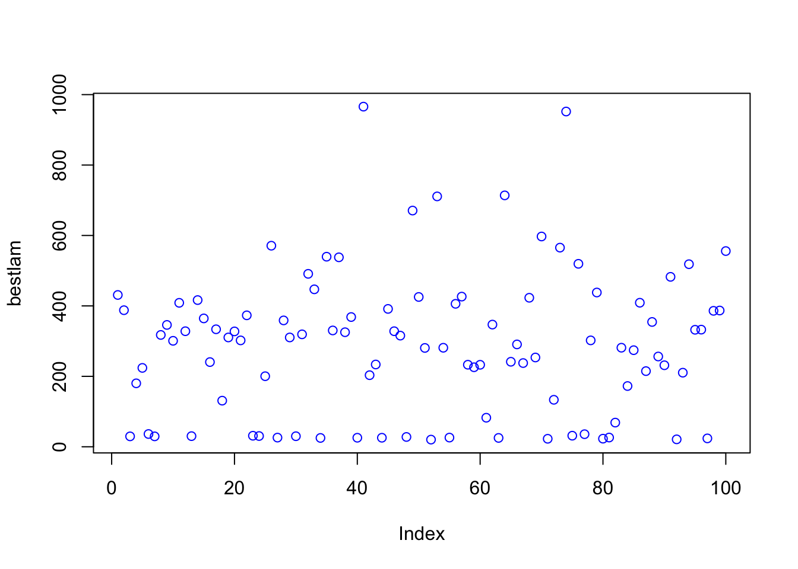
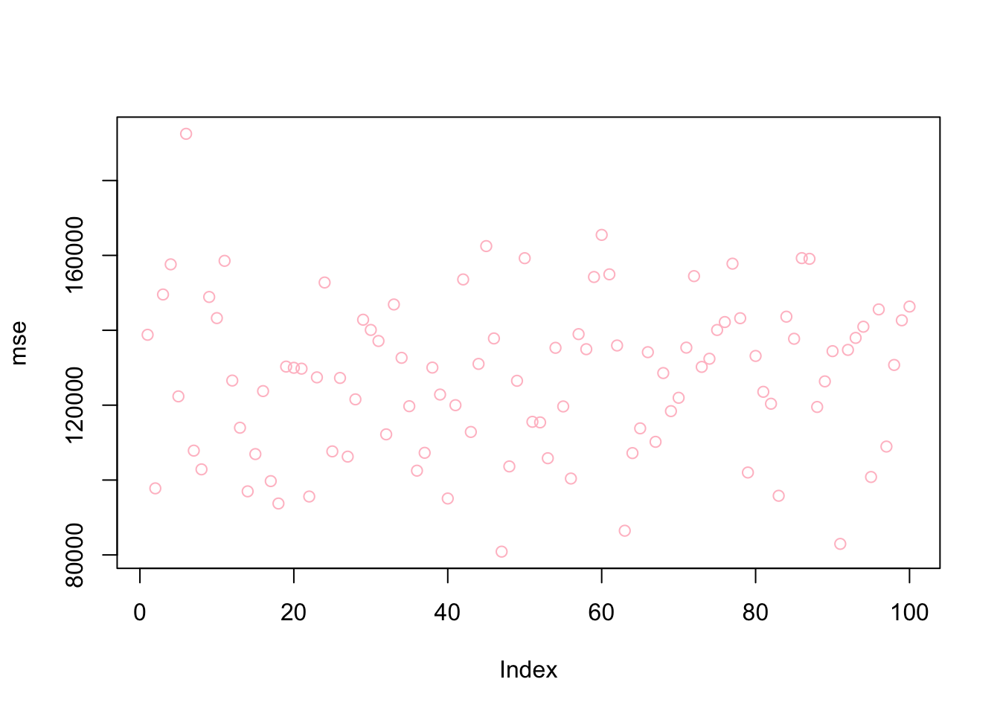

# (PART) Penalized Regressions {-}

# Parametric models in prediction {-}

In simple regression or classification problems, we cannot train a parametric model in a way that the fitted model minimizes the out-of-sample prediction error.  We could (and did) fit the parametric models **manually** by adding or removing predictors and their interactions and polynomials.  As we have seen in earlier chapters, by dropping a variable in a regression, for example, it is possible to reduce the variance at the cost of a negligible increase in bias.  
  
In fitting the predictive model, some of the variables used in a regression may not be well associated with the response. Keeping those "irrelevant" variables often leads to unnecessary complexity in the resulting model. Regularization or penalization is an alternative and automated fitting procedure that refers to a process that removes irrelevant variables or shrinks the magnitude of their parameters, which can yield better prediction accuracy and model interpretability by preventing overfitting.

There are several types of regularization techniques that can be used in parametric models.  Each of these techniques adds a different type of penalty term to the objective function and can be used in different situations depending on the characteristics of the data and the desired properties of the model.  Two methods, Ridge and Lasso, are two of well-known benchmark techniques that reduce the model complexity and prevent overfitting resulting from simple linear regression. 

The general principle in penalization can be shown as 

$$
\widehat{m}_\lambda(\boldsymbol{x})=\operatorname{argmin}\left\{\sum_{i=1}^n \underbrace{\mathcal{L}\left(y_i, m(\boldsymbol{x})\right)}_{\text {loss function }}+\underbrace{\lambda\|m\|_{\ell_q}}_{\text {penalization }}\right\}
$$

where $\mathcal{L}$ could be conditional mean, quantiles, expectiles, $m$ could be linear, logit, splines, tree-based models, neural networks.  The penalization,  $\ell_q$, could be lasso ($\ell_1$) or ridge ($\ell_2$).  And, $\lambda$ regulates overfitting that can be determined by cross-validation or other methods.  It puts a price to pay for a having more flexible model:
  
- $\lambda\rightarrow0$: it interpolates data, low bias, high variance
- $\lambda\rightarrow\infty$: linear model high bias, low variance

There are two fundamental goals in statistical learning: achieving a high prediction accuracy and identifying relevant predictors. The second objective, variable selection, is particularly important when there is a true sparsity in the underlying model. By their nature, penalized parametric models are not well-performing tools for prediction.  But, they provide important tools for model selection specially when $p>N$ and the true model is sparse.  This section starts with two major models in regularized regressions, Ridge and Lasso, and develops an idea on sparse statistical modelling with Adaptive Lasso.

Although there are many sources on the subject, perhaps the most fundamental one is [Statistical Learning with Sparsity](https://hastie.su.domains/StatLearnSparsity/) by Hastie et al. (2015).

# Ridge

The least squares fitting procedure is that one estimates $\beta_{0}, \beta_{1}, \ldots, \beta_{p}$ that minimize the residual sum of squares:

$$
\mathrm{RSS}=\sum_{i=1}^{n}\left(y_{i}-\beta_{0}-\sum_{j=1}^{p} \beta_{j} x_{i j}\right)^{2}
$$
Ridge regression is very similar to least squares, except that the coefficients are estimated by minimizing a slightly different quantity.

$$
\sum_{i=1}^{n}\left(y_{i}-\beta_{0}-\sum_{j=1}^{p} \beta_{j} x_{i j}\right)^{2}+\lambda \sum_{j=1}^{p} \beta_{j}^{2} =\mathrm{RSS}+\lambda \sum_{j=1}^{p} \beta_{j}^{2},
$$

where $\lambda$ is the hyperparameter that can be tuned by cross-validation and grid search.  The last term, $\lambda \sum_{j} \beta_{j}^{2}$, is a constraint, which is also called shrinkage penalty.  This type of penalty is called as $\ell_{2}$ (L-2 penalty).  As with Ordinary Least Squares (OLS), this cost function tries to minimize RSS but also penalizes the size of the coefficients.

More specifically,
  
$$
\hat{\beta}_\lambda^{\text {ridge }}=\operatorname{argmin}\left\{\left\|\mathbf{y}-\left(\beta_0+\mathbf{X} \beta\right)\right\|_{\ell_2}^2+\lambda\|\beta\|_{\ell_2}^2\right\},
$$
  
which has the solution:
  
$$
\hat{\beta}_\lambda=\left(\mathbf{X}^{\top} \mathbf{X}+\lambda \mathbf{I}\right)^{-1} \mathbf{X}^{\top} \mathbf{y}
$$
  
where,

- If $\lambda \rightarrow 0, \quad \hat{\beta}_0^{\text {ridge }}=\hat{\beta}^{\text {ols }}$, 
- If $\lambda \rightarrow \infty, \quad \hat{\beta}_{\infty}^{\text {ridge }}=\mathbf{0}$.  


The hyperparameter $\lambda$ controls the relative impact of the penalization on the regression coefficient estimates. When $\lambda = 0$, the cost function becomes RSS (residual sum of squares), that is the cost function of OLS and the estimations, produce the least squares estimates. However, as $\lambda$ gets higher, the impact of the shrinkage penalty grows, and the coefficients of the ridge regression will approach zero. Note that, the shrinkage penalty is applied to slope coefficients not to the intercept, which is simply the mean of the response, when all features are zero.

Let's apply this to the same data we used earlier, `Hitters` from the [ISLR](http://faculty.marshall.usc.edu/gareth-james/ISL/) [@ISLR_2021] package:


```r
library(ISLR)

remove(list = ls())

data(Hitters)
df <- Hitters[complete.cases(Hitters$Salary), ]
```

We will use the `glmnet` package to fit a ridge regression. The generic function in `glmnet` is defined by 

$$
\min _{\beta_0, \beta} \frac{1}{N} \sum_{i=1}^N w_i l\left(y_i, \beta_0+\beta^T x_i\right)+\lambda\left[(1-\alpha)\|\beta\|_2^2 / 2+\alpha\|\beta\|_1\right] \text {, }
$$
where $l\left(y_i, \eta_i\right)$ is the negative log-likelihood contribution for observation $i$ and $\alpha$ is the elastic net penalty.   When $\alpha=1$ ( the default), the penalty term becomes $\ell_{1}$ and the resulting model is called lasso regression (least absolute shrinkage and selection operator).  When $\alpha=1$, the penalty term becomes $\ell_{2}$ and the resulting model is called ridge regression (some authors use the term Tikhonov–Phillips regularization). As before, the tuning parameter $\lambda$ controls the overall strength of the penalty.  Since the penalty shrinks the coefficients of correlated variables (in Ridge) or pick one of them and discard the others (in Lasso), the variables are supposed to be standardized, which is done by `glmnet`.

The `glmnet` function has a slightly different syntax from other model-fitting functions that we have used so far in this book (`y ~ X`). Therefore, before we execute the syntax, we have the prepare the model so that `X` will be a matrix and `y` will be a vector.  The matrix `X` has to be prepared before we proceed, which must be free of `NA`s.


```r
X  <- model.matrix(Salary ~ ., df)[, -1]
y <- df$Salary
```

The `glmnet` package is maintained by Trevor Hastie who provides a friendly [vignette](https://glmnet.stanford.edu/articles/glmnet.html) [@Hastie_glmnet].  They describe the importance of `model.matrix()` in `glmnet` as follows:

> (...)particularly useful for creating $x$; not only does it produce a matrix corresponding to the 19 predictors but it also automatically transforms any qualitative variables into dummy variables. The latter property is important because `glmnet()` can only take numerical, quantitative inputs.
>

Here is the example for a ridge regression:


```r
library(glmnet)
grid = 10 ^ seq(10,-2, length = 100)
model <- glmnet(X, y, alpha = 0, lambda = grid)
```

Although we defined the grid, we did not do a grid search explicitly by cross validation. Moreover, we do not need to select a grid.  By default, the `glmnet()` function performs ridge regression for an automatically selected range of $\lambda$ values.  It ranges from the null model - only intercept when $\lambda$ is at the upper bound and the least squares fit when the $\lambda$ is at lower bound.
  
The application above is to show that we can also choose to implement the function over a grid of values.  Further, the `glmnet()` function standardizes the variables so that they are on the same scale. To turn off this default setting, we use the argument `standardize=FALSE`.  

The methods here, ridge and lasso, are parametric models.  Unlike non-parametric methods, each model is defined by a set of parameters or, as in our case, coefficients.  Therefore, when we do a grid search, each value of the hyperparameter ($\lambda$) is associated with one model defined by a set of coefficients.  In order to see the coefficients we need to apply another function, `coef()`.  Remember, we have 100 $\lambda's$.  Hence, `coef()` produces a 20 x 100 matrix, with 20 rows (one for each predictor, plus an intercept) and 100 columns (one for each value of $\lambda$).  


```r
dim(coef(model))
```

```
## [1]  20 100
```

```r
model$lambda[c(20, 80)]
```

```
## [1] 4.977024e+07 2.656088e+00
```

```r
coef(model)[, c(20, 80)]
```

```
## 20 x 2 sparse Matrix of class "dgCMatrix"
##                       s19          s79
## (Intercept)  5.358880e+02  156.6073700
## AtBat        1.093664e-05   -1.7526436
## Hits         3.967221e-05    6.1739859
## HmRun        1.598556e-04    1.3285278
## Runs         6.708833e-05   -0.7689372
## RBI          7.086606e-05   -0.1297830
## Walks        8.340541e-05    5.5357165
## Years        3.410894e-04   -9.2923000
## CAtBat       9.390097e-07   -0.0792321
## CHits        3.455823e-06    0.2132942
## CHmRun       2.606160e-05    0.6557328
## CRuns        6.933126e-06    0.8349167
## CRBI         7.155123e-06    0.4090719
## CWalks       7.570013e-06   -0.6623253
## LeagueN     -1.164983e-04   62.0427219
## DivisionW   -1.568625e-03 -121.5286522
## PutOuts      4.380543e-06    0.2809457
## Assists      7.154972e-07    0.3124435
## Errors      -3.336588e-06   -3.6852362
## NewLeagueN  -2.312257e-05  -27.9849755
```

As we see, the coefficient estimates are much smaller when a large value of $\lambda$ is used.
  
We generally use the `predict()` function as before.  But, here we can also use it to estimate the ridge regression coefficients for a new value of $\lambda$.  Hence, if we don't want to rely on the internal grid search provided by `glmnet()`, we can do our own grid search by `predict()`.  This is an example when $\lambda = 50$, which wasn't in the grid.    


```r
predict(model, s = 50, type = "coefficients")
```

```
## 20 x 1 sparse Matrix of class "dgCMatrix"
##                        s1
## (Intercept)  4.876610e+01
## AtBat       -3.580999e-01
## Hits         1.969359e+00
## HmRun       -1.278248e+00
## Runs         1.145892e+00
## RBI          8.038292e-01
## Walks        2.716186e+00
## Years       -6.218319e+00
## CAtBat       5.447837e-03
## CHits        1.064895e-01
## CHmRun       6.244860e-01
## CRuns        2.214985e-01
## CRBI         2.186914e-01
## CWalks      -1.500245e-01
## LeagueN      4.592589e+01
## DivisionW   -1.182011e+02
## PutOuts      2.502322e-01
## Assists      1.215665e-01
## Errors      -3.278600e+00
## NewLeagueN  -9.496680e+00
```
  
There are two ways that we can train ridge (and Lasso):
  
- We use our own training algorithm; 
- Or, we rely on `'glmnet` internal cross-validation process. 

Here is an example for our own algorithm for training ridge regression:   
  

```r
grid = 10^seq(10, -2, length = 100)

MSPE <- c()
MMSPE <- c()

for(i in 1:length(grid)){
  for(j in 1:100){
    set.seed(j)
    ind <- unique(sample(nrow(df), nrow(df), replace = TRUE))
    
    train <- df[ind, ]
    xtrain <- model.matrix(Salary~., train)[,-1]
    ytrain <- df[ind, "Salary"]
    
    test <- df[-ind, ]
    xtest <- model.matrix(Salary~., test)[,-1]
    ytest <- df[-ind, "Salary"]
  
    model <- glmnet(xtrain, ytrain, alpha = 0, lambda = grid[i], thresh = 1e-12)
    yhat <- predict(model, s = grid[i], newx = xtest)
    MSPE[j] <- mean((yhat - ytest)^2)
    }
  MMSPE[i] <- mean(MSPE)
}

min(MMSPE)
```

```
## [1] 119058.3
```

```r
grid[which.min(MMSPE)]
```

```
## [1] 14.17474
```

```r
plot(log(grid), MMSPE, type = "o", col = "red", lwd = 3)
```


What is the tuned model using the last training set with this $\lambda$?  


```r
lambda <- grid[which.min(MMSPE)]
coeff <- predict(model, s = lambda , type = "coefficients", newx = xtrain)
coeff
```

```
## 20 x 1 sparse Matrix of class "dgCMatrix"
##                        s1
## (Intercept)  285.78834247
## AtBat         -1.27240085
## Hits           2.06931134
## HmRun          0.04319066
## Runs           2.75588969
## RBI            0.45631590
## Walks          3.46189297
## Years         -8.82528502
## CAtBat        -0.26127780
## CHits          1.28540111
## CHmRun         1.31904979
## CRuns          0.05880843
## CRBI          -0.05103190
## CWalks        -0.34003983
## LeagueN      131.98795986
## DivisionW   -119.25402540
## PutOuts        0.19785230
## Assists        0.64820842
## Errors        -6.97397640
## NewLeagueN   -54.55149894
```

We may want to compare the ridge with a simple OLS:


```r
MSPE <- c()

for (j in 1:100) {
  set.seed(j)
  ind <- unique(sample(nrow(df), nrow(df), replace = TRUE))
  train <- df[ind,]
  test <- df[-ind, ]
  
  model <- lm(Salary ~ ., data = train)
  yhat <- predict(model, newdata = test)
  MSPE[j] <- mean((yhat - test$Salary) ^ 2)
}
mean(MSPE)
```

```
## [1] 124217.3
```

```r
summary(model)
```

```
## 
## Call:
## lm(formula = Salary ~ ., data = train)
## 
## Residuals:
##     Min      1Q  Median      3Q     Max 
## -715.51 -187.40  -32.85  148.29 1686.38 
## 
## Coefficients:
##               Estimate Std. Error t value Pr(>|t|)  
## (Intercept)  285.95478  126.06479   2.268   0.0248 *
## AtBat         -1.26497    0.94674  -1.336   0.1837  
## Hits           2.02174    3.61275   0.560   0.5766  
## HmRun         -0.01383    8.03787  -0.002   0.9986  
## Runs           2.79786    4.23051   0.661   0.5095  
## RBI            0.47768    3.56888   0.134   0.8937  
## Walks          3.44099    2.57671   1.335   0.1839  
## Years         -8.76533   17.25334  -0.508   0.6122  
## CAtBat        -0.26610    0.20435  -1.302   0.1950  
## CHits          1.31361    1.09982   1.194   0.2343  
## CHmRun         1.35851    2.30018   0.591   0.5557  
## CRuns          0.04142    1.02393   0.040   0.9678  
## CRBI          -0.06982    1.08722  -0.064   0.9489  
## CWalks        -0.33312    0.45479  -0.732   0.4651  
## LeagueN      132.36961  113.39037   1.167   0.2450  
## DivisionW   -119.16837   56.96453  -2.092   0.0382 *
## PutOuts        0.19795    0.10911   1.814   0.0718 .
## Assists        0.64902    0.29986   2.164   0.0321 *
## Errors        -6.97871    5.97011  -1.169   0.2444  
## NewLeagueN   -54.96821  111.81338  -0.492   0.6238  
## ---
## Signif. codes:  0 '***' 0.001 '**' 0.01 '*' 0.05 '.' 0.1 ' ' 1
## 
## Residual standard error: 335.6 on 140 degrees of freedom
## Multiple R-squared:  0.4428,	Adjusted R-squared:  0.3672 
## F-statistic: 5.856 on 19 and 140 DF,  p-value: 1.346e-10
```
  
The second way is to rely on the `glmnet` internal training process, `cv.glmnet`, which is the main function to do cross-validation along with various supporting methods such as plotting and prediction.  A part of the following scripts follows the same algorithm as the one in the book ([Introduction to Statistical Learning](https://www.statlearning.com) - ISLR p.254).  This approach uses a specific grid on $\lambda$.  We also run the same grid search 100 times to see the associated uncertainty.     


```r
# With a defined grid on lambda
bestlam <- c()
mse <- c()
grid = 10 ^ seq(10, -2, length = 100)

for(i in 1:100){
  set.seed(i)
  train <- sample(1:nrow(X), nrow(X) * 0.5) # 50% split
  test <- c(-train)
  ytest <- y[test]

  #finding lambda
  cv.out <- cv.glmnet(X[train,], y[train], alpha = 0)
  bestlam[i] <- cv.out$lambda.min

  #Predicting with that lambda
  ridge.mod <- glmnet(X[train,], y[train], alpha = 0,
                      lambda = grid, thresh = 1e-12)
  yhat <- predict(ridge.mod, s = bestlam[i], newx = X[test,])
  mse[i] <- mean((yhat - ytest)^2)
}

mean(bestlam)
```

```
## [1] 290.227
```

```r
mean(mse)
```

```
## [1] 127472.6
```

```r
plot(bestlam, col = "blue")
```



```r
plot(mse, col = "pink")
```



Now the same application without a specific grid:  


```r
bestlam <- c()
mse <- c()

# Without a pre-defined grid on lambda
for(i in 1:100){
  set.seed(i)
  train <- sample(1:nrow(X), nrow(X) * 0.5) # arbitrary split
  test <- c(-train)
  ytest <- y[test]
  
  cv.out <- cv.glmnet(X[train,], y[train], alpha = 0)
  yhat <- predict(cv.out, s = "lambda.min", newx = X[test,])
  mse[i] <- mean((yhat - ytest) ^ 2)
}

mean(mse)
```

```
## [1] 127481.6
```

```r
plot(mse, col = "pink")
```


Ridge regression adds a penalty term that is the sum of the squares of the coefficients of the features in the model. This results in a penalty that is continuous and differentiable, which makes Ridge regression easy to optimize using gradient descent. Ridge regression can be useful when we have a large number of features but we still want to keep all of the features in the model. Ridge regression works best in situations where the least squares estimates have high variance.

On the other hand, Lasso (Least Absolute Shrinkage and Selection Operator) adds a penalty term that is the sum of the absolute values of the coefficients in the model. This results in a penalty that is non-differentiable, which makes it more difficult to optimize using gradient descent. However, Lasso has the advantage of being able to set the coefficients of some features to exactly zero, effectively eliminating those features from the model. This can be useful when we have a large number of features, and we want to select a subset of the most important features to include in the model.
