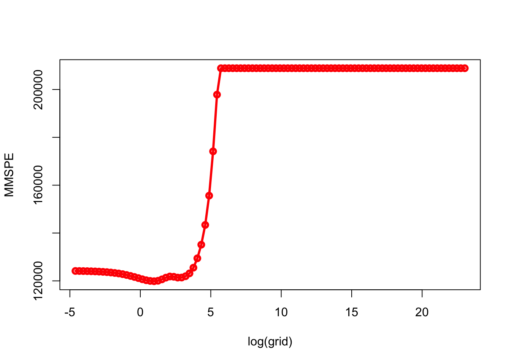

# Lasso

The penalty in ridge regression, $\lambda \sum_{j} \beta_{j}^{2}$, will shrink all of the coefficients towards zero, but it will not set any of them exactly to zero.  This may present a problem in model interpretation when the number of variables is quite large.  One of the key advantages of Lasso is that it can set the coefficients of some features to exactly zero, effectively eliminating those features from the model. By eliminating unnecessary or redundant features from the model, Lasso can help to improve the interpretability and simplicity of the model. This can be particularly useful when you have a large number of features and you want to identify the most important ones for predicting the target variable.

The lasso (least absolute shrinkage and selection operator) is a relatively recent alternative to ridge regression that overcomes this disadvantage. The lasso coefficients minimize the following quantity:

\begin{equation}
\sum_{i=1}^{n}\left(y_{i}-\beta_{0}-\sum_{j=1}^{p} \beta_{j} x_{i j}\right)^{2}+\lambda \sum_{j=1}^{p}\left|\beta_{j}\right|=\operatorname{RSS}+\lambda \sum_{j=1}^{p}\left|\beta_{j}\right|
  (\#eq:16-1)
\end{equation} 

The lasso also shrinks the coefficient estimates towards zero. However, the $\ell_{1}$ penalty, the second term of equation 18.1, has the effect of forcing some of the coefficient estimates to be exactly equal to zero when the tuning parameter $\lambda$ is sufficiently large.  Hence, the lasso performs variable selection. As a result, models generated from the lasso are generally much easier to interpret than those produced by ridge regression.  

In general, one might expect lasso to perform better in a setting where a relatively small number of predictors have substantial coefficients and the remaining predictors have no significant effect on the outcome. This property is known as "sparsity", because it results in a model with a relatively small number of non-zero coefficients.  In some cases, Lasso can find a true sparsity pattern in the data, which means that it can identify a small subset of the most important features that are sufficient to accurately predict the target variable. This can be particularly useful when you have a large number of features, and you want to identify the most important ones for predicting the target variable.

Now, we will apply lasso to the same data in the last chapter, `Hitters`.  Again, we will follow a similar way to compare ridge and lasso as in ISLR :  


```r
library(glmnet)
library(ISLR)
remove(list = ls())

data(Hitters)
df <- Hitters[complete.cases(Hitters$Salary), ]
X  <- model.matrix(Salary~., df)[,-1]
y <- df$Salary

# Without a specific grid on lambda
set.seed(1)
train <- sample(1:nrow(X), nrow(X)*0.5)
test <- c(-train)
ytest <- y[test]

# Ridge
set.seed(1)
ridge.out <- cv.glmnet(X[train,], y[train], alpha = 0)
yhatR <- predict(ridge.out, s = "lambda.min", newx = X[test,])
mse_r <- mean((yhatR - ytest)^2)

# Lasso
set.seed(1)
lasso.out <- cv.glmnet(X[train,], y[train], alpha = 1)
yhatL <- predict(lasso.out, s = "lambda.min", newx = X[test,])
mse_l <- mean((yhatL - ytest)^2)

mse_r
```

```
## [1] 139863.2
```

```r
mse_l
```

```
## [1] 143668.8
```

Now, we will define our own grid search:  


```r
# With a specific grid on lambda + lm()
grid = 10^seq(10, -2, length = 100)

set.seed(1)
train <- sample(1:nrow(X), nrow(X)*0.5)
test <- c(-train)
ytest <- y[test]

#Ridge
ridge.mod <- glmnet(X[train,], y[train], alpha = 0,
                    lambda = grid, thresh = 1e-12)
set.seed(1)
cv.outR <- cv.glmnet(X[train,], y[train], alpha = 0)
bestlamR <- cv.outR$lambda.min
yhatR <- predict(ridge.mod, s = bestlamR, newx = X[test,])
mse_R <- mean((yhatR - ytest)^2)

# Lasso
lasso.mod <- glmnet(X[train,], y[train], alpha = 1,
                    lambda = grid, thresh = 1e-12)
set.seed(1)
cv.outL <- cv.glmnet(X[train,], y[train], alpha = 1)
bestlamL <- cv.outL$lambda.min
yhatL <- predict(lasso.mod, s = bestlamL, newx = X[test,])
mse_L <- mean((yhatL - ytest)^2)

mse_R
```

```
## [1] 139856.6
```

```r
mse_L
```

```
## [1] 143572.1
```

Now we will apply our own algorithm


```r
grid = 10^seq(10, -2, length = 100)
MSPE <- c()
MMSPE <- c()

for(i in 1:length(grid)){
  for(j in 1:100){
    set.seed(j)
    ind <- unique(sample(nrow(df), nrow(df), replace = TRUE))
    
    train <- df[ind, ]
    xtrain <- model.matrix(Salary~., train)[,-1]
    ytrain <- df[ind, 19]
    
    test <- df[-ind, ]
    xtest <- model.matrix(Salary~., test)[,-1]
    ytest <- df[-ind, 19]
  
    model <- glmnet(xtrain, ytrain, alpha = 1,
                    lambda = grid[i], thresh = 1e-12)
    yhat <- predict(model, s = grid[i], newx = xtest)
    MSPE[j] <- mean((yhat - ytest)^2)
    }
  MMSPE[i] <- mean(MSPE)
}

min(MMSPE)
```

```
## [1] 119855.1
```

```r
grid[which.min(MMSPE)]
```

```
## [1] 2.656088
```

```r
plot(log(grid), MMSPE, type="o", col = "red", lwd = 3)
```



What are the coefficients?


```r
coef_lasso <- coef(model, s=grid[which.min(MMSPE)], nonzero = T)
coef_lasso
```

```
## NULL
```

We can also try a classification problem with LPM or Logistic regression when the response is categorical. If there are two possible outcomes, we use the binomial distribution, else we use the multinomial.

# Adaptive Lasso

Unlike lasso, which uses a simple $\ell_{1}$ penalty, adaptive lasso uses a weighted $\ell_{1}$ penalty. The weights are chosen to adapt to the correlation structure of the data, which can result in a more stable model with fewer coefficients being exactly zero. Adaptive lasso is a method for regularization and variable selection in regression analysis that was introduced by Zou (2006) in [The Adaptive Lasso and Its Oracle Properties](http://users.stat.umn.edu/~zouxx019/Papers/adalasso.pdf) by Zou (2006). In this paper, the author proposed the use of a weighted $\ell_{1}$ penalty in the objective function, with the weights chosen to adapt to the correlation structure of the data. He showed that this method can result in a more stable model with fewer coefficients being exactly zero, compared to the standard lasso method which uses a simple $\ell_{1}$ penalty. The adaptive lasso enjoys the oracle properties; namely, it performs as well as if the true underlying model were given in advance. 

Since its introduction, adaptive lasso has been widely used in a variety of applications in statistical modeling and machine learning. It has been applied to problems such as feature selection in genomic data, high-dimensional regression, and model selection in generalized linear models.  Adaptive lasso is useful in situations where the predictors are correlated and there is a need to select a small subset of important variables to include in the model. It is also useful in situations where the goal is to identify a representative model from the set of all possible models, rather than just selecting a single model. 

Consider the linear regression model:

$$
y_i=x_i^{\prime} \beta^0+\epsilon_i, ~~~~i=1, \ldots, n ~~~~\text{and} ~~~~\beta^0 \text { is } (p \times 1)
$$
The adaptive Lasso estimates $\beta^0$ by minimizing
  
$$
L(\beta)=\sum_{i=1}^n\left(y_i-x_i^{\prime} \beta\right)^2+\lambda_n \sum_{j=1}^p \frac{1}{w_j}\left|\beta_j\right|
$$
  
where, typically $w_j=(\left|\hat{\beta}_{O L S_j}\right|)^{\gamma}$ or $w_j=(\left|\hat{\beta}_{Ridge_j}\right|)^{\gamma}$, where $\gamma$ is a positive constant for adjustment of the Adaptive Weights vector, and suggested to be the possible values of 0.5, 1, and 2.

The weights in Adaptive lasso (AL) are more "intelligent" than those for the plain Lasso. The plain Lasso penalizes all parameters equally, while the adaptive Lasso is likely to penalize non-zero coefficients less than the zero ones. This is due to the fact, that the weights are based on the consistent least squares estimator. If $\beta_{AL, j}=0$, then $\hat{\beta}_{O L S, j}$ is likely to be close to zero and so $w_j$ is small. Hence, truly zero coefficients are penalized a lot.  However, it might require a two-step procedure as opposed to the one-step plain Lasso. Some studies (Zou, 2006) state that the plain lasso is not oracle efficient (consistency in variable selection and asymptotic normality in coefficient estimation) while adaptive lasso is.

Here is an example:  


```r
library(ISLR)
library(glmnet)

remove(list = ls())

data(Hitters)
df <- Hitters[complete.cases(Hitters$Salary), ]
X  <- model.matrix(Salary~., df)[,-1]
y <- df$Salary

# Ridge weights with gamma = 1
g = 1
set.seed(1)
modelr <- cv.glmnet(X, y, alpha = 0)
coefr <- as.matrix(coef(modelr, s = modelr$lambda.min))
w.r <- 1/(abs(coefr[-1,]))^g

## Adaptive Lasso
set.seed(1)
alasso <- cv.glmnet(X, y, alpha=1, penalty.factor = w.r)

## Lasso
set.seed(1)
lasso <- cv.glmnet(X, y, alpha=1)

# Sparsity
cbind(LASSO = coef(lasso, s="lambda.1se"),
           ALASSO = coef(alasso, s="lambda.1se"))
```

```
## 20 x 2 sparse Matrix of class "dgCMatrix"
##                       s1          s1
## (Intercept) 127.95694754   -7.109481
## AtBat         .             .       
## Hits          1.42342566    2.054867
## HmRun         .             .       
## Runs          .             .       
## RBI           .             .       
## Walks         1.58214111    3.573120
## Years         .            31.573334
## CAtBat        .             .       
## CHits         .             .       
## CHmRun        .             .       
## CRuns         0.16027975    .       
## CRBI          0.33667715    .       
## CWalks        .             .       
## LeagueN       .            29.811080
## DivisionW    -8.06171262 -138.088953
## PutOuts       0.08393604    .       
## Assists       .             .       
## Errors        .             .       
## NewLeagueN    .             .
```

We can see the difference between lasso and adaptive lasso in this example: `PutOuts`, `CRuns`, and `CRBI` picked by lasso are not selected by adaptive lasso. There are only three common features in both methods: `Hits`, `Walks`, and `DivisionW`. To understand which model is better in terms of catching the true sparsity, we will have a simulation to illustrate some of the properties of the Lasso and the adaptive Lasso.

# Sparsity

This is a simulation to illustrate some of the properties of Lasso-type estimations. There are two objectives in using these penalized regressions: model selection (identifying "correct" sparsity) and prediction accuracy.  These two objectives require different optimization approaches and usually are not compatible. In model selection, the objective is to shrink the dimension of the model to the “true” sparsity. This is usually evaluated by checking whether the Oracle properties are satisfied.  These asymptotic properties look at (1) if the model identified by the penalized regression converges to the “true” sparsity, (2) if the coefficients are consistent.

The literature suggests that Lasso is not an “Oracle” estimator. Adaptive Lasso was developed (Zou 2006) to fill this gap.

Let's specify a data generating process with a linear regression model:

$$
y_i=x_i^{\prime} \beta_0+u_i, ~~~~~i=1, \ldots, n
$$

where $\beta_0$ is $p \times 1$. First, we consider the case where $p<n$ then move to the case where $p \geq n$.  We define $\beta_0=(1,1,0,0)^{\prime}$ and $n=100$.


```r
#This function generates the data
dgp <- function(N, Beta){
  p = length(Beta)
  
  X <- matrix(rnorm(N*p), ncol = p)
  u <- matrix(rnorm(N), ncol = 1)
  dgm <- X%*%Beta
  y <- X%*%Beta + u

  return <- list(y, X)
}

N = 100
Beta = c(1,1,0,0)

set.seed(148)
Output <- dgp(N, Beta)
y <-Output[[1]]
X <-Output[[2]]
```

First, we apply lasso


```r
library(glmnet)

set.seed(432)
lasso <- glmnet(x = X, y = y, family = "gaussian")

beta_hat <- lasso$beta
S_matrix <- cbind(t(beta_hat), "lambda" = lasso$lambda)
S_matrix[c(1:8, 25:30, 55:60), ] # selected rows
```

```
## 20 x 5 sparse Matrix of class "dgCMatrix"
##             V1        V2          V3         V4      lambda
## s0  .          .          .          .          1.083220708
## s1  0.09439841 0.0283513  .          .          0.986990366
## s2  0.17344129 0.1097255  .          .          0.899308862
## s3  0.24546220 0.1838706  .          .          0.819416741
## s4  0.31108496 0.2514289  .          .          0.746622016
## s5  0.37087798 0.3129855  .          .          0.680294174
## s6  0.42535915 0.3690736  .          .          0.619858715
## s7  0.47500037 0.4201789  .          .          0.564792175
## s24 0.87944075 0.8365481  .          .          0.116150206
## s25 0.88874261 0.8461243  .          .          0.105831742
## s26 0.89685610 0.8542117 -0.00686322 .          0.096429941
## s27 0.90418482 0.8614679 -0.01432988 .          0.087863371
## s28 0.91086250 0.8680794 -0.02113323 .          0.080057832
## s29 0.91694695 0.8741036 -0.02733218 .          0.072945714
## s54 0.98352129 0.9289175 -0.09282009 0.05192379 0.007126869
## s55 0.98423271 0.9294382 -0.09350608 0.05278151 0.006493738
## s56 0.98488092 0.9299126 -0.09413113 0.05356303 0.005916852
## s57 0.98547155 0.9303449 -0.09470066 0.05427512 0.005391215
## s58 0.98600972 0.9307388 -0.09521958 0.05492395 0.004912274
## s59 0.98650007 0.9310977 -0.09569241 0.05551515 0.004475881
```
  
Which beta_hat? To answer this question we need to find the lambda.  We need $\lambda_n \rightarrow \infty$ in order to shrink the truly zero coefficients to zero. This requires $\lambda_n$ to be sufficiently large.  On the other hand, $\lambda_n / \sqrt{n} \rightarrow 0$ is needed in order not to shrink too much. This would introduce asymptotic bias to the non-zero coefficients. Information-criterion based model selection is very fast, but it relies on a proper estimation of degrees of freedom, are derived for large samples (asymptotic results) and assume the model is correct, i.e. that the data are actually generated by this model. In practice, choosing $\lambda_n$ by $\mathrm{BIC}$ results in consistent model selection in the fixed $p$ setting, i.e., Let $\mathcal{A}=\left\{j: \beta_{0, j} \neq 0\right\}$,  active set or relevant variables
  
$$
P\left(\hat{\mathcal{A}}_{\lambda_{BIC}}=\mathcal{A}\right) \rightarrow 1
$$

We find lambda by minimum Bayesian Information Criterion (BIC). Let $S S E_\lambda$ be the sum of squared error terms for a given value of $\lambda$ and $n z_\lambda$ be the number of non-zero coefficients. Then,
  
$$
B I C_\lambda=\log \left(S S E_\lambda\right)+\frac{\log (n)}{n} n z_\lambda
$$


```r
# Predict yhat for each of 61 lambda (s)
y_hat = predict(lasso, newx = X)
dim(y_hat)
```

```
## [1] 100  60
```

```r
# SSE for each lambda (s)
SSE <- c()
for (i in 1:ncol(y_hat)) {
  SSE_each <- sum((y_hat[,i]-y[,1])^(2))
  SSE <- c(SSE, SSE_each)
}

# BIC
nz <- colSums(beta_hat!=0) # Number of non-zero coefficients for each lambda
BIC <- log(SSE) + (log(N)/N)*nz #Now BIC
BIC
```

```
##       s0       s1       s2       s3       s4       s5       s6       s7 
## 5.598919 5.595359 5.468287 5.348947 5.237755 5.135013 5.040883 4.955387 
##       s8       s9      s10      s11      s12      s13      s14      s15 
## 4.878394 4.809638 4.748729 4.695181 4.648437 4.607898 4.572946 4.542971 
##      s16      s17      s18      s19      s20      s21      s22      s23 
## 4.517383 4.495631 4.477205 4.461646 4.448541 4.437530 4.428295 4.420563 
##      s24      s25      s26      s27      s28      s29      s30      s31 
## 4.414098 4.408698 4.448661 4.443309 4.438844 4.435121 4.432021 4.429439 
##      s32      s33      s34      s35      s36      s37      s38      s39 
## 4.427290 4.425503 4.424017 4.468004 4.466218 4.464732 4.463498 4.462471 
##      s40      s41      s42      s43      s44      s45      s46      s47 
## 4.461618 4.460910 4.460321 4.459832 4.459426 4.459088 4.458808 4.458575 
##      s48      s49      s50      s51      s52      s53      s54      s55 
## 4.458382 4.458222 4.458088 4.457978 4.457886 4.457810 4.457746 4.457694 
##      s56      s57      s58      s59 
## 4.457650 4.457614 4.457584 4.457559
```
  
Let's select $\lambda$ that has the minimum BIC


```r
beta_lasso <- beta_hat[ ,which(BIC==min(BIC))]
beta_lasso
```

```
##        V1        V2        V3        V4 
## 0.8887426 0.8461243 0.0000000 0.0000000
```

This is the `beta_hat` that identifies the true sparsity. And, the second Oracle property, the $\ell_2$ error:


```r
l_2 <- sqrt(sum((beta_lasso - Beta)^2))
l_2
```

```
## [1] 0.189884
```

Here we will create a simulation that will report two Oracle Properties Lasso and Adaptive Lasso:

- True sparsity,  
- $\ell_2$  error.  

**Lasso**
  
We first have a function, `msc()`, that executes a simulation with all the steps shown before:


```r
mcs <- function(mc, N, Beta){
  mcmat <- matrix(0, nrow = mc, ncol = 3)
  beta_lasso_mat <- matrix(0, nr = mc, nc = length(Beta))
  
  for (i in 1:mc) {
    set.seed(i)
    data <- dgp(N, Beta)
    y <- data[[1]]
    X <- data[[2]]
    
    set.seed(i)
    lasso <- glmnet(x = X, y = y, family = "gaussian")
    beta_hat <- lasso$beta; # beta_hat is a matrix
    y_hat = predict(lasso, newx = X)
    
    SSE <- c()
    for (j in 1:ncol(y_hat)) {
      SSE_each <- sum((y_hat[,j]-y[,1])^(2))
      SSE <- c(SSE, SSE_each)
    }
    
    nz <- colSums(beta_hat!=0) 
    BIC <- log(SSE) + (log(N)/N)*nz
    beta_lasso <- beta_hat[ ,which(BIC==min(BIC))]
    nonz_beta = length(Beta[Beta==0])
    nonz_beta_hat = length(beta_lasso[beta_lasso==0])
    
    mcmat[i,1] <- sqrt(sum((beta_lasso - Beta)^2))
    mcmat[i,2] <- ifelse(nonz_beta!= nonz_beta_hat, 0, 1)
    mcmat[i,3] <- sum(beta_lasso!=0)
    beta_lasso_mat[i,] <- beta_lasso
  }
  return(list(mcmat,beta_lasso_mat))
}
```

We are ready for simulation:


```r
mc <- 500
N <- 1000
Beta <- matrix(c(1,1,0,0), nc = 1)
output <- mcs(mc, N, Beta) #see the function

MC_betas = output[[2]]
MC_performance = output[[1]];
sum(MC_performance[,2]) #how many times lasso finds true sparsity
```

```
## [1] 400
```

This is the first property: lasso identifies the true sparsity $400/500 = 80\%$ of cases. And the second property, $\ell_2$ error, in the simulation is (in total):  


```r
sum(MC_performance[,1])
```

```
## [1] 29.41841
```

**Adaptive Lasso**
  
This time we let our adaptive lasso use lasso coefficients as penalty weights in `glmnet()`.   Let's have the same function with Adaptive Lasso for the simulation:


```r
# Adaptive LASSO
mcsA <- function(mc, N, Beta){
  
  mcmat <- matrix(0, nr = mc, nc = 3)
  beta_lasso_mat <- matrix(0, nr = mc, nc = length(Beta))
  
  for (i in 1:mc) {
    data <- dgp(N, Beta)
    y <- data[[1]]
    X <- data[[2]]
    
    lasso <- glmnet(x = X, y = y, family = "gaussian")
    beta_hat <- lasso$beta;
    y_hat = predict(lasso, newx = X)
    
    SSE <- c()
    for (j in 1:ncol(y_hat)) {
      SSE_each <- sum((y_hat[,j]-y[,1])^(2))
      SSE <- c(SSE, SSE_each)
    }
    
    nz <- colSums(beta_hat!=0)
    BIC <- log(SSE) + (log(N)/N)*nz
    beta_lasso <- beta_hat[ ,which(BIC==min(BIC))]
    
    weights = abs(beta_lasso)^(-1)
    weights[beta_lasso==0] = 10^10 # to handle inf's
    
    #Now Adaptive Lasso
    lasso <- glmnet(x = X, y = y, family = "gaussian", penalty.factor = weights)
    beta_hat <- lasso$beta;
    y_hat = predict(lasso, newx = X)
    
    SSE <- c()
    for (j in 1:ncol(y_hat)) {
      SSE_each <- sum((y_hat[,j]-y[,1])^(2))
      SSE <- c(SSE, SSE_each)
    }
    
    nz <- colSums(beta_hat!=0)
    BIC <- log(SSE) + (log(N)/N)*nz
    beta_lasso <- beta_hat[ ,which(BIC==min(BIC))]
    nonz_beta = length(Beta[Beta==0])
    nonz_beta_hat = length(beta_lasso[beta_lasso==0])
    
    mcmat[i,1] <- sqrt(sum((beta_lasso - Beta)^2))
    mcmat[i,2] <- ifelse(nonz_beta!= nonz_beta_hat, 0, 1)
    mcmat[i,3] <- sum(beta_lasso!=0)
    beta_lasso_mat[i,] <- beta_lasso
  }
  return(list(mcmat,beta_lasso_mat))
}
```

Here are the results for adaptive lasso


```r
mc <- 500
N <- 1000
beta <- matrix(c(1,1,0,0), nc = 1)
output <- mcsA(mc, N, beta) #see the function

MC_betas = output[[2]]
MC_performance = output[[1]];
sum(MC_performance[,2])
```

```
## [1] 492
```

And,


```r
sum(MC_performance[,1])
```

```
## [1] 20.21311
```

The simulation results clearly show that Adaptive Lasso is an Oracle estimator while the regular Lasso is not. Therefore, in model selection, Adaptive Lasso is a better choice.  We saw here a basic application of a plain adaptive lasso. It has many different variations in practice such as Thresholded Lasso and Rigorous Lasso.  Application of lasso on model selection has been an active research area.  One of the well-known applications is the double lasso method introduced by Victor Chernozhukov that can be used for variable selections.  Moreover, lasso type applications are also used in time-series forecasting and graphical network analysis for dimension reductions. 


