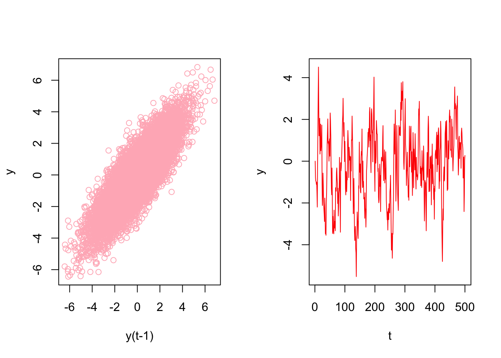

# Time Series Embedding

In general, forecasting models use either direct or recursive forecasting, or their combinations (See [Taieb and Hyndman](https://robjhyndman.com/papers/rectify.pdf), 2012).  The difference between these two methods is related to discussion on prediction accuracy and forecasting variance. As we see below, recursive forecasting requires a parametric model and would face increasing forecasting error when the underlying model is not linear. Direct forecasting, however, can be achieved by a nonparametric predictive algorithm, while it may have a higher variance as the forecast horizon gets longer.  

Multi-period recursive forecasting use a single time series model, like AR(1).  With iterative substitutions of the estimated model, any forecast period of $h$ can be computed.  Let's start with a simple AR(1) to see recursive forecasting:

$$
x_{t+1}=\alpha_0+\phi_1 x_t+\epsilon_{t}
$$

If we use this AR(1) to have a 3-period forecast:

$$
\hat{x}_{t+1}=\hat{\alpha}_0+\hat{\phi}_1 x_t, \\
\hat{x}_{t+2}=\hat{\alpha}_0+\hat{\phi}_1 \hat{x}_{t+1}, \\
\hat{x}_{t+3}=\hat{\alpha}_0+\hat{\phi}_1 \hat{x}_{t+2}
$$
With iterative substitutions:

$$
\hat{x}_{t+1}=\hat{\alpha}_0+\hat{\phi}_1 x_t ~~~~ 1^{st} ~ \text{Period}\\
\hat{x}_{t+2}=\hat{\alpha}_0+\hat{\alpha}_0\hat{\alpha}_1+\hat{\phi}^2_1 x_{t} ~~~~ 2^{nd} ~ \text{Period}\\
\hat{x}_{t+3}=\hat{\alpha}_0+\hat{\alpha}_0\hat{\alpha}_1+\hat{\alpha}_0\hat{\alpha}^2_1+\hat{\phi}^3_1 x_t~~~~ 3^{rd} ~ \text{Period}
$$

Of course, we can generalize it for $h$ periods:

$$
\hat{x}_{t+h}=\hat{\alpha}_0 \sum_{i=1}^h \hat{\phi}_1^{i-1}+\hat{\phi}_1^h x_t
$$

The estimated coefficients ($\hat{\alpha}_0$, $\hat{\phi}_1$) are the same; hence, we need only one model for any period.

Alternatively, we can apply the direct multi-period forecasting, where a separate predictive model for each forecasting horizon between $h$ and $t$ is estimated. Here is the example with AR(1):

$$
x_{t+1}=\alpha_0+\alpha_1 x_t+\epsilon_{t}, \\
x_{t+2}=\beta_0+\beta_1 x_t+\epsilon_{t}, \\
x_{t+3}=\omega_0+\omega_1 x_t+\epsilon_{t}. \\
$$
  
And, the 3-period direct forecasts with three different models:

$$
\hat{x}_{t+1}=\hat{\alpha}_0+\hat{\alpha}_1 x_t ~~~~ 1^{st} ~ \text{Period}\\
\hat{x}_{t+2}=\hat{\beta}_0+\hat{\beta}_1 x_{t} ~~~~ 2^{nd} ~ \text{Period}\\
\hat{x}_{t+3}=\hat{\omega}_0+\hat{\omega}_1x_t~~~~ 3^{rd} ~ \text{Period}
$$
 
## VAR for Recursive Forecasting

The problem with a multi-period recursive forecasting becomes clear when we have multivariate model:

$$
y_{t+1}=\beta_0+\beta_1 y_t+\beta_2x_t+\epsilon_{t}
$$

If we want a 2-period forecast,

$$
\hat{y}_{t+2}=\hat{\beta}_0+\hat{\beta}_1 \hat{y}_{t+1}+\hat{\beta}_2 \hat{x}_{t+1},
$$

Hence, $\hat{x}_{t+1}$ has to be estimated.  This can be done with a Vector Autorregressive (VAR) framework.  A VAR model consists of multiple equations, one per variable. Each equation includes a constant and lags of all of the variables in the system.

$$
\begin{aligned}
& y_{t}=c_1+\beta_{1} y_{t-1}+\beta_{2} x_{t-1}+\varepsilon_{t} \\
& x_{t}=c_2+\phi_{1} x_{t-1}+\phi_{2} y_{t-1}+e_{t}
\end{aligned}
$$

Each model is estimated using the principle of ordinary least squares, given that series are stationary. Forecasts in VAR are calculated with recursive iterations. Therefore, the set of equations generates forecasts for each variable. To decide the number of lags in each equation, the BIC is used  

Let's have our COVID-19 data and include the mobility to forecasting


```r
library(tsibble)
library(fpp3)

load("~/Dropbox/ToolShed_draft/dftoronto.RData")
day <- seq.Date(from = as.Date("2020/03/01"),
                         to = as.Date("2020/11/21"), by = 1)

tdata <- tibble(Day = day, mob = data$mob, cases = data$cases)
toronto <- tdata %>%
  as_tsibble(index = Day)
toronto
```

```
## # A tsibble: 266 x 3 [1D]
##    Day             mob cases
##    <date>        <dbl> <dbl>
##  1 2020-03-01 -0.0172      4
##  2 2020-03-02 -0.0320      6
##  3 2020-03-03 -0.0119     10
##  4 2020-03-04  0.0186      7
##  5 2020-03-05  0.0223      7
##  6 2020-03-06 -0.00626    10
##  7 2020-03-07  0.0261      8
##  8 2020-03-08  0.0273     10
##  9 2020-03-09 -0.0158     18
## 10 2020-03-10 -0.0521     29
## # … with 256 more rows
```

We will estimate the recursive forecasts for 1 to 14 days ahead. 


```r
# We need make series stationary
trdf <- toronto %>%
            mutate(diffcases = difference(cases),
                   diffmob = difference(mob))

# VAR with BIC
fit <- trdf[-1,] %>%
  model(
    VAR(vars(diffcases, diffmob), ic = "bic")
  )
glance(fit)
```

```
## # A tibble: 1 × 6
##   .model                                      sigma2   log_lik   AIC  AICc   BIC
##   <chr>                                       <list>     <dbl> <dbl> <dbl> <dbl>
## 1 "VAR(vars(diffcases, diffmob), ic = \"bic\… <dbl[…]>   -854. 1755. 1760. 1841.
```

```r
fit %>% report()
```

```
## Series: diffcases, diffmob 
## Model: VAR(5) 
## 
## Coefficients for diffcases:
##       lag(diffcases,1)  lag(diffmob,1)  lag(diffcases,2)  lag(diffmob,2)
##                -0.4074       -105.6524           -0.0703         11.0374
## s.e.            0.0639         28.3643            0.0695         29.9761
##       lag(diffcases,3)  lag(diffmob,3)  lag(diffcases,4)  lag(diffmob,4)
##                 0.0528         10.8093           -0.0123         -4.8989
## s.e.            0.0701         31.8601            0.0713         30.0019
##       lag(diffcases,5)  lag(diffmob,5)
##                 0.0227          6.1099
## s.e.            0.0640         29.2678
## 
## Coefficients for diffmob:
##       lag(diffcases,1)  lag(diffmob,1)  lag(diffcases,2)  lag(diffmob,2)
##                  0e+00          -0.314             0e+00         -0.4688
## s.e.             1e-04           0.057             1e-04          0.0603
##       lag(diffcases,3)  lag(diffmob,3)  lag(diffcases,4)  lag(diffmob,4)
##                  1e-04         -0.2931            -1e-04         -0.2664
## s.e.             1e-04          0.0641             1e-04          0.0603
##       lag(diffcases,5)  lag(diffmob,5)
##                  3e-04         -0.4059
## s.e.             1e-04          0.0588
## 
## Residual covariance matrix:
##           diffcases diffmob
## diffcases  811.6771 -0.1648
## diffmob     -0.1648  0.0033
## 
## log likelihood = -853.64
## AIC = 1755.28	AICc = 1760.38	BIC = 1840.73
```

```r
fit %>%
  forecast(h=14) %>%
  autoplot(trdf[-c(1:200),])
```


  
We should have transformed both series by the Box-Cox transformation, but we ignored it above.

## Embedding for Direct Forecast

For direct forecasting, we need to rearrange the data in a way that we can estimate 7 models for forecasting ahead each day of 7 days.  We will use `embed()` function to show what we mean with rearranging data for AR(3), for example: 


```r
Y <- 1:10
Y <- embed(Y, 3)
colnames(Y)=c("Y(t)","Y(t-1)","Y(t-2)")
Y
```

```
##      Y(t) Y(t-1) Y(t-2)
## [1,]    3      2      1
## [2,]    4      3      2
## [3,]    5      4      3
## [4,]    6      5      4
## [5,]    7      6      5
## [6,]    8      7      6
## [7,]    9      8      7
## [8,]   10      9      8
```

Now the key point is there is no a temporal dependence between each row so that shuffling this data after re-structuring it admissible.  Let's have an AR(1) example on this simulated data


```r
# Stationary data rho < 1 but = 0.85
n <- 10000
rho <- 0.85

y <- c(0, n)
set.seed(345)
eps <- rnorm(n, 0, 1)

for(j in 1:(n-1)) {
  y[j+1] <- y[j]*rho + eps[j]
  }

ylagged <- y[2:n]

par(mfrow=c(1,2))
plot(ylagged, y[1:(n-1)], col = "lightpink",
     ylab = "y", xlab = "y(t-1)")
plot(y[1:500], type = "l", col = "red",
     ylab = "y", xlab = "t")
```


   
We will use an AR(1) estimation with OLS after embedding:


```r
y_em <- embed(y, 2)
head(y)
```

```
## [1]  0.0000000 -0.7849082 -0.9466863 -0.9661413 -1.1118166 -1.0125757
```

```r
colnames(y_em) <- c("yt", "yt_1")
head(y_em)
```

```
##              yt       yt_1
## [1,] -0.7849082  0.0000000
## [2,] -0.9466863 -0.7849082
## [3,] -0.9661413 -0.9466863
## [4,] -1.1118166 -0.9661413
## [5,] -1.0125757 -1.1118166
## [6,] -1.4942098 -1.0125757
```
And estimation of AR(1) with OLS:


```r
y_em <- as.data.frame(y_em)
ar1 <- lm(yt ~ yt_1 - 1, y_em)
ar1
```

```
## 
## Call:
## lm(formula = yt ~ yt_1 - 1, data = y_em)
## 
## Coefficients:
##   yt_1  
## 0.8496
```
  
Now, let's shuffle `y_em`:


```r
# Shuffle
ind <- sample(nrow(y_em), nrow(y_em), replace = FALSE)
y_em_sh <- y_em[ind, ]

ar1 <- lm(yt ~ yt_1 - 1, y_em_sh)
ar1
```

```
## 
## Call:
## lm(formula = yt ~ yt_1 - 1, data = y_em_sh)
## 
## Coefficients:
##   yt_1  
## 0.8496
```
This proves the temporal independence across the observations in the rearranged data.  This is important because the temporal order in the time series data would not affect the cross-validation process or bootstrapping applications in a grid search anymore.  When we have this freedom, we can use all conventional machine learning applications on time series data, like random forests, which we see in the next chapter.   

This re-arrangement can also be applied to multivariate data sets:


```r
tsdf <- matrix(c(1:10, 21:30), nrow = 10)
colnames(tsdf) <- c("Y", "X")
first <- embed(tsdf, 3)
colnames(first) <- c("y(t)","x(t)","y(t-1)","x(t-1)", "y(t-2)", "x(t-2)")
head(first)
```

```
##      y(t) x(t) y(t-1) x(t-1) y(t-2) x(t-2)
## [1,]    3   23      2     22      1     21
## [2,]    4   24      3     23      2     22
## [3,]    5   25      4     24      3     23
## [4,]    6   26      5     25      4     24
## [5,]    7   27      6     26      5     25
## [6,]    8   28      7     27      6     26
```
Now, we need to have three models for three forecasting horizons.  Here are these models:

$$
\hat{y}_{t+1}=\hat{\alpha}_0+\hat{\alpha}_1 y_t + \hat{\alpha}_2 y_{t-1}+ \hat{\alpha}_3 x_t + \hat{\alpha}_4 x_{t-1}+ \hat{\alpha}_5 x_{t-2} ~~~~ 1^{st} ~ \text{Period}\\
\hat{y}_{t+2}=\hat{\beta}_0+\hat{\beta}_1 y_t + \hat{\beta}_2 y_{t-1}+ \hat{\beta}_3 x_t + \hat{\beta}_4 x_{t-1}+ \hat{\beta}_5 x_{t-2} ~~~~ 2^{nd} ~ \text{Period}\\
\hat{y}_{t+3}=\hat{\omega}_0+\hat{\omega}_1 y_t + \hat{\omega}_2 y_{t-1}+ \hat{\omega}_3 x_t + \hat{\omega}_4 x_{t-1}+ \hat{\omega}_5 x_{t-2} ~~~~ 3^{rd} ~ \text{Period}
$$
Each one of these models requires a different rearrangement in the data.  Here are the required arrangement for each model:    


```
##      y(t) x(t) y(t-1) x(t-1) y(t-2) x(t-2)
## [1,]    3   23      2     22      1     21
## [2,]    4   24      3     23      2     22
## [3,]    5   25      4     24      3     23
## [4,]    6   26      5     25      4     24
## [5,]    7   27      6     26      5     25
## [6,]    8   28      7     27      6     26
```

```
##      y(t) x(t-1) y(t-2) x(t-2) y(t-3) x(t-3)
## [1,]    4     23      2     22      1     21
## [2,]    5     24      3     23      2     22
## [3,]    6     25      4     24      3     23
## [4,]    7     26      5     25      4     24
## [5,]    8     27      6     26      5     25
## [6,]    9     28      7     27      6     26
```

```
##      y(t) x(t-2) y(t-3) x(t-3) y(t-4) x(t-4)
## [1,]    5     23      2     22      1     21
## [2,]    6     24      3     23      2     22
## [3,]    7     25      4     24      3     23
## [4,]    8     26      5     25      4     24
## [5,]    9     27      6     26      5     25
## [6,]   10     28      7     27      6     26
```
We already rearranged the data for the first model. if we remove the first row in `y(t)` and the last row in the remaining set, we can get the the data for the second model:


```r
cbind(first[-1,1], first[-nrow(first),-1])
```

```
##      [,1] [,2] [,3] [,4] [,5] [,6]
## [1,]    4   23    2   22    1   21
## [2,]    5   24    3   23    2   22
## [3,]    6   25    4   24    3   23
## [4,]    7   26    5   25    4   24
## [5,]    8   27    6   26    5   25
## [6,]    9   28    7   27    6   26
## [7,]   10   29    8   28    7   27
```
We will use our COVID-19 data and a simple linear regression as an example of direct forecasting:


```r
# Preparing data
df <- data.frame(dcases = trdf$diffcases, dmob = trdf$diffmob)
df <- df[complete.cases(df), ]
rownames(df) <- NULL
df <-as.matrix(df)
head(df)
```

```
##      dcases     dmob
## [1,]      2 -0.01480
## [2,]      4  0.02013
## [3,]     -3  0.03049
## [4,]      0  0.00367
## [5,]      3 -0.02854
## [6,]     -2  0.03232
```

Now we need to decide on two parameters: the window size, that is, how many lags will be included in each row; and how many days we will forecast.  The next section will use more advance functions for re-arranging the data and apply the direct forecasting with random forests. For now, let's use a 3-day window and a 3-day forecast: 
  

```r
h = 3
w = 3
fh <- c() # storage for forecast

# Start with first
dt <- embed(df, w)
y <- dt[,1]
X <- dt[,-1]

for (i in 1:h) {
  fit <- lm(y ~ X)
  l <- length(fit$fitted.values)
  fh[i] <- fit$fitted.values[l]
  y <- y[-1]
  X <- X[-nrow(X),]
}

fh
```

```
## [1]  10.288416 -11.587090   0.302522
```


```r
plot(1:266, trdf$diffcases, col = "red", type = "l")
lines(267:269, fh, col="blue")
```


We haven't used training and test sets above.  If we apply a proper splitting, we can even set the window size as our hyperparameter to minimize the forecast error:


```r
# We set the last 7 days as our test set
train <- df[1:258, ]
test <- df[-c(1:258), ]

h = 7
w <- 3:14 # a grid for window size

fh <- matrix(0, length(w), h)
rownames(fh) <- w
colnames(fh) <- 1:7

for(s in 1:length(w)){
  dt <- embed(train, w[s])
  y <- dt[,1]
  X <- dt[,-1]
    for (i in 1:h) {
      fit <- lm(y ~ X)
      fh[s,i] <- last(fit$fitted.values)
      y <- y[-1]
      X <- X[-nrow(X),]
    }
}

fh
```

```
##             1          2           3          4          5           6
## 3   -4.292862  -6.288479   5.2727764  10.692206  22.133103  -0.5252184
## 4   -5.014668  -1.626752   8.2861736  23.982849   4.611554  -0.2773355
## 5   -1.125996   1.634917  20.7212780   6.767507   5.115816  -0.5577792
## 6    1.533541  14.584416   5.6832803   8.066816   4.937718  -6.8419291
## 7   13.228621   1.612629   7.3973443   7.980486  -1.484987  -5.3696924
## 8    2.812780   3.308271   7.6799879   1.589578  -1.265470  -9.6077196
## 9   -5.430448   1.811491   0.7675925   1.698785  -7.123733 -16.9647249
## 10  -5.488847  -4.382922   0.8842250  -4.199708 -14.615359 -13.8839491
## 11 -11.104866  -4.133680  -5.3274242 -11.510596 -11.935885 -18.5728995
## 12 -11.656935  -8.289153 -11.9044832  -9.515252 -16.534428 -16.8239307
## 13 -18.314269 -13.292359  -9.2157517 -14.330746 -15.341226 -13.0680709
## 14 -23.661938 -10.963027 -13.9621680 -12.855445 -11.683527 -12.3975126
##            7
## 3  -19.79742
## 4  -19.62517
## 5  -26.29534
## 6  -23.77712
## 7  -20.07199
## 8  -27.04771
## 9  -25.44710
## 10 -30.22356
## 11 -29.91304
## 12 -25.62393
## 13 -25.15019
## 14 -27.72488
```

Rows in `fh` show the 7-day forecast for each window size.  We can see which window size is the best:


```r
rmspe <- c()

for(i in 1: nrow(fh)){
  rmspe[i] <- sqrt(mean((fh[i,]-test)^2))
}

rmspe
```

```
##  [1] 33.45400 35.28827 31.67333 29.69115 31.57618 28.99568 28.53882 28.70796
##  [9] 27.16182 28.59872 28.77714 28.99870
```

```r
which.min(rmspe)
```

```
## [1] 9
```

We used the last 7 days in our data as our test set and previous days as our training set.  A natural question would be whether we could shuffle the data and use **any** 7 days as our test set?  The answer is yes, because we do not need to follow a temporal order in the data after rearranging it with embedding. This is important because we can add a bootstrapping loop to our grid search above and get better tuning for finding the best window size.

We incorporate all these ideas with our random forest application in the next chapter. 

