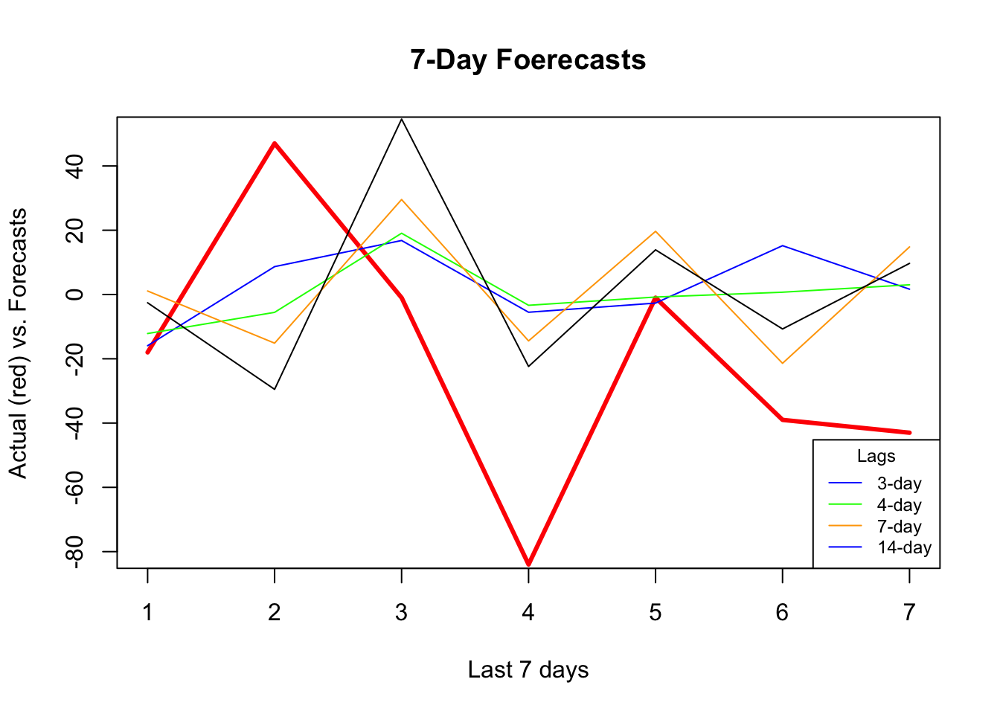
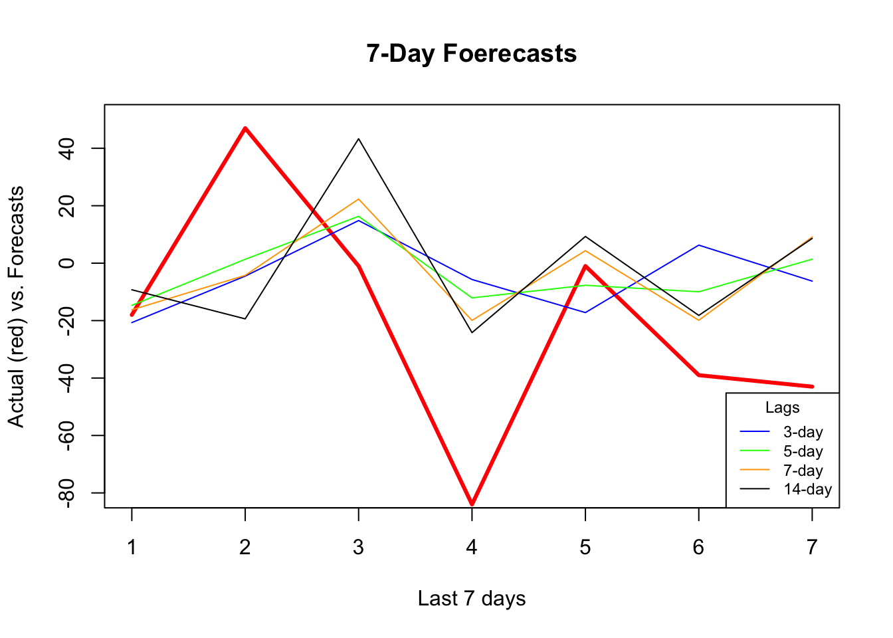
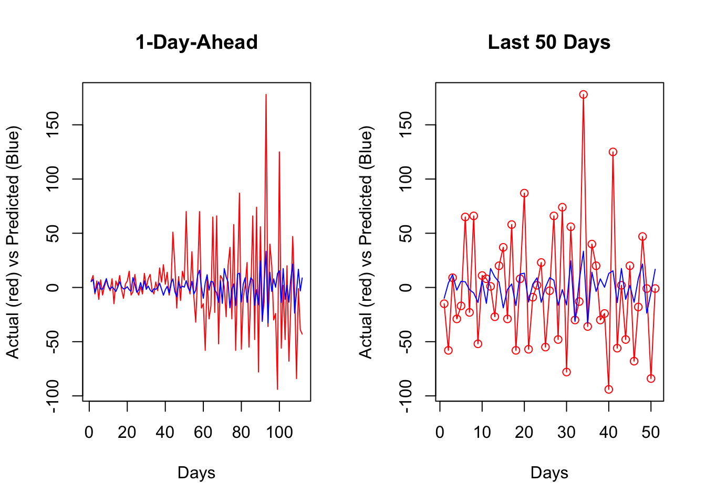
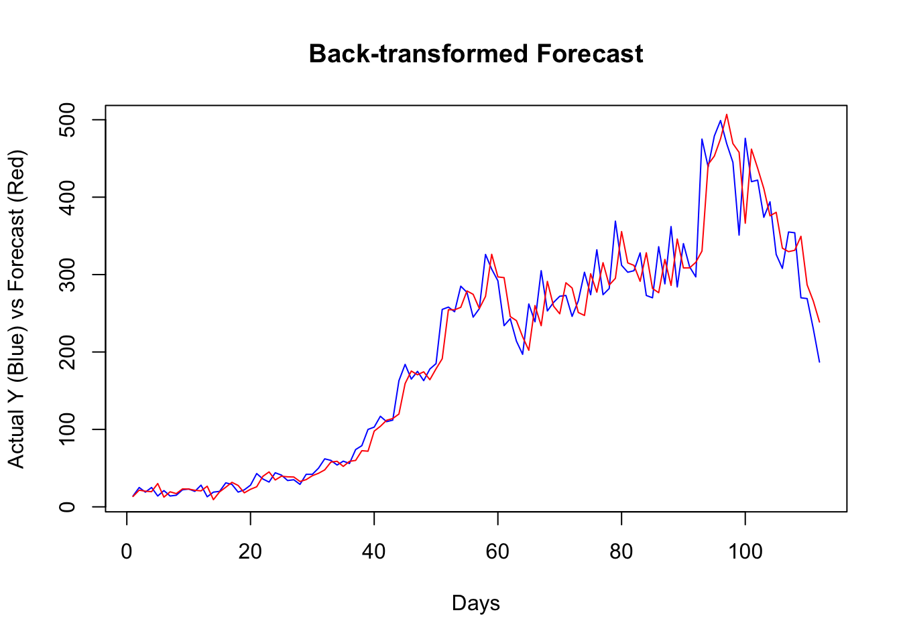

# Random Forest

We will utilize embedding for direct forecasting with Random Forests.  We choose the random forests algorithm because it does not need an explicit tuning by a grid search.  In the practice, however, we can still search for the number of trees and the number of variables randomly sampled as candidates at each split.   

Let's get our COVID-19 data:


```r
library(tsibble)
library(fpp3)

load("~/Dropbox/ToolShed_draft/toronto2.rds")
day <- seq.Date(from = as.Date("2020/03/01"),
                         to = as.Date("2020/11/21"), by = 1)

tdata <- tibble(Day = day, data[,-1])
toronto2 <- tdata %>%
  as_tsibble(index = Day)
toronto2
```

```
## # A tsibble: 266 x 8 [1D]
##    Day        cases      mob delay  male   age  temp   hum
##    <date>     <dbl>    <dbl> <dbl> <dbl> <dbl> <dbl> <dbl>
##  1 2020-03-01     4 -0.0172  36.8  0.75   55   -4.2   65.5
##  2 2020-03-02     6 -0.0320   8.5  1      45    3.8   84  
##  3 2020-03-03    10 -0.0119  15    0.7    54    2.3   90  
##  4 2020-03-04     7  0.0186  25.7  0.286  50    3.35  71  
##  5 2020-03-05     7  0.0223  21    0.429  48.6  1.2   63.5
##  6 2020-03-06    10 -0.00626 13.1  0.5    36    0.04  75  
##  7 2020-03-07     8  0.0261  10.4  0.5    46.2 -1.65  54  
##  8 2020-03-08    10  0.0273  11.6  0.9    50    6.3   56  
##  9 2020-03-09    18 -0.0158   8.89 0.611  35.6 12.5   55  
## 10 2020-03-10    29 -0.0521   9.69 0.448  41.7  5.15  79  
## # … with 256 more rows
```
As before, the data contain the first wave and the initial part of the second wave in Toronto for 2020. It is from [Ontario Data Catalogue](https://data.ontario.ca/en/dataset?groups=2019-novel-coronavirus#byPHU) sorted by episode dates (`Day`), which is the date when the first symptoms were started. The mobility data is from Facebook, `all_day_bing_tiles_visited_relative_change`, which is reflects positive or negative change in movement relative to baseline. The other variables related to tests are `delay`, which is the time between test results and the episode date, the gender distribution of people is given by `male`, `age` shows the average age among tested people any given day.  The last two variables, `temp` and `hum`, show the daily maximum day temperature and the average outdoor humidity during the day, respectively.

Except for `age` all other variables are non-stationary.  We will take their first difference and make the series stationary before we proceed.


```r
df <- toronto2 %>%
  mutate(dcases = difference(cases),
         dmob = difference(mob),
         ddelay = difference(delay),
         dmale = difference(male),
         dtemp = difference(temp),
         dhum = difference(hum))

dft <- df[ ,-c(2:5,7,8)] #removing levels
dft <- dft[-1, c(1,3:7,2)] # reordering the columns
```

Let's first use a univariate setting for a single-window forecasting, which is the last 7 days.  

## Univariate

We will not have a grid search on the random forest algorithm, which could be added to the following script:  


```r
library(randomForest)

h = 7
w <- 3:21 # a grid for window size

fh <- matrix(0, length(w), h)
rownames(fh) <- w
colnames(fh) <- 1:h

for(s in 1:length(w)){
  dt <- as.data.frame(embed(as.matrix(dft[ ,2]), w[s]))
  test_ind = nrow(dt) - (h)
  train <- dt[1:test_ind, ]
  test <- dt[-c(1:test_ind), ]
  y <- train[ ,1]
  X <- train[ ,-1]
  
    for (i in 1:h) {
      fit <- randomForest(X, y)
      fh[s, ] <- predict(fit, test[ ,-1])
      y <- y[-1]
      X <- X[-nrow(X), ]
    }
}

fh
```

```
##              1          2        3          4         5           6         7
## 3  -15.9234333   8.674467 16.80702  -5.516478 -2.665583  15.1997667  1.656136
## 4  -12.1391000  -5.546633 19.06582  -3.354100 -0.781700   0.7203905  3.027567
## 5   -0.5163333  -7.000667 30.40157  -9.348467 -1.751900  -8.8061667 12.010333
## 6    4.7688333  -8.129314 24.36007 -11.748200 17.193033  -8.4335000 18.690967
## 7    1.0963667 -15.134067 29.55220 -14.437467 19.655000 -21.4036333 14.804667
## 8    9.4242333 -23.274567 44.91027 -11.082867 15.167933 -17.3076667 28.031933
## 9   -8.8280333 -34.704467 63.34503 -21.473367 12.320333 -27.7585667 16.435400
## 10  -8.7552000 -35.269467 66.01573 -25.050200 15.561733 -23.4471333 10.459300
## 11   0.0473000 -30.091833 65.44997 -25.430833 16.551233 -18.7945333 11.521900
## 12   4.2920667 -30.847700 56.32973 -23.433933 16.762100 -16.7179000 14.347600
## 13  -2.4865333 -30.588533 52.20083 -23.308600 10.000033 -17.6130667  8.027267
## 14  -2.5725000 -29.501833 54.57207 -22.387400 13.898833 -10.7203667  9.691200
## 15  -5.8711000 -33.123400 59.61483 -20.856933 14.605767  -7.3618000 13.209600
## 16  -8.8194000 -36.204400 56.20417 -23.577100 13.916733 -10.8225667 11.797167
## 17  -9.2253667 -34.702633 59.10270 -25.113500 15.856067 -15.2575333 13.861200
## 18  -6.0064000 -31.865800 56.80097 -23.461433 12.593400  -8.8054000 13.980500
## 19  -8.1841333 -30.077667 60.42817 -23.972900 13.934367 -12.5083000 10.801400
## 20  -9.0513000 -29.037767 58.41837 -25.682367 15.712033 -15.0894667 13.966800
## 21  -8.3895333 -28.543033 60.40127 -21.189900  9.592267 -13.4498333 14.317333
```
We can now see RMSPE for each row (window size):


```r
actual <- test[, 1]
rmspe <- c()

for (i in 1:nrow(fh)) {
  rmspe[i] <- sqrt(mean((fh[i, ] - actual)^2))  
}

rmspe
```

```
##  [1] 42.90267 43.74960 44.27032 45.50069 44.84153 51.95157 51.61115 50.98179
##  [9] 50.43206 50.16100 47.74427 48.95038 51.59196 50.63836 50.58698 50.30308
## [17] 49.61772 49.12016 50.09223
```

```r
which.min(rmspe)
```

```
## [1] 1
```

And, if we plot several series of our forecast with different window sizes:


```r
plot(actual, type = "l", col = "red",
     ylim = c(-80, 50),
     ylab = "Actual (red) vs. Forecasts",
     xlab = "Last 7 days",
     main = "7-Day Foerecasts",
     lwd = 3)
lines(fh[1, ], type = "l", col = "blue")
lines(fh[2, ], type = "l", col = "green")
lines(fh[5, ], type = "l", col = "orange")
lines(fh[12, ], type = "l", col = "black")
legend("bottomright",  
       title = "Lags",
       legend = c("3-day", "4-day", "7-day", "14-day"), 
       col = c("blue", "green", "orange"), 
       lty = c(1, 1, 1, 1, 1), bty = "o", cex = 0.75)
```



It seems that, as the window size gets larger, the forecast becomes increasingly smooth, perhaps missing the short term dynamics. Another observation is that, although "blue" (3-day window) has the minimum RMSPE, it is not able to capture ups and downs relative to 7-day or 14-day windows.  

## Multivariate

Can we increase the prediction accuracy with additional predictors?


```r
library(randomForest)

h = 7
w <- 3:14 # a grid for window size

fh <- matrix(0, length(w), h)
rownames(fh) <- w
colnames(fh) <- 1:h

for(s in 1:length(w)){
  dt <- as.data.frame(embed(as.matrix(dft[ ,-1]), w[s]))
  test_ind = nrow(dt) - (h)
  train <- dt[1:test_ind, ]
  test <- dt[-c(1:test_ind), ]
  y <- train[ ,1]
  X <- train[ ,-1]
  
    for (i in 1:h) {
      fit <- randomForest(X, y)
      fh[s, ] <- predict(fit, test[ ,-1])
      y <- y[-1]
      X <- X[-nrow(X), ]
    }
}

fh
```

```
##             1           2        3          4           5          6         7
## 3  -19.616100  -2.8396333 15.76550  -8.219767 -16.4661333   7.949800 -3.080133
## 4  -24.775700  -0.1640333 16.82507  -9.264933 -14.5296667   3.325567 -3.893867
## 5  -15.648333   2.4859667 17.33100  -9.950767  -7.5546333 -10.245533  0.793400
## 6  -11.680233   1.5806667 21.59943 -11.161267  -0.5577333 -12.481567  4.542567
## 7  -14.020267  -4.3378333 20.33187 -19.613567   3.3353000 -16.100300  7.316267
## 8   -7.641467 -16.5848000 27.67567 -12.794867   6.0683333 -13.786733 10.812467
## 9  -10.453500 -22.4751667 48.13513 -23.511633   9.6593000 -19.240467  9.976533
## 10  -7.424200 -18.4726000 51.79417 -22.836133   7.9836667 -18.590167 10.097967
## 11  -9.056833 -17.6223000 46.04070 -23.502033  12.5686000 -21.852333 11.043567
## 12 -10.829933 -17.5915000 43.96557 -23.946867  13.2478333 -19.329100  6.901733
## 13  -8.425000 -18.0482000 47.88200 -24.631767  11.1274333 -18.260600  9.713367
## 14  -8.772400 -18.7200333 41.89373 -23.411867   9.4375333 -19.075533  6.366667
```

```r
actual <- test[,1]
rmspe <- c()

for (i in 1:nrow(fh)) {
  rmspe[i] <- sqrt(mean((fh[i,]-actual)^2))  
}

rmspe
```

```
##  [1] 42.33777 40.84328 38.90279 39.42948 38.40943 44.11712 45.14647 45.10846
##  [9] 43.96055 42.98153 44.06632 42.85867
```

```r
which.min(rmspe)
```

```
## [1] 5
```


```r
plot(actual, type = "l", col = "red",
     ylim = c(-80, +50),
     ylab = "Actual (red) vs. Forecasts",
     xlab = "Last 7 days",
     main = "7-Day Foerecasts",
     lwd = 3)
lines(fh[1, ], type = "l", col = "blue")
lines(fh[3, ], type = "l", col = "green")
lines(fh[5, ], type = "l", col = "orange")
lines(fh[12, ], type = "l", col = "black")
legend("bottomright", 
       title = "Lags",
       legend = c("3-day", "5-day", "7-day", "14-day"), 
       col = c("blue", "green", "orange", "black"), 
       lty = c(1, 1, 1, 1, 1), bty = "o", cex = 0.75)
```



It seems that additional predictors do increase the accuracy. Again, relative to the best model (5-day window) our 7-day window correctly captures most ups and downs in the forecast.  Now, a visual inspection shows that all RMSPE's are lower than the univariate forecasts. We would tend to conclude that this is because of the new predictors, specially mobility, temperature, and humidity.  But, the COVID-19 data have many well-known issues related to measurement inaccuracies.  As a side note, we need to test if those differences are statistical significant or not (i.e. Diebold-Mariano Test).   

## Rolling and expanding windows

A seven-day window is not enough for a reliable judgment on the forecast accuracy.  One way to deal with this issue is to use rolling or expanding windows to predict the next h days. The following example shows a 1-day-ahead forecast with varying lags for embedding.  


```r
library(randomForest)

l = 3:10 # lags for embedding 
ws = 150 # size of each rolling window
rmspe <- c()

all_fh <- vector(mode = "list", length = length(l))  
all_y <-  vector(mode = "list", length = length(l))  

for(s in 1:length(l)) {
  dt <- as.data.frame(embed(as.matrix(dft[, -1]), l[s]))
  nwin <- nrow(dt) - ws #number of windows
  fh <- c()
  y <- c()
  
  for(i in 1:nwin){
    train <- dt[i:(ws + i - 1), ] # each loop, window moves one day forward
    test <- dt[(ws + i), ]
    
    set.seed(i+s)
    fit <- randomForest(train[, -1], train[, 1])
    fh[i] <- predict(fit, test[, -1])
    y[i] <- test[, 1] # to use later for plotting 
  }
  all_y[[s]] <- y
  all_fh[[s]] <- fh  
  err <- test[, 1] - fh
  rmspe[s] <- sqrt(mean(err^2))
}

rmspe
```

```
## [1] 45.17990 44.74564 45.36820 45.07520 45.89481 46.96887 46.98404 46.80637
```

```r
bst <- which.min(rmspe)
l[bst] # Winning lag in embedding
```

```
## [1] 4
```

To change the application above to an expanding-window forecast, we just need to change `dt[i:(ws + i - 1), ]` to `dt[1:(ws + i - 1), ]` in the script.  Now, we can plot the results:  


```r
par(mfrow=c(1,2))
plot(all_y[[bst]], type = "l", col="red",
     ylab = "Actual (red) vs Predicted (Blue)",
     xlab = "Days",
     main = "1-Day-Ahead")
lines(all_fh[[bst]], col="blue")
plot(all_y[[bst]][60:110], type = "o", col="red",
     ylab = "Actual (red) vs Predicted (Blue)",
     xlab = "Days",
     main = "Last 50 Days")
lines(all_fh[[bst]][60:110], col="blue")
```


  
Getting the predicted values back to originals can be achieved by:

$$
\begin{aligned}
& y_{t+1}=y_t+z_{t+1} \\
& y_{t+2}=y_{t+1}+z_{t+2}=y_t+z_{t+1}+z_{t+2}
\end{aligned}
$$


```r
set.seed(321)
y <- rnorm(10)   
z <- diff(y)     # first differences
back <- cumsum(c(y[1], z)) 
cbind(y, back)
```

```
##                y       back
##  [1,]  1.7049032  1.7049032
##  [2,] -0.7120386 -0.7120386
##  [3,] -0.2779849 -0.2779849
##  [4,] -0.1196490 -0.1196490
##  [5,] -0.1239606 -0.1239606
##  [6,]  0.2681838  0.2681838
##  [7,]  0.7268415  0.7268415
##  [8,]  0.2331354  0.2331354
##  [9,]  0.3391139  0.3391139
## [10,] -0.5519147 -0.5519147
```
  
Since our algorithm predict the changes in observations, a simple sum would do the job for back transformation. For example, as a starting point, our algorithm predicts the change in $Y$ from day 156 to 157 (window size 150 plus the best lag window, 6).  When we add this predicted change to the actual $Y$ at 156, it will give us the back-transformed forecast at day 157. 


```r
y <- df$cases

# The first forecast is at ws (150) + l[best] (6) + 1, which is 157
# The first actual Y should start a day earlier
# removing all Y's until ws+l[bst]

y_a_day_before <- y[-c(1:(ws+l[bst]-1))] 

# This adds predicted changes to observed values a day earlier 
back_forecast <- head(y_a_day_before, -1) + all_fh[[bst]] 

# Actual Y's in the test set starting at ws (150) + l[best] (6) + 1, which is 157
ytest <- y[-c(1:(ws+l[bst]))] 

plot(ytest, type = "l", col = "blue",
     ylab = "Actual Y (Blue) vs Forecast (Red)",
     xlab = "Days",
     main = "Back-transformed Forecast"
     )
lines(back_forecast, type = "l", col = "red")
```



It seems that, for most days, our algorithm simply forecasts the next day by using the value from a day before.  If we change our algorithm to a 7-day-ahead forecast, this would be  different.   This is also a common problem when the predictive model has a poor forecasting power.  Again, this is not due to our algorithm, but forecasting an epi curve with imperfect test data is almost impossible job, as we highlighted earlier. 

In practice, however, there are several ways that we can improve the scripts above.  For example, we can consider the (rolling or expanding) window size as a hyperparameter.  We can also have an explicit training for the Random Forest algorithm.  We can have an ensemble forecasting by adding other predictive algorithms to the script, like boosting.  Further, we can develop a base forecast that would give us a benchmark to see how much our algorithm improves against that base. Moreover, we could apply a transformation to the data in order to stabilize the variance in all variables. 

