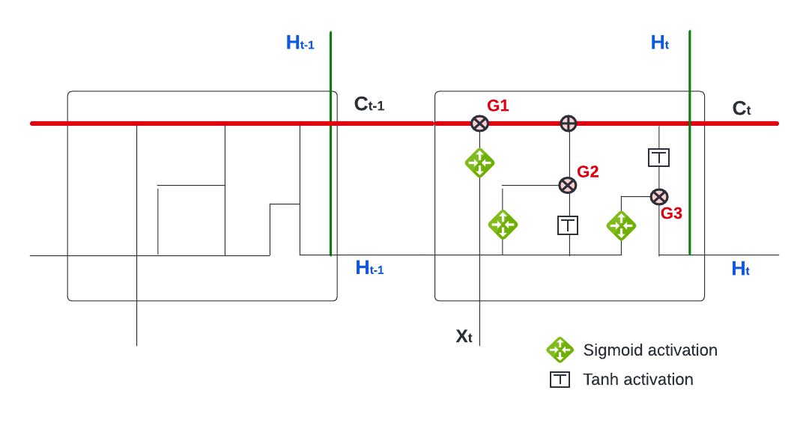
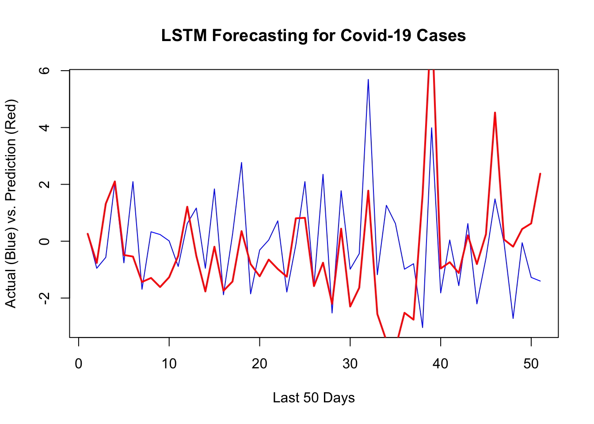
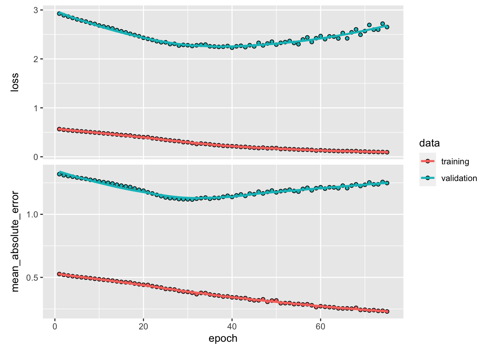

# Recurrent Neural Networks

Recurrent neural networks (RNNs) are a type of artificial neural network that are particularly well-suited for processing sequential data, such as time series, natural language, and speech. They are called "recurrent" because they perform the same task for every element in a sequence, with the output being dependent on the previous computations.

The idea of using neural networks to process sequential data dates back to the 1980s, but it wasn't until the late 1990s that RNNs began to see widespread use. One of the key developments in this period was the use of long short-term memory (LSTM) units, which are a type of "memory" cell that can store information for long periods of time and help prevent the vanishing gradients problem that can occur when training RNNs.  

The RNN processes the input data using a series of "neurons". Each neuron receives input from other neurons and from the input data, processes them using an activation function, and sends the output to other neurons as an input or to the final output of the network.  Hence, the output of a neuron at a given time step is used as the input to the same neuron at the next time step, allowing the network to incorporate information from previous time steps into its current computation. The RNN process can be illustrated as follows:


The network above is designed such that it takes input $X_t$ sequentially. Each $X_t$ feeds into a hidden layer that has a vector of activation functions, $A_t$.  Except for the first starting point, each activation function also feeds into the next activation function, $A_{t+1}$, sequentially. The connection between each activation function ($h$ - hidden state) reflects the fact that RNN uses the last period's prediction as an input in the next period.  The weight vectors are denoted $a = \{\omega_0, \omega_1\}$, $b = \{\theta_1\}$, and $c = \{\beta_0, \beta_1\}$, as expressed below:
  
$$
\begin{aligned}
& A_1=g\left(\omega_0+\omega_1 X_1\right)\\
& A_2=g\left(\omega_0+\omega_1 X_2+\theta_1 A_1\right) \\
& =g\left(\omega_0+\omega_1 X_2+\theta_1 g\left(\omega_0+\omega_1 X_1\right)\right) \\
& A_3=g\left(\omega_0+\omega_1 X_3+\theta_1 A_2\right) \\
& =g\left(\omega_0+\omega_1 X_3+\theta_1 g\left(\omega_0+\omega_1 X_2+\theta_1 g\left(\omega_0+\omega_1 X_1\right)\right)\right. \\
& ~~~~~~~~~~~~~~~~\vdots\\
& A_t=g\left(\omega_0+\omega_1 X_t+\theta_1 A_{t-1}\right)
\end{aligned}
$$
  
Note that weights are the same in each sequence.  Although each output layer produces a prediction, the final output is the network's prediction.  

$$
Y_{t}=\beta_0+ \beta_k A_{t}
$$

In case of multiple inputs at time $t$, $X_{t}=\left(X_{t1}, X_{t2}, \ldots, X_{tp}\right)$, and multiple units ($k$) in the hidden layer, $A_t = \left(A_{t1}, A_{t2}, \ldots, A_{tk}\right)$, the network at time $t$ becomes:

$$
A_{k, t}=g\left(\omega_{k 0}+\sum_{j=1}^p \omega_{k j} X_{t j}+\sum_{v=1}^k \theta_{k v} A_{v,t-1}\right).
$$
For example, for two units and two variables, $A_{k,t}$ will be

$$
A_{1,t}=g\left(\omega_{10}+ \omega_{1 1} X_{t,1}+\omega_{1 2} X_{t,2}+ 
\theta_{1 1} A_{1,t-1}+\theta_{1 2} A_{2,t-1}\right),\\
A_{2,t}=g\left(\omega_{20}+ \omega_{2 1} X_{t, 1}+\omega_{2 2} X_{t,2}+ 
\theta_{2 1} A_{1,t-1}+\theta_{2 2} A_{2,t-1}\right)
$$
and the output $O_{\ell}$ is computed as

$$
Y_{t}=\beta_0+\sum_{k=1}^2 \beta_k A_{k,t}
$$

## Keras

We will use the Keras deep-learning framework (<https://keras.rstudio.com>) and the package `keras`, which provides high-level building blocks for developing deep-learning models. Keras operates on several tensor libraries to tensor manipulations and differentiation, one of which is TensorFlow.  

Tensors are simply multidimensional arrays, which are a generalization of vectors and matrices to an arbitrary number of dimensions. For example, vectors are 1D tensors, matrices are used for 2D tensors, and arrays (which support any number of dimensions) are used for multi-dimensional objects.  Keras works on CPUs, but the most efficient implementations of Keras use NVIDIA GPUs and properly configured CUDA and cuDNN libraries.  For CPU-based installation of Keras, which is what we use in this chapter, we suggest the following steps after installing the `keras` package.


```r
# Sys.unsetenv ("RETICULATE_PYTHON")
# remotes : sinstall_github("Istudio/reticulate")
# reticulate::install_miniconda()
# keras::install_keras ()
```

The best source using Keras for artificial neural network projects with R is "Deep Learning with R" by Chollet and Allaire.  In this section, we will use the `keras` package (on CPU) for two main time series applications: RNN and LSTM. 

Let's set up our COVID-19 data and standardize each of the variables.


```r
library(tsibble)
library(fpp3)

load("~/Dropbox/ToolShed_draft/toronto2.rds")
toronto2 <- data
df <- toronto2 %>%
  mutate(dcases = difference(cases),
         dmob = difference(mob),
         ddelay = difference(delay),
         dmale = difference(male),
         dtemp = difference(temp),
         dhum = difference(hum))

dft <- df[ ,-c(2:5,7,8)] #removing levels
dft <- dft[-1, c(3:7,2)] # reordering the columns
sdtf <- scale(dft) #
head(sdtf)
```

```
##        dcases        dmob     ddelay       dmale      dtemp        age
## 2  0.04202890 -0.21389272 -7.6496254  2.16845790  2.4818892  0.5144024
## 3  0.10622289  0.30023017  1.8050246 -2.58211378 -0.4756078  1.6374603
## 4 -0.11845609  0.45271551  2.9516317 -3.56924556  0.3182466  1.1383235
## 5 -0.02216510  0.05796098 -1.2461163  1.24302186 -0.6779629  0.9600603
## 6  0.07412590 -0.41612714 -2.1128735  0.62606450 -0.3697605 -0.6086555
## 7 -0.08635909  0.47965067 -0.7048789  0.00910714 -0.5347577  0.6703827
```
  
There are four stages in developing ANN models in Keras:
  
- Preparing the training set with input tensors and target tensors;
- Defining the model, that is a network of layers;
- Choosing the learning parameters: a loss function, an optimizer, and some metrics to monitor
- And finally fitting this model to the training set

## Input Tensors

We will define a three dimensional array that contains time series data.  First, let's see an array:


```r
# array
x1 = c(1, 2, 3)
x2 = c(4, 5, 6, 7, 8, 9)
adata <- array(c(x1, x2), dim = c(3,3,2))
dim(adata)
```

```
## [1] 3 3 2
```

```r
adata
```

```
## , , 1
## 
##      [,1] [,2] [,3]
## [1,]    1    4    7
## [2,]    2    5    8
## [3,]    3    6    9
## 
## , , 2
## 
##      [,1] [,2] [,3]
## [1,]    1    4    7
## [2,]    2    5    8
## [3,]    3    6    9
```

```r
adata[1,,]
```

```
##      [,1] [,2]
## [1,]    1    1
## [2,]    4    4
## [3,]    7    7
```

Now, we create our data matrix:


```r
# Data
toydata <- matrix(c(1:100, 101:200, 201:300), 100)
colnames(toydata) <- c("y", "x1", "x2")
head(toydata)
```

```
##      y  x1  x2
## [1,] 1 101 201
## [2,] 2 102 202
## [3,] 3 103 203
## [4,] 4 104 204
## [5,] 5 105 205
## [6,] 6 106 206
```

Suppose that this is daily data and we try to make 1-day-ahead predictions.  In preparing the input tensor, we need to decide how many earlier days we need to predict the next day’s value.  Suppose that we decide on 5 days.  As we seen before, we transform the data by embedding to a new structure:


```r
datam <- embed(toydata, 6)
datam <- datam[, -c(2:3)]
head(datam)
```

```
##      [,1] [,2] [,3] [,4] [,5] [,6] [,7] [,8] [,9] [,10] [,11] [,12] [,13] [,14]
## [1,]    6    5  105  205    4  104  204    3  103   203     2   102   202     1
## [2,]    7    6  106  206    5  105  205    4  104   204     3   103   203     2
## [3,]    8    7  107  207    6  106  206    5  105   205     4   104   204     3
## [4,]    9    8  108  208    7  107  207    6  106   206     5   105   205     4
## [5,]   10    9  109  209    8  108  208    7  107   207     6   106   206     5
## [6,]   11   10  110  210    9  109  209    8  108   208     7   107   207     6
##      [,15] [,16]
## [1,]   101   201
## [2,]   102   202
## [3,]   103   203
## [4,]   104   204
## [5,]   105   205
## [6,]   106   206
```

The second line in the code above removes the contemporaneous features. We should have $100 - 5 = 95$ samples, in each one we have 3 features and 5 timesteps.  The first two samples, each is a matrix of $5 \times 3$, are shown below:


```
##      [,1] [,2] [,3]
## [1,]    1  101  201
## [2,]    2  102  202
## [3,]    3  103  203
## [4,]    4  104  204
## [5,]    5  105  205
```

```
##      [,1] [,2] [,3]
## [1,]    2  102  202
## [2,]    3  103  203
## [3,]    4  104  204
## [4,]    5  105  205
## [5,]    6  106  206
```
  
The outcome variable $y$ is 6 and 7 in the first and second samples.  Let's see how we can manipulate our embedded data `datam` to achieve it:


```r
n <- nrow(datam)
f1 <- data.matrix(datam[, -1]) # Removing Y
f2 <- array(f1, c(n, 3, 5))
f2[1,,]
```

```
##      [,1] [,2] [,3] [,4] [,5]
## [1,]    5    4    3    2    1
## [2,]  105  104  103  102  101
## [3,]  205  204  203  202  201
```

We need reverse the order


```r
f3 <- f2[,, 5:1]
f3[1,,]
```

```
##      [,1] [,2] [,3] [,4] [,5]
## [1,]    1    2    3    4    5
## [2,]  101  102  103  104  105
## [3,]  201  202  203  204  205
```

And, taking the transposition, 


```r
t(f3[1,,])
```

```
##      [,1] [,2] [,3]
## [1,]    1  101  201
## [2,]    2  102  202
## [3,]    3  103  203
## [4,]    4  104  204
## [5,]    5  105  205
```

For the whole array of `datam`, we use array transposition:


```r
f4 <- aperm(f3, c(1, 3, 2))
f4[1,,]
```

```
##      [,1] [,2] [,3]
## [1,]    1  101  201
## [2,]    2  102  202
## [3,]    3  103  203
## [4,]    4  104  204
## [5,]    5  105  205
```

Now, we are ready to apply all these steps to our toy data with a function:


```r
tensorin <- function(l, x){
  maxl = l+1
  xm <- embed(x, maxl)
  xm <- xm[, -c(2:3)] 
  n <- nrow(xm)
  f1 <- data.matrix(xm[, -1]) 
  y <- xm[, 1]
  f2 <- array(f1, c(n, ncol(x), l))
  f3 <- f2[,, l:1]
  f4 <- aperm(f3, c(1, 3, 2))
  list(f4, y)
} 

tensored <- tensorin(5, toydata)
X <- tensored[1]
y <- tensored[2]
X[[1]][1,,]
```

```
##      [,1] [,2] [,3]
## [1,]    1  101  201
## [2,]    2  102  202
## [3,]    3  103  203
## [4,]    4  104  204
## [5,]    5  105  205
```

```r
y[[1]][1]
```

```
## [1] 6
```

Note that this type of data transformation can be achieved several different ways.  We can apply it to our COVID-19 data for 7-day windows:


```r
trnt <- tensorin(7, sdtf)
X <- trnt[1]
y <- trnt[2]
X[[1]][1,,]
```

```
##             [,1]       [,2]       [,3]        [,4]        [,5]       [,6]
## [1,] -2.58211378 -0.4756078  1.6374603  0.04202890 -0.21389272 -7.6496254
## [2,] -3.56924556  0.3182466  1.1383235  0.10622289  0.30023017  1.8050246
## [3,]  1.24302186 -0.6779629  0.9600603 -0.11845609  0.45271551  2.9516317
## [4,]  0.62606450 -0.3697605 -0.6086555 -0.02216510  0.05796098 -1.2461163
## [5,]  0.00910714 -0.5347577  0.6703827  0.07412590 -0.41612714 -2.1128735
## [6,]  3.46406836  2.4663234  1.1383235 -0.08635909  0.47965067 -0.7048789
## [7,] -2.48614263  1.9215213 -0.6641151  0.04202890  0.02204745  0.3698224
```

```r
y[[1]][1]
```

```
## [1] 0.2346109
```

Obviously, our choice of $l$ (7) is arbitrary and should be decided with a proper validation.

## Plain RNN

As we have the input tensor stored as an array of (258, 7, 6), we are ready to design our network for an RNN with one layer with 24 hidden units (neurons):


```r
library(keras)
model <- keras_model_sequential() %>%
  layer_simple_rnn(units = 24,
                   input_shape = list(7, 6),
                   dropout = 0.1, recurrent_dropout = 0.1) %>%
  layer_dense(units = 1) %>% 
  compile(optimizer = optimizer_rmsprop(),
                  loss = "mse")
```

As before, neural networks consist of layers and neurons in each layer.  Since we use sequence data stored in 3D tensors of shape (samples, timesteps, features) we will use recurrent layers for our RNN. The term `layer_dense` is the output layer. 

We also (arbitrarily) specify two types of dropout for the units feeding into the hidden layer. The first one is set for the input feeding into a layer.  The second one is for the previous hidden units feeding into the same layer. 

One of the tools to fight with overfitting is randomly removing inputs to a layer. Similar to Random Forest, this dropping out process has the effect of generating a large number of networks with different network structure and, in turn, breaking the possible correlation between the inputs that the layers are exposed to. These "dropped out" inputs may be variables in the data sample or activations from a previous layer.  This is a conventional regularization method to in ANN but how this can be applied to sequential data is a complex issue. Every recurrent layer in Keras has two dropout-related arguments: `dropout`, a float specifying the dropout rate for input units of the layer, and `recurrent_dropout`, specifying the dropout rate of the recurrent units. These are again additions to our hyperparameter grid.

It has the effect of simulating a large number of networks with very different network structure and, in turn, making nodes in the network generally more robust to the inputs.

Before fitting the model, we need to split the data.  We have 258 observations in total.  We will take the last 50 observations as our test set:


```r
dim(X[[1]])
```

```
## [1] 258   7   6
```


```r
train <- 1:208
test <- 208:dim(X[[1]])[1]
```

And, finally we fit our RNN.  There are two hyperparameters that Keras use in fitting RNN: batch size and epoch.  They are both related to how and how many times the weights in the network will be updated

The batch size is the  number of observations ("samples") used in its gradient descent to update its internal parameters.  For example, a conventional (batch) gradient descent uses the entire data in one batch so that the batch size would be the number of samples in the data.  The stochastic gradient descent, on the other hand, uses randomly selected each observation.  While the batch gradient descent is efficient (fast) it is not as robust as the stochastic gradient descent.  Therefore, Keras uses a mini-batch gradient descent as a  parameter that balance the between efficiency and robustness.

The number of epochs is the number of times the algorithm works trough the complete training dataset. We need multiple passes through the entire data because updating the weights with gradient descent in a single pass (one epoch) is not enough.  But, when the number of epochs goes up, the algorithm updates the weights more. As a result, the  curve goes from underfitting (very few runs) to overfitting (too many runs).

Hence, these two parameters, batch size and epoch, should be set as hyperparameters.  Note that we pick arbitrary numbers below.


```r
model %>% fit(
  X[[1]][train,, ], y[[1]][train], batch_size = 12, epochs = 75,
  validation_data =
    list(X[[1]][test,, ], y[[1]][test]),
  verbose = 0
  ) %>% 
  plot()
```


```r
# prediction
y_act <- y[[1]][test]
var_y <- var(y_act)
yhat <- model %>% predict(X[[1]][test,, ])
1 - mean((yhat -y_act)^2) / var_y # R^2
```

```
## [1] 0.2491995
```

```r
sqrt(mean((yhat -y_act)^2)) # RMSPE
```

```
## [1] 1.495303
```

Although it could be done easily as we shown in the previous chapter, we will not back-transform the predictions to levels.  Here is the plot for the last 50 days:   


```r
plot(y[[1]][test], type ="l", col = "blue",
     ylab = "Actual (Blue) vs. Prediction (Red)",
     xlab = "Last 50 Days",
     main = "RNN Forecasting for Covid-19 Cases - in differences")
lines(yhat, col = "red", lwd = 2)
```


  
It looks like, our RNN without a proper training is capturing most ups and downs correctly.  There are three groups of hyperparameters that we need to search by validation:

- How many days we need in the past to predict the next day’s value? (we picked 7), 
- The number of units per layer (we picked 24), 
- Regularization parameters, `dropout` and `recurrent_dropout` (we picked 0.1 for both), 
- Stochastic gradient descent parameters, `batch_size` and `epochs` (we picked 12 and 75)

All these parameters that we picked arbitrarily should be selected by a proper validation.  Model tuning in ANN highly depends on the package we use in deep learning.  Keras with TensorFlow is one the top AI engines available for all type of networks.  The best source for learning more on deep learning using Keras is "Deep Learning with R" by Chollet and Allaire.   

## LSTM

One issue with RNN is that, although it is able to retain information trough time by its recurrent network, it quickly forgets long-term dependencies. This problem is called the *vanishing gradient problem* and can be easily seen here:

$$
\begin{aligned}
& A_3=g\left(\omega_0+\omega_1 X_3+\theta_1 A_2\right) \\
& =g\left(\omega_0+\omega_1 X_3+\theta_1 g\left(\omega_0+\omega_1 X_2+ \theta_1 g\left(\omega_0+\omega_1 X_1\right)\right)\right. \\
\end{aligned}
$$

Although this has only two iterations, the function has $\theta_1^2$ (if $g()$ is ReLu). For example, if $\theta_1 = 0.5$, the effect of $A_5$ on $A_1$ will be regulated by $\theta_1^4 = 0.0625$.  We can argue that $\theta_1$ could be one (random walk). But, the first differencing will usually remove the unit root in the data $\theta_1$ will be bounded between 0 and 1.

If we only need to look at *recent* information to predict the present, RNN would be fine even with this problem.  But, the gap between the relevant information to predict the present could be very large and RNN quickly forgets those long-term dependencies.  Long Short-Term Memory network (LSTM) layers in RNN are designed to solve this problem.

Similar to RNN, LSTMs also have a chain-like structure, but the repeating activation module has a different structure. Unlike RNN, which has only a single neural network layer in the repeating activation modules, the LSTM activation module has four interacting each other.



The key difference between LSTM and RNN is the cell state $C_t$ (the horizontal red line). The cell state functions like a conveyor belt and each LSTM repeating module is able to add to and remove from this belt through three gates, , as shown.

This figure shows how LSTM works.  We have three gates as numbered in the figure (G1, G2, and G3).  Each gate is regulated by a sigmoid  neural net layer ($\frac{1}{1+e^{-x}}$), which outputs numbers between zero and one.  Hence, it works like a regulator or "gate keeper".  

The first gate (G1) is the **Forget Gate**, the first layer of the four layers, which takes $H_{t-1}$ and $X_t$ into a sigmoid function,

$$
f_t=\sigma\left(w_f \cdot\left[H_{t-1}, X_t\right]+b_f\right)
$$
and produces a number between 0 and 1.  This percentage reflects the degree of $C_{t-1}$ that will be forgotten. For example, if it is zero, nothing in $C_{t-1}$ will be let through on the belt (cell state). It is interesting to note that this degree, how much of the long-term information will be kept, is determined by the recent information ($H_{t-1}$, $X_t$).  That is, if the recent information is very relevant for the prediction, the network will tune this sigmoid function so that the output will be a percentage close to 0, which will reduce the effect of the long-term information in the past, $C_{t-1}$, on prediction.

The second gate (G2), **the Input Gate**, uses the same inputs, $H_{t-1}$ and $X_t$, but has two layers. The first later is again a sigmoid function that works as a gate keeper.  The second layer is a tanh function ($\tanh x=\frac{e^x-e^{-x}}{e^x+e^{-x}}$) that produces a number between $-1$ and $+1$.  The objective of this layer is to update cell state $C_{t-1}$ by adding $\tilde{C_{t}}$, which contains the recent information hidden in $H_{t-1}$ and $X_t$.  This process happens in two steps:

$$
\begin{aligned}
i_t & =\sigma\left(w_i \cdot\left[H_{t-1}, X_t\right]+b_i\right) \\
\tilde{C}_t & =\tanh \left(w_\tilde{C} \cdot\left[H_{t-1}, X_t\right]+b_\tilde{C}\right)
\end{aligned}
$$
The first step, $i_t$, is a sigmoid function, hence a "gate keeper".  We already get it in the first layer with different weights: $f_t=\sigma\left(w_f \cdot\left[h_{t-1}, x_t\right]+b_f\right)$.  The second later, tanh function, produces the information ($h_{t-1}, x_t$) in a candidate value normalized between $-1$ and $+1$.  When the network multiplies $\tilde{C_{t}}$ with $i_t$ ($i_t \times \tilde{C_{t}}$), this new candidate value between $-1$ and $+1$ will be scaled by $i_t$ that reflects how much the network would like to update $C_{t-1}$:

$$
C_t=f_t \times C_{t-1}+i_t \times \tilde{C}_t
$$

While the first two gates are about regulating the cell state ($C_t$), the last one (G3) is the **Output Gate**.  The prediction at time $t$, $H_t$, has two inputs: $C_t$ and the recent information, $H_{t-1}$ and $X_t$.  The output gate will decide how it will balance between these two sources and produce $H_t$:

$$
\begin{aligned}
o_t & =\sigma\left(w_o\left[H_{t-1}, X_t\right]+b_o\right) \\
H_t & =o_t \times \tanh \left(C_t\right)
\end{aligned}
$$
Note that the tanh activation in the output function could be changed depending on the type of network we build. 

The LSTM network that we described so far is a conceptual one. In practice, however, there are many different variants of LSTM.  One of them is called the Gated Recurrent Unit (GRU) introduced by Cho, et al. ([2014](https://arxiv.org/abs/1409.1259)).  The details of GRU is beyond this book.  But, after understanding the structure of LSTM networks, GRU should not be difficult to grasp.  One of the accessible sources to learn different types of RNN is [blog posts](http://colah.github.io) by Christopher Olah.

Now, we return to the application of LSTM to our COVID-19 data.  We use the "Adam" optimization algorithm, which is an extension to stochastic gradient descent and works with LSTM very well.  Below, the code shows an arbitrary network with LSTM.


```r
model = keras_model_sequential() %>%   
  layer_lstm(units=128, input_shape = c(7, 6), activation="relu") %>%  
  layer_dense(units=64, activation = "relu") %>%  
  layer_dense(units=32) %>%  
  layer_dense(units=16) %>%  
  layer_dense(units=1, activation = "linear")

model %>% compile(loss = 'mse',
                  optimizer = 'adam',
                  metrics = list("mean_absolute_error")
) %>%
  summary()
```

```
## Model: "sequential_1"
## ________________________________________________________________________________
##  Layer (type)                       Output Shape                    Param #     
## ================================================================================
##  lstm (LSTM)                        (None, 128)                     69120       
##  dense_4 (Dense)                    (None, 64)                      8256        
##  dense_3 (Dense)                    (None, 32)                      2080        
##  dense_2 (Dense)                    (None, 16)                      528         
##  dense_1 (Dense)                    (None, 1)                       17          
## ================================================================================
## Total params: 80,001
## Trainable params: 80,001
## Non-trainable params: 0
## ________________________________________________________________________________
```

```r
model %>% fit(X[[1]][train,, ], y[[1]][train],
              batch_size = 12, epochs = 75,
              validation_data = list(X[[1]][test,, ], y[[1]][test]),
              verbose = 0
) %>%
  plot()
```


```r
yhat <- predict(model, X[[1]][test,, ])

y_act <- y[[1]][test]
var_y <- var(y_act)
1 - mean((yhat -y_act)^2) / var_y # R^2
```

```
## [1] -0.0434925
```

```r
sqrt(mean((yhat -y_act)^2)) # RMSPE
```

```
## [1] 1.762835
```

```r
plot(y[[1]][test], type ="l", col = "blue",
     ylab = "Actual (Blue) vs. Prediction (Red)",
     xlab = "Last 50 Days",
     main = "LSTM Forecasting for Covid-19 Cases",
     lwd = 1)
lines(yhat, col = "red", lwd = 2)
```


  
Although LSTM does a good job for the last 10 days, there are specific days that it is way off.  That's why it has a higher RMSPE than RNN we had earlier.
Before concluding this chapter, let's change our network setting slightly and see the results
  

```r
model <- keras_model_sequential() %>%   
  layer_lstm(units=24, input_shape = c(7, 6), activation="tanh") %>%  
  layer_dense(units=1, activation = "linear") %>% 
  compile(loss = 'mse',
          optimizer = 'adam',
          metrics = list("mean_absolute_error")
  )

model %>% summary()
```

```
## Model: "sequential_2"
## ________________________________________________________________________________
##  Layer (type)                       Output Shape                    Param #     
## ================================================================================
##  lstm_1 (LSTM)                      (None, 24)                      2976        
##  dense_5 (Dense)                    (None, 1)                       25          
## ================================================================================
## Total params: 3,001
## Trainable params: 3,001
## Non-trainable params: 0
## ________________________________________________________________________________
```

```r
model %>% fit(X[[1]][train,, ], y[[1]][train],
              batch_size = 12, epochs = 75,
              validation_data = list(X[[1]][test,, ], y[[1]][test]),
              verbose = 0
) %>%
  plot()
```



```r
y_act <- y[[1]][test]
var_y <- var(y_act)
yhat <- predict(model, X[[1]][test,, ])
1 - mean((yhat -y_act)^2) / var_y # R^2
```

```
## [1] 0.2535225
```

```r
sqrt(mean((yhat -y_act)^2)) # RMSPE
```

```
## [1] 1.490992
```

```r
plot(y[[1]][test], type ="l", col = "blue",
     ylab = "Actual (Blue) vs. Prediction (Red)",
     xlab = "Last 50 Days",
     main = "LSTM Forecasting for Covid-19 Cases",
     lwd = 1)
lines(yhat, col = "red", lwd = 2)
```


  
Building a network that does relatively a good job requires a well-designed validation process and a good network architecture that can be achieved after several trials.
  
