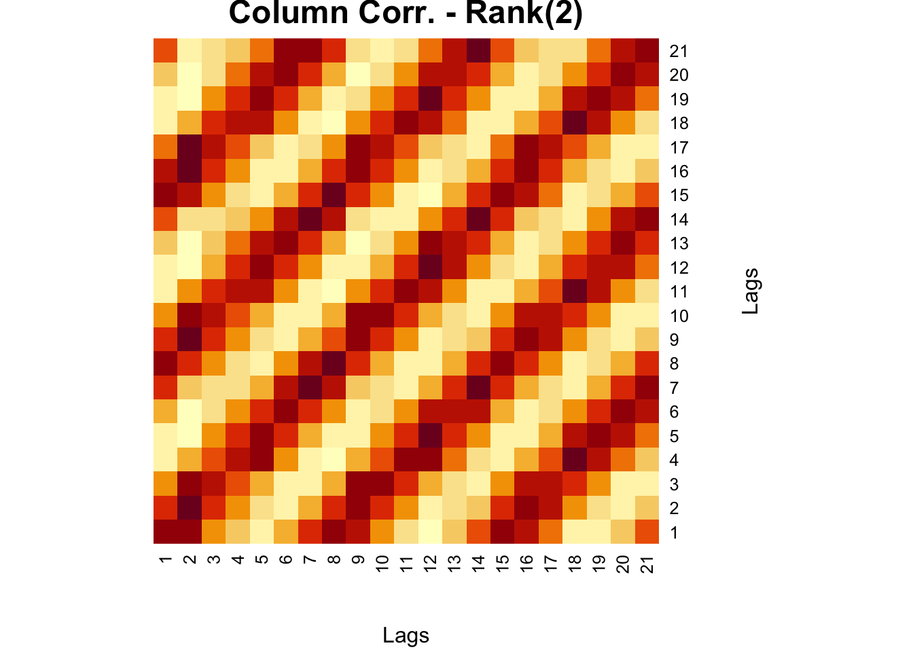

# Rank(r) Approximations

SVD can also be used for rank approximations a.k.a. matrix approximations.  Since $\mathbf{A=U \Sigma V^{\top}}$ can be written as

$$
=\sigma_{1} u_{1} v_{1}^{\top}+\sigma_{2} u_{2} v_{2}^{\top}+\ldots+\sigma_{n} u_{n} v_{n}^{\top}+ 0
$$
Each term in this equation is a Rank 1 matrix: $u_1$ is $n \times 1$ column vector and $v_1$ is $1 \times n$ row vector.  Hence these are the only orthogonal entries in the resulting matrix, hence Rank1.  Therefore, the first term with $\sigma_1$ is a Rank 1 $n \times n$ matrix. All other terms have the same dimension. Since $\sigma$s are ordered, the first term is the carries the most information.  So Rank 1 approximation is taking only the first term and ignoring the others.  Here is a simple example:


```r
#rank-one approximation
#http://cs.brown.edu/courses/cs053/current/slides/12-01-2017.pdf
#https://cran.r-project.org/web/packages/matlib/vignettes/eigen-ex1.html

A <- matrix(c(1,5,4,2), 2 ,2)
A
```

```
##      [,1] [,2]
## [1,]    1    4
## [2,]    5    2
```

```r
v1 <- matrix(eigen(t(A)%*%(A))$vector[,1], 1, 2)
sigma <- sqrt(eigen(t(A)%*%(A))$values[1])
u1 <- matrix(eigen(A%*%t(A))$vector[,1], 2, 1)
Atilde <- sigma*u1%*%v1
Atilde
```

```
##           [,1]      [,2]
## [1,] -2.560369 -2.069843
## [2,] -4.001625 -3.234977
```
  
And, Rank 2 approximation can be obtained by adding the first 2 terms and so on. As we add more terms we can get the full information in the data.  But often times, we truncate the ranks at $r$ by removing the terms with small $sigma$.  This is also called noise reduction.
  
Here is an example for an image compression for a matrix from our own work (Graphical Network Analysis of COVID-19 Spread).  A better example for an image can be found in the Github repo of package `rsvd` [Tiger](https://github.com/erichson/rSVD) [@Erichson_2019]:


```r
comt <- readRDS("comt.rds")

heatmap(comt, Colv = NA, Rowv = NA,
        main = "Heatmap - Original",
        xlab = "Lags", ylab = "Starting days of 7-day rolling windows")
```


```r
# Regular SVD
fck <-svd(comt)
r = 2
comt.re <- as.matrix(fck$u[,1:r])%*%diag(fck$d)[1:r,1:r]%*%t(fck$v[,1:r])

heatmap(comt.re, Colv = NA, Rowv = NA,
        main = "Heatmap Matrix - Rank(2) Approx",
        xlab = "Lags", ylab = "Startting days of 7-day rolling windows")
```


```r
#XX' and X'X SVD
wtf <- comt%*%t(comt)
fck <-svd(wtf)
r = 2
comt.re2 <- as.matrix(fck$u[,1:r])%*%diag(fck$d)[1:r,1:r]%*%t(fck$v[,1:r])

heatmap(comt.re2, Colv = NA, Rowv = NA,
        main = "Row Corr. - Rank(2)",
        xlab = "Startting days of 7-day rolling windows",
        ylab = "Startting days of 7-day rolling windows")
```


```r
wtf <- t(comt)%*%comt
fck <-svd(wtf)
r = 2
comt.re3 <- as.matrix(fck$u[,1:r])%*%diag(fck$d)[1:r,1:r]%*%t(fck$v[,1:r])

heatmap(comt.re3, Colv = NA, Rowv = NA,
        main = "Column Corr. - Rank(2)",
        xlab = "Lags", ylab = "Lags")
```


  
There is a series of lectures on SVD by [Steve Brunton at YouTube](https://www.youtube.com/watch?v=nbBvuuNVfco) [@Brunton_2020] that you can benefit from greatly!
  
