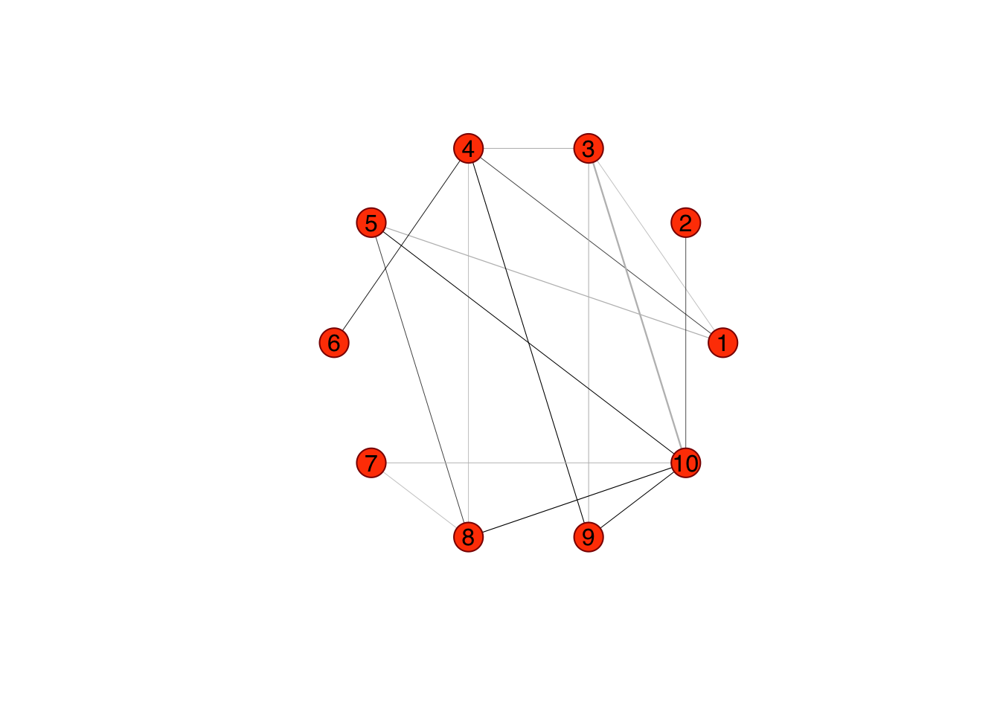

# Regularized covariance matrix

Why is a covariance matrix $S$ is singular when $n<p$ in the data matrix of $X$? Consider the $n \times p$ matrix of sample data, $X$. From the above, the rank of $X$ is at most $\min (n, p)$. Since

$$
\mathbf{S}=\frac{1}{n} \mathbf{X}_{c}^{\prime} \mathbf{X}_{c}
$$
$\operatorname{rank}(X_c)$ will be $n$ ($n<p$).  Since $\operatorname{rank}(A B) \leq \min (\operatorname{rank}(A), \operatorname{rank}(B))$.  Clearly the rank of $S$ won't be larger than the rank of $X_c$.  Since $S$ is $p \times p$ and its rank is $n$, $S$ will be singular.  That's, if $n<p$ then $\operatorname{rank}(X)<p$ in which case $\operatorname{rank}(S)<p$. 

## MLE  

Before understanding L1 or L2 regularization, we need to see the multivariate Gaussian distribution, its parameterization and MLE solutions.  The multivariate Gaussian distribution of a random vector $X \in \mathbf{R}^{p}$ is commonly expressed in terms of the parameters $\mu$ and $\Sigma$, where $\mu$ is an $p \times 1$ vector and $\Sigma$ is an $p \times p$, a nonsingular symmetric covariance matrix. Hence, we have the following form for the density function (the Wishart distribution arises as the distribution of the sample covariance matrix for a sample from a multivariate normal distribution - [See Wishard Distribution](https://en.wikipedia.org/wiki/Wishart_distribution)):

$$
f(x \mid \mu, \Sigma)=\frac{1}{(2 \pi)^{p / 2}|\Sigma|^{1 / 2}} \exp \left\{-\frac{1}{2}(x-\mu)^{T} \Sigma^{-1}(x-\mu)\right\},
$$
where $|\Sigma|$ is the determinant of the covariance matrix. The likelihood function is:

$$
\mathcal{L}(\mu, \Sigma)=(2 \pi)^{-\frac{n p}{2}} \prod_{i=1}^{n} \operatorname{det}(\Sigma)^{-\frac{1}{2}} \exp \left(-\frac{1}{2}\left(x_{i}-\mu\right)^{\mathrm{T}} \Sigma^{-1}\left(x_{i}-\mu\right)\right)
$$
Since the estimate $\bar{x}$ does not depend on $\Sigma$, we can just substitute it for $\mu$ in the likelihood function, getting

$$
\mathcal{L}(\bar{x}, \Sigma) \propto \operatorname{det}(\Sigma)^{-\frac{n}{2}} \exp \left(-\frac{1}{2} \sum_{i=1}^{n}\left(x_{i}-\bar{x}\right)^{\mathrm{T}} \Sigma^{-1}\left(x_{i}-\bar{x}\right)\right)
$$
  
and then seek the value of $\Sigma$ that maximizes the likelihood of the data (in practice it is easier to work with $\log \mathcal{L}$ ). Regard the scalar $\left(x_{i}-\bar{x}\right)^{\mathrm{T}} \Sigma^{-1}\left(x_{i}-\bar{x}\right)$ as the trace of a $1 \times 1$ matrix. This makes it possible to use the identity $\operatorname{tr}(A B)=\operatorname{tr}(B A)$

$$
\begin{aligned}
\mathcal{L}(\bar{x}, \Sigma) & \propto \operatorname{det}(\Sigma)^{-\frac{n}{2}} \exp \left(-\frac{1}{2} \sum_{i=1}^{n}\left(\left(x_{i}-\bar{x}\right)^{\mathrm{T}} \Sigma^{-1}\left(x_{i}-\bar{x}\right)\right)\right) \\
&=\operatorname{det}(\Sigma)^{-\frac{n}{2}} \exp \left(-\frac{1}{2} \sum_{i=1}^{n} \operatorname{tr}\left(\left(x_{i}-\bar{x}\right)\left(x_{i}-\bar{x}\right)^{\mathrm{T}} \Sigma^{-1}\right)\right) \\
&=\operatorname{det}(\Sigma)^{-\frac{n}{2}} \exp \left(-\frac{1}{2} \operatorname{tr}\left(\sum_{i=1}^{n}\left(x_{i}-\bar{x}\right)\left(x_{i}-\bar{x}\right)^{\mathrm{T}} \Sigma^{-1}\right)\right) \\
&=\operatorname{det}(\Sigma)^{-\frac{n}{2}} \exp \left(-\frac{1}{2} \operatorname{tr}\left(S \Sigma^{-1}\right)\right)
\end{aligned}
$$

where

$$
S=\sum_{i=1}^{n}\left(x_{i}-\bar{x}\right)\left(x_{i}-\bar{x}\right)^{\mathrm{T}} \in \mathbf{R}^{p \times p}
$$
And finally, re-write the likelihood in the log form using the trace trick:

$$
\ln \mathcal{L}(\mu, \Sigma)=\text { const }-\frac{n}{2} \ln \operatorname{det}(\Sigma)-\frac{1}{2} \operatorname{tr}\left[\Sigma^{-1} \sum_{i=1}^{n}\left(x_{i}-\mu\right)\left(x_{i}-\mu\right)^{\mathrm{T}}\right]
$$

or, for a multivariate normal model with mean 0 and covariance $\Sigma$, the likelihood function in this case is given by

$$
\ell(\Omega ; S)=\ln |\Omega|-\operatorname{tr}(S \Omega)
$$

where $\Omega=\Sigma^{-1}$ is the so-called precision matrix (also sometimes called the concentration matrix). It is precisely this $\Omega$ for which we seek an estimate, which we will denote $P$. Indeed, one can naturally try to use the inverse of $S$ for this.

The differential of this log-likelihood is

$$
d \ln \mathcal{L}(\mu, \Sigma)=\\-\frac{n}{2} \operatorname{tr}\left[\Sigma^{-1}\{d \Sigma\}\right]-\frac{1}{2} \operatorname{tr}\left[-\Sigma^{-1}\{d \Sigma\} \Sigma^{-1} \sum_{i=1}^{n}\left(x_{i}-\mu\right)\left(x_{i}-\mu\right)^{\mathrm{T}}-2 \Sigma^{-1} \sum_{i=1}^{n}\left(x_{i}-\mu\right)\{d \mu\}^{\mathrm{T}}\right]
$$

and

$$
\sum_{i=1}^{n}\left(x_{i}-\mu\right)\left(x_{i}-\mu\right)^{\mathrm{T}}=\sum_{i=1}^{n}\left(x_{i}-\bar{x}\right)\left(x_{i}-\bar{x}\right)^{\mathrm{T}}=S
$$
Then the terms involving $d \Sigma$ in $d \ln \mathcal{L}$ can be combined as

$$
-\frac{1}{2} \operatorname{tr}\left(\Sigma^{-1}\{d \Sigma\}\left[n I_{p}-\Sigma^{-1} S\right]\right)
$$
See the rest from <https://en.wikipedia.org/wiki/Estimation_of_covariance_matrices>. For $n < p$, the empirical estimate of the covariance matrix becomes singular, i.e. it cannot be inverted to compute the precision matrix.

There is also another intuitive way to see the whole algebra ([see the post here](https://stats.stackexchange.com/questions/151315/what-is-the-intuitive-geometric-meaning-of-minimizing-the-log-determinant-of)) [@Intui_Cross]:

Let's start with the univariate standard normal density (parameter free) which is
$$
\frac{1}{\sqrt{2 \pi}} \exp \left(-\frac{1}{2} t^{2}\right)
$$
When we extend (parameterize) it to $x=\sigma t+\mu$, the change of variable requires $d t=\frac{1}{\sigma} d x$ making the general normal density
$$
\frac{1}{\sqrt{2 \pi}} \frac{1}{\sigma} \exp \left(-\frac{1}{2}\left(\frac{x-\mu}{\sigma}\right)^{2}\right)
$$
The log-likelihood is
$$
\text { A constant }-\frac{n}{2} \log \left(\sigma^{2}\right)-\frac{1}{2} \sum_{i=1}^{n}\left(\frac{x_{i}-\mu}{\sigma}\right)^{2},
$$
maximization of which is equivalent to minimizing
$$
n \log \left(\sigma^{2}\right)+\sum_{i=1}^{n}\left(\frac{x_{i}-\mu}{\sigma}\right)^{2}
$$
  
Multivariate (say number of dimensions $=d$ ) counterpart behaves the similar way. Starting with the generating (standard) density
$$
(\sqrt{2 \pi})^{-d} \exp \left(-\frac{1}{2} \mathbf{z}^{t} \mathbf{z}\right)
$$
and the general multivariate normal (MVN) density is
$$
(\sqrt{2 \pi})^{-d}|\boldsymbol{\Sigma}|^{-1 / 2} \exp \left(-\frac{1}{2}(\mathbf{x}-\boldsymbol{\mu})^{t} \mathbf{\Sigma}^{-1}(\mathbf{x}-\boldsymbol{\mu})\right)
$$

Observe that $|\boldsymbol{\Sigma}|^{-1 / 2}$ (which is the reciprocal of the square root of the determinant of the covariance matrix $\boldsymbol{\Sigma}$ ) in the multivariate case does what $1 / \sigma$ does in the univariate case and $\boldsymbol{\Sigma}^{-1}$ does what $1 / \sigma^{2}$ does in the univariate case. In simpler terms, $|\boldsymbol{\Sigma}|^{-1 / 2}$ is the change of variable "adjustment".
The maximization of likelihood would lead to minimizing (analogous to the univariate case)

$$
n \log |\boldsymbol{\Sigma}|+\sum_{i=1}^{n}(\mathbf{x}-\boldsymbol{\mu})^{t} \boldsymbol{\Sigma}^{-1}(\mathbf{x}-\boldsymbol{\mu})
$$

Again, in simpler terms, $n \log |\mathbf{\Sigma}|$ takes the spot of $n \log \left(\sigma^{2}\right)$ which was there in the univariate case. These terms account for corresponding change of variable adjustments in each scenario.
  

Let's start with a data matrix of 10x6, where no need for regularization.  


```r
n = 10
p = 6
X <- matrix (rnorm(n*p), n, p)

# Cov. & Precision Matrices
S <- cov(X)
pm <- solve(S) # precision

-pm[1,2]/(sqrt(pm[1,1])*sqrt(pm[2,2])) 
```

```
## [1] -0.5309446
```

```r
-cov2cor(pm)
```

```
##             [,1]       [,2]       [,3]       [,4]        [,5]       [,6]
## [1,] -1.00000000 -0.5309446  0.1762383  0.6110686 -0.01274335 -0.5841783
## [2,] -0.53094456 -1.0000000  0.3604604  0.5240315 -0.28555154 -0.5060374
## [3,]  0.17623830  0.3604604 -1.0000000 -0.2651072  0.28944022  0.1717981
## [4,]  0.61106856  0.5240315 -0.2651072 -1.0000000 -0.14148336  0.3963709
## [5,] -0.01274335 -0.2855515  0.2894402 -0.1414834 -1.00000000 -0.1734211
## [6,] -0.58417835 -0.5060374  0.1717981  0.3963709 -0.17342112 -1.0000000
```

```r
# ppcor
pc <- ppcor::pcor(X)
pc$estimate
```

```
##             [,1]       [,2]       [,3]       [,4]        [,5]       [,6]
## [1,]  1.00000000 -0.5309446  0.1762383  0.6110686 -0.01274335 -0.5841783
## [2,] -0.53094456  1.0000000  0.3604604  0.5240315 -0.28555154 -0.5060374
## [3,]  0.17623830  0.3604604  1.0000000 -0.2651072  0.28944022  0.1717981
## [4,]  0.61106856  0.5240315 -0.2651072  1.0000000 -0.14148336  0.3963709
## [5,] -0.01274335 -0.2855515  0.2894402 -0.1414834  1.00000000 -0.1734211
## [6,] -0.58417835 -0.5060374  0.1717981  0.3963709 -0.17342112  1.0000000
```

```r
# glasso
glassoFast::glassoFast(S,rho=0)
```

```
## $w
##             [,1]       [,2]        [,3]        [,4]        [,5]        [,6]
## [1,]  0.71473048 -0.1889112 -0.04597907  0.34098516  0.03648834 -0.40901892
## [2,] -0.18891125  1.5783952  0.21532536  0.42521338 -0.42195446 -0.32694669
## [3,] -0.04597907  0.2153254  1.09542356 -0.21357377  0.29723918 -0.04478199
## [4,]  0.34098516  0.4252134 -0.21357377  1.04772188 -0.38868090  0.02586166
## [5,]  0.03648834 -0.4219545  0.29723918 -0.38868090  1.16172014 -0.16344963
## [6,] -0.40901892 -0.3269467 -0.04478199  0.02586166 -0.16344963  1.45827767
## 
## $wi
##             [,1]       [,2]       [,3]       [,4]        [,5]       [,6]
## [1,]  2.96343627  1.0231915 -0.3244615 -1.4636855  0.02370686  1.0792146
## [2,]  1.02319149  1.2531998 -0.4315628 -0.8162500  0.34590237  0.6079280
## [3,] -0.32446151 -0.4315628  1.1438544  0.3944998 -0.33497538 -0.1971619
## [4,] -1.46368549 -0.8162500  0.3944998  1.9361181  0.21307125 -0.5918557
## [5,]  0.02370686  0.3459024 -0.3349754  0.2130712  1.17101209  0.2013760
## [6,]  1.07921462  0.6079280 -0.1971619 -0.5918557  0.20137600  1.1517308
## 
## $errflag
## [1] 0
## 
## $niter
## [1] 1
```

```r
Rl <- glassoFast::glassoFast(S,rho=0)$wi #
-Rl[1,2]/(sqrt(Rl[1,1])*sqrt(Rl[2,2])) 
```

```
## [1] -0.5309443
```

```r
-cov2cor(Rl)
```

```
##             [,1]       [,2]       [,3]       [,4]        [,5]       [,6]
## [1,] -1.00000000 -0.5309443  0.1762301  0.6110603 -0.01272611 -0.5841637
## [2,] -0.53094431 -1.0000000  0.3604529  0.5240191 -0.28553720 -0.5060186
## [3,]  0.17623007  0.3604529 -1.0000000 -0.2650913  0.28943220  0.1717758
## [4,]  0.61106026  0.5240191 -0.2650913 -1.0000000 -0.14150710  0.3963460
## [5,] -0.01272611 -0.2855372  0.2894322 -0.1415071 -1.00000000 -0.1734010
## [6,] -0.58416365 -0.5060186  0.1717758  0.3963460 -0.17340097 -1.0000000
```

## High-dimensional data
  
Now with a data matrix of 6x10:  


```r
n = 6
p = 10
set.seed(1)
X <- matrix (rnorm(n*p), n, p)

# Cov. & Precision Matrices
S <- cov(X)
S
```

```
##               [,1]        [,2]        [,3]        [,4]         [,5]        [,6]
##  [1,]  0.889211221 -0.17223814 -0.36660043  0.35320957 -0.629545741 -0.27978848
##  [2,] -0.172238139  0.34416306 -0.09280183 -0.04282613  0.139236591 -0.26060435
##  [3,] -0.366600426 -0.09280183  1.46701338 -0.50796342 -0.024550727 -0.11504405
##  [4,]  0.353209573 -0.04282613 -0.50796342  1.24117592 -0.292005017  0.42646139
##  [5,] -0.629545741  0.13923659 -0.02455073 -0.29200502  0.553562287  0.26275658
##  [6,] -0.279788479 -0.26060435 -0.11504405  0.42646139  0.262756584  0.81429052
##  [7,]  0.143364328 -0.14895377  0.29598156  0.30839120 -0.275296303  0.04418159
##  [8,] -0.273835576  0.17201439 -0.31052657 -0.39667581  0.376175973 -0.02536104
##  [9,] -0.008919669  0.24390178 -0.50198614  0.52741301  0.008044799 -0.01297542
## [10,] -0.304722895  0.33936685 -1.08854590  0.20441696  0.499437080  0.20218868
##              [,7]        [,8]         [,9]      [,10]
##  [1,]  0.14336433 -0.27383558 -0.008919669 -0.3047229
##  [2,] -0.14895377  0.17201439  0.243901782  0.3393668
##  [3,]  0.29598156 -0.31052657 -0.501986137 -1.0885459
##  [4,]  0.30839120 -0.39667581  0.527413006  0.2044170
##  [5,] -0.27529630  0.37617597  0.008044799  0.4994371
##  [6,]  0.04418159 -0.02536104 -0.012975416  0.2021887
##  [7,]  0.37576405 -0.40476558  0.046294293 -0.4691147
##  [8,] -0.40476558  0.46612332 -0.026813818  0.5588965
##  [9,]  0.04629429 -0.02681382  0.540956259  0.5036908
## [10,] -0.46911465  0.55889647  0.503690786  1.3107637
```

```r
try(solve(S), silent = FALSE)
```

```
## Error in solve.default(S) : 
##   system is computationally singular: reciprocal condition number = 3.99819e-19
```

The standard definition for the inverse of a matrix fails if the matrix is not square or singular. However, one can generalize the inverse using singular value decomposition. Any rectangular real matrix $\mathbf{M}$ can be decomposed as $\mathbf{M=U \Sigma V^{'}}$, where $\mathbf{U}$ and $\mathbf{V}$ are orthogonal and $\mathbf{D}$ is a diagonal matrix containing only the positive singular values. The pseudoinverse, also known as **Moore-Penrose** or generalized inverse is then obtained as

$$
\mathbf{M^+} = \mathbf{V \Sigma^{-1} U'}
$$

Don't be confused due to notation: $\Sigma$ is not the covariance matrix here

With using the method of generalized inverse by `ppcor` and `corpcor`[here](https://pubmed.ncbi.nlm.nih.gov/16646851/) [@Schafer_2005]:  


```r
#https://rdrr.io/cran/corpcor/man/pseudoinverse.html
Si <- corpcor::pseudoinverse(S)
-Si[1,2]/(sqrt(Si[1,1])*sqrt(Si[2,2])) 
```

```
## [1] -0.4823509
```

```r
# ppcor
pc <- ppcor::pcor(X)
```

```
## Warning in ppcor::pcor(X): The inverse of variance-covariance matrix is
## calculated using Moore-Penrose generalized matrix invers due to its determinant
## of zero.
```

```
## Warning in sqrt((n - 2 - gp)/(1 - pcor^2)): NaNs produced
```

```r
pc$estimate
```

```
##              [,1]        [,2]        [,3]       [,4]        [,5]          [,6]
##  [1,]  1.00000000 -0.48235089 -0.43471080 -0.6132218  0.59239395 -0.1515785108
##  [2,] -0.48235089  1.00000000 -0.85835176 -0.7984656  0.08341783  0.1922476120
##  [3,] -0.43471080 -0.85835176  1.00000000 -0.8107355 -0.06073205 -0.1395456329
##  [4,] -0.61322177 -0.79846556 -0.81073546  1.0000000  0.11814582 -0.3271223659
##  [5,]  0.59239395  0.08341783 -0.06073205  0.1181458  1.00000000 -0.4056046405
##  [6,] -0.15157851  0.19224761 -0.13954563 -0.3271224 -0.40560464  1.0000000000
##  [7,]  0.81227748  0.76456650  0.76563183  0.7861380 -0.07927500  0.2753626258
##  [8,] -0.74807903 -0.67387820 -0.64812735 -0.6321303 -0.04063566 -0.2660628754
##  [9,]  0.79435763  0.32542381  0.52481792  0.5106454 -0.08284875  0.5458020595
## [10,]  0.01484899 -0.34289348  0.01425498 -0.2181704 -0.41275254  0.0006582396
##             [,7]        [,8]        [,9]         [,10]
##  [1,]  0.8122775 -0.74807903  0.79435763  0.0148489929
##  [2,]  0.7645665 -0.67387820  0.32542381 -0.3428934821
##  [3,]  0.7656318 -0.64812735  0.52481792  0.0142549759
##  [4,]  0.7861380 -0.63213032  0.51064540 -0.2181703890
##  [5,] -0.0792750 -0.04063566 -0.08284875 -0.4127525424
##  [6,]  0.2753626 -0.26606288  0.54580206  0.0006582396
##  [7,]  1.0000000  0.96888026 -0.84167300  0.2703213517
##  [8,]  0.9688803  1.00000000  0.84455999 -0.3746342510
##  [9,] -0.8416730  0.84455999  1.00000000 -0.0701428715
## [10,]  0.2703214 -0.37463425 -0.07014287  1.0000000000
```

```r
# corpcor with pseudo inverse
corpcor::cor2pcor(S)
```

```
##              [,1]        [,2]        [,3]       [,4]        [,5]          [,6]
##  [1,]  1.00000000 -0.48235089 -0.43471080 -0.6132218  0.59239395 -0.1515785108
##  [2,] -0.48235089  1.00000000 -0.85835176 -0.7984656  0.08341783  0.1922476120
##  [3,] -0.43471080 -0.85835176  1.00000000 -0.8107355 -0.06073205 -0.1395456329
##  [4,] -0.61322177 -0.79846556 -0.81073546  1.0000000  0.11814582 -0.3271223659
##  [5,]  0.59239395  0.08341783 -0.06073205  0.1181458  1.00000000 -0.4056046405
##  [6,] -0.15157851  0.19224761 -0.13954563 -0.3271224 -0.40560464  1.0000000000
##  [7,]  0.81227748  0.76456650  0.76563183  0.7861380 -0.07927500  0.2753626258
##  [8,] -0.74807903 -0.67387820 -0.64812735 -0.6321303 -0.04063566 -0.2660628754
##  [9,]  0.79435763  0.32542381  0.52481792  0.5106454 -0.08284875  0.5458020595
## [10,]  0.01484899 -0.34289348  0.01425498 -0.2181704 -0.41275254  0.0006582396
##             [,7]        [,8]        [,9]         [,10]
##  [1,]  0.8122775 -0.74807903  0.79435763  0.0148489929
##  [2,]  0.7645665 -0.67387820  0.32542381 -0.3428934821
##  [3,]  0.7656318 -0.64812735  0.52481792  0.0142549759
##  [4,]  0.7861380 -0.63213032  0.51064540 -0.2181703890
##  [5,] -0.0792750 -0.04063566 -0.08284875 -0.4127525424
##  [6,]  0.2753626 -0.26606288  0.54580206  0.0006582396
##  [7,]  1.0000000  0.96888026 -0.84167300  0.2703213517
##  [8,]  0.9688803  1.00000000  0.84455999 -0.3746342510
##  [9,] -0.8416730  0.84455999  1.00000000 -0.0701428715
## [10,]  0.2703214 -0.37463425 -0.07014287  1.0000000000
```


## Ridge ($\ell_{2}$) and glasso ($\ell_{1}$)

The effect of the ridge penalty is also studied from the perspective of singular values.

When $\mathbf{X}$ is high-dimensional the regression parameter $\beta$ cannot be estimated.  This is only the practical consequence of high-dimensionality: the expression $\left(\mathbf{X}^{\top} \mathbf{X}\right)^{-1} \mathbf{X}^{\top} \mathbf{Y}$ cannot be evaluated numerically. But the problem arising from the high-dimensionality of the data is more fundamental. To appreciate this, consider the normal equations: $\mathbf{X}^{\top} \mathbf{X} \boldsymbol{\beta}=\mathbf{X}^{\top} \mathbf{Y}$. The matrix $\mathbf{X}^{\top} \mathbf{X}$ is of rank $n$, while $\boldsymbol{\beta}$ is a vector of length $p$. Hence, while there are $p$ unknowns, the system of linear equations from which these are to be solved effectively comprises $n$ degrees of freedom. If $p>n$, the vector $\boldsymbol{\beta}$ cannot uniquely be determined from this system of equations. 

We can express the effect of the ridge penalty from the perspective of singular values.  

In case of singular $\mathbf{X}^{T} \mathbf{X}$ its inverse $\left(\mathbf{X}^{T} \mathbf{X}\right)^{-1}$ is not defined. Consequently, the OLS estimator
$$
\hat{\boldsymbol{\beta}}=\left(\mathbf{X}^{\top} \mathbf{X}\right)^{-1} \mathbf{X}^{\top} \mathbf{Y}
$$
does not exist. This happens in high-dimensional data. An ad-hoc solution adds $\lambda \mathbf{I}$ to $\mathbf{X}^{T} \mathbf{X}$, leading to:
$$
\hat{\boldsymbol{\beta}}(\lambda)=\left(\mathbf{X}^{\top} \mathbf{X}+\lambda \mathbf{I}_{p p}\right)^{-1} \mathbf{X}^{\top} \mathbf{Y}
$$

This is called the ridge estimator.

Let the columns of $X$ be standardized, as well as $y$ itself. (This means we no longer need a constant column in $X$). The ad-hoc ridge estimator minimizes the loss function:

$$
\mathcal{L}(\boldsymbol{\beta} ; \lambda)=\|\mathbf{Y}-\mathbf{X} \boldsymbol{\beta}\|_{2}^{2}+\lambda\|\boldsymbol{\beta}\|_{2}^{2}
$$
Or constrained optimization problem

$$
\arg \min _{\beta}\|\mathbf{y}-\mathbf{X} \beta\|^{2}+\lambda\|\beta\|^{2} \quad \lambda>0
$$

Take the derivative of the loss function:
$$
\frac{\partial}{\partial \boldsymbol{\beta}} \mathcal{L}(\boldsymbol{\beta} ; \lambda)=-2 \mathbf{X}^{\top} \mathbf{y}+2\left(\mathbf{X}^{\top} \mathbf{X}+\lambda \mathbf{I}_{p}\right) \boldsymbol{\beta}
$$
Hence:

$$
\begin{aligned}
\hat{\beta}_{R} &=\left(X^{\prime} X+\lambda I_{p}\right)^{-1} X^{\prime} y \\
&=\left(V \Sigma^{2} V^{\prime}+\lambda I_{p}\right)^{-1} V \Sigma U^{\prime} y \\
&=\left(V \Sigma^{2} V^{\prime}+\lambda V V^{\prime}\right)^{-1} V \Sigma U^{\prime} y \\
&=\left(V\left(\Sigma^{2}+\lambda I_p\right) V^{\prime}\right)^{-1} V \Sigma U^{\prime} y \\
&=V\left(\Sigma^{2}+\lambda I_p\right)^{-1} V^{\prime} V \Sigma U^{\prime} y \\
&=V\left(\Sigma^{2}+\lambda I_p\right)^{-1} \Sigma U^{\prime} y .
\end{aligned}
$$

The columns of $\mathbf{U}_{x}$ and $\mathbf{V}_{x}$ are orthogonal: $\mathbf{U}_{x}^{\top} \mathbf{U}_{x}=\mathbf{I}_{n n}=\mathbf{U}_{x} \mathbf{U}_{x}^{\top}$ and $\mathbf{V}_{x}^{\top} \mathbf{V}_{x}=\mathbf{I}_{p p}=\mathbf{V}_{x} \mathbf{V}_{x}^{\top}$. The difference with OLS?

$$
V\Sigma^{-1}U'y =  \beta_{OLS}\\
V\Sigma^{-2}\Sigma U'y =  \beta_{OLS}
$$

The difference between this and $\beta_{OLS}$ and $\beta_{R}$ is the replacement of $\Sigma^{-1}=\Sigma^{-2} \Sigma$ by $\left(\Sigma^{2}+\lambda I_p\right)^{-1} \Sigma$. In effect, this multiplies the original by the fraction $\Sigma^{2} /\left(\Sigma^{2}+\lambda\right) .$ Because (when $\left.\lambda>0\right)$ the denominator is obviously greater than the numerator, the parameter estimates **shrink towards zero,** i.e., write $(\mathbf{\Sigma})_{j j}=d_{j j}$ to obtain $d_{i i}/\left(d_{i i}^{2}+\lambda\right)$.  So that

$$
\frac{d_{j j}^{-1}}{\text { OLS }} \geq \frac{d_{j j} /\left(d_{j j}^{2}+\lambda\right)}{\text { ridge }}
$$

As such, the rotated coefficients must shrink, but it is possible, when $\lambda$ is sufficiently small, for some of the $\hat{\beta}_{R}$ themselves actually to increase in size.

Interest in graphical models that combine a probabilistic description (through a multivariate distribution) of a system with a graph that depicts the system’s structure (capturing dependence relationships), has surged in recent years^[See: [The Generalized Ridge Estimator of the Inverse Covariance Matrix](https://www.tandfonline.com/doi/epub/10.1080/10618600.2019.1604374?needAccess=true) [@Wessel_2019], [Ridge estimation of inverse covariance matrices from high-dimensional data](https://www.sciencedirect.com/science/article/abs/pii/S0167947316301141) [@Wessel_Ridge]]. In its trail this has renewed the attention to the estimation of precision matrices as they harbor the conditional (in)dependencies among jointly distributed variates. In particular, with the advent of high-dimensional data, for which traditional precision estimators are not well-defined, this brought about several novel precision estimators.

Generally, these novel estimators overcome the undersampling by maximization of the log-likelihood augmented with a so-called penalty.  A penalty discourages large (in some sense) values among the elements of the precision matrix estimate. This reduces the risk of overfitting but also yields a well-defined penalized precision matrix estimator. 

Datasets where $p>n$ are starting to be common, so what now?

To solve the problem, penalized estimators, like `rags2ridges` (see, [Introduction to rags2ridges](https://cran.r-project.org/web/packages/rags2ridges/vignettes/rags2ridges.html)), adds a so-called ridge penalty to the likelihood above (this method is also called $\ell_{2}$ shrinkage and works by "shrinking" the eigenvalues of $S$ in a particular manner to combat that they "explode" when $p \geq n$. "Shrinking" is a “biased estimation" as a means of variance reduction of S.

Their algorithm solves the following:

$$
\ell(\Omega ; S)=\ln |\Omega|-\operatorname{tr}(S \Omega)-\frac{\lambda}{2}\|\Omega-T\|_{2}^{2}
$$
   
where $\lambda>0$ is the ridge penalty parameter, $T$ is a $p \times p$ known target matrix and $\|\cdot\|_{2}$ is the $\ell_{2}$-norm. Assume for now the target matrix is an all zero matrix and thus out of the equation. The core function of `rags2ridges` is `ridgeP` which computes this estimate in a fast manner.

The ridge precision estimation can be summarized with the following steps [See](http://www.few.vu.nl/~wvanwie/presentations/WNvanWieringen_RidgeEstimationOfGGM.pdf):

The ridge penalty:
$$
\frac{1}{2} \lambda_{2}\left\|\boldsymbol{\Sigma}^{-1}\right\|_{2}^{2}
$$

When writing $\Omega=\Sigma^{-1}$ the ridge penalty is:
$$
\|\boldsymbol{\Omega}\|_{2}^{2}=\sum_{j_{1}, j_{2}=1}^{p}\left[(\boldsymbol{\Omega})_{j_{1}, j_{2}}\right]^{2}
$$
For a 2x2 precision matrix this penalized estimation problems can be viewed as constrained optimization problem:

$$
\begin{aligned}
&{\left[\Omega_{11}\right]^{2}+2\left[\Omega_{12}\right]^{2}} +\left[\Omega_{22}\right]^{2} \leq c\left(\lambda_{2}\right)
\end{aligned}
$$
Consider the ridge loss function:

$$
\log (|\boldsymbol{\Omega}|)-\operatorname{tr}(\mathbf{S} \boldsymbol{\Omega})-\frac{1}{2} \lambda_{2} \operatorname{tr}\left(\boldsymbol{\Omega} \boldsymbol{\Omega}^{\mathrm{T}}\right)
$$

Equation of the derivative w.r.t. the precision matrix to zero yields the estimating equation:

$$
\boldsymbol{\Omega}^{-1}-\mathbf{S}-\lambda_{2} \boldsymbol{\Omega}=\mathbf{0}_{p \times p}
$$
Matrix algebra then yields:

$$
\widehat{\boldsymbol{\Omega}}\left(\lambda_{2}\right)=\left[\frac{1}{2} \mathbf{S}+\left(\lambda_{2} \mathbf{I}_{p \times p}+\frac{1}{4} \mathbf{S}^{2}\right)^{1 / 2}\right]^{-1}
$$
Thus,

$$
\widehat{\boldsymbol{\Sigma}}\left(\lambda_{2}\right)=\frac{1}{2} \mathbf{S}+\left(\lambda_{2} \mathbf{I}_{p \times p}+\frac{1}{4} \mathbf{S}^{2}\right)^{1 / 2}
$$
The derived ridge covariance estimator is positive definite, ie it’s symmetric and all its eigenvalues are positive. (Remember, when the matrix is symmetric, its trace is the sum of eigenvalues.  Since the diagonal entries are all positive - variances - the trace of this covariance matrix is positive - [see](https://www.robots.ox.ac.uk/~davidc/pubs/tt2015_dac1.pdf))

For $\lambda_{2}=0$, we obtain:

$$
\begin{aligned}
\widehat{\boldsymbol{\Sigma}}(0) &=\frac{1}{2} \mathbf{S}+\left(\frac{1}{4} \mathbf{S}^{2}\right)^{1 / 2} \\
&=\frac{1}{2} \mathbf{S}+\frac{1}{2} \mathbf{S}=\mathbf{S}
\end{aligned}
$$

For large enough $\lambda_{2}$:

$$
\widehat{\boldsymbol{\Sigma}}\left(\lambda_{2}\right) \approx \lambda_{2} \mathbf{I}_{p \times p}
$$
The penalty parameter $\lambda$ shrinks the values of $P$ such toward 0 (when $T=0$ ), i.e. very larges values of $\lambda$ makes $P$ "small" and more stable whereas smaller values of $\lambda$ makes the $P$ tend toward the (possibly nonexistent) $S^{-1}$.

Let's try some simulations:


```r
# We did this before
n = 6
p = 10
set.seed(1)
X <- matrix (rnorm(n*p), n, p)

# Cov. & Precision Matrices
S <- cov(X)
S
```

```
##               [,1]        [,2]        [,3]        [,4]         [,5]        [,6]
##  [1,]  0.889211221 -0.17223814 -0.36660043  0.35320957 -0.629545741 -0.27978848
##  [2,] -0.172238139  0.34416306 -0.09280183 -0.04282613  0.139236591 -0.26060435
##  [3,] -0.366600426 -0.09280183  1.46701338 -0.50796342 -0.024550727 -0.11504405
##  [4,]  0.353209573 -0.04282613 -0.50796342  1.24117592 -0.292005017  0.42646139
##  [5,] -0.629545741  0.13923659 -0.02455073 -0.29200502  0.553562287  0.26275658
##  [6,] -0.279788479 -0.26060435 -0.11504405  0.42646139  0.262756584  0.81429052
##  [7,]  0.143364328 -0.14895377  0.29598156  0.30839120 -0.275296303  0.04418159
##  [8,] -0.273835576  0.17201439 -0.31052657 -0.39667581  0.376175973 -0.02536104
##  [9,] -0.008919669  0.24390178 -0.50198614  0.52741301  0.008044799 -0.01297542
## [10,] -0.304722895  0.33936685 -1.08854590  0.20441696  0.499437080  0.20218868
##              [,7]        [,8]         [,9]      [,10]
##  [1,]  0.14336433 -0.27383558 -0.008919669 -0.3047229
##  [2,] -0.14895377  0.17201439  0.243901782  0.3393668
##  [3,]  0.29598156 -0.31052657 -0.501986137 -1.0885459
##  [4,]  0.30839120 -0.39667581  0.527413006  0.2044170
##  [5,] -0.27529630  0.37617597  0.008044799  0.4994371
##  [6,]  0.04418159 -0.02536104 -0.012975416  0.2021887
##  [7,]  0.37576405 -0.40476558  0.046294293 -0.4691147
##  [8,] -0.40476558  0.46612332 -0.026813818  0.5588965
##  [9,]  0.04629429 -0.02681382  0.540956259  0.5036908
## [10,] -0.46911465  0.55889647  0.503690786  1.3107637
```

```r
try(solve(S), silent = FALSE)
```

```
## Error in solve.default(S) : 
##   system is computationally singular: reciprocal condition number = 3.99819e-19
```

```r
# With Ridge, lambda = 0
lambda = 0
SRidge <- 0.5*S + expm::sqrtm(lambda*diag(1, p)+0.25*(S%*%S))
SRidge
```

```
##                  [,1]           [,2]           [,3]           [,4]
##  [1,]  0.889211226+0i -0.17223814+0i -0.36660042+0i  0.35320957+0i
##  [2,] -0.172238138+0i  0.34416307+0i -0.09280183-0i -0.04282613+0i
##  [3,] -0.366600424+0i -0.09280183-0i  1.46701339+0i -0.50796342-0i
##  [4,]  0.353209571+0i -0.04282613+0i -0.50796342-0i  1.24117592+0i
##  [5,] -0.629545737+0i  0.13923659+0i -0.02455073-0i -0.29200502+0i
##  [6,] -0.279788477-0i -0.26060434-0i -0.11504405+0i  0.42646139-0i
##  [7,]  0.143364330+0i -0.14895377+0i  0.29598156+0i  0.30839120+0i
##  [8,] -0.273835576+0i  0.17201439+0i -0.31052657+0i -0.39667581+0i
##  [9,] -0.008919667-0i  0.24390178-0i -0.50198614+0i  0.52741301-0i
## [10,] -0.304722894+0i  0.33936685+0i -1.08854590-0i  0.20441696+0i
##                       [,5]           [,6]           [,7]           [,8]
##  [1,] -6.295457e-01+0e+00i -0.27978848+0i  0.14336433+0i -0.27383558+0i
##  [2,]  1.392366e-01+0e+00i -0.26060434-0i -0.14895377+0i  0.17201439+0i
##  [3,] -2.455073e-02-0e+00i -0.11504405+0i  0.29598156+0i -0.31052657+0i
##  [4,] -2.920050e-01+0e+00i  0.42646139-0i  0.30839120+0i -0.39667581+0i
##  [5,]  5.535623e-01+0e+00i  0.26275658-0i -0.27529630+0i  0.37617597-0i
##  [6,]  2.627566e-01-0e+00i  0.81429053+0i  0.04418159-0i -0.02536104+0i
##  [7,] -2.752963e-01+0e+00i  0.04418159-0i  0.37576405+0i -0.40476558+0i
##  [8,]  3.761760e-01-0e+00i -0.02536104+0i -0.40476558+0i  0.46612332+0i
##  [9,]  8.044802e-03-1e-09i -0.01297542+0i  0.04629429-0i -0.02681382-0i
## [10,]  4.994371e-01+0e+00i  0.20218868-0i -0.46911465+0i  0.55889646+0i
##                       [,9]         [,10]
##  [1,] -8.919667e-03+0e+00i -0.3047229+0i
##  [2,]  2.439018e-01-0e+00i  0.3393668+0i
##  [3,] -5.019861e-01+0e+00i -1.0885459-0i
##  [4,]  5.274130e-01-0e+00i  0.2044170+0i
##  [5,]  8.044802e-03-1e-09i  0.4994371+0i
##  [6,] -1.297542e-02+0e+00i  0.2021887-0i
##  [7,]  4.629429e-02-0e+00i -0.4691147+0i
##  [8,] -2.681382e-02-0e+00i  0.5588965+0i
##  [9,]  5.409563e-01+0e+00i  0.5036908-0i
## [10,]  5.036908e-01-0e+00i  1.3107637+0i
```

```r
# With Ridge, lambda = 0
lambda = 0.5
SRidge <- 0.5*S + expm::sqrtm(lambda*diag(1, p)+0.25*(S%*%S))
SRidge
```

```
##              [,1]        [,2]        [,3]        [,4]        [,5]        [,6]
##  [1,]  1.37069495 -0.13010676 -0.26194680  0.29808331 -0.48369828 -0.20441616
##  [2,] -0.13010676  0.94030145 -0.10511356 -0.04366041  0.11696761 -0.16508806
##  [3,] -0.26194680 -0.10511356  1.88019154 -0.44099096 -0.04204807 -0.10402368
##  [4,]  0.29808331 -0.04366041 -0.44099096  1.65839433 -0.23659110  0.31883220
##  [5,] -0.48369828  0.11696761 -0.04204807 -0.23659110  1.13995922  0.19056877
##  [6,] -0.20441616 -0.16508806 -0.10402368  0.31883220  0.19056877  1.27387916
##  [7,]  0.13649132 -0.12065058  0.24458809  0.23574080 -0.22740740  0.02961578
##  [8,] -0.23352284  0.14255435 -0.25606790 -0.30118441  0.30653069 -0.01411260
##  [9,]  0.01451734  0.16994890 -0.43236453  0.41233338  0.01096246  0.01961695
## [10,] -0.24477072  0.27432427 -0.90767449  0.17451629  0.40902909  0.17254457
##              [,7]          [,8]          [,9]      [,10]
##  [1,]  0.13649132 -0.2335228409  0.0145173438 -0.2447707
##  [2,] -0.12065058  0.1425543547  0.1699489031  0.2743243
##  [3,]  0.24458809 -0.2560679036 -0.4323645280 -0.9076745
##  [4,]  0.23574080 -0.3011844066  0.4123333844  0.1745163
##  [5,] -0.22740740  0.3065306880  0.0109624604  0.4090291
##  [6,]  0.02961578 -0.0141126044  0.0196169539  0.1725446
##  [7,]  0.98901314 -0.3131878342  0.0113671901 -0.3860672
##  [8,] -0.31318783  1.0735641056 -0.0002152917  0.4596644
##  [9,]  0.01136719 -0.0002152917  1.1067644836  0.4153144
## [10,] -0.38606724  0.4596643602  0.4153143722  1.7902418
```

```r
solve(SRidge)
```

```
##              [,1]        [,2]        [,3]        [,4]         [,5]        [,6]
##  [1,]  0.96296745  0.08426275  0.20930726 -0.11025252  0.291694924  0.15074465
##  [2,]  0.08426275  1.19227678 -0.02462345 -0.00166857 -0.044537957  0.19103259
##  [3,]  0.20930726 -0.02462345  0.82635632  0.13394492 -0.034994680  0.02204074
##  [4,] -0.11025252 -0.00166857  0.13394492  0.83443682  0.110827841 -0.21525839
##  [5,]  0.29169492 -0.04453796 -0.03499468  0.11082784  1.172793866 -0.14437564
##  [6,]  0.15074465  0.19103259  0.02204074 -0.21525839 -0.144375635  0.91917727
##  [7,] -0.01374603  0.05660639 -0.10278693 -0.14530081  0.095777812 -0.02913162
##  [8,]  0.08062547 -0.05892007  0.10891732  0.19098281 -0.139290570  0.02249687
##  [9,]  0.04687403 -0.14790576  0.13924322 -0.23015924  0.005835323  0.06518474
## [10,]  0.11990434 -0.13008516  0.36174283 -0.05980134 -0.180815973 -0.05928821
##              [,7]        [,8]         [,9]       [,10]
##  [1,] -0.01374603  0.08062547  0.046874026  0.11990434
##  [2,]  0.05660639 -0.05892007 -0.147905757 -0.13008516
##  [3,] -0.10278693  0.10891732  0.139243218  0.36174283
##  [4,] -0.14530081  0.19098281 -0.230159243 -0.05980134
##  [5,]  0.09577781 -0.13929057  0.005835323 -0.18081597
##  [6,] -0.02913162  0.02249687  0.065184740 -0.05928821
##  [7,]  1.22649819  0.18315549 -0.069854206  0.16609483
##  [8,]  0.18315549  1.21488158  0.053197052 -0.19846421
##  [9,] -0.06985421  0.05319705  1.131616449 -0.17675283
## [10,]  0.16609483 -0.19846421 -0.176752827  0.95895605
```
  
There are many ways to regularize covariance estimation. Some of these "ad-hoc" estimators are often referred to as “ridge" estimates:

$$
\mathbf{S}+\lambda_{a} \mathbf{I}_{p \times p} \quad \text { for } \quad \lambda_{a}>0
$$
and:
$$
\left(1-\lambda_{a}\right) \mathbf{S}+\lambda_{a} \mathbf{T} \quad \text { for } \quad \lambda_{a} \in(0,1)
$$

where $\mathrm{T}$ is some nonrandom, positive definite matrix.  Both are not derived from a penalized loss function, but are simply ad-hoc fixes to resolve the singularity of the estimate. To evaluate ad-hoc and Ridge estimators, we compare the eigenvalues of the ad-hoc and ridge estimator of the covariance matrix.

Consider the eigen-decomposition: $\mathbf{S}=\mathbf{V D V}^{\mathrm{T}}$ with $\mathbf{V}$ and $\mathrm{D}$ the eigenvalue and -vector matrices. The eigenvalues of $\widehat{\mathbf{\Sigma}}\left(\lambda_{2}\right)$ are then:
  
$$
d_{j}\left[\widehat{\boldsymbol{\Sigma}}\left(\lambda_{2}\right)\right]=\frac{1}{2} d_{j}+\left(\lambda_{2}+\frac{1}{4} d_{j}^{2}\right)^{1 / 2}
$$

Writing $d_{j}=(\mathbf{D})_{j j}$ it is easily seen that:

$$
\lambda_{a}+d_{j} \geq \frac{1}{2} d_{j}+\sqrt{\lambda_{a}^{2}+\frac{1}{4} d_{j}^{2}}
$$
  
Thus, **the ad-hoc estimator shrinks the eigenvalues of the sample covariance matrix more than the ridge estimator**.

Why a target $T$? 
  
 1. Both the ad-hoc and ridge covariance estimator converge to: 
$$
\widehat{\boldsymbol{\Sigma}}\left(\lambda_{2}\right) \approx \lambda_{2} \mathbf{I}_{p \times p} \quad \text {for large enough} \quad\lambda_{2}
$$
Its inverse (the precision matrix) converges to the zero matrix including the diagonal elements! Consequently, the partial correlation of this matrix are undefined.  
 2. If signal-to-noise ratio is poor, why not provide a hint.  

The target matrix $T$ is a matrix the same size as $P$ which the estimate is "shrunken" toward, i.e. for large values of $\lambda$ the estimate goes toward $T$. The choice of the target is another subject. While one might first think that the all-zeros $T=[0]$ would be a default it is intuitively not a good target. This is because we'd like an estimate that is positive definite (the matrix-equivalent to at positive number) and the null-matrix is not positive definite.  

If one has a very good prior estimate or some other information this might used to construct the target.  In the absence of such knowledge, the default could be a data-driven diagonal matrix. The function `default.target()` offers some different approaches to selecting this. A good choice here is often the diagonal matrix times the reciprocal mean of the eigenvalues of the sample covariance as entries. See `?default.target` for more choices.

To ensure the ridge precision estimate converges to a positive definite target matrix $\mathbf{T}$ , the latter is incorporated in the penalty:

$$
\frac{1}{2} \lambda_{2} \operatorname{tr}\left[(\boldsymbol{\Omega}-\mathbf{T})(\boldsymbol{\Omega}-\mathbf{T})^{\mathrm{T}}\right]
$$

Clearly, the penalty is minimized for $\Omega=\mathbf{T}$. One expects that, for large $\lambda_{2}$, the maximization of the penalized log-likelihood requires the minimization of the penalty: the optimum moves close to $\mathbf{T}$.

The log-likelihood augmented with this “target"-penalty is maximized by:

$$
\left\{\frac{1}{2}\left(\mathbf{S}-\lambda_{2} \mathbf{T}\right)+\left[\lambda_{2} \mathbf{I}_{p \times p}+\frac{1}{4}\left(\mathbf{S}-\lambda_{2} \mathbf{T}\right)^{2}\right]^{1 / 2}\right\}^{-1}
$$
For generalized ridge precision estimator one can show that:

$$
\lim _{\lambda_{2} \rightarrow \infty} \widehat{\boldsymbol{\Omega}}\left(\lambda_{2}\right)=\mathbf{T}
$$
  
and $\widehat{\Omega}\left(\lambda_{2}\right) \succ 0$ for all $\lambda_{2}>0$

What Lambda should you choose? One strategy for choosing $\lambda$ is selecting it to be stable yet precise (a bias-variance trade-off). Automatic k-fold cross-validation can be done with `optPenalty.kCVauto()` is well suited for this.

LOOCV Simulation:
  
- Define a banded $p \times p$ precision matrix, $p=100$. 
- Draw $n=10$ samples. 
- Determine optimal lambda by LOOCV. 
- Estimate precision matrix with and without target. Target is true precision. 

**Summary from their paper**  

[From the paper](https://www.sciencedirect.com/science/article/abs/pii/S0167947316301141) [@Wessel_Ridge], which defines a kind of sparsity method similar to L1 (glasso) but using L2:  
Let $\mathbf{Y}_{i}, i=1, \ldots, n$, be a $p$-dimensional random variate drawn from $\mathcal{N}_{p}(\mathbf{0}, \mathbf{\Sigma})$. The maximum likelihood (ML) estimator of the precision matrix $\boldsymbol{\Omega}=\boldsymbol{\Sigma}^{-1}$ maximizes:

$$
\mathcal{L}(\boldsymbol{\Omega} ; \mathbf{S}) \propto \ln |\boldsymbol{\Omega}|-\operatorname{tr}(\mathbf{S} \boldsymbol{\Omega}) ~~~~~~~~~~~~~~~ (1)
$$

where $\mathbf{S}$ is the sample covariance estimate. If $n>p$, the log-likelihood achieves its maximum for $\hat{\boldsymbol{\Omega}}^{\mathrm{ML}}=\mathbf{S}^{-1}$. In the high-dimensional setting where $p>n$, the sample covariance matrix is singular and its inverse is undefined. Consequently, so is $\hat{\boldsymbol{\Omega}}^{\mathrm{ML}}$. A common workaround is the addition of a penalty to the $\log$-likelihood (1). The $\ell_{1}$-penalized estimation of the precision matrix was considered almost simultaneously. This (graphical) lasso estimate of $\Omega$ has attracted much attention due to the resulting sparse solution and has grown into an active area of research. Juxtaposed to situations in which sparsity is an asset are situations in which one is intrinsically interested in more accurate representations of the high-dimensional precision matrix. In addition, the true (graphical) model need not be (extremely) sparse in terms of containing many zero elements. In these cases we may prefer usage of a regularization method that shrinks the estimated elements of the precision matrix proportionally  

Ridge estimators of the precision matrix currently in use can be roughly divided into two archetypes (cf. Ledoit and Wolf, 2004; Schäfer and Strimmer, 2005a). The first archetypal form of ridge estimator commonly is a convex combination of $\mathbf{S}$ and a positive definite (p.d.) target matrix $\boldsymbol{\Gamma}: \hat{\mathbf{\Omega}}^{\mathrm{I}}\left(\lambda_{\mathrm{I}}\right)=\left[\left(1-\lambda_{\mathrm{I}}\right) \mathbf{S}+\lambda_{\mathrm{I}} \boldsymbol{\Gamma}\right]^{-1}$, with $\lambda_{\mathrm{I}} \in(0,1]$. A common (low-dimensional) target choice is $\Gamma$ diagonal with $(\Gamma)_{j j}=(\mathbf{S})_{j j}$ for $j=1, \ldots, p .$ This estimator has the desirable property of shrinking to $\Gamma^{-}$ when $\lambda_{\mathrm{I}}=1$ (maximum penalization). The estimator can be motivated from the bias-variance tradeoff as it seeks to balance the high-variance, low-bias matrix $\mathbf{S}$ with the lower-variance, higher-bias matrix $\mathbf{\Gamma}$. It can also be viewed as resulting from the maximization of the following penalized log-likelihood:
  
$$
\ln |\boldsymbol{\Omega}|-\left(1-\lambda_{\mathrm{I}}\right) \operatorname{tr}(\mathbf{S} \boldsymbol{\Omega})-\lambda_{\mathrm{I}} \operatorname{tr}(\boldsymbol{\Omega} \boldsymbol{\Gamma})
$$

The penalized log-likelihood is obtained from the original log-likelihood (1) by the replacement of $\mathbf{S}$ by $\left(1-\lambda_{\mathrm{I}}\right) \mathbf{S}$ and the addition of a penalty. The estimate $\hat{\boldsymbol{\Omega}}^{\mathrm{I}}\left(\lambda_{\mathrm{I}}\right)$ can thus be viewed as a penalized ML estimate.

## What's graphical - graphical ridge or glasso?
  
A contemporary use for precision matrices is found in network reconstruction through graphical modeling (Network Analysis). Graphical modeling refers to a class of probabilistic models that uses graphs to express conditional (in)dependence relations between random variables. 

In a multivariate normal model, $p_{i j}=p_{j i}=0$ if and only if $X_{i}$ and $X_{j}$ are conditionally independent when condition on all other variables. I.e. $X_{i}$ and $X_{j}$ are conditionally independent given all $X_{k}$ where $k \neq i$ and $k \neq j$ if and when the $i j$ th and $j i$ th elements of $P$ are zero. In real world applications, this means that $P$ is often relatively sparse (lots of zeros). This also points to the close relationship between $P$ and the partial correlations. **The non-zero entries of the symmetric P matrix can be interpreted the edges of a graph where nodes correspond to the variables.**

The graphical lasso (`gLasso`) is the L1-equivalent to graphical ridge. A nice feature of the L1 penalty automatically induces sparsity and thus also select the edges in the underlying graph. The L2 penalty of `rags2ridges` relies on an extra step that selects the edges after $P$ is estimated. While some may argue this as a drawback (typically due to a lack of perceived simplicity), it is often beneficial to separate the “variable selection" and estimation.

First, a separate post-hoc selection step allows for greater flexibility.  Secondly, when co-linearity is present the L1 penalty is "unstable" in the selection between the items. I.e. **if 2 covariances are co-linear only one of them will typically be selected in a unpredictable way whereas the L2 will put equal weight on both and "average" their effect**. Ultimately, this means that the L2 estimate is typically more stable than the L1.

At last point to mention here is also that the true underlying graph might not always be very sparse (or sparse at all).

The `sparsify()` functions lets you select the non-zero entries of $P$ corresponding to edges. It supports a handful different approaches ranging from simple thresholding to false discovery rate based selection.

After edge selection, `GGMnetworkStats()` can be utilized to get summary statistics of the resulting graph topology.

Now, we will apply some packages on both glass and ridge.  First LASSO:  


```r
# glasso
gl <- glasso::glasso(S,rho=0.2641,approx=FALSE)[c('w','wi')]
gl
```

```
## $w
##               [,1]          [,2]        [,3]         [,4]         [,5]
##  [1,]  1.153311221 -0.0019492424 -0.10250046  0.089115084 -0.365445494
##  [2,] -0.001949242  0.6082630590 -0.03940240  0.004528138  0.011247377
##  [3,] -0.102500456 -0.0394024012  1.73111338 -0.243862447 -0.082905020
##  [4,]  0.089115084  0.0045281381 -0.24386245  1.505275920 -0.027903824
##  [5,] -0.365445494  0.0112473773 -0.08290502 -0.027903824  0.817662287
##  [6,] -0.015688470  0.0005372775 -0.02436263  0.162361394  0.005007582
##  [7,]  0.013032583 -0.0097981855  0.09957364  0.044291165 -0.041565070
##  [8,] -0.045950765  0.0140890956 -0.13200901 -0.132575754  0.112076056
##  [9,]  0.016042995  0.0114506691 -0.23788553  0.263312936  0.026628021
## [10,] -0.040785435  0.0752668494 -0.82444547  0.094745570  0.235337162
##                [,6]         [,7]        [,8]        [,9]       [,10]
##  [1,] -0.0156884699  0.013032583 -0.04595076  0.01604299 -0.04078544
##  [2,]  0.0005372775 -0.009798185  0.01408910  0.01145067  0.07526685
##  [3,] -0.0243626295  0.099573642 -0.13200901 -0.23788553 -0.82444547
##  [4,]  0.1623613944  0.044291165 -0.13257575  0.26331294  0.09474557
##  [5,]  0.0050075816 -0.041565070  0.11207606  0.02662802  0.23533716
##  [6,]  1.0783905237  0.004547886 -0.01346013  0.02839133  0.01124185
##  [7,]  0.0045478865  0.639864046 -0.14066560 -0.02176493 -0.20501465
##  [8,] -0.0134601285 -0.140665596  0.73022332  0.01972098  0.29479653
##  [9,]  0.0283913276 -0.021764935  0.01972098  0.80505626  0.23959079
## [10,]  0.0112418534 -0.205014654  0.29479653  0.23959079  1.57486374
## 
## $wi
##              [,1]       [,2]       [,3]         [,4]         [,5]        [,6]
##  [1,]  1.02453397  0.0000000 0.07730448 -0.041768030  0.464189834  0.02078441
##  [2,]  0.00000000  1.6538060 0.00000000  0.000000000  0.000000000  0.00000000
##  [3,]  0.07729822  0.0000000 0.79699479  0.084060598  0.000000000  0.00000000
##  [4,] -0.04176456  0.0000000 0.08406127  0.743589130  0.001284129 -0.10295591
##  [5,]  0.46418826  0.0000000 0.00000000  0.001284557  1.502048141  0.00000000
##  [6,]  0.02078392  0.0000000 0.00000000 -0.102955958  0.000000000  0.94311116
##  [7,]  0.00000000  0.0000000 0.00000000 -0.038678985  0.000000000  0.00000000
##  [8,]  0.00000000  0.0000000 0.00000000  0.143926311 -0.124728257  0.00000000
##  [9,]  0.00000000  0.0000000 0.08715415 -0.218520346  0.000000000  0.00000000
## [10,]  0.00000000 -0.0790397 0.40091494  0.000000000 -0.189163291  0.00000000
##              [,7]       [,8]        [,9]       [,10]
##  [1,]  0.00000000  0.0000000  0.00000000  0.00000000
##  [2,]  0.00000000  0.0000000  0.00000000 -0.07903969
##  [3,]  0.00000000  0.0000000  0.08715362  0.40091441
##  [4,] -0.03867901  0.1439262 -0.21852024  0.00000000
##  [5,]  0.00000000 -0.1247273  0.00000000 -0.18916474
##  [6,]  0.00000000  0.0000000  0.00000000  0.00000000
##  [7,]  1.67533935  0.2452522  0.00000000  0.17451303
##  [8,]  0.24525219  1.5631718  0.00000000 -0.25070153
##  [9,]  0.00000000  0.0000000  1.38457190 -0.15186887
## [10,]  0.17451306 -0.2507014 -0.15186929  0.96965130
```

```r
-cov2cor(gl$wi)
```

```
##              [,1]       [,2]        [,3]         [,4]         [,5]        [,6]
##  [1,] -1.00000000  0.0000000 -0.08554877  0.047853564 -0.374188570 -0.02114429
##  [2,]  0.00000000 -1.0000000  0.00000000  0.000000000  0.000000000  0.00000000
##  [3,] -0.08554184  0.0000000 -1.00000000 -0.109193860  0.000000000  0.00000000
##  [4,]  0.04784959  0.0000000 -0.10919473 -1.000000000 -0.001215067  0.12294286
##  [5,] -0.37418730  0.0000000  0.00000000 -0.001215471 -1.000000000  0.00000000
##  [6,] -0.02114379  0.0000000  0.00000000  0.122942921  0.000000000 -1.00000000
##  [7,]  0.00000000  0.0000000  0.00000000  0.034654302  0.000000000  0.00000000
##  [8,]  0.00000000  0.0000000  0.00000000 -0.133496635  0.081399093  0.00000000
##  [9,]  0.00000000  0.0000000 -0.08296646  0.215361272  0.000000000  0.00000000
## [10,]  0.00000000  0.0624159 -0.45605446  0.000000000  0.156742635  0.00000000
##              [,7]        [,8]        [,9]       [,10]
##  [1,]  0.00000000  0.00000000  0.00000000  0.00000000
##  [2,]  0.00000000  0.00000000  0.00000000  0.06241589
##  [3,]  0.00000000  0.00000000 -0.08296595 -0.45605385
##  [4,]  0.03465432 -0.13349651  0.21536117  0.00000000
##  [5,]  0.00000000  0.08139844  0.00000000  0.15674384
##  [6,]  0.00000000  0.00000000  0.00000000  0.00000000
##  [7,] -1.00000000 -0.15155075  0.00000000 -0.13692056
##  [8,] -0.15155077 -1.00000000  0.00000000  0.20363191
##  [9,]  0.00000000  0.00000000 -1.00000000  0.13106997
## [10,] -0.13692058  0.20363183  0.13107034 -1.00000000
```

```r
# glassoFast
glf <- glassoFast::glassoFast(S,rho=0.2641)
-cov2cor(glf$wi)
```

```
##              [,1]        [,2]        [,3]         [,4]         [,5]        [,6]
##  [1,] -1.00000000  0.00000000 -0.08554575  0.047851718 -0.374188717 -0.02114399
##  [2,]  0.00000000 -1.00000000  0.00000000  0.000000000  0.000000000  0.00000000
##  [3,] -0.08554575  0.00000000 -1.00000000 -0.109194550  0.000000000  0.00000000
##  [4,]  0.04785172  0.00000000 -0.10919455 -1.000000000 -0.001215165  0.12294285
##  [5,] -0.37418872  0.00000000  0.00000000 -0.001215165 -1.000000000  0.00000000
##  [6,] -0.02114399  0.00000000  0.00000000  0.122942854  0.000000000 -1.00000000
##  [7,]  0.00000000  0.00000000  0.00000000  0.034654196  0.000000000  0.00000000
##  [8,]  0.00000000  0.00000000  0.00000000 -0.133496568  0.081401944  0.00000000
##  [9,]  0.00000000  0.00000000 -0.08296614  0.215361164  0.000000000  0.00000000
## [10,]  0.00000000  0.06241583 -0.45605417  0.000000000  0.156742467  0.00000000
##             [,7]        [,8]        [,9]       [,10]
##  [1,]  0.0000000  0.00000000  0.00000000  0.00000000
##  [2,]  0.0000000  0.00000000  0.00000000  0.06241583
##  [3,]  0.0000000  0.00000000 -0.08296614 -0.45605417
##  [4,]  0.0346542 -0.13349657  0.21536116  0.00000000
##  [5,]  0.0000000  0.08140194  0.00000000  0.15674247
##  [6,]  0.0000000  0.00000000  0.00000000  0.00000000
##  [7,] -1.0000000 -0.15155079  0.00000000 -0.13692053
##  [8,] -0.1515508 -1.00000000  0.00000000  0.20363189
##  [9,]  0.0000000  0.00000000 -1.00000000  0.13107029
## [10,] -0.1369205  0.20363189  0.13107029 -1.00000000
```
  
And Ridge:


```r
n = 6
p = 10
set.seed(1)
X <- matrix (rnorm(n*p), n, p)
S <- cov(X)

# corpcor
cpr <- corpcor::pcor.shrink(X)
```

```
## Estimating optimal shrinkage intensity lambda (correlation matrix): 0.7365
```

```r
cpr
```

```
##              [,1]         [,2]         [,3]         [,4]         [,5]
##  [1,]  1.00000000 -0.063781216 -0.101406692  0.063120988 -0.194493134
##  [2,] -0.06378122  1.000000000  0.007994094 -0.000768278  0.045367893
##  [3,] -0.10140669  0.007994094  1.000000000 -0.079446872  0.016525671
##  [4,]  0.06312099 -0.000768278 -0.079446872  1.000000000 -0.062013066
##  [5,] -0.19449313  0.045367893  0.016525671 -0.062013066  1.000000000
##  [6,] -0.08453161 -0.142765543 -0.023156121  0.118733605  0.101284666
##  [7,]  0.01012585 -0.066403162  0.078386268  0.085900860 -0.090559866
##  [8,] -0.05718524  0.062980841 -0.073635683 -0.106514843  0.121121615
##  [9,] -0.01423788  0.137888867 -0.113559683  0.147784876 -0.001232215
## [10,] -0.03863764  0.081744909 -0.163495477  0.045875669  0.096163827
##              [,6]        [,7]        [,8]         [,9]       [,10]
##  [1,] -0.08453161  0.01012585 -0.05718524 -0.014237882 -0.03863764
##  [2,] -0.14276554 -0.06640316  0.06298084  0.137888867  0.08174491
##  [3,] -0.02315612  0.07838627 -0.07363568 -0.113559683 -0.16349548
##  [4,]  0.11873361  0.08590086 -0.10651484  0.147784876  0.04587567
##  [5,]  0.10128467 -0.09055987  0.12112162 -0.001232215  0.09616383
##  [6,]  1.00000000  0.02022953 -0.01359508 -0.016265809  0.04534151
##  [7,]  0.02022953  1.00000000 -0.18507676  0.050393624 -0.11283317
##  [8,] -0.01359508 -0.18507676  1.00000000 -0.031721445  0.12046550
##  [9,] -0.01626581  0.05039362 -0.03172144  1.000000000  0.12181207
## [10,]  0.04534151 -0.11283317  0.12046550  0.121812073  1.00000000
## attr(,"lambda")
## [1] 0.7364502
## attr(,"lambda.estimated")
## [1] TRUE
## attr(,"class")
## [1] "shrinkage"
## attr(,"spv")
##  [1] 0.9163043 0.9261594 0.9159745 0.9151906 0.8824546 0.9457673 0.8900877
##  [8] 0.8719793 0.9159940 0.8735017
```

```r
# rags2ridges
opt <- rags2ridges::optPenalty.kCVauto(X, lambdaMin = 0.01, lambdaMax = 30)
opt
```

```
## $optLambda
## [1] 3.670373
## 
## $optPrec
## A 10 x 10 ridge precision matrix estimate with lambda = 3.670373
##             [,1]         [,2]        [,3]         [,4]         [,5]        [,6] …
## [1,]  2.07949563  0.036633612 0.078479879 -0.074714732  0.133955417  0.05979073 …
## [2,]  0.03663361  2.195421836 0.019061938  0.009073605 -0.029391000  0.05604418 …
## [3,]  0.07847988  0.019061938 1.958521859  0.107011686  0.004540494  0.02397844 …
## [4,] -0.07471473  0.009073605 0.107011686  2.004976912  0.062008715 -0.09090978 …
## [5,]  0.13395542 -0.029391000 0.004540494  0.062008715  2.151438332 -0.05607991 …
## [6,]  0.05979073  0.056044183 0.023978439 -0.090909777 -0.056079908  2.09478152 …
## … 4 more rows and 4 more columns
```

```r
-cov2cor(opt$optPrec)
```

```
## A 10 x 10 ridge precision matrix estimate with lambda = 3.670373
##             [,1]         [,2]         [,3]         [,4]         [,5] …
## [1,] -1.00000000 -0.017145168 -0.038887955  0.036590854 -0.063331070 …
## [2,] -0.01714517 -1.000000000 -0.009192716 -0.004324801  0.013523557 …
## [3,] -0.03888796 -0.009192716 -1.000000000 -0.054002306 -0.002211945 …
## [4,]  0.03659085 -0.004324801 -0.054002306 -1.000000000 -0.029856136 …
## [5,] -0.06333107  0.013523557 -0.002211945 -0.029856136 -1.000000000 …
## [6,] -0.02864742 -0.026133777 -0.011838245  0.044359489  0.026416390 …
##             [,6] …
## [1,] -0.02864742 …
## [2,] -0.02613378 …
## [3,] -0.01183825 …
## [4,]  0.04435949 …
## [5,]  0.02641639 …
## [6,] -1.00000000 …
## … 4 more rows and 4 more columns
```

```r
Si <- rags2ridges::ridgeP(S, lambda=opt$optLambda)
Si
```

```
## A 10 x 10 ridge precision matrix estimate with lambda = 3.670373
##             [,1]        [,2]        [,3]        [,4]         [,5]        [,6] …
## [1,]  1.71127936  0.04250957 0.091807414 -0.08619734  0.155561828  0.06978509 …
## [2,]  0.04250957  1.84587475 0.021184682  0.01052115 -0.033800444  0.06587097 …
## [3,]  0.09180741  0.02118468 1.573665988  0.12278371  0.004278519  0.02711906 …
## [4,] -0.08619734  0.01052115 0.122783713  1.62525274  0.071878756 -0.10579068 …
## [5,]  0.15556183 -0.03380044 0.004278519  0.07187876  1.795540421 -0.06533859 …
## [6,]  0.06978509  0.06587097 0.027119056 -0.10579068 -0.065338591  1.72817504 …
## … 4 more rows and 4 more columns
```

```r
-cov2cor(Si)
```

```
## A 10 x 10 ridge precision matrix estimate with lambda = 3.670373
##             [,1]         [,2]         [,3]         [,4]         [,5] …
## [1,] -1.00000000 -0.023918013 -0.055944967  0.051686004 -0.088745223 …
## [2,] -0.02391801 -1.000000000 -0.012429812 -0.006074373  0.018566229 …
## [3,] -0.05594497 -0.012429812 -1.000000000 -0.076775744 -0.002545304 …
## [4,]  0.05168600 -0.006074373 -0.076775744 -1.000000000 -0.042076781 …
## [5,] -0.08874522  0.018566229 -0.002545304 -0.042076781 -1.000000000 …
## [6,] -0.04057965 -0.036880692 -0.016444642  0.063123791  0.037091834 …
##             [,6] …
## [1,] -0.04057965 …
## [2,] -0.03688069 …
## [3,] -0.01644464 …
## [4,]  0.06312379 …
## [5,]  0.03709183 …
## [6,] -1.00000000 …
## … 4 more rows and 4 more columns
```

```r
-Si[1,2]/(sqrt(Si[1,1])*sqrt(Si[2,2])) 
```

```
## [1] -0.02391801
```

```r
spr <- rags2ridges::sparsify(opt$optPrec, threshold = "connected")
```

```
## - Retained elements:  16 
## - Corresponding to 35.56 % of possible edges 
## 
```

```r
spr
```

```
## $sparseParCor
## A 10 x 10 ridge precision matrix estimate with lambda = 3.670373
##             [,1] [,2]        [,3]        [,4]        [,5]       [,6] …
## [1,]  1.00000000    0 -0.03888796  0.03659085 -0.06333107 0.00000000 …
## [2,]  0.00000000    1  0.00000000  0.00000000  0.00000000 0.00000000 …
## [3,] -0.03888796    0  1.00000000 -0.05400231  0.00000000 0.00000000 …
## [4,]  0.03659085    0 -0.05400231  1.00000000  0.00000000 0.04435949 …
## [5,] -0.06333107    0  0.00000000  0.00000000  1.00000000 0.00000000 …
## [6,]  0.00000000    0  0.00000000  0.04435949  0.00000000 1.00000000 …
## … 4 more rows and 4 more columns
## 
## $sparsePrecision
## A 10 x 10 ridge precision matrix estimate with lambda = 3.670373
##             [,1]     [,2]       [,3]        [,4]      [,5]        [,6] …
## [1,]  2.07949563 0.000000 0.07847988 -0.07471473 0.1339554  0.00000000 …
## [2,]  0.00000000 2.195422 0.00000000  0.00000000 0.0000000  0.00000000 …
## [3,]  0.07847988 0.000000 1.95852186  0.10701169 0.0000000  0.00000000 …
## [4,] -0.07471473 0.000000 0.10701169  2.00497691 0.0000000 -0.09090978 …
## [5,]  0.13395542 0.000000 0.00000000  0.00000000 2.1514383  0.00000000 …
## [6,]  0.00000000 0.000000 0.00000000 -0.09090978 0.0000000  2.09478152 …
## … 4 more rows and 4 more columns
```

```r
rags2ridges::GGMnetworkStats(spr$sparseParCor, as.table = TRUE)
```

```
##       degree betweenness  closeness eigenCentrality nNeg nPos  mutualInfo
##  [1,]      3    1.500000 0.05882353       0.6272576    2    1 0.006771079
##  [2,]      1    0.000000 0.04761905       0.2661848    0    1 0.001206142
##  [3,]      4    3.083333 0.07142857       0.8538060    4    0 0.019887529
##  [4,]      5   10.250000 0.07142857       0.8583712    2    3 0.010460258
##  [5,]      3    2.000000 0.06250000       0.6442970    1    2 0.007847332
##  [6,]      1    0.000000 0.04545455       0.2284853    0    1 0.001986481
##  [7,]      2    0.000000 0.05555556       0.4773306    2    0 0.003664627
##  [8,]      4    5.333333 0.07142857       0.7932303    2    2 0.007450242
##  [9,]      3    1.333333 0.06666667       0.7219403    1    2 0.007439661
## [10,]      6   13.500000 0.07692308       1.0000000    2    4 0.024757853
##       variance partialVar
##  [1,] 1.006794          1
##  [2,] 1.001207          1
##  [3,] 1.020087          1
##  [4,] 1.010515          1
##  [5,] 1.007878          1
##  [6,] 1.001988          1
##  [7,] 1.003671          1
##  [8,] 1.007478          1
##  [9,] 1.007467          1
## [10,] 1.025067          1
```

```r
#rags2ridges::fullMontyS(X, lambdaMin = 0.01, lambdaMax = 30) - Gives an error
rags2ridges::Ugraph(spr$sparseParCor, type = "weighted")
```

```
## Warning in type.convert.default(X[[i]], ...): 'as.is' should be specified by
## the caller; using TRUE

## Warning in type.convert.default(X[[i]], ...): 'as.is' should be specified by
## the caller; using TRUE
```



```
##            [,1]          [,2]
##  [1,]  1.000000  0.000000e+00
##  [2,]  0.809017  5.877853e-01
##  [3,]  0.309017  9.510565e-01
##  [4,] -0.309017  9.510565e-01
##  [5,] -0.809017  5.877853e-01
##  [6,] -1.000000  1.224647e-16
##  [7,] -0.809017 -5.877853e-01
##  [8,] -0.309017 -9.510565e-01
##  [9,]  0.309017 -9.510565e-01
## [10,]  0.809017 -5.877853e-01
```
