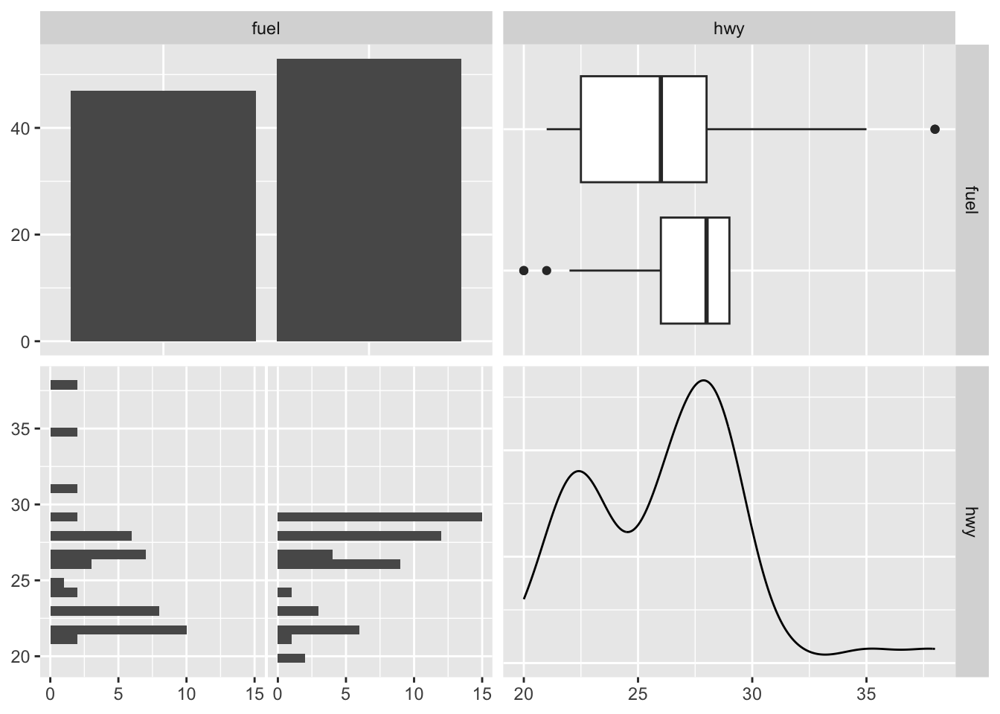

# R Lab 2 - Basics II

What we will review in this lab:

1. **Data frames and lists**,
2. **Programming Basics**.

## Data frames and lists

We will begin with lists first to get them out of the way. Although they are not used much in the book, you should know about them.  

### Lists
A list is a one-dimensional heterogeneous data structure. So it is indexed like a vector with a single integer value, but each element can contain an element of any type. Lets look at some examples of working with them:


```r
# creation
A <- list(42, "Hello", TRUE)
dim(A)
```

```
## NULL
```

```r
str(A)
```

```
## List of 3
##  $ : num 42
##  $ : chr "Hello"
##  $ : logi TRUE
```

```r
class(A)
```

```
## [1] "list"
```

```r
# Another one
B <- list(
          a = c(1, 2, 3, 4),
          b = TRUE,
          c = "Hello!",
          d = function(arg = 1) {print("Hello World!")},
          X = matrix(0, 4 , 4)
)

B
```

```
## $a
## [1] 1 2 3 4
## 
## $b
## [1] TRUE
## 
## $c
## [1] "Hello!"
## 
## $d
## function(arg = 1) {print("Hello World!")}
## 
## $X
##      [,1] [,2] [,3] [,4]
## [1,]    0    0    0    0
## [2,]    0    0    0    0
## [3,]    0    0    0    0
## [4,]    0    0    0    0
```

```r
dim(B)
```

```
## NULL
```

```r
dim(B$X)
```

```
## [1] 4 4
```

```r
str(B)
```

```
## List of 5
##  $ a: num [1:4] 1 2 3 4
##  $ b: logi TRUE
##  $ c: chr "Hello!"
##  $ d:function (arg = 1)  
##   ..- attr(*, "srcref")= 'srcref' int [1:8] 12 15 12 55 15 55 12 12
##   .. ..- attr(*, "srcfile")=Classes 'srcfilecopy', 'srcfile' <environment: 0x7f7abfb722e0> 
##  $ X: num [1:4, 1:4] 0 0 0 0 0 0 0 0 0 0 ...
```

```r
class(B)
```

```
## [1] "list"
```


  
Source: https://stats.idre.ucla.edu/stat/data/intro_r/intro_r.html#(27)  

Lists can be subset using two syntaxes, the `$` operator, and square brackets `[ ]`. The `$` operator returns a named element of a list. The `[ ]` syntax returns a list, while the `[[ ]]` returns an element of a list.  


```r
#For example to get the matrix in our list
B$X
```

```
##      [,1] [,2] [,3] [,4]
## [1,]    0    0    0    0
## [2,]    0    0    0    0
## [3,]    0    0    0    0
## [4,]    0    0    0    0
```

```r
#or
B[5]
```

```
## $X
##      [,1] [,2] [,3] [,4]
## [1,]    0    0    0    0
## [2,]    0    0    0    0
## [3,]    0    0    0    0
## [4,]    0    0    0    0
```

```r
#or
B[[5]]
```

```
##      [,1] [,2] [,3] [,4]
## [1,]    0    0    0    0
## [2,]    0    0    0    0
## [3,]    0    0    0    0
## [4,]    0    0    0    0
```

```r
#And to get the (1,3) element of matrix X in list B
B[[5]][1,3]
```

```
## [1] 0
```

### Data Frames

We have seen vectors, matrices, and lists for storing data. We will now introduce a data frame that is the most common way to store and interact with data in this book.  Datasets for statistical analysis are typically stored in data frames in R. Unlike a matrix, a data frame can have different data types for each elements (columns). A data frame is a list of vectors (columns - you can think of them as "variables"). So, each vector (column) must contain the same data type, but the different vectors (columns) can store different data types.  

**However, unlike a list, the columns (elements) of a data frame must all be vectors and have the same length (number of observations)**  


Data frames combine the features of matrices and lists.  

Like matrices, dataframes are **rectangular**, where the columns are variables and the rows are observations of those variables. like lists, dataframes can have elements (column vectors) of **different data types** (some double, some character, etc.) – but they **must be equal length**. Real datasets usually combine variables of different types, so data frames are well suited for storage.   


```r
#One way to do that
mydata <- data.frame(diabetic = c(TRUE, FALSE, TRUE, FALSE), 
                     height = c(65, 69, 71, 73))
mydata
```

```
##   diabetic height
## 1     TRUE     65
## 2    FALSE     69
## 3     TRUE     71
## 4    FALSE     73
```

```r
str(mydata)
```

```
## 'data.frame':	4 obs. of  2 variables:
##  $ diabetic: logi  TRUE FALSE TRUE FALSE
##  $ height  : num  65 69 71 73
```

```r
dim(mydata)
```

```
## [1] 4 2
```

```r
#Or create vectors for each column
diabetic = c(TRUE, FALSE, TRUE, FALSE)
height = c(65, 69, 71, 73)

#And include them in a dataframe as follows
mydata <- data.frame(diabetic, height)
mydata
```

```
##   diabetic height
## 1     TRUE     65
## 2    FALSE     69
## 3     TRUE     71
## 4    FALSE     73
```

```r
str(mydata)
```

```
## 'data.frame':	4 obs. of  2 variables:
##  $ diabetic: logi  TRUE FALSE TRUE FALSE
##  $ height  : num  65 69 71 73
```

```r
dim(mydata)
```

```
## [1] 4 2
```

```r
#And more importantly, you can extend it by adding more columns
weight = c(103, 45, 98.4, 70.5)
mydata <- data.frame(mydata, weight)
mydata
```

```
##   diabetic height weight
## 1     TRUE     65  103.0
## 2    FALSE     69   45.0
## 3     TRUE     71   98.4
## 4    FALSE     73   70.5
```

You will have the following mistake a lot.  Let's see it now so you can avoid it later.  


```r
#Try running the code below separately without the comment # and see what happens

#mydata <- data.frame(diabetic = c(TRUE, FALSE, TRUE, FALSE, FALSE), 
                     #height = c(65, 69, 71, 73))
```

The problem in the example above is that there are a different number of rows and columns. Here are some useful tools for diagnosing this problem:  


```r
#Number of columns
ncol(mydata)
```

```
## [1] 3
```

```r
nrow(mydata)
```

```
## [1] 4
```

Often data you’re working with has abstract column names, such as (x1, x2, x3…).The dataset cars is data from the 1920s on “Speed and Stopping Distances of Cars”. There is only 2 columns shown below.  


```r
colnames(datasets::cars)
```

```
## [1] "speed" "dist"
```

```r
#Using Base r:
colnames(cars)[1:2] <- c("Speed (mph)", "Stopping Distance (ft)")
colnames(cars)
```

```
## [1] "Speed (mph)"            "Stopping Distance (ft)"
```

```r
#Using GREP:
colnames(cars)[grep("dist", colnames(cars))] <- "Stopping Distance (ft)"
colnames(cars)
```

```
## [1] "Speed (mph)"            "Stopping Distance (ft)"
```


### Reading (importing) and writting (exporting) data files
When you read a data in other formats, they may also be imported as a data frame.  

How can we import data into R?  

The simple way is here:  


If the data is a .csv file, for example, we would also use the `read_csv()` function from the **readr** package. Note that R has a built in function `read.csv()` that operates very similarly. The readr function `read_csv()` has a number of advantages. For example, it is much faster reading larger data. It also uses the tibble package to read the data as a tibble.  


```r
# library(readr)
# library(RCurl)
# x <- getURL("https://raw.githubusercontent.com/tidyverse/readr/main/inst/extdata/mtcars.csv")
# example_csv = read_csv(x, show_col_types = FALSE)
# head(example_csv)
# str(example_csv)
```

A tibble is simply a data frame that prints with sanity. Notice in the output above that we are given additional information such as dimension and variable type.  
  
The `as_tibble()` function can be used to coerce a regular data frame to a tibble.  


```r
# library(tibble)
# example_data = as_tibble(example_csv)
# example_data
```

It is important to note that while matrices have rows and columns, data frames (tibbles) instead have observations and variables. When displayed in the console or viewer, each row is an observation and each column is a variable. `read_csv()` assigns the data frame to a class called tibble, a tidyverse structure that slightly alters how data frames behave, such as when they are being created or printed. Tibbles are still data frames, and will work in most functions that require data frame inputs.   

By default, tibbles only show the first ten rows of as many columns as will fit on screen. We also see the column types.  We can create tibbles manually in a nearly identical manner to data frames with `tibble()`.  

To convert a tibble to a regular data frame (to print the whole data set, for example), use `as.data.frame()`.  

To understand more about the data set, we use the `?` operator to pull up the documentation for the data. (You can use `??` to search the Internet for more info)  


```r
# ?mtcars
# #Results are not shown here
# 
# #To access each column
# example_data$mpg
# #or
# example_data[,1]
```

After importing our data, a quick glance at the dataset can often tell us if the data were read in correctly.  

Use `head()` and `tail()` to look at a specified number of rows at the beginning or end of a dataset, respectively.  

Use `View()` on a dataset to open a spreadsheet-style view of a dataset. In RStuido, clicking on a dataset in the Environment pane will `View()` it.  

We can export our data in a number of formats, including text, Excel .xlsx, and in other statistical software formats like Stata .dta, using `write_functions` that reverse the operations of the `read_functions`.  

Multiple objects can be stored in an R binary file (usally extension “.Rdata”) with `save()` and then later loaded with `load()`.  

I did not specify realistic path names below.  
  
- Excel .csv file: `write_csv(dat_csv, file = "path/to/save/filename.csv")` 
- Stata .dta file: `write_dta(dat_csv, file = "path/to/save/filename.dta")` 
- save these objects to an .Rdata file:  `save(dat_csv, mydata, file="path/to/save/filename.Rdata")` 

One last thing: if you want to save the entire workspace, `save.image()` is just a short-cut for ‘save my current workspace’, i.e., `save(list = ls(all.names = TRUE), file = ".RData", envir = .GlobalEnv)`. It is also what happens with `q("yes")`.  

### Subsetting Data Frames

Subsetting data frames can work much like subsetting matrices using square brackets, `[,]`. Let's use another data given in the **ggplot2** library.    


```r
library(ggplot2)
head(mpg, n = 10)
```

```
## # A tibble: 10 × 11
##    manufacturer model      displ  year   cyl trans drv     cty   hwy fl    class
##    <chr>        <chr>      <dbl> <int> <int> <chr> <chr> <int> <int> <chr> <chr>
##  1 audi         a4           1.8  1999     4 auto… f        18    29 p     comp…
##  2 audi         a4           1.8  1999     4 manu… f        21    29 p     comp…
##  3 audi         a4           2    2008     4 manu… f        20    31 p     comp…
##  4 audi         a4           2    2008     4 auto… f        21    30 p     comp…
##  5 audi         a4           2.8  1999     6 auto… f        16    26 p     comp…
##  6 audi         a4           2.8  1999     6 manu… f        18    26 p     comp…
##  7 audi         a4           3.1  2008     6 auto… f        18    27 p     comp…
##  8 audi         a4 quattro   1.8  1999     4 manu… 4        18    26 p     comp…
##  9 audi         a4 quattro   1.8  1999     4 auto… 4        16    25 p     comp…
## 10 audi         a4 quattro   2    2008     4 manu… 4        20    28 p     comp…
```

```r
mpg[mpg$hwy > 35, c("manufacturer", "model", "year")]
```

```
## # A tibble: 6 × 3
##   manufacturer model       year
##   <chr>        <chr>      <int>
## 1 honda        civic       2008
## 2 honda        civic       2008
## 3 toyota       corolla     2008
## 4 volkswagen   jetta       1999
## 5 volkswagen   new beetle  1999
## 6 volkswagen   new beetle  1999
```

An alternative would be to use the `subset()` function, which has a much more readable syntax.  


```r
subset(mpg, subset = hwy > 35, select = c("manufacturer", "model", "year"))
```

```
## # A tibble: 6 × 3
##   manufacturer model       year
##   <chr>        <chr>      <int>
## 1 honda        civic       2008
## 2 honda        civic       2008
## 3 toyota       corolla     2008
## 4 volkswagen   jetta       1999
## 5 volkswagen   new beetle  1999
## 6 volkswagen   new beetle  1999
```

Lastly, we could use the filter and select functions from the `dplyr` package which introduces the `%>%` operator from the magrittr package. This is not necessary for this book, however the dplyr package is something you should be aware of as it is becoming a popular tool in the R world.  


```r
# library(dplyr)
# mpg %>% filter(hwy > 35) %>% select(manufacturer, model, year)
```

### Plotting from data frame

There are many good ways and packages for plotting.  I'll show you one here.  Visualizing the relationship between multiple variables can get messy very quickly. Here is the `ggpairs()` function in the **GGally** package [@Tay_2019].


```r
library(fueleconomy)  #install.packages("fueleconomy")
data(vehicles)
df <- vehicles[1:100, ]
str(df)
```

```
## tibble [100 × 12] (S3: tbl_df/tbl/data.frame)
##  $ id   : num [1:100] 13309 13310 13311 14038 14039 ...
##  $ make : chr [1:100] "Acura" "Acura" "Acura" "Acura" ...
##  $ model: chr [1:100] "2.2CL/3.0CL" "2.2CL/3.0CL" "2.2CL/3.0CL" "2.3CL/3.0CL" ...
##  $ year : num [1:100] 1997 1997 1997 1998 1998 ...
##  $ class: chr [1:100] "Subcompact Cars" "Subcompact Cars" "Subcompact Cars" "Subcompact Cars" ...
##  $ trans: chr [1:100] "Automatic 4-spd" "Manual 5-spd" "Automatic 4-spd" "Automatic 4-spd" ...
##  $ drive: chr [1:100] "Front-Wheel Drive" "Front-Wheel Drive" "Front-Wheel Drive" "Front-Wheel Drive" ...
##  $ cyl  : num [1:100] 4 4 6 4 4 6 4 4 6 5 ...
##  $ displ: num [1:100] 2.2 2.2 3 2.3 2.3 3 2.3 2.3 3 2.5 ...
##  $ fuel : chr [1:100] "Regular" "Regular" "Regular" "Regular" ...
##  $ hwy  : num [1:100] 26 28 26 27 29 26 27 29 26 23 ...
##  $ cty  : num [1:100] 20 22 18 19 21 17 20 21 17 18 ...
```

Let's see how `GGally::ggpairs()` visualizes relationships between quantitative variables:
  

```r
library(GGally) #install.packages("GGally")
new_df <- df[, c("cyl", "hwy", "cty")]
ggpairs(new_df)
```


The visualization changes a little when we have a mix of quantitative and categorical variables. Below, fuel is a categorical variable while hwy is a quantitative variable.  


```r
mixed_df <- df[, c("fuel", "hwy")]
ggpairs(mixed_df)
```



### Some useful functions


```r
my_data <- data.frame(a=1:10, b=rnorm(10, 2, 5))

# Cut a continuous variable into intervals with new integer
my_data$c <- cut(my_data$b, 3)
str(my_data)
```

```
## 'data.frame':	10 obs. of  3 variables:
##  $ a: int  1 2 3 4 5 6 7 8 9 10
##  $ b: num  -0.372 4.221 -3.573 0.714 -5.052 ...
##  $ c: Factor w/ 3 levels "(-5.06,-1.24]",..: 2 3 1 2 1 2 2 3 2 1
```

```r
# Standardizes variable (subtracts mean and divides by standard deviation)
my_data$d <- scale(my_data$a)
str(my_data)
```

```
## 'data.frame':	10 obs. of  4 variables:
##  $ a: int  1 2 3 4 5 6 7 8 9 10
##  $ b: num  -0.372 4.221 -3.573 0.714 -5.052 ...
##  $ c: Factor w/ 3 levels "(-5.06,-1.24]",..: 2 3 1 2 1 2 2 3 2 1
##  $ d: num [1:10, 1] -1.486 -1.156 -0.826 -0.495 -0.165 ...
##   ..- attr(*, "scaled:center")= num 5.5
##   ..- attr(*, "scaled:scale")= num 3.03
```

```r
# lag, lead and cumulative sum a variable
library(dplyr)
my_data$f <- lag(my_data$d, n=1L) 
my_data$g <- lead(my_data$d, n=1L) 
my_data$h <- cumsum(my_data$d) 
my_data
```

```
##     a           b             c          d          f          g         h
## 1   1 -0.37154115  (-1.24,2.58] -1.4863011         NA -1.1560120 -1.486301
## 2   2  4.22129557    (2.58,6.4] -1.1560120 -1.4863011 -0.8257228 -2.642313
## 3   3 -3.57276914 (-5.06,-1.24] -0.8257228 -1.1560120 -0.4954337 -3.468036
## 4   4  0.71362156  (-1.24,2.58] -0.4954337 -0.8257228 -0.1651446 -3.963470
## 5   5 -5.05193373 (-5.06,-1.24] -0.1651446 -0.4954337  0.1651446 -4.128614
## 6   6  0.32788017  (-1.24,2.58]  0.1651446 -0.1651446  0.4954337 -3.963470
## 7   7  0.07214929  (-1.24,2.58]  0.4954337  0.1651446  0.8257228 -3.468036
## 8   8  6.39320773    (2.58,6.4]  0.8257228  0.4954337  1.1560120 -2.642313
## 9   9  1.50918603  (-1.24,2.58]  1.1560120  0.8257228  1.4863011 -1.486301
## 10 10 -2.94321678 (-5.06,-1.24]  1.4863011  1.1560120         NA  0.000000
```

### Categorical Variables in Data Frames

Let's create a very simple data frame.  


```r
b <- data.frame(gender=c("male", "female", "female", 
                         "female", "female", "male"),
                numbers=c(1,2,3, 0.5, 11, -1))
b
```

```
##   gender numbers
## 1   male     1.0
## 2 female     2.0
## 3 female     3.0
## 4 female     0.5
## 5 female    11.0
## 6   male    -1.0
```

```r
dim(b)
```

```
## [1] 6 2
```

```r
str(b)
```

```
## 'data.frame':	6 obs. of  2 variables:
##  $ gender : chr  "male" "female" "female" "female" ...
##  $ numbers: num  1 2 3 0.5 11 -1
```

Why does say “levels” in the output?  Because by default, character vectors are converted to factors in `data.frame()`.
If you want to convert them to back to characters.  


```r
table(b$gender) # Distribution of gender
```

```
## 
## female   male 
##      4      2
```

```r
# back to character
b$gender <- as.character(b$gender)
str(b)
```

```
## 'data.frame':	6 obs. of  2 variables:
##  $ gender : chr  "male" "female" "female" "female" ...
##  $ numbers: num  1 2 3 0.5 11 -1
```

```r
# back to factor
b$gender <- as.factor(b$gender)
str(b)
```

```
## 'data.frame':	6 obs. of  2 variables:
##  $ gender : Factor w/ 2 levels "female","male": 2 1 1 1 1 2
##  $ numbers: num  1 2 3 0.5 11 -1
```

## Programming Basics

In this section we see three main applications: conditional flows, loops, and functions, that are main pillars of any type of programming.  

### if/Else

The main syntax is as follows  

`if (condition) {`  
      **some R code**  
 `} else {`  
      **more R code**  
`}` 

Here is a simple example:  


```r
x <- c("what","is","truth")

if("Truth" %in% x) {
   print("Truth is found")
} else {
   print("Truth is not found")
}
```

```
## [1] "Truth is not found"
```

How about this:  


```r
x <- c(1, 4, 4)
a <- 3
#Here is a nice if/Else
if(length(x[x==a])>0) {
  print(paste("x has", length(x[x==a]), a))
} else {
  print(paste("x doesn't have any", a))
}
```

```
## [1] "x doesn't have any 3"
```

```r
#Another one with pipping
a <- 4
if(a %in% x) {
  print(paste("x has", length(x[x==a]), a))
} else {
  print(paste("x doesn't have any", a))
}
```

```
## [1] "x has 2 4"
```

Nested conditions:  


```r
#Change the numbers to see all conditions
x <- 0
y <- 4
if (x == 0 & y!= 0) {
  print("a number cannot be divided by zero")
} else if (x == 0 & y == 0) {
  print("a zero cannot be divided by zero")
} else {
  a <- y/x 
  print(paste("y/x = ", a))
}
```

```
## [1] "a number cannot be divided by zero"
```

A simpler, one-line `ifelse`!  


```r
#Change the numbers
x <- 0
y <- 4
ifelse (x > y, "x is bigger than y", "y is bigger than x")
```

```
## [1] "y is bigger than x"
```

```r
#more, because the ifelse will fail if x = y.  Try it!
ifelse (x == y, "x is the same as y",
        ifelse(x > y, "x is bigger than y", "y is bigger than x"))
```

```
## [1] "y is bigger than x"
```

A simpler, without else!  


```r
z <- 0
w <- 4
if(z > w) print("w is bigger than z")

#Change the numbers
x <- 5
y <- 3
if(x > y) print("x is bigger than y")
```

```
## [1] "x is bigger than y"
```

```r
#See that both of them moves to the next line.
```

Building multiple conditions without else (it's a silly example!):  


```r
z <- 0
w <- 4
x <- 5
y <- 3
if(z > w) print("z is bigger than w")
if(w > z) print("w is bigger than z")
```

```
## [1] "w is bigger than z"
```

```r
if(x > y) print("x is bigger than y")
```

```
## [1] "x is bigger than y"
```

```r
if(y > x) print("y is bigger than x")
if(z > x) print("z is bigger than x")
if(x > z) print("x is bigger than z")
```

```
## [1] "x is bigger than z"
```

```r
if(w > y) print("w is bigger than y")
```

```
## [1] "w is bigger than y"
```

```r
if(y > w) print("y is bigger than w")

#Try it with if-else.
```

The `ifelse()` function only allows for one “if” statement, two cases. You could add nested “if” statements, but that’s just a pain, especially if the 3+ conditions you want to use are all on the same level, conceptually. Is there a way to specify multiple conditions at the same time?  

`dplyr()` is the most powerful library for data management.  When you have time, read more about it!  
Source: https://stats.idre.ucla.edu/stat/data/intro_r/intro_r.html#(35)  


```r
#Let's create a data frame:
df <- data.frame("name"=c("Kaija", "Ella", "Andis"), "test1" = c(FALSE, TRUE, TRUE),
                 "test2" = c(FALSE, FALSE, TRUE))
df
```

```
##    name test1 test2
## 1 Kaija FALSE FALSE
## 2  Ella  TRUE FALSE
## 3 Andis  TRUE  TRUE
```

```r
# Suppose we want  separate the people into three groups:
#People who passed both tests: Group A
#People who passed one test: Group B
#People who passed neither test: Group C

#dplyr has a function for exactly this purpose: case_when().
library(dplyr)
df <- df %>% 
mutate(group = case_when(test1 & test2 ~ "A", # both tests: group A
                         xor(test1, test2) ~ "B", # one test: group B
                         !test1 & !test2 ~ "C" # neither test: group C
))
df
```

```
##    name test1 test2 group
## 1 Kaija FALSE FALSE     C
## 2  Ella  TRUE FALSE     B
## 3 Andis  TRUE  TRUE     A
```


### Loops

What would you do if you needed to execute a block of code multiple times? In general, statements are executed sequentially. A loop statement allows us to execute a statement or group of statements multiple times and the following is the general form of a loop statement in most programming languages.  There are 3 main loop types: `while()`, `for()`, `repeat()`.  

Here are some examples for `for()` loop:  


```r
x <- c(3, -1, 4, 2, 10, 5)

for (i in 1:length(x)) {
  x[i] <- x[i] * 2
}

x
```

```
## [1]  6 -2  8  4 20 10
```

Note that this just for an example.  If we want to multiply each element of a vector by 2, a loop isn't the best way.  Although it is very normal in many programming languages, we would simply use a vectorized operation in R.  


```r
x <- c(3, -1, 4, 2, 10, 5)
x <- x * 2
x
```

```
## [1]  6 -2  8  4 20 10
```

But some times it would be very handy:  


```r
# If the element in x is not zero, multiply it with the subsequent element

x <- c(3, -1, 4, 2, 10, 5)
for (i in 1:(length(x)-1)) {
  ifelse(x[i] > 0,  x[i] <- x[i] * x[i + 1], x[i] <- 0)  
}
x
```

```
## [1] -3  0  8 20 50  5
```

Here are some examples for `while()` loop:  


```r
# Let's use our first example

x <- 3
cnt <- 1

while (cnt < 11) {
   x = x * 2
   cnt = cnt + 1
}
x
```

```
## [1] 3072
```

Here are some examples for `repeat()` loop:  


```r
# Let's use our first example

x <- 3
cnt <- 1

repeat {
   x = x * 2
   cnt = cnt + 1
  
   if(cnt > 10) break
}
x
```

```
## [1] 3072
```

### The `apply()` family
The `apply()` family is one of the R base packages and is populated with functions to manipulate slices of data from matrices, arrays, lists and data frames in a repetitive way. These functions allow crossing the data in a number of ways and avoid explicit use of loop constructs. They act on an input list, matrix or array and apply a named function with one or several optional arguments. The family is made up of the `apply()`, `lapply()` , `sapply()`, `vapply()`, `mapply()`, `rapply()`, and `tapply()` functions.    

#### `apply()`
  
The R base manual tells you that it’s called as follows: `apply(X, MARGIN, FUN, ...)`, where, X is an array or a matrix if the dimension of the array is 2; MARGIN is a variable defining how the function is applied: when `MARGIN=1`, it applies over rows, whereas with `MARGIN=2`, it works over columns. Note that when you use the construct `MARGIN=c(1,2)`, it applies to both rows and columns; and FUN, which is the function that you want to apply to the data. It can be any R function, including a User Defined Function (UDF).  


```r
# Construct a 5x6 matrix
X <- matrix(rnorm(30), nrow=5, ncol=6)

# Sum the values of each column with `apply()`
apply(X, 2, sum)
```

```
## [1]  0.9142539  1.5908357 -0.2799456 -1.2235486  2.3973103 -1.9489700
```

```r
apply(X, 2, length)
```

```
## [1] 5 5 5 5 5 5
```

```r
apply(X, 1, length)
```

```
## [1] 6 6 6 6 6
```

```r
apply(X, 2, function (x) length(x)-1)
```

```
## [1] 4 4 4 4 4 4
```

```r
#If you don’t want to write a function inside of the arguments
len <- function(x){
  length(x)-1
}
apply(X,2, len)
```

```
## [1] 4 4 4 4 4 4
```

```r
#It can also be used to repeat a function on cells within a matrix
X_new <- apply(X, 1:2, function(x) x+3)
X_new
```

```
##          [,1]     [,2]     [,3]     [,4]     [,5]     [,6]
## [1,] 2.910907 2.001234 3.832523 2.216080 3.349413 3.430276
## [2,] 3.677324 3.458570 3.239028 2.980394 4.568194 2.476864
## [3,] 4.879102 2.939959 2.241100 3.856885 3.583361 1.800717
## [4,] 2.770858 5.057442 3.510746 2.984496 3.093492 1.955614
## [5,] 1.676063 3.133630 1.896657 1.738597 2.802849 3.387559
```

Since `apply()` is used only for matrices, if you apply `apply()` to a data frame, it first coerces your data.frame to an array which means all the columns must have the same type. Depending on your context, this could have unintended consequences.  For a safer practice in data frames, we can use `lappy()` and `sapply()`:  

#### `lapply()`
  
You want to apply a given function to every element of a list and obtain a list as a result. When you execute `?lapply`, you see that the syntax looks like the `apply()` function.  The difference is that it can be used for other objects like data frames, lists or vectors. And the output returned is a list (which explains the “l” in the function name), which has the same number of elements as the object passed to it.  `lapply()` function does not need MARGIN.   


```r
A<-c(1:9)
B<-c(1:12)
C<-c(1:15)
my.lst<-list(A,B,C)
lapply(my.lst, sum)
```

```
## [[1]]
## [1] 45
## 
## [[2]]
## [1] 78
## 
## [[3]]
## [1] 120
```
  
#### `sapply()`
  
`sapply` works just like lapply, but will simplify the output if possible. This means that instead of returning a list like `lapply`, it will return a vector instead if the data is simplifiable.   


```r
A<-c(1:9)
B<-c(1:12)
C<-c(1:15)
my.lst<-list(A,B,C)
sapply(my.lst, sum)
```

```
## [1]  45  78 120
```

#### `tapply()`
  
Sometimes you may want to perform the apply function on some data, but have it separated by factor. In that case, you should use `tapply`. Let’s take a look at the information for `tapply`.  


```r
X <- matrix(c(1:10, 11:20, 21:30), nrow = 10, ncol = 3)
tdata <- as.data.frame(cbind(c(1,1,1,1,1,2,2,2,2,2), X))
colnames(tdata)
```

```
## [1] "V1" "V2" "V3" "V4"
```

```r
tapply(tdata$V2, tdata$V1, mean)
```

```
## 1 2 
## 3 8
```

What we have here is an important tool:  We have a conditional mean of column 2 (V2) with respect to column 1 (V1). You can use tapply to do some quick summary statistics on a variable split by condition.  


```r
summary <- tapply(tdata$V2, tdata$V1, function(x) c(mean(x), sd(x)))
summary
```

```
## $`1`
## [1] 3.000000 1.581139
## 
## $`2`
## [1] 8.000000 1.581139
```

#### `mapply()`
  
`mapply()` would be used to create a new variable. For example, using dataset tdata, we could divide one column by another column to create a new value. This would be useful for creating a ratio of two variables as shown in the example below.   


```r
tdata$V5 <- mapply(function(x, y) x/y, tdata$V2, tdata$V4)
tdata$V5
```

```
##  [1] 0.04761905 0.09090909 0.13043478 0.16666667 0.20000000 0.23076923
##  [7] 0.25925926 0.28571429 0.31034483 0.33333333
```

### Functions

An R function is created by using the keyword function. The basic syntax of an R function definition is as follows:  

To use a function, you simply type its name, followed by an open parenthesis, then specify values of its arguments, then finish with a closing parenthesis.  An argument is a variable which is used in the body of the function. Specifying the values of the arguments is essentially providing the inputs to the function. Let's write our first function:  


```r
first <- function(a){
  b <- a ^ 2
  return(b)
}

first(1675)
```

```
## [1] 2805625
```

Let's have a function that find the z-score (standardization).  That's subtracting the sample mean, and dividing by the sample standard deviation.  

$$
\frac{x-\overline{x}}{s}
$$
  

```r
z_score <- function(x){
  m <- mean(x)
  std <- sd(x)
  z <- (x - m)/std
  z
}

set.seed(1)
x <- rnorm(10, 3, 30)
z <- z_score(x)
z
```

```
##  [1] -0.97190653  0.06589991 -1.23987805  1.87433300  0.25276523 -1.22045645
##  [7]  0.45507643  0.77649606  0.56826358 -0.56059319
```

```r
#to check it out
round(mean(z), 4)
```

```
## [1] 0
```

```r
sd(z)
```

```
## [1] 1
```

We can do a better job in writing `z_score()`  


```r
z_score <- function(x){
  z <- (x - mean(x))/sd(x)
}

set.seed(1)
x <- rnorm(10, 3, 30)
z <- z_score(x)
z
```

```
##  [1] -0.97190653  0.06589991 -1.23987805  1.87433300  0.25276523 -1.22045645
##  [7]  0.45507643  0.77649606  0.56826358 -0.56059319
```

Lets create a function that prints the factorials:


```r
fact <- function(a){
  b <- 1
  for (i in 1:(a-1)) {
    b <- b*(i+1) 
  }
  b
}

fact(5)
```

```
## [1] 120
```

Creating loops is an act of art and requires very careful thinking.  The same loop can be done by many different structures.  And it always takes more time to understand somebody else's loop than your own!   

#### `outer()`

`outer()` takes two vectors and a function (that itself takes two arguments) and builds a **matrix** by calling the given function for each combination of the elements in the two vectors.  


```r
x <- c(0, 1, 2)
y <- c(0, 1, 2, 3, 4)

m <- outer (
   y,     # First dimension:  the columns (y)
   x,     # Second dimension: the rows    (x)
   function (x, y)   x+2*y
)

m
```

```
##      [,1] [,2] [,3]
## [1,]    0    2    4
## [2,]    1    3    5
## [3,]    2    4    6
## [4,]    3    5    7
## [5,]    4    6    8
```
  
In place of the function, an operator can be given, which makes it easy to create a matrix with simple calculations (such as multiplying):  


```r
m <- outer(c(10, 20, 30, 40), c(2, 4, 6), "*")
m
```

```
##      [,1] [,2] [,3]
## [1,]   20   40   60
## [2,]   40   80  120
## [3,]   60  120  180
## [4,]   80  160  240
```

It becomes very handy when we build a polynomial model:  


```r
x <- sample(0:20, 10, replace = TRUE)
x
```

```
##  [1]  8 14 20  4  8 13  4  4  1  9
```

```r
m <- outer(x, 1:4, "^")
m
```

```
##       [,1] [,2] [,3]   [,4]
##  [1,]    8   64  512   4096
##  [2,]   14  196 2744  38416
##  [3,]   20  400 8000 160000
##  [4,]    4   16   64    256
##  [5,]    8   64  512   4096
##  [6,]   13  169 2197  28561
##  [7,]    4   16   64    256
##  [8,]    4   16   64    256
##  [9,]    1    1    1      1
## [10,]    9   81  729   6561
```

### `dplyr()`

Taking the time to prepare your data before analysis can save you frustration and time spent cleaning up errors. The package **dplyr** contains several easy-to-use data management functions that we will learn to use to manage our data.  
