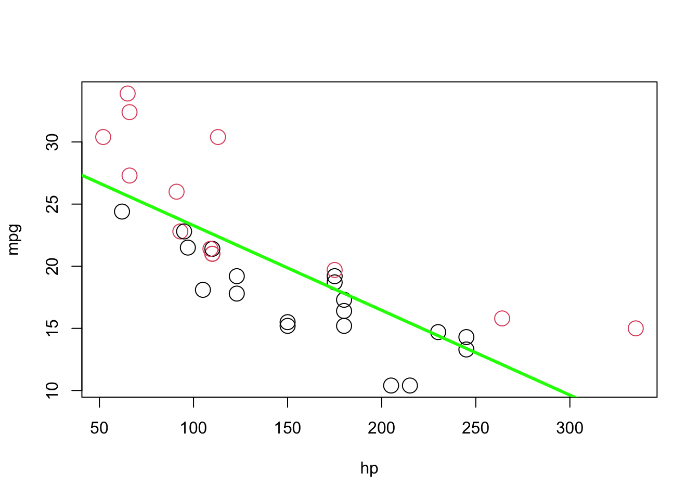
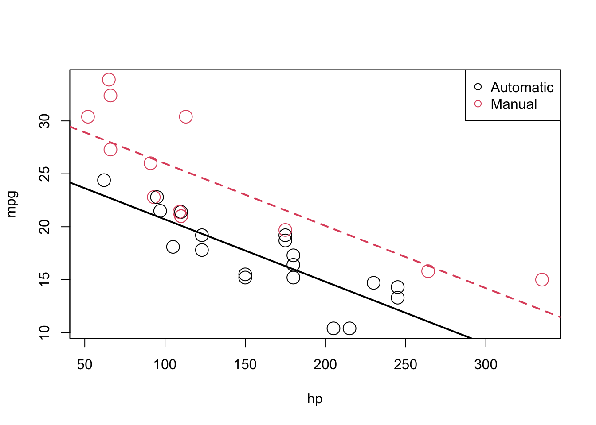
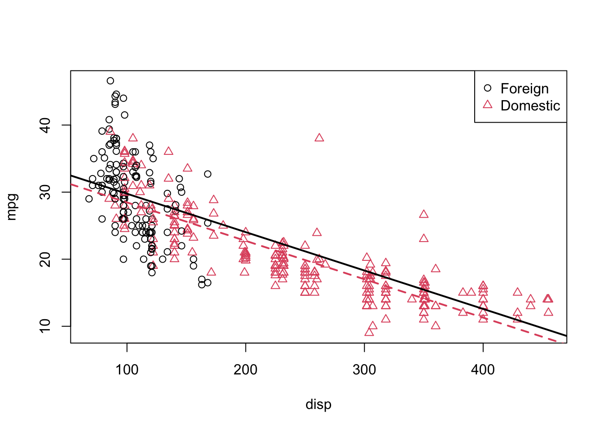

# R Lab 3 - Preparing the data

## Preparing the data for a regression analysis with `lm()`

In chapter 2 we estimated a simple linear regression by writing a set of simple R commands to perform the necessary calculations. But we can use the `lm()` command, instead. We will use three datasets in this lab. Let's start with the first one, `vehicles`.


```r
library(fueleconomy)  #install.packages("fueleconomy")

data(vehicles)

df <- as.data.frame(vehicles)

head(df)
```

```
##      id  make       model year           class           trans
## 1 13309 Acura 2.2CL/3.0CL 1997 Subcompact Cars Automatic 4-spd
## 2 13310 Acura 2.2CL/3.0CL 1997 Subcompact Cars    Manual 5-spd
## 3 13311 Acura 2.2CL/3.0CL 1997 Subcompact Cars Automatic 4-spd
## 4 14038 Acura 2.3CL/3.0CL 1998 Subcompact Cars Automatic 4-spd
## 5 14039 Acura 2.3CL/3.0CL 1998 Subcompact Cars    Manual 5-spd
## 6 14040 Acura 2.3CL/3.0CL 1998 Subcompact Cars Automatic 4-spd
##               drive cyl displ    fuel hwy cty
## 1 Front-Wheel Drive   4   2.2 Regular  26  20
## 2 Front-Wheel Drive   4   2.2 Regular  28  22
## 3 Front-Wheel Drive   6   3.0 Regular  26  18
## 4 Front-Wheel Drive   4   2.3 Regular  27  19
## 5 Front-Wheel Drive   4   2.3 Regular  29  21
## 6 Front-Wheel Drive   6   3.0 Regular  26  17
```

```r
str(df)
```

```
## 'data.frame':	33442 obs. of  12 variables:
##  $ id   : num  13309 13310 13311 14038 14039 ...
##  $ make : chr  "Acura" "Acura" "Acura" "Acura" ...
##  $ model: chr  "2.2CL/3.0CL" "2.2CL/3.0CL" "2.2CL/3.0CL" "2.3CL/3.0CL" ...
##  $ year : num  1997 1997 1997 1998 1998 ...
##  $ class: chr  "Subcompact Cars" "Subcompact Cars" "Subcompact Cars" "Subcompact Cars" ...
##  $ trans: chr  "Automatic 4-spd" "Manual 5-spd" "Automatic 4-spd" "Automatic 4-spd" ...
##  $ drive: chr  "Front-Wheel Drive" "Front-Wheel Drive" "Front-Wheel Drive" "Front-Wheel Drive" ...
##  $ cyl  : num  4 4 6 4 4 6 4 4 6 5 ...
##  $ displ: num  2.2 2.2 3 2.3 2.3 3 2.3 2.3 3 2.5 ...
##  $ fuel : chr  "Regular" "Regular" "Regular" "Regular" ...
##  $ hwy  : num  26 28 26 27 29 26 27 29 26 23 ...
##  $ cty  : num  20 22 18 19 21 17 20 21 17 18 ...
```

### Factor variables

If we want to estimate a model, we need to check the structure of the model variables in the data. For example, you can see that some of the variables are "characters", such as *make*. It is always a good practice to transform them into *factor* variables also known as *indicator*, *categorical*, or *dummy* variables. [You can still use "character" variables in `lm()`]{.ul} or use them in descriptive analyses, but we will lose many features. There are many different ways to convert one type of vector to another type, here are two simple ways:


```r
#First way:
df <- as.data.frame(vehicles)
for (i in 1:ncol(df)) {
  if(is.character(df[,i])) df[,i] <- as.factor(df[,i])
}

#2nd way:
df <- as.data.frame(vehicles)
colms <- sapply(df, is.character)
df[colms] <- lapply(df[colms], as.factor)
str(df)
```

```
## 'data.frame':	33442 obs. of  12 variables:
##  $ id   : num  13309 13310 13311 14038 14039 ...
##  $ make : Factor w/ 128 levels "Acura","Alfa Romeo",..: 1 1 1 1 1 1 1 1 1 1 ...
##  $ model: Factor w/ 3198 levels "1-Ton Truck 2WD",..: 28 28 28 29 29 29 29 29 29 30 ...
##  $ year : num  1997 1997 1997 1998 1998 ...
##  $ class: Factor w/ 34 levels "Compact Cars",..: 29 29 29 29 29 29 29 29 29 1 ...
##  $ trans: Factor w/ 47 levels "Auto (AV-S6)",..: 33 44 33 33 44 33 33 44 33 33 ...
##  $ drive: Factor w/ 7 levels "2-Wheel Drive",..: 5 5 5 5 5 5 5 5 5 5 ...
##  $ cyl  : num  4 4 6 4 4 6 4 4 6 5 ...
##  $ displ: num  2.2 2.2 3 2.3 2.3 3 2.3 2.3 3 2.5 ...
##  $ fuel : Factor w/ 13 levels "CNG","Diesel",..: 12 12 12 12 12 12 12 12 12 8 ...
##  $ hwy  : num  26 28 26 27 29 26 27 29 26 23 ...
##  $ cty  : num  20 22 18 19 21 17 20 21 17 18 ...
```

```r
#We won't learn the advance use of 'apply' family in this text.
#But this is a helpful line.  apply() works only with matrices.
#sapply() and lapply() are for lists.  But a data frame is also a list
#Therefore df[2] instead of df[, 2] can work very well.
#How about df[1:10, 2] vs df[[2]][1:10].  Same!
```

You can also numeric or integer types for indicator variables. Again the good practice is to convert them to factor variables.

### Dummy Coding

Let's look at drive in our data. In dummy coding, you will always have a contrast matrix with one less column than levels of the original variable. In our example, our categorical variable has 7 levels so we will have contrast matrices with 6 columns and 7 rows.


```r
tapply(df$hwy, df$drive, mean) # Mean hwy MPG for each drive type.
```

```
##              2-Wheel Drive              4-Wheel Drive 
##                   20.22091                   22.14592 
## 4-Wheel or All-Wheel Drive            All-Wheel Drive 
##                   19.62193                   24.75927 
##          Front-Wheel Drive    Part-time 4-Wheel Drive 
##                   28.32944                   18.72917 
##           Rear-Wheel Drive 
##                   20.98899
```

```r
#This is also a nice function. Try this:
#This is similar to "egen" in Stata.

tapply(df$hwy, df$drive, function(x) c(mean(x), sd(x)))
```

```
## $`2-Wheel Drive`
## [1] 20.220907  7.524566
## 
## $`4-Wheel Drive`
## [1] 22.145923  3.742637
## 
## $`4-Wheel or All-Wheel Drive`
## [1] 19.62193  3.68364
## 
## $`All-Wheel Drive`
## [1] 24.759274  4.046489
## 
## $`Front-Wheel Drive`
## [1] 28.329437  5.536714
## 
## $`Part-time 4-Wheel Drive`
## [1] 18.729167  2.069728
## 
## $`Rear-Wheel Drive`
## [1] 20.988994  4.949314
```

Dummy coding is a very commonly used coding scheme. It compares each level of the categorical variable to a fixed reference level. For example, we can choose `drive = 1` as the reference group and compare the mean of each level of drive to the reference level of 1. This is the default for disordered factors in R.


```r
#assigning the treatment contrasts to drive
contrasts(df$drive)
```

```
##                            4-Wheel Drive 4-Wheel or All-Wheel Drive
## 2-Wheel Drive                          0                          0
## 4-Wheel Drive                          1                          0
## 4-Wheel or All-Wheel Drive             0                          1
## All-Wheel Drive                        0                          0
## Front-Wheel Drive                      0                          0
## Part-time 4-Wheel Drive                0                          0
## Rear-Wheel Drive                       0                          0
##                            All-Wheel Drive Front-Wheel Drive
## 2-Wheel Drive                            0                 0
## 4-Wheel Drive                            0                 0
## 4-Wheel or All-Wheel Drive               0                 0
## All-Wheel Drive                          1                 0
## Front-Wheel Drive                        0                 1
## Part-time 4-Wheel Drive                  0                 0
## Rear-Wheel Drive                         0                 0
##                            Part-time 4-Wheel Drive Rear-Wheel Drive
## 2-Wheel Drive                                    0                0
## 4-Wheel Drive                                    0                0
## 4-Wheel or All-Wheel Drive                       0                0
## All-Wheel Drive                                  0                0
## Front-Wheel Drive                                0                0
## Part-time 4-Wheel Drive                          1                0
## Rear-Wheel Drive                                 0                1
```

```r
contrasts(df$drive) <- contr.treatment(7, base=4) #Changing the base
contrasts(df$drive)
```

```
##                            1 2 3 5 6 7
## 2-Wheel Drive              1 0 0 0 0 0
## 4-Wheel Drive              0 1 0 0 0 0
## 4-Wheel or All-Wheel Drive 0 0 1 0 0 0
## All-Wheel Drive            0 0 0 0 0 0
## Front-Wheel Drive          0 0 0 1 0 0
## Part-time 4-Wheel Drive    0 0 0 0 1 0
## Rear-Wheel Drive           0 0 0 0 0 1
```

We can make good tables as well:


```r
summary(df$drive)
```

```
##              2-Wheel Drive              4-Wheel Drive 
##                        507                        699 
## 4-Wheel or All-Wheel Drive            All-Wheel Drive 
##                       6647                       1267 
##          Front-Wheel Drive    Part-time 4-Wheel Drive 
##                      12233                         96 
##           Rear-Wheel Drive 
##                      11993
```

```r
table(df$fuel, df$drive)
```

```
##                              
##                               2-Wheel Drive 4-Wheel Drive
##   CNG                                     0             0
##   Diesel                                 72            21
##   Electricity                            14             0
##   Gasoline or E85                         0            93
##   Gasoline or natural gas                 0             0
##   Gasoline or propane                     0             0
##   Midgrade                                0            12
##   Premium                                 1           223
##   Premium and Electricity                 0             0
##   Premium Gas or Electricity              0             0
##   Premium or E85                          0            18
##   Regular                               420           332
##   Regular Gas and Electricity             0             0
##                              
##                               4-Wheel or All-Wheel Drive All-Wheel Drive
##   CNG                                                  2               0
##   Diesel                                             225              30
##   Electricity                                          0               0
##   Gasoline or E85                                    147              97
##   Gasoline or natural gas                              4               0
##   Gasoline or propane                                  4               0
##   Midgrade                                             0               6
##   Premium                                           1480             679
##   Premium and Electricity                              0               0
##   Premium Gas or Electricity                           0               1
##   Premium or E85                                       1              32
##   Regular                                           4784             422
##   Regular Gas and Electricity                          0               0
##                              
##                               Front-Wheel Drive Part-time 4-Wheel Drive
##   CNG                                        23                       0
##   Diesel                                    200                       0
##   Electricity                                25                       0
##   Gasoline or E85                           238                      28
##   Gasoline or natural gas                     5                       0
##   Gasoline or propane                         0                       0
##   Midgrade                                    0                       0
##   Premium                                  2088                       8
##   Premium and Electricity                     0                       0
##   Premium Gas or Electricity                  5                       0
##   Premium or E85                              0                       0
##   Regular                                  9641                      60
##   Regular Gas and Electricity                 8                       0
##                              
##                               Rear-Wheel Drive
##   CNG                                       33
##   Diesel                                   326
##   Electricity                               16
##   Gasoline or E85                          440
##   Gasoline or natural gas                    9
##   Gasoline or propane                        4
##   Midgrade                                  25
##   Premium                                 4138
##   Premium and Electricity                    1
##   Premium Gas or Electricity                 1
##   Premium or E85                            37
##   Regular                                 6963
##   Regular Gas and Electricity                0
```

### Column (Variable) names

Before any type of data analysis, we need to take care of several things. One of these is that we usually do not use the whole data, but a subset of the data. For example, you may want to remove some observations or keep only some types. And most importantly we need to take care of missing values. We will look at these now.

First, look at the column (variable) names. Do they have generic names (that is, $x_1$, \$x_2\$, etc)? Or do the names have typo problems, or are too long/short? In our `vehicles` data the names seem fine. Let's use another data, `Autompg`.


```r
library(tidyverse)

autompg <- read_csv("auto-mpg.csv", show_col_types = FALSE)

#autompg = read.table("http://archive.ics.uci.edu/ml/machine-learning-databases/auto-mpg/auto-mpg.data",
#quote = "\"", comment.char = "", stringsAsFactors = FALSE)

colnames(autompg)
```

```
## [1] "mpg"    "cyl"    "displ"  "hp"     "weight" "accel"  "yr"     "origin"
## [9] "name"
```

```r
str(autompg)
```

```
## spc_tbl_ [392 × 9] (S3: spec_tbl_df/tbl_df/tbl/data.frame)
##  $ mpg   : num [1:392] 18 15 18 16 17 15 14 14 14 15 ...
##  $ cyl   : num [1:392] 8 8 8 8 8 8 8 8 8 8 ...
##  $ displ : num [1:392] 307 350 318 304 302 429 454 440 455 390 ...
##  $ hp    : num [1:392] 130 165 150 150 140 198 220 215 225 190 ...
##  $ weight: num [1:392] 3504 3693 3436 3433 3449 ...
##  $ accel : num [1:392] 12 11.5 11 12 10.5 10 9 8.5 10 8.5 ...
##  $ yr    : num [1:392] 70 70 70 70 70 70 70 70 70 70 ...
##  $ origin: num [1:392] 1 1 1 1 1 1 1 1 1 1 ...
##  $ name  : chr [1:392] "chevrolet chevelle malibu" "buick skylark 320" "plymouth satellite" "amc rebel sst" ...
##  - attr(*, "spec")=
##   .. cols(
##   ..   mpg = col_double(),
##   ..   cyl = col_double(),
##   ..   displ = col_double(),
##   ..   hp = col_double(),
##   ..   weight = col_double(),
##   ..   accel = col_double(),
##   ..   yr = col_double(),
##   ..   origin = col_double(),
##   ..   name = col_character()
##   .. )
##  - attr(*, "problems")=<externalptr>
```

```r
#I don't like them! How about this:
colnames(autompg) = c("mpg", "cyl", "disp", "hp", "wt", "acc", "year", "origin", "name")
colnames(autompg)
```

```
## [1] "mpg"    "cyl"    "disp"   "hp"     "wt"     "acc"    "year"   "origin"
## [9] "name"
```

```r
str(autompg)
```

```
## spc_tbl_ [392 × 9] (S3: spec_tbl_df/tbl_df/tbl/data.frame)
##  $ mpg   : num [1:392] 18 15 18 16 17 15 14 14 14 15 ...
##  $ cyl   : num [1:392] 8 8 8 8 8 8 8 8 8 8 ...
##  $ disp  : num [1:392] 307 350 318 304 302 429 454 440 455 390 ...
##  $ hp    : num [1:392] 130 165 150 150 140 198 220 215 225 190 ...
##  $ wt    : num [1:392] 3504 3693 3436 3433 3449 ...
##  $ acc   : num [1:392] 12 11.5 11 12 10.5 10 9 8.5 10 8.5 ...
##  $ year  : num [1:392] 70 70 70 70 70 70 70 70 70 70 ...
##  $ origin: num [1:392] 1 1 1 1 1 1 1 1 1 1 ...
##  $ name  : chr [1:392] "chevrolet chevelle malibu" "buick skylark 320" "plymouth satellite" "amc rebel sst" ...
##  - attr(*, "spec")=
##   .. cols(
##   ..   mpg = col_double(),
##   ..   cyl = col_double(),
##   ..   displ = col_double(),
##   ..   hp = col_double(),
##   ..   weight = col_double(),
##   ..   accel = col_double(),
##   ..   yr = col_double(),
##   ..   origin = col_double(),
##   ..   name = col_character()
##   .. )
##  - attr(*, "problems")=<externalptr>
```

### Data subsetting and missing values

OK, they are fine now. Let's see if they have any missing value. Missing values are defined by `NA` in R. We'll see later `NaN` as well.


```r
any(is.na(autompg))
```

```
## [1] FALSE
```

```r
#But we have to be careful.  HP is a character vector.  Why?  Perhaps it contains a character?
which(autompg$hp == "?")
```

```
## integer(0)
```

```r
#Pay attention to subset().  This will be a time-saver
subset_hp <- subset(autompg, autompg$hp != "?")
dim(subset_hp)
```

```
## [1] 392   9
```

```r
dim(autompg)
```

```
## [1] 392   9
```

```r
#Those 6 observations are dropped and the new data frame is "subset_hp"

#You can drop columns (variables) as well
autompg_less = subset(autompg, select = c("mpg", "cyl", "disp", "hp", "wt", "acc", "year"))
dim(autompg_less)
```

```
## [1] 392   7
```

```r
#Traditional way to do those subselections
subset_hp <- autompg[autompg$hp != "?",]
dim(subset_hp)
```

```
## [1] 392   9
```

```r
dim(autompg)
```

```
## [1] 392   9
```

```r
#And
autompg_less = autompg[, c(1:7)]
dim(autompg_less)
```

```
## [1] 392   7
```

Look at the `help(subset)`: "This is a convenience function intended for use interactively. *For programming it is better to use the standard subsetting functions like []*, and in particular the non-standard evaluation of argument subset can have unanticipated consequences".

## "DUMMY" variable models

We can use our dataset, `df`, which is a cleaned version of vehicles, to try out a "dummy" variable model.


```r
#Remember we had this:
tapply(df$hwy, df$drive, mean)
```

```
##              2-Wheel Drive              4-Wheel Drive 
##                   20.22091                   22.14592 
## 4-Wheel or All-Wheel Drive            All-Wheel Drive 
##                   19.62193                   24.75927 
##          Front-Wheel Drive    Part-time 4-Wheel Drive 
##                   28.32944                   18.72917 
##           Rear-Wheel Drive 
##                   20.98899
```

```r
contrasts(df$drive) <- contr.treatment(7, base=1) #Setting the base back to 1
```

Lets try to make a regression on highway fuel economy based upon our drive dummy variable.


```r
model_nocons <- lm(hwy ~ drive + 0, data = df) # "0" means no constant in lm()
summary(model_nocons)
```

```
## 
## Call:
## lm(formula = hwy ~ drive + 0, data = df)
## 
## Residuals:
##     Min      1Q  Median      3Q     Max 
## -12.329  -3.146  -0.329   2.671  80.671 
## 
## Coefficients:
##                                 Estimate Std. Error t value Pr(>|t|)    
## drive2-Wheel Drive              20.22091    0.21973   92.03   <2e-16 ***
## drive4-Wheel Drive              22.14592    0.18714  118.34   <2e-16 ***
## drive4-Wheel or All-Wheel Drive 19.62193    0.06069  323.34   <2e-16 ***
## driveAll-Wheel Drive            24.75927    0.13900  178.12   <2e-16 ***
## driveFront-Wheel Drive          28.32944    0.04473  633.29   <2e-16 ***
## drivePart-time 4-Wheel Drive    18.72917    0.50497   37.09   <2e-16 ***
## driveRear-Wheel Drive           20.98899    0.04518  464.57   <2e-16 ***
## ---
## Signif. codes:  0 '***' 0.001 '**' 0.01 '*' 0.05 '.' 0.1 ' ' 1
## 
## Residual standard error: 4.948 on 33435 degrees of freedom
## Multiple R-squared:  0.9587,	Adjusted R-squared:  0.9587 
## F-statistic: 1.11e+05 on 7 and 33435 DF,  p-value: < 2.2e-16
```

We can add in an intercept now:


```r
model_withcons <- lm(hwy ~ drive, data = df)
summary(model_withcons)
```

```
## 
## Call:
## lm(formula = hwy ~ drive, data = df)
## 
## Residuals:
##     Min      1Q  Median      3Q     Max 
## -12.329  -3.146  -0.329   2.671  80.671 
## 
## Coefficients:
##             Estimate Std. Error t value Pr(>|t|)    
## (Intercept)  20.2209     0.2197  92.025  < 2e-16 ***
## drive2        1.9250     0.2886   6.670  2.6e-11 ***
## drive3       -0.5990     0.2280  -2.628 0.008605 ** 
## drive4        4.5384     0.2600  17.455  < 2e-16 ***
## drive5        8.1085     0.2242  36.160  < 2e-16 ***
## drive6       -1.4917     0.5507  -2.709 0.006757 ** 
## drive7        0.7681     0.2243   3.424 0.000618 ***
## ---
## Signif. codes:  0 '***' 0.001 '**' 0.01 '*' 0.05 '.' 0.1 ' ' 1
## 
## Residual standard error: 4.948 on 33435 degrees of freedom
## Multiple R-squared:  0.3656,	Adjusted R-squared:  0.3655 
## F-statistic:  3212 on 6 and 33435 DF,  p-value: < 2.2e-16
```

You can see that the intercept is the first category, `2WDrive`. The rest of the coefficient are the difference of each drive type from `2wdrive`. Let's change the base to 4:


```r
contrasts(df$drive) <- contr.treatment(7, base=4) #Changing the base
model_withcons <- lm(hwy ~ drive, data = df)
summary(model_withcons)
```

```
## 
## Call:
## lm(formula = hwy ~ drive, data = df)
## 
## Residuals:
##     Min      1Q  Median      3Q     Max 
## -12.329  -3.146  -0.329   2.671  80.671 
## 
## Coefficients:
##             Estimate Std. Error t value Pr(>|t|)    
## (Intercept)  24.7593     0.1390  178.12   <2e-16 ***
## drive1       -4.5384     0.2600  -17.45   <2e-16 ***
## drive2       -2.6134     0.2331  -11.21   <2e-16 ***
## drive3       -5.1373     0.1517  -33.87   <2e-16 ***
## drive5        3.5702     0.1460   24.45   <2e-16 ***
## drive6       -6.0301     0.5238  -11.51   <2e-16 ***
## drive7       -3.7703     0.1462  -25.80   <2e-16 ***
## ---
## Signif. codes:  0 '***' 0.001 '**' 0.01 '*' 0.05 '.' 0.1 ' ' 1
## 
## Residual standard error: 4.948 on 33435 degrees of freedom
## Multiple R-squared:  0.3656,	Adjusted R-squared:  0.3655 
## F-statistic:  3212 on 6 and 33435 DF,  p-value: < 2.2e-16
```

### `mtcars` example

Now it's time to estimate a model that defines `mpg` (fuel efficiency, in miles per gallon), as a function of `hp` (horsepower - in foot-pounds per second), and `am` (transmission, Automatic or Manual).


```r
#First, let's plot it (play with parameter in plot() to see the difference)
plot(mpg ~ hp, data = mtcars, cex = 2, col="darkgrey")
```


let's start with a simple linear regression where $Y$ is mpg and $x_{1}$ is hp. This is our first and simplest `lm()` application. For the sake of simplicity, let's drop the index $i$ for observations.

$$
Y=\beta_{0}+\beta_{1} x_{1}+\epsilon
$$


```r
model1 <- lm(mpg ~ hp, data = mtcars)
model1
```

```
## 
## Call:
## lm(formula = mpg ~ hp, data = mtcars)
## 
## Coefficients:
## (Intercept)           hp  
##    30.09886     -0.06823
```

```r
plot(mpg ~ hp, data = mtcars, col = am + 1, cex = 2)
abline(model1, lwd = 3, col = "green")
```



As you see the red, manual, observations are mostly above the line, while the black, automatic, observations are mostly below the line. This means not only our model underestimates (overestimates) the fuel efficiency of manual (automatic) transmissions, but also the effect of `hp` on `mpg` will be biased. This is because OLS tries to minimize the MSE for all observation not for manual and automatic transmissions separately. To correct for this, we add a predictor to our model, namely, `am` as $x_{2}$, as follows:

$$
Y=\beta_{0}+\beta_{1} x_{1}+\beta_{2} x_{2}+\epsilon
$$ 
where $x_{1}$ and $Y$ remain the same, but now:

$$
x_{2}=\left\{\begin{array}{ll}{1} & {\text { manual transmission }} \\ {0} & {\text { automatic transmission }}\end{array}\right.
$$

We call $x_{2}$ as a "dummy" variable, which is a numerical variable that is used in a regression analysis to "code" for a binary categorical variable. Note that *am* is already a dummy variable, since it uses the values 0 and 1 to represent automatic and manual transmissions. As we have seen earlier, often, a variable like am would be stored as a character vector. Converting them to *factor* variables will take care of creating dummy variables.


```r
model2 <- lm(mpg ~ hp + am, data = mtcars)
model2
```

```
## 
## Call:
## lm(formula = mpg ~ hp + am, data = mtcars)
## 
## Coefficients:
## (Intercept)           hp           am  
##    26.58491     -0.05889      5.27709
```

Note the difference in $\hat{\beta}_{1}$. Since $x_{2}$ can only take values 0 and 1, we can write two different models, one for manual and one for automatic transmissions. For automatic transmissions, that is $x_{2}$ = 0, we have,

$$
Y=\beta_{0}+\beta_{1} x_{1}+\epsilon
$$ 
  
Then for manual transmissions, that is $x_2 = 1$, we have,

$$
Y=\left(\beta_{0}+\beta_{2}\right)+\beta_{1} x_{1}+\epsilon
$$
Here is our interpretations:
  
- $\hat{\beta}_{0} = 26.5849137$ is the estimated average mpg for a car with an automatic transmission and 0 hp.
- $\hat{\beta}_{0} + \hat{\beta}_{2} = 31.8619991$ is the estimated average mpg for a car with a manual transmission and 0 hp.
- $\hat{\beta}_{2} = 5.2770853$ is the estimated difference in average mpg for cars with manual transmissions as compared to those with automatic transmission, *for any hp*.
- $\hat{\beta}_{1} = −0.0588878$ is the estimated change in average mpg for an increase in one hp, for either transmission types.

To show them on a plot, we can combine the coefficients from `Model2` to calculate the estimated slope and intercepts, as we already described above


```r
int_auto = coef(model2)[1]
int_manu = coef(model2)[1] + coef(model2)[3]
slope = coef(model2)[2]

#And re-plot them
plot(mpg ~ hp, data = mtcars, col = am + 1, cex = 2)
abline(int_auto, slope, col = 1, lty = 1, lwd = 2) # add line for auto
abline(int_manu, slope, col = 2, lty = 2, lwd = 2) # add line for manual
legend("topright", c("Automatic", "Manual"), col = c(1, 2), pch = c(1, 1))
```



The above picture makes it clear that $\beta_{2}$ is significant, which you can verify mathematically with a hypothesis test.

In the model,

$$
Y=\beta_{0}+\beta_{1} x_{1}+\beta_{2} x_{2}+\epsilon
$$

We see that the effect of hp ($x_{1}$) is the same irrespective of whether the car is manual or automatic. This is captured by $\beta_{1}$ which is the average change in $Y$ for an increase in $x_{1}$, no matter the value of $x_{2}$. Although $\beta_{2}$ captures the difference in the average of Y for manual cars (remember $x_{2} = 1$ for manuals), we do not know if the effect of hp would be different for manual cars. This is a restriction that we may not want to have and might venture a more flexible model.

To remove the "same slope" restriction, we will now discuss interaction. Essentially, we would like a model that allows for two different slopes one for each transmission type. Consider the following model,

$$
Y=\beta_{0}+\beta_{1} x_{1}+\beta_{2} x_{2}+\beta_{3} x_{1} x_{2}+\epsilon
$$

where $x_{1}$, $x_{2}$, and $Y$ are the same as before, but we have added a new interaction term $x_{1}x_{2}$ which is the product of $x_{1}$ and $x_{2}$. So its effect on mpg is captured by the additional parameter $\beta_{3}$. This model estimates differences in two slopes and two intercepts. Let's see this mathematically:

For manual cars, that is $x_{2}$ = 0, we have:

$$
Y=\beta_{0}+\beta_{1} x_{1}+\epsilon
$$

For automatic cars, that is $x_{2}$ = 1, we have

$$
Y=\left(\beta_{0}+\beta_{2}\right)+\left(\beta_{1}+\beta_{3}\right) x_{1}+\epsilon
$$

These two models have both different slopes and intercepts.
  
- $\beta_{0}$ is the average mpg for a manual car with 0 hp.
- $\beta_{1}$ is the change in average mpg for an increase of one hp, for manual cars.
- $\beta_{0} + \beta_{2}$ is the average mpg for a automatic car with 0 hp.
- $\beta_{1} + \beta_{3}$ is the change in average mpg for an increase of one hp, for manual cars.

How do we fit this model in R? There are a number of ways.

### `model.matrix()`


```r
# These 2 are the same models
model1 = lm(mpg ~ hp + am + hp:am, data = mtcars)
model2 = lm(mpg ~ hp + am + hp*am, data = mtcars)

#Important note: even our am is a "numerical" variable, 0 and 1 are
#indicators, not numbers.  So converting them to a factor variable is the
#proper way to handle categorical variables.  The reason is simple.  When you have a
#large dataset with many X variables, some of the indicator variables
#are going to be "numeric" not "character". For example, you amy have a
#variable with 10 categories identified with numbers from 1 to 10.
#R will take it as a continuous variable. If you convert it to factor variable
#everything will be easy.  LET"S SEE:

mtcars$am <- as.factor(mtcars$am)
str(mtcars)
```

```
## 'data.frame':	32 obs. of  11 variables:
##  $ mpg : num  21 21 22.8 21.4 18.7 18.1 14.3 24.4 22.8 19.2 ...
##  $ cyl : num  6 6 4 6 8 6 8 4 4 6 ...
##  $ disp: num  160 160 108 258 360 ...
##  $ hp  : num  110 110 93 110 175 105 245 62 95 123 ...
##  $ drat: num  3.9 3.9 3.85 3.08 3.15 2.76 3.21 3.69 3.92 3.92 ...
##  $ wt  : num  2.62 2.88 2.32 3.21 3.44 ...
##  $ qsec: num  16.5 17 18.6 19.4 17 ...
##  $ vs  : num  0 0 1 1 0 1 0 1 1 1 ...
##  $ am  : Factor w/ 2 levels "0","1": 2 2 2 1 1 1 1 1 1 1 ...
##  $ gear: num  4 4 4 3 3 3 3 4 4 4 ...
##  $ carb: num  4 4 1 1 2 1 4 2 2 4 ...
```

```r
#Now we can use a better way to build a model, specially for larger datasets:
X <- model.matrix(~ hp + am + hp:am, data = mtcars)
head(X)
```

```
##                   (Intercept)  hp am1 hp:am1
## Mazda RX4                   1 110   1    110
## Mazda RX4 Wag               1 110   1    110
## Datsun 710                  1  93   1     93
## Hornet 4 Drive              1 110   0      0
## Hornet Sportabout           1 175   0      0
## Valiant                     1 105   0      0
```

```r
#Or, even better
X <- model.matrix(~ hp*am, data = mtcars)
head(X)
```

```
##                   (Intercept)  hp am1 hp:am1
## Mazda RX4                   1 110   1    110
## Mazda RX4 Wag               1 110   1    110
## Datsun 710                  1  93   1     93
## Hornet 4 Drive              1 110   0      0
## Hornet Sportabout           1 175   0      0
## Valiant                     1 105   0      0
```

```r
#Here the "base" for am is 0.  We can make it without the intercept
#REMEMBER the "DUMMY TRAP"

X <- model.matrix(~ hp*am + 0, data = mtcars)
head(X)
```

```
##                    hp am0 am1 hp:am1
## Mazda RX4         110   0   1    110
## Mazda RX4 Wag     110   0   1    110
## Datsun 710         93   0   1     93
## Hornet 4 Drive    110   1   0      0
## Hornet Sportabout 175   1   0      0
## Valiant           105   1   0      0
```

```r
#How about changing the base for am to 1 (0, manual is the base in ma, remember)?
#The level which is chosen for the reference level is the level which is contrasted against.
#By default, this is simply the first level alphabetically.
#We can specify that we want to be the reference level by using the relevel function:
table(mtcars$am)
```

```
## 
##  0  1 
## 19 13
```

```r
levels(mtcars$am)
```

```
## [1] "0" "1"
```

```r
str(mtcars$am)
```

```
##  Factor w/ 2 levels "0","1": 2 2 2 1 1 1 1 1 1 1 ...
```

```r
levels(mtcars$am) <- c("Manual", "Auto")
table(mtcars$am)
```

```
## 
## Manual   Auto 
##     19     13
```

```r
levels(mtcars$am)
```

```
## [1] "Manual" "Auto"
```

```r
mtcars$am <- relevel(mtcars$am, "Auto") 
str(mtcars$am)
```

```
##  Factor w/ 2 levels "Auto","Manual": 1 1 1 2 2 2 2 2 2 2 ...
```

```r
X <- model.matrix(~ hp*am, data = mtcars)
head(X)
```

```
##                   (Intercept)  hp amManual hp:amManual
## Mazda RX4                   1 110        0           0
## Mazda RX4 Wag               1 110        0           0
## Datsun 710                  1  93        0           0
## Hornet 4 Drive              1 110        1         110
## Hornet Sportabout           1 175        1         175
## Valiant                     1 105        1         105
```

```r
#More on this https://hopstat.wordpress.com/2014/06/26/be-careful-with-using-model-design-in-r/
#and https://genomicsclass.github.io/book/pages/expressing_design_formula.html

#Final Note: if use model.matrix() for lm() you have to be careful about the X1, which is 1
Y <- mtcars$mpg
model3 <- lm(Y ~ X)
summary(model3)  #Pay attention to F, R-squared etc)
```

```
## 
## Call:
## lm(formula = Y ~ X)
## 
## Residuals:
##     Min      1Q  Median      3Q     Max 
## -4.3818 -2.2696  0.1344  1.7058  5.8752 
## 
## Coefficients: (1 not defined because of singularities)
##                Estimate Std. Error t value Pr(>|t|)    
## (Intercept)  31.8425012  1.5288820  20.827  < 2e-16 ***
## X(Intercept)         NA         NA      NA       NA    
## Xhp          -0.0587341  0.0101671  -5.777 3.34e-06 ***
## XamManual    -5.2176534  2.6650931  -1.958   0.0603 .  
## Xhp:amManual -0.0004029  0.0164602  -0.024   0.9806    
## ---
## Signif. codes:  0 '***' 0.001 '**' 0.01 '*' 0.05 '.' 0.1 ' ' 1
## 
## Residual standard error: 2.961 on 28 degrees of freedom
## Multiple R-squared:  0.782,	Adjusted R-squared:  0.7587 
## F-statistic: 33.49 on 3 and 28 DF,  p-value: 2.112e-09
```

```r
#Becasue X has also have 1, lm() drops one of them
model4 <- lm(Y ~ X - 1)
summary(model4)  #Pay attention to F, R-squared etc)
```

```
## 
## Call:
## lm(formula = Y ~ X - 1)
## 
## Residuals:
##     Min      1Q  Median      3Q     Max 
## -4.3818 -2.2696  0.1344  1.7058  5.8752 
## 
## Coefficients:
##                Estimate Std. Error t value Pr(>|t|)    
## X(Intercept) 31.8425012  1.5288820  20.827  < 2e-16 ***
## Xhp          -0.0587341  0.0101671  -5.777 3.34e-06 ***
## XamManual    -5.2176534  2.6650931  -1.958   0.0603 .  
## Xhp:amManual -0.0004029  0.0164602  -0.024   0.9806    
## ---
## Signif. codes:  0 '***' 0.001 '**' 0.01 '*' 0.05 '.' 0.1 ' ' 1
## 
## Residual standard error: 2.961 on 28 degrees of freedom
## Multiple R-squared:  0.9825,	Adjusted R-squared:   0.98 
## F-statistic: 393.5 on 4 and 28 DF,  p-value: < 2.2e-16
```

```r
# So model4 is the correct one. 1 should be removed from lm()

# If you remove 1 from the "design" matrix
X <- model.matrix(~ hp*am - 1, data = mtcars) #Remove 1 from the "design" matrix
model5 <- lm(Y ~ X)
summary(model5)
```

```
## 
## Call:
## lm(formula = Y ~ X)
## 
## Residuals:
##     Min      1Q  Median      3Q     Max 
## -4.3818 -2.2696  0.1344  1.7058  5.8752 
## 
## Coefficients: (1 not defined because of singularities)
##                Estimate Std. Error t value Pr(>|t|)    
## (Intercept)  26.6248479  2.1829432  12.197 1.01e-12 ***
## Xhp          -0.0587341  0.0101671  -5.777 3.34e-06 ***
## XamAuto       5.2176534  2.6650931   1.958   0.0603 .  
## XamManual            NA         NA      NA       NA    
## Xhp:amManual -0.0004029  0.0164602  -0.024   0.9806    
## ---
## Signif. codes:  0 '***' 0.001 '**' 0.01 '*' 0.05 '.' 0.1 ' ' 1
## 
## Residual standard error: 2.961 on 28 degrees of freedom
## Multiple R-squared:  0.782,	Adjusted R-squared:  0.7587 
## F-statistic: 33.49 on 3 and 28 DF,  p-value: 2.112e-09
```

```r
#It doesn't work!
```

In concluding this section, we can see the effect of `hp` on `mpg` is almost identical for both manual and auto.


```r
#First let's use a new model with the original levels in am
str(mtcars$am)
```

```
##  Factor w/ 2 levels "Auto","Manual": 1 1 1 2 2 2 2 2 2 2 ...
```

```r
mtcars$am <- relevel(mtcars$am, "Manual") 
str(mtcars$am)
```

```
##  Factor w/ 2 levels "Manual","Auto": 2 2 2 1 1 1 1 1 1 1 ...
```

```r
Y <- mtcars$mpg
X <- model.matrix(~ hp*am, data = mtcars)
head(X)
```

```
##                   (Intercept)  hp amAuto hp:amAuto
## Mazda RX4                   1 110      1       110
## Mazda RX4 Wag               1 110      1       110
## Datsun 710                  1  93      1        93
## Hornet 4 Drive              1 110      0         0
## Hornet Sportabout           1 175      0         0
## Valiant                     1 105      0         0
```

```r
model <- lm(Y ~ X - 1)
summary(model)
```

```
## 
## Call:
## lm(formula = Y ~ X - 1)
## 
## Residuals:
##     Min      1Q  Median      3Q     Max 
## -4.3818 -2.2696  0.1344  1.7058  5.8752 
## 
## Coefficients:
##                Estimate Std. Error t value Pr(>|t|)    
## X(Intercept) 26.6248479  2.1829432  12.197 1.01e-12 ***
## Xhp          -0.0591370  0.0129449  -4.568 9.02e-05 ***
## XamAuto       5.2176534  2.6650931   1.958   0.0603 .  
## Xhp:amAuto    0.0004029  0.0164602   0.024   0.9806    
## ---
## Signif. codes:  0 '***' 0.001 '**' 0.01 '*' 0.05 '.' 0.1 ' ' 1
## 
## Residual standard error: 2.961 on 28 degrees of freedom
## Multiple R-squared:  0.9825,	Adjusted R-squared:   0.98 
## F-statistic: 393.5 on 4 and 28 DF,  p-value: < 2.2e-16
```

### Example with a bigger data set: `Autompg`

Our results could be different in a larger and more realistic dataset such as `Autompg`, that we downloaded and cleaned earlier. Lets give it a go:


```r
# remove the plymouth reliant, as it causes some issues
autompg = subset(autompg, autompg$name != "plymouth reliant")

#Change horsepower from character to numeric
#We should have converted it to a factor variable
#But for the sake of this example, we keep it as numeric.
#And we manually create a dummary variable for
#foreign vs domestic cars: domestic = 1.
autompg$hp = as.numeric(autompg$hp)
autompg$domestic = as.numeric(autompg$origin == 1)

#Remove 3 and 5 cylinder cars (which are very rare.)
autompg = autompg[autompg$cyl != 5,]
autompg = autompg[autompg$cyl != 3,]

#Change cyl to a factor variable
autompg$cyl = as.factor(autompg$cyl)
str(autompg)
```

```
## tibble [383 × 10] (S3: tbl_df/tbl/data.frame)
##  $ mpg     : num [1:383] 18 15 18 16 17 15 14 14 14 15 ...
##  $ cyl     : Factor w/ 3 levels "4","6","8": 3 3 3 3 3 3 3 3 3 3 ...
##  $ disp    : num [1:383] 307 350 318 304 302 429 454 440 455 390 ...
##  $ hp      : num [1:383] 130 165 150 150 140 198 220 215 225 190 ...
##  $ wt      : num [1:383] 3504 3693 3436 3433 3449 ...
##  $ acc     : num [1:383] 12 11.5 11 12 10.5 10 9 8.5 10 8.5 ...
##  $ year    : num [1:383] 70 70 70 70 70 70 70 70 70 70 ...
##  $ origin  : num [1:383] 1 1 1 1 1 1 1 1 1 1 ...
##  $ name    : chr [1:383] "chevrolet chevelle malibu" "buick skylark 320" "plymouth satellite" "amc rebel sst" ...
##  $ domestic: num [1:383] 1 1 1 1 1 1 1 1 1 1 ...
```

We'll now be concerned with three variables: `mpg`, `disp`, and `domestic`. We will use `mpg` as the response. We can fit a model,

$$
Y=\beta_{0}+\beta_{1} disp+\beta_{2} domestic+\epsilon
$$

where,$Y$ is `mpg`, the fuel efficiency in miles per gallon, `disp` is the displacement in cubic inches,and domestic as described below, which is a dummy variable.

$$
domestic=\left\{\begin{array}{ll}{1} & {\text { Domestic }} \\ {0} & {\text { Foreign }}\end{array}\right.
$$

We will fit this model, extract the slope and intercept for the "two lines," plot the data and add the lines.


```r
#lm()
model1 = lm(mpg ~ disp + domestic, data = autompg)

#Extracting slope and intercept coefficents
int_for = coef(model1)[1]
int_dom = coef(model1)[1] + coef(model1)[3]
slope_for = coef(model1)[2]
slope_dom = coef(model1)[2]

#Plot
plot(mpg ~ disp, data = autompg, col = domestic + 1, pch = domestic + 1)
abline(int_for, slope_for, col = 1, lty = 1, lwd = 2) # add line for foreign cars
abline(int_dom, slope_dom, col = 2, lty = 2, lwd = 2) # add line for domestic cars
legend("topright", c("Foreign", "Domestic"), pch = c(1, 2), col = c(1, 2))
```



This is a model that allows for two parallel lines, meaning the `mpg` can be different on average between foreign and domestic cars of the same engine displacement, but the change in average `mpg` for an increase in displacement is the same for both. We can see this model isn't doing very well here. The red line fits the red points fairly well, but the black line isn't doing very well for the black points, it should clearly have a more negative slope. Essentially, we would like a model that allows for two different slopes. Consider the following model,

$$
Y=\beta_{0}+\beta_{1} disp+\beta_{2} domestic+\beta_{3} disp*domestic+\epsilon
$$

Now we have added a new interaction term $disp*domestic$, as we described earlier.


```r
model2 = lm(mpg ~ disp * domestic, data = autompg)
summary(model2)
```

```
## 
## Call:
## lm(formula = mpg ~ disp * domestic, data = autompg)
## 
## Residuals:
##      Min       1Q   Median       3Q      Max 
## -10.8332  -2.8956  -0.8332   2.2828  18.7749 
## 
## Coefficients:
##                Estimate Std. Error t value Pr(>|t|)    
## (Intercept)    46.05484    1.80582  25.504  < 2e-16 ***
## disp           -0.15692    0.01668  -9.407  < 2e-16 ***
## domestic      -12.57547    1.95644  -6.428 3.90e-10 ***
## disp:domestic   0.10252    0.01692   6.060 3.29e-09 ***
## ---
## Signif. codes:  0 '***' 0.001 '**' 0.01 '*' 0.05 '.' 0.1 ' ' 1
## 
## Residual standard error: 4.308 on 379 degrees of freedom
## Multiple R-squared:  0.7011,	Adjusted R-squared:  0.6987 
## F-statistic: 296.3 on 3 and 379 DF,  p-value: < 2.2e-16
```

```r
#Extracting slope and intercept coefficents
int_for = coef(model2)[1]
int_dom = coef(model2)[1] + coef(model2)[3]
slope_for = coef(model2)[2]
slope_dom = coef(model2)[2] + coef(model2)[4]

#Plot
plot(mpg ~ disp, data = autompg, col = domestic + 1, pch = domestic + 1)
abline(int_for, slope_for, col = 1, lty = 1, lwd = 2) 
abline(int_dom, slope_dom, col = 2, lty = 2, lwd = 2)
legend("topright", c("Foreign", "Domestic"), pch = c(1, 2), col = c(1, 2))
```


We see that these lines fit the data much better

### Some more data management tools for subsetting: `complete.cases()`, `is.na()`, and `within()`

Let's try out some new tools using our first dataset: vehicles.


```r
str(vehicles)
```

```
## tibble [33,442 × 12] (S3: tbl_df/tbl/data.frame)
##  $ id   : num [1:33442] 13309 13310 13311 14038 14039 ...
##  $ make : chr [1:33442] "Acura" "Acura" "Acura" "Acura" ...
##  $ model: chr [1:33442] "2.2CL/3.0CL" "2.2CL/3.0CL" "2.2CL/3.0CL" "2.3CL/3.0CL" ...
##  $ year : num [1:33442] 1997 1997 1997 1998 1998 ...
##  $ class: chr [1:33442] "Subcompact Cars" "Subcompact Cars" "Subcompact Cars" "Subcompact Cars" ...
##  $ trans: chr [1:33442] "Automatic 4-spd" "Manual 5-spd" "Automatic 4-spd" "Automatic 4-spd" ...
##  $ drive: chr [1:33442] "Front-Wheel Drive" "Front-Wheel Drive" "Front-Wheel Drive" "Front-Wheel Drive" ...
##  $ cyl  : num [1:33442] 4 4 6 4 4 6 4 4 6 5 ...
##  $ displ: num [1:33442] 2.2 2.2 3 2.3 2.3 3 2.3 2.3 3 2.5 ...
##  $ fuel : chr [1:33442] "Regular" "Regular" "Regular" "Regular" ...
##  $ hwy  : num [1:33442] 26 28 26 27 29 26 27 29 26 23 ...
##  $ cty  : num [1:33442] 20 22 18 19 21 17 20 21 17 18 ...
```

```r
#First, let's check if there is any NA in the data
head(is.na(vehicles)) # you can see from here what is.na() does.  So:
```

```
##         id  make model  year class trans drive   cyl displ  fuel   hwy   cty
## [1,] FALSE FALSE FALSE FALSE FALSE FALSE FALSE FALSE FALSE FALSE FALSE FALSE
## [2,] FALSE FALSE FALSE FALSE FALSE FALSE FALSE FALSE FALSE FALSE FALSE FALSE
## [3,] FALSE FALSE FALSE FALSE FALSE FALSE FALSE FALSE FALSE FALSE FALSE FALSE
## [4,] FALSE FALSE FALSE FALSE FALSE FALSE FALSE FALSE FALSE FALSE FALSE FALSE
## [5,] FALSE FALSE FALSE FALSE FALSE FALSE FALSE FALSE FALSE FALSE FALSE FALSE
## [6,] FALSE FALSE FALSE FALSE FALSE FALSE FALSE FALSE FALSE FALSE FALSE FALSE
```

```r
index <- which(rowSums(is.na(vehicles))>0)
#Dropping observations with NA and assigning it toa new dataset, "data"
data <- vehicles[-index, ]


#We can also use complete.cases to identify row index with NA
index <- which(!complete.cases(vehicles))
index
```

```
##  [1]  1232  1233  2347  3246  3247  3248  6115  6116  6533  7783  7784  8472
## [13] 10613 10614 11696 11697 11728 12411 12412 12413 12928 12929 12934 12935
## [25] 12944 13669 16429 16430 21070 23472 23473 23474 24485 24486 24487 24488
## [37] 24489 26150 28628 28704 28705 28706 28707 28708 28709 29314 29315 30023
## [49] 30024 30025 30026 30027 30028 31063 31064 31065 31066 31067 31068 31069
```

```r
#Much easier option. Let's used here "df", since we cleaned it earlier
dim(df)
```

```
## [1] 33442    12
```

```r
data <- df[complete.cases(df), ]
dim(data)
```

```
## [1] 33382    12
```

Our "cleaned" data is now ready. We would like make `hwy` an indicator variable. Let's name the new variable mpg and if `hyw` \> 23, `mpg` = 1 and 0 otherwise. Let's see how we can do it?


```r
#1st way:
mpg <- c(rep(0, nrow(data))) #Create vector mpg
data2 <- cbind(data, mpg) # add it to data
data2 <- within(data2, mpg[hwy > 23] <- 1) #You can add more conditions here with &

#2nd way
rm(data2)
mpg <- c(rep(0, nrow(data))) #Create vector mpg
data2 <- cbind(data, mpg) # add it to data
data2$mpg[data2$hwy > 23] <- 1

#3nd way
data$mpg[data$hwy > 23] <- 1
data$mpg[is.na(data$mpg)] <- 0
str(data)
```

```
## 'data.frame':	33382 obs. of  13 variables:
##  $ id   : num  13309 13310 13311 14038 14039 ...
##  $ make : Factor w/ 128 levels "Acura","Alfa Romeo",..: 1 1 1 1 1 1 1 1 1 1 ...
##  $ model: Factor w/ 3198 levels "1-Ton Truck 2WD",..: 28 28 28 29 29 29 29 29 29 30 ...
##  $ year : num  1997 1997 1997 1998 1998 ...
##  $ class: Factor w/ 34 levels "Compact Cars",..: 29 29 29 29 29 29 29 29 29 1 ...
##  $ trans: Factor w/ 47 levels "Auto (AV-S6)",..: 33 44 33 33 44 33 33 44 33 33 ...
##  $ drive: Factor w/ 7 levels "2-Wheel Drive",..: 5 5 5 5 5 5 5 5 5 5 ...
##   ..- attr(*, "contrasts")= num [1:7, 1:6] 1 0 0 0 0 0 0 0 1 0 ...
##   .. ..- attr(*, "dimnames")=List of 2
##   .. .. ..$ : chr [1:7] "2-Wheel Drive" "4-Wheel Drive" "4-Wheel or All-Wheel Drive" "All-Wheel Drive" ...
##   .. .. ..$ : chr [1:6] "1" "2" "3" "5" ...
##  $ cyl  : num  4 4 6 4 4 6 4 4 6 5 ...
##  $ displ: num  2.2 2.2 3 2.3 2.3 3 2.3 2.3 3 2.5 ...
##  $ fuel : Factor w/ 13 levels "CNG","Diesel",..: 12 12 12 12 12 12 12 12 12 8 ...
##  $ hwy  : num  26 28 26 27 29 26 27 29 26 23 ...
##  $ cty  : num  20 22 18 19 21 17 20 21 17 18 ...
##  $ mpg  : num  1 1 1 1 1 1 1 1 1 0 ...
```

```r
#Now with():  This is more like subset()
#Let's see the mean of hwy for diesel and cyl == 4
mean(with(data, hwy[cyl == 4  &  fuel =="Diesel"]))
```

```
## [1] 36.17483
```

```r
#Ofcourse you can do it with 
index <- which(data$cyl == 4  &  data$fuel =="Diesel")
mean(data$hwy[index])
```

```
## [1] 36.17483
```

In our next lab, we will work with simulated data and see how they can give us useful insights when modelling.
