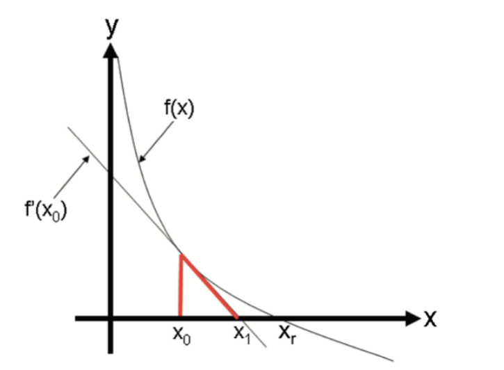
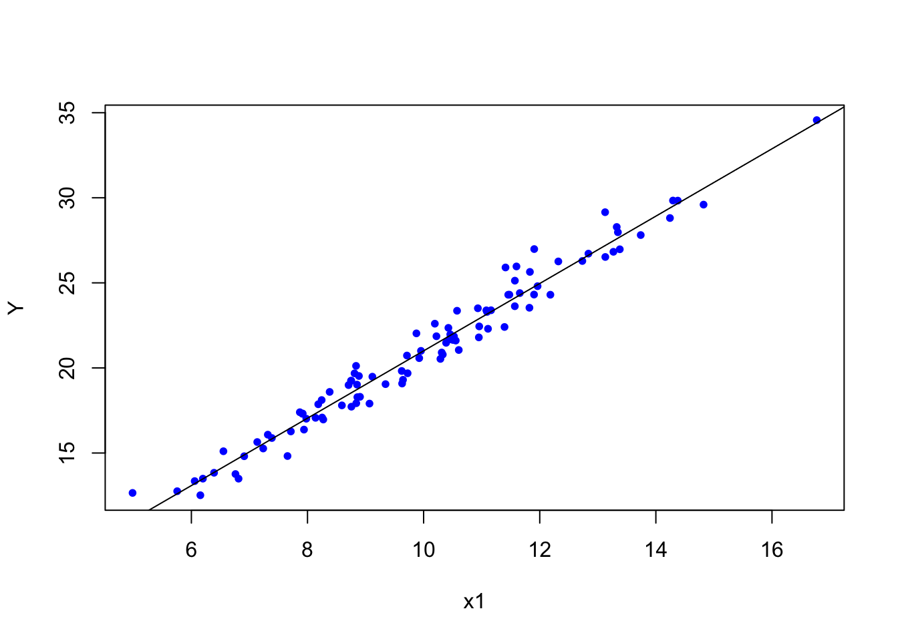

# (PART) Appendix {-}

# Algorithmic Optimization 

Here is a definition of algorithmic optimization from [Wikipedia](https://en.wikipedia.org/wiki/Mathematical_optimization#Optimization_algorithms):

>An optimization algorithm is a procedure which is executed iteratively by comparing various solutions until an optimum or a satisfactory solution is found. Optimization algorithms help us to minimize or maximize an objective function $F(x)$ with respect to the internal parameters of a model mapping a set of predictors ($X$) to target values($Y$). There are three types of optimization algorithms which are widely used; ***Zero-Order Algorithms, First-Order Optimization Algorithms, and Second-Order Optimization Algorithms***.  Zero-order (or derivative-free) algorithms use only the criterion value at some positions. ***It is popular when the gradient and Hessian information are difficult to obtain, e.g., no explicit function forms are given***.  First Order Optimization Algorithms minimize or maximize a Loss function $F(x)$ using its Gradient values with respect to the parameters.  Most widely used First order optimization algorithm is Gradient Descent. The First order derivative displays whether the function is decreasing or increasing at a particular point.
>

In this appendix, we will review some important concepts in algorithmic optimization.

## Brute-force optimization

Let's look at a simplified example about optimal retirement-plan and solve it with a zero-order algorithm.

Suppose that there are 2 groups of workers who are planning for their retirement at the age of 65.  Both consider spending 40,000 dollars each year for the rest of their lives after retirement.  On average, people in both groups expect to live 20 more years after retirement with some uncertainty.  The people in the first group (A) have the following risk profile: 85% chance to live 20 years and 15% chance to live 30 years.  The same risk profile for the people in the second group (B) is: 99% for 20 years and 1% for 30 years.  Suppose that in each group, their utility (objective) function is $U=C^{0.5}$.  

What's the maximum premium (lump-sum payment) that a person in each group would be willing to pay for a life-time annuity of 40K?  

Without a pension plan, people in each group have the following utilities:   


```r
#For people in group A
U_A = 0.85*sqrt(40000*20) + 0.15*sqrt(10*0)
U_A
```

```
## [1] 760.2631
```

```r
#For people in group B
U_B = 0.99*sqrt(40000*20) + 0.01*sqrt(10*0)
U_B
```

```
## [1] 885.4829
```
  
For example, they would not pay 200,000 dollars to cover their retirement because that would make them worse than their current situation (without a pension plan).  


```r
#For people in group A
U_A = 0.85*sqrt(40000*20 - 200000) + 0.15*sqrt(40000*10 - 200000) 
U_A
```

```
## [1] 725.4892
```

```r
#For people in group B
U_B = 0.99*sqrt(40000*20 - 200000) + 0.01*sqrt(40000*10 - 200000)
U_B
```

```
## [1] 771.3228
```
  
Hence, the payment they would be willing to make for reduction in uncertainty during their retirement should not make them worse off. Or more technically, their utility should not be lower than their current utility levels. Therefore `Pmax`, the maximum premium that a person would be willing to pay, can be found by minimizing the following **cost function** for people, for example, in Group A:  

$$
f(Pmax) = p \times \sqrt{40000 \times 20~\text{years}-Pmax}+ \\
(1-p) \times \sqrt{40000 \times 10~ \text{years}-Pmax} - p \times \sqrt{ 40000 \times 20~\text{years}} 
$$
  
Here is the iteration to solve for `Pmax` for people in Group A. We created a cost function, `costf`, that we try to minimize. Change the parameters to play with it.  The same algorithm can be used to find `Pmax` for people in Group B.  


```r
library(stats)

p <- 0.85
w1 <- 800000
w2 <- 400000

converged = F
iterations = 0
maxiter <- 600000
learnrate <- 0.5
Pmax <- 10000

while(converged == FALSE){
  costf <- p*sqrt(w1 - Pmax) + (1 - p)*sqrt(w2 - Pmax) - p*sqrt(w1)
  if(costf > 0){
    Pmax <- Pmax + learnrate
    iterations = iterations + 1
  
    if(iterations > maxiter) { 
      print("It cannot converge before finding the optimal Pmax")
      break
    }  
    converged = FALSE
  }else{
    converged = TRUE
    print(paste("Maximum Premium:",
                Pmax, "achieved with",
                iterations, "iterations"))
  }
}
```

```
## [1] "Maximum Premium: 150043 achieved with 280086 iterations"
```

```r
#let's verify it by `uniroot()` which finds the roots for f(x) = 0
costf <- function(x){
  p * sqrt(800000 - x) +
    (1-p) * sqrt(400000 - x) -
    p*sqrt(800000)
  }

paste("Unitroot for f(x) = 0 is ",
      uniroot(costf, c(10000, 200000))$root)
```

```
## [1] "Unitroot for f(x) = 0 is  150042.524874307"
```

There are better functions that we could use for this purpose, but this example works well for our experiment. 

There several of important parameters in our algorithm.  The first one is the starting `Pmax`, which can be set up manually. If the starting value is too low, iteration could not converge.  If it's too high, it can give us an error. Another issue is that our iteration does not know if the learning rate should increase or decrease when the starting value is too high or too low.  This can be done with additional lines of code, but we will not address it here.  

This situation leads us to the learning rate: the incremental change in the value of the parameter. This parameter should be conditioned on the value of cost function.  If the cost function for a given `Pmax` is negative, for example, the learning rate should be negative. Secondly, the number of maximum iterations must be set properly, otherwise the algorithm may not converge or take too long to converge.  In the next section, we will address these issues with a smarter algorithm.

There are other types of approaches. For example, the algorithm may create a grid of `Pmax` and then try all the possible values to see which one approximately makes the cost function minimum.

## Derivative-based methods
 
One of the derivative-based methods is the **Newton-Raphson** method. If we assume that the function is differentiable and has only one minimum (maximum), we can develop an optimization algorithm that looks for the point in parameter space where the derivative of the function is zero.  There are other methods, like [Fisher Scoring](https://en.wikipedia.org/wiki/Scoring_algorithm) and [Iteratively Reweighted Least Squares](https://en.wikipedia.org/wiki/Iteratively_reweighted_least_squares), that we will not see here.

First, let's see the Newton-Raphson method.  This is a well-known extension of your calculus class about derivatives in High School.  The method is very simple and used to find the roots of $f(x)=0$ by iterations.  In first-year computer science courses, this method is used to teach loop algorithms that calculate the value of, for example, $e^{0.71}$ or $\sqrt{12}$.  It is a simple iteration that converges in a few steps.

$$
x_{n+1}=x_{n}-\frac{f\left(x_{n}\right)}{f^{\prime}\left(x_{n}\right)}
$$
To understand it, let's look at the function $y=f(x)$ shown in the following graph:




It has a zero at $x=x_r$, which is not known. To find it, we start with $x_0$ as an initial estimate of $X_r$. The tangent line to the graph at the point $\left(x_0, f\left(x_0\right)\right)$ has the point $x_1$ at which the tangent crosses the $x$-axis.  The slope of this line can be defined as

$$
\frac{y-f\left(x_0\right)}{x-x_0}=f^{\prime}\left(x_0\right)
$$
Hence,

$$
y-f\left(x_0\right)=f^{\prime}\left(x_0\right)\left(x-x_0\right)
$$
At the point where the tangent line cross the $x$-axis, $y=0$ and $x=x_1$.  Hence solving the equation for $x_1$, we get

$$
x_{1}=x_{0}-\frac{f\left(x_{0}\right)}{f^{\prime}\left(x_{0}\right)}
$$
And the second approximations:

$$
x_{2}=x_{1}-\frac{f\left(x_{1}\right)}{f^{\prime}\left(x_{1}\right)}
$$
And with multiple iterations one can find the solution.  Here is the example:  


```r
newton <- function(f, x0, tol = 1e-5, n = 1000) {
  require(numDeriv) # Package for computing f'(x)
  
for (i in 1:n) {
    dx <- genD(func = f, x = x0)$D[1] # First-order derivative f'(x0)
    x1 <- x0 - (f(x0) / dx) # Calculate next value x1
    if (abs(x1 - x0) < tol) {
      res <- paste("Root approximation is ", x1, " in ", i, " iterations")
      return(res)
    }
    # If Newton-Raphson has not yet reached convergence set x1 as x0 and continue
    x0 <- x1
  }
  print('Too many iterations in method')
}

func2 <- function(x) {
  x^15 - 2
}
newton(func2, 1)
```

```
## [1] "Root approximation is  1.04729412282063  in  5  iterations"
```

```r
#Check it
paste("Calculator result: ", 2^(1/15))
```

```
## [1] "Calculator result:  1.04729412282063"
```
  
Newton's method is often used to solve two different, but related, problems:  
  
1. Finding $x$ such that $f(x)=0$ (try to solve our insurance problem with this method) 
2. Finding $x$ that $g'(x)=0$, or find $x$ that minimizes/maximizes $g(x)$. 

The relation between these two problems is obvious when we define $f(x) = g'(x)$.  Hence, for the second problem, the Newton-Raphson method becomes:    

$$
x_{n+1}=x_{n}-\frac{g^{\prime}\left(x_{n}\right)}{g^{\prime \prime}\left(x_{n}\right)}
$$
  
Connection between these two problems are defined in this [post](https://stats.stackexchange.com/questions/376191/why-is-the-second-derivative-required-for-newtons-method-for-back-propagation) [@Gulzar_2018] very nicely.  

Let’s pretend that we are interested in determining the parameters of a random variable $X \sim N(\mu, \sigma^{2})$.  Here is the log-likelihood function for $X$:  

$$
\log (\mathcal{L}(\mu, \sigma))=-\frac{n}{2} \log \left(2 \pi \sigma^{2}\right)-\frac{1}{2 \sigma^{2}} \sum_{i=1}^{n}\left(x_{i}-\mu\right)^{2}
$$
  
We have seen it in Chapter 2 before. But this time we will use `dnorm()` which calculates the pdf of a normal variable.  First let's have the data and the log-likelihood:  


```r
# Let's create a sample of normal variables
set.seed(2019)
X <- rnorm(100, 0, 1)

# And the log-likelihood of this function.
# Remember likelihood function would be prod(dnorm()) with log=F
normalLL <- function(prmt){
  sum(dnorm(X, mean = prmt[1], sd = prmt[2], log = TRUE))
}

# Let's try several parameters
normalLL(prmt = c(1,1.5))
```

```
## [1] -176.078
```

```r
normalLL(prmt = c(2,1))
```

```
## [1] -347.4119
```

```r
normalLL(prmt = c(mean(X),sd(X)))
```

```
## [1] -131.4619
```
  
As you can see, the last one is the best.  And we can verify it because we had created $X$ with 0 mean and 1 sd, approximately.  Now we will use the Newton-Raphson method to calculate those parameters that minimize the negative log-likelihood.  

First, let’s build a function that estimates the slope of the function (first-derivative) numerically at any arbitrary point in parameter space for mean and sd, separately.  Don't forget, **the log-likelihood is a function of parameters (mean and sd) not X**.  


```r
# First partial (numerical) derivative w.r.t. mean  
firstM <- function(p1, p2, change = 0.0001){      
  prmt <- c(p1, p2)
  high <- normalLL(prmt + c(change,0))
  low <- normalLL(prmt - c(change,0))
  slope <- (high-low)/(change*2)
  return(slope)
}
firstM(mean(X), sd(X))
```

```
## [1] 0
```

```r
# First partial (numerical) derivative w.r.t. sd  
firstSD <- function(p1, p2, change = 0.0001){      
  prmt <- c(p1, p2)
  high <- normalLL(prmt + c(0, change))
  low <- normalLL(prmt - c(0, change))
  slope <- (high-low)/(change*2)
  return(slope)
}

firstSD(mean(X), sd(X))
```

```
## [1] -1.104417
```

```r
#Verify them with the grad()
library(numDeriv)
f <- function(x) {
    a <- x[1]; b <- x[2]  
    sum(dnorm(X, mean = a, sd = b, log = TRUE))
    }
grad(f,c(mean(X),sd(X)))[1]
```

```
## [1] 0
```

```r
grad(f,c(mean(X),sd(X)))[2]
```

```
## [1] -1.104419
```

```r
# Or better
round(jacobian(f,c(mean(X),sd(X))), 4) #First derivatives
```

```
##      [,1]    [,2]
## [1,]    0 -1.1044
```

```r
round(hessian(f,c(mean(X),sd(X))), 4) #Second derivatives
```

```
##           [,1]     [,2]
## [1,] -121.9741    0.000
## [2,]    0.0000 -240.289
```
   
Let's try them now in the Newton-Raphson method.  

$$
x_{n+1}=x_{n}-\frac{g^{\prime}\left(x_{n}\right)}{g^{\prime \prime}\left(x_{n}\right)}
$$
  
Similar to the first one, we can also develop a function that calculates the second derivatives. However, instead of using our own functions, let's use `grad()` and `hessian()` from the `numDeriv` package. 


```r
set.seed(2019)
X <- rnorm(100, 2, 2)

NR <- function(f, x0, y0, tol = 1e-5, n = 1000) {
  for (i in 1:n) {
    dx <- grad(f,c(x0, y0))[1] # First-order derivative f'(x0)
    ddx <- hessian(f,c(x0, y0))[1,1] # Second-order derivative f''(x0)
    x1 <- x0 - (dx / ddx) # Calculate next value x1
      if (abs(x1 - x0) < tol) {
        res <- paste("The mean approximation is ", x1, " in ", i, " iterations")
        return(res)
      }
    # If Newton-Raphson has not yet reached convergence set x1 as x0 and continue
    x0 <- x1
  }
  print('Too many iterations in method')
}

func <- function(x) {
    a <- x[1]; b <- x[2]  
    sum(dnorm(X, mean = a, sd = b, log = TRUE))
    }

NR(func, -3, 1.5)
```

```
## [1] "The mean approximation is  1.85333200308383  in  2  iterations"
```

```r
#Let;s verify it
mean(X)
```

```
## [1] 1.853332
```

Finding sd is left to the practice questions.  But the way to do it should be obvious.  Use our approximation of the mean (1.853332) as a fixed parameter in the function and run the same algorithm for finding sd.  **When the power of computers and the genius of mathematics intercepts, beautiful magics happen**.  

## ML Estimation with logistic regression

The pdf of Bernoulli distribution is 

$$
P(Y=y)=p^y(1-p)^{1-y}
$$
It's likelihood

$$
\begin{aligned}
L(\boldsymbol{\beta} \mid \mathbf{y} ; \mathbf{x}) &=L\left(\beta_0, \beta_1 \mid\left(y_1, \ldots, y_n\right) ;\left(x_1, \ldots, x_n\right)\right) \\
&=\prod_{i=1}^n p_i^{y_i}\left(1-p_i\right)^{1-y_i}
\end{aligned}
$$
And log-likelihood

$$
\begin{aligned}
\ell(\boldsymbol{\beta} \mid \mathbf{y} ; \mathbf{x}) &=\log \left(\prod_{i=1}^n p_i^{y_i}\left(1-p_i\right)^{1-y_i}\right) \\
&=\sum_{i=1}^n\left( \log \left(p_i^{y_i}\right)+\log \left(1-p_i\right)^{1-y_i}\right) \\
&=\sum_{i=1}^n y_i \left(\log \left(p_i\right)+\left(1-y_i\right) \log \left(1-p_i\right)\right)
\end{aligned}
$$
where 

$$
\begin{aligned}
\operatorname{L}\left(p_i\right) &=\log \left(\frac{p_i}{1-p_i}\right) \\
&=\beta_0+\beta_1 x_1
\end{aligned}
$$

So,

$$
p_i=\frac{\exp \left(\beta_0+x_1 \beta_1\right)}{1+\exp \left(\beta_0+x_1 \beta_1\right)}
$$
First partial derivative with respect to $\beta_0$
$$
\begin{aligned}
\frac{\partial p_i}{\partial \beta_0} &=\frac{\exp \left(\beta_0+x_1 \beta_1\right)}{\left(1+\exp \left(\beta_0+x_1 \beta_1\right)\right)^2} \\
&=p_i\left(1-p_i\right)
\end{aligned}
$$
And 

$$
\begin{aligned}
\frac{\partial p_i}{\partial \beta_1} &=\frac{x_1 \exp \left(\beta_0+x_1 \beta_1\right)}{\left(1+\exp \left(\beta_0+x_1 \beta_1\right)\right)^2} \\
&=x_1 p_i\left(1-p_i\right)
\end{aligned}
$$
Newton-Raphson's equation is

$$
\boldsymbol{\beta}^{(t+1)}=\boldsymbol{\beta}^{(t)}-\left(\boldsymbol{H}^{(t)}\right)^{-1} \boldsymbol{u}^{(t)},
$$

where

$$
\boldsymbol{\beta}^{(t)}=\left[\begin{array}{c}
\beta_0^{(t)} \\
\beta_1^{(t)}
\end{array}\right]
$$

$$
\boldsymbol{u}^{(t)}=\left[\begin{array}{c}
u_0^{(t)} \\
u_1^{(t)}
\end{array}\right]=\left[\begin{array}{c}
\frac{\partial \ell\left(\beta^{(t)} \mid y ; x\right)}{\partial \beta_0} \\
\frac{\partial \ell\left(\beta^{(t)} \mid y ; x\right)}{\partial \beta_1}
\end{array}\right]=\left[\begin{array}{c}
\sum_{i=1}^n \left(y_i-p_i^{(t)}\right) \\
\sum_{i=1}^n x_i\left(y_i-p_i^{(t)}\right)
\end{array}\right]
$$
where,
  
$$
p_i^{(t)}=\frac{\exp \left(\beta_0^{(t)}+x_1 \beta_1^{(t)}\right)}{1+\exp \left(\beta_0^{(t)}+x_1 \beta_1^{(t)}\right)}
$$

$\boldsymbol{H}^{(t)}$ can be considered as Jacobian matrix of $\boldsymbol{u}(\cdot)$,

$$
\boldsymbol{H}^{(t)}=\left[\begin{array}{ll}
\frac{\partial u_0^{(t)}}{\partial \beta_0} & \frac{\partial u_0^{(t)}}{\partial \beta_1} \\
\frac{\partial u_1^{(t)}}{\partial \beta_0} & \frac{\partial u_1^{(t)}}{\partial \beta_1}
\end{array}\right]
$$
Let's simulate data and solve it the Newton-Raphson’s method described above.
  

```r
rm(list=ls())

#Simulating data
set.seed(1) 
n <- 500 
X = rnorm(n) # this is our x
z = -2 + 3 * X

#Prob. is defined by logistic function
p = 1 / (1 + exp(-z))

#Bernoulli is the special case of the binomial distribution with size = 1
y = rbinom(n, size = 1, prob = p)

#And we create our data
df <-  data.frame(y, X)
head(df)
```

```
##   y          X
## 1 0 -0.6264538
## 2 0  0.1836433
## 3 0 -0.8356286
## 4 0  1.5952808
## 5 0  0.3295078
## 6 0 -0.8204684
```
  

```r
logis <- glm(y ~ X, data = df, family = binomial)
summary(logis)
```

```
## 
## Call:
## glm(formula = y ~ X, family = binomial, data = df)
## 
## Deviance Residuals: 
##     Min       1Q   Median       3Q      Max  
## -2.3813  -0.4785  -0.2096   0.2988   2.4274  
## 
## Coefficients:
##             Estimate Std. Error z value Pr(>|z|)    
## (Intercept)  -1.8253     0.1867  -9.776   <2e-16 ***
## X             2.7809     0.2615  10.635   <2e-16 ***
## ---
## Signif. codes:  0 '***' 0.001 '**' 0.01 '*' 0.05 '.' 0.1 ' ' 1
## 
## (Dispersion parameter for binomial family taken to be 1)
## 
##     Null deviance: 605.69  on 499  degrees of freedom
## Residual deviance: 328.13  on 498  degrees of freedom
## AIC: 332.13
## 
## Number of Fisher Scoring iterations: 6
```
  

```r
library(numDeriv)

func_u <- function(b) {
  c(sum(df$y - exp(b[1] + b[2] * df$X)/ (1 + exp(b[1] + b[2] * df$X))),
    sum(df$X * (df$y - exp(b[1] + b[2] * df$X)/ (1 + exp(b[1] + b[2] * df$X)))))
}

# Starting points
delta <- matrix(1:2, nrow = 2) # starting delta container (with any number > 0) 
b <- array(c(-2,3))

while(abs(sum(delta)) > 0.0001){
  B <- b #current b 
  b <- as.matrix(b) - solve(jacobian(func_u, x = b)) %*% func_u(b) #new b 
  delta <- b - as.matrix(B)
}
b
```

```
##           [,1]
## [1,] -1.825347
## [2,]  2.780929
```
  
## Gradient Descent Algorithm

Let's start with a regression problem. The cost function in OLS is the residual sum of squares, $\mathrm{RSS}=\sum_{i=1}^n\left(\widehat{e}_i\right)^2=\sum_{i=1}^n\left(y_i-\hat{y}\right)^2=\sum_{i=1}^n\left(y_i-\left(b_1+b_2 x_i\right)\right)^2$, which is a convex function.  Our objective to find $b_1$ and $b_2$ that minimize RSS. How can we find those parameters to minimize a cost function if we don't know much about it? The trick is to start with some point and move a bit (locally) in the direction that reduces the value of the cost function.  In general, this search process for finding the minimizing point has two components: the direction and the step size. The direction tells us which direction we move next, and the step size determines how far we move in that direction. For example, the iterative search for $b_2$ of gradient descent can be described by the following recursive rule:

$$
b_2^{(k+1)}=b_2^{(k)}-lr \nabla RSS^{k}
$$
Here, $lr$ is *learning rate* and $\nabla RSS^{k}$ is the slope of RSS at step $k$.  Hence, $lr \nabla RSS^{k}$ is the total step size at step $k$.  Note that, as we move from either directions towards $b^*_2$, $\nabla RSS^{k}$ gets smaller. In fact, it becomes zero at $b^*_2$. Therefore, $\nabla RSS^{k}$ helps iterations find the proper adjustment in each step in terms of direction and magnitude. Since RSS is a convex function, it's easy to see how sign of $\nabla RSS^{k}$ will direct the arbitrary $b_2^{''}$ towards the optimal $b_2$.


Since first-order approximation at $b_2^{''}$ is good only for small $\Delta b_2$, a small $lr>0$ is needed to o make $\Delta b_2$ small in magnitude. Moreover, when a high learning rate used it leads to "overshooting" past the local minima and may result in diverging algorithm.

Below, we first use a simple linear regression function on simulated data and estimate its parameters with `lm()`.  Let's simulate a sample with our DGM.  


```r
set.seed(1001)
N <- 100
int <- rep(1, N)
x1 <- rnorm(N, mean = 10, sd = 2)
Y <- rnorm(N, 2*x1 + int, 1)
model <- lm(Y ~ x1)
b <- coef(model)
b
```

```
## (Intercept)          x1 
##    1.209597    1.979643
```

```r
plot(x1, Y, col = "blue", pch = 20)
abline(b)
```



The cost function that we want to minimize is

$$
y_i = 1 + 2x_i + \epsilon_i \\
RSS = \sum{\epsilon_i^2}=\sum{(y_i-1-2x_i)^2}
$$
And, its plot for a range of coefficients is already shown earlier.  


### One-variable
Below, we create a function, `grdescent`, to show how sensitive gradient descent algorithms would be to different calibrations:


```r
grdescent <- function(x, y, lr, maxiter) {
  #starting points
  set.seed(234)
  b <- runif(1, 0, 1)
  c <- runif(1, 0, 1)
  n <- length(x)
  
  #function
  yhat <- c + b * x
  
  #gradient
  MSE <- sum((y - yhat) ^ 2) / n
  converged = F
  iterations = 0
  
  #while loop
  while (converged == F) {
    b_new <- b - ((lr * (1 / n)) * (sum((y - yhat) * x * (-1))))
    c_new <- c - ((lr * (1 / n)) * (sum(y - yhat) * (-1)))
    b <- b_new
    c <- c_new
    yhat <- b * x + c
    
    MSE_new <- sum((y - yhat) ^ 2) / n
    MSE <- c(MSE, MSE_new)
    d = tail(abs(diff(MSE)), 1)
    
    if (round(d, 12) == 0) {
      converged = T
      return(paste("Iterations: ",
                   iterations, "Intercept: ",
                   c, "Slope: ", b))
    }
    iterations = iterations + 1
    if (iterations > maxiter) {
      converged = T
      return(paste("Max. iter. reached, ", "Intercept:",
                   c, "Slope:", b))
    }
  }
}
```

Note that the key part in this algorithm is `b_new <- b + (learnrate * (1 / n)) * sum((y - yhat) * x*(-1)`.
The first $b$ that is picked randomly by  `b <- runif(1, 0, 1)` is adjusted by `learnrate * (1 / n) * (sum((y - yhat) * -x))`.  

Note that `sum((y - yhat) * x)` is the first order condition of the cost function (MSE - Residual Sum of Squares) for the slope coefficient. The cost function is a convex function where the minimum can be achieved by the optimal $b$.  It is a linear Taylor approximation of MSE at $b$ that provides the **steepest** descent, that is just a simple adjustment for identifying the direction of the adjustment of $b$ until the minimum MSE is reached.  

Now we will see if this function will give us the same intercept and slope coefficients already calculated with `lm()` above.


```r
grdescent(x1, Y, 0.01, 100000) 
```

```
## [1] "Iterations:  16389 Intercept:  1.20949479145584 Slope:  1.97965284405985"
```

This is good.  But, if start a very low number with a small learning rate, then we need more iteration


```r
grdescent(x1, Y, 0.005, 1000000)
```

```
## [1] "Iterations:  31363 Intercept:  1.20945256472045 Slope:  1.97965686098386"
```

Yes, the main question is how do we find out what the learning rate should be?  A general suggestion is to keep it small and tune it within the training process. Obviously, we can have an adaptive learning rate that changes at each iteration depending on the change in the MSE.  If the change is positive, for example, the learning rate can be reduced to keep the descent.  

### Adjustable `lr` and SGD

An adjustable learning rate has several advantages over a fixed learning rate in gradient-based optimization algorithms like stochastic gradient descent:
  
- Faster convergence: An adjustable learning rate can help the algorithm converge faster by starting with a larger learning rate, allowing the model to make bigger steps in the initial phase. This can help escape local minima or saddle points more quickly and reach the vicinity of the global minimum. 
- Improved precision: As the learning rate decreases over time, the algorithm takes smaller steps, allowing for more precise updates to the model parameters. This can help the model fine-tune its parameters and potentially achieve a lower loss value compared to a fixed learning rate. 
- Prevent oscillations: A fixed learning rate might cause oscillations around the optimal solution, whereas an adjustable learning rate can help dampen these oscillations by gradually reducing the step size. This can result in a more stable convergence. 
- Adaptive to problem complexity: Some optimization problems might require different learning rates for different stages of the optimization process. An adjustable learning rate can adapt to the problem's complexity, allowing the model to learn at a more suitable pace for each stage. 
- Robustness: An adjustable learning rate can make the optimization algorithm more robust to the choice of the initial learning rate. Even if the initial learning rate is not perfect, the algorithm can adapt over time and still reach a reasonable solution.  

Although an adjustable learning rate can lead to faster convergence, improved precision, and better overall performance in gradient-based optimization algorithms, it also introduces additional hyperparameters (e.g., decay rate, annealing schedule) that need to be tuned for optimal performance.

Below, we made some changes to earlier gradient descent to make it stochastic with an adaptive learning rate.  In this modified code, we have implemented the following changes:

- Shuffled the data points using the `sample()` function. 
- Iterated over the data points in mini-batches of size 1 (`batch_size = 1`). This makes it **stochastic gradient descent**. 
- Re-calculated the gradients and updated the weights for each mini-batch.

This should give us a simple stochastic gradient descent implementation for our linear regression problem.  To implement an adjustable learning rate, we can use a learning rate scheduler or a learning rate annealing method. The following example shows how to use a simple exponential learning rate annealing method, which will decrease the learning rate over time:
  

```r
# Set the seed
set.seed(1001)

# Generate data
N <- 100
int <- rep(1, N)
x1 <- rnorm(N, mean = 10, sd = 2)
Y <- rnorm(N, 2*x1 + int, 1)
model <- lm(Y ~ x1)
b <- coef(model)
b
```

```
## (Intercept)          x1 
##    1.209597    1.979643
```

```r
# Starting points
set.seed(234)
b <- runif(1, 0, 1)
c <- runif(1, 0, 1)
n <- length(x1)

# Parameters
initial_learning_rate <- 0.01
decay_rate <- 0.99999
batch_size <- 1
max_iterations <- 300000
tolerance <- 1e-12

# Function
yhat <- c + b * x1

# Gradient
MSE <- sum((Y - yhat) ^ 2) / n
converged = F
iterations = 0
num_batches <- ceiling(n / batch_size)

# While loop
while (converged == F) {
  # Shuffle data points
  indices <- sample(n, n)
  
  for (i in seq(1, n, by = batch_size)) {
    idx <- indices[i:min(i + batch_size - 1, n)]
    x_batch <- x1[idx]
    y_batch <- Y[idx]
    
    yhat_batch <- c + b * x_batch
    
    learning_rate <- initial_learning_rate * decay_rate^iterations
    
    b_new <- b - learning_rate * ((1 / length(idx)) * 
                                    sum((y_batch - yhat_batch) *
                                          x_batch * (-1)))
    c_new <- c - learning_rate * ((1 / length(idx)) *
                                    sum(y_batch - yhat_batch) * (-1))
    
    b <- b_new
    c <- c_new
  }
  
  yhat <- b * x1 + c
  MSE_new <- sum((Y - yhat) ^ 2) / n
  d = abs(MSE_new - tail(MSE, 1))
  
  if (d < tolerance) converged = T
  MSE <- c(MSE, MSE_new)
  
  iterations = iterations + 1
  if (iterations > max_iterations) converged = T
}

c(iterations, c, b)
```

```
## [1] 3.000010e+05 1.205426e+00 1.966007e+00
```
  
Stochastic Gradient Descent (SGD) tends to be faster than plain Gradient Descent (GD) when working with large datasets. The main reason for this is that SGD updates the model parameters more frequently, using only a random subset of data points (or even a single data point) in each update, while GD uses the entire dataset for each update.

The main advantage of using SGD over plain GD is related to the convergence speed and the ability to escape local minima.  In SGD, the model parameters are updated after each mini-batch (in this case, a single data point), whereas in GD, the updates happen after going through the entire dataset. As a result, SGD can converge faster than GD because it performs more frequent updates, which can be especially beneficial when working with large datasets.

Moreover, SGD introduces randomness in the optimization process due to the random sampling of data points. This stochastic nature can help the algorithm to escape local minima and find a better (global) minimum. In the case of plain GD, the algorithm always follows the true gradient, which can cause it to get stuck in sharp, non-optimal minima.

However, there are some trade-offs when using SGD. The updates in SGD can be noisy because they are based on a random subset of data points, which can lead to fluctuations in the learning process. This can make the algorithm's convergence path look less smooth than in the case of plain GD.  Further, SGD often requires more careful tuning of hyperparameters, such as the learning rate and batch size. In some cases, a learning rate schedule (decreasing the learning rate over time) can be used to improve convergence.

In summary, while SGD can offer faster convergence and better ability to escape local minima, it comes with the trade-off of noisier updates and may require more careful hyperparameter tuning.  When working with large datasets, we can also consider using mini-batch gradient descent, which is a compromise between GD and SGD. Mini-batch gradient descent uses a small batch of data points to compute the gradient, rather than the entire dataset (GD) or a single data point (SGD). This can offer a good balance between computational efficiency and convergence properties.

In the SGD code above, the decay rate is a hyperparameter that controls the rate at which the learning rate decreases over time in an adjustable learning rate schedule. Choosing an appropriate decay rate depends on the specific problem, the model, and the optimization algorithm being used. In practice, the decay rate is often chosen empirically through experimentation or by using techniques such as cross-validation or grid search.

Here are some guidelines to help us choose an appropriate decay rate:
  
- A common starting point for the decay rate is 0.99, as it provides a relatively slow decay of the learning rate. However, this value might not be optimal for all problems, so you should treat it as a starting point and experiment with different values to see what works best for your specific problem. 
- If the optimization problem is complex or has a highly non-convex loss surface, you might want to choose a smaller decay rate (e.g., 0.9 or 0.95) to allow for a faster reduction in the learning rate. This can help the model escape local minima or saddle points more quickly. On the other hand, if the problem is relatively simple, you might want to choose a larger decay rate (e.g., 0.995 or 0.999) to keep the learning rate higher for a longer period. 
- Since there is no one-size-fits-all answer for the decay rate, it is essential to experiment with different values and observe how they affect the optimization process. You can use techniques such as cross-validation or grid search to systematically explore different decay rate values and choose the one that yields the best performance. 
- It can be helpful to monitor the learning rate during training to ensure that it is decaying at an appropriate pace. If the learning rate is decreasing too quickly, it might result in slow convergence or getting stuck in local minima. If the learning rate is decreasing too slowly, it might cause oscillations around the optimal solution and prevent the model from converging.  

Learning rate scheduler is a more general concept than the specific exponential decay method we demonstrated here. A learning rate scheduler is a technique used to adjust the learning rate during the training process according to a pre-defined schedule or rule. The exponential decay method is just one example of a learning rate scheduler.

There are various learning rate scheduler strategies:
  
- Exponential decay: The learning rate is multiplied by a fixed decay rate at each iteration or epoch, as demonstrated in the previous example. 
- Step decay: The learning rate is reduced by a fixed factor at specific intervals, such as every N epochs. For example, the learning rate could be reduced by a factor of 0.5 every 10 epochs. 
- Time-based decay: The learning rate is reduced according to a function of the elapsed training time or the number of iterations. For example, the learning rate could be reduced by a factor proportional to the inverse of the square root of the number of iterations. 
- Cosine annealing: The learning rate is reduced following a cosine function, which allows for periodic "restarts" of the learning rate, helping the optimization process escape local minima or saddle points. 
- Cyclic learning rates: The learning rate is varied cyclically within a predefined range, allowing the model to explore different areas of the loss surface more effectively. 
- Adaptive learning rates: These learning rate schedulers adjust the learning rate based on the progress of the optimization process, such as the improvement in the loss function or the validation accuracy. Some well-known adaptive learning rate methods include AdaGrad, RMSprop, and Adam. 

The choice of the learning rate scheduler depends on the specific problem, the model, and the optimization algorithm being used. It's essential to experiment with different learning rate schedulers and monitor the training progress to find the best strategy for a particular problem.

### Multivariable

We will expand the gradient descent algorithms with an multivariable example using matrix algebra.  First, the data and model simulation:


```r
set.seed(1001)
N <- 100
int <- rep(1, N)
x1 <- rnorm(N, mean = 10, sd = 2)
x2 <- rnorm(N, mean = 5, sd = 1)
x3 <- rbinom(N, 1, 0.5)
x4 <- rbinom(N, 1, 0.5)
x5 <- rbinom(N, 1, 0.5)
x6 <- rnorm(N, 1, 0.25)
x7 <- rnorm(N, 1, 0.2)
x2x3 <- x2*x3
x4x5 <- x4*x5
x4x6 <- x5*x6
x3x7 <- x3*x7

Y <- rnorm(N, 2*x1 + -0.5*x2 - 1.75*x2x3 + 2*x4x5 - 3*x4x6 + 1.2*x3x7 + int, 1)
X <- cbind(int, x1, x2, x2x3, x4x5, x4x6, x3x7)
```

We can solve it with linear algebra manually:  


```r
betaOLS <- solve(t(X)%*%X)%*%t(X)%*%Y
print(betaOLS)
```

```
##            [,1]
## int   0.4953323
## x1    1.9559022
## x2   -0.3511182
## x2x3 -1.9112623
## x4x5  1.7424723
## x4x6 -2.8323934
## x3x7  2.1015442
```
  
We can also solve it with `lm()`  


```r
model1.lm <- lm(Y ~ X -1)
summary(model1.lm)
```

```
## 
## Call:
## lm(formula = Y ~ X - 1)
## 
## Residuals:
##      Min       1Q   Median       3Q      Max 
## -2.84941 -0.45289 -0.09686  0.57679  2.07154 
## 
## Coefficients:
##       Estimate Std. Error t value Pr(>|t|)    
## Xint   0.49533    0.75410   0.657  0.51290    
## Xx1    1.95590    0.03868  50.571  < 2e-16 ***
## Xx2   -0.35112    0.12600  -2.787  0.00645 ** 
## Xx2x3 -1.91126    0.13358 -14.308  < 2e-16 ***
## Xx4x5  1.74247    0.24396   7.143 2.01e-10 ***
## Xx4x6 -2.83239    0.18831 -15.041  < 2e-16 ***
## Xx3x7  2.10154    0.64210   3.273  0.00149 ** 
## ---
## Signif. codes:  0 '***' 0.001 '**' 0.01 '*' 0.05 '.' 0.1 ' ' 1
## 
## Residual standard error: 0.8448 on 93 degrees of freedom
## Multiple R-squared:  0.9972,	Adjusted R-squared:  0.997 
## F-statistic:  4677 on 7 and 93 DF,  p-value: < 2.2e-16
```
  
Now the function for gradient descent:  


```r
grdescentM <- function(x, y, lr, maxiter) {
  set.seed(123)
  b <- runif(ncol(x), 0, 1)
  yhat <- x%*%b
  e <- y - yhat
  RSS <- t(e)%*%e
  converged = F
  iterations = 0
  n <- length(y)
  
  while(converged == F) {
    b_new <- b - (lr*(1/n))*t(x)%*%(x%*%b - y)
    b <- b_new
    yhat <- x%*%b
    e <- y - yhat
    
    RSS_new <- t(e)%*%e
    RSS <- c(RSS, RSS_new)
    d = tail(abs(diff(RSS)), 1)
    
    if (round(d, 12) == 0) {
      converged = T
      return(b)
    }
    iterations = iterations + 1
    if(iterations > maxiter) { 
      converged = T
      return(b)
   }
  }
}
```


```r
grdescentM(X, Y, 0.01, 100000) 
```

```
##            [,1]
## int   0.4953843
## x1    1.9559009
## x2   -0.3511257
## x2x3 -1.9112548
## x4x5  1.7424746
## x4x6 -2.8323944
## x3x7  2.1015069
```
  
## Optimization with R

A good summary of tools for optimization in R given in this guide: [Optimization and Mathematical Programming](https://cran.r-project.org/web/views/Optimization.html). There are many optimization methods, each of which would only be appropriate for specific cases.  In choosing a numerical optimization method, we need to consider following points:  

1. We need to know if it is a constrained or unconstrained problem.  For example, the MLE method is an unconstrained problem. Most regularization problems, like Lasso or Ridge, are constraint optimization problems.   
2. Do we know how the objective function is shaped a priori?  MLE and OLS methods have well-known objective functions (Residual Sum of Squares and Log-Likelihood).  Maximization and minimization problems can be used in both cases by flipping the sign of the objective function.  
3. Multivariate optimization problems are much harder than single-variable optimization problems.  There is, however, a large set of available optimization methods for multivariate problems.  
4. In multivariate cases, the critical point is whether the objective function has available gradients.  If only the objective function is available without gradient or Hessian, the Nelder-Mead algorithm is the most common method for numerical optimization.  If gradients are available, the best and most used method is the gradient descent algorithm.  We have seen its application for OLS.  This method can be applied to MLE as well. It is also called a Steepest Descent Algorithm.  In general, the gradient descent method has three types: Batch Gradient Descent, Stochastic Gradient Descent, and Mini-Batch Gradient Descent.    
5. If the gradient and Hessian are available, we can also use the Newton-Raphson Method. This is only possible if the dataset is not high-dimensional, as calculating the Hessian would otherwise be very expensive.  
6. Usually the Nelder-Mead method is slower than the Gradient Descent method. `Optim()` uses the Nelder-Mead method, but the optimization method can be chosen in its arguments.  

More details can be found in this educational [slides](http://bigdatasummerinst.sph.umich.edu/wiki/images/a/ad/Bdsi_optimization_2019.pdf).  The most detailed and advance source is [Numerical Recipes](https://en.wikipedia.org/wiki/Numerical_Recipes), which uses `C++` and `R`. 

