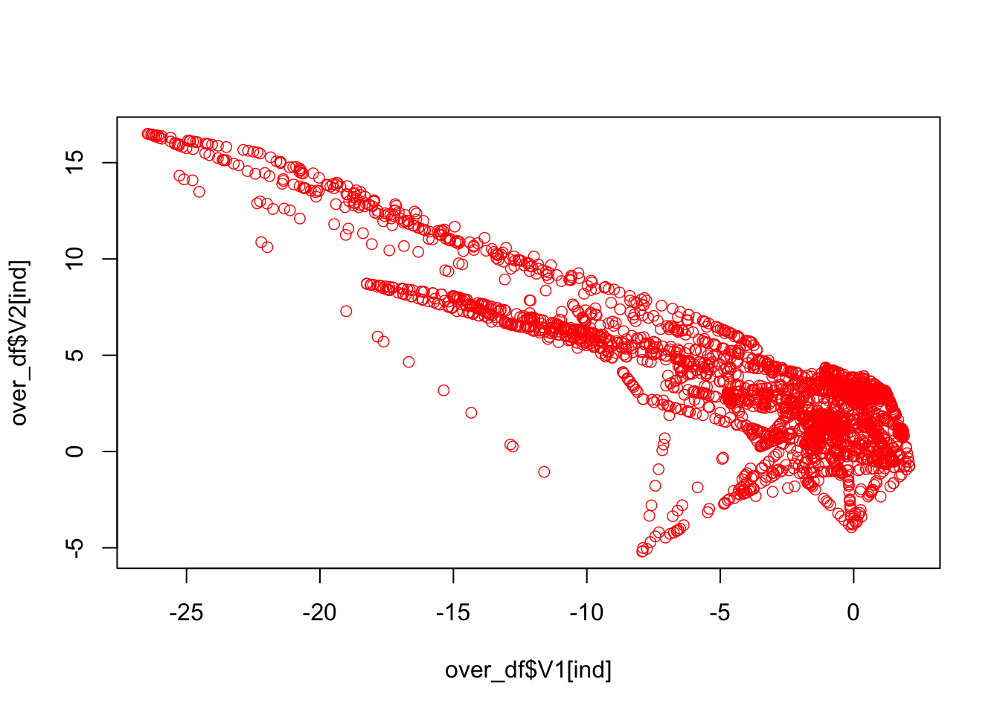
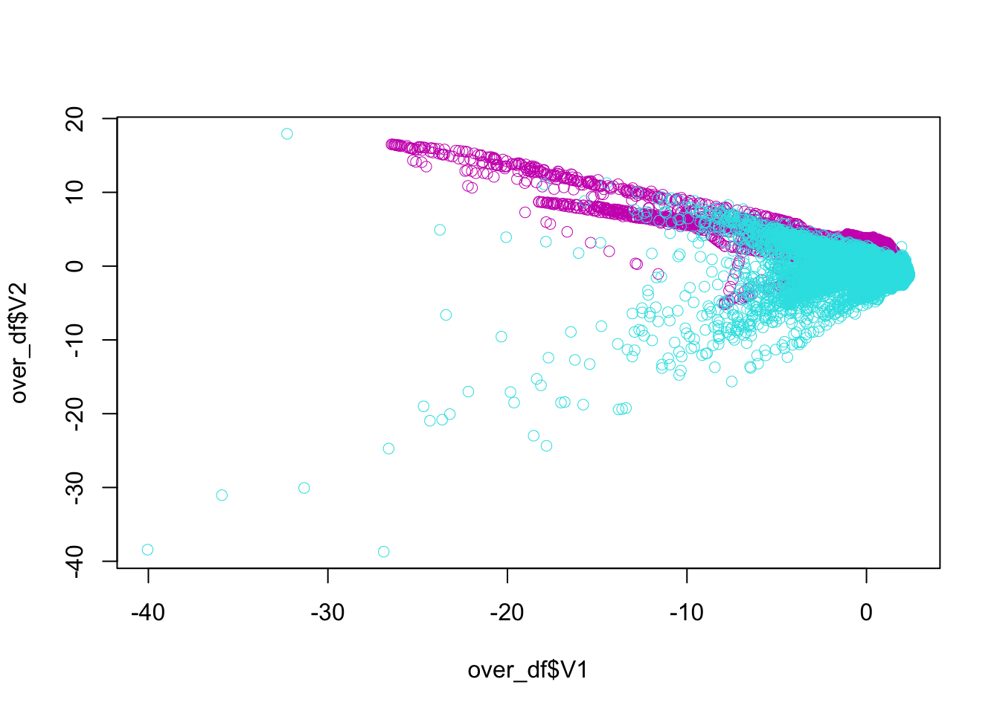

# Imbalanced Data

Classification with imbalanced data is characterized by the uneven proportion of cases that are available for each class, and causes problems in many learning algorithms.  An imbalance in the data is usually considered an issue when the distribution of classes is skewed more than 60-40% ratio.

There are two simple methods to overcome imbalance data in classification problems: oversampling and undersampling, both of which are used to adjust the class distribution in a data set. While oversampling simply randomly replicates the minority class, undersampling randomly selects a subset of majority class and reduces the overall sample size.  Thus, it can discard useful data.  

There are also more complex oversampling techniques, including the creation of artificial data points. The most common technique is known as `SMOTE`, Synthetic Minority Oversampling Technique [Chawla et al.](https://jair.org/index.php/jair/article/view/10302) [-@Chawla_2002. This method generates synthetic data based on the feature space similarities between existing minority instances. In order to create a synthetic instance, it finds the k-nearest neighbors of each minority instance, randomly selects one of them, and then calculate linear interpolations to produce a new minority instance in the neighborhood.  

The other methods is the adaptive synthetic sampling approach (`ADASYN`), which builds on the methodology of `SMOTE`, by shifting the importance of the classification boundary to those minority classes.  

In this chapter we will see some examples using only `SMOTE`.  

## `SMOTE`

We will use [Credit Card Fraud Detection dataset](https://www.kaggle.com/mlg-ulb/creditcardfraud) on Kaggle.  The dataset has about 300K anonymized credit card transfers labeled as fraudulent or genuine.  The features are numerical and anonymized (`V1`, `V2`, ... , `V28`).  They are the principal components obtained with principal component analysis (PCA). The only features which have not been transformed with PCA are `Time` and `Amount`. Feature `Time` contains the seconds elapsed between each transaction and the first transaction in the dataset. The feature `Amount` is the transaction Amount and `Class` is the response variable and it takes value 1 in case of fraud and 0 otherwise.

The prediction problem is to label transactions as fraud or not.  We will use only a subset of data with roughly 10K observations, representing transactions. 


```r
library(tidyverse)
library(ROCR)
library(smotefamily)
library(randomForest)

head(creditcard10)
```

```
## # A tibble: 6 × 31
##     Time     V1     V2     V3       V4      V5     V6     V7      V8      V9
##    <dbl>  <dbl>  <dbl>  <dbl>    <dbl>   <dbl>  <dbl>  <dbl>   <dbl>   <dbl>
## 1  77319 -0.278  0.924  1.40   0.833    0.0318 -0.619  0.592  0.0361 -0.751 
## 2 130219  0.916 -2.70  -3.26  -0.00660 -0.504  -1.14   1.26  -0.609  -1.18  
## 3  42328 -2.25  -1.03   0.937  0.198    1.01   -2.00  -0.754  0.691  -0.423 
## 4  51453 -0.386  0.766  0.850  0.195    0.850   0.188  0.702  0.0700  0.0516
## 5  48711 -1.04   0.240  1.53  -0.0509   1.80    0.650  0.556  0.172  -0.288 
## 6 125697  1.52  -1.92  -2.33  -0.586   -0.468  -0.837  0.387 -0.440  -0.456 
## # … with 21 more variables: V10 <dbl>, V11 <dbl>, V12 <dbl>, V13 <dbl>,
## #   V14 <dbl>, V15 <dbl>, V16 <dbl>, V17 <dbl>, V18 <dbl>, V19 <dbl>,
## #   V20 <dbl>, V21 <dbl>, V22 <dbl>, V23 <dbl>, V24 <dbl>, V25 <dbl>,
## #   V26 <dbl>, V27 <dbl>, V28 <dbl>, Amount <dbl>, Class <dbl>
```

```r
table(creditcard10$Class)
```

```
## 
##     0     1 
## 28427    53
```

```r
prop.table(table(creditcard10$Class))
```

```
## 
##           0           1 
## 0.998139045 0.001860955
```

The class balance is way off! The split is approximately 99.83% to 0.017%.


```r
df <- creditcard10
plot(df$V1, df$V2, col = (df$Class+1) + 4, lwd = 0.5)
```


```r
ind <- which(df$Class == 1, arr.ind = TRUE)

plot(df$V1[ind], df$V2[ind], col = "red", lwd = 0.7)
```


The idea behind SMOTE is very simple: take a red point (fraud) say Jason, find the k nearest neighbors to Jason by using all features. Then we randomly pick one observation among these, let's say, 5 neighbors.  Suppose that person is Mervin.  Now, also suppose that we have only two features: `V1` and `V2`   

Observations    V1      V2
--------------  ------  ------
Jason           -12.5   -5.0
Mervin          -10.5   -2.5
  
Then the new synthetic point will be created by $V1 = -12.5 + r(-10.5-(-12.5)) = -12.5 +r2.0$ and $V2 = -5 + r(-2.5-(-5)) = -5 +r2.5$, where $r$ is a random number between 0 and 1.  If it's 0.7, for example, the new synthetic observation will be added to data:
  
Observations    V1      V2
--------------  ------  ------
Jason           -12.5   -5.0
Mervin          -10.5   -2.5
Synthetic       -11.1   -3.25

This is one synthetic observation created form a real observation, Tim.  We can repeat it 10, 20 times and create many synthetic observations from Tim.  And then we can repeat it for each real cases of fraud. 


```r
library(smotefamily)
df$Class <- as.factor(df$Class)

outc <- SMOTE(X = df[, -31], target = df$Class, K = 4, dup_size = 10)

over_df = outc$data
table(over_df$class)
```

```
## 
##     0     1 
## 28427   583
```

```r
prop.table(table(over_df$class))
```

```
## 
##          0          1 
## 0.97990348 0.02009652
```

Or, with higher `K` and `dup_size`:  


```r
library(smotefamily)
df$Class <- as.factor(df$Class)

outc <- SMOTE(X = df[, -31], target = df$Class, K = 4, dup_size = 50)

over_df = outc$data
table(over_df$class)
```

```
## 
##     0     1 
## 28427  2703
```

```r
prop.table(table(over_df$class))
```

```
## 
##          0          1 
## 0.91317058 0.08682942
```

And, here is the new plot with expanded "fraud" cases:


```r
ind <- which(over_df$class == 1, arr.ind = TRUE)
plot(over_df$V1[ind], over_df$V2[ind], col = "red", lwd = 0.7)
```


  
All together:
  

```r
plot(over_df$V1, over_df$V2, col = (as.numeric(over_df$class)+1) + 4, lwd = 0.5)
```


  
## Fraud detection

Here is what we will do with the fraud data in the following script: 
  
- Apply `SMOTE` on training set to balance the class distribution
- Train a Random Forest model on re-balanced training set
- Test performance on (original) test set

In addition, we will compare with and without balancing.


```r
library(ROCR)
library(smotefamily)
library(randomForest)

rm(list = ls())
load("creditcard10.RData")
df$Class <- as.factor(df$Class)

AUCb <- c()
AUCimb <- c()
n = 10 # Could be 50, since the data is large for RF
B = 100

for (i in 1:n) {
  set.seed(i)
  ind <- sample(nrow(df), nrow(df), replace = TRUE)
  ind <- unique(ind) # Otherwise it oversamples 0's
  train <- df[ind, ]
  test <- df[-ind, ]

  # Balancing
  outdf <- SMOTE(X = train[, -31], target = train$Class, K = 10, dup_size = 50)
  trainn <- outdf$data
  trainn$class <- as.factor(trainn$class) #SMOTE makes factor to "chr"!
  colnames(trainn)[31] <- "Class" #SMOTE made it lower case!

  modelb <- randomForest(Class~., ntree = B, data = trainn)
  phatb <- predict(modelb, test, type = "prob")

  # Without Balancing
  modelimb <- randomForest(Class~., ntree = B, data = train)
  phatimb <- predict(modelimb, test, type = "prob")

  #AUCb
  pred_rocr1 <- prediction(phatb[,2], test$Class)
  auc_ROCR1 <- performance(pred_rocr1, measure = "auc")
  AUCb[i] <- auc_ROCR1@y.values[[1]]

  #AUCimb
  pred_rocr1 <- prediction(phatimb[,2], test$Class)
  auc_ROCR1 <- performance(pred_rocr1, measure = "auc")
  AUCimb[i] <- auc_ROCR1@y.values[[1]]
}

model <- c("Balanced", "Imbalanced")
AUCs <- c(mean(AUCb), mean(AUCimb))
sd <- c(sqrt(var(AUCb)), sqrt(var(AUCimb)))
data.frame(model, AUCs, sd)
```

```
##        model      AUCs         sd
## 1   Balanced 0.9682024 0.02968400
## 2 Imbalanced 0.9340113 0.03698929
```


Our results show improved AUC results and lower sd for our model built on the balanced data. 
