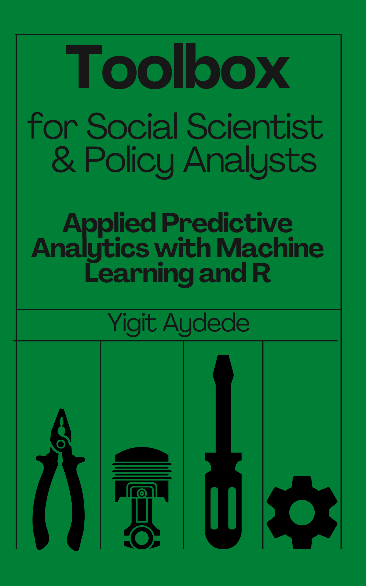

--- 
title: "Toolbox for Social Scientists and Policy Analysts"
subtitle: "Applied Predictive Analytics with Machine Learning and R"
titlerunning: "Toolbox"
author: "[Yigit Aydede](https://yaydede.github.io/)"
date: "This version: `r Sys.Date()`"
site: bookdown::bookdown_site
output: 
  bookdown::gitbook
documentclass: book
bibliography: [book.bib, packages.bib]
biblio-style: apalike
nocite: '@*'
description: ""
link-citations: yes
github-repo: yaydede/ToolShed_draft
url: 'https\://yaydede.github.io/toolbox/'
cover-image: "png/cover2.png"
urlcolor: cyan
---

# Preface {.unnumbered}

In today's world, our lives are constantly influenced by predictions we make on a daily basis. Our desire to improve these predictions and learn from our mistakes drives us forward. We, as humans, are self-learning entities with limited processing capacity. This raises the question: can we create self-learning algorithms for high-capacity machines that can make predictions more efficiently and accurately on our behalf? The answer is a resounding yes! With the help of well-developed statistical models, effective algorithms, and powerful computers, we can achieve this goal.

This book delves into the first component, statistical models, without excessive abstraction. It doesn't cover every aspect of programming, but provides sufficient coding skills for you to build predictive algorithms using R. Additionally, we discuss the "machines" that can help facilitate better efficiency.
  
{width=400px height=550px}
  
According to Leo Breiman [@Breiman_TC], [Statistical Modeling: The Two Cultures](https://projecteuclid.org/download/pdf_1/euclid.ss/1009213726), there are two goals in analyzing the data:

> **Prediction**: To be able to predict what the responses are going to be to future input variables; **Information**: To extract some information about how nature is associating the response variables to the input variables.

And there are two approaches towards those goals:

**The Data Modeling Culture** : One assumes that the data are generated by a given stochastic data model (econometrics) ...\
**Algorithmic Modeling Culture**: One uses algorithmic models and treats the data mechanism as unknown (machine learning) ...

And he describes the current state:

> ...With the insistence on data models, multivariate analysis tools in statistics are frozen at discriminant analysis and logistic regression in classification and multiple linear regression in regression. Nobody really believes that multivariate data is multivariate normal, but that data model occupies a large number of pages in every graduate text book on multivariate statistical analysis...

Broadly speaking, many social scientists tend to view statistical analysis through the lens of causal inference. Their education typically focuses on inferential statistics, which encompasses regression-based parametric methods using software packages with graphical interfaces, such as EViews, Stata, SPSS, and SAS. As the interest in wide-ranging and inclusive "data analytics" courses has surged in the last decade, departments within Economics, Finance, and Business disciplines are exploring data analytics courses that align more closely with their conventional curricula.  The significance of this integration lies in two main aspects: first, in conventional curricula, "predictive" and nonparametric methods often take a backseat. Although "forecasting" courses exist, they primarily concentrate on standard parametric time-series methodologies like ARIMA/GARCH. Second, the traditional interface-based statistical packages are no longer adequate for handling unconventional nonparametric approaches. Consequently, students across Business schools are increasingly demanding proficiency in programming languages such as R and Python.

It's understandable that machine learning is gaining attention, as it's a relatively new concept for many fields. Not only is the idea itself novel, but the terminology associated with it, such as hyperparameters, classification, features, variance-bias trade-off, and tuning, is quite distinct. Additionally, the approach taken in traditional quantitative courses differs significantly. In these courses, the emphasis on prediction accuracy as a primary goal in data analytics is often met with skepticism; for instance, even if ice-cream sales predict the crime rates very well, many policy analysts would consider such a result to be of little practical value.

To bridge the gap between inferential statistics and machine learning, this book presents a distinctive structure that deviates from conventional machine learning texts.  First, it is not all about Machine Learning written mostly for practitioners.  It is designed to ease the transition from the parametric world of inferential statistics to predictive models by introducing nonparametric methods, which have been underutilized in inferential statistics but serve as a crucial link between data modeling and algorithmic modeling cultures.  Even at the PhD level, we rarely teach nonparametric methods as those methods have been less applied in inferential statistics.  Nonparametric econometrics, however, makes the link between these two cultures as machine learning is an extension of nonparametric econometrics. The book's organization allows for a gradual introduction to nonparametric applications, such as kNN in Chapter 8, and subsequently covers more advanced topics like Support Vector Machines and Neural Networks.

The book emphasizes practical applications using "toy data" to ensure its relevance across various fields with similar curricula. Supplementary materials providing field-specific data and applications will also be made available, eliminating the need for separate texts catering to each discipline. The first supplementary online book, featuring real economic and financial data, will be released shortly.

In addition to well-known predictive algorithms, the book explores five new sections: Penalized Regressions, Time-Series Applications, Dimension Reduction Methods, and Graphical Network Analysis. These sections delve into techniques and concepts prevalent in social sciences and business. Furthermore, the appendices provide valuable information on Algorithmic Optimization and classification with imbalanced data.  

It is my hope that this book will serve as a good starting point for incorporating predictive analytics into the curricula of social science and business fields, while continuously evolving to keep pace with the rapidly changing landscape of data-driven research. In this spirit, the book will always remain a humble "draft" that can be adapted and improved over time.
  
## Who {.unnumbered}

```{r, echo=FALSE, out.width = "60px"}

```
  
This book is designed for *motivated* students and researchers with a background in inferential statistics using parametric models. It is applied in nature, skipping many theoretical proofs and justifications in favor of practical application. No prior experience with R is assumed, but some familiarity with coding is helpful.

## Acknowledgements {.unnumbered}

This book was made possible by Mutlu Yuksel, Mehmet Caner, Juri Marcucci, Atul Dar and, Andrea Guisto. This work is greatly inspired by following books and people:

1.  [Introduction to Statistical Learning](http://faculty.marshall.usc.edu/gareth-james/ISL/) by Gareth James, Daniela Witten, Trevor Hastie and Robert Tibshirani.
2.  [Introduction to Data Science](https://rafalab.github.io/dsbook/) by Rafael A. Irizarry.\
3.  [Applied Statistics with R](https://daviddalpiaz.github.io/appliedstats/) by David Dalpiaz
4.  [R for Statistical Learning](https://daviddalpiaz.github.io/r4sl/) by David Dalpiaz

I've also greatly benefited from my participation in the Summer School of [SiDe](https://www.side-iea.it/events/summer-schools) in 2019 on *Machine Learning Algorithms for Econometricians* by [Arthur Carpentier](https://freakonometrics.github.io) and [Emmanuel Flachaire](https://www.amse-aixmarseille.fr/fr/membres/flachaire) and in 2017 on *High-Dimensional Econometrics* by [Anders Bredahl Kock](https://sites.google.com/site/andersbkock/) and [Mehmet Caner](https://poole.ncsu.edu/people/mehmet-caner/).  I never stop  learning from these people.

I also thank my research assistant Kyle Morton. Without him, this book wouldn't be possible.

Finally, my wife and my son, Isik and Ege, you are always my compass finding my purpose ... 

## License {.unnumbered}

.](png/cc.png)

```{r include=FALSE}
# automatically create a bib database for R packages
knitr::write_bib(c(
  .packages(), 'bookdown', 'knitr', 'rmarkdown', 'randomForest', 'ROCR', 'lubridate', 'foreign', 'ggplot2', 'broom', 'faux', 'tidyverse', 'eulerr', 'AER','corrplot', 'fueleconomy', 'splines', 'earth', 'caret', 'vip', 'mgcv', 'MASS', 'npreg', 'dslabs', 'readr', 'rpart', 'rattle', 'PASWR', 'ISLR', 'rpart.plot', 'gbm', 'JOUSBoost', 'xgboost', 'mltools', 'data.table', 'modeldata', 'randomForestExplainer', 'doParallel', 'foreach', 'e1071', 'rminer','neuralnet', 'NeuralNetTools', 'utiml', 'glmnet', 'tsibble', 'fpp3', 'keras', 'tensorflow', 'factoextra', 'psych', 'GPArotation', 'ppcor', 'glassoFast', 'corpcor', 'rags2ridges', 'glasso', 'tibble', 'dplyr', 'RCurl', 'GGally', 'stargazer', 'stats', 'numDeriv', 'smotefamily', 'plm', 'AmesHousing', 'npreg', 'deldir', 'DALEX', 'fable', 'forecast', 'ISLR', 'ISLR2'    
), 'packages.bib')
```